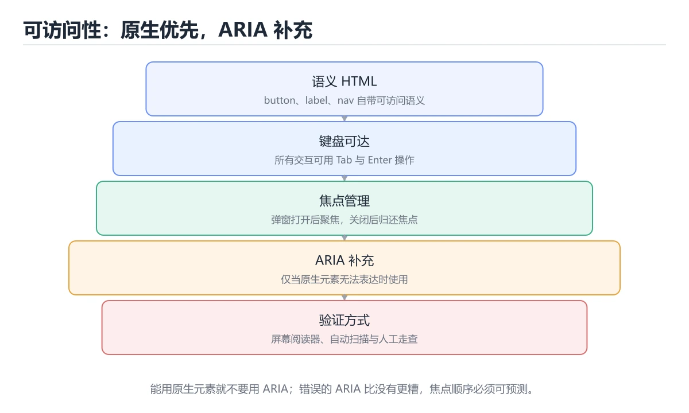
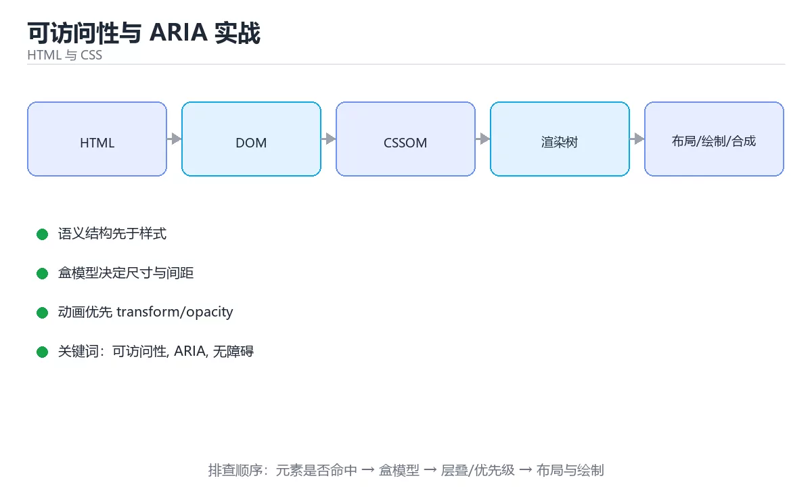

# 可访问性与 ARIA 实战

> 内容更新时间：2026-10-06 · 学习阶段：进阶 · 预计用时：60 分钟





## 学习目标

- 能用自己的话解释可访问性与 ARIA 实战解决了什么问题，而不是只背术语。
- 能说清 「可访问性」、「ARIA」、「无障碍」、「键盘」 之间的关系，并分别举出一个例子。
- 能把 可访问性 放回「可访问性与 ARIA 实战」的知识体系，说明它和 ARIA 的边界。
- 能完成本课练习，并用验收标准检查自己的结果。

> 一句话摘要：原生优先原则、常用 ARIA 属性与键盘焦点管理。

## 前置知识

- 先完成上一课《设计令牌与样式架构》；如果已经掌握，可以直接用本课练习自测。
- 本课阶段：进阶。建议先完成「设计令牌与样式架构」，或确认自己能独立跑通正文里的 viewBox 示例。
- 开始前先复习：可访问性、ARIA、无障碍。
- 如果 基本原则速查 这一步看不懂，先记录具体卡点，再用 viewBox 复现一遍。

## 基本原则速查

| 原则 | 含义 |
| --- | --- |
| 优先用原生元素 | `<button>` 自带键盘与语义，比 `div` 加 ARIA 更可靠 |
| 语义第一、ARIA 补充 | 能用原生语义就不用 ARIA |
| 键盘可达 | 所有交互都能用键盘完成 |
| 焦点可见 | 键盘操作时必须看到焦点位置 |
| 足够对比度 | 正文 4.5:1，大字号 3:1 |
| 不依赖颜色传达信息 | 错误提示同时给出图标或文字 |

**ARIA 第一条规则：能不用 ARIA 就不用 ARIA。** 用错的 ARIA 比没有 ARIA 更糟。

## 常用 ARIA 属性速查

| 属性 | 作用 | 示例 |
| --- | --- | --- |
| `aria-label` | 提供不可见名称 | 图标按钮 `aria-label="关闭"` |
| `aria-labelledby` | 关联已有文本作为名称 | 对话框标题 |
| `aria-describedby` | 关联补充说明 | 输入框提示与错误 |
| `aria-expanded` | 展开状态 | 折叠面板、菜单按钮 |
| `aria-controls` | 关联被控制元素 | 按钮与面板 |
| `aria-current` | 当前项 | 导航当前页 |
| `aria-live` | 动态内容播报 | 表单提交结果 |
| `aria-hidden` | 从无障碍树移除 | 纯装饰图标 |
| `role` | 补充角色 | 自定义组件的角色声明 |
| `tabindex` | 控制键盘可聚焦 | 一般不用，避免 `tabindex>0` |

```html
<!-- 图标按钮：必须给可访问名称 -->
<button type="button" aria-label="关闭对话框">
  <svg aria-hidden="true" focusable="false" viewBox="0 0 24 24">
    <path d="M6 6l12 12M18 6L6 18" />
  </svg>
</button>

<!-- 表单：标签、说明与错误三者关联 -->
<form>
  <label for="email">邮箱</label>
  <input
    id="email"
    name="email"
    type="email"
    autocomplete="email"
    required
    aria-describedby="email-hint email-error"
    aria-invalid="true"
  />
  <p id="email-hint">用于接收通知，不会公开。</p>
  <p id="email-error" role="alert">请输入有效的邮箱地址。</p>
</form>

<!-- 折叠面板：状态与关联 -->
<button type="button" aria-expanded="false" aria-controls="panel-1" id="trigger-1">
  高级设置
</button>
<div id="panel-1" role="region" aria-labelledby="trigger-1" hidden>
  <p>面板内容</p>
</div>

<!-- 动态结果播报：不打断用户，但会被读屏读出 -->
<div role="status" aria-live="polite">已保存 3 项修改</div>
```

```python
from dataclasses import dataclass, field

@dataclass
class A11yIssue:
    selector: str
    rule: str
    severity: str        # blocker / major / minor
    suggestion: str

def audit_nodes(nodes: list) -> list:
    """极简可访问性审计：检查常见阻断项。"""
    issues = []
    for node in nodes:
        tag = node.get("tag", "")
        if tag == "img" and "alt" not in node:
            issues.append(A11yIssue(node["id"], "图片缺少 alt", "blocker", "补充 alt 或标记为装饰"))
        if tag == "div" and node.get("clickable"):
            issues.append(A11yIssue(node["id"], "可点击的 div", "blocker", "改用 button 或补 role/tabindex/键盘事件"))
        if node.get("iconOnlyButton") and not node.get("ariaLabel"):
            issues.append(A11yIssue(node["id"], "图标按钮缺少名称", "major", "添加 aria-label"))
        if node.get("input") and not node.get("hasLabel"):
            issues.append(A11yIssue(node["id"], "输入框没有标签", "major", "用 label for 关联"))
        if node.get("outlineNone") and not node.get("focusVisibleStyle"):
            issues.append(A11yIssue(node["id"], "移除了焦点样式", "major", "用 :focus-visible 自定义"))
        if node.get("contrast", 10) < 4.5 and not node.get("largeText"):
            issues.append(A11yIssue(node["id"], "对比度不足", "major", "提高对比度到 4.5:1"))
    return issues

def summary(issues: list) -> dict:
    counts = {}
    for issue in issues:
        counts[issue.severity] = counts.get(issue.severity, 0) + 1
    return {
        "counts": counts,
        "blocking": [i.selector for i in issues if i.severity == "blocker"],
    }

nodes = [
    {"id": "hero-img", "tag": "img"},
    {"id": "card", "tag": "div", "clickable": True},
    {"id": "close-btn", "iconOnlyButton": True},
]
print(summary(audit_nodes(nodes)))
```

## 键盘与焦点速查

| 场景 | 要求 |
| --- | --- |
| Tab 顺序 | 与视觉顺序一致，避免 `tabindex` 正值 |
| 对话框 | 打开时焦点移入，关闭后回到触发元素，并限制焦点在内部 |
| 菜单与下拉 | 支持方向键、Esc 关闭、回车确认 |
| 跳过链接 | 长导航前列提供「跳到主内容」 |
| 焦点陷阱 | 只在模态组件内使用，不可全局 |
| 自定义组件 | 补齐 role、状态属性与键盘交互 |

## 常见错误与排查

| 容易踩的做法 | 实际现象 | 原因与正确做法 |
| --- | --- | --- |
| 用 `div` 当按钮 | 键盘无法聚焦、读屏不识别 | 用 `<button>`，必要时补 role 与键盘事件 |
| 图标按钮不写名称 | 读屏只念「按钮」 | 加 `aria-label` |
| 把装饰图标暴露给读屏 | 噪声多 | 加 `aria-hidden="true"` |
| `outline: none` 去掉焦点 | 键盘用户迷路 | 用 `:focus-visible` 自定义样式 |
| 用颜色单独表示错误 | 色盲用户无法识别 | 同时给图标与文字提示 |
| 滥用 `role` 覆盖原生语义 | 行为与语义不符 | 优先原生元素，ARIA 只做补充 |
| 模态框不管理焦点 | 焦点跑到背景内容 | 焦点移入、循环、关闭后归还 |

## 复习与自测

- [ ] 交互元素优先使用原生标签。
- [ ] 所有图标按钮都有可访问名称。
- [ ] 表单控件都有关联标签，错误提示可被播报。
- [ ] 键盘可完整操作且焦点可见。
- [ ] 对比度达标，信息不只靠颜色传达。

## 动手练习

> 本课练习重点：围绕「可访问性、ARIA、无障碍」完成复述、实验和交付，每个结果都要能被别人检查。

先让 viewBox 的内容结构正确，再处理视觉与响应式细节。

### 练习 1：建立心智模型（10 分钟）

合上教程，用 3～5 句话回答：

1. 可访问性与 ARIA 实战解决了什么问题？
2. 如果没有它，会出现什么具体后果？
3. 它和「ARIA」是什么关系？

验收标准：用自己的话解释 可访问性，并给出一个它不成立的反例。

### 练习 2：做一次可控实验（20 分钟）

从正文中选一个最小示例，完成以下操作：

1. 先预测修改一个参数、输入或步骤后的结果。
2. 再实际执行或逐步推演，记录真实结果。
3. 如果结果与预测不同，写出差异原因。

**验收标准**：把 viewBox 当作原例，改动一次ARIA的取值，记录命令、输出与差异原因；五步里缺任意一步都算未完成。

### 练习 3：交付一个小结果（30 分钟）

先完成 基本原则速查 的最小页面，再补交互与响应式。

任务要求：

- 结果必须能被别人检查，不能只写“我已经理解了”。
- 至少覆盖「可访问性」和「ARIA」两个关键词。
- 写出 1 个仍然不确定的问题，以及下一步如何验证。

> 提示：时间有限时优先做练习 1 和练习 2；练习 3 可以拆成两次完成。

## 本课小结

- 核心问题：可访问性与 ARIA 实战不是孤立术语，而是在「HTML 与 CSS」中解决一类具体问题。
- 关键关系：先分清「可访问性」与「ARIA」的职责，再理解「无障碍」的适用边界。
- 判断标准：能解释 可访问性 的正常场景、边界条件和失败场景，才算真正掌握。
- 下一步：把 viewBox 的实验结论记成三句话，然后进入测验。

## 验证命令与预期输出

「可访问性与 ARIA 实战」不能只看「能编译」，还要能按固定命令复现结果。下表给出最低验证集：

| 阶段 | 命令 | 预期输出 |
| --- | --- | --- |
| 安装依赖 | `python -m pip install -r requirements.txt` | 依赖安装完成，没有版本冲突 |
| 语法检查 | `python -m compileall .` | 所有模块编译通过 |
| 运行测试 | `python -m pytest -q` | 测试全部通过，失败用例数为 0 |
| 启动示例 | `python main.py` | 服务启动并输出监听地址 |

### 验收证据

- [ ] 保存依赖安装和启动命令的完整输出。
- [ ] 测试覆盖 ARIA 的核心规则，并包含一次可预期的失败。
- [ ] 连续两次触发 ARIA，检查数据与计数是否被重复累加。
- [ ] 记录一次失败状态码、错误日志和恢复步骤。
- [ ] 在 README 中写明 可访问性 所需的环境版本、启动方式和回滚方式。

### 回归与回滚

1. 用临时环境验证 viewBox，确认无误后再对真实数据执行。
2. 修改一处逻辑后重跑全部验证命令，确认没有回归。
3. 若失败，回滚到上一个可运行版本并保留失败日志。
4. 定位原因后补一条自动化测试，再重新执行发布流程。
5. 把教训写入项目复盘或本课笔记，形成下一次的检查项。

## 可运行练习

### 任务 1：先跑通，再解释

```python
from dataclasses import dataclass, field

@dataclass
class A11yIssue:
    selector: str
    rule: str
    severity: str        # blocker / major / minor
    suggestion: str

def audit_nodes(nodes: list) -> list:
    """极简可访问性审计：检查常见阻断项。"""
    issues = []
    for node in nodes:
        tag = node.get("tag", "")
        if tag == "img" and "alt" not in node:
            issues.append(A11yIssue(node["id"], "图片缺少 alt", "blocker", "补充 alt 或标记为装饰"))
        if tag == "div" and node.get("clickable"):
            issues.append(A11yIssue(node["id"], "可点击的 div", "blocker", "改用 button 或补 role/tabindex/键盘事件"))
        if node.get("iconOnlyButton") and not node.get("ariaLabel"):
            issues.append(A11yIssue(node["id"], "图标按钮缺少名称", "major", "添加 aria-label"))
        if node.get("input") and not node.get("hasLabel"):
            issues.append(A11yIssue(node["id"], "输入框没有标签", "major", "用 label for 关联"))
        if node.get("outlineNone") and not node.get("focusVisibleStyle"):
            issues.append(A11yIssue(node["id"], "移除了焦点样式", "major", "用 :focus-visible 自定义"))
        if node.get("contrast", 10) < 4.5 and not node.get("largeText"):
            issues.append(A11yIssue(node["id"], "对比度不足", "major", "提高对比度到 4.5:1"))
    return issues

def summary(issues: list) -> dict:
    counts = {}
    for issue in issues:
        counts[issue.severity] = counts.get(issue.severity, 0) + 1
    return {
        "counts": counts,
        "blocking": [i.selector for i in issues if i.severity == "blocker"],
    }

nodes = [
    {"id": "hero-img", "tag": "img"},
    {"id": "card", "tag": "div", "clickable": True},
    {"id": "close-btn", "iconOnlyButton": True},
]
print(summary(audit_nodes(nodes)))
```

### 任务 2：只改一个条件

把「可访问性与 ARIA 实战」的最小示例复制一份，只改一个条件再跑一次：

- 改动点：把 ARIA 换成边界值，其他输入保持原样。
- 预测：先写下「可访问性与 ARIA 实战」在改动后的输出或错误信息，再运行。
- 记录：对照改动前后的结果，指出差异出在哪一步。
- 验收：换回原条件能复现原结果，改动只影响可访问性。

### 任务 3：迁移到自己的数据

换一个 ARIA 场景重做一次，确认结论不是只对示例数据成立。

## 故障现场

### 现场 1：用 div 当按钮

**症状**：在《可访问性与 ARIA 实战》的复现场景中，键盘无法聚焦、读屏不识别。

**根因**：触发点是把“用 div 当按钮”当成安全做法。它没有满足《可访问性与 ARIA 实战》要求的前提，因此先表现为“键盘无法聚焦、读屏不识别”；排查时先完整复现这一段，再核对输入、配置与依赖。

**修复**：针对《可访问性与 ARIA 实战》的问题，用 <button>，必要时补 role 与键盘事件。

**验证**：先在《可访问性与 ARIA 实战》中记录“用 div 当按钮”留下的失败证据，再执行“用 <button>，必要时补 role 与键盘事件”并重放；确认错误路径变为明确结果，且修复没有掩盖同类故障。

### 现场 2：图标按钮不写名称

**症状**：在《可访问性与 ARIA 实战》的复现场景中，读屏只念「按钮」。

**根因**：当出现“图标按钮不写名称”时，执行路径已经绕过了《可访问性与 ARIA 实战》的关键约束，最终以“读屏只念「按钮」”暴露出来；修复前必须先确认约束在哪里失效。

**修复**：针对《可访问性与 ARIA 实战》的问题，加 aria-label。

**验证**：先在《可访问性与 ARIA 实战》中记录“图标按钮不写名称”留下的失败证据，再执行“加 aria-label”并重放；确认错误路径变为明确结果，且修复没有掩盖同类故障。

### 现场 3：outline: none 去掉焦点

**症状**：在《可访问性与 ARIA 实战》的复现场景中，键盘用户迷路。

**根因**：触发点是把“outline: none 去掉焦点”当成安全做法。它没有满足《可访问性与 ARIA 实战》要求的前提，因此先表现为“键盘用户迷路”；排查时先完整复现这一段，再核对输入、配置与依赖。

**修复**：针对《可访问性与 ARIA 实战》的问题，用 :focus-visible 自定义样式。

**验证**：先在《可访问性与 ARIA 实战》中记录“outline: none 去掉焦点”留下的失败证据，再执行“用 :focus-visible 自定义样式”并重放；确认错误路径变为明确结果，且修复没有掩盖同类故障。

## 本课复习清单

离开本课前，逐项确认：

- [ ] 不看解析，能说出「需要实现一个「保存」按钮，正确的做法是？」的判断依据。
- [ ] 不看解析，能说出「图标按钮（只有图形没有文字）必须添加什么？」的判断依据。
- [ ] 不看解析，能说出「为了让键盘用户看到焦点位置，应该？」的判断依据。
- [ ] 不看解析，能说出「关于 ARIA，正确的理念是？」的判断依据。
- [ ] 不看解析，能说出「打开模态对话框时，焦点管理应该怎么做？」的判断依据。
- [ ] 用 可访问性 构造一个正常输入和一个边界输入，分别记录输出与判断依据。
- [ ] 把本课最容易混淆的两个概念写成一句话对照。

| 复盘项 | 记录 |
| --- | --- |
| 已经能独立解释的考点 |  |
| 仍然说不清的概念 |  |
| 下一步验证动作 |  |

## 术语速查

| 术语 | 一句话说明 |
| --- | --- |
| `可访问性` | 让不同能力、设备和辅助技术的用户都能理解并操作界面。 |
| `ARIA` | 无障碍富互联网应用规范：用 role 与 aria-* 属性给自定义控件补上屏幕阅读器需要的语义。 |
| `可访问名称` | 控件对外播报的名字，图标按钮要用 aria-label 或可见文本提供，否则读屏只会念出「按钮」。 |
| `焦点管理` | 用可见的焦点样式和合理的 Tab 顺序把键盘用户的位置说清楚，不要用 outline: none 抹掉它。 |

## 考点精讲

### 考点 1：顺序排列·可访问性

- **题目**：按“可访问性与 ARIA 实战”中 可访问性、ARIA、无障碍 的实践顺序，把四个步骤排成从准备到复盘的合理顺序。
- **判断依据**：题干的正确项是固定版本与证据，把“可访问性与 ARIA 实战”的结论写成可复现记录。在「可访问性与 ARIA 实战」里，在本课的练习里，顺序应当是：先明确 可访问性 的输入、输出与约束 → 写出最小示例并核对 ARIA 的基线结果 → 只改一个变量，记录边界与失败路径的变化 → 固定版本与证据，把本课的结论写成可复现记录。这个顺序把 可访问性 的输入、输出和约束放在最前面，在可访问性与 ARIA 实战里避免概念没对齐就开始调参。第二步用 ARIA 建立可核对的基线，在可访问性与 ARIA 实战里第三步才允许改变一个变量并观察失败路径。

### 考点 2：概念判断·可访问性

- **题目**：图标按钮（只有图形没有文字）必须添加什么？
- **判断依据**：在「可访问性与 ARIA 实战」里，aria-label 提供可访问名称。没有可见文本时必须用 aria-label 让读屏能播报按钮用途。回到「可访问性与 ARIA 实战」的正文示例，用“图标按钮（只有图形没有文字）必须添加”走一遍可访问性、ARIA、无障碍的完整流程，能复现的结论才可以保留。

### 考点 3：多选辨析·可访问性

- **题目**：围绕“可访问性与 ARIA 实战”中的 可访问性、ARIA、无障碍，下列哪两项是本课强调的实践判断？
- **判断依据**：本课把可访问性与 ARIA 实战拆成概念、示例与故障现场三部分，因此判断 可访问性 时必须同时交代输入、输出和失败路径，这使“学习 可访问性 时要同时说明输入、输出和失败路径，不能只看正常流程”成立。在可访问性与 ARIA 实战里，判断 ARIA 时要固定版本与边界输入，所以“验证 ARIA 时要固定版本并覆盖边界输入，结论才可复现”才可复现。

### 考点 4：概念判断·可访问性

- **题目**：关于 ARIA，正确的理念是？
- **判断依据**：在「可访问性与 ARIA 实战」里，结论应落在「能使用原生语义就不用 ARIA」。ARIA 只是补充，错误的 ARIA 会破坏原生语义，因此遵循「原生优先，ARIA 兜底」。在「可访问性与 ARIA 实战」里，这道题要求区分概念与边界，「能使用原生语义就不用 ARIA」只有在题干给出的前提下才成立，而「ARIA 越多越好」、「ARIA 可以替代键盘支持」缺少同一组条件。

### 考点 5：概念判断·可访问性

- **题目**：打开模态对话框时，焦点管理应该怎么做？
- **判断依据**：在「可访问性与 ARIA 实战」里，把焦点移入对话框，限制在内部。完整焦点管理保证键盘与读屏用户不会在背景内容中迷失，并且能顺利返回。这道题的关键在「可访问性与 ARIA 实战」的可访问性、ARIA、无障碍：先确认题干“打开模态对话框时”问的是哪一步，再排除偷换前提的选项。

### 考点 6：排错·可访问性

- **题目**：阅读「可访问性与 ARIA 实战」的代码片段，下面哪项判断是正确的？
- **判断依据**：把“用 button 标签”代回「可访问性与 ARIA 实战」里“阅读可访问性与 ARIA 实战的代码片段”的例子核对，条件一旦改变，结论就要用可访问性、ARIA、无障碍重新推导。「可访问性与 ARIA 实战」要求先交代可访问性、ARIA、无障碍的前提再下结论，所以“用 button 标签”只在题干“阅读可访问性与”给定的条件下成立。

## English Overview

**Title:** Accessibility & ARIA

**Summary:** Semantic-first, ARIA attributes and focus management.

**Category:** HTML & CSS
**Level:** 进阶
**Key terms:** 可访问性, ARIA, 无障碍, 键盘, 焦点, 对比度

## 内容元数据

- 内容版本：v2.0
- 最后更新：2026-10-06
- 学习阶段：进阶
- 适用环境：现代浏览器（Chrome/Firefox/Safari）
；本课聚焦 可访问性。
- 内容来源：内置结构化课程与工程实践整理
- 相关主题：可访问性、ARIA、无障碍、键盘、焦点、对比度
- 质量版本：P0 测验标准 + P1 覆盖扩展 + P2 体验补全

## 项目专属规格：可访问性与 ARIA 实战

### 核心场景

原生优先原则、常用 ARIA 属性与键盘焦点管理。 项目目标是把「可访问性、ARIA、无障碍、键盘、焦点、对比度」落实为可运行、可测试、可回滚的交付物。

### 架构与数据流

```text
用户/输入 → 接口或命令 → 领域逻辑 → 存储/外部依赖 → 输出与监控
                         ↘ 失败分类 → 重试/补偿 → 回滚
```

### 最小数据模型

| 对象 | 关键字段 | 约束 |
| --- | --- | --- |
| 输入实体 | 可访问性、时间、来源 | 必填校验、长度限制、幂等键 |
| 任务实体 | 状态、优先级、创建时间 | 状态迁移合法、不可重复执行 |
| 结果实体 | 输出、错误码、耗时 | 可序列化、错误可解释 |
| 审计记录 | 操作者、动作、结果、时间 | 不可篡改、可查询、脱敏 |

### 验收场景

1. 正常路径：最小输入得到预期输出，并留下日志与指标。
2. 边界路径：可访问性 的空值、最大值、重复数据和超长内容都得到明确处理。
3. 失败路径：依赖超时或不可用时能快速失败、重试或降级。
4. 幂等路径：同一请求执行两次不会产生重复副作用。
5. 回滚路径：撤掉 viewBox 的变更后，数据与资源都回到变更前的状态。

## 项目交付物

### 建议仓库结构

```text
src/
tests/
docs/
README.md
```

### 测试矩阵

| 层级 | 覆盖内容 | 最低数量 | 通过标准 |
| --- | --- | ---: | --- |
| 单元测试 | 领域规则、边界和错误分类 | 8 | 正常、边界、失败路径全部通过 |
| 集成测试 | 数据库、网络、文件或平台边界 | 3 | 使用真实边界且可重复运行 |
| 端到端测试 | 核心用户路径 | 1 | 从输入到输出完整跑通 |
| 手动验收 | 文档中列出的 5 个场景 | 5 | 有命令、输出和结论记录 |

### 验收数据

```json
{
  "project": "a11y_aria",
  "scenario": "可访问性的正常路径",
  "input": {"case": "normal", "value": "viewBox"},
  "expected": {"ok": true, "checks": ["可访问性可复现", "ARIA有记录"]},
  "failure_case": {"case": "ARIA越界或缺失", "error": "validation_error"},
  "idempotency_key": "a11y_aria-001"
}
```

### 复盘模板

| 问题 | 记录 |
| --- | --- |
| 原目标是什么？ | 用一句话描述可验收目标 |
| 实际发生了什么？ | 时间线、指标和关键日志 |
| 哪个假设被推翻？ | 根因与促成因素 |
| 如何回滚？ | 步骤、耗时和数据校验 |
| 下一步做什么？ | 负责人、期限和验证方式 |

> 项目验收围绕「可访问性、ARIA、无障碍」：至少完成一次正常路径、一次边界输入、一次失败恢复和一次幂等检查。

## 参考资料与复核

- 最后复核：2026-10-04
- 下次复核：2027-08-17
- 复核范围：版本兼容、API 行为、安全建议与工程实践
- 来源性质：官方文档、标准或权威教材；正文为离线教学重组

| 参考资料 | 本课用途 |
| --- | --- |
| [MDN 无障碍](https://developer.mozilla.org/docs/Web/Accessibility) | 可访问性与语义 |
| [MDN DOM](https://developer.mozilla.org/docs/Web/API/Document_Object_Model) | DOM 树与浏览器 API |
| [W3C Web 标准](https://www.w3.org/TR/) | HTML、CSS 与 Web 标准 |

> 「可访问性与 ARIA 实战」的链接用于离线阅读后的延伸核对；App 不会自动联网。

<!-- p1-project-review:start -->
## 交付评审：评分表、决策记录与证据链

「可访问性与 ARIA 实战」的验收不能只看功能能不能跑通。下面把正文里的交付物、验证命令和关键设计点整理成一张评审表，按表逐项留下证据即可。

### 一、「可访问性与 ARIA 实战」的交付物评分表

| 交付物 | 权重 | 合格线 | 需要的证据 |
| --- | ---: | --- | --- |
| 核心链路 | 34% | 能在干净环境复现，且失败路径有明确处理 | 命令与输出、对应测试、一次失败与恢复记录 |
| 测试与验收记录 | 33% | 能在干净环境复现，且失败路径有明确处理 | 命令与输出、对应测试、一次失败与恢复记录 |
| 运行与回滚说明 | 33% | 能在干净环境复现，且失败路径有明确处理 | 命令与输出、对应测试、一次失败与恢复记录 |

「可访问性与 ARIA 实战」的评分先看证据再打分：任意一项只要拿不出可复现的命令或测试，该项按 0 分计，不允许用「基本完成」代替。

### 二、需要写下来的决策（ADR）

| 决策点 | 本课给出的做法 | 备选方案 | 代价与回滚 |
| --- | --- | --- | --- |
| 架构与数据流 | 用户/输入 → 接口或命令 → 领域逻辑 → 存储/外部依赖 → 输出与监控 | 不做「架构与数据流」，沿用最朴素的实现（需要额外补一次对照实验） | 若「架构与数据流」出问题，回到上一版本并按本课验收场景重跑 |

ADR 不需要长：每个决策三行就够——选了什么、放弃了什么、出问题怎么退。评审时只检查这三行是否和「可访问性与 ARIA 实战」的实际代码一致。

### 三、「可访问性与 ARIA 实战」的交付证据链

本课未给出可执行命令，用下面的最小证据集代替：

1. 一条从零开始的环境准备命令。
2. 一条跑通核心链路的命令及其完整输出。
3. 一条触发失败的命令，以及恢复后的验证结果。

把「可访问性与 ARIA 实战」的上表整理成一个 evidence/ 目录：每条命令一个文件，文件名带日期，内容包含版本、命令与输出。评审时直接按目录核对，不再口头确认。

### 四、「可访问性与 ARIA 实战」的验收指标

| 指标 | 目标值 | 测量方式 | 不达标时的动作 |
| --- | --- | --- | --- |
| 可访问性 的核心路径耗时与失败率 | 用本课正文给出的阈值，没有就写实测基线 | 固定环境重复三次取中位数 | 回到对应小节定位，先修原因再重测 |
| 资源占用峰值与回收情况 | 用本课正文给出的阈值，没有就写实测基线 | 固定环境重复三次取中位数 | 回到对应小节定位，先修原因再重测 |
| 验收场景的通过率 | 用本课正文给出的阈值，没有就写实测基线 | 固定环境重复三次取中位数 | 回到对应小节定位，先修原因再重测 |

指标必须能用一条命令或一次操作测出来；写不出测量方式的指标，在「可访问性与 ARIA 实战」的评审里一律视为未定义。

### 五、评审记录模板

| 记录项 | 填写要求 |
| --- | --- |
| 项目标识 | `a11y_aria` |
| 本次范围 | 说明这一轮交付了「可访问性与 ARIA 实战」的哪些部分 |
| 未完成项 | 列出与 可访问性 相关但本轮未做的内容 |
| 证据位置 | 指向 evidence/ 目录下的具体文件 |
| 风险与回滚 | 写清剩余风险、回滚步骤和验证方式 |
| 结论 | 通过 / 有条件通过 / 不通过，三者选一 |

「可访问性与 ARIA 实战」评审结束后把这张表填完并归档；下一轮迭代直接读上一次的「未完成项」与「风险与回滚」，避免重复讨论同一个问题。
<!-- p1-project-review:end -->
