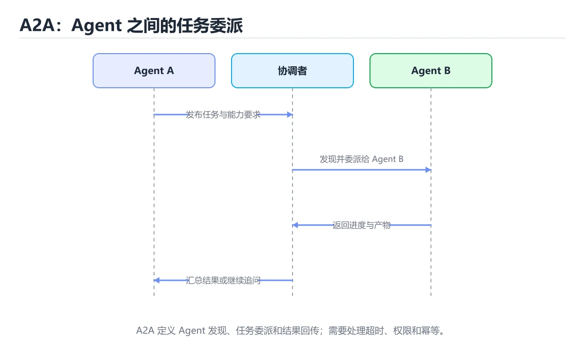
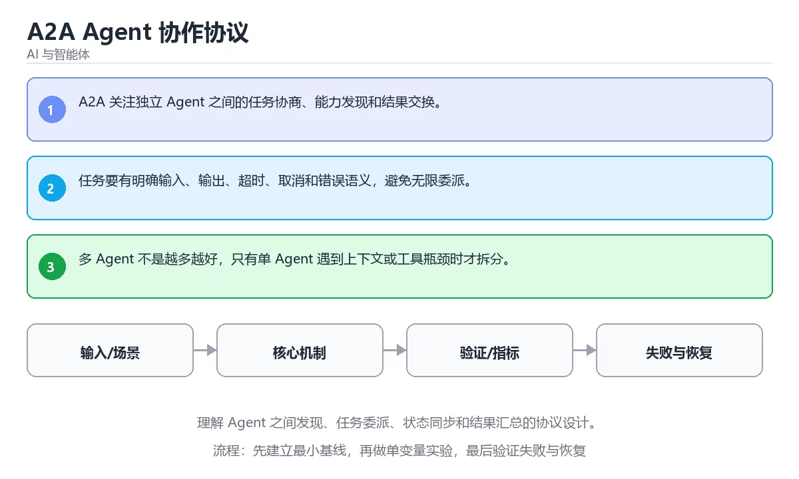

# 本课主题





> 内容更新时间：2026-10-03 · 学习阶段：高级 · 预计用时：22 分钟

## 学习目标

- 能用自己的话解释：A2A 关注独立 Agent 之间的任务协商、能力发现和结果交换。
- 能用自己的话解释：任务要有明确输入、输出、超时、取消和错误语义，避免无限委派。
- 能用自己的话解释：多 Agent 不是越多越好，只有单 Agent 遇到上下文或工具瓶颈时才拆分。
- 能把本课知识放回「AI 与智能体」，并完成练习与测验。

## 前置知识

- 已完成「AI 与智能体」的基础课程，能运行正文中的最小示例。
- 本课关键词：A2A、多智能体、任务委派、协议。
- 遇到不熟悉的术语先记录问题，完成练习后再回读。

## 核心知识

### 1. A2A 关注独立 Agent 之间的任务协商、能力发现和结果交换。

- 关键做法：先用最小示例建立基线，再逐步加入边界、失败和性能条件。
- 验证标准：结果可复现、错误可解释、边界有测试、失败能恢复。

### 2. 任务要有明确输入、输出、超时、取消和错误语义，避免无限委派。

### 3. 多 Agent 不是越多越好，只有单 Agent 遇到上下文或工具瓶颈时才拆分。

## 关键流程

```text
输入 → 校验 → 核心处理 → 验证 → 记录指标 → 失败恢复
```

## 实践路径

1. 用一句话复述本课要解决的问题。
2. 跑通正文中的最小示例并记录基线。
3. 只改变一个输入或参数，预测并验证结果。
4. 补一个失败路径，记录错误、恢复和指标。
5. 把结论写成可复现的笔记或测试。

## 常见误区

| 误区 | 后果 | 修正 |
| --- | --- | --- |
| 只记术语不做实验 | 遇到真实问题无法判断 | 用最小输入跑通并记录结果 |
| 只测正常路径 | 边界和故障上线才暴露 | 补空值、极值和依赖失败 |
| 没有基线就优化 | 无法证明改进有效 | 先测量再修改 |
| 忽略成本与安全 | 性能和风险失控 | 同时记录资源、权限与失败代价 |

## 动手练习

1. 合上教程，用 3～5 句话解释本课主题。
2. 从正文选一个例子，改变一个条件并预测结果。
3. 设计一个失败场景，写出止损与恢复步骤。

**验收标准**：留下输入、命令、输出、差异和下一步问题。

## 本课小结

- 本课属于「AI 与智能体」，核心关键词是 A2A、多智能体、任务委派、协议。
- 先保证正确与可复现，再讨论性能和扩展。
- 完成练习和测验后，把仍然不确定的问题写成下一轮验证清单。

> 本课由 P1 内容扩展生成，重点补充原有课程缺失的主题与工程边界。

## 可运行练习

### 任务 1：先跑通，再解释

```python
def score(answer: str) -> int:
    return 1 if answer.strip() else 0

print(score("agent"))
```

### 任务 2：只改一个条件

### 任务 3：迁移到自己的数据

用同一套思路处理一组你自己的数据或场景，保持输出格式与任务 1 一致。

## 故障现场

### 现场 1：本课的 A2A 常规用例通过，但边界用例失败

**症状**：在本课的练习或生产场景里出现“本课的 A2A 常规用例通过，但边界用例失败”。

**复现**：准备一组最小输入，只保留触发“本课的 A2A 常规用例通过，但边界用例失败”的必要条件，连续运行两次确认结果稳定。

**定位**：围绕“A2A 的前置条件与取值边界没有写进代码，默认值掩盖了空值和极值”检查调用链、输入数据和环境配置，先验证假设再改代码。

**预防**：把“本课的 A2A 常规用例通过，但边界用例失败”写成一条自动化用例，并在本课的验收清单里保留对应检查项。

### 现场 2：本课的 多智能体 结果在两次运行之间不一致

**症状**：在本课的练习或生产场景里出现“本课的 多智能体 结果在两次运行之间不一致”。

**复现**：准备一组最小输入，只保留触发“本课的 多智能体 结果在两次运行之间不一致”的必要条件，连续运行两次确认结果稳定。

**定位**：围绕“多智能体 依赖了当前版本、执行顺序或共享状态，单次运行无法暴露差异”检查调用链、输入数据和环境配置，先验证假设再改代码。

**预防**：把“本课的 多智能体 结果在两次运行之间不一致”写成一条自动化用例，并在本课的验收清单里保留对应检查项。

### 现场 3：离线评测分数很高，线上仍然频繁给出错误答案

**定位**：围绕“评测集与真实输入分布不一致，A2A 的提示词或检索结果没有覆盖失败场景”检查调用链、输入数据和环境配置，先验证假设再改代码。

## 深入补充：本课主题 的取舍与边界

### 一、把概念放回真实约束

学习本课主题时，最容易只记住结论而忽略前提。先写出三个约束：数据规模、时间预算、可接受的失败方式；再判断 A2A 与 多智能体 在这些约束下是否仍然成立。只要约束改变，原来的最优解就可能变成错误解。

| 维度 | 要回答的问题 | 常见做法 | 失败信号 |
| --- | --- | --- | --- |
| 数据 | A2A 的训练或检索数据从哪来、质量如何 | 清洗、去重、标注与版本化 | 评测集泄漏或分布漂移 |
| 模型 | 多智能体 的能力边界与成本是多少 | 基线对比、离线评测、灰度发布 | 指标好看但线上任务失败 |
| 评测 | 如何证明改动真的有效 | 固定评测集、人工抽检、A/B | 只比较单例输出 |
| 安全 | 失败时会不会泄露或越权 | 权限校验、内容过滤、审计 | 提示注入或数据外泄 |

### 二、三个容易混淆的边界

2. **把“平均值”当成“全部”**：A2A 的指标好看，不代表尾部请求、冷启动或失败重试也好看。
3. **把“当前版本”当成“永久行为”**：多智能体 依赖的默认值、API 或性能特征都可能随版本变化，需要固定版本并保留回归用例。

### 三、一个生产场景

假设团队要在真实系统里使用本课主题：第一周先做小流量验证，记录 A2A 的基线与异常；第二周扩大输入规模，观察 多智能体 是否成为瓶颈；第三周再做故障演练，主动注入超时、重复请求和依赖不可用，确认系统能降级、能重试、能恢复。每一步都要留下指标、日志和结论，而不是只留下“感觉更快了”。

### 四、自测清单

- 能否用一句话说出本课主题解决的核心问题与不适用场景？
- 能否画出 A2A 的数据流或状态变化，并标出失败路径？
- 能否给出一个反例，证明某个看似合理的结论在边界条件下不成立？
- 能否写出一条可复现的验证命令，让别人独立得到相同结论？

### 五、AI 工程补充

在本课主题里，模型输出只是系统的一部分：输入要先经过权限与数据质量检查，检索或工具调用要有超时和降级，输出要经过引用核验或规则校验，最后记录 token、延迟、失败类型和人工反馈。评测时至少准备固定题、边界题和对抗题，并把 A2A 与 多智能体 的指标分开记录；否则一次提示词改动看似提升体验，实际可能只是评测样本泄漏或随机波动。

## 本课复习清单

离开本课前，逐项确认：

- [ ] 不看解析，能说出「关于「A2A 关注独立 Agent 之间的…」，下列说法正确的是？」的判断依据。
- [ ] 不看解析，能说出「关于「任务要有明确输入、输出、超时、取消和…」，下列说法正确的是？」的判断依据。
- [ ] 不看解析，能说出「关于「多 Agent 不是越多越好 只有单…」，下列说法正确的是？」的判断依据。
- [ ] 不看解析，能说出「本课的核心学习目标是什么？」的判断依据。
- [ ] 至少运行一次本课示例，记录输入、输出和一个边界情况。
- [ ] 把本课最容易混淆的两个概念写成一句话对照。

| 复盘项 | 记录 |
| --- | --- |
| 已经能独立解释的考点 |  |
| 仍然说不清的概念 |  |
| 下一步验证动作 |  |

## 逐节复习与自检

下面按正文顺序回顾每一节，并给出一个自检问题；说不清的地方回到原章节补课。

### 核心知识

自检：这一节与相邻主题的边界在哪里？

### 动手练习

自检：如果去掉这一节里的一个前提，结论会怎样变化？

### 验证步骤

制造一次错误输入，记录错误信息与修复方式。

## 易错点回顾

- **关于「A2A 关注独立 Agent 之间的…」，下列说法正确的是？**：正确答案是「A2A 关注独立 Agent 之间的任务协商、能力发现和结果交换。
- **关于「任务要有明确输入、输出、超时、取消和…」，下列说法正确的是？**：正确答案是「任务要有明确输入、输出、超时、取消和错误语义，避免无限委派。
- **关于「多 Agent 不是越多越好 只有单…」，下列说法正确的是？**：正确答案是「多 Agent 不是越多越好，只有单 Agent 遇到上下文或工具瓶颈时才拆分。
- **本课的核心学习目标是什么？**：正确答案是「理解 Agent 之间发现、任务委派、状态同步和结果汇总的协议设计。

## 深度追问与自测

### 追问 1：关于「A2A 关注独立 Agent 之间的…」，下列说法正确的是？

- 先写下判断，再对照：A2A 关注独立 Agent 之间的任务协商、能力发现和结果交换。
- 检查点：如果输入换成边界值，这个结论还需要补充哪个前提？

### 追问 2：关于「任务要有明确输入、输出、超时、取消和…」，下列说法正确的是？

- 先写下判断，再对照：任务要有明确输入、输出、超时、取消和错误语义，避免无限委派。

### 追问 3：关于「多 Agent 不是越多越好 只有单…」，下列说法正确的是？

- 先写下判断，再对照：多 Agent 不是越多越好，只有单 Agent 遇到上下文或工具瓶颈时才拆分。

### 追问 4：本课的核心学习目标是什么？

- 先写下判断，再对照：理解 Agent 之间发现、任务委派、状态同步和结果汇总的协议设计。

## 术语速查

| 术语 | 本课语境 |
| --- | --- |
| `A2A` | 本课围绕该主题展开，结合正文与代码示例理解它的适用边界。 |
| `多智能体` | 本课围绕该主题展开，结合正文与代码示例理解它的适用边界。 |
| `任务委派` | 本课围绕该主题展开，结合正文与代码示例理解它的适用边界。 |
| `协议` | 本课围绕该主题展开，结合正文与代码示例理解它的适用边界。 |

## 零基础精讲：把本课主题真正讲透

### 先建立一个直觉

把 AI 系统看成一条流水线：数据进入模型，模型产生候选结果，工具与策略再决定哪些结果能真正执行。每个环节都要有可测的输入、输出和失败处理。

本课的摘要可以当作一张地图：理解 Agent 之间发现、任务委派、状态同步和结果汇总的协议设计。

### 逐步拆解

2. 描述处理过程。把「A2A、多智能体、任务委派、协议」映射到具体步骤，每步都要求能单独验证。
3. 定义输出。输出不仅包括正常结果，还包括错误码、日志、指标和资源释放状态。
4. 找出一条失败路径。让错误尽早暴露，并说明重试、降级、回滚或人工处理的边界。
5. 用一个小例子贯穿全过程。先手算或预测结果，再运行代码或实验，最后解释差异。

### 把正文串成一条执行链

- **1. A2A 关注独立 Agent 之间的任务协商、能力发现和结果交换。**：1. A2A 关注独立 Agent 之间的任务协商、能力发现和结果交换
- **2. 任务要有明确输入、输出、超时、取消和错误语义，避免无限委派。**：2. 任务要有明确输入、输出、超时、取消和错误语义，避免无限委派
- **3. 多 Agent 不是越多越好，只有单 Agent 遇到上下文或工具瓶颈时才拆分。**：3. 多 Agent 不是越多越好，只有单 Agent 遇到上下文或工具瓶颈时才拆分
- **考点 1：关于「A2A 关注独立 Agent 之间的…」，下列说法正确的是？**：考点 1：关于「A2A 关注独立 Agent 之间的…」，下列说法正确的是
- **考点 2：关于「任务要有明确输入、输出、超时、取消和…」，下列说法正确的是？**：考点 2：关于「任务要有明确输入、输出、超时、取消和…」，下列说法正确的是
- **考点 3：关于「多 Agent 不是越多越好 只有单…」，下列说法正确的是？**：考点 3：关于「多 Agent 不是越多越好 只有单…」，下列说法正确的是

### 从测验反推易错点

**检查点 1：关于「A2A 关注独立 Agent 之间的…」，下列说法正确的是？**

- 参考判断：A2A 关注独立 Agent 之间的任务协商、能力发现和结果交换。
- 自问：如果去掉题干里的一个限定词，结论还成立吗？

**检查点 2：关于「任务要有明确输入、输出、超时、取消和…」，下列说法正确的是？**

- 参考判断：任务要有明确输入、输出、超时、取消和错误语义，避免无限委派。

**检查点 3：关于「多 Agent 不是越多越好 只有单…」，下列说法正确的是？**

- 参考判断：多 Agent 不是越多越好，只有单 Agent 遇到上下文或工具瓶颈时才拆分。

**检查点 4：本课的核心学习目标是什么？**

- 参考判断：理解 Agent 之间发现、任务委派、状态同步和结果汇总的协议设计。

**检查点 5：以下哪些术语与本课主题直接相关？（多选）**

- 参考判断：A2A、多智能体

### 工程排错顺序

| 先查什么 | 要得到的证据 | 判断标准 |
| --- | --- | --- |
| 模型输入是否经过长度、格式与敏感信息检查？ | 日志、输入样例、测试或指标 | 能复现并解释，才算定位 |
| 工具调用是否最小权限、可超时、可取消？ | 日志、输入样例、测试或指标 | 能复现并解释，才算定位 |
| 输出是否有引用、置信度或人工复核兜底？ | 日志、输入样例、测试或指标 | 能复现并解释，才算定位 |
| 成本、延迟与失败率是否有指标？ | 日志、输入样例、测试或指标 | 能复现并解释，才算定位 |

### 变式训练

1. 把它放进一个只有单机、没有额外依赖的小项目，先保证正确，再考虑扩展。
2. 把输入规模扩大十倍，记录时间、内存和失败路径，找出第一个真正瓶颈。
3. 制造一次依赖超时或错误输入，要求系统给出可解释错误并且不留下半完成状态。
5. 删掉一个看似必要的步骤，观察哪个测试或指标先失败，用证据说明它为什么必要。
6. 把方案切换到低资源设备，重新评估默认参数、超时和降级策略。

### 本课自测

- [ ] 能用一句话解释「A2A」在本课中的角色与边界。
- [ ] 能举出一个正常例子和一个失败例子。
- [ ] 能说出最小验证步骤，以及需要记录的证据。
- [ ] 能用一句话解释「多智能体」在本课中的角色与边界。
- [ ] 能用一句话解释「任务委派」在本课中的角色与边界。
- [ ] 能用一句话解释「协议」在本课中的角色与边界。

### 迁移案例库

下面用不同约束重复同一套方法。每完成一轮，都把结论写进笔记，并只改变一个变量。

#### 迁移案例 1：围绕「A2A」做一次小实验

**目标**：在不改变课程主体的前提下，验证本课主题中的一个关键判断。

**步骤**：
1. 复述当前方案对「A2A」的假设，写成一句可证伪的话。
2. 设计一个正常输入和一个边界输入，分别预测输出。
3. 运行或逐步演算，记录实际输出、耗时和失败信息。
4. 只调整一个参数，比较前后差异并解释原因。
5. 补充一条测试或复习卡，确保下次能更快复现。

**验收**：结论有证据、差异可解释、失败可恢复；如果做不到，说明还需要缩小问题范围。

#### 迁移案例 2：围绕「多智能体」做一次小实验

**步骤**：
1. 复述当前方案对「多智能体」的假设，写成一句可证伪的话。

#### 迁移案例 3：围绕「任务委派」做一次小实验

**步骤**：
1. 复述当前方案对「任务委派」的假设，写成一句可证伪的话。

#### 迁移案例 4：围绕「协议」做一次小实验

**步骤**：
1. 复述当前方案对「协议」的假设，写成一句可证伪的话。

#### 迁移案例 5：围绕「A2A」做一次小实验

**步骤**：

#### 迁移案例 6：围绕「多智能体」做一次小实验

**步骤**：

#### 迁移案例 7：围绕「任务委派」做一次小实验

**步骤**：

#### 迁移案例 8：围绕「协议」做一次小实验

**步骤**：

#### 迁移案例 9：围绕「A2A」做一次小实验

**步骤**：

#### 迁移案例 10：围绕「多智能体」做一次小实验

**步骤**：

#### 迁移案例 11：围绕「任务委派」做一次小实验

**步骤**：

#### 迁移案例 12：围绕「协议」做一次小实验

**步骤**：

#### 迁移案例 13：围绕「A2A」做一次小实验

**步骤**：

#### 迁移案例 14：围绕「多智能体」做一次小实验

**步骤**：

#### 迁移案例 15：围绕「任务委派」做一次小实验

**步骤**：

#### 迁移案例 16：围绕「协议」做一次小实验

**步骤**：

<!-- p0-depth-v2:end -->

## 考点精讲

### 考点 1：下面这段 Python 代码复现了“A2A Agent 协作协议”中 A2A、多智能体、任务委派 相关的一个常见故障，哪一项最准确地解释了问题？

- **判断依据**：正确答案是「遍历列表时直接删除元素，后续元素被跳过（ai_a2a 第 1 题）；应遍历副本或构造新列表」（ai_a2a 第 1 题）。正确答案是遍历列表时直接删除元素，后续元素被跳过（ai_a2a 第 1 题）。应遍历副本或构造新列表（ai_a2a 第 1 题）。正确答案是遍历列表时直接删除元素，后续元素被跳过（aia2a 第 1 题）。

### 考点 2：关于「任务要有明确输入、输出、超时、取消和…」，下列说法正确的是？

- **判断依据**：本题应选「任务要有明确输入、输出、超时、取消和错误语义，避免无限委派」。本题应选任务要有明确输入、输出、超时、取消和错误语义，避免无限委派。正确答案是任务要有明确输入、输出、超时、取消和错误语义，避免无限委派。解题的关键不是记住孤立术语，而是确认任务要有明确输入、输出、超时、取消和错误语义，避免无限委派。

### 考点 3：关于「多 Agent 不是越多越好 只有单…」，下列说法正确的是？

- **判断依据**：符合题干条件的是「多 Agent 不是越多越好，只有单 Agent 遇到上下文或工具瓶颈时才拆分」。符合题干条件的是多 Agent 不是越多越好，只有单 Agent 遇到上下文或工具瓶颈时才拆分。正确答案是多 Agent 不是越多越好，只有单 Agent 遇到上下文或工具瓶颈时才拆分。如果只凭关键词作答，很容易把上下文管理要覆盖检索、工具结果、记忆、权限和成本。

### 考点 4：「A2A Agent 协作协议」的核心学习目标是什么？

- **判断依据**：结论应落在「理解 Agent 之间发现、任务委派、状态同步和结果汇总的协议设计」。结论应落在理解 Agent 之间发现、任务委派、状态同步和结果汇总的协议设计。正确答案是理解 Agent 之间发现、任务委派、状态同步和结果汇总的协议设计。这道题要求区分概念与边界，理解 Agent 之间发现、任务委派、状态同步和结果汇总的协议设计。

### 考点 5：以下哪些术语与「A2A Agent 协作协议」直接相关？（多选）

- **判断依据**：正确答案包括「A2A」、「多智能体」。多智能体放回题干限定的对象、输入和边界，A2A、C# 变量与输入 等说法虽然包含相关术语，但范围或前提与本题不一致。围绕 以下哪些术语与本课主题直接相关（aia2a 第 5 题）。（多选） 作答时，先用A2A建立输入与输出的基线，再把A2A。

### 考点 6：按照「A2A Agent 协作协议」从概念到实践的讲解顺序排列下列主题。

- **判断依据**：结合A2A、多智能体来看，正确的执行顺序是「核心知识 → 关键流程 → 实践路径 → 常见误区」。本课围绕理解 Agent 之间发现、任务委派、状态同步和结果汇总的协议设计。结合A2A、多智能体来看，解题的关键不是记住孤立术语，而是确认「核心知识 → 关键流程 → 实践路径 → 常见误区」是否完整覆盖题干的输入、输出和失败路径，并排除「核心知识」、「关键流程」这类相邻概念。

## English Overview

**Title:** A2A Agent Collaboration Protocol

**Summary:** Learn discovery, delegation, state sync and result aggregation between agents.

**Category:** AI & Agents
**Level:** 高级
**Key terms:** A2A, 多智能体, 任务委派, 协议

## 内容元数据

- 内容版本：v2.0
- 最后更新：2026-10-03
- 学习阶段：高级
- 适用环境：主流大模型 API、开源模型与向量数据库
- 内容来源：内置结构化课程与工程实践整理
- 相关主题：A2A、多智能体、任务委派、协议
- 质量版本：P0 测验标准 + P1 覆盖扩展 + P2 体验补全

## 最小可运行示例

下面示例用于验证本课的最小输入、处理和输出。先原样运行，再只修改一个值：

```python
def score(answer: str) -> int:
    return 1 if answer.strip() else 0

print(score("agent"))
```

## 预期输出

```text
1
```

## 验证步骤

1. 记录运行环境、命令和真实输出。
2. 修改一个输入，先写预测再运行。
4. 把结论写回本课笔记或测试用例。


## 参考资料与复核

- 最后复核：2026-10-04
- 下次复核：2027-04-04
- 复核范围：版本兼容、API 行为、安全建议与工程实践
- 来源性质：官方文档、标准或权威教材；正文为离线教学重组

| 参考资料 | 本课用途 |
| --- | --- |
| [Model Context Protocol](https://modelcontextprotocol.io/) | Agent 工具与上下文协议 |
| [Anthropic 文档](https://docs.anthropic.com/) | Claude API 与 Agent 安全 |
| [TensorFlow 文档](https://www.tensorflow.org/api_docs) | 模型构建与部署 |

> 「A2A Agent 协作协议」的链接用于离线阅读后的延伸核对；App 不会自动联网。

## 复习与迁移

- 围绕「下面这段 Python 代码复现了本课主题中 A2A、多智能体、任务委派 相关的一个常见故障，哪…」做迁移时，先记录输入、边界和预期，再观察A2A对结果的影响，并用「遍历列表时直接删除元素，后续元素被跳过；应遍历副本或构造新列表。」解释正常与失败路径。
- 把多智能体放进最小实验：固定版本和输入，只改变一个条件，记录输出差异，并说明「任务要有明确输入、输出、超时、取消和错误语义，避免无限委派。」在什么前提下成立。
<!-- p0p1-review:end -->
