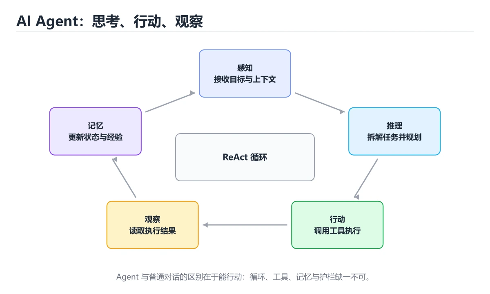
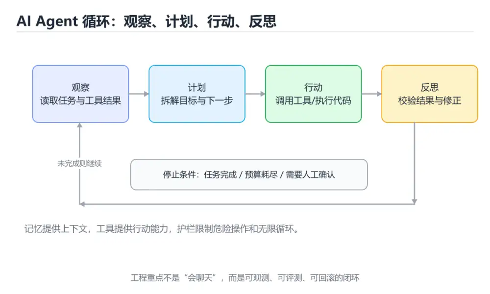
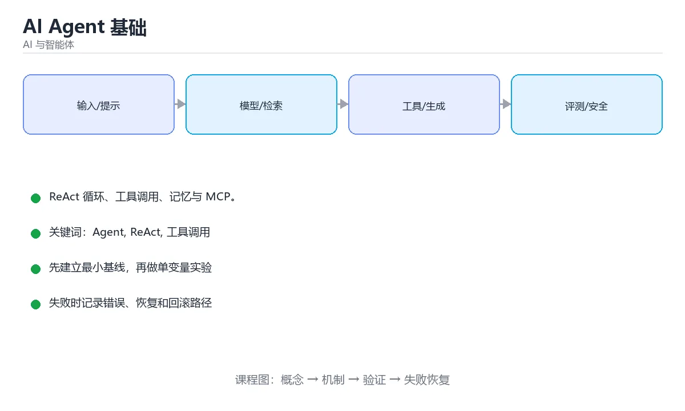

# AI Agent 基础







> 内容更新时间：2026-10-03 · 学习阶段：基础 · 预计用时：17 分钟

## 学习目标

- 能用自己的话解释AI Agent 基础解决了什么问题，而不是只背术语。
- 能说清 「Agent」、「ReAct」、「工具调用」、「MCP」 之间的关系，并分别举出一个例子。
- 能把本课知识放回「AI 与智能体」的知识体系，说明它和相邻主题的边界。
- 能完成本课练习，并用验收标准检查自己的结果。

> 一句话摘要：ReAct 循环、工具调用、记忆与 MCP。

## 前置知识

- 先完成上一课《嵌入、向量检索与 RAG》；如果已经掌握，可以直接用本课练习自测。
- 本课阶段：基础。建议会读写简单代码或命令，并理解变量、输入输出等基本概念。
- 开始前先复习：Agent、ReAct、工具调用。
- 如果某一步看不懂，先记录具体卡点，完成练习后再回头读一遍。

## Agent 与普通对话的区别

```text
普通 LLM：输入 -> 输出（一轮问答）
Agent   ：目标 -> 思考 -> 调用工具 -> 观察结果 -> 再思考 -> …… -> 完成
```

一个 Agent 通常由四部分组成：

| 组成 | 作用 |
| --- | --- |
| 模型（大脑） | 决策、规划、生成 |
| 工具（手脚） | 搜索、计算、数据库、代码执行、API |
| 记忆 | 保存对话、事实与历史经验 |
| 循环控制 | 决定何时继续、何时结束、何时交给人 |

## ReAct 循环

ReAct = Reasoning + Acting，是最经典的 Agent 模式：

```text
Thought     我需要知道今天的汇率
Action      调用 tool: get_exchange_rate(currency="USD", date="today")
Observation {"rate": 7.12}
Thought     已经拿到数据，可以回答了
Answer      今天美元兑人民币约为 7.12
```

要点：每一步都要**可观察、可中断、可重试**；循环必须有最大步数上限，否则可能无限调用工具。

## 工具调用（Function Calling）

```python
tools = [{
    "type": "function",
    "function": {
        "name": "query_orders",
        "description": "按用户 ID 查询订单列表",
        "parameters": {
            "type": "object",
            "properties": {
                "user_id": {"type": "string", "description": "用户唯一标识"},
                "limit": {"type": "integer", "default": 10},
            },
            "required": ["user_id"],
        },
    },
}]
```

流程：把工具描述交给模型 → 模型返回「要调用哪个函数、参数是什么」→ 你的程序真正执行 → 把结果回传给模型 → 模型决定下一步。**模型只负责决定，执行必须由你的代码控制并做权限校验。**

## 记忆

| 类型 | 说明 |
| --- | --- |
| 短期记忆 | 当前对话的上下文窗口 |
| 长期记忆 | 向量库存放的事实与偏好，按需检索 |
| 情景记忆 | 过去任务的过程与结果，用于复盘 |
| 语义记忆 | 抽象出的规则与知识 |

上下文过长时需要**压缩与遗忘策略**：摘要历史、保留关键事实、按相关性检索，而不是无脑全塞。

## MCP：模型上下文协议

MCP（Model Context Protocol）用统一协议把「工具与数据源」暴露给模型客户端：

```text
Agent（MCP Client） <-> MCP Server（文件、数据库、GitHub、浏览器…）
```

好处是一次实现、多个客户端复用；安全上要限制服务器权限，避免模型越权访问敏感资源。

## 设计清单

1. 工具描述写清楚用途、参数与返回结构，模型才会用对。
2. 所有工具调用都要有超时、重试与幂等设计。
3. 关键操作（转账、删除、发邮件）必须人工确认（Human-in-the-loop）。
4. 设置最大步数、最大 token 与预算上限。
5. 全程记录 trace，方便回放与定位问题。

## ReAct 循环的可运行骨架

```python
import json

MAX_STEPS = 6                     # 必须设上限，否则可能无限调用

TOOLS = {
    "get_weather": lambda city: {"city": city, "temp": 24, "desc": "多云"},
    "search_docs": lambda q: {"hits": ["..."]},
}

def run_agent(question: str) -> str:
    messages = [
        {"role": "system", "content":
         "你可以调用工具。需要时输出 JSON："
         '{"action":"工具名","args":{...}}；可以直接回答时输出 '
         '{"action":"final","args":{"answer":"..."}}'},
        {"role": "user", "content": question},
    ]
    for step in range(MAX_STEPS):
        raw = llm(messages)                       # 模型只负责决策
        plan = json.loads(raw)
        if plan["action"] == "final":
            return plan["args"]["answer"]
        tool = TOOLS.get(plan["action"])          # 白名单校验，未知工具直接拒绝
        if tool is None:
            messages.append({"role": "user", "content": "工具不存在，请重试"})
            continue
        try:
            result = tool(**plan["args"])         # 由我们的代码真正执行
        except Exception as exc:
            result = {"error": str(exc)}
        messages.append({"role": "user",
                         "content": "工具返回：" + json.dumps(result, ensure_ascii=False)})
    return "已达最大步数，未能完成任务"
```

三个安全边界：**工具白名单**（模型不能调用未注册能力）、**参数校验与异常兜底**（工具失败要回传错误而非崩溃）、**最大步数**（防止无限循环烧钱）。生产环境还要加超时、权限校验与人工确认点。

## 本课小结
Agent = **LLM + 工具 + 记忆 + 循环**。它的能力上限由工具决定，可靠性由循环控制、权限与评测决定。

## Agent 组成速查

| 组成 | 作用 | 设计要点 |
| --- | --- | --- |
| 模型 | 推理与决策 | 按任务难度选择，支持工具调用 |
| 系统提示 | 定义角色、边界、输出规范 | 版本化管理，配合评测 |
| 工具（Tools） | 与外部世界交互 | 描述清晰、参数有 schema、尽量幂等 |
| 记忆 | 短期上下文与长期存储 | 摘要 + 向量检索 + 元数据过滤 |
| 规划 | 任务分解与顺序 | 支持重规划，限制最大步数 |
| 反思 | 自我检查与纠错 | 明确的验收标准 |
| 护栏 | 权限与安全 | 白名单、速率限制、敏感操作二次确认 |
| 可观测性 | 排查与优化 | 记录完整轨迹、Token 与耗时 |

## 循环与终止条件速查

| 环节 | 说明 |
| --- | --- |
| 观察（Observe） | 读取输入、工具返回与中间结果 |
| 思考（Think） | 分析现状、决定下一步 |
| 行动（Act） | 调用工具或给出答案 |
| 终止 | 得到最终答案、达到步数上限、超时、预算耗尽、需要人工介入 |

```text
你可以使用以下工具：
- search_docs(query: string) -> 返回最相关的 5 个片段
- run_sql(sql: string) -> 只允许 SELECT，最多返回 100 行

工作规则：
1. 先检索资料再回答，禁止凭记忆编造字段名。
2. 每次只调用一个工具，观察结果后再决定下一步。
3. 最多调用 6 次工具；仍无法确定时，说明缺少什么信息。
4. 最终回答必须引用来源片段编号。
```

## 常见错误对照表

| 容易写错的做法 | 实际现象 | 原因与正确做法 |
| --- | --- | --- |
| 不给步数上限 | 无限循环，成本失控 | 明确最大步数与超时 |
| 工具描述模糊 | 模型传错参数、反复重试 | 写清用途、参数含义与返回结构 |
| 工具无幂等保护 | 重试导致重复下单 | 引入幂等键，写操作加确认 |
| 把所有内容塞进上下文 | 成本高、注意力涣散 | 只放必要信息，长文档走检索 |
| 无权限控制 | Agent 越权操作 | 工具层做白名单与参数校验，不依赖提示词 |
| 只评测最终答案 | 无法发现绕路与危险调用 | 评测完整轨迹与工具调用序列 |
| 依赖模型自报成功 | 假成功导致线上事故 | 用工具返回的真实状态判断结果 |
| 没有人工兜底 | 高风险操作无法中止 | 关键动作需人工确认（human in the loop） |
| 提示词与代码混在一起改 | 无法回溯与回归 | 提示词入库，变更走评审与评测 |

## 自测清单

- [ ] Agent 有明确的角色、工具清单与终止条件。
- [ ] 所有工具都有参数 schema 与幂等设计。
- [ ] 全程记录轨迹（思考摘要、工具调用、耗时、Token）。
- [ ] 高风险操作需人工确认或有回滚方案。
- [ ] 评测既看结果，也看步数与工具调用是否合理。

## 动手练习

> 本课练习重点：围绕「Agent、ReAct、工具调用」完成复述、实验和交付，每个结果都要能被别人检查。

先写评测样例，再改一个提示、模型或数据变量，最后比较质量、成本与安全。

### 练习 1：建立心智模型（10 分钟）

合上教程，用 3～5 句话回答：

1. AI Agent 基础解决了什么问题？
2. 如果没有它，会出现什么具体后果？
3. 它和「ReAct」是什么关系？

**验收标准**：至少出现一个本课关键词，并写出一个反例、边界条件或失效场景。

### 练习 2：做一次可控实验（20 分钟）

从正文中选一个最小示例，完成以下操作：

1. 先预测修改一个参数、输入或步骤后的结果。
2. 再实际执行或逐步推演，记录真实结果。
3. 如果结果与预测不同，写出差异原因。

**验收标准**：留下「原例 → 改动 → 预测 → 结果 → 原因」五步记录。

### 练习 3：交付一个小结果（30 分钟）

构造 5 条小型离线样例，写清输入、期望输出、评分标准和失败案例。

任务要求：

- 结果必须能被别人检查，不能只写“我已经理解了”。
- 至少覆盖「Agent」和「ReAct」两个关键词。
- 写出 1 个仍然不确定的问题，以及下一步如何验证。

> 提示：时间有限时优先做练习 1 和练习 2；练习 3 可以拆成两次完成。

## 可运行练习

### 任务 1：先跑通，再解释

```python
tools = [{
    "type": "function",
    "function": {
        "name": "query_orders",
        "description": "按用户 ID 查询订单列表",
        "parameters": {
            "type": "object",
            "properties": {
                "user_id": {"type": "string", "description": "用户唯一标识"},
                "limit": {"type": "integer", "default": 10},
            },
            "required": ["user_id"],
        },
    },
}]
```

### 任务 2：只改一个条件

### 任务 3：迁移到自己的数据

用同一套思路处理一组你自己的数据或场景，保持输出格式与任务 1 一致。

## 故障现场

### 现场 1：本课的 Agent 常规用例通过，但边界用例失败

**症状**：在本课的练习或生产场景里出现“本课的 Agent 常规用例通过，但边界用例失败”。

**复现**：准备一组最小输入，只保留触发“本课的 Agent 常规用例通过，但边界用例失败”的必要条件，连续运行两次确认结果稳定。

**定位**：围绕“Agent 的前置条件与取值边界没有写进代码，默认值掩盖了空值和极值”检查调用链、输入数据和环境配置，先验证假设再改代码。

**预防**：把“本课的 Agent 常规用例通过，但边界用例失败”写成一条自动化用例，并在本课的验收清单里保留对应检查项。

### 现场 2：本课的 ReAct 结果在两次运行之间不一致

**症状**：在本课的练习或生产场景里出现“本课的 ReAct 结果在两次运行之间不一致”。

**复现**：准备一组最小输入，只保留触发“本课的 ReAct 结果在两次运行之间不一致”的必要条件，连续运行两次确认结果稳定。

**定位**：围绕“ReAct 依赖了当前版本、执行顺序或共享状态，单次运行无法暴露差异”检查调用链、输入数据和环境配置，先验证假设再改代码。

**预防**：把“本课的 ReAct 结果在两次运行之间不一致”写成一条自动化用例，并在本课的验收清单里保留对应检查项。

### 现场 3：离线评测分数很高，线上仍然频繁给出错误答案

**定位**：围绕“评测集与真实输入分布不一致，Agent 的提示词或检索结果没有覆盖失败场景”检查调用链、输入数据和环境配置，先验证假设再改代码。

## 深入补充：AI Agent 基础 的取舍与边界

### 一、把概念放回真实约束

学习AI Agent 基础时，最容易只记住结论而忽略前提。先写出三个约束：数据规模、时间预算、可接受的失败方式；再判断 Agent 与 ReAct 在这些约束下是否仍然成立。只要约束改变，原来的最优解就可能变成错误解。

| 维度 | 要回答的问题 | 常见做法 | 失败信号 |
| --- | --- | --- | --- |
| 数据 | Agent 的训练或检索数据从哪来、质量如何 | 清洗、去重、标注与版本化 | 评测集泄漏或分布漂移 |
| 模型 | ReAct 的能力边界与成本是多少 | 基线对比、离线评测、灰度发布 | 指标好看但线上任务失败 |
| 评测 | 如何证明改动真的有效 | 固定评测集、人工抽检、A/B | 只比较单例输出 |
| 安全 | 失败时会不会泄露或越权 | 权限校验、内容过滤、审计 | 提示注入或数据外泄 |

### 二、三个容易混淆的边界

2. **把“平均值”当成“全部”**：Agent 的指标好看，不代表尾部请求、冷启动或失败重试也好看。
3. **把“当前版本”当成“永久行为”**：ReAct 依赖的默认值、API 或性能特征都可能随版本变化，需要固定版本并保留回归用例。

### 三、一个生产场景

假设团队要在真实系统里使用AI Agent 基础：第一周先做小流量验证，记录 Agent 的基线与异常；第二周扩大输入规模，观察 ReAct 是否成为瓶颈；第三周再做故障演练，主动注入超时、重复请求和依赖不可用，确认系统能降级、能重试、能恢复。每一步都要留下指标、日志和结论，而不是只留下“感觉更快了”。

### 四、自测清单

- 能否用一句话说出AI Agent 基础解决的核心问题与不适用场景？
- 能否画出 Agent 的数据流或状态变化，并标出失败路径？
- 能否给出一个反例，证明某个看似合理的结论在边界条件下不成立？
- 能否写出一条可复现的验证命令，让别人独立得到相同结论？

### 五、AI 工程补充

在AI Agent 基础里，模型输出只是系统的一部分：输入要先经过权限与数据质量检查，检索或工具调用要有超时和降级，输出要经过引用核验或规则校验，最后记录 token、延迟、失败类型和人工反馈。评测时至少准备固定题、边界题和对抗题，并把 Agent 与 ReAct 的指标分开记录；否则一次提示词改动看似提升体验，实际可能只是评测样本泄漏或随机波动。

## 本课复习清单

离开本课前，逐项确认：

- [ ] 不看解析，能说出「Agent 与普通一问一答的关键区别是？」的判断依据。
- [ ] 不看解析，能说出「ReAct 循环的三个核心要素是？」的判断依据。
- [ ] 不看解析，能说出「关于工具调用，下面说法正确的是？」的判断依据。
- [ ] 不看解析，能说出「Agent 的「规划」通常包含什么？」的判断依据。
- [ ] 不看解析，能说出「为 Agent 设计工具时最关键的要求是？」的判断依据。
- [ ] 至少运行一次本课示例，记录输入、输出和一个边界情况。
- [ ] 把本课最容易混淆的两个概念写成一句话对照。

| 复盘项 | 记录 |
| --- | --- |
| 已经能独立解释的考点 |  |
| 仍然说不清的概念 |  |
| 下一步验证动作 |  |

## 术语速查

把「AI Agent 基础」里反复出现的术语集中放在一起。复习时先遮住右列，尝试用自己的话解释，再回到正文核对。

| 术语 | 本课语境 |
| --- | --- |
| `[Agent, ReAct, 工具调用, MCP, 记忆][index]` | 在「AI Agent 基础」里理解它的定义、输入和输出。 |
| `[Agent, ReAct, 工具调用, MCP, 记忆][index]` | 本课用它说明边界条件与失败路径。 |
| `[Agent, ReAct, 工具调用, MCP, 记忆][index]` | 结合「AI Agent 基础」的正文示例确认它的适用条件。 |
| `[Agent, ReAct, 工具调用, MCP, 记忆][index]` | 在「AI Agent 基础」里理解它的定义、输入和输出。 |
| `[Agent, ReAct, 工具调用, MCP, 记忆][index]` | 本课用它说明边界条件与失败路径。 |

## 考点精讲

### 考点 1：阅读「AI Agent 基础」正文里的这段 Python 代码，下面哪一项判断是正确的？

- **判断依据**：在「AI Agent 基础」里，这段代码只做静态声明，没有循环、分支或可观察输出。这段代码出自「AI Agent 基础」的正文示例，围绕Agent、ReAct、工具调用展开；把输入或边界换成空值、极值或失败情况后，结论要以「AI Agent 基础」的实际运行结果为准。“阅读AI”与「AI Agent 基础」的术语表相呼应，只有符合Agent、ReAct、工具调用约束的“这段代码只做静态声明，没有循环”才是正文支持的结论。

### 考点 2：围绕“AI Agent 基础”中的 Agent、ReAct、工具调用，下列哪两项是本课强调的实践判断？

- **判断依据**：本课把AI Agent 基础拆成概念、示例与故障现场三部分，因此判断 Agent 时必须同时交代输入、输出和失败路径，这使“学习 Agent 时要同时说明输入、输出和失败路径，不能只看正常流程”成立。在AI Agent 基础里，判断 ReAct 时要固定版本与边界输入，所以“验证 ReAct 时要固定版本并覆盖边界输入，结论才可复现”才可复现。

### 考点 3：关于工具调用，下面说法正确的是？

- **判断依据**：在「AI Agent 基础」里，模型只决定调用哪个工具。执行权必须在应用侧，并做参数校验、权限控制与超时重试。在「AI Agent 基础」里判断这道题，要把Agent、ReAct、工具调用的条件、过程与失败路径逐项对齐，换成“关于工具调用”这个场景，只有满足前提的结论才成立。回到「AI Agent 基础」的正文示例，用“关于工具调用”走一遍Agent、ReAct、工具调用的完整流程，能复现的结论才可以保留。

### 考点 4：Agent 的「规划」通常包含什么？

- **判断依据**：在「AI Agent 基础」里，结论应落在「把目标拆成子任务」。规划与反思（reflection）配合，能让 Agent 在失败后换策略而不是重复同样的调用。在「AI Agent 基础」里，这道题要求区分概念与边界，「把目标拆成子任务」只有在题干给出的前提下才成立，而「只生成最终答案」、「只做向量检索」缺少同一组条件。

### 考点 5：为 Agent 设计工具时最关键的要求是？

- **判断依据**：在「AI Agent 基础」里，描述清晰，参数 schema 明确。工具描述就是给模型的「接口文档」，含糊的描述会导致错误调用与反复重试。“Agent”与「AI Agent 基础」的术语表相呼应，只有符合Agent、ReAct、工具调用约束的“描述清晰，参数 schema 明确”才是正文支持的结论。

### 考点 6：补全代码：「AI Agent 基础」示例中，下面这行代码缺少哪个关键字或函数名？请填入 ____。

`def run_agent(____: str) -> str:`

- **判断依据**：在「AI Agent 基础」里，question。在「AI Agent 基础」里判断这道题，要把Agent、ReAct、工具调用的条件、过程与失败路径逐项对齐，换成“补全代码”这个场景，只有满足前提的结论才成立。“Agent”与「AI Agent 基础」的术语表相呼应，只有符合Agent、ReAct、工具调用约束的“question”才是正文支持的结论。

## English Overview

**Title:** AI Agent Basics

**Summary:** ReAct loop, tool calling, memory and MCP.

**Category:** AI & Agents
**Level:** 基础
**Key terms:** Agent, ReAct, 工具调用, MCP, 记忆

## 内容元数据

- 内容版本：v2.0
- 最后更新：2026-10-03
- 学习阶段：基础
- 适用环境：主流大模型 API、开源模型与向量数据库
- 内容来源：内置结构化课程与工程实践整理
- 相关主题：Agent、ReAct、工具调用、MCP、记忆
- 质量版本：P0 测验标准 + P1 覆盖扩展 + P2 体验补全

## Full English Study Guide

### Overview

**AI Agent Basics** focuses on ReAct loop, tool calling, memory and MCP.

### Learning Outcomes

- Explain what **AI Agent Basics** solves and when it should be used.

### Core Mental Model

### Step-by-step Study Plan

### Practice Tasks

### Common Failure Modes

### Self-check Questions

4. What is the rollback path?

### Glossary

- Topic: **AI Agent Basics**
- Related terms: Agent, ReAct, 工具调用, MCP

## Bilingual Section Outline

| 中文小节 | English section |
| --- | --- |
| 学习目标 | Learning Objectives |
| 前置知识 | Pre-knowledge |
| Agent 与普通对话的区别 | Difference between Agent and Normal Conversation |
| ReAct 循环 | ReAct Loop |
| 工具调用（Function Calling） | Function Calling |
| 记忆 | memory. |
| MCP：模型上下文协议 | MCP: Model Context Protocol |
| 设计清单 | Design checklist |
| ReAct 循环的可运行骨架 | Runnable skeleton of a ReAct cycle |
| 本课小结 | Lesson Summary |

## 参考资料与复核

- 最后复核：2026-10-04
- 下次复核：2027-04-04
- 复核范围：版本兼容、API 行为、安全建议与工程实践
- 来源性质：官方文档、标准或权威教材；正文为离线教学重组

| 参考资料 | 本课用途 |
| --- | --- |
| [Model Context Protocol](https://modelcontextprotocol.io/) | Agent 工具与上下文协议 |
| [LangChain 文档](https://python.langchain.com/docs/) | Agent、RAG 与工作流编排 |
| [OpenAI 开发者文档](https://platform.openai.com/docs/) | 模型 API、工具与评估 |

> 「AI Agent 基础」的链接用于离线阅读后的延伸核对；App 不会自动联网。
