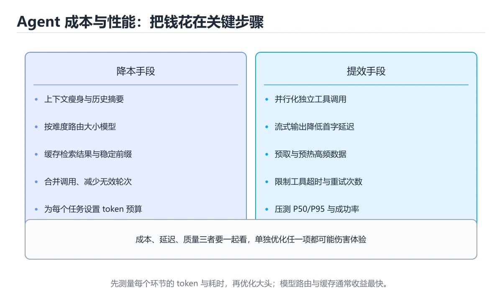

# Agent 成本与性能优化

> 内容更新时间：2026-10-06 · 学习阶段：高级 · 预计用时：35 分钟




## 本节知识框架

**课程定位**：所属分类为「AI 与智能体」，课程主题为「Agent 成本与性能优化」，学习阶段为「高级」，建议用时 35 分钟。

**本课要解决的主问题**：上下文瘦身、模型路由、缓存与压测指标。

| 学习层次 | 要回答的问题 | 完成判据 |
| --- | --- | --- |
| 概念层 | 「Agent 成本与性能优化」有哪些必须区分的对象与术语？ | 能用自己的话定义核心术语，并各举一个正例和一个反例。 |
| 机制层 | 这些对象按什么顺序发生作用，输入如何变成输出？ | 能画出或写出机制步骤，并说明每一步的失败条件。 |
| 应用层 | 什么场景适合使用「Agent 成本与性能优化」，什么场景不适合？ | 能给出一个真实场景、一个最小示例和一个边界案例。 |
| 性能层 | 时间、空间、吞吐或延迟受哪些量影响？ | 能说出复杂度或性能瓶颈的证据来源；没有证据时明确写“材料未提供”。 |
| 复习层 | 怎样确认自己不是只记住了结论？ | 能独立完成本课自测，并把错误定位到概念、机制、示例或边界。 |

### 阅读路线

1. 先读「核心概念定义」，建立「成本优化」等对象的精确定义。
2. 再读「原理与运行机制」，把定义串成可重复的过程。
3. 用「代码/协议/SQL 示例」验证过程，并只改一个条件观察结果变化。
4. 最后检查性能、易错点、知识关系与自测题，形成可复习的证据链。

**前置知识**：《多模态 RAG》

**学习位置**：本课位于《实时语音对话》之后；如果前一课的自测不能通过，应先回补再继续。

**后续衔接**：下一课《模型训练与分布式》会继续使用本课术语，学完后建议立即完成一次自测。

**教材衔接：学习目标**

- 能用自己的话解释Agent 成本与性能优化解决了什么问题，而不是只背术语。
- 能说清 「成本优化」、「上下文裁剪」、「模型路由」、「缓存」 之间的关系，并分别举出一个例子。
- 能把 成本优化 放回「Agent 成本与性能优化」的知识体系，说明它和 上下文裁剪 的边界。
- 能完成本课练习，并用验收标准检查自己的结果。

> 一句话摘要：上下文瘦身、模型路由、缓存与压测指标。

**教材衔接：前置知识**

- 先完成上一课《多模态 RAG》；如果已经掌握，可以直接用本课练习自测。
- 开始前先复习：成本优化、上下文裁剪、模型路由。
- 如果 成本从哪来 这一步看不懂，先记录具体卡点，再用 optimization_hint 复现一遍。

**教材衔接：本课小结**

优化顺序永远是：**先砍上下文，再分级模型，再加缓存，再压步数，最后才动架构**；每一步都要用指标验证，而不是凭感觉。

## 核心概念定义

> 在阅读《Agent 成本与性能优化》时，术语第一次出现先给操作性定义，再给边界；正文说法与这里冲突时，以定义和可复现示例为准。

| 术语 | 操作性定义 | 本课中的边界 |
| --- | --- | --- |
| 成本优化 | 在满足质量和延迟要求的前提下，减少模型、存储、网络与人工等资源消耗。 | 仅在「Agent 成本与性能优化」明确给出的输入、版本与资源条件下成立。 |
| 上下文裁剪 | 在不破坏任务关键信息的前提下删除、摘要或压缩上下文，以降低成本和噪声。 | 仅在「Agent 成本与性能优化」明确给出的输入、版本与资源条件下成立。 |
| 模型路由 | 根据任务难度、成本或可用性选择不同模型并处理降级。 | 仅在「Agent 成本与性能优化」明确给出的输入、版本与资源条件下成立。 |
| 缓存 | 把计算或读取结果暂存到更快存储，后续请求直接复用。 | 仅在「Agent 成本与性能优化」明确给出的输入、版本与资源条件下成立。 |
| 压测 | 在受控负载下测量系统吞吐、延迟、错误率和资源上限。 | 仅在「Agent 成本与性能优化」明确给出的输入、版本与资源条件下成立。 |

### 定义如何使用

在「Agent 成本与性能优化」中判断一个说法是否成立，先确认它使用的是哪个对象的定义，再检查输入规模、运行环境与失败路径。定义不是口号，而是后续推导、代码示例和自测题共享的约束。

**教材衔接：模型路由与降级**

先用规则或小分类器判断任务难度，再选择小/中/大模型；同时设置超时降级策略：大模型超时或失败时回退到小模型并给出保守回答。

## 原理与运行机制

### 机制总览

1. **建立输入**：把「成本优化」按本课定义整理成可观察、可重复的输入条件。
2. **执行转换**：围绕「上下文裁剪」执行本课的核心步骤；每一步都记录中间状态，避免只看最终输出。
3. **产生输出**：得到「模型路由」后，用正文示例或协议/SQL 结果核对输出是否符合预期。
4. **改变一个条件**：只替换一个边界条件或环境参数，观察「Agent 成本与性能优化」的结论是否仍然成立。

| 阶段 | 关注对象 | 失败时应检查 |
| --- | --- | --- |
| 输入 | 成本优化 | 类型、范围、编码、版本或前置状态是否满足定义。 |
| 处理 | 上下文裁剪 | 顺序、可见性、锁、路由、事务或调度规则是否被破坏。 |
| 输出 | 模型路由 | 结果是否可复现，错误是否被正确传播而不是被吞掉。 |

本课的机制结论要用「Agent 成本与性能优化」自己的示例验证。「Agent 成本与性能优化」没有给出某个数量级、吞吐或内存数据时，本课把该判断标为“材料未提供”，不从相邻主题外推。

**教材衔接：成本从哪来**

单次请求成本约等于「输入 token × 输入单价 + 输出 token × 输出单价」加上工具调用费用；Agent 的总成本还要乘以循环步数与并发量。由于每一步都会累积上下文，费用很容易是普通问答的 5~20 倍。

**教材衔接：上下文瘦身**

两个最有效的动作：**截断超长的工具返回**（保留首尾并标注省略了多少字符），以及**把久远的历史压缩成摘要**（用便宜的小模型生成，只保留最近若干轮原文）。工具返回的大段 JSON 是最常见的浪费源，应只回传需要的字段。

**教材衔接：成本构成速查**

| 来源 | 说明 | 优化手段 |
| --- | --- | --- |
| 输入 Token | 系统提示 + 资料 + 历史 | 精简提示、前缀缓存、只传必要上下文 |
| 输出 Token | 生成内容 | 限制长度、要求结构化输出 |
| 多步循环 | 每步都调用模型 | 减少步数、并行化、合并调用 |
| 工具调用 | 外部 API 费用 | 缓存、批量、限流 |
| 重试 | 失败重试翻倍成本 | 只重试可恢复错误并设上限 |
| 检索 | 向量库与嵌入调用 | 缓存嵌入、批量更新 |

## 典型应用场景

| 场景 | 典型输入或前提 | 期望产物 |
| --- | --- | --- |
| 学习验证 | 使用本课最小示例和 成本优化、上下文裁剪 | 能复现正文结论，并解释每一步。 |
| 工程落地 | 把「Agent 成本与性能优化」放入真实模块或服务边界 | 输出可观测、失败可定位、参数可配置。 |
| 故障排查 | 只改一个版本、规模、输入或依赖条件 | 能区分概念错误、实现错误和环境差异。 |

判断「Agent 成本与性能优化」的场景是否成立，标准是能否写出输入、处理、输出和失败路径；材料中没有出现的数据在本课标注为“材料未提供”，不用推测替代证据。

## 代码/协议/SQL 示例

以下代码、协议或 SQL 片段来自《Agent 成本与性能优化》原文，保留原有语言标记与上下文；先预测《Agent 成本与性能优化》示例的输出，再按正文步骤运行或推演，示例依赖外部环境时同时记录版本与输入。

**教材衔接：优化顺序速查**

| 优先级 | 手段 | 典型收益 |
| --- | --- | --- |
| 1 | 减少无效步骤与重复调用 | 高 |
| 2 | 精简提示与上下文 | 高 |
| 3 | 前缀缓存与结果缓存 | 中高 |
| 4 | 小模型优先 + 大模型升级路由 | 中高 |
| 5 | 限制输出长度与格式 | 中 |
| 6 | 批量与并行 | 中 |
| 7 | 自建推理或量化部署 | 视规模而定 |

原则：**先降低无用消耗，再优化单价**。多数项目第一步能砍掉一半成本。

```python
from dataclasses import dataclass, field

@dataclass
class CallCost:
    model: str
    input_tokens: int
    output_tokens: int
    input_price: float = 0.003      # 每千 Token 单价示例
    output_price: float = 0.015

    @property
    def total(self) -> float:
        return (
            self.input_tokens / 1000 * self.input_price
            + self.output_tokens / 1000 * self.output_price
        )

@dataclass
class TaskCost:
    task_id: str
    calls: list = field(default_factory=list)
    cached_calls: int = 0

    def add(self, call: CallCost) -> None:
        self.calls.append(call)

    def total(self) -> float:
        return round(sum(call.total for call in self.calls), 6)

    def cache_hit_rate(self) -> float:
        total = len(self.calls) + self.cached_calls
        return round(self.cached_calls / total, 4) if total else 0.0

    def optimization_hint(self) -> str:
        if not self.calls:
            return "无调用记录"
        steps = len(self.calls)
        avg_output = sum(c.output_tokens for c in self.calls) / steps
        if steps > 6:
            return "步骤过多：检查是否可以合并或并行"
        if avg_output > 800:
            return "输出过长：限制长度并要求结构化输出"
        if self.cache_hit_rate() < 0.2:
            return "缓存命中偏低：考虑前缀缓存或结果缓存"
        return "成本结构合理"

task = TaskCost("t-1001")
task.add(CallCost("small", 800, 200))
task.add(CallCost("large", 4200, 1200))
print(round(task.total(), 5), task.cache_hit_rate(), task.optimization_hint())
```

## 时间/空间复杂度或性能分析

**复杂度证据**：「Agent 成本与性能优化」的现有材料没有给出渐近时间或空间复杂度的明确结论，本课只做定性检查，不补写未经验证的 $O$ 记号。

| 维度 | 本课关注点 | 判断依据 |
| --- | --- | --- |
| 时间/延迟 | 「Agent 成本与性能优化」的主要步骤是否会随输入规模、并发度或网络往返增长。 | 以正文复杂度、基准数据或可重复测量为准。 |
| 空间/内存 | 中间状态、缓存、副本、连接或索引是否随规模增长。 | 记录峰值内存与数据副本，不只看最终结果。 |
| 吞吐/资源 | 版本、调度、锁、IO、序列化或协议开销是否成为瓶颈。 | 固定环境做对照实验，改变一个变量。 |

评估「Agent 成本与性能优化」时要区分“正确性成立”和“性能达标”两件事；材料没有给出基准时，本课只保留量级来源与测量方法，不写不可验证的绝对数字。

**教材衔接：五个优化层次**

| 层次 | 手段 | 典型收益 |
| --- | --- | --- |
| 上下文 | 只带必要片段、历史摘要、工具结果裁剪 | 省 30%~70% token |
| 模型 | 分级路由，简单任务用小模型 | 单价降 50%~90% |
| 缓存 | 提示缓存、语义缓存、工具结果缓存 | 命中即接近免费 |
| 流程 | 减少无效循环、合并工具调用、并行执行 | 减少步数 |
| 架构 | 确定性逻辑用代码，只在必要处用模型 | 根本性下降 |

**教材衔接：并行与缓存**

多路检索应并行发起而不是串行 await；同一工具在相同参数下的结果可在 TTL 内缓存复用，例如查询订单、汇率、商品详情这类读多写少的数据。

**教材衔接：性能指标与压测**

| 类别 | 指标 |
| --- | --- |
| 延迟 | 端到端 P50/P95/P99、首 token 延迟、各步耗时 |
| 成本 | 每请求 token、每请求费用、每成功任务费用 |
| 效率 | 平均步数、无效工具调用率、缓存命中率 |

压测要构造接近真实分布的任务集（简单/中等/困难按比例混合），并发执行并记录上述指标；只测单条理想请求会严重低估线上开销。

**教材衔接：性能压测速查**

| 指标 | 说明 | 目标示例 |
| --- | --- | --- |
| 单任务 P50 / P95 延迟 | 端到端耗时 | P95 小于 8 秒 |
| 吞吐 | 每秒完成任务数 | 按容量规划 |
| 并发上限 | 同时可运行任务数 | 受下游配额限制 |
| 错误率 | 失败任务占比 | 小于 1% |
| 单任务成本 | 平均 Token 费用 | 按业务设定预算 |
| 工具失败率 | 外部依赖稳定性 | 小于 2% |

压测要点：用真实任务分布（不是全部简单请求）、固定模型与参数、逐步加压观察拐点，并同步监控下游配额与限流。

**教材衔接：深入补充：Agent 成本与性能优化 的取舍与边界**

### 一、把概念放回真实约束

学习Agent 成本与性能优化时，最容易只记住结论而忽略前提。先写出三个约束：数据规模、时间预算、可接受的失败方式；再判断 成本优化 与 上下文裁剪 在这些约束下是否仍然成立。只要约束改变，原来的最优解就可能变成错误解。

| 维度 | 要回答的问题 | 常见做法 | 失败信号 |
| --- | --- | --- | --- |
| 数据 | 成本优化 的训练或检索数据从哪来、质量如何 | 清洗、去重、标注与版本化 | 评测集泄漏或分布漂移 |
| 模型 | 上下文裁剪 的能力边界与成本是多少 | 基线对比、离线评测、灰度发布 | 指标好看但线上任务失败 |
| 评测 | 如何证明改动真的有效 | 固定评测集、人工抽检、A/B | 只比较单例输出 |
| 安全 | 失败时会不会泄露或越权 | 权限校验、内容过滤、审计 | 提示注入或数据外泄 |

### 二、三个容易混淆的边界

1. 澄清输入与目标。先写清「Agent 成本与性能优化」要解决的问题、合法输入范围和成功标准，再进入后续步骤。
2. **把“平均值”当成“全部”**：成本优化 的指标好看，不代表尾部请求、冷启动或失败重试也好看。
3. **把“当前版本”当成“永久行为”**：上下文裁剪 依赖的默认值、API 或性能特征都可能随版本变化，需要固定版本并保留回归用例。

### 三、一个生产场景

假设团队要在真实系统里使用Agent 成本与性能优化：第一周先做小流量验证，记录 成本优化 的基线与异常；第二周扩大输入规模，观察 上下文裁剪 是否成为瓶颈；第三周再做故障演练，主动注入超时、重复请求和依赖不可用，确认系统能降级、能重试、能恢复。每一步都要留下指标、日志和结论，而不是只留下“感觉更快了”。

### 四、自测清单

- 能否用一句话说出Agent 成本与性能优化解决的核心问题与不适用场景？
- 能否画出 成本优化 的数据流或状态变化，并标出失败路径？
- 能否给出一个反例，证明 成本优化 的结论在边界条件下不成立？
- 能否写出一条可复现的验证命令，让别人独立得到相同结论？

### 五、AI 工程补充

在Agent 成本与性能优化里，模型输出只是系统的一部分：输入要先经过权限与数据质量检查，检索或工具调用要有超时和降级，输出要经过引用核验或规则校验，最后记录 token、延迟、失败类型和人工反馈。评测时至少准备固定题、边界题和对抗题，并把 成本优化 与 上下文裁剪 的指标分开记录；否则一次提示词改动看似提升体验，实际可能只是评测样本泄漏或随机波动。

## 常见误区与易错点

> 复核《Agent 成本与性能优化》的易错点时，优先保留原文的错误表、故障现场与排错路径；每条修正都要能用本课示例复验。

| 易错点 | 常见表现 | 正确做法 |
| --- | --- | --- |
| 只背结论 | 能复述「Agent 成本与性能优化」的定义，却说不清输入、输出与边界。 | 回到机制步骤，用最小示例逐一验证。 |
| 混淆相邻概念 | 把本课对象与相邻主题的对象当成同一类。 | 先比较定义、资源归属、生命周期和失败模式。 |
| 忽略版本与环境 | 在开发机通过后直接外推到生产环境。 | 固定版本、输入和资源条件，再记录可复现结果。 |

**教材衔接：常见错误与排查**

1. 每步都把完整历史重新发送，成本随步数近似平方增长。
2. 用大模型做本可以用规则完成的判断。
3. 工具结果原样回灌，几万 token 挤爆上下文。
4. 串行调用本可并行的检索与工具。
5. 没有预算上限，异常循环持续烧钱。
| 容易踩的做法 | 实际现象 | 原因与正确做法 |
| --- | --- | --- |
| 先换小模型再优化提示 | 质量下降且没省钱 | 先减少无效步骤与精简上下文 |
| 只统计总费用 | 无法定位大头 | 按任务、租户、模型分别统计 |
| 无缓存直接扩容 | 成本线性增长 | 加前缀缓存与结果缓存 |
| 输出无长度限制 | Token 费用不可控 | 明确长度与结构化格式 |
| 无脑重试 | 失败成本翻倍 | 只重试可恢复错误并设上限 |
| 压测只用简单请求 | 结论偏乐观 | 按真实任务分布压测 |
| 忽略下游配额 | 高峰被限流 | 提前评估并为关键路径预留 |
| 缓存不设失效 | 结果过期 | 明确 TTL 与更新触发条件 |
| 路由规则写死 | 无法随场景演进 | 规则可配置并按评测调优 |
| 上线后不监控成本趋势 | 成本缓慢失控 | 设成本告警与预算上限 |

**教材衔接：故障现场**

### 现场 1：先换小模型再优化提示

**症状**：在《Agent 成本与性能优化》的复现场景中，质量下降且没省钱。

**根因**：触发点是把“先换小模型再优化提示”当成安全做法。它没有满足《Agent 成本与性能优化》要求的前提，因此先表现为“质量下降且没省钱”；排查时先完整复现这一段，再核对输入、配置与依赖。

**修复**：针对《Agent 成本与性能优化》的问题，先减少无效步骤与精简上下文。

**验证**：先在《Agent 成本与性能优化》中记录“先换小模型再优化提示”留下的失败证据，再执行“先减少无效步骤与精简上下文”并重放；确认错误路径变为明确结果，且修复没有掩盖同类故障。

### 现场 2：只统计总费用

**症状**：在《Agent 成本与性能优化》的复现场景中，无法定位大头。

**根因**：当出现“只统计总费用”时，执行路径已经绕过了《Agent 成本与性能优化》的关键约束，最终以“无法定位大头”暴露出来；修复前必须先确认约束在哪里失效。

**修复**：针对《Agent 成本与性能优化》的问题，按任务、租户、模型分别统计。

**验证**：保留《Agent 成本与性能优化》里触发“无法定位大头”的输入、版本和日志，按“按任务、租户、模型分别统计”完成修改后原样重放；只有失败现象消失且相邻场景仍可解释，才保留改动。

### 现场 3：无缓存直接扩容

**症状**：在《Agent 成本与性能优化》的复现场景中，成本线性增长。

**根因**：当出现“无缓存直接扩容”时，执行路径已经绕过了《Agent 成本与性能优化》的关键约束，最终以“成本线性增长”暴露出来；修复前必须先确认约束在哪里失效。

**修复**：针对《Agent 成本与性能优化》的问题，加前缀缓存与结果缓存。

**验证**：先在《Agent 成本与性能优化》中记录“无缓存直接扩容”留下的失败证据，再执行“加前缀缓存与结果缓存”并重放；确认错误路径变为明确结果，且修复没有掩盖同类故障。

## 与其他知识点的关系

| 关系 | 课程 | 为什么 |
| --- | --- | --- |
| 先修 | 《多模态 RAG》 | 本课会直接使用它的概念或操作前提。 |
| 关联 | 《模型评测与选型》 | 用于横向比较或把本课结论迁移到相邻主题。 |
| 前置顺序 | 《实时语音对话》 | 同分类中安排在本课之前，建议先完成其自测。 |
| 后续顺序 | 《模型训练与分布式》 | 同分类中安排在本课之后，会继续使用本课术语。 |

把「Agent 成本与性能优化」放回知识体系时，不只要记住“前面学过什么”，还要说明两个主题在输入、机制、资源边界和失败模式上的差异。这样才能把单课知识迁移到项目、排障和后续课程。

## 自测题与参考答案

> 先独立完成《Agent 成本与性能优化》的自测，再核对答案与解析。答案必须能在本课正文或示例中找到依据，不能只凭语感。

### 自测 1

Agent 成本远高于普通问答的根本原因是？

A. 因为它必须一直占用大量 GPU，但这会占用更多内存
B. 网络更慢
C. 循环步数与上下文累积形成乘法效应
D. 模型更大

**参考答案**：循环步数与上下文累积形成乘法效应

**解析**：每一步都会带上历史上下文，费用随步数快速放大。在「Agent 成本与性能优化」里，其他选项：循环步数与上下文累积形成乘法效应，这是 Agent 成本远高于单轮问答的根本原因。「Agent 成本与性能优化」要求先交代成本优化、上下文裁剪、模型路由的前提再下结论，所以“循环步数与上下文累积形成乘法效应”只在题干“Agent 成本远高于普通问答的根本原因是”给定的条件下成立。

### 自测 2

阅读这段成本计算代码，下面哪项判断是正确的？

```python
@property
def total(self):
    return (
        self.input_tokens / 1000 * self.input_price
        + self.output_tokens / 1000 * self.output_price
    )
```

A. 成本由输入与输出 Token 分别计价后累加，输出单价更高，压缩冗长回答往往最省钱
B. 成本只与请求次数有关，与输入输出 Token 数量无关
C. 缓存命中与模型路由只影响响应时间，不影响总成本
D. 为省钱应始终选最小模型，质量下降不会带来额外成本

**参考答案**：成本由输入与输出 Token 分别计价后累加，输出单价更高，压缩冗长回答往往最省钱

**解析**：正确判断是成本由输入与输出 Token 分别计价后累加，输出单价更高，压缩冗长回答往往最省钱。Agent 成本与性能优化要先把调用拆成可测量的口径：输入、输出与缓存命中的 Token 数，再加上工具调用与检索的额外开销。压缩上下文、裁剪无关检索结果、把简单任务路由到小模型、对稳定前缀做缓存，都能直接降低成本；一味换小模型会把成本转移到质量与返工上，必须用评测数据验证。

### 自测 3

围绕“Agent 成本与性能优化”中的 成本优化、上下文裁剪、模型路由，下列哪两项是本课强调的实践判断？

A. 验证 上下文裁剪 时要固定版本并覆盖边界输入，结论才可复现
B. 把 上下文裁剪 的单次运行结果当成所有版本和规模都成立
C. 学习 成本优化 时要同时说明输入、输出和失败路径，不能只看正常流程
D. 只要 成本优化 的常规示例通过，就可以跳过边界与异常路径

**参考答案**：验证 上下文裁剪 时要固定版本并覆盖边界输入，结论才可复现；学习 成本优化 时要同时说明输入、输出和失败路径，不能只看正常流程

**解析**：结论应落在验证 上下文裁剪 时要固定版本并覆盖边界输入。本课把Agent 成本与性能优化拆成概念、示例与故障现场三部分，因此判断 成本优化 时必须同时交代输入、输出和失败路径，这使“学习 成本优化 时要同时说明输入、输出和失败路径，不能只看正常流程”成立。在Agent 成本与性能优化里，判断 上下文裁剪 时要固定版本与边界输入，所以“验证 上下文裁剪 时要固定版本并覆盖边界输入，结论才可复现”才可复现。

**教材衔接：复习与自测**

- [ ] 成本按任务、模型与租户可归因。
- [ ] 优化顺序是「先减浪费，再降单价」。
- [ ] 有前缀缓存与结果缓存，并明确失效策略。
- [ ] 复杂请求才升级到大模型。
- [ ] 压测使用真实任务分布并设成本告警。

**教材衔接：动手练习**

> 本课练习重点：围绕「成本优化、上下文裁剪、模型路由」完成复述、实验和交付，每个结果都要能被别人检查。

先写 成本优化 的评测样例，再改一个变量，最后比较质量、成本与安全。

### 练习 1：建立心智模型（10 分钟）

合上教程，用 3～5 句话回答：

1. Agent 成本与性能优化解决了什么问题？
2. 如果没有它，会出现什么具体后果？
3. 它和「上下文裁剪」是什么关系？

验收标准：说明 成本优化 与 上下文裁剪 的分工，并写出一个失效场景。

### 练习 2：做一次可控实验（20 分钟）

从正文中选一个最小示例，完成以下操作：

1. 先预测修改一个参数、输入或步骤后的结果。
2. 再实际执行或逐步推演，记录真实结果。
3. 如果结果与预测不同，写出差异原因。

**验收标准**：把 optimization_hint 当作原例，改动一次上下文裁剪的取值，记录命令、输出与差异原因；五步里缺任意一步都算未完成。

### 练习 3：交付一个小结果（30 分钟）

把 上下文裁剪 的评测样例固定下来，并写清评分标准。

任务要求：

- 结果必须能被别人检查，不能只写“我已经理解了”。
- 至少覆盖「成本优化」和「上下文裁剪」两个关键词。
- 写出 1 个仍然不确定的问题，以及下一步如何验证。

> 提示：时间有限时优先做练习 1 和练习 2；练习 3 可以拆成两次完成。

**教材衔接：可运行练习**

### 任务 1：先跑通，再解释

```python
from dataclasses import dataclass, field

@dataclass
class CallCost:
    model: str
    input_tokens: int
    output_tokens: int
    input_price: float = 0.003      # 每千 Token 单价示例
    output_price: float = 0.015

    @property
    def total(self) -> float:
        return (
            self.input_tokens / 1000 * self.input_price
            + self.output_tokens / 1000 * self.output_price
        )

@dataclass
class TaskCost:
    task_id: str
    calls: list = field(default_factory=list)
    cached_calls: int = 0

    def add(self, call: CallCost) -> None:
        self.calls.append(call)

    def total(self) -> float:
        return round(sum(call.total for call in self.calls), 6)

    def cache_hit_rate(self) -> float:
        total = len(self.calls) + self.cached_calls
        return round(self.cached_calls / total, 4) if total else 0.0

    def optimization_hint(self) -> str:
        if not self.calls:
            return "无调用记录"
        steps = len(self.calls)
        avg_output = sum(c.output_tokens for c in self.calls) / steps
        if steps > 6:
            return "步骤过多：检查是否可以合并或并行"
        if avg_output > 800:
            return "输出过长：限制长度并要求结构化输出"
        if self.cache_hit_rate() < 0.2:
            return "缓存命中偏低：考虑前缀缓存或结果缓存"
        return "成本结构合理"

task = TaskCost("t-1001")
task.add(CallCost("small", 800, 200))
task.add(CallCost("large", 4200, 1200))
print(round(task.total(), 5), task.cache_hit_rate(), task.optimization_hint())
```

### 任务 2：只改一个条件

把「Agent 成本与性能优化」的最小示例复制一份，只改一个条件再跑一次：

- 改动点：只把 成本优化 的输入换成空值、极值或错误输入，其余保持不变。
- 预测：先写下「Agent 成本与性能优化」在改动后的输出或错误信息，再运行。
- 记录：对照改动前后的结果，指出差异出在哪一步。
- 验收：换回原条件能复现原结果，改动只影响成本优化。

### 任务 3：迁移到自己的数据

把 optimization_hint 换成你自己的输入，先保持步骤不变，再比较输出差异。

**教材衔接：本课复习清单**

离开本课前，逐项确认：

- [ ] 不看解析，能说出「Agent 成本远高于普通问答的根本原因是？」的判断依据。
- [ ] 不看解析，能说出「成本优化的正确顺序是？」的判断依据。
- [ ] 不看解析，能说出「Agent 性能压测应该怎么做？」的判断依据。
- [ ] 不看解析，能说出「提示缓存（prompt caching）为什么能省钱省时？」的判断依据。
- [ ] 不看解析，能说出「用更小的模型替换主模型之前应该做什么？」的判断依据。
- [ ] 跑通「Agent 成本与性能优化」的最小示例，并记录一次失败输入的处理方式。
- [ ] 把本课最容易混淆的两个概念写成一句话对照。

| 复盘项 | 记录 |
| --- | --- |
| 已经能独立解释的考点 |  |
| 仍然说不清的概念 |  |
| 下一步验证动作 |  |

---

## 术语速查

| 术语 | 一句话说明 |
| --- | --- |
| `成本优化` | 在满足质量和延迟要求的前提下，减少模型、存储、网络与人工等资源消耗。 |
| `上下文裁剪` | 在不破坏任务关键信息的前提下删除、摘要或压缩上下文，以降低成本和噪声。 |
| `模型路由` | 根据任务难度、成本或可用性选择不同模型并处理降级。 |
| `缓存` | 把计算或读取结果暂存到更快存储，后续请求直接复用。 |
| `压测` | 在受控负载下测量系统吞吐、延迟、错误率和资源上限。 |

## 考点精讲

### 考点 1：概念判断·成本优化

- **题目**：Agent 成本远高于普通问答的根本原因是？
- **判断依据**：每一步都会带上历史上下文，费用随步数快速放大。在「Agent 成本与性能优化」里，其他选项：循环步数与上下文累积形成乘法效应，这是 Agent 成本远高于单轮问答的根本原因。「Agent 成本与性能优化」要求先交代成本优化、上下文裁剪、模型路由的前提再下结论，所以“循环步数与上下文累积形成乘法效应”只在题干“Agent 成本远高于普通问答的根本原因是”给定的条件下成立。

### 考点 2：概念判断·成本优化

- **题目**：成本优化的正确顺序是？
- **判断依据**：先消除浪费，再逐层优化，最后才动架构。在「Agent 成本与性能优化」里，作答时，先用成本优化建立输入与输出的基线，再把先砍上下文，再分级模型代入边界条件核对，结论才能复现。把“先砍上下文，再分级模型”代回「Agent 成本与性能优化」里“成本优化的正确顺序是”的例子核对，条件一旦改变，结论就要用成本优化、上下文裁剪、模型路由重新推导。

### 考点 3：代码阅读·调用成本

- **题目**：阅读这段成本计算代码，下面哪项判断是正确的？
- **正确判断**：成本由输入与输出 Token 分别计价后累加，输出单价更高，压缩冗长回答往往最省钱
- **判断依据**：正确判断是成本由输入与输出 Token 分别计价后累加，输出单价更高，压缩冗长回答往往最省钱。Agent 成本与性能优化要先把调用拆成可测量的口径：输入、输出与缓存命中的 Token 数，再加上工具调用与检索的额外开销。压缩上下文、裁剪无关检索结果、把简单任务路由到小模型、对稳定前缀做缓存，都能直接降低成本；一味换小模型会把成本转移到质量与返工上，必须用评测数据验证。

### 考点 4：多选辨析·成本优化

- **题目**：围绕“Agent 成本与性能优化”中的 成本优化、上下文裁剪、模型路由，下列哪两项是本课强调的实践判断？
- **判断依据**：结论应落在验证 上下文裁剪 时要固定版本并覆盖边界输入。本课把Agent 成本与性能优化拆成概念、示例与故障现场三部分，因此判断 成本优化 时必须同时交代输入、输出和失败路径，这使“学习 成本优化 时要同时说明输入、输出和失败路径，不能只看正常流程”成立。在Agent 成本与性能优化里，判断 上下文裁剪 时要固定版本与边界输入，所以“验证 上下文裁剪 时要固定版本并覆盖边界输入，结论才可复现”才可复现。

### 考点 5：概念判断·成本优化

- **题目**：用更小的模型替换主模型之前应该做什么？
- **判断依据**：在「Agent 成本与性能优化」里，先在评测集上验证质量达标。常见做法是简单请求走小模型、复杂请求升级到大模型，兼顾成本与质量。这道题的关键在「Agent 成本与性能优化」的成本优化、上下文裁剪、模型路由：先确认题干“用更小的模型替换主模型之前应该做什么”问的是哪一步，再排除偷换前提的选项。

### 考点 6：填空·成本优化

- **题目**：补全代码：「Agent 成本与性能优化」示例中，下面这行代码缺少哪个关键字或函数名？请填入 ____。 `avg_output = ____(c.output_tokens for c in self.calls) / steps`
- **判断依据**：sum 是完成这条语句的关键部分，去掉或替换它就无法表达同样的语义，也得不到示例给出的结果。在「Agent 成本与性能优化」里判断这道题，要把成本优化、上下文裁剪、模型路由的条件、过程与失败路径逐项对齐，换成“补全代码”这个场景，只有满足前提的结论才成立。回到「Agent 成本与性能优化」的正文示例，用“补全代码”走一遍成本优化、上下文裁剪、模型路由的完整流程，能复现的结论才可以保留。

## English Overview

**Title:** Agent Cost & Performance

**Summary:** Context trimming, routing, caching and load testing.

**Category:** AI & Agents
**Level:** 高级
**Key terms:** 成本优化, 上下文裁剪, 模型路由, 缓存, 压测

## 内容元数据

- 内容版本：v2.0
- 最后更新：2026-10-06
- 学习阶段：高级
- 适用环境：主流大模型 API、开源模型与向量数据库；本课聚焦 成本优化。
- 内容来源：内置结构化课程与工程实践整理
- 相关主题：成本优化、上下文裁剪、模型路由、缓存、压测
- 质量版本：P0 测验标准 + P1 覆盖扩展 + P2 体验补全

## 参考资料与复核

- 最后复核：2026-10-04
- 下次复核：2026-12-24
- 复核范围：版本兼容、API 行为、安全建议与工程实践
- 来源性质：官方文档、标准或权威教材；正文为离线教学重组

| 参考资料 | 本课用途 |
| --- | --- |
| [Anthropic 文档](https://docs.anthropic.com/) | Claude API 与 Agent 安全 |
| [OpenAI Cookbook](https://cookbook.openai.com/) | RAG、Agent 与工程示例 |
| [PyTorch 文档](https://pytorch.org/docs/stable/index.html) | 张量、训练与推理 |

> 「Agent 成本与性能优化」的链接用于离线阅读后的延伸核对；App 不会自动联网。
