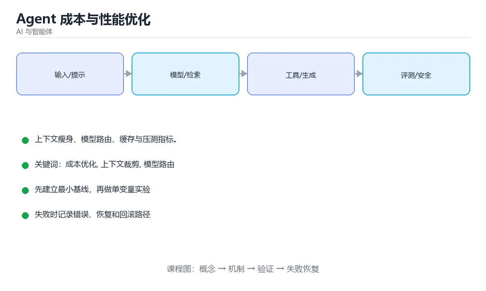

# Agent 成本与性能优化



> 内容更新时间：2026-10-03 · 学习阶段：高级 · 预计用时：16 分钟

## 学习目标

- 能用自己的话解释「Agent 成本与性能优化」解决了什么问题，而不是只背术语。
- 能说清 「成本优化」、「上下文裁剪」、「模型路由」、「缓存」 之间的关系，并分别举出一个例子。
- 能把本课知识放回「AI 与智能体」的知识体系，说明它和相邻主题的边界。
- 能完成本课练习，并用验收标准检查自己的结果。

> 一句话摘要：上下文瘦身、模型路由、缓存与压测指标。

## 前置知识

- 先完成上一课《多模态 RAG》；如果已经掌握，可以直接用本课练习自测。
- 本课阶段：高级。建议具备同一方向的完整基础，能阅读较长的代码、配置或系统设计说明。
- 开始前先复习：成本优化、上下文裁剪、模型路由。
- 如果某一步看不懂，先记录具体卡点，完成练习后再回头读一遍。


## 成本从哪来

单次请求成本约等于「输入 token × 输入单价 + 输出 token × 输出单价」加上工具调用费用；Agent 的总成本还要乘以循环步数与并发量。由于每一步都会累积上下文，费用很容易是普通问答的 5~20 倍。

## 五个优化层次

| 层次 | 手段 | 典型收益 |
| --- | --- | --- |
| 上下文 | 只带必要片段、历史摘要、工具结果裁剪 | 省 30%~70% token |
| 模型 | 分级路由，简单任务用小模型 | 单价降 50%~90% |
| 缓存 | 提示缓存、语义缓存、工具结果缓存 | 命中即接近免费 |
| 流程 | 减少无效循环、合并工具调用、并行执行 | 减少步数 |
| 架构 | 确定性逻辑用代码，只在必要处用模型 | 根本性下降 |

## 上下文瘦身

两个最有效的动作：**截断超长的工具返回**（保留首尾并标注省略了多少字符），以及**把久远的历史压缩成摘要**（用便宜的小模型生成，只保留最近若干轮原文）。工具返回的大段 JSON 是最常见的浪费源，应只回传需要的字段。

## 模型路由与降级

先用规则或小分类器判断任务难度，再选择小/中/大模型；同时设置超时降级策略：大模型超时或失败时回退到小模型并给出保守回答。

## 并行与缓存

多路检索应并行发起而不是串行 await；同一工具在相同参数下的结果可在 TTL 内缓存复用，例如查询订单、汇率、商品详情这类读多写少的数据。

## 性能指标与压测

| 类别 | 指标 |
| --- | --- |
| 延迟 | 端到端 P50/P95/P99、首 token 延迟、各步耗时 |
| 成本 | 每请求 token、每请求费用、每成功任务费用 |
| 效率 | 平均步数、无效工具调用率、缓存命中率 |

压测要构造接近真实分布的任务集（简单/中等/困难按比例混合），并发执行并记录上述指标；只测单条理想请求会严重低估线上开销。

## 反模式

1. 每步都把完整历史重新发送，成本随步数近似平方增长。
2. 用大模型做本可以用规则完成的判断。
3. 工具结果原样回灌，几万 token 挤爆上下文。
4. 串行调用本可并行的检索与工具。
5. 没有预算上限，异常循环持续烧钱。

## 本课小结
优化顺序永远是：**先砍上下文，再分级模型，再加缓存，再压步数，最后才动架构**；每一步都要用指标验证，而不是凭感觉。


## 成本构成速查

| 来源 | 说明 | 优化手段 |
| --- | --- | --- |
| 输入 Token | 系统提示 + 资料 + 历史 | 精简提示、前缀缓存、只传必要上下文 |
| 输出 Token | 生成内容 | 限制长度、要求结构化输出 |
| 多步循环 | 每步都调用模型 | 减少步数、并行化、合并调用 |
| 工具调用 | 外部 API 费用 | 缓存、批量、限流 |
| 重试 | 失败重试翻倍成本 | 只重试可恢复错误并设上限 |
| 检索 | 向量库与嵌入调用 | 缓存嵌入、批量更新 |

## 优化顺序速查

| 优先级 | 手段 | 典型收益 |
| --- | --- | --- |
| 1 | 减少无效步骤与重复调用 | 高 |
| 2 | 精简提示与上下文 | 高 |
| 3 | 前缀缓存与结果缓存 | 中高 |
| 4 | 小模型优先 + 大模型升级路由 | 中高 |
| 5 | 限制输出长度与格式 | 中 |
| 6 | 批量与并行 | 中 |
| 7 | 自建推理或量化部署 | 视规模而定 |

原则：**先降低无用消耗，再优化单价**。多数项目第一步能砍掉一半成本。

```python
from dataclasses import dataclass, field

@dataclass
class CallCost:
    model: str
    input_tokens: int
    output_tokens: int
    input_price: float = 0.003      # 每千 Token 单价示例
    output_price: float = 0.015

    @property
    def total(self) -> float:
        return (
            self.input_tokens / 1000 * self.input_price
            + self.output_tokens / 1000 * self.output_price
        )


@dataclass
class TaskCost:
    task_id: str
    calls: list = field(default_factory=list)
    cached_calls: int = 0

    def add(self, call: CallCost) -> None:
        self.calls.append(call)

    def total(self) -> float:
        return round(sum(call.total for call in self.calls), 6)

    def cache_hit_rate(self) -> float:
        total = len(self.calls) + self.cached_calls
        return round(self.cached_calls / total, 4) if total else 0.0

    def optimization_hint(self) -> str:
        if not self.calls:
            return "无调用记录"
        steps = len(self.calls)
        avg_output = sum(c.output_tokens for c in self.calls) / steps
        if steps > 6:
            return "步骤过多：检查是否可以合并或并行"
        if avg_output > 800:
            return "输出过长：限制长度并要求结构化输出"
        if self.cache_hit_rate() < 0.2:
            return "缓存命中偏低：考虑前缀缓存或结果缓存"
        return "成本结构合理"


task = TaskCost("t-1001")
task.add(CallCost("small", 800, 200))
task.add(CallCost("large", 4200, 1200))
print(round(task.total(), 5), task.cache_hit_rate(), task.optimization_hint())
```

## 性能压测速查

| 指标 | 说明 | 目标示例 |
| --- | --- | --- |
| 单任务 P50 / P95 延迟 | 端到端耗时 | P95 小于 8 秒 |
| 吞吐 | 每秒完成任务数 | 按容量规划 |
| 并发上限 | 同时可运行任务数 | 受下游配额限制 |
| 错误率 | 失败任务占比 | 小于 1% |
| 单任务成本 | 平均 Token 费用 | 按业务设定预算 |
| 工具失败率 | 外部依赖稳定性 | 小于 2% |

压测要点：用真实任务分布（不是全部简单请求）、固定模型与参数、逐步加压观察拐点，并同步监控下游配额与限流。

## 常见错误对照表

| 容易踩的做法 | 实际现象 | 原因与正确做法 |
| --- | --- | --- |
| 先换小模型再优化提示 | 质量下降且没省钱 | 先减少无效步骤与精简上下文 |
| 只统计总费用 | 无法定位大头 | 按任务、租户、模型分别统计 |
| 无缓存直接扩容 | 成本线性增长 | 加前缀缓存与结果缓存 |
| 输出无长度限制 | Token 费用不可控 | 明确长度与结构化格式 |
| 无脑重试 | 失败成本翻倍 | 只重试可恢复错误并设上限 |
| 压测只用简单请求 | 结论偏乐观 | 按真实任务分布压测 |
| 忽略下游配额 | 高峰被限流 | 提前评估并为关键路径预留 |
| 缓存不设失效 | 结果过期 | 明确 TTL 与更新触发条件 |
| 路由规则写死 | 无法随场景演进 | 规则可配置并按评测调优 |
| 上线后不监控成本趋势 | 成本缓慢失控 | 设成本告警与预算上限 |

## 自测清单

- [ ] 成本按任务、模型与租户可归因。
- [ ] 优化顺序是「先减浪费，再降单价」。
- [ ] 有前缀缓存与结果缓存，并明确失效策略。
- [ ] 复杂请求才升级到大模型。
- [ ] 压测使用真实任务分布并设成本告警。

## 动手练习


> 本课练习重点：围绕「成本优化、上下文裁剪、模型路由」完成复述、实验和交付，每个结果都要能被别人检查。

先写评测样例，再改一个提示、模型或数据变量，最后比较质量、成本与安全。

### 练习 1：建立心智模型（10 分钟）

合上教程，用 3～5 句话回答：

1. 「Agent 成本与性能优化」解决了什么问题？
2. 如果没有它，会出现什么具体后果？
3. 它和「上下文裁剪」是什么关系？

**验收标准**：至少出现一个本课关键词，并写出一个反例、边界条件或失效场景。

### 练习 2：做一次可控实验（20 分钟）

从正文中选一个最小示例，完成以下操作：

1. 先预测修改一个参数、输入或步骤后的结果。
2. 再实际执行或逐步推演，记录真实结果。
3. 如果结果与预测不同，写出差异原因。

**验收标准**：留下「原例 → 改动 → 预测 → 结果 → 原因」五步记录。

### 练习 3：交付一个小结果（30 分钟）

构造 5 条小型离线样例，写清输入、期望输出、评分标准和失败案例。

任务要求：

- 结果必须能被别人检查，不能只写“我已经理解了”。
- 至少覆盖「成本优化」和「上下文裁剪」两个关键词。
- 写出 1 个仍然不确定的问题，以及下一步如何验证。

> 提示：时间有限时优先做练习 1 和练习 2；练习 3 可以拆成两次完成。


## 考点精讲：把测验题还原成判断过程

本课有 6 个判断点。先自己作答，再看「判断依据」；如果结论正确但理由不完整，回到正文对应章节补足概念。

### 考点 1：Agent 成本远高于普通问答的根本原因是？

- **正确判断**：循环步数与上下文累积形成乘法效应
- **判断依据**：每一步都会带上历史上下文，费用随步数快速放大。其他选项：循环步数与上下文累积形成乘法效应，这是 Agent 成本远高于单轮问答的根本原因。针对「Agent 成本远高于普通问答的根本原因是，」，本课在「成本从哪来」中说明：由于每一步都会累积上下文，费用很容易是普通问答的 5~20 倍。本课还在「成本从哪来」中说明：Agent 的总成本还要乘以循环步数与并发量。本课还在「本课小结」中说明：优化顺序永远是：先砍上下文，再分级模型，再加缓存，再压步数，最后才动架构。
- **迁移检查**：把题干里的一个条件换成边界值，原来的结论还成立吗？写出判断过程。

### 考点 2：成本优化的正确顺序是？

- **正确判断**：先砍上下文，再分级模型
- **判断依据**：正确答案是「先砍上下文，再分级模型」，本课在「本课小结」中说明：优化顺序永远是：先砍上下文，再分级模型，再加缓存，再压步数，最后才动架构。先消除浪费，再逐层优化，最后才动架构。本课还在「反模式」中说明：工具结果原样回灌，几万 token 挤爆上下文。本课还在「上下文瘦身」中说明：两个最有效的动作：截断超长的工具返回（保留首尾并标注省略了多少字符），以及把久远的历史压缩成摘要（用便宜的小模型生成，只保留最近若干轮原文）。
- **迁移检查**：遮住选项，只根据定义复述一次答案，再回来看哪个选项与复述一致。

### 考点 3：Agent 性能压测应该怎么做？

- **正确判断**：构造真实分布的任务集并发压测并记录 P95/成本
- **判断依据**：正确答案是「构造真实分布的任务集并发压测并记录 P95/成本」，本课在「性能指标与压测」中说明：压测要构造接近真实分布的任务集（简单/中等/困难按比例混合），并发执行并记录上述指标。只看单条请求会严重低估线上延迟与费用。本课还在「性能压测速查」中说明：压测要点：用真实任务分布（不是全部简单请求）、固定模型与参数、逐步加压观察拐点，并同步监控下游配额与限流。本课还在「成本从哪来」中说明：单次请求成本约等于「输入 token × 输入单价 + 输出 token × 输出单价」加上工具调用费用。
- **迁移检查**：把题干里的一个条件换成边界值，原来的结论还成立吗？写出判断过程。

### 考点 4：提示缓存（prompt caching）为什么能省钱省时？

- **正确判断**：复用固定前缀的 KV 缓存
- **判断依据**：把稳定内容放在提示前部，动态内容放后面，才能最大化缓存命中。其他选项：提示缓存复用固定前缀的 KV 缓存。针对「提示缓存（prompt caching）为什么能…」，本课在「反模式」中说明：工具结果原样回灌，几万 token 挤爆上下文。本课还在「成本从哪来」中说明：单次请求成本约等于「输入 token × 输入单价 + 输出 token × 输出单价」加上工具调用费用。本课还在「模型路由与降级」中说明：先用规则或小分类器判断任务难度，再选择小/中/大模型。
- **迁移检查**：如果给某个错误选项去掉一个限定词，它会不会变成正确？说明理由。

### 考点 5：用更小的模型替换主模型之前应该做什么？

- **正确判断**：先在评测集上验证质量达标
- **判断依据**：正确答案是「先在评测集上验证质量达标」，本课在「成本从哪来」中说明：由于每一步都会累积上下文，费用很容易是普通问答的 5~20 倍。常见做法是简单请求走小模型、复杂请求升级到大模型，兼顾成本与质量。本课还在「模型路由与降级」中说明：同时设置超时降级策略：大模型超时或失败时回退到小模型并给出保守回答。本课还在「并行与缓存」中说明：同一工具在相同参数下的结果可在 TTL 内缓存复用，例如查询订单、汇率、商品详情这类读多写少的数据。
- **迁移检查**：把题干里的一个条件换成边界值，原来的结论还成立吗？写出判断过程。

### 考点 6：补全代码：「Agent 成本与性能优化」示例中，下面这行代码缺少哪个关键字或函数名？请填入 ____。 `avg_output = ____(c.output_tokens for c in self.calls) / steps`

- **正确判断**：sum
- **判断依据**：sum 是完成这条语句的关键部分，去掉或替换它就无法表达同样的语义，也得不到示例给出的结果。针对「补全代码：Agent 成本与性能优化示例中，下面…」，本课在「反模式」中说明：每步都把完整历史重新发送，成本随步数近似平方增长。本课示例中还能看到 `return round(sum(call.total for call in self.calls), 6)` 这样的用法，说明该关键字在本课代码中承担实际功能。
- **迁移检查**：把答案换成另一种等价写法，是否仍然正确？说明依据。

## 本课复习清单

离开本课前，逐项确认：

- [ ] 不看解析，能说出「Agent 成本远高于普通问答的根本原因是？」的判断依据。
- [ ] 不看解析，能说出「成本优化的正确顺序是？」的判断依据。
- [ ] 不看解析，能说出「Agent 性能压测应该怎么做？」的判断依据。
- [ ] 不看解析，能说出「提示缓存（prompt caching）为什么能省钱省时？」的判断依据。
- [ ] 不看解析，能说出「用更小的模型替换主模型之前应该做什么？」的判断依据。
- [ ] 不看解析，能说出「补全代码：「Agent 成本与性能优化」示例中，下面这行代码缺少哪个关键字或函数…」的判断依据。
- [ ] 至少运行一次本课示例，记录输入、输出和一个边界情况。
- [ ] 把本课最容易混淆的两个概念写成一句话对照。

| 复盘项 | 记录 |
| --- | --- |
| 已经能独立解释的考点 |  |
| 仍然说不清的概念 |  |
| 下一步验证动作 |  |

## 术语速查

把本课反复出现的术语集中放在一起。复习时先遮住右列，尝试用自己的话解释，再回到正文核对。

| 术语 | 本课语境 |
| --- | --- |
| `成本优化` | 本课围绕该主题展开，结合正文与代码示例理解它的适用边界。 |
| `上下文裁剪` | 本课围绕该主题展开，结合正文与代码示例理解它的适用边界。 |
| `模型路由` | 本课围绕该主题展开，结合正文与代码示例理解它的适用边界。 |
| `缓存` | 本课围绕该主题展开，结合正文与代码示例理解它的适用边界。 |
| `压测` | 本课围绕该主题展开，结合正文与代码示例理解它的适用边界。 |

## 面试问答与自测

下面把本课考点换成面试追问。先口述自己的答案，
再对照参考回答检查是否遗漏了前提、边界或失败路径。

### 追问 1：Agent 成本远高于普通问答的根本原因是？

**参考回答**：每一步都会带上历史上下文，费用随步数快速放大。其他选项：循环步数与上下文累积形成乘法效应，这是 Agent 成本远高于单轮问答的根本原因。针对「Agent 成本远高于普通问答的根本原因是，」，本课在「成本从哪来」中说明：由于每一步都会累积上下文，费用很容易是普通问答的 5~20 倍。本课还在「成本从哪来」中说明：Agent 的总成本还要乘以循环步数与并发量。本课还在「本课小结」中说明：优化顺序永远是：先砍上下文，再分级模型，再加缓存，再压步数，最后才动架构。

### 追问 2：成本优化的正确顺序是？

**参考回答**：正确答案是「先砍上下文，再分级模型」，本课在「本课小结」中说明：优化顺序永远是：先砍上下文，再分级模型，再加缓存，再压步数，最后才动架构。先消除浪费，再逐层优化，最后才动架构。本课还在「反模式」中说明：工具结果原样回灌，几万 token 挤爆上下文。本课还在「上下文瘦身」中说明：两个最有效的动作：截断超长的工具返回（保留首尾并标注省略了多少字符），以及把久远的历史压缩成摘要（用便宜的小模型生成，只保留最近若干轮原文）。

### 追问 3：Agent 性能压测应该怎么做？

**参考回答**：正确答案是「构造真实分布的任务集并发压测并记录 P95/成本」，本课在「性能指标与压测」中说明：压测要构造接近真实分布的任务集（简单/中等/困难按比例混合），并发执行并记录上述指标。只看单条请求会严重低估线上延迟与费用。本课还在「性能压测速查」中说明：压测要点：用真实任务分布（不是全部简单请求）、固定模型与参数、逐步加压观察拐点，并同步监控下游配额与限流。本课还在「成本从哪来」中说明：单次请求成本约等于「输入 token × 输入单价 + 输出 token × 输出单价」加上工具调用费用。

### 追问 4：提示缓存（prompt caching）为什么能省钱省时？

**参考回答**：把稳定内容放在提示前部，动态内容放后面，才能最大化缓存命中。其他选项：提示缓存复用固定前缀的 KV 缓存。针对「提示缓存（prompt caching）为什么能…」，本课在「反模式」中说明：工具结果原样回灌，几万 token 挤爆上下文。本课还在「成本从哪来」中说明：单次请求成本约等于「输入 token × 输入单价 + 输出 token × 输出单价」加上工具调用费用。本课还在「模型路由与降级」中说明：先用规则或小分类器判断任务难度，再选择小/中/大模型。

### 追问 5：用更小的模型替换主模型之前应该做什么？

**参考回答**：正确答案是「先在评测集上验证质量达标」，本课在「成本从哪来」中说明：由于每一步都会累积上下文，费用很容易是普通问答的 5~20 倍。常见做法是简单请求走小模型、复杂请求升级到大模型，兼顾成本与质量。本课还在「模型路由与降级」中说明：同时设置超时降级策略：大模型超时或失败时回退到小模型并给出保守回答。本课还在「并行与缓存」中说明：同一工具在相同参数下的结果可在 TTL 内缓存复用，例如查询订单、汇率、商品详情这类读多写少的数据。

## English Overview

**Title:** Agent Cost & Performance

**Summary:** Context trimming, routing, caching and load testing.

**Category:** AI & Agents  
**Level:** 高级  
**Key terms:** 成本优化, 上下文裁剪, 模型路由, 缓存, 压测

> The full tutorial is written in Chinese. This bilingual overview helps English readers identify the topic, scope and key terms before studying the detailed examples.

## 内容元数据

- 内容版本：v2.0
- 最后更新：2026-10-03
- 学习阶段：高级
- 适用环境：主流大模型 API、开源模型与向量数据库
- 内容来源：内置结构化课程与工程实践整理
- 相关主题：成本优化、上下文裁剪、模型路由、缓存、压测
- 质量版本：P0 测验标准 + P1 覆盖扩展 + P2 体验补全


## 参考资料与复核

- 最后复核：2026-10-04
- 下次复核：2027-04-04
- 复核范围：版本兼容、API 行为、安全建议与工程实践
- 来源性质：官方文档与标准；本课正文为离线教学重组，不复制原文

| 参考资料 | 本课用途 |
| --- | --- |
| [OpenAI Docs](https://platform.openai.com/docs/) | 模型 API、工具与评估 |
| [Hugging Face Docs](https://huggingface.co/docs) | 模型、数据集与推理 |
| [Model Context Protocol](https://modelcontextprotocol.io/) | Agent 工具与上下文协议 |

> 本课主题：上下文瘦身、模型路由、缓存与压测指标。

> App 完全离线展示文字链接，不会自动联网；需要延伸阅读时可复制链接到浏览器。
