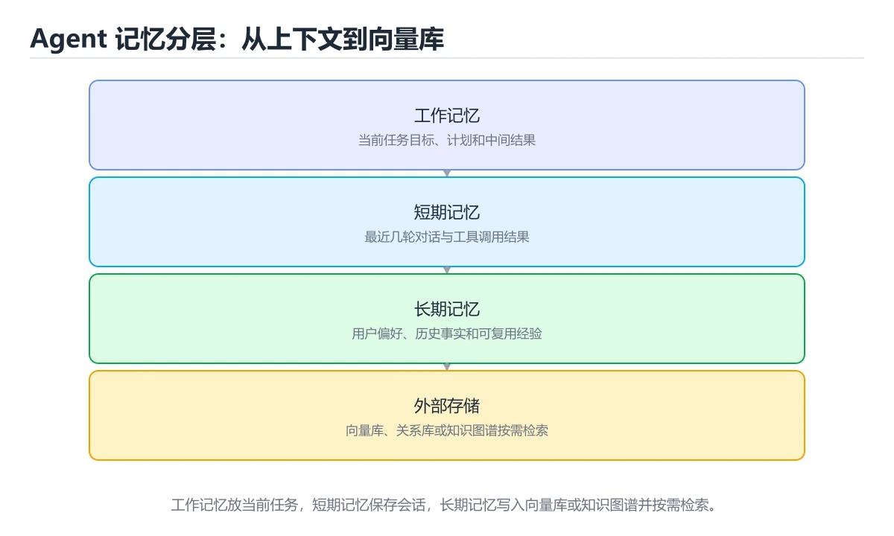
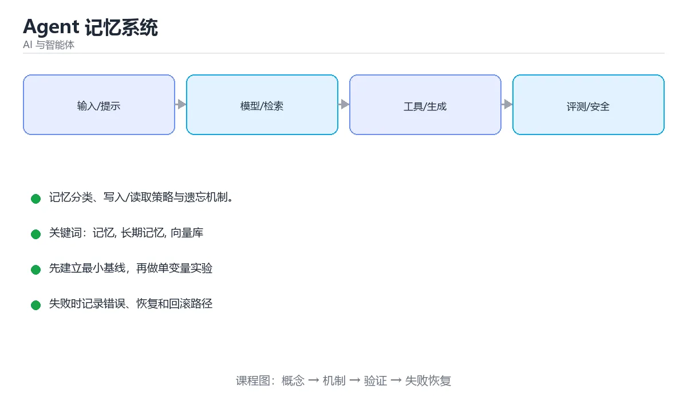

# Agent 记忆系统





> 内容更新时间：2026-10-06 · 学习阶段：进阶 · 预计用时：30 分钟

## 学习目标

- 能用自己的话解释Agent 记忆系统解决了什么问题，而不是只背术语。
- 能说清 「记忆」、「长期记忆」、「向量库」、「遗忘」 之间的关系，并分别举出一个例子。
- 能把本课知识放回「AI 与智能体」的知识体系，说明它和相邻主题的边界。
- 能完成本课练习，并用验收标准检查自己的结果。

> 一句话摘要：记忆分类、写入/读取策略与遗忘机制。

## 前置知识

- 先完成上一课《模型评测与选型》；如果已经掌握，可以直接用本课练习自测。
- 开始前先复习：记忆、长期记忆、向量库。
- 如果某一步看不懂，先记录具体卡点，完成练习后再回头读一遍。

## 为什么需要记忆

上下文窗口有限，且 token 越多越贵、注意力越分散。记忆系统负责在「该记住什么」与「该忘掉什么」之间做取舍。

| 类型 | 内容 | 存储方式 |
| --- | --- | --- |
| 短期记忆 | 当前会话的最近若干轮 | 上下文窗口 |
| 长期记忆 | 用户偏好、事实、关键结论 | 向量库 / 键值存储 |
| 情景记忆 | 过去任务的过程与结果 | 结构化日志 + 摘要 |
| 语义记忆 | 抽象出的规则与知识 | 知识库 / 规则表 |

## 写入策略

不是所有内容都值得记。常见做法：

1. **按重要性过滤**：只保存用户明确表达的偏好、稳定的实体信息与结论。
2. **结构化抽取**：让模型输出 `{type, key, value, confidence}` 再入库，而不是存原始对话。
3. **去重与合并**：同一事实的新值应覆盖旧值（如「用户换了手机号」）。
4. **带时间戳与来源**：便于判断时效与冲突。

## 读取策略

1. 按当前问题做向量检索 + 关键词检索，取 Top-K 相关记忆。
2. 优先最近使用与高置信度的记忆（类似 LRU + 置信度加权）。
3. 记忆要注入到提示的固定位置，并注明「以下为历史记忆，可能过时」。
4. 关键决策前让模型确认：如「你之前提到偏好经济型酒店，是否仍然适用？」

## 压缩与遗忘

长会话必须压缩：把久远对话摘要成要点，只保留最近若干轮原文。遗忘策略包括 TTL 过期、容量上限淘汰、以及用户主动删除（合规刚需）。**要提供「查看与删除记忆」的入口**，否则用户会担心隐私。

## 常见错误与排查

| 现象 | 原因 | 对策 |
| --- | --- | --- |
| 记错或串味 | 写入未做抽取与归一化 | 结构化存储 + 冲突检测 |
| 检索不到 | 只存了原始长文本 | 存要点并做嵌入 |
| 记忆膨胀 | 无上限写入 | 容量、TTL 与重要性过滤 |
| 过度依赖旧记忆 | 未标注时效 | 注入时标注时间并要求确认 |
| 容易踩的做法 | 实际现象 | 原因与正确做法 |
| 把整段对话都存为记忆 | 噪声大、检索差 | 结构化摘要后再写入 |
| 不做去重 | 记忆重复、上下文膨胀 | 相似度阈值 + 唯一键 |
| 不做用户隔离 | 跨用户泄漏 | 检索前强制按用户过滤 |
| 只按相似度排序 | 重要记忆被淹没 | 相似度 + 新近度 + 重要性加权 |
| 检索结果全量注入 | 上下文被污染 | 只注入 top 少量记忆 |
| 无可视化与删除入口 | 合规不达标 | 提供查看、删除与导出 |
| 记忆永不过期 | 存储无限增长 | TTL + 容量上限 |
| 冲突记忆不处理 | 行为前后矛盾 | 覆盖时保留版本并标注时间 |
| 把模型猜测写入记忆 | 错误长期留存 | 只写入用户确认或高置信信息 |
| 不做访问审计 | 泄漏无法追溯 | 记录读写与删除日志 |

## 本课小结

好的记忆系统 = **有价值的写入 + 相关的读取 + 可控的遗忘**。它比单纯加大上下文窗口更省钱，也更符合隐私与合规要求。

## 记忆分层速查

| 层 | 内容 | 存储 | 生命周期 |
| --- | --- | --- | --- |
| 工作记忆 | 当前对话上下文 | 内存 / 上下文窗口 | 单次会话 |
| 会话摘要 | 历史对话压缩 | 数据库 | 中期 |
| 长期语义记忆 | 事实、偏好、结论 | 向量库 + 关系库 | 长期 |
| 情景记忆 | 具体事件与结果 | 事件表 | 长期，可归档 |
| 程序性记忆 | 常用流程与工具用法 | 提示模板库 | 长期 |

## 写入与检索速查

| 环节 | 建议 |
| --- | --- |
| 写入时机 | 会话结束、用户显式要求、重要事件发生时 |
| 写入内容 | 结构化字段：类型、主体、内容、时间、来源 |
| 去重 | 相似度阈值 + 唯一键，避免重复记忆 |
| 冲突处理 | 新记忆覆盖旧记忆时保留历史版本 |
| 检索 | 向量检索 + 元数据过滤（用户、类型、时间） |
| 排序 | 相似度 + 新近度 + 重要性加权 |
| 注入 | 只注入最相关的少量记忆，避免污染上下文 |
| 清理 | TTL + 容量上限 + 用户删除接口 |

```python
import math
import time
from dataclasses import dataclass, field

@dataclass
class Memory:
    memory_id: str
    user_id: str
    content: str
    kind: str                   # preference / fact / event
    created_at: float
    importance: float = 0.5     # 0 到 1
    vector: tuple = ()
    source: str = "chat"

    def age_days(self, now: float | None = None) -> float:
        now = time.time() if now is None else now
        return (now - self.created_at) / 86400

def cosine(a: tuple, b: tuple) -> float:
    if not a or not b:
        return 0.0
    dot = sum(x * y for x, y in zip(a, b))
    na = math.sqrt(sum(x * x for x in a))
    nb = math.sqrt(sum(y * y for y in b))
    return 0.0 if na == 0 or nb == 0 else dot / (na * nb)

def score(memory: Memory, query_vec: tuple, now: float | None = None) -> float:
    """综合相似度、新近度与重要性的记忆打分。"""
    similarity = cosine(query_vec, memory.vector)
    recency = math.exp(-memory.age_days(now) / 30)      # 30 天半衰期
    return round(0.6 * similarity + 0.2 * recency + 0.2 * memory.importance, 4)

def retrieve(memories: list, query_vec: tuple, user_id: str, top_k: int = 5) -> list:
    """检索前先按用户隔离，避免跨用户记忆泄漏。"""
    candidates = [m for m in memories if m.user_id == user_id]
    ranked = sorted(candidates, key=lambda m: -score(m, query_vec))
    return ranked[:top_k]

def should_write(memory: Memory, existing: list, threshold: float = 0.92) -> bool:
    """写入前去重：与已有记忆过于相似则不再写入。"""
    return all(cosine(memory.vector, m.vector) < threshold for m in existing)

now = time.time()
memories = [
    Memory("m1", "u1", "偏好简洁回答", "preference", now - 86400, 0.8, (0.9, 0.1, 0.0)),
    Memory("m2", "u2", "另一用户的偏好", "preference", now, 0.9, (0.9, 0.1, 0.0)),
]
print([m.memory_id for m in retrieve(memories, (0.85, 0.15, 0.0), "u1")])
```

## 合规要点速查

| 要求 | 做法 |
| --- | --- |
| 用户知情 | 明确告知会记录哪些内容 |
| 可查看 | 提供记忆列表查询接口 |
| 可删除 | 提供单条与全部删除能力 |
| 可导出 | 支持导出为结构化数据 |
| 最小化 | 只存必要信息，敏感字段不入库 |
| 隔离 | 按用户与租户严格隔离 |
| 保留期 | 明确 TTL 与自动清理策略 |
| 审计 | 记录记忆的读写与删除操作 |

## 复习与自测

- [ ] 记忆分层清晰：工作、会话摘要与长期记忆分离。
- [ ] 写入前去重，冲突时保留历史版本。
- [ ] 检索做用户隔离并按相似度、新近度、重要性综合排序。
- [ ] 用户可查看、删除与导出自己的记忆。
- [ ] 有 TTL、容量上限与访问审计。

## 动手练习

> 本课练习重点：围绕「记忆、长期记忆、向量库」完成复述、实验和交付，每个结果都要能被别人检查。

先写评测样例，再改一个提示、模型或数据变量，最后比较质量、成本与安全。

### 练习 1：建立心智模型（10 分钟）

合上教程，用 3～5 句话回答：

1. Agent 记忆系统解决了什么问题？
2. 如果没有它，会出现什么具体后果？
3. 它和「长期记忆」是什么关系？

**验收标准**：至少出现一个本课关键词，并写出一个反例、边界条件或失效场景。

### 练习 2：做一次可控实验（20 分钟）

从正文中选一个最小示例，完成以下操作：

1. 先预测修改一个参数、输入或步骤后的结果。
2. 再实际执行或逐步推演，记录真实结果。
3. 如果结果与预测不同，写出差异原因。

**验收标准**：留下「原例 → 改动 → 预测 → 结果 → 原因」五步记录。

### 练习 3：交付一个小结果（30 分钟）

构造 5 条小型离线样例，写清输入、期望输出、评分标准和失败案例。

任务要求：

- 结果必须能被别人检查，不能只写“我已经理解了”。
- 至少覆盖「记忆」和「长期记忆」两个关键词。
- 写出 1 个仍然不确定的问题，以及下一步如何验证。

> 提示：时间有限时优先做练习 1 和练习 2；练习 3 可以拆成两次完成。

## 可运行练习

### 任务 1：先跑通，再解释

```python
import math
import time
from dataclasses import dataclass, field

@dataclass
class Memory:
    memory_id: str
    user_id: str
    content: str
    kind: str                   # preference / fact / event
    created_at: float
    importance: float = 0.5     # 0 到 1
    vector: tuple = ()
    source: str = "chat"

    def age_days(self, now: float | None = None) -> float:
        now = time.time() if now is None else now
        return (now - self.created_at) / 86400

def cosine(a: tuple, b: tuple) -> float:
    if not a or not b:
        return 0.0
    dot = sum(x * y for x, y in zip(a, b))
    na = math.sqrt(sum(x * x for x in a))
    nb = math.sqrt(sum(y * y for y in b))
    return 0.0 if na == 0 or nb == 0 else dot / (na * nb)

def score(memory: Memory, query_vec: tuple, now: float | None = None) -> float:
    """综合相似度、新近度与重要性的记忆打分。"""
    similarity = cosine(query_vec, memory.vector)
    recency = math.exp(-memory.age_days(now) / 30)      # 30 天半衰期
    return round(0.6 * similarity + 0.2 * recency + 0.2 * memory.importance, 4)

def retrieve(memories: list, query_vec: tuple, user_id: str, top_k: int = 5) -> list:
    """检索前先按用户隔离，避免跨用户记忆泄漏。"""
    candidates = [m for m in memories if m.user_id == user_id]
    ranked = sorted(candidates, key=lambda m: -score(m, query_vec))
    return ranked[:top_k]

def should_write(memory: Memory, existing: list, threshold: float = 0.92) -> bool:
    """写入前去重：与已有记忆过于相似则不再写入。"""
    return all(cosine(memory.vector, m.vector) < threshold for m in existing)

now = time.time()
memories = [
    Memory("m1", "u1", "偏好简洁回答", "preference", now - 86400, 0.8, (0.9, 0.1, 0.0)),
    Memory("m2", "u2", "另一用户的偏好", "preference", now, 0.9, (0.9, 0.1, 0.0)),
]
print([m.memory_id for m in retrieve(memories, (0.85, 0.15, 0.0), "u1")])
```

### 任务 2：只改一个条件

把「Agent 记忆系统」的最小示例复制一份，只改一个条件再跑一次：

- 改动点：只把记忆的输入换成空值、极值或错误输入，其余保持不变。
- 预测：先写下「Agent 记忆系统」在改动后的输出或错误信息，再运行。
- 记录：对照改动前后的结果，指出差异出在哪一步。
- 验收：换回原条件能复现原结果，改动只影响记忆。

### 任务 3：迁移到自己的数据

用同一套思路处理一组你自己的数据或场景，保持输出格式与任务 1 一致。

## 故障现场

### 现场 1：本课的 记忆 常规用例通过，但边界用例失败

**症状**：在本课的练习或生产场景里出现“本课的 记忆 常规用例通过，但边界用例失败”。

**复现**：准备一组最小输入，只保留触发“本课的 记忆 常规用例通过，但边界用例失败”的必要条件，连续运行两次确认结果稳定。

**定位**：围绕“记忆 的前置条件与取值边界没有写进代码，默认值掩盖了空值和极值”检查调用链、输入数据和环境配置，先验证假设再改代码。

**预防**：把“本课的 记忆 常规用例通过，但边界用例失败”写成一条自动化用例，并在本课的验收清单里保留对应检查项。

### 现场 2：本课的 长期记忆 结果在两次运行之间不一致

**症状**：在本课的练习或生产场景里出现“本课的 长期记忆 结果在两次运行之间不一致”。

**复现**：准备一组最小输入，只保留触发“本课的 长期记忆 结果在两次运行之间不一致”的必要条件，连续运行两次确认结果稳定。

**定位**：围绕“长期记忆 依赖了当前版本、执行顺序或共享状态，单次运行无法暴露差异”检查调用链、输入数据和环境配置，先验证假设再改代码。

**预防**：把“本课的 长期记忆 结果在两次运行之间不一致”写成一条自动化用例，并在本课的验收清单里保留对应检查项。

### 现场 3：离线评测分数很高，线上仍然频繁给出错误答案

**定位**：围绕“评测集与真实输入分布不一致，记忆 的提示词或检索结果没有覆盖失败场景”检查调用链、输入数据和环境配置，先验证假设再改代码。

## 深入补充：Agent 记忆系统 的取舍与边界

### 一、把概念放回真实约束

学习Agent 记忆系统时，最容易只记住结论而忽略前提。先写出三个约束：数据规模、时间预算、可接受的失败方式；再判断 记忆 与 长期记忆 在这些约束下是否仍然成立。只要约束改变，原来的最优解就可能变成错误解。

| 维度 | 要回答的问题 | 常见做法 | 失败信号 |
| --- | --- | --- | --- |
| 数据 | 记忆 的训练或检索数据从哪来、质量如何 | 清洗、去重、标注与版本化 | 评测集泄漏或分布漂移 |
| 模型 | 长期记忆 的能力边界与成本是多少 | 基线对比、离线评测、灰度发布 | 指标好看但线上任务失败 |
| 评测 | 如何证明改动真的有效 | 固定评测集、人工抽检、A/B | 只比较单例输出 |
| 安全 | 失败时会不会泄露或越权 | 权限校验、内容过滤、审计 | 提示注入或数据外泄 |

### 二、三个容易混淆的边界

1. 澄清输入与目标。先写清「Agent 记忆系统」要解决的问题、合法输入范围和成功标准，再进入后续步骤。
2. **把“平均值”当成“全部”**：记忆 的指标好看，不代表尾部请求、冷启动或失败重试也好看。
3. **把“当前版本”当成“永久行为”**：长期记忆 依赖的默认值、API 或性能特征都可能随版本变化，需要固定版本并保留回归用例。

### 三、一个生产场景

假设团队要在真实系统里使用Agent 记忆系统：第一周先做小流量验证，记录 记忆 的基线与异常；第二周扩大输入规模，观察 长期记忆 是否成为瓶颈；第三周再做故障演练，主动注入超时、重复请求和依赖不可用，确认系统能降级、能重试、能恢复。每一步都要留下指标、日志和结论，而不是只留下“感觉更快了”。

### 四、自测清单

- 能否用一句话说出Agent 记忆系统解决的核心问题与不适用场景？
- 能否画出 记忆 的数据流或状态变化，并标出失败路径？
- 能否给出一个反例，证明某个看似合理的结论在边界条件下不成立？
- 能否写出一条可复现的验证命令，让别人独立得到相同结论？

### 五、AI 工程补充

在Agent 记忆系统里，模型输出只是系统的一部分：输入要先经过权限与数据质量检查，检索或工具调用要有超时和降级，输出要经过引用核验或规则校验，最后记录 token、延迟、失败类型和人工反馈。评测时至少准备固定题、边界题和对抗题，并把 记忆 与 长期记忆 的指标分开记录；否则一次提示词改动看似提升体验，实际可能只是评测样本泄漏或随机波动。

## 本课复习清单

离开本课前，逐项确认：

- [ ] 不看解析，能说出「长期记忆常用的存储方式是？」的判断依据。
- [ ] 不看解析，能说出「记忆写入的推荐做法是？」的判断依据。
- [ ] 不看解析，能说出「从合规角度，记忆系统必须提供什么？」的判断依据。
- [ ] 不看解析，能说出「短期记忆与长期记忆的区别是？」的判断依据。
- [ ] 不看解析，能说出「记忆检索常用的实现方式是？」的判断依据。
- [ ] 不看解析，能说出的判断依据。
- [ ] 至少运行一次本课示例，记录输入、输出和一个边界情况。
- [ ] 把本课最容易混淆的两个概念写成一句话对照。

| 复盘项 | 记录 |
| --- | --- |
| 已经能独立解释的考点 |  |
| 仍然说不清的概念 |  |
| 下一步验证动作 |  |

## 术语速查

| 术语 | 本课语境 |
| --- | --- |
| `{type, key, value, confidence}` | 结构化抽取**：让模型输出 `{type, key, value, confidence}` 再入库，而不是存原始对话。 |
| `记忆` | 围绕“评测集与真实输入分布不一致，记忆 的提示词或检索结果没有覆盖失败场景”检查调用链、输入数据和环境配置，先验证假设再改代码。 |
| `长期记忆` | 围绕“长期记忆 依赖了当前版本、执行顺序或共享状态，单次运行无法暴露差异”检查调用链、输入数据和环境配置，先验证假设再改代码。 |
| `向量库` | 它在「Agent 记忆系统」里是理解「向量库」的关键术语，用来解释定义、适用条件与失败路径；它与记忆、长期记忆共同决定这一节的判断边界。复习时回到正文示例核对输入、输出和验证方式。 |
| `遗忘` | 它在「Agent 记忆系统」里是理解「遗忘」的关键术语，用来解释定义、适用条件与失败路径；它与记忆、长期记忆共同决定这一节的判断边界。复习时回到正文示例核对输入、输出和验证方式。 |
| `隐私` | 它在「Agent 记忆系统」里是理解「隐私」的关键术语，用来解释定义、适用条件与失败路径；它与记忆、长期记忆共同决定这一节的判断边界。复习时回到正文示例核对输入、输出和验证方式。 |

## 考点精讲

### 考点 1：概念判断·记忆

- **题目**：长期记忆常用的存储方式是？
- **判断依据**：按相关性检索长期记忆，避免全部塞进上下文。在「Agent 记忆系统」里，其他选项：长期记忆常用向量库或键值存储持久化。在「Agent 记忆系统」里，作答时，先用记忆建立输入与输出的基线，再把向量库或键值存储代入边界条件核对，结论才能复现。在「Agent 记忆系统」里判断这道题，要把记忆、长期记忆、向量库的条件、过程与失败路径逐项对齐，换成“长期记忆常用的存储方式是”这个场景，只有满足前提的结论才成立。

### 考点 2：多选辨析·记忆

- **题目**：围绕“Agent 记忆系统”中的 记忆、长期记忆、向量库，下列哪两项是本课强调的实践判断？
- **判断依据**：本课把Agent 记忆系统拆成概念、示例与故障现场三部分，因此判断 记忆 时必须同时交代输入、输出和失败路径，这使“学习 记忆 时要同时说明输入、输出和失败路径，不能只看正常流程”成立。在Agent 记忆系统里，判断 长期记忆 时要固定版本与边界输入，所以“验证 长期记忆 时要固定版本并覆盖边界输入，结论才可复现”才可复现。

### 考点 3：概念判断·记忆

- **题目**：「Agent 记忆系统」的核心结论是什么？
- **判断依据**：题干的正确项是Agent 记忆系统：记忆分类、写入/读取策略与遗忘机制。在「Agent 记忆系统」里，把记忆、长期记忆、向量库放进最小示例验证，换成空值或极值后结论仍要成立。在「Agent 记忆系统」里判断这道题，要把记忆、长期记忆、向量库的条件、过程与失败路径逐项对齐，换成“Agent 记忆系统的核心结论是什么”这个场景，只有满足前提的结论才成立。

### 考点 4：概念判断·记忆

- **题目**：短期记忆与长期记忆的区别是？
- **判断依据**：在「Agent 记忆系统」里，结论应落在「短期记忆是当前会话上下文」。上下文窗口有限且费用高，因此需要把重要信息抽出来持久化。在「Agent 记忆系统」里，这道题要求区分概念与边界，「短期记忆是当前会话上下文」只有在题干给出的前提下才成立，而「两者完全相同」、「长期记忆只存在于上下文窗口内」缺少同一组条件。

### 考点 5：概念判断·记忆

- **题目**：记忆检索常用的实现方式是？
- **判断依据**：在「Agent 记忆系统」里，向量检索 + 元数据过滤（用户、时间、类型）。元数据过滤能避免把别的用户或过期记忆召回进来，是合规与质量的双重要求。在「Agent 记忆系统」里判断这道题，要把记忆、长期记忆、向量库的条件、过程与失败路径逐项对齐，换成“记忆检索常用的实现方式是”这个场景，只有满足前提的结论才成立。

### 考点 6：填空·记忆

- **题目**：补全代码：「Agent 记忆系统」示例中，下面这行代码缺少哪个关键字或函数名？请填入 ____。 `similarity = cosine(query_vec, ____.vector)`
- **判断依据**：在「Agent 记忆系统」里，memory。本课还在读取策略中说明：关键决策前让模型确认：如你之前提到偏好经济型酒店，是否仍然适用。这道题的关键在「Agent 记忆系统」的记忆、长期记忆、向量库：先确认题干“补全代码”问的是哪一步，再排除偷换前提的选项。

## English Overview

**Title:** Agent Memory

**Summary:** Memory types, write/read strategies and forgetting.

**Category:** AI & Agents
**Level:** 高级
**Key terms:** 记忆, 长期记忆, 向量库, 遗忘, 隐私

## 内容元数据

- 内容版本：v2.0
- 最后更新：2026-10-06
- 学习阶段：进阶
- 适用环境：主流大模型 API、开源模型与向量数据库
- 内容来源：内置结构化课程与工程实践整理
- 相关主题：记忆、长期记忆、向量库、遗忘、隐私
- 质量版本：P0 测验标准 + P1 覆盖扩展 + P2 体验补全

## 参考资料与复核

- 最后复核：2026-10-04
- 下次复核：2027-04-04
- 复核范围：版本兼容、API 行为、安全建议与工程实践
- 来源性质：官方文档、标准或权威教材；正文为离线教学重组

| 参考资料 | 本课用途 |
| --- | --- |
| [Anthropic 文档](https://docs.anthropic.com/) | Claude API 与 Agent 安全 |
| [Model Context Protocol](https://modelcontextprotocol.io/) | Agent 工具与上下文协议 |
| [LlamaIndex 文档](https://docs.llamaindex.ai/) | 索引、检索与数据框架 |

> 「Agent 记忆系统」的链接用于离线阅读后的延伸核对；App 不会自动联网。
