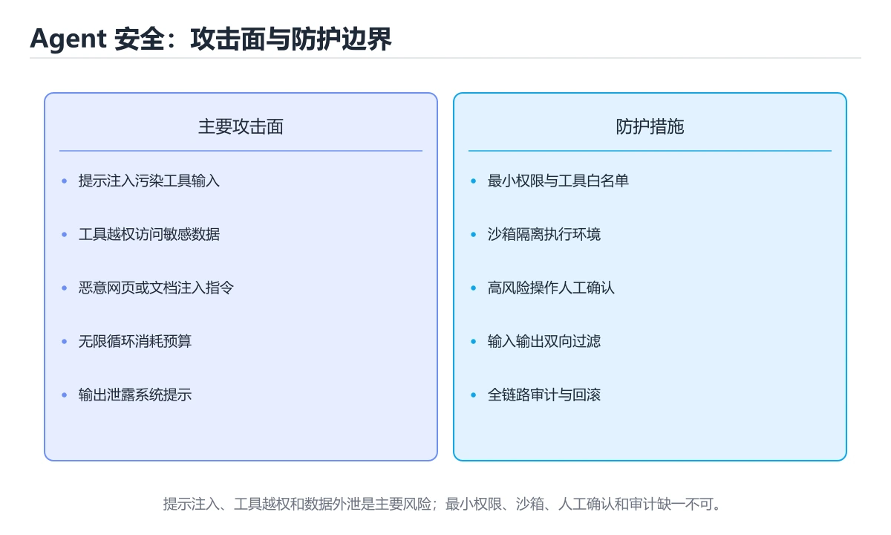
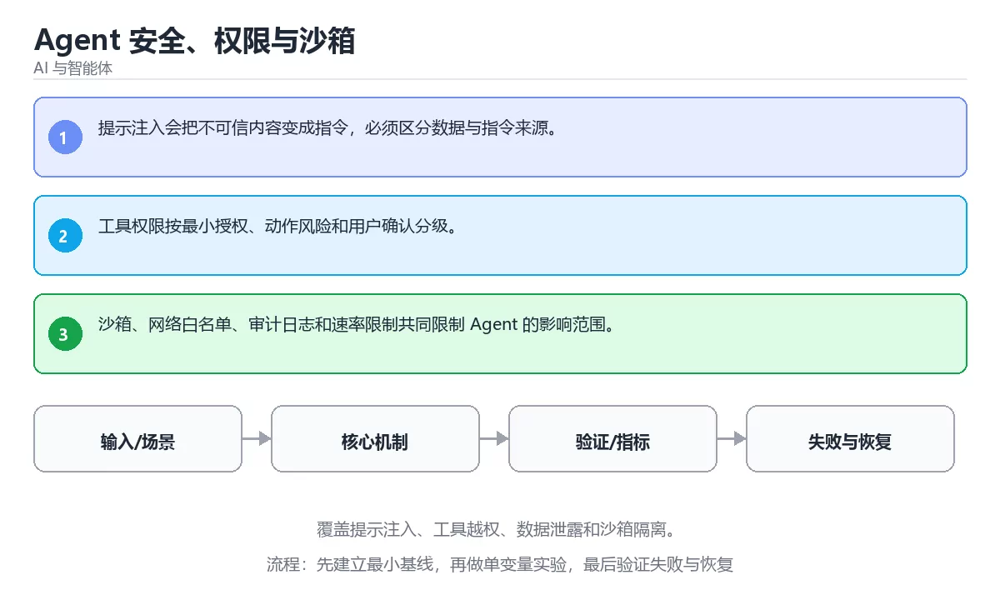

# Agent 安全、权限与沙箱

> 内容更新时间：2026-10-06 · 学习阶段：高级 · 预计用时：40 分钟





## 本节知识框架

**课程定位**：所属分类 `ai`（AI 与智能体），课程主题 `Agent 安全、权限与沙箱`，学习阶段 高级，建议用时 40 分钟。

本课主线：覆盖提示注入、工具越权、数据泄露和沙箱隔离。

**学完本课应当能够**
- 说清 `Agent 安全` 与 `提示注入` 的含义与区别，并各举一个正例和一个反例。
- 用本课示例验证 `沙箱` 的行为，记录输入、输出与失败条件。
- 遇到「只审提示词不管工具权限」这类问题时，能说出触发条件与修复顺序。

### 从概念到验证的学习链条

1. `Agent 安全`：先掌握 限制智能体工具、数据和权限，防止提示注入、越权与不可逆操作，再用它解释 `提示注入` 为什么会出现。
2. `提示注入`：先掌握 提示注入会把不可信内容变成指令，必须区分数据与指令来源，再用它解释 `沙箱` 为什么会出现。
3. `沙箱`：先掌握 按“Agent 安全、权限与沙箱”中 Agent 安全、提示注入、沙箱 的实践顺序，把四个步骤排成从准备到复盘的合理顺序，再用它解释 `最小权限` 为什么会出现。
4. `最小权限`：先掌握 每个账号、进程或服务只获得完成当前任务所需的权限，把泄露影响面降到最低，再用它解释 本课示例的观察结果 为什么会出现。

**先修与衔接**：本课是「AI 与智能体」分类的第 40 课。先修内容：《代码 Agent 与软件工程自动化》。《代码 Agent 与软件工程自动化》里的 `代码 Agent`、`测试` 是本课的前提。相关或后续课程：《安全护栏与内容审核》。

### 完成判据

- **定义关**：不看正文也能说明 `Agent 安全` 是 限制智能体工具、数据和权限，防止提示注入、越权与不可逆操作，并指出一个反例。
- **机制关**：能按“输入 → 转换 → 输出 → 验证”复述 `Agent 安全、权限与沙箱`，而不是只背结论。
- **示例关**：能运行或推演 `Agent 安全、权限与沙箱` 的 `text` 示例，并说明一个真实出现的标识符或字面量。
- **证据关**：能指出 `Agent 安全、权限与沙箱` 示例里的 调用了 `score()`，并说明它支持或反驳了本课的哪一条结论。
- **排错关**：能复现 只审提示词不管工具权限，记录现象并按 按最小权限给每个工具单独授权，敏感操作要求二次确认 修复。
- **迁移关**：能把 `Agent 安全`、`提示注入`、`沙箱`、`最小权限` 放进一个与 `Agent 安全、权限与沙箱` 不同的项目场景，并保持输入与验证条件可追踪。
- **复盘关**：学完 `Agent 安全、权限与沙箱` 后，用一句话写下仍然不确定的结论，并列出下一次验证需要的输入、环境和成功判据。

### 复习清单

- [ ] 能不看正文复述本课核心术语，并指出一个边界或反例。
- [ ] 能运行或推演本课示例，记录输入、输出与失败现象。
- [ ] 能完成一次自测，并把错题对照错误表定位原因。

## 核心概念定义

| 术语 | 操作性定义 | 常见边界与风险 |
| --- | --- | --- |
| Agent 安全 | 限制智能体工具、数据和权限，防止提示注入、越权与不可逆操作。 | 权限与密钥策略变化会让结论失效，按最小权限并用真实凭据流程复验。 |
| 提示注入 | 提示注入会把不可信内容变成指令，必须区分数据与指令来源。 | 权限与密钥策略变化会让结论失效，按最小权限并用真实凭据流程复验。 |
| 沙箱 | 按“Agent 安全、权限与沙箱”中 Agent 安全、提示注入、沙箱 的实践顺序，把四个步骤排成从准备到复盘的合理顺序。 | 易错：执行的代码可以外联或读取宿主文件；正确做法是默认禁网、只读挂载必需目录，并限制运行时长与资源。 |
| 最小权限 | 每个账号、进程或服务只获得完成当前任务所需的权限，把泄露影响面降到最低。 | 易错：Agent 拿到的凭据权限过大，一次误判就能改生产数据；正确做法是按最小权限给每个工具单独授权，敏感操作要求二次确认。 |

## 原理与运行机制

### 机制总览

**教材衔接：核心知识**

### 1. 提示注入会把不可信内容变成指令，必须区分数据与指令来源。

- 关键做法：先用 answer 建立 Agent 安全 的基线，再逐步加入边界与失败条件。
- 验证标准：Agent 安全 的结果可复现、错误可解释、失败能恢复。

### 2. 工具权限按最小授权、动作风险和用户确认分级。

把这条结论放回「Agent 安全、权限与沙箱」的完整流程里展开：

- 正文依据：能用自己的话解释：提示注入会把不可信内容变成指令，必须区分数据与指令来源。
- 落地检查：把「2. 工具权限按最小授权、动作风险和用户确认分级。」改写成一条可执行的核对项，逐条验证输入、超时与失败路径。

### 3. 沙箱、网络白名单、审计日志和速率限制共同限制 Agent 的影响范围。

把这条结论放回「Agent 安全、权限与沙箱」的完整流程里展开：

- 正文依据：能用自己的话解释：沙箱、网络白名单、审计日志和速率限制共同限制 Agent 的影响范围。
- 落地检查：把「3. 沙箱、网络白名单、审计日志和速率限制共同限制 Agent 的影响范围。」改写成一条可执行的核对项，逐条验证输入、超时与失败路径。

**教材衔接：关键流程**

**教材衔接：实践路径**

**教材衔接：深入补充：Agent 安全、权限与沙箱 的取舍与边界**

### 一、把概念放回真实约束

| 维度 | 要回答的问题 | 常见做法 | 失败信号 |
| --- | --- | --- | --- |
| 数据 | Agent 安全 的训练或检索数据从哪来、质量如何 | 清洗、去重、标注与版本化 | 评测集泄漏或分布漂移 |
| 模型 | 提示注入 的能力边界与成本是多少 | 基线对比、离线评测、灰度发布 | 指标好看但线上任务失败 |
| 评测 | 如何证明改动真的有效 | 固定评测集、人工抽检、A/B | 只比较单例输出 |
| 安全 | 失败时会不会泄露或越权 | 权限校验、内容过滤、审计 | 提示注入或数据外泄 |


### 四、自测清单

- 能否用一句话说出Agent 安全、权限与沙箱解决的核心问题与不适用场景？
- 能否画出 Agent 安全 的数据流或状态变化，并标出失败路径？
- 把 answer 的输入推到边界，说明本课哪一条结论会先失效。
- 能否写出一条可复现的验证命令，让别人独立得到相同结论？

### 五、AI 工程补充

**教材衔接：零基础精讲：把Agent 安全、权限与沙箱真正讲透**

### 先建立一个直觉

把「Agent 安全、权限与沙箱」看成一条可评测的流水线：输入经过 Agent 安全 处理，产出候选结果，再由 提示注入 决定哪些结果可以真正执行；每一环都要有可测的输入、输出与失败处理。

本课的摘要可以当作一张地图：覆盖提示注入、工具越权、数据泄露和沙箱隔离。

### 逐步拆解

1. 澄清输入与目标。先写清「Agent 安全、权限与沙箱」要解决的问题、合法输入范围和成功标准，再进入后续步骤。
2. 描述处理过程。把「Agent 安全、提示注入、沙箱、最小权限」映射到具体步骤，每步都要求能单独验证。
3. 定义输出。Agent 安全 的输出不仅包括正常结果，还包括错误码、日志和资源释放状态。
4. 让「Agent 安全、权限与沙箱」的失败路径尽早暴露：把Agent 安全推到边界值，记录错误信息、重试或降级动作，以及人工兜底条件。
5. 选一个只有两三步的Agent 安全例子，先写出预期输出，再运行确认；不一致时先怀疑前提而不是代码。

### 把正文串成一条执行链

- **1. 提示注入会把不可信内容变成指令，必须区分数据与指令来源。**：在「Agent 安全、权限与沙箱」里，「1. 提示注入会把不可信内容变成指令，必须区分数据与指令来源。」这一步要先写清输入与预期，再记录实际结果和差异；结果不符时回到对应小节核对前提。
- **2. 工具权限按最小授权、动作风险和用户确认分级。**：在「Agent 安全、权限与沙箱」里，「2. 工具权限按最小授权、动作风险和用户确认分级。」这一步要先写清输入与预期，再记录实际结果和差异；结果不符时回到对应小节核对前提。
- **3. 沙箱、网络白名单、审计日志和速率限制共同限制 Agent 的影响范围。**：在「Agent 安全、权限与沙箱」里，「3. 沙箱、网络白名单、审计日志和速率限制共同限制 Agent 的影响范围。」这一步要先写清输入与预期，再记录实际结果和差异；结果不符时回到对应小节核对前提。
- **考点 1：按“Agent 安全、权限与沙箱”中 Agent 安全、提示注入、沙箱 的实践顺序，把四个步骤排成从准备到复盘的合理顺序。**：先独立作答，再回到本课对应小节核对判断依据；答错时记录是哪一个前提被忽略。
- **考点 2：核心知识 的代码阅读题**：先独立作答，再回到本课正文核对 answer 的执行路径；答错时记录是哪一个前提被忽略。
- **考点 3：关于「沙箱、网络白名单、审计日志和速率限制共同限制 Agent 的影响范围。」，下列说法正确的是？**：先独立作答，再回到本课对应小节核对判断依据；答错时记录是哪一个前提被忽略。

### 从测验反推易错点

- 参考判断：提示注入会把不可信内容变成指令，必须区分数据与指令来源。
- 自问：如果去掉题干里的一个限定词，结论还成立吗？

- 参考判断：工具权限按最小授权、动作风险和用户确认分级。

- 参考判断：沙箱、网络白名单、审计日志和速率限制共同限制 Agent 的影响范围。

**检查点 4：本课的核心学习目标是什么？**

- 参考判断：覆盖提示注入、工具越权、数据泄露和沙箱隔离。

- 参考判断：Agent 安全、提示注入

### 工程排错顺序

| 先查什么 | 要得到的证据 | 判断标准 |
| --- | --- | --- |
| 模型输入是否经过长度、格式与敏感信息检查？ | 日志、输入样例、测试或指标 | 能复现并解释，才算定位 |
| 工具调用是否最小权限、可超时、可取消？ | 日志、输入样例、测试或指标 | 能复现并解释，才算定位 |
| 输出是否有引用、置信度或人工复核兜底？ | 日志、输入样例、测试或指标 | 能复现并解释，才算定位 |
| 成本、延迟与失败率是否有指标？ | 日志、输入样例、测试或指标 | 能复现并解释，才算定位 |

### 变式训练

1. 把 Agent 安全 放进一个只有单机、没有额外依赖的小项目，先保证正确再扩展。
2. 把 Agent 安全 的输入规模扩大十倍，记录时间、内存和失败路径，找出第一个瓶颈。
3. 制造一次 Agent 安全 相关的依赖超时或错误输入，要求错误可解释且不留半完成状态。
5. 减少一个输入字段后重跑 answer，记录失败信息出现在哪一层，据此判断这个字段是必填还是可推导。
6. 限制 CPU 与内存上限后重跑 answer，观察哪一项参数需要重新设定。


### 迁移案例库

围绕 answer 重复同一套方法，每完成一轮就把差异写进笔记。

#### 迁移案例 1：围绕「Agent 安全」做一次小实验

**验收**：Agent 安全 的正常、边界、失败三条路径都要有结论；失败路径要写清恢复动作与「Agent 安全、权限与沙箱」里仍然存在的剩余风险。

#### 迁移案例 2：围绕「提示注入」做一次小实验

**步骤**：
1. 复述当前方案对「提示注入」的假设，写成一句可证伪的话。

#### 迁移案例 3：围绕「沙箱」做一次小实验

**步骤**：
1. 复述当前方案对「沙箱」的假设，写成一句可证伪的话。

#### 迁移案例 4：围绕「最小权限」做一次小实验

**步骤**：
1. 复述当前方案对「最小权限」的假设，写成一句可证伪的话。

#### 迁移案例 5：围绕「Agent 安全」做一次小实验

**步骤**：

#### 迁移案例 6：围绕「提示注入」做一次小实验

**步骤**：

#### 迁移案例 7：围绕「沙箱」做一次小实验

**步骤**：

#### 迁移案例 8：围绕「最小权限」做一次小实验

**步骤**：

#### 迁移案例 9：围绕「Agent 安全」做一次小实验

**步骤**：

#### 迁移案例 10：围绕「提示注入」做一次小实验

**步骤**：

#### 迁移案例 11：围绕「沙箱」做一次小实验

**步骤**：

#### 迁移案例 12：围绕「最小权限」做一次小实验

**步骤**：

#### 迁移案例 13：围绕「Agent 安全」做一次小实验

**步骤**：

#### 迁移案例 14：围绕「提示注入」做一次小实验

**步骤**：

#### 迁移案例 15：围绕「沙箱」做一次小实验

**步骤**：

#### 迁移案例 16：围绕「最小权限」做一次小实验

**步骤**：

<!-- p0-depth-v2:end -->

**教材衔接：验证步骤**

### 机制拆解：每一步的输入、动作与输出

#### 1. `Agent 安全`
- 输入：`Agent 安全`；本步把 限制智能体工具、数据和权限，防止提示注入、越权与不可逆操作 当作判断规则。
- 动作：围绕 `Agent 安全` 保留中间状态，并记录它与 `提示注入` 的对应关系。
- 输出：`提示注入`，它可以被下一段代码、测试或记录继续使用。
- `Agent 安全` 的失败条件：权限与密钥策略变化会让结论失效，按最小权限并用真实凭据流程复验。

#### 2. `提示注入`
- 输入：`Agent 安全`；本步把 提示注入会把不可信内容变成指令，必须区分数据与指令来源 当作判断规则。
- 动作：围绕 `提示注入` 保留中间状态，并记录它与 `沙箱` 的对应关系。
- 输出：`沙箱`，它可以被下一段代码、测试或记录继续使用。
- `提示注入` 的失败条件：权限与密钥策略变化会让结论失效，按最小权限并用真实凭据流程复验。

#### 3. `沙箱`
- 输入：`提示注入`；本步把 按“Agent 安全、权限与沙箱”中 Agent 安全、提示注入、沙箱 的实践顺序，把四个步骤排成从准备到复盘的合理顺序 当作判断规则。
- 动作：围绕 `沙箱` 保留中间状态，并记录它与 `最小权限` 的对应关系。
- 输出：`最小权限`，它可以被下一段代码、测试或记录继续使用。
- `沙箱` 的失败条件：当沙箱只隔离进程不隔离网络时，会出现执行的代码可以外联或读取宿主文件。

#### 4. `最小权限`
- 输入：`沙箱`；本步把 每个账号、进程或服务只获得完成当前任务所需的权限，把泄露影响面降到最低 当作判断规则。
- 动作：围绕 `最小权限` 保留中间状态，并记录它与 `score` 的对应关系。
- 输出：`score`，它可以被下一段代码、测试或记录继续使用。
- `最小权限` 的失败条件：当只审提示词不管工具权限时，会出现Agent 拿到的凭据权限过大，一次误判就能改生产数据。

### 示例中的可观察事实

1. 调用了 `score()`；它对应的课程主题是 `Agent 安全、权限与沙箱`。
2. 调用了 `strip()`；它对应的课程主题是 `Agent 安全、权限与沙箱`。
3. 调用了 `print()`；它对应的课程主题是 `Agent 安全、权限与沙箱`。
4. 出现字面量 `agent`；它对应的课程主题是 `Agent 安全、权限与沙箱`。

### 复现实验记录

- 环境：`Agent 安全、权限与沙箱` 使用 `text` 示例，固定 `Agent 安全`、`提示注入`、`沙箱`、`最小权限` 作为第一组条件。
- 首轮输入：先确认 调用了 `score()`，预测 `Agent 安全` 会怎样变化。
- 基线观察：记录命令、输入、输出和错误原文，不用截图代替可复制的文本。
- 单变量修改：只改变 `Agent 安全`，观察 `最小权限` 是否仍满足定义。
- 失败注入：复现 只审提示词不管工具权限，确认现象是 Agent 拿到的凭据权限过大，一次误判就能改生产数据。
- 记录结论：把“修改前、修改后、预期变化、实际变化”写成四列表，这样复盘 `Agent 安全、权限与沙箱` 时才能区分概念错误与实现错误。

## 典型应用场景

- **只审提示词不管工具权限**：典型现象是Agent 拿到的凭据权限过大，一次误判就能改生产数据；正确做法是按最小权限给每个工具单独授权，敏感操作要求二次确认。
- **把工具返回的内容当指令**：典型现象是网页或文件里的注入文本被当成新任务执行；正确做法是区分数据与指令，外部内容只作为资料并标注来源。
- **沙箱只隔离进程不隔离网络**：典型现象是执行的代码可以外联或读取宿主文件；正确做法是默认禁网、只读挂载必需目录，并限制运行时长与资源。

### 最小验证场景

- 准备：保留 `text` 示例的原始输入，先记录 `Agent 安全、权限与沙箱` 的基线输出和完整运行命令。
- 观察：先核对 调用了 `score()`，再改变一个与 `Agent 安全` 相关的条件。
- 判定：新结果与 `Agent 安全、权限与沙箱` 的基线不同不等于错误；只有当差异破坏了 `Agent 安全` 的定义或错误表中的约束，才判定为失败。

### 选择与边界

- 使用 `Agent 安全` 时，先满足它的定义：限制智能体工具、数据和权限，防止提示注入、越权与不可逆操作；权限与密钥策略变化会让结论失效，按最小权限并用真实凭据流程复验。
- 使用 `提示注入` 时，先满足它的定义：提示注入会把不可信内容变成指令，必须区分数据与指令来源；权限与密钥策略变化会让结论失效，按最小权限并用真实凭据流程复验。
- 使用 `沙箱` 时，先满足它的定义：按“Agent 安全、权限与沙箱”中 Agent 安全、提示注入、沙箱 的实践顺序，把四个步骤排成从准备到复盘的合理顺序；易错：执行的代码可以外联或读取宿主文件；正确做法是默认禁网、只读挂载必需目录，并限制运行时长与资源。
- 使用 `最小权限` 时，先满足它的定义：每个账号、进程或服务只获得完成当前任务所需的权限，把泄露影响面降到最低；易错：Agent 拿到的凭据权限过大，一次误判就能改生产数据；正确做法是按最小权限给每个工具单独授权，敏感操作要求二次确认。

## 代码/协议/SQL 示例

**教材衔接：最小可运行示例**

下面的示例覆盖「Agent 安全、权限与沙箱」中 Agent 安全 的核心路径。先原样运行，再按注释改一处：

```python
def score(answer: str) -> int:
    return 1 if answer.strip() else 0

print(score("agent"))
```

**教材衔接：预期输出**

```text
1
```

### 示例精读：先找证据，再改一个条件

1. 调用了 `score()`；它出现在 `Agent 安全、权限与沙箱` 的示例中，阅读时先确认它前后各发生了什么。
2. 调用了 `strip()`；它出现在 `Agent 安全、权限与沙箱` 的示例中，阅读时先确认它前后各发生了什么。
3. 调用了 `print()`；它出现在 `Agent 安全、权限与沙箱` 的示例中，阅读时先确认它前后各发生了什么。
4. 出现字面量 `agent`；它出现在 `Agent 安全、权限与沙箱` 的示例中，阅读时先确认它前后各发生了什么。
- 在 `Agent 安全、权限与沙箱` 中与 `Agent 安全` 对照：示例必须能支持 限制智能体工具、数据和权限，防止提示注入、越权与不可逆操作，否则说明这一段还缺少实现或验证步骤。
- 在 `Agent 安全、权限与沙箱` 中与 `提示注入` 对照：示例必须能支持 提示注入会把不可信内容变成指令，必须区分数据与指令来源，否则说明这一段还缺少实现或验证步骤。
- 在 `Agent 安全、权限与沙箱` 中与 `沙箱` 对照：示例必须能支持 按“Agent 安全、权限与沙箱”中 Agent 安全、提示注入、沙箱 的实践顺序，把四个步骤排成从准备到复盘的合理顺序，否则说明这一段还缺少实现或验证步骤。
- 在 `Agent 安全、权限与沙箱` 中与 `最小权限` 对照：示例必须能支持 每个账号、进程或服务只获得完成当前任务所需的权限，把泄露影响面降到最低，否则说明这一段还缺少实现或验证步骤。

## 时间/空间复杂度或性能分析

**性能关注点（Agent 安全、权限与沙箱）**：算力与显存决定可行规模：记录训练或推理耗时、显存峰值与模型精度，换数据集要重新评估。

**本课特有开销（Agent 安全、权限与沙箱 · Agent 安全）**：重试与超时会成倍放大尾延迟，记录 P99 而不是平均值。

**测量方法**：以 `Agent 安全、权限与沙箱` 的 `Agent 安全` 场景为对象，固定输入跑一遍记录基线，再把规模或并发度提高一个数量级复测；两次结果的差值与波动范围才是结论依据。

### 需要控制的变量与记录项

- `Agent 安全、权限与沙箱` 的 `Agent 安全`：固定它的版本、输入范围和资源上限，分别记录速度、内存与失败率的变化。
- `Agent 安全、权限与沙箱` 的 `提示注入`：固定它的版本、输入范围和资源上限，分别记录速度、内存与失败率的变化。
- `Agent 安全、权限与沙箱` 的 `沙箱`：固定它的版本、输入范围和资源上限，分别记录速度、内存与失败率的变化。
- `Agent 安全、权限与沙箱` 的 `最小权限`：固定它的版本、输入范围和资源上限，分别记录速度、内存与失败率的变化。
- `Agent 安全、权限与沙箱` 中 `Agent 安全` 的边界：权限与密钥策略变化会让结论失效，按最小权限并用真实凭据流程复验。达到边界时不要外推，必须重新测量。
- `Agent 安全、权限与沙箱` 中 `提示注入` 的边界：权限与密钥策略变化会让结论失效，按最小权限并用真实凭据流程复验。达到边界时不要外推，必须重新测量。
- `Agent 安全、权限与沙箱` 中 `沙箱` 的边界：易错：执行的代码可以外联或读取宿主文件；正确做法是默认禁网、只读挂载必需目录，并限制运行时长与资源。达到边界时不要外推，必须重新测量。
- `Agent 安全、权限与沙箱` 中 `最小权限` 的边界：易错：Agent 拿到的凭据权限过大，一次误判就能改生产数据；正确做法是按最小权限给每个工具单独授权，敏感操作要求二次确认。达到边界时不要外推，必须重新测量。
- `Agent 安全、权限与沙箱` 的代码证据：先验证 调用了 `score()`，再记录该路径的输入规模与耗时；只看代码行数不能推出复杂度。

## 常见误区与易错点

| 容易写错的做法 | 实际现象 | 原因与正确做法 |
| --- | --- | --- |
| 只审提示词不管工具权限 | Agent 拿到的凭据权限过大，一次误判就能改生产数据。 | 按最小权限给每个工具单独授权，敏感操作要求二次确认。 |
| 把工具返回的内容当指令 | 网页或文件里的注入文本被当成新任务执行。 | 区分数据与指令，外部内容只作为资料并标注来源。 |
| 沙箱只隔离进程不隔离网络 | 执行的代码可以外联或读取宿主文件。 | 默认禁网、只读挂载必需目录，并限制运行时长与资源。 |

### 现场 1：只审提示词不管工具权限

**症状**：Agent 拿到的凭据权限过大，一次误判就能改生产数据。

**根因与修复**：按最小权限给每个工具单独授权，敏感操作要求二次确认。

**自检**：在本课示例里复现「只审提示词不管工具权限」，改成按最小权限给每个工具单独授权，敏感操作要求二次确认后重跑；如果症状消失且失败路径按预期变化，说明定位正确。

### 现场 2：把工具返回的内容当指令

**症状**：网页或文件里的注入文本被当成新任务执行。

**根因与修复**：区分数据与指令，外部内容只作为资料并标注来源。

**自检**：在本课示例里复现「把工具返回的内容当指令」，改成区分数据与指令，外部内容只作为资料并标注来源后重跑；如果症状消失且失败路径按预期变化，说明定位正确。

### 现场 3：沙箱只隔离进程不隔离网络

**症状**：执行的代码可以外联或读取宿主文件。

**根因与修复**：默认禁网、只读挂载必需目录，并限制运行时长与资源。

**自检**：在本课示例里复现「沙箱只隔离进程不隔离网络」，改成默认禁网、只读挂载必需目录，并限制运行时长与资源后重跑；如果症状消失且失败路径按预期变化，说明定位正确。

## 与其他知识点的关系

**教材衔接：复习与迁移**

### 概念复述

- 用一句话说明「Agent 安全、权限与沙箱」解决什么问题：覆盖提示注入、工具越权、数据泄露和沙箱隔离。
- 写出Agent 安全、提示注入、沙箱之间的关系，并各举一个例子。
- 说出本课最容易混淆的两个概念，以及区分它们的判据。

### 正文逐节复核

- **深入补充：Agent 安全、权限与沙箱 的取舍与边界**：学习Agent 安全、权限与沙箱时，最容易只记住结论而忽略前提。
- **零基础精讲：把Agent 安全、权限与沙箱真正讲透**：本课的摘要可以当作一张地图：覆盖提示注入、工具越权、数据泄露和沙箱隔离。


### 迁移练习

- **先修**：`代码 Agent 与软件工程自动化`。本课默认这些内容已经掌握。
- **相关或后续**：`安全护栏与内容审核`。本课术语会在这些课程里继续使用。
- **术语归属**：`Agent 安全`、`提示注入`、`沙箱` 的定义以本课「核心概念定义」为准，换到其他课程时先确认定义是否被改写。
- 同一分类的《Computer Use 与桌面自动化》也涉及 `沙箱`；两课衔接时先确认这个术语的定义是否一致。
- 同一分类的《AI 应用工程化》也涉及 `提示注入`；两课衔接时先确认这个术语的定义是否一致。

### 先修与后续术语接口

- `代码 Agent 与软件工程自动化`：两者通过本分类的学习顺序衔接，阅读时重点比较各自的输入与失败条件。
- `安全护栏与内容审核`：两者通过本分类的学习顺序衔接，阅读时重点比较各自的输入与失败条件。

### 容易混淆的相邻概念

- `Agent 安全` 与 `提示注入`：前者强调 限制智能体工具、数据和权限，防止提示注入、越权与不可逆操作；后者强调 提示注入会把不可信内容变成指令，必须区分数据与指令来源。判断时分别检查两条定义的适用范围，不要只看名称相似就互换。
- `提示注入` 与 `沙箱`：前者强调 提示注入会把不可信内容变成指令，必须区分数据与指令来源；后者强调 按“Agent 安全、权限与沙箱”中 Agent 安全、提示注入、沙箱 的实践顺序，把四个步骤排成从准备到复盘的合理顺序。判断时分别检查两条定义的适用范围，不要只看名称相似就互换。
- `沙箱` 与 `最小权限`：前者强调 按“Agent 安全、权限与沙箱”中 Agent 安全、提示注入、沙箱 的实践顺序，把四个步骤排成从准备到复盘的合理顺序；后者强调 每个账号、进程或服务只获得完成当前任务所需的权限，把泄露影响面降到最低。判断时分别检查两条定义的适用范围，不要只看名称相似就互换。

## 自测题与参考答案

> 先独立作答，再对照参考答案；答案都能在本课正文、术语表或错误表里找到依据。

### 自测 1（概念复述）

不看正文，写出 `Agent 安全` 的操作性定义，并说明它与 `提示注入` 的区别。

**参考答案**：限制智能体工具、数据和权限，防止提示注入、越权与不可逆操作。

`提示注入` 的定位是：提示注入会把不可信内容变成指令，必须区分数据与指令来源；两者的差别要从适用对象与失败模式上说明。

### 自测 2（排错）

本课错误表记录了「只审提示词不管工具权限」这类做法。请写出它会出现的现象、根因，以及修复顺序。

**参考答案**：现象是Agent 拿到的凭据权限过大，一次误判就能改生产数据；正确做法是按最小权限给每个工具单独授权，敏感操作要求二次确认。修复时先复现现象并保留证据，再改动一处假设重跑，确认现象消失。

### 自测 3（动手验证）

运行本课的 `text` 示例，改动其中一个输入后重新运行，记录输出与错误信息。

**参考答案**：正常输入下 `text` 示例应当复现正文给出的结果；改动输入后，如果结果改变或报错，先核对它是否满足 `Agent 安全、权限与沙箱` 中`Agent 安全` 的适用范围，再检查错误表里是否有同类现象。

### 自测 4（代码阅读）

阅读本课开头的 `text` 示例，说明它体现了`Agent 安全` 的哪一条性质，并指出改动哪个输入会让这条性质不再成立。

**参考答案**：`Agent 安全` 的定义是 限制智能体工具、数据和权限，防止提示注入、越权与不可逆操作，示例正是在实现这条定义。改动与 `Agent 安全` 有关的一个输入后，如果结果不再符合 `Agent 安全、权限与沙箱` 的正文描述，就说明该性质只在当前前提成立。

### 自测 5（迁移）

把 `Agent 安全、权限与沙箱` 的方法迁移到自己的项目：围绕 `Agent 安全` 写出一个与错误表同类的风险点，并说明触发条件和检验方式。

**参考答案**：例如「沙箱只隔离进程不隔离网络」，它会导致执行的代码可以外联或读取宿主文件；检验方式是按默认禁网、只读挂载必需目录，并限制运行时长与资源改一处再复现，确认现象消失且没有引入新的失败分支。

### 自测 6（对比）

用一个表格对比 `Agent 安全` 与 `提示注入`：各写一行适用场景、一行失败表现。

**参考答案**：`Agent 安全` 的定义是限制智能体工具、数据和权限，防止提示注入、越权与不可逆操作；`提示注入` 的定义是提示注入会把不可信内容变成指令，必须区分数据与指令来源。两者的失败表现分别对应本课错误表里与本术语相关的行。

### 自测 7（排错顺序）

面对「只审提示词不管工具权限」引发的问题，请把“复现 Agent 拿到的凭据权限过大，一次误判就能改生产数据 → 保留证据 → 按最小权限给每个工具单独授权，敏感操作要求二次确认 → 回归验证”四步写成可执行的检查清单。

**参考答案**：第一步按Agent 拿到的凭据权限过大，一次误判就能改生产数据复现；第二步记录输入、版本与完整报错；第三步按按最小权限给每个工具单独授权，敏感操作要求二次确认只改一处；第四步重跑并确认失败路径也按预期变化。

### 自测 8（边界判断）

针对 `最小权限`，分别写出“可以使用”的条件和“结论不再成立”的条件。

**参考答案**：易错：Agent 拿到的凭据权限过大，一次误判就能改生产数据；正确做法是按最小权限给每个工具单独授权，敏感操作要求二次确认。 同时要把 `最小权限` 的定义 每个账号、进程或服务只获得完成当前任务所需的权限，把泄露影响面降到最低 与实际输入逐项对照。

### 自测 9（机制重建）

不看正文，按输入、转换、输出、验证四段重建 `Agent 安全` → `提示注入` → `沙箱` → `最小权限` 的作用链。

**参考答案**：起点是 `Agent 安全` 的定义 限制智能体工具、数据和权限，防止提示注入、越权与不可逆操作；中间每一步都保留可观察状态；终点由 `最小权限` 检查，失败时回到错误表定位第一个偏离定义的步骤。

### 自测 10（综合排错）

在 `Agent 安全、权限与沙箱` 中，现象是 执行的代码可以外联或读取宿主文件。请围绕 沙箱只隔离进程不隔离网络 写出最小复现、关键证据、修复动作和回归验证，并说明为什么不能只凭一次运行下结论。

**参考答案**：先复现 沙箱只隔离进程不隔离网络，记录输入与完整错误；再按 默认禁网、只读挂载必需目录，并限制运行时长与资源 只改一处。回归时同时跑正常路径和边界路径，只有两次结果都可解释，才把修复视为完成。

### 自测 11（一分钟复述）

用每分钟约 200 字的速度复述 `Agent 安全、权限与沙箱`：先给主问题，再按顺序说出 `Agent 安全`、`提示注入`、`沙箱`、`最小权限`，最后给一个失败案例。

**自评标准**：主问题必须对应 覆盖提示注入、工具越权、数据泄露和沙箱隔离；每个术语都要能接上一句定义或边界；失败案例必须写成可观察现象，不能用“可能有风险”代替证据。

## 术语速查

| 术语 | 一句话说明 |
| --- | --- |
| `Agent 安全` | 限制智能体工具、数据和权限，防止提示注入、越权与不可逆操作。 |
| `提示注入` | 提示注入会把不可信内容变成指令，必须区分数据与指令来源。 |
| `沙箱` | 按“Agent 安全、权限与沙箱”中 Agent 安全、提示注入、沙箱 的实践顺序，把四个步骤排成从准备到复盘的合理顺序。 |
| `最小权限` | 每个账号、进程或服务只获得完成当前任务所需的权限，把泄露影响面降到最低。 |

**术语关系**：`Agent 安全`（限制智能体工具、数据和权限） → `提示注入`（提示注入会把不可信内容变成指令） → `沙箱`（按“Agent 安全、权限与沙箱”中 Agent 安全、提示注入、沙箱 的实践顺序） → `最小权限`（每个账号、进程或服务只获得完成当前任务所需的权限）。

## 考点精讲

`Agent 安全、权限与沙箱` 的题库有 5 道题，下面逐题给出题干、正确项与判断依据：先自己作答，再核对正确项，最后回到正文对应小节复核。

### 考点 1：第 1 题

- **题目**：按“Agent 安全、权限与沙箱”中 Agent 安全、提示注入、沙箱 的实践顺序，把四个步骤排成从准备到复盘的合理顺序。
- **正确项**：先明确 Agent 安全 的输入、输出与约束 → 写出最小示例并核对 提示注入 的基线结果 → 只改一个变量，记录边界与失败路径的变化 → 固定版本与证据，把“Agent 安全、权限与沙箱”的结论写成可复现记录
- **判断依据**：这道题落在术语 `Agent 安全` 上：限制智能体工具、数据和权限，防止提示注入、越权与不可逆操作。复习时把 `Agent 安全` 的定义、适用边界和一个反例一起说清楚，再回到「核心概念定义」核对原文。

### 考点 2：第 2 题

- **题目**：`Agent 安全、权限与沙箱` 的示例代码用于验证 `Agent 安全`，其背景是覆盖提示注入、工具越权、数据泄露和沙箱隔离。代码的真实内容是下面哪一项？
- **正确项**：调用了 `strip()`
- **判断依据**：这道题落在术语 `Agent 安全` 上：限制智能体工具、数据和权限，防止提示注入、越权与不可逆操作。复习时把 `Agent 安全` 的定义、适用边界和一个反例一起说清楚，再回到「核心概念定义」核对原文。

### 考点 3：第 3 题

- **题目**：在 `Agent 安全、权限与沙箱` 里，与 `Agent 安全` 有关的说法中，哪一项最符合覆盖提示注入、工具越权、数据泄露和沙箱隔离。？
- **正确项**：沙箱、网络白名单、审计日志和速率限制共同限制 Agent 的影响范围。
- **判断依据**：这道题落在术语 `Agent 安全` 上：限制智能体工具、数据和权限，防止提示注入、越权与不可逆操作。复习时把 `Agent 安全` 的定义、适用边界和一个反例一起说清楚，再回到「核心概念定义」核对原文。

### 考点 4：第 4 题

- **题目**：`Agent 安全、权限与沙箱` 的主线是：覆盖提示注入、工具越权、数据泄露和沙箱隔离。下面哪一项与这条主线一致？
- **正确项**：覆盖提示注入、工具越权、数据泄露和沙箱隔离。
- **判断依据**：这道题落在术语 `Agent 安全` 上：限制智能体工具、数据和权限，防止提示注入、越权与不可逆操作。复习时把 `Agent 安全` 的定义、适用边界和一个反例一起说清楚，再回到「核心概念定义」核对原文。

### 考点 5：第 5 题

- **题目**：课程 `覆盖提示注入、工具越权、数据泄露和沙箱隔离。`。在 `Agent 安全、权限与沙箱` 里，`Agent 安全`、`提示注入` 与下面哪些选项属于同一层概念？（多选）
- **正确项**：Agent 安全；提示注入
- **判断依据**：这道题落在术语 `Agent 安全` 上：限制智能体工具、数据和权限，防止提示注入、越权与不可逆操作。复习时把 `Agent 安全` 的定义、适用边界和一个反例一起说清楚，再回到「核心概念定义」核对原文。

### 考点 6：`Agent 安全`

- **要点**：限制智能体工具、数据和权限，防止提示注入、越权与不可逆操作。
- **Agent 安全 的边界**：权限与密钥策略变化会让结论失效，按最小权限并用真实凭据流程复验。

### 考点 7：`提示注入`

- **要点**：提示注入会把不可信内容变成指令，必须区分数据与指令来源。
- **提示注入 的边界**：权限与密钥策略变化会让结论失效，按最小权限并用真实凭据流程复验。

### 考点 8：`沙箱`

- **要点**：按“Agent 安全、权限与沙箱”中 Agent 安全、提示注入、沙箱 的实践顺序，把四个步骤排成从准备到复盘的合理顺序。
- **沙箱 的边界**：易错：执行的代码可以外联或读取宿主文件；正确做法是默认禁网、只读挂载必需目录，并限制运行时长与资源。

### 考点 9：`最小权限`

- **要点**：每个账号、进程或服务只获得完成当前任务所需的权限，把泄露影响面降到最低。
- **最小权限 的边界**：易错：Agent 拿到的凭据权限过大，一次误判就能改生产数据；正确做法是按最小权限给每个工具单独授权，敏感操作要求二次确认。

### 考点 10：排错——只审提示词不管工具权限

- **现象**：Agent 拿到的凭据权限过大，一次误判就能改生产数据。
- **处理**：按最小权限给每个工具单独授权，敏感操作要求二次确认。

### 考点 11：排错——把工具返回的内容当指令

- **现象**：网页或文件里的注入文本被当成新任务执行。
- **处理**：区分数据与指令，外部内容只作为资料并标注来源。

### 考点 12：综合辨析——`Agent 安全` 与 `最小权限`

- **辨析点**：`Agent 安全` 的定义是 限制智能体工具、数据和权限，防止提示注入、越权与不可逆操作；`最小权限` 的定义是 每个账号、进程或服务只获得完成当前任务所需的权限，把泄露影响面降到最低。
- **答题要求**：面对 `Agent 安全、权限与沙箱` 的题目，先判断描述的是 `Agent 安全` 还是 `最小权限`，再归到对应定义，最后写出一个会让该定义失效的边界输入。

### 考点 13：排错评分点

- **现象分**：能写出 Agent 拿到的凭据权限过大，一次误判就能改生产数据，而不是只写“程序有错”。
- **证据分**：保留触发 只审提示词不管工具权限 的输入、版本和错误原文。
- **修复分**：按 按最小权限给每个工具单独授权，敏感操作要求二次确认 只改一处，并同时回归正常路径与边界路径。

## 内容元数据

- 内容版本：v2.0
- 最后更新：2026-10-06
- 学习阶段：高级
- 适用环境：主流大模型 API、开源模型与向量数据库；本课聚焦 Agent 安全。
- 内容来源：内置结构化课程与工程实践整理
- 相关主题：Agent 安全、提示注入、沙箱、最小权限
- 质量版本：P0 测验标准 + P1 覆盖扩展 + P2 体验补全

## 参考资料与复核

- 最后复核：2026-10-04
- 下次复核：2026-12-24
- 复核范围：版本兼容、API 行为、安全建议与工程实践
- 来源性质：官方文档、标准或权威教材；本课核对关键词：Agent 安全、提示注入、沙箱、最小权限。

| 参考资料 | 本课用途 |
| --- | --- |
| [Anthropic 文档](https://docs.anthropic.com/) | Claude API 与 Agent 安全 |
| [LangChain 文档](https://python.langchain.com/docs/) | Agent、RAG 与工作流编排 |
| [scikit-learn 文档](https://scikit-learn.org/stable/documentation.html) | 经典机器学习算法 |

| [本课术语索引：Agent 安全、权限与沙箱](#核心概念定义) | 按本课输入、术语边界和错误表现逐项核对 |
> 「Agent 安全、权限与沙箱」的链接用于离线阅读后的延伸核对；App 不会自动联网。