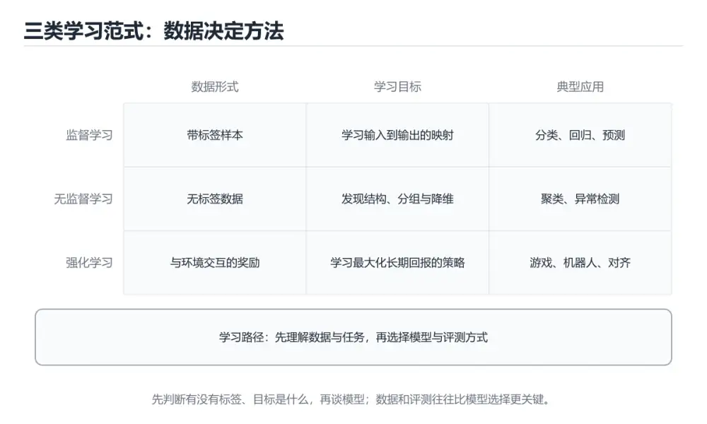
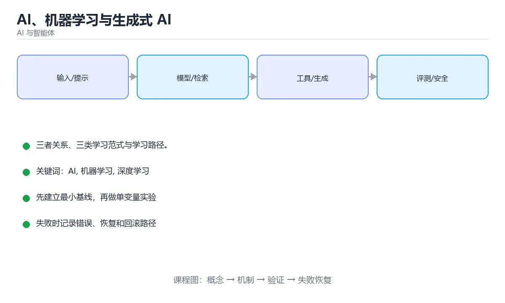

# AI、机器学习与生成式 AI





> 内容更新时间：2026-10-03 · 学习阶段：基础 · 预计用时：13 分钟

## 学习目标

- 能用自己的话解释「AI、机器学习与生成式 AI」解决了什么问题，而不是只背术语。
- 能说清 「AI」、「机器学习」、「深度学习」、「生成式 AI」 之间的关系，并分别举出一个例子。
- 能把本课知识放回「AI 与智能体」的知识体系，说明它和相邻主题的边界。
- 能完成本课练习，并用验收标准检查自己的结果。

> 一句话摘要：三者关系、三类学习范式与学习路径。

## 前置知识

- 会进行基本的文件、命令行或浏览器操作；遇到不熟悉的术语先查本课关键词。
- 本课阶段：基础。建议会读写简单代码或命令，并理解变量、输入输出等基本概念。
- 开始前先复习：AI、机器学习、深度学习。
- 如果某一步看不懂，先记录具体卡点，完成练习后再回头读一遍。


## 三个概念的关系

```text
人工智能 AI（让机器表现出智能）
└── 机器学习 ML（从数据中学习规律，而不是逐条写规则）
    ├── 深度学习 DL（用多层神经网络学习表示）
    │   └── 生成式 AI（生成文本、图像、音频、代码）
    └── 其他方法（决策树、SVM、聚类等）
```

传统编程是「人写规则」，机器学习是「人给数据，机器找规则」，生成式 AI 则是「机器按概率生成新内容」。

## 机器学习的三类范式

| 范式 | 数据 | 目标 | 例子 |
| --- | --- | --- | --- |
| 监督学习 | 带标签 | 预测标签 | 房价预测、垃圾邮件分类 |
| 无监督学习 | 无标签 | 发现结构 | 聚类、降维、异常检测 |
| 强化学习 | 奖励信号 | 学策略 | 游戏 AI、机器人控制 |

## 生成式 AI 能做什么

- 文本：摘要、翻译、写作、代码生成、问答
- 图像与视频：文生图、修图、视频生成
- 语音：语音识别（ASR）与语音合成（TTS）
- 多模态：图文理解、文档解析、屏幕操作

## 典型应用架构

```text
用户输入 -> 预处理（清洗/分块）-> 模型推理（LLM/多模态）
        -> 后处理（校验/引用/格式化）-> 返回结果
        -> 记录日志与评测指标 -> 持续迭代
```

## 学习路径建议

1. 先建立概念地图（本分类前 3 篇）。
2. 掌握提示工程与调用 API，做出第一个可用的小工具。
3. 学习嵌入与 RAG，让模型基于自己的资料回答。
4. 学习 Agent：工具调用、记忆、规划与多智能体协作。
5. 最后补工程化：评测、成本、安全与可观测性。

## 从场景反推技术选型

| 业务场景 | 推荐方案 | 为什么 |
| --- | --- | --- |
| 文档问答（基于内部资料） | RAG（检索增强） | 知识可更新、可溯源，无需训练 |
| 固定格式的信息抽取 | 提示工程 + 结构化输出 | 成本最低，字段可控 |
| 稳定风格与话术（客服） | 少样本提示，必要时微调 | 风格靠示例，不强依赖训练 |
| 高并发简单分类 | 小模型 + 蒸馏/量化 | 延迟与成本敏感，精度足够 |
| 多步操作（下单、查库） | Agent + 工具调用 | 需要与系统交互而非纯生成 |
| 图像/语音处理 | 多模态模型或专用模型 | 视觉/语音专用模型通常更划算 |

选型四问：**知识是否需要频繁更新**（要→RAG）、**输出是否必须严格结构化**（要→schema + 校验）、**是否需要执行动作**（要→工具调用 + 权限控制）、**成本与延迟预算是多少**（紧→小模型 + 缓存）。先答这四问，再决定用提示、RAG 还是微调。

## 本课小结
AI 是目标，机器学习是方法，深度学习是当前主流技术，生成式 AI 是其中最热的应用形态。**先分清层次，再深入某一层**。


## 概念层级速查

| 层级 | 关注点 | 例子 |
| --- | --- | --- |
| 人工智能 | 让机器表现出智能行为 | 规划、推理、感知 |
| 机器学习 | 从数据中学习规律 | 回归、分类、聚类 |
| 深度学习 | 用多层神经网络表示特征 | CNN、Transformer |
| 生成式 AI | 生成新内容 | 文本、图像、音频、视频 |
| 大语言模型 | 大规模预训练的文本模型 | GPT、Claude、Llama、Qwen |

## 模型类型对照

| 类型 | 输入到输出 | 典型任务 |
| --- | --- | --- |
| 判别式 | 输入到标签 | 分类、检测、排序 |
| 生成式 | 输入到新内容 | 写作、绘图、语音合成 |
| 嵌入模型 | 文本到向量 | 检索、聚类、去重 |
| 重排模型 | 查询与文档对到分数 | 精排 |
| 多模态模型 | 多模态输入到文本或内容 | 图文问答、OCR 理解 |

```python
from dataclasses import dataclass

@dataclass
class TokenBudget:
    """上下文预算：把窗口切成提示、资料、输出三部分。"""

    window: int                 # 模型上下文上限
    prompt: int                 # 系统提示与指令
    retrieved: int              # 检索资料
    output: int                 # 预留输出

    @property
    def used(self) -> int:
        return self.prompt + self.retrieved + self.output

    @property
    def remaining(self) -> int:
        return self.window - self.used

    def fits(self) -> bool:
        return self.remaining >= 0

    def trim_retrieved(self) -> "TokenBudget":
        """超预算时优先裁剪检索资料，保证提示与输出完整。"""
        if self.fits():
            return self
        overflow = -self.remaining
        return TokenBudget(
            self.window, self.prompt,
            max(0, self.retrieved - overflow),
            self.output,
        )


def estimate_tokens(text: str, chars_per_token: float = 1.6) -> int:
    """粗略估算 Token 数：中文约 1 字 1 到 2 Token，英文约 4 字符 1 Token。"""
    return max(1, int(len(text) / chars_per_token))


budget = TokenBudget(window=128_000, prompt=2_000, retrieved=90_000, output=4_000)
print(budget.fits(), budget.remaining)
print(estimate_tokens("请把下面这段中文总结成三句话。"))
```

## 常见错误对照表

| 容易踩的做法 | 实际现象 | 原因与正确做法 |
| --- | --- | --- |
| 把「生成式 AI」等同于「大模型」 | 概念混淆 | 生成式 AI 含图像、语音等多种模型 |
| 认为模型参数越多越好 | 成本与延迟失控 | 按任务难度选型，小模型 + 路由常更划算 |
| 按字符数估 Token | 预算估算偏差大 | 中文与代码的 Token 密度不同，按实测校准 |
| 忽略上下文窗口限制 | 请求被截断或报错 | 预留输出空间并裁剪资料 |
| 认为模型输出一定正确 | 幻觉进入生产 | 提供依据 + 校验 + 兜底话术 |
| 用大模型做纯规则任务 | 成本高且不稳定 | 规则能解决就用规则 |
| 不记录模型版本 | 结果变化无法归因 | 记录模型名、版本与参数 |
| 忽略推理参数影响 | 输出不稳定 | 明确温度、top_p 与最大输出长度 |
| 直接处理敏感数据 | 合规风险 | 脱敏、鉴权与私有部署 |
| 只做 Demo 不做评测 | 上线后质量不可控 | 建离线评测集并持续回归 |

## 自测清单

- [ ] 能画出 AI、机器学习、深度学习、生成式 AI 的层级关系。
- [ ] 能按任务选择合适的模型类型（判别、生成、嵌入、重排）。
- [ ] 会为请求做 Token 预算并预留输出空间。
- [ ] 知道幻觉无法完全消除，必须用检索与校验兜底。
- [ ] 模型版本与推理参数都进入配置管理与评测。

## 动手练习


> 本课练习重点：围绕「AI、机器学习、深度学习」完成复述、实验和交付，每个结果都要能被别人检查。

先写评测样例，再改一个提示、模型或数据变量，最后比较质量、成本与安全。

### 练习 1：建立心智模型（10 分钟）

合上教程，用 3～5 句话回答：

1. 「AI、机器学习与生成式 AI」解决了什么问题？
2. 如果没有它，会出现什么具体后果？
3. 它和「机器学习」是什么关系？

**验收标准**：至少出现一个本课关键词，并写出一个反例、边界条件或失效场景。

### 练习 2：做一次可控实验（20 分钟）

从正文中选一个最小示例，完成以下操作：

1. 先预测修改一个参数、输入或步骤后的结果。
2. 再实际执行或逐步推演，记录真实结果。
3. 如果结果与预测不同，写出差异原因。

**验收标准**：留下「原例 → 改动 → 预测 → 结果 → 原因」五步记录。

### 练习 3：交付一个小结果（30 分钟）

构造 5 条小型离线样例，写清输入、期望输出、评分标准和失败案例。

任务要求：

- 结果必须能被别人检查，不能只写“我已经理解了”。
- 至少覆盖「AI」和「机器学习」两个关键词。
- 写出 1 个仍然不确定的问题，以及下一步如何验证。

> 提示：时间有限时优先做练习 1 和练习 2；练习 3 可以拆成两次完成。


## 可运行练习

下面 3 个任务围绕“AI、机器学习与生成式 AI”展开，代码可以直接粘贴到 App 的离线沙箱里运行；如果示例会读取标准输入，请按代码注释在沙箱的 stdin 区域填入同样格式的数据。

### 任务 1：先跑通，再解释

```python
from dataclasses import dataclass

@dataclass
class TokenBudget:
    """上下文预算：把窗口切成提示、资料、输出三部分。"""

    window: int                 # 模型上下文上限
    prompt: int                 # 系统提示与指令
    retrieved: int              # 检索资料
    output: int                 # 预留输出

    @property
    def used(self) -> int:
        return self.prompt + self.retrieved + self.output

    @property
    def remaining(self) -> int:
        return self.window - self.used

    def fits(self) -> bool:
        return self.remaining >= 0

    def trim_retrieved(self) -> "TokenBudget":
        """超预算时优先裁剪检索资料，保证提示与输出完整。"""
        if self.fits():
            return self
        overflow = -self.remaining
        return TokenBudget(
            self.window, self.prompt,
            max(0, self.retrieved - overflow),
            self.output,
        )


def estimate_tokens(text: str, chars_per_token: float = 1.6) -> int:
    """粗略估算 Token 数：中文约 1 字 1 到 2 Token，英文约 4 字符 1 Token。"""
    return max(1, int(len(text) / chars_per_token))


budget = TokenBudget(window=128_000, prompt=2_000, retrieved=90_000, output=4_000)
print(budget.fits(), budget.remaining)
print(estimate_tokens("请把下面这段中文总结成三句话。"))
```

**预期输出**：运行后会输出与“AI、机器学习与生成式 AI”相关的关键结果；请重点核对输出行数、最后一个数值和异常提示。

**验收标准**：代码能正常运行；逐行解释每个变量的值如何变化，并指出哪一行决定了最终结果。

### 任务 2：只改一个条件

复制上面的代码，只修改一个输入、边界或参数（例如空值、最大值、循环次数、过滤条件），先写出你的预测，再实际运行。

**验收标准**：留下“原结果 → 改动 → 预测 → 实际结果 → 差异原因”五步记录；如果预测错误，要写出修正后的心智模型。

### 任务 3：迁移到自己的数据

用同一套思路处理一组你自己的数据或场景，保持输出格式与任务 1 一致。

**验收标准**：代码不少于 10 行，至少包含 1 个边界检查；把代码和运行结果保存到笔记或片段库。


## 故障现场

这一节把“AI、机器学习与生成式 AI”最常见的失败方式还原成现场记录，练习时按“症状 → 复现 → 定位 → 修复 → 预防”的顺序排查。

### 现场 1：“AI、机器学习与生成式 AI”的 AI 常规用例通过，但边界用例失败

**症状**：在“AI、机器学习与生成式 AI”的练习或生产场景里出现““AI、机器学习与生成式 AI”的 AI 常规用例通过，但边界用例失败”。

**复现**：准备一组最小输入，只保留触发““AI、机器学习与生成式 AI”的 AI 常规用例通过，但边界用例失败”的必要条件，连续运行两次确认结果稳定。

**定位**：围绕“AI 的前置条件与取值边界没有写进代码，默认值掩盖了空值和极值”检查调用链、输入数据和环境配置，先验证假设再改代码。

**修复**：为“AI、机器学习与生成式 AI”补一条空值或极值用例，把前置条件写成断言，并让失败信息直接指出是哪个输入越界

**预防**：把““AI、机器学习与生成式 AI”的 AI 常规用例通过，但边界用例失败”写成一条自动化用例，并在“AI、机器学习与生成式 AI”的验收清单里保留对应检查项。


### 现场 2：“AI、机器学习与生成式 AI”的 机器学习 结果在两次运行之间不一致

**症状**：在“AI、机器学习与生成式 AI”的练习或生产场景里出现““AI、机器学习与生成式 AI”的 机器学习 结果在两次运行之间不一致”。

**复现**：准备一组最小输入，只保留触发““AI、机器学习与生成式 AI”的 机器学习 结果在两次运行之间不一致”的必要条件，连续运行两次确认结果稳定。

**定位**：围绕“机器学习 依赖了当前版本、执行顺序或共享状态，单次运行无法暴露差异”检查调用链、输入数据和环境配置，先验证假设再改代码。

**修复**：固定“AI、机器学习与生成式 AI”使用的版本与随机种子，记录两次运行的完整输入和输出，再逐项消除非确定性来源

**预防**：把““AI、机器学习与生成式 AI”的 机器学习 结果在两次运行之间不一致”写成一条自动化用例，并在“AI、机器学习与生成式 AI”的验收清单里保留对应检查项。


### 现场 3：离线评测分数很高，线上仍然频繁给出错误答案

**症状**：在“AI、机器学习与生成式 AI”的练习或生产场景里出现“离线评测分数很高，线上仍然频繁给出错误答案”。

**复现**：准备一组最小输入，只保留触发“离线评测分数很高，线上仍然频繁给出错误答案”的必要条件，连续运行两次确认结果稳定。

**定位**：围绕“评测集与真实输入分布不一致，AI 的提示词或检索结果没有覆盖失败场景”检查调用链、输入数据和环境配置，先验证假设再改代码。

**修复**：为“AI、机器学习与生成式 AI”建立固定评测集、边界题和对抗题，分别记录准确率、拒答率、延迟与 token 成本

**预防**：把“离线评测分数很高，线上仍然频繁给出错误答案”写成一条自动化用例，并在“AI、机器学习与生成式 AI”的验收清单里保留对应检查项。


## 深入补充：AI、机器学习与生成式 AI 的取舍与边界

### 一、把概念放回真实约束

学习“AI、机器学习与生成式 AI”时，最容易只记住结论而忽略前提。先写出三个约束：数据规模、时间预算、可接受的失败方式；再判断 AI 与 机器学习 在这些约束下是否仍然成立。只要约束改变，原来的最优解就可能变成错误解。

| 维度 | 要回答的问题 | 常见做法 | 失败信号 |
| --- | --- | --- | --- |
| 数据 | AI 的训练或检索数据从哪来、质量如何 | 清洗、去重、标注与版本化 | 评测集泄漏或分布漂移 |
| 模型 | 机器学习 的能力边界与成本是多少 | 基线对比、离线评测、灰度发布 | 指标好看但线上任务失败 |
| 评测 | 如何证明改动真的有效 | 固定评测集、人工抽检、A/B | 只比较单例输出 |
| 安全 | 失败时会不会泄露或越权 | 权限校验、内容过滤、审计 | 提示注入或数据外泄 |

### 二、三个容易混淆的边界

1. **把“能跑”当成“正确”**：AI、机器学习与生成式 AI 的示例通过，只说明这条输入路径可用；还要用空值、极值和并发路径验证。
2. **把“平均值”当成“全部”**：AI 的指标好看，不代表尾部请求、冷启动或失败重试也好看。
3. **把“当前版本”当成“永久行为”**：机器学习 依赖的默认值、API 或性能特征都可能随版本变化，需要固定版本并保留回归用例。

### 三、一个生产场景

假设团队要在真实系统里使用“AI、机器学习与生成式 AI”：第一周先做小流量验证，记录 AI 的基线与异常；第二周扩大输入规模，观察 机器学习 是否成为瓶颈；第三周再做故障演练，主动注入超时、重复请求和依赖不可用，确认系统能降级、能重试、能恢复。每一步都要留下指标、日志和结论，而不是只留下“感觉更快了”。

### 四、自测清单

- 能否用一句话说出“AI、机器学习与生成式 AI”解决的核心问题与不适用场景？
- 能否画出 AI 的数据流或状态变化，并标出失败路径？
- 能否给出一个反例，证明某个看似合理的结论在边界条件下不成立？
- 能否写出一条可复现的验证命令，让别人独立得到相同结论？

### 五、AI 工程补充

在“AI、机器学习与生成式 AI”里，模型输出只是系统的一部分：输入要先经过权限与数据质量检查，检索或工具调用要有超时和降级，输出要经过引用核验或规则校验，最后记录 token、延迟、失败类型和人工反馈。评测时至少准备固定题、边界题和对抗题，并把 AI 与 机器学习 的指标分开记录；否则一次提示词改动看似提升体验，实际可能只是评测样本泄漏或随机波动。


## 考点精讲：把测验题还原成判断过程

本课有 6 个判断点。先自己作答，再看「判断依据」；如果结论正确但理由不完整，回到正文对应章节补足概念。

### 考点 1：监督学习与无监督学习的关键区别是？

- **正确判断**：是否使用带标签的数据
- **判断依据**：监督学习需要标签，无监督学习从未标注数据中发现结构。其他选项：监督与无监督的区别在于是否使用带标签的数据。针对「监督学习与无监督学习的关键区别是，」，本课在「本课小结」中说明：AI 是目标，机器学习是方法，深度学习是当前主流技术，生成式 AI 是其中最热的应用形态。本课还在「三个概念的关系」中说明：传统编程是「人写规则」，机器学习是「人给数据，机器找规则」，生成式 AI 则是「机器按概率生成新内容」。
- **迁移检查**：把题干里的一个条件换成边界值，原来的结论还成立吗？写出判断过程。

### 考点 2：生成式 AI 与深度学习的关系是？

- **正确判断**：生成式 AI 是深度学习的一个应用方向
- **判断依据**：生成式 AI 主要建立在深度学习（尤其是 Transformer 与扩散模型）之上。其他选项：生成式 AI 是深度学习的一个应用方向，而不是取代它。针对「生成式 AI 与深度学习的关系是，」，本课在「本课小结」中说明：AI 是目标，机器学习是方法，深度学习是当前主流技术，生成式 AI 是其中最热的应用形态。本课还在「三个概念的关系」中说明：传统编程是「人写规则」，机器学习是「人给数据，机器找规则」，生成式 AI 则是「机器按概率生成新内容」。
- **迁移检查**：把题干里的一个条件换成边界值，原来的结论还成立吗？写出判断过程。

### 考点 3：上下文窗口指的是？

- **正确判断**：模型一次能处理的 token 上限
- **判断依据**：正确答案是「模型一次能处理的 token 上限」，本课在「学习路径建议」中说明：学习嵌入与 RAG，让模型基于自己的资料回答。上下文窗口决定单次请求可以携带多少 token，超出需要分块、摘要或检索。本课还在「学习路径建议」中说明：学习 Agent：工具调用、记忆、规划与多智能体协作。本课还在「从场景反推技术选型」中说明：选型四问：知识是否需要频繁更新（要→RAG）、输出是否必须严格结构化（要→schema + 校验）、是否需要执行动作（要→工具调用 + 权限控制）、成本与延迟预算是多少（紧→小模型 + 缓存）。
- **迁移检查**：遮住选项，只根据定义复述一次答案，再回来看哪个选项与复述一致。

### 考点 4：AI、机器学习与深度学习的包含关系是？

- **正确判断**：深度学习 ⊂ 机器学习 ⊂ 人工智能
- **判断依据**：AI 是最大范畴，机器学习是其中依赖数据学习规律的分支，深度学习是其子集。其他选项：包含关系是深度学习 ⊂ 机器学习 ⊂ 人工智能。课程摘要指出三者关系，三类学习范式与学习路径，本课要判断的正是AI、机器学习与深度学习的包含关系是。这道题考查 AI、机器学习与深度学习的包含关系是 与AI、机器学习、深度学习、生成式 AI这些概念之间的边界，判断时要把题干限定的条件逐项代入。
- **迁移检查**：遮住选项，只根据定义复述一次答案，再回来看哪个选项与复述一致。

### 考点 5：Token 与「词」的关系是？

- **正确判断**：Token 是模型处理文本的最小单位
- **判断依据**：计费、上下文长度与截断策略都按 Token 计算，中文往往一个字对应 1~2 个 Token。其他选项：Token 是模型处理文本的最小单位。课程摘要指出三者关系，三类学习范式与学习路径，本课要判断的正是Token与词的关系是。这道题考查 Token与词的关系是 与AI、机器学习、深度学习、生成式 AI这些概念之间的边界，判断时要把题干限定的条件逐项代入。
- **迁移检查**：遮住选项，只根据定义复述一次答案，再回来看哪个选项与复述一致。

### 考点 6：补全代码：「AI、机器学习与生成式 AI」示例中，下面这行代码缺少哪个关键字或函数名？请填入 ____。 `def ____(self) -> int:`

- **正确判断**：remaining
- **判断依据**：正确答案是「remaining」，这道题在问补全代码：AI、机器学习与生成式AI示例中，下面这行…def____(self)->int:`，判断时要把题干限定的输入、边界与目标逐项对齐。本课示例中还能看到 `return self.remaining >= 0` 这样的用法，说明该关键字在本课代码中承担实际功能。
- **迁移检查**：不看题干，用自己的话补全这句话，再与标准答案对照。

### 补充自测（2 题）

1. 围绕“AI、机器学习与生成式 AI”中的 AI、机器学习、深度学习，下列哪两项是本课强调的实践判断？
2. 下面这段 Python 代码复现了“AI、机器学习与生成式 AI”中 AI、机器学习、深度学习 相关的一个常见故障，哪一项最准确地解释了问题？

这些题按“先定位概念、再排除边界错误、最后核对答案”的顺序作答；每题解析都给出了判断依据。


## 本课复习清单

离开本课前，逐项确认：

- [ ] 不看解析，能说出「监督学习与无监督学习的关键区别是？」的判断依据。
- [ ] 不看解析，能说出「生成式 AI 与深度学习的关系是？」的判断依据。
- [ ] 不看解析，能说出「上下文窗口指的是？」的判断依据。
- [ ] 不看解析，能说出「AI、机器学习与深度学习的包含关系是？」的判断依据。
- [ ] 不看解析，能说出「Token 与「词」的关系是？」的判断依据。
- [ ] 不看解析，能说出「补全代码：「AI、机器学习与生成式 AI」示例中，下面这行代码缺少哪个关键字或函…」的判断依据。
- [ ] 至少运行一次本课示例，记录输入、输出和一个边界情况。
- [ ] 把本课最容易混淆的两个概念写成一句话对照。

| 复盘项 | 记录 |
| --- | --- |
| 已经能独立解释的考点 |  |
| 仍然说不清的概念 |  |
| 下一步验证动作 |  |

## 术语速查

把本课反复出现的术语集中放在一起。复习时先遮住右列，尝试用自己的话解释，再回到正文核对。

| 术语 | 本课语境 |
| --- | --- |
| `，判断时要把题干限定的输入、边界与目标逐项对齐。本课示例中还能看到` | 判断依据**：正确答案是「remaining」，这道题在问补全代码：AI、机器学习与生成式AI示例中，下面这行…def____(self)->int:`，判断时要把题干限定的输入、边界与目标逐项对齐。本课示例中还能看到 … |
| `AI` | 本课围绕该主题展开，结合正文与代码示例理解它的适用边界。 |
| `机器学习` | 本课围绕该主题展开，结合正文与代码示例理解它的适用边界。 |
| `深度学习` | 本课围绕该主题展开，结合正文与代码示例理解它的适用边界。 |
| `生成式 AI` | 本课围绕该主题展开，结合正文与代码示例理解它的适用边界。 |

## 面试问答与自测

下面把本课考点换成面试追问。先口述自己的答案，
再对照参考回答检查是否遗漏了前提、边界或失败路径。

### 追问 1：监督学习与无监督学习的关键区别是？

**参考回答**：监督学习需要标签，无监督学习从未标注数据中发现结构。其他选项：监督与无监督的区别在于是否使用带标签的数据。针对「监督学习与无监督学习的关键区别是，」，本课在「本课小结」中说明：AI 是目标，机器学习是方法，深度学习是当前主流技术，生成式 AI 是其中最热的应用形态。本课还在「三个概念的关系」中说明：传统编程是「人写规则」，机器学习是「人给数据，机器找规则」，生成式 AI 则是「机器按概率生成新内容」。

### 追问 2：生成式 AI 与深度学习的关系是？

**参考回答**：生成式 AI 主要建立在深度学习（尤其是 Transformer 与扩散模型）之上。其他选项：生成式 AI 是深度学习的一个应用方向，而不是取代它。针对「生成式 AI 与深度学习的关系是，」，本课在「本课小结」中说明：AI 是目标，机器学习是方法，深度学习是当前主流技术，生成式 AI 是其中最热的应用形态。本课还在「三个概念的关系」中说明：传统编程是「人写规则」，机器学习是「人给数据，机器找规则」，生成式 AI 则是「机器按概率生成新内容」。

### 追问 3：上下文窗口指的是？

**参考回答**：正确答案是「模型一次能处理的 token 上限」，本课在「学习路径建议」中说明：学习嵌入与 RAG，让模型基于自己的资料回答。上下文窗口决定单次请求可以携带多少 token，超出需要分块、摘要或检索。本课还在「学习路径建议」中说明：学习 Agent：工具调用、记忆、规划与多智能体协作。本课还在「从场景反推技术选型」中说明：选型四问：知识是否需要频繁更新（要→RAG）、输出是否必须严格结构化（要→schema + 校验）、是否需要执行动作（要→工具调用 + 权限控制）、成本与延迟预算是多少（紧→小模型 + 缓存）。

### 追问 4：AI、机器学习与深度学习的包含关系是？

**参考回答**：AI 是最大范畴，机器学习是其中依赖数据学习规律的分支，深度学习是其子集。其他选项：包含关系是深度学习 ⊂ 机器学习 ⊂ 人工智能。课程摘要指出三者关系，三类学习范式与学习路径，本课要判断的正是AI、机器学习与深度学习的包含关系是。这道题考查 AI、机器学习与深度学习的包含关系是 与AI、机器学习、深度学习、生成式 AI这些概念之间的边界，判断时要把题干限定的条件逐项代入。

### 追问 5：Token 与「词」的关系是？

**参考回答**：计费、上下文长度与截断策略都按 Token 计算，中文往往一个字对应 1~2 个 Token。其他选项：Token 是模型处理文本的最小单位。课程摘要指出三者关系，三类学习范式与学习路径，本课要判断的正是Token与词的关系是。这道题考查 Token与词的关系是 与AI、机器学习、深度学习、生成式 AI这些概念之间的边界，判断时要把题干限定的条件逐项代入。

## English Overview

**Title:** AI, ML & GenAI

**Summary:** How AI, ML, DL and GenAI relate.

**Category:** AI & Agents  
**Level:** 基础  
**Key terms:** AI, 机器学习, 深度学习, 生成式 AI

> The full tutorial is written in Chinese. This bilingual overview helps English readers identify the topic, scope and key terms before studying the detailed examples.

## 内容元数据

- 内容版本：v2.0
- 最后更新：2026-10-03
- 学习阶段：基础
- 适用环境：主流大模型 API、开源模型与向量数据库
- 内容来源：内置结构化课程与工程实践整理
- 相关主题：AI、机器学习、深度学习、生成式 AI
- 质量版本：P0 测验标准 + P1 覆盖扩展 + P2 体验补全


## Full English Study Guide

### Overview

**AI, ML & GenAI** focuses on How AI, ML, DL and GenAI relate.

### Learning Outcomes

- Explain what **AI, ML & GenAI** solves and when it should be used.
- Identify inputs, outputs, state and failure boundaries.
- Build a minimal reproducible example and observe the real result.
- Test normal, boundary and failure paths.
- Measure performance, resource cost or security impact before optimizing.
- Document the decision, rollback path and remaining uncertainty.

### Core Mental Model

1. **Problem first:** define the exact problem before choosing a tool or pattern.
2. **Smallest example:** reduce the system to one input and one observable output.
3. **State and flow:** trace how data, control or responsibility moves through the system.
4. **Boundaries:** identify invalid input, resource limits, timeouts and permission edges.
5. **Evidence:** use tests, logs, metrics or reproductions instead of intuition.
6. **Trade-offs:** compare correctness, latency, cost, complexity and operability.

### Step-by-step Study Plan

1. Read the Chinese lesson once and write down the main problem in one sentence.
2. Run the smallest example and save the exact command and output.
3. Change only one input or parameter and predict the result before running it.
4. Introduce one failure and record how the system detects, reports and recovers.
5. Write one test or checklist item for the normal, boundary and failure paths.
6. Complete the quiz and explain every wrong answer in your own words.

### Practice Tasks

- Rebuild the minimal example from an empty directory.
- Add one boundary test and one failure test.
- Produce a short report containing the baseline, change, result and rollback.

### Common Failure Modes

- Treating a happy-path demo as production readiness.
- Skipping boundary values and invalid inputs.
- Optimizing before establishing a measurable baseline.
- Hiding errors, permissions or resource limits.

### Self-check Questions

1. What is the smallest observable result that proves this lesson works?
2. What input or state is most likely to break it?
3. Which metric or test would reveal a regression?
4. What is the rollback path?
5. What is the cost of using this approach at 10x scale?
6. Which adjacent topic is most often confused with this one?

### Glossary

- Topic: **AI, ML & GenAI**
- Related terms: AI, 机器学习, 深度学习, 生成式 AI
- Primary evidence: command output, tests, logs, metrics or reproductions

> This guide is an English study companion for the detailed Chinese lesson. It covers the learning path, mental model and acceptance questions; code examples and engineering details remain in the main tutorial.


## Bilingual Section Outline

| 中文小节 | English section |
| --- | --- |
| 学习目标 | Learning objectives |
| 前置知识 | Prerequisites |
| 三个概念的关系 | 三个概念的关系 |
| 机器学习的三类范式 | 机器学习的三类范式 |
| 生成式 AI 能做什么 | 生成式 AI 能做什么 |
| 典型应用架构 | 典型应用架构 |
| 学习路径建议 | 学习路径建议 |
| 术语速查 | 术语速查 |
| 从场景反推技术选型 | 从场景反推技术选型 |
| 本课小结 | Summary |

> 该大纲把每个中文小节映射为英文标题，配合 Full English Study Guide 使用。


## 参考资料与复核

- 最后复核：2026-10-04
- 下次复核：2027-04-04
- 复核范围：版本兼容、API 行为、安全建议与工程实践
- 来源性质：官方文档与标准；本课正文为离线教学重组，不复制原文

| 参考资料 | 本课用途 |
| --- | --- |
| [OpenAI Docs](https://platform.openai.com/docs/) | 模型 API、工具与评估 |
| [Hugging Face Docs](https://huggingface.co/docs) | 模型、数据集与推理 |
| [Model Context Protocol](https://modelcontextprotocol.io/) | Agent 工具与上下文协议 |

> 本课主题：三者关系、三类学习范式与学习路径。

> App 完全离线展示文字链接，不会自动联网；需要延伸阅读时可复制链接到浏览器。
