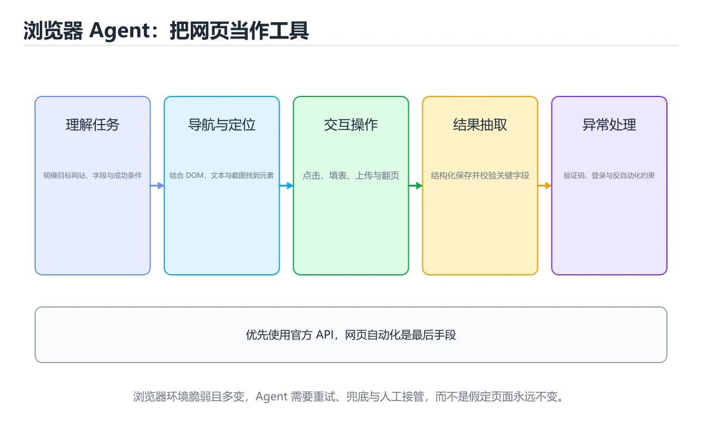

# 浏览器 Agent

> 内容更新时间：2026-10-06 · 学习阶段：进阶 · 预计用时：35 分钟




## 本节知识框架

**课程定位**：所属分类 `ai`（AI 与智能体），课程主题 `浏览器 Agent`，学习阶段 进阶，建议用时 40 分钟。

本课主线：理解网页导航、DOM 理解、表单填写、验证码与反自动化约束。

**学完本课应当能够**
- 说清 `浏览器` 与 `DOM` 的含义与区别，并各举一个正例和一个反例。
- 用本课示例验证 `表单` 的行为，记录输入、输出与失败条件。
- 遇到「用固定选择器定位元素」这类问题时，能说出触发条件与修复顺序。

### 从概念到验证的学习链条

1. `浏览器`：先掌握 解析 HTML/CSS、执行 JavaScript 并管理网络与页面的客户端环境，再用它解释 `DOM` 为什么会出现。
2. `DOM`：先掌握 浏览器把网页解析成的文档对象模型，Agent 靠它定位和操作页面元素，再用它解释 `表单` 为什么会出现。
3. `表单`：先掌握 按“浏览器 Agent”中 浏览器、DOM、表单 的实践顺序，把四个步骤排成从准备到复盘的合理顺序，再用它解释 `自动化` 为什么会出现。
4. `自动化`：先掌握 让重复步骤由脚本、流水线或 Agent 按固定规则执行，再用它解释 本课示例的观察结果 为什么会出现。

**先修与衔接**：本课是「AI 与智能体」分类的第 23 课。先修内容：《Computer Use 与桌面自动化》。《Computer Use 与桌面自动化》里的 `Computer Use`、`截图` 是本课的前提。相关或后续课程：《代码 Agent 与软件工程自动化》。

### 完成判据

- **定义关**：不看正文也能说明 `浏览器` 是 解析 HTML/CSS、执行 JavaScript 并管理网络与页面的客户端环境，并指出一个反例。
- **机制关**：能按“输入 → 转换 → 输出 → 验证”复述 `浏览器 Agent`，而不是只背结论。
- **示例关**：能运行或推演 `浏览器 Agent` 的 `text` 示例，并说明一个真实出现的标识符或字面量。
- **证据关**：能指出 `浏览器 Agent` 示例里的 调用了 `score()`，并说明它支持或反驳了本课的哪一条结论。
- **排错关**：能复现 用固定选择器定位元素，记录现象并按 优先用语义角色与可见文本定位，并准备回退路径 修复。
- **迁移关**：能把 `浏览器`、`DOM`、`表单`、`自动化` 放进一个与 `浏览器 Agent` 不同的项目场景，并保持输入与验证条件可追踪。
- **复盘关**：学完 `浏览器 Agent` 后，用一句话写下仍然不确定的结论，并列出下一次验证需要的输入、环境和成功判据。

### 复习清单

- [ ] 能不看正文复述本课核心术语，并指出一个边界或反例。
- [ ] 能运行或推演本课示例，记录输入、输出与失败现象。
- [ ] 能完成一次自测，并把错题对照错误表定位原因。

## 核心概念定义

| 术语 | 操作性定义 | 常见边界与风险 |
| --- | --- | --- |
| 浏览器 | 解析 HTML/CSS、执行 JavaScript 并管理网络与页面的客户端环境。 | 网络延迟、超时与版本协商会改变行为，只在真实链路或多版本客户端上验证才算数。 |
| DOM | 浏览器把网页解析成的文档对象模型，Agent 靠它定位和操作页面元素。 | 结果依赖数据分布、模型版本与算力预算，换数据集或换硬件都要重新评估。 |
| 表单 | 按“浏览器 Agent”中 浏览器、DOM、表单 的实践顺序，把四个步骤排成从准备到复盘的合理顺序。 | 易错：误操作产生真实订单、转账或对外消息；正确做法是高风险动作前暂停并请求确认，保留撤销与回滚路径。 |
| 自动化 | 让重复步骤由脚本、流水线或 Agent 按固定规则执行。 | 只在「让重复步骤由脚本、流水线或 Agent 按固定规则执行」这一前提下成立，换输入或换环境要重新验证。 |

## 原理与运行机制

### 机制总览

**教材衔接：核心知识**

### 1. 浏览器 Agent 要同时理解页面结构、可交互元素和任务状态。

- 关键做法：先用 answer 建立 浏览器 的基线，再逐步加入边界与失败条件。
- 验证标准：DOM 的异常路径有明确错误信息与恢复动作。

### 2. 登录、支付、提交等敏感动作需要权限边界和人工确认。

把这条结论放回「浏览器 Agent」的完整流程里展开：

- 正文依据：能用自己的话解释：浏览器 Agent 要同时理解页面结构、可交互元素和任务状态。
- 落地检查：把「2. 登录、支付、提交等敏感动作需要权限边界和人工确认。」改写成一条可执行的核对项，逐条验证输入、超时与失败路径。

### 3. 反自动化、验证码和页面变化要设计降级路径，不能假设网页永远稳定。

把这条结论放回「浏览器 Agent」的完整流程里展开：

- 正文依据：能用自己的话解释：反自动化、验证码和页面变化要设计降级路径，不能假设网页永远稳定。
- 落地检查：把「3. 反自动化、验证码和页面变化要设计降级路径，不能假设网页永远稳定。」改写成一条可执行的核对项，逐条验证输入、超时与失败路径。

**教材衔接：关键流程**

**教材衔接：实践路径**

**教材衔接：深入补充：浏览器 Agent 的取舍与边界**


### 四、自测清单

- 能否用一句话说出浏览器 Agent解决的核心问题与不适用场景？
- 能否画出 浏览器 的数据流或状态变化，并标出失败路径？
- 把 answer 的输入推到边界，说明本课哪一条结论会先失效。
- 能否写出一条可复现的验证命令，让别人独立得到相同结论？

### 五、AI 工程补充

**教材衔接：零基础精讲：把浏览器 Agent真正讲透**

### 先建立一个直觉

把「浏览器 Agent」看成一条可评测的流水线：输入经过 浏览器 处理，产出候选结果，再由 DOM 决定哪些结果可以真正执行；每一环都要有可测的输入、输出与失败处理。

本课的摘要可以当作一张地图：理解网页导航、DOM 理解、表单填写、验证码与反自动化约束。

### 逐步拆解

1. 澄清输入与目标。先写清「浏览器 Agent」要解决的问题、合法输入范围和成功标准，再进入后续步骤。
2. 描述处理过程。把「浏览器、DOM、表单、自动化」映射到具体步骤，每步都要求能单独验证。
3. 定义输出。浏览器 的输出不仅包括正常结果，还包括错误码、日志和资源释放状态。
4. 关掉一个看似必要的检查（DOM相关），观察哪个测试或指标先失败，用证据说明它为什么不能省。
5. 用 answer 贯穿一次小实验：先预测输出，再运行或逐步推演，最后解释差异来自哪一步。

### 把正文串成一条执行链

- **1. 浏览器 Agent 要同时理解页面结构、可交互元素和任务状态。**：在「浏览器 Agent」里，「1. 浏览器 Agent 要同时理解页面结构、可交互元素和任务状态。」这一步要先写清输入与预期，再记录实际结果和差异；结果不符时回到对应小节核对前提。
- **2. 登录、支付、提交等敏感动作需要权限边界和人工确认。**：在「浏览器 Agent」里，「2. 登录、支付、提交等敏感动作需要权限边界和人工确认。」这一步要先写清输入与预期，再记录实际结果和差异；结果不符时回到对应小节核对前提。
- **3. 反自动化、验证码和页面变化要设计降级路径，不能假设网页永远稳定。**：在「浏览器 Agent」里，「3. 反自动化、验证码和页面变化要设计降级路径，不能假设网页永远稳定。」这一步要先写清输入与预期，再记录实际结果和差异；结果不符时回到对应小节核对前提。
- **考点 1：关于「浏览器 Agent 要同时理解页面结构、可交互元素和任务状态。」，下列说法正确的是？**：先独立作答，再回到本课对应小节核对判断依据；答错时记录是哪一个前提被忽略。
- **考点 2：关于「登录、支付、提交等敏感动作需要权限边界和人工确认。」，下列说法正确的是？**：先独立作答，再回到本课对应小节核对判断依据；答错时记录是哪一个前提被忽略。
- **考点 3：核心知识 的代码阅读题**：先独立作答，再回到本课正文核对 answer 的执行路径；答错时记录是哪一个前提被忽略。

### 从测验反推易错点

- 参考判断：浏览器 Agent 要同时理解页面结构、可交互元素和任务状态。
- 自问：如果去掉题干里的一个限定词，结论还成立吗？

- 参考判断：登录、支付、提交等敏感动作需要权限边界和人工确认。

- 参考判断：反自动化、验证码和页面变化要设计降级路径，不能假设网页永远稳定。

**检查点 4：本课的核心学习目标是什么？**

- 参考判断：理解网页导航、DOM 理解、表单填写、验证码与反自动化约束。

**检查点 5：以下哪些术语与浏览器 Agent直接相关？（多选）**

- 参考判断：浏览器、DOM

### 工程排错顺序

| 先查什么 | 要得到的证据 | 判断标准 |
| --- | --- | --- |
| 模型输入是否经过长度、格式与敏感信息检查？ | 日志、输入样例、测试或指标 | 能复现并解释，才算定位 |
| 工具调用是否最小权限、可超时、可取消？ | 日志、输入样例、测试或指标 | 能复现并解释，才算定位 |
| 输出是否有引用、置信度或人工复核兜底？ | 日志、输入样例、测试或指标 | 能复现并解释，才算定位 |
| 成本、延迟与失败率是否有指标？ | 日志、输入样例、测试或指标 | 能复现并解释，才算定位 |

### 变式训练

1. 把 浏览器 放进一个只有单机、没有额外依赖的小项目，先保证正确再扩展。
2. 扩大 DOM 的规模，记录本课结论在哪一个量级开始不成立。
3. 把 DOM 换成失败输入，记录错误信息与恢复动作。
5. 把 answer 的执行顺序调换一次，记录哪个中间结果先错；顺序敏感的地方就是本课的关键约束。
6. 限制 CPU 与内存上限后重跑 answer，观察哪一项参数需要重新设定。


### 迁移案例库

围绕 answer 重复同一套方法，每完成一轮就把差异写进笔记。

#### 迁移案例 1：围绕「浏览器」做一次小实验

**验收**：浏览器的结论要有证据、差异可解释、失败可恢复；做不到时回到「核心知识」缩小问题范围。

#### 迁移案例 2：围绕「DOM」做一次小实验

**步骤**：
1. 复述当前方案对「DOM」的假设，写成一句可证伪的话。

#### 迁移案例 3：围绕「表单」做一次小实验

**步骤**：
1. 复述当前方案对「表单」的假设，写成一句可证伪的话。

#### 迁移案例 4：围绕「自动化」做一次小实验

**步骤**：
1. 复述当前方案对「自动化」的假设，写成一句可证伪的话。

#### 迁移案例 5：围绕「浏览器」做一次小实验

**步骤**：

#### 迁移案例 6：围绕「DOM」做一次小实验

**步骤**：

#### 迁移案例 7：围绕「表单」做一次小实验

**步骤**：

#### 迁移案例 8：围绕「自动化」做一次小实验

**步骤**：

#### 迁移案例 9：围绕「浏览器」做一次小实验

**步骤**：

#### 迁移案例 10：围绕「DOM」做一次小实验

**步骤**：

#### 迁移案例 11：围绕「表单」做一次小实验

**步骤**：

#### 迁移案例 12：围绕「自动化」做一次小实验

**步骤**：

#### 迁移案例 13：围绕「浏览器」做一次小实验

**步骤**：

#### 迁移案例 14：围绕「DOM」做一次小实验

**步骤**：

#### 迁移案例 15：围绕「表单」做一次小实验

**步骤**：

#### 迁移案例 16：围绕「自动化」做一次小实验

**步骤**：

<!-- p0-depth-v2:end -->

**教材衔接：验证步骤**

### 机制拆解：每一步的输入、动作与输出

#### 1. `浏览器`
- 输入：`浏览器`；本步把 解析 HTML/CSS、执行 JavaScript 并管理网络与页面的客户端环境 当作判断规则。
- 动作：围绕 `浏览器` 保留中间状态，并记录它与 `DOM` 的对应关系。
- 输出：`DOM`，它可以被下一段代码、测试或记录继续使用。
- `浏览器` 的失败条件：网络延迟、超时与版本协商会改变行为，只在真实链路或多版本客户端上验证才算数。

#### 2. `DOM`
- 输入：`浏览器`；本步把 浏览器把网页解析成的文档对象模型，Agent 靠它定位和操作页面元素 当作判断规则。
- 动作：围绕 `DOM` 保留中间状态，并记录它与 `表单` 的对应关系。
- 输出：`表单`，它可以被下一段代码、测试或记录继续使用。
- `DOM` 的失败条件：结果依赖数据分布、模型版本与算力预算，换数据集或换硬件都要重新评估。

#### 3. `表单`
- 输入：`DOM`；本步把 按“浏览器 Agent”中 浏览器、DOM、表单 的实践顺序，把四个步骤排成从准备到复盘的合理顺序 当作判断规则。
- 动作：围绕 `表单` 保留中间状态，并记录它与 `自动化` 的对应关系。
- 输出：`自动化`，它可以被下一段代码、测试或记录继续使用。
- `表单` 的失败条件：当未经确认就提交表单时，会出现误操作产生真实订单、转账或对外消息。

#### 4. `自动化`
- 输入：`表单`；本步把 让重复步骤由脚本、流水线或 Agent 按固定规则执行 当作判断规则。
- 动作：围绕 `自动化` 保留中间状态，并记录它与 `score` 的对应关系。
- 输出：`score`，它可以被下一段代码、测试或记录继续使用。
- `自动化` 的失败条件：只在「让重复步骤由脚本、流水线或 Agent 按固定规则执行」这一前提下成立，换输入或换环境要重新验证。

### 示例中的可观察事实

1. 调用了 `score()`；它对应的课程主题是 `浏览器 Agent`。
2. 调用了 `strip()`；它对应的课程主题是 `浏览器 Agent`。
3. 调用了 `print()`；它对应的课程主题是 `浏览器 Agent`。
4. 出现字面量 `agent`；它对应的课程主题是 `浏览器 Agent`。

### 复现实验记录

- 环境：`浏览器 Agent` 使用 `text` 示例，固定 `浏览器`、`DOM`、`表单`、`自动化` 作为第一组条件。
- 首轮输入：先确认 调用了 `score()`，预测 `浏览器` 会怎样变化。
- 基线观察：记录命令、输入、输出和错误原文，不用截图代替可复制的文本。
- 单变量修改：只改变 `浏览器`，观察 `自动化` 是否仍满足定义。
- 失败注入：复现 用固定选择器定位元素，确认现象是 页面改版或 A/B 实验后整条流程失效。
- 记录结论：把“修改前、修改后、预期变化、实际变化”写成四列表，这样复盘 `浏览器 Agent` 时才能区分概念错误与实现错误。

## 典型应用场景

- **用固定选择器定位元素**：典型现象是页面改版或 A/B 实验后整条流程失效；正确做法是优先用语义角色与可见文本定位，并准备回退路径。
- **每步都截整页**：典型现象是长页面的 token 与延迟成倍增长；正确做法是只截可视区域或变化区域，结构信息用可访问性树获取。
- **未经确认就提交表单**：典型现象是误操作产生真实订单、转账或对外消息；正确做法是高风险动作前暂停并请求确认，保留撤销与回滚路径。

### 最小验证场景

- 准备：保留 `text` 示例的原始输入，先记录 `浏览器 Agent` 的基线输出和完整运行命令。
- 观察：先核对 调用了 `score()`，再改变一个与 `浏览器` 相关的条件。
- 判定：新结果与 `浏览器 Agent` 的基线不同不等于错误；只有当差异破坏了 `浏览器` 的定义或错误表中的约束，才判定为失败。

### 选择与边界

- 使用 `浏览器` 时，先满足它的定义：解析 HTML/CSS、执行 JavaScript 并管理网络与页面的客户端环境；网络延迟、超时与版本协商会改变行为，只在真实链路或多版本客户端上验证才算数。
- 使用 `DOM` 时，先满足它的定义：浏览器把网页解析成的文档对象模型，Agent 靠它定位和操作页面元素；结果依赖数据分布、模型版本与算力预算，换数据集或换硬件都要重新评估。
- 使用 `表单` 时，先满足它的定义：按“浏览器 Agent”中 浏览器、DOM、表单 的实践顺序，把四个步骤排成从准备到复盘的合理顺序；易错：误操作产生真实订单、转账或对外消息；正确做法是高风险动作前暂停并请求确认，保留撤销与回滚路径。
- 使用 `自动化` 时，先满足它的定义：让重复步骤由脚本、流水线或 Agent 按固定规则执行；只在「让重复步骤由脚本、流水线或 Agent 按固定规则执行」这一前提下成立，换输入或换环境要重新验证。

## 代码/协议/SQL 示例

**教材衔接：最小可运行示例**

下面示例用于验证 浏览器 的最小输入、处理和输出。先原样运行，再只修改一个值：

```python
def score(answer: str) -> int:
    return 1 if answer.strip() else 0

print(score("agent"))
```

**教材衔接：预期输出**

```text
1
```

### 示例精读：先找证据，再改一个条件

1. 调用了 `score()`；它出现在 `浏览器 Agent` 的示例中，阅读时先确认它前后各发生了什么。
2. 调用了 `strip()`；它出现在 `浏览器 Agent` 的示例中，阅读时先确认它前后各发生了什么。
3. 调用了 `print()`；它出现在 `浏览器 Agent` 的示例中，阅读时先确认它前后各发生了什么。
4. 出现字面量 `agent`；它出现在 `浏览器 Agent` 的示例中，阅读时先确认它前后各发生了什么。
- 在 `浏览器 Agent` 中与 `浏览器` 对照：示例必须能支持 解析 HTML/CSS、执行 JavaScript 并管理网络与页面的客户端环境，否则说明这一段还缺少实现或验证步骤。
- 在 `浏览器 Agent` 中与 `DOM` 对照：示例必须能支持 浏览器把网页解析成的文档对象模型，Agent 靠它定位和操作页面元素，否则说明这一段还缺少实现或验证步骤。
- 在 `浏览器 Agent` 中与 `表单` 对照：示例必须能支持 按“浏览器 Agent”中 浏览器、DOM、表单 的实践顺序，把四个步骤排成从准备到复盘的合理顺序，否则说明这一段还缺少实现或验证步骤。
- 在 `浏览器 Agent` 中与 `自动化` 对照：示例必须能支持 让重复步骤由脚本、流水线或 Agent 按固定规则执行，否则说明这一段还缺少实现或验证步骤。

## 时间/空间复杂度或性能分析

**性能关注点（浏览器 Agent）**：算力与显存决定可行规模：记录训练或推理耗时、显存峰值与模型精度，换数据集要重新评估。

**本课特有开销（浏览器 Agent · 浏览器）**：重试与超时会成倍放大尾延迟，记录 P99 而不是平均值。

**测量方法**：以 `浏览器 Agent` 的 `浏览器` 场景为对象，固定输入跑一遍记录基线，再把规模或并发度提高一个数量级复测；两次结果的差值与波动范围才是结论依据。

### 需要控制的变量与记录项

- `浏览器 Agent` 的 `浏览器`：固定它的版本、输入范围和资源上限，分别记录速度、内存与失败率的变化。
- `浏览器 Agent` 的 `DOM`：固定它的版本、输入范围和资源上限，分别记录速度、内存与失败率的变化。
- `浏览器 Agent` 的 `表单`：固定它的版本、输入范围和资源上限，分别记录速度、内存与失败率的变化。
- `浏览器 Agent` 的 `自动化`：固定它的版本、输入范围和资源上限，分别记录速度、内存与失败率的变化。
- `浏览器 Agent` 中 `浏览器` 的边界：网络延迟、超时与版本协商会改变行为，只在真实链路或多版本客户端上验证才算数。达到边界时不要外推，必须重新测量。
- `浏览器 Agent` 中 `DOM` 的边界：结果依赖数据分布、模型版本与算力预算，换数据集或换硬件都要重新评估。达到边界时不要外推，必须重新测量。
- `浏览器 Agent` 中 `表单` 的边界：易错：误操作产生真实订单、转账或对外消息；正确做法是高风险动作前暂停并请求确认，保留撤销与回滚路径。达到边界时不要外推，必须重新测量。
- `浏览器 Agent` 中 `自动化` 的边界：只在「让重复步骤由脚本、流水线或 Agent 按固定规则执行」这一前提下成立，换输入或换环境要重新验证。达到边界时不要外推，必须重新测量。
- `浏览器 Agent` 的代码证据：先验证 调用了 `score()`，再记录该路径的输入规模与耗时；只看代码行数不能推出复杂度。

## 常见误区与易错点

| 容易写错的做法 | 实际现象 | 原因与正确做法 |
| --- | --- | --- |
| 用固定选择器定位元素 | 页面改版或 A/B 实验后整条流程失效。 | 优先用语义角色与可见文本定位，并准备回退路径。 |
| 每步都截整页 | 长页面的 token 与延迟成倍增长。 | 只截可视区域或变化区域，结构信息用可访问性树获取。 |
| 未经确认就提交表单 | 误操作产生真实订单、转账或对外消息。 | 高风险动作前暂停并请求确认，保留撤销与回滚路径。 |

### 现场 1：用固定选择器定位元素

**症状**：页面改版或 A/B 实验后整条流程失效。

**根因与修复**：优先用语义角色与可见文本定位，并准备回退路径。

**自检**：在本课示例里复现「用固定选择器定位元素」，改成优先用语义角色与可见文本定位，并准备回退路径后重跑；如果症状消失且失败路径按预期变化，说明定位正确。

### 现场 2：每步都截整页

**症状**：长页面的 token 与延迟成倍增长。

**根因与修复**：只截可视区域或变化区域，结构信息用可访问性树获取。

**自检**：在本课示例里复现「每步都截整页」，改成只截可视区域或变化区域，结构信息用可访问性树获取后重跑；如果症状消失且失败路径按预期变化，说明定位正确。

### 现场 3：未经确认就提交表单

**症状**：误操作产生真实订单、转账或对外消息。

**根因与修复**：高风险动作前暂停并请求确认，保留撤销与回滚路径。

**自检**：在本课示例里复现「未经确认就提交表单」，改成高风险动作前暂停并请求确认，保留撤销与回滚路径后重跑；如果症状消失且失败路径按预期变化，说明定位正确。

## 与其他知识点的关系

**教材衔接：复习与迁移**

### 概念复述

- 用一句话说明「浏览器 Agent」解决什么问题：理解网页导航、DOM 理解、表单填写、验证码与反自动化约束。
- 写出浏览器、DOM、表单之间的关系，并各举一个例子。
- 说出本课最容易混淆的两个概念，以及区分它们的判据。

### 正文逐节复核

- **深入补充：浏览器 Agent 的取舍与边界**：学习浏览器 Agent时，最容易只记住结论而忽略前提。
- **零基础精讲：把浏览器 Agent真正讲透**：本课的摘要可以当作一张地图：理解网页导航、DOM 理解、表单填写、验证码与反自动化约束。


### 迁移练习

把「浏览器 Agent」的结论迁移到相邻主题，每次迁移都写清预测与证据：

- **先修**：`Computer Use 与桌面自动化`。本课默认这些内容已经掌握。
- **相关或后续**：`代码 Agent 与软件工程自动化`。本课术语会在这些课程里继续使用。
- **术语归属**：`浏览器`、`DOM`、`表单` 的定义以本课「核心概念定义」为准，换到其他课程时先确认定义是否被改写。

### 先修与后续术语接口

- `Computer Use 与桌面自动化`：两者通过本分类的学习顺序衔接，阅读时重点比较各自的输入与失败条件。
- `代码 Agent 与软件工程自动化`：两者通过本分类的学习顺序衔接，阅读时重点比较各自的输入与失败条件。

### 容易混淆的相邻概念

- `浏览器` 与 `DOM`：前者强调 解析 HTML/CSS、执行 JavaScript 并管理网络与页面的客户端环境；后者强调 浏览器把网页解析成的文档对象模型，Agent 靠它定位和操作页面元素。判断时分别检查两条定义的适用范围，不要只看名称相似就互换。
- `DOM` 与 `表单`：前者强调 浏览器把网页解析成的文档对象模型，Agent 靠它定位和操作页面元素；后者强调 按“浏览器 Agent”中 浏览器、DOM、表单 的实践顺序，把四个步骤排成从准备到复盘的合理顺序。判断时分别检查两条定义的适用范围，不要只看名称相似就互换。
- `表单` 与 `自动化`：前者强调 按“浏览器 Agent”中 浏览器、DOM、表单 的实践顺序，把四个步骤排成从准备到复盘的合理顺序；后者强调 让重复步骤由脚本、流水线或 Agent 按固定规则执行。判断时分别检查两条定义的适用范围，不要只看名称相似就互换。

## 自测题与参考答案

> 先独立作答，再对照参考答案；答案都能在本课正文、术语表或错误表里找到依据。

### 自测 1（概念复述）

不看正文，写出 `浏览器` 的操作性定义，并说明它与 `DOM` 的区别。

**参考答案**：解析 HTML/CSS、执行 JavaScript 并管理网络与页面的客户端环境。

`DOM` 的定位是：浏览器把网页解析成的文档对象模型，Agent 靠它定位和操作页面元素；两者的差别要从适用对象与失败模式上说明。

### 自测 2（排错）

本课错误表记录了「用固定选择器定位元素」这类做法。请写出它会出现的现象、根因，以及修复顺序。

**参考答案**：现象是页面改版或 A/B 实验后整条流程失效；正确做法是优先用语义角色与可见文本定位，并准备回退路径。修复时先复现现象并保留证据，再改动一处假设重跑，确认现象消失。

### 自测 3（动手验证）

运行本课的 `text` 示例，改动其中一个输入后重新运行，记录输出与错误信息。

**参考答案**：正常输入下 `text` 示例应当复现正文给出的结果；改动输入后，如果结果改变或报错，先核对它是否满足 `浏览器 Agent` 中`浏览器` 的适用范围，再检查错误表里是否有同类现象。

### 自测 4（代码阅读）

阅读本课开头的 `text` 示例，说明它体现了`浏览器` 的哪一条性质，并指出改动哪个输入会让这条性质不再成立。

**参考答案**：`浏览器` 的定义是 解析 HTML/CSS、执行 JavaScript 并管理网络与页面的客户端环境，示例正是在实现这条定义。改动与 `浏览器` 有关的一个输入后，如果结果不再符合 `浏览器 Agent` 的正文描述，就说明该性质只在当前前提成立。

### 自测 5（迁移）

把 `浏览器 Agent` 的方法迁移到自己的项目：围绕 `浏览器` 写出一个与错误表同类的风险点，并说明触发条件和检验方式。

**参考答案**：例如「未经确认就提交表单」，它会导致误操作产生真实订单、转账或对外消息；检验方式是按高风险动作前暂停并请求确认，保留撤销与回滚路径改一处再复现，确认现象消失且没有引入新的失败分支。

### 自测 6（对比）

用一个表格对比 `浏览器` 与 `DOM`：各写一行适用场景、一行失败表现。

**参考答案**：`浏览器` 的定义是解析 HTML/CSS、执行 JavaScript 并管理网络与页面的客户端环境；`DOM` 的定义是浏览器把网页解析成的文档对象模型，Agent 靠它定位和操作页面元素。两者的失败表现分别对应本课错误表里与本术语相关的行。

### 自测 7（排错顺序）

面对「用固定选择器定位元素」引发的问题，请把“复现 页面改版或 A/B 实验后整条流程失效 → 保留证据 → 优先用语义角色与可见文本定位，并准备回退路径 → 回归验证”四步写成可执行的检查清单。

**参考答案**：第一步按页面改版或 A/B 实验后整条流程失效复现；第二步记录输入、版本与完整报错；第三步按优先用语义角色与可见文本定位，并准备回退路径只改一处；第四步重跑并确认失败路径也按预期变化。

### 自测 8（边界判断）

针对 `自动化`，分别写出“可以使用”的条件和“结论不再成立”的条件。

**参考答案**：只在「让重复步骤由脚本、流水线或 Agent 按固定规则执行」这一前提下成立，换输入或换环境要重新验证。 同时要把 `自动化` 的定义 让重复步骤由脚本、流水线或 Agent 按固定规则执行 与实际输入逐项对照。

### 自测 9（机制重建）

不看正文，按输入、转换、输出、验证四段重建 `浏览器` → `DOM` → `表单` → `自动化` 的作用链。

**参考答案**：起点是 `浏览器` 的定义 解析 HTML/CSS、执行 JavaScript 并管理网络与页面的客户端环境；中间每一步都保留可观察状态；终点由 `自动化` 检查，失败时回到错误表定位第一个偏离定义的步骤。

### 自测 10（综合排错）

在 `浏览器 Agent` 中，现象是 误操作产生真实订单、转账或对外消息。请围绕 未经确认就提交表单 写出最小复现、关键证据、修复动作和回归验证，并说明为什么不能只凭一次运行下结论。

**参考答案**：先复现 未经确认就提交表单，记录输入与完整错误；再按 高风险动作前暂停并请求确认，保留撤销与回滚路径 只改一处。回归时同时跑正常路径和边界路径，只有两次结果都可解释，才把修复视为完成。

### 自测 11（一分钟复述）

用每分钟约 200 字的速度复述 `浏览器 Agent`：先给主问题，再按顺序说出 `浏览器`、`DOM`、`表单`、`自动化`，最后给一个失败案例。

**自评标准**：主问题必须对应 理解网页导航、DOM 理解、表单填写、验证码与反自动化约束；每个术语都要能接上一句定义或边界；失败案例必须写成可观察现象，不能用“可能有风险”代替证据。

## 术语速查

| 术语 | 一句话说明 |
| --- | --- |
| `浏览器` | 解析 HTML/CSS、执行 JavaScript 并管理网络与页面的客户端环境。 |
| `DOM` | 浏览器把网页解析成的文档对象模型，Agent 靠它定位和操作页面元素。 |
| `表单` | 按“浏览器 Agent”中 浏览器、DOM、表单 的实践顺序，把四个步骤排成从准备到复盘的合理顺序。 |
| `自动化` | 让重复步骤由脚本、流水线或 Agent 按固定规则执行。 |

**术语关系**：`浏览器`（解析 HTML/CSS、执行 JavaScript 并管理网络与页面的客户端环境） → `DOM`（浏览器把网页解析成的文档对象模型） → `表单`（按“浏览器 Agent”中 浏览器、DOM、表单 的实践顺序） → `自动化`（让重复步骤由脚本、流水线或 Agent 按固定规则执行）。

## 考点精讲

`浏览器 Agent` 的题库有 5 道题，下面逐题给出题干、正确项与判断依据：先自己作答，再核对正确项，最后回到正文对应小节复核。

### 考点 1：第 1 题

- **题目**：在 `浏览器 Agent` 里，与 `浏览器` 有关的说法中，哪一项最符合理解网页导航、DOM 理解、表单填写、验证码与反自动化约束。？
- **正确项**：浏览器 Agent 要同时理解页面结构、可交互元素和任务状态。
- **判断依据**：这道题落在术语 `浏览器` 上：解析 HTML/CSS、执行 JavaScript 并管理网络与页面的客户端环境。复习时把 `浏览器` 的定义、适用边界和一个反例一起说清楚，再回到「核心概念定义」核对原文。

### 考点 2：第 2 题

- **题目**：在 `浏览器 Agent` 里，与 `浏览器` 有关的说法中，哪一项最符合理解网页导航、DOM 理解、表单填写、验证码与反自动化约束。？（浏览器 Agent·AI 与智能体 第 2 题）
- **正确项**：登录、支付、提交等敏感动作需要权限边界和人工确认。
- **判断依据**：这道题落在术语 `浏览器` 上：解析 HTML/CSS、执行 JavaScript 并管理网络与页面的客户端环境。复习时把 `浏览器` 的定义、适用边界和一个反例一起说清楚，再回到「核心概念定义」核对原文。

### 考点 3：第 3 题

- **题目**：阅读 `浏览器 Agent` 的 `浏览器` 示例。它服务于理解网页导航、DOM 理解、表单填写、验证码与反自动化约束。代码中实际包含下列哪一项？
- **正确项**：调用了 `strip()`
- **判断依据**：这道题落在术语 `浏览器` 上：解析 HTML/CSS、执行 JavaScript 并管理网络与页面的客户端环境。复习时把 `浏览器` 的定义、适用边界和一个反例一起说清楚，再回到「核心概念定义」核对原文。

### 考点 4：第 4 题

- **题目**：按“浏览器 Agent”中 浏览器、DOM、表单 的实践顺序，把四个步骤排成从准备到复盘的合理顺序。
- **正确项**：先明确 浏览器 的输入、输出与约束 → 写出最小示例并核对 DOM 的基线结果 → 只改一个变量，记录边界与失败路径的变化 → 固定版本与证据，把“浏览器 Agent”的结论写成可复现记录
- **判断依据**：这道题落在术语 `浏览器` 上：解析 HTML/CSS、执行 JavaScript 并管理网络与页面的客户端环境。复习时把 `浏览器` 的定义、适用边界和一个反例一起说清楚，再回到「核心概念定义」核对原文。

### 考点 5：第 5 题

- **题目**：课程 `理解网页导航、DOM 理解、表单填写、验证码与反自动化约束。`。在 `浏览器 Agent` 里，`浏览器`、`DOM` 与下面哪些选项属于同一层概念？（多选）
- **正确项**：浏览器；DOM
- **判断依据**：这道题落在术语 `浏览器` 上：解析 HTML/CSS、执行 JavaScript 并管理网络与页面的客户端环境。复习时把 `浏览器` 的定义、适用边界和一个反例一起说清楚，再回到「核心概念定义」核对原文。

### 考点 6：`浏览器`

- **要点**：解析 HTML/CSS、执行 JavaScript 并管理网络与页面的客户端环境。
- **浏览器 的边界**：网络延迟、超时与版本协商会改变行为，只在真实链路或多版本客户端上验证才算数。

### 考点 7：`DOM`

- **要点**：浏览器把网页解析成的文档对象模型，Agent 靠它定位和操作页面元素。
- **DOM 的边界**：结果依赖数据分布、模型版本与算力预算，换数据集或换硬件都要重新评估。

### 考点 8：`表单`

- **要点**：按“浏览器 Agent”中 浏览器、DOM、表单 的实践顺序，把四个步骤排成从准备到复盘的合理顺序。
- **表单 的边界**：易错：误操作产生真实订单、转账或对外消息；正确做法是高风险动作前暂停并请求确认，保留撤销与回滚路径。

### 考点 9：`自动化`

- **要点**：让重复步骤由脚本、流水线或 Agent 按固定规则执行。
- **自动化 的边界**：只在「让重复步骤由脚本、流水线或 Agent 按固定规则执行」这一前提下成立，换输入或换环境要重新验证。

### 考点 10：排错——用固定选择器定位元素

- **现象**：页面改版或 A/B 实验后整条流程失效。
- **处理**：优先用语义角色与可见文本定位，并准备回退路径。

### 考点 11：排错——每步都截整页

- **现象**：长页面的 token 与延迟成倍增长。
- **处理**：只截可视区域或变化区域，结构信息用可访问性树获取。

### 考点 12：综合辨析——`浏览器` 与 `自动化`

- **辨析点**：`浏览器` 的定义是 解析 HTML/CSS、执行 JavaScript 并管理网络与页面的客户端环境；`自动化` 的定义是 让重复步骤由脚本、流水线或 Agent 按固定规则执行。
- **答题要求**：面对 `浏览器 Agent` 的题目，先判断描述的是 `浏览器` 还是 `自动化`，再归到对应定义，最后写出一个会让该定义失效的边界输入。

### 考点 13：排错评分点

- **现象分**：能写出 页面改版或 A/B 实验后整条流程失效，而不是只写“程序有错”。
- **证据分**：保留触发 用固定选择器定位元素 的输入、版本和错误原文。
- **修复分**：按 优先用语义角色与可见文本定位，并准备回退路径 只改一处，并同时回归正常路径与边界路径。

## 内容元数据

- 内容版本：v2.0
- 最后更新：2026-10-06
- 学习阶段：进阶
- 适用环境：主流大模型 API、开源模型与向量数据库；本课聚焦 浏览器。
- 内容来源：内置结构化课程与工程实践整理
- 相关主题：浏览器、DOM、表单、自动化
- 质量版本：P0 测验标准 + P1 覆盖扩展 + P2 体验补全

## 参考资料与复核

- 最后复核：2026-10-04
- 下次复核：2026-12-24
- 复核范围：版本兼容、API 行为、安全建议与工程实践
- 来源性质：官方文档、标准或权威教材；本课核对关键词：浏览器、DOM、表单、自动化。

| 参考资料 | 本课用途 |
| --- | --- |
| [Anthropic 文档](https://docs.anthropic.com/) | Claude API 与 Agent 安全 |
| [Model Context Protocol](https://modelcontextprotocol.io/) | Agent 工具与上下文协议 |
| [PyTorch 文档](https://pytorch.org/docs/stable/index.html) | 张量、训练与推理 |

| [本课术语索引：浏览器 Agent](#核心概念定义) | 按本课输入、术语边界和错误表现逐项核对 |
> 「浏览器 Agent」的链接用于离线阅读后的延伸核对；App 不会自动联网。