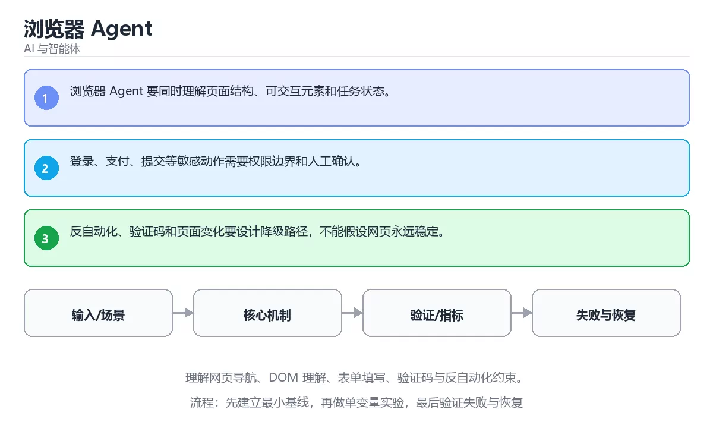

# 浏览器 Agent



> 内容更新时间：2026-10-03 · 学习阶段：高级 · 预计用时：24 分钟

## 学习目标

- 能用自己的话解释：浏览器 Agent 要同时理解页面结构、可交互元素和任务状态。
- 能用自己的话解释：登录、支付、提交等敏感动作需要权限边界和人工确认。
- 能用自己的话解释：反自动化、验证码和页面变化要设计降级路径，不能假设网页永远稳定。
- 能把本课知识放回「AI 与智能体」，并完成练习与测验。

## 前置知识

- 已完成「AI 与智能体」的基础课程，能运行正文中的最小示例。
- 本课关键词：浏览器、DOM、表单、自动化。
- 遇到不熟悉的术语先记录问题，完成练习后再回读。

## 核心知识

### 1. 浏览器 Agent 要同时理解页面结构、可交互元素和任务状态。

- 它解决的问题：把「浏览器 Agent 要同时理解页面结构、可交互元素和任务状态。」放回真实场景，说明不做它会带来什么后果。
- 关键做法：先用最小示例建立基线，再逐步加入边界、失败和性能条件。
- 验证标准：结果可复现、错误可解释、边界有测试、失败能恢复。

### 2. 登录、支付、提交等敏感动作需要权限边界和人工确认。

- 它解决的问题：把「登录、支付、提交等敏感动作需要权限边界和人工确认。」放回真实场景，说明不做它会带来什么后果。
- 关键做法：先用最小示例建立基线，再逐步加入边界、失败和性能条件。
- 验证标准：结果可复现、错误可解释、边界有测试、失败能恢复。

### 3. 反自动化、验证码和页面变化要设计降级路径，不能假设网页永远稳定。

- 它解决的问题：把「反自动化、验证码和页面变化要设计降级路径，不能假设网页永远稳定。」放回真实场景，说明不做它会带来什么后果。
- 关键做法：先用最小示例建立基线，再逐步加入边界、失败和性能条件。
- 验证标准：结果可复现、错误可解释、边界有测试、失败能恢复。

## 关键流程

```text
输入 → 校验 → 核心处理 → 验证 → 记录指标 → 失败恢复
```

## 实践路径

1. 用一句话复述本课要解决的问题。
2. 跑通正文中的最小示例并记录基线。
3. 只改变一个输入或参数，预测并验证结果。
4. 补一个失败路径，记录错误、恢复和指标。
5. 把结论写成可复现的笔记或测试。

## 常见误区

| 误区 | 后果 | 修正 |
| --- | --- | --- |
| 只记术语不做实验 | 遇到真实问题无法判断 | 用最小输入跑通并记录结果 |
| 只测正常路径 | 边界和故障上线才暴露 | 补空值、极值和依赖失败 |
| 没有基线就优化 | 无法证明改进有效 | 先测量再修改 |
| 忽略成本与安全 | 性能和风险失控 | 同时记录资源、权限与失败代价 |

## 动手练习

1. 合上教程，用 3～5 句话解释「浏览器 Agent」。
2. 从正文选一个例子，改变一个条件并预测结果。
3. 设计一个失败场景，写出止损与恢复步骤。

**验收标准**：留下输入、命令、输出、差异和下一步问题。

## 本课小结

- 本课属于「AI 与智能体」，核心关键词是 浏览器、DOM、表单、自动化。
- 先保证正确与可复现，再讨论性能和扩展。
- 完成练习和测验后，把仍然不确定的问题写成下一轮验证清单。

> 本课由 P1 内容扩展生成，重点补充原有课程缺失的主题与工程边界。


## 考点精讲：把测验题还原成判断过程

本课有 4 个判断点。先自己作答，再看「判断依据」；如果结论正确但理由不完整，回到正文对应章节补足概念。

### 考点 1：关于「浏览器 Agent 要同时理解页面结…」，下列说法正确的是？

- **正确判断**：浏览器 Agent 要同时理解页面结构、可交互元素和任务状态。
- **判断依据**：学习《浏览器 Agent》时应把该要点与「浏览器」一起理解。复习《浏览器 Agent》的「浏览器、DOM、表单」时，再用一个边界输入验证同一个结论。正确项「浏览器 Agent 要同时理解页面结构、可交互元素和任务状态」既符合定义也满足题干限定的场景，因此应当选择。错误项「MCP 用统一协议把模型应用与外部工具、资源和提示连接起来」忽略了题目中的限制条件，因此不成立。错误项「A2A 关注独立 Agent 之间的任务协商、能力发现和结果交换」属于相邻主题的说法，范围与本题要求不一致，在题干「关于「浏览器 Agent 要同时理解页面结…」，下列说法正确的是？」的语境下并不成立。错误项「上下文不是越多越好，关键是相关性、时效性和位置」把不同概念混在一起，缺少题干限定的前提。把题干「关于「浏览器 Agent 要同时理解页面结…」，下列说法正确的是？」放回《浏览器 Agent》的「理解网页导航、DOM 理解、表单填写、验证码与反自动化约束」语境，逐项对照定义与边界条件，就能排除其余说法。
- **迁移检查**：把题干里的一个条件换成边界值，原来的结论还成立吗？写出判断过程。

### 考点 2：关于「登录、支付、提交等敏感动作需要权限边…」，下列说法正确的是？

- **正确判断**：登录、支付、提交等敏感动作需要权限边界和人工确认。
- **判断依据**：学习《浏览器 Agent》时应把该要点与「浏览器」一起理解。复习《浏览器 Agent》的「浏览器、DOM、表单」时，再用一个边界输入验证同一个结论。正确项「登录、支付、提交等敏感动作需要权限边界和人工确认」与题干要求一致，是本课知识点的准确定义。错误项「长历史要压缩为结构化摘要并保留可追溯引用」忽略了题目中的限制条件，因此不成立。错误项「Host 负责权限与用户交互，Client 连接 Server，Server 暴露受控能力」把不同概念混在一起，缺少题干限定的前提，在题干「关于「登录、支付、提交等敏感动作需要权限边…」，下列说法正确的是？」的语境下并不成立。错误项「任务要有明确输入、输出、超时、取消和错误语义，避免无限委派」与课程给出的定义相冲突，不能回答题目所问。把题干「关于「登录、支付、提交等敏感动作需要权限边…」，下列说法正确的是？」放回《浏览器 Agent》的「理解网页导航、DOM 理解、表单填写、验证码与反自动化约束」语境，逐项对照定义与边界条件，就能排除其余说法。
- **迁移检查**：遮住选项，只根据定义复述一次答案，再回来看哪个选项与复述一致。

### 考点 3：关于「反自动化、验证码和页面变化要设计降级…」，下列说法正确的是？

- **正确判断**：反自动化、验证码和页面变化要设计降级路径，不能假设网页永远稳定。
- **判断依据**：学习《浏览器 Agent》时应把该要点与「浏览器」一起理解。正确项「反自动化、验证码和页面变化要设计降级路径，不能假设网页永远稳定」抓住了题干的核心条件，是经得起边界检验的表述。错误项「工具描述、输入 schema、超时和权限确认共同决定 Agent 能否安全调用」把不同概念混在一起，缺少题干限定的前提。错误项「多 Agent 不是越多越好，只有单 Agent 遇到上下文或工具瓶颈时才拆分」与课程给出的定义相冲突，不能回答题目所问。错误项「上下文管理要覆盖检索、工具结果、记忆、权限和成本」只看到了表面现象，没有解释题干真正考查的机制。把题干「关于「反自动化、验证码和页面变化要设计降级…」，下列说法正确的是？」放回《浏览器 Agent》的「理解网页导航、DOM 理解、表单填写、验证码与反自动化约束」语境，逐项对照定义与边界条件，就能排除其余说法。
- **迁移检查**：遮住选项，只根据定义复述一次答案，再回来看哪个选项与复述一致。

### 考点 4：「浏览器 Agent」的核心学习目标是什么？

- **正确判断**：理解网页导航、DOM 理解、表单填写、验证码与反自动化约束。
- **判断依据**：正确项「理解网页导航、DOM 理解、表单填写、验证码与反自动化约束」与本课示例和结论一致，可以直接用于实际编码。错误项「理解 Agent 之间发现、任务委派、状态同步和结果汇总的协议设计」只看到了表面现象，没有解释题干真正考查的机制。错误项「系统性选择、压缩、排序和更新进入模型上下文的信息」在边界或失败路径上会得出错误结果。错误项「理解 MCP 的 Host、Client、Server、工具与资源模型及权限边界」把因果关系颠倒了，不能作为正确结论。把题干「「浏览器 Agent」的核心学习目标是什么？」放回《浏览器 Agent》的「理解网页导航、DOM 理解、表单填写、验证码与反自动化约束」语境，逐项对照定义与边界条件，就能排除其余说法。
- **迁移检查**：遮住选项，只根据定义复述一次答案，再回来看哪个选项与复述一致。

## 本课复习清单

离开本课前，逐项确认：

- [ ] 不看解析，能说出「关于「浏览器 Agent 要同时理解页面结…」，下列说法正确的是？」的判断依据。
- [ ] 不看解析，能说出「关于「登录、支付、提交等敏感动作需要权限边…」，下列说法正确的是？」的判断依据。
- [ ] 不看解析，能说出「关于「反自动化、验证码和页面变化要设计降级…」，下列说法正确的是？」的判断依据。
- [ ] 不看解析，能说出「「浏览器 Agent」的核心学习目标是什么？」的判断依据。
- [ ] 至少运行一次本课示例，记录输入、输出和一个边界情况。
- [ ] 把本课最容易混淆的两个概念写成一句话对照。

| 复盘项 | 记录 |
| --- | --- |
| 已经能独立解释的考点 |  |
| 仍然说不清的概念 |  |
| 下一步验证动作 |  |

## 逐节复习与自检

下面按正文顺序回顾每一节，并给出一个自检问题；说不清的地方回到原章节补课。

### 核心知识

」放回真实场景，说明不做它会带来什么后果。关键做法：先用最小示例建立基线，再逐步加入边界、失败和性能条件。

自检：这一节与相邻主题的边界在哪里？

### 动手练习

合上教程，用 3～5 句话解释「浏览器 Agent」。从正文选一个例子，改变一个条件并预测结果。

自检：如果去掉这一节里的一个前提，结论会怎样变化？

### 验证步骤

制造一次错误输入，记录错误信息与修复方式。

自检：如果去掉这一节里的一个前提，结论会怎样变化？

## 易错点回顾

下面把本课最容易判断错的地方集中成一张清单，复习时先自己回答，再对照解析补全理由。

- **关于「浏览器 Agent 要同时理解页面结…」，下列说法正确的是？**：学习《浏览器 Agent》时应把该要点与「浏览器」一起理解。
- **关于「登录、支付、提交等敏感动作需要权限边…」，下列说法正确的是？**：学习《浏览器 Agent》时应把该要点与「浏览器」一起理解。
- **关于「反自动化、验证码和页面变化要设计降级…」，下列说法正确的是？**：学习《浏览器 Agent》时应把该要点与「浏览器」一起理解。
- **「浏览器 Agent」的核心学习目标是什么？**：正确项「理解网页导航、DOM 理解、表单填写、验证码与反自动化约束」与本课示例和结论一致，可以直接用于实际编码。

## English Overview

**Title:** Browser Agents

**Summary:** Cover navigation, DOM understanding, forms, captchas and anti-automation limits.

**Category:** AI & Agents  
**Level:** 高级  
**Key terms:** 浏览器, DOM, 表单, 自动化

> The full tutorial is written in Chinese. This bilingual overview helps English readers identify the topic, scope and key terms before studying the detailed examples.

## 内容元数据

- 内容版本：v2.0
- 最后更新：2026-10-03
- 学习阶段：高级
- 适用环境：主流大模型 API、开源模型与向量数据库
- 内容来源：内置结构化课程与工程实践整理
- 相关主题：浏览器、DOM、表单、自动化
- 质量版本：P0 测验标准 + P1 覆盖扩展 + P2 体验补全


## 最小可运行示例

下面示例用于验证「浏览器 Agent」的最小输入、处理和输出。先原样运行，再只修改一个值：

```python
def score(answer: str) -> int:
    return 1 if answer.strip() else 0

print(score("agent"))
```

## 预期输出

```text
1
```

## 验证步骤

1. 记录运行环境、命令和真实输出。
2. 修改一个输入，先写预测再运行。
3. 制造一次错误输入，记录错误信息与修复方式。
4. 把结论写回本课笔记或测试用例。


## 参考资料与复核

- 最后复核：2026-10-04
- 下次复核：2027-04-04
- 复核范围：版本兼容、API 行为、安全建议与工程实践
- 来源性质：官方文档与标准；本课正文为离线教学重组，不复制原文

| 参考资料 | 本课用途 |
| --- | --- |
| [OpenAI Docs](https://platform.openai.com/docs/) | 模型 API、工具与评估 |
| [Hugging Face Docs](https://huggingface.co/docs) | 模型、数据集与推理 |
| [Model Context Protocol](https://modelcontextprotocol.io/) | Agent 工具与上下文协议 |

> 本课主题：理解网页导航、DOM 理解、表单填写、验证码与反自动化约束。

> App 完全离线展示文字链接，不会自动联网；需要延伸阅读时可复制链接到浏览器。
