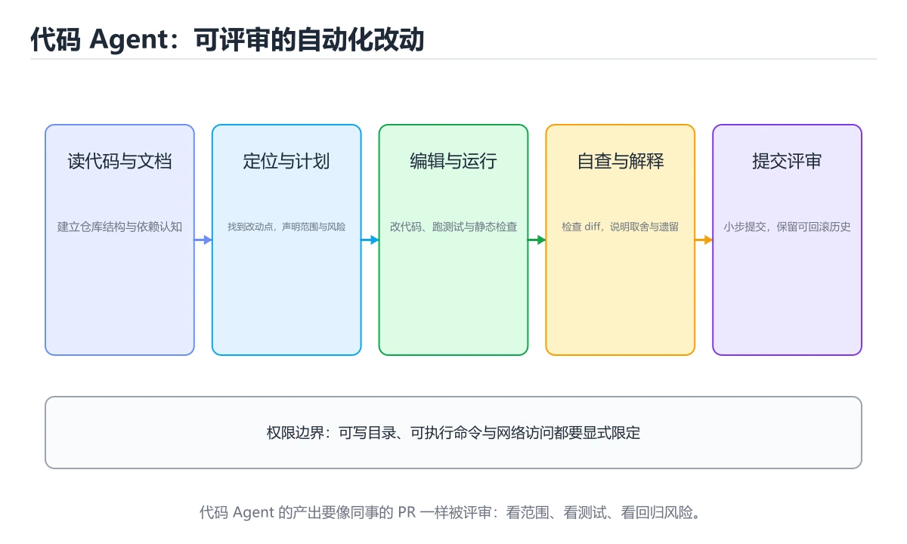
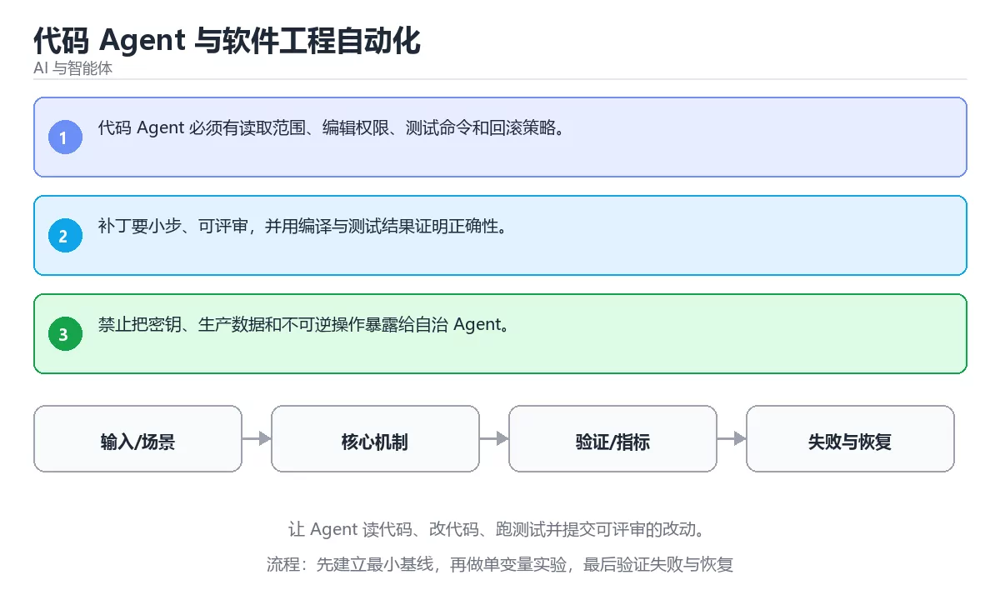

# 代码 Agent 与软件工程自动化

> 内容更新时间：2026-10-06 · 学习阶段：进阶 · 预计用时：40 分钟





## 本节知识框架

**课程定位**：所属分类 `ai`（AI 与智能体），课程主题 `代码 Agent 与软件工程自动化`，学习阶段 进阶，建议用时 40 分钟。

本课主线：让 Agent 读代码、改代码、跑测试并提交可评审的改动。

**学完本课应当能够**
- 说清 `代码 Agent` 与 `测试` 的含义与区别，并各举一个正例和一个反例。
- 用本课示例验证 `评审` 的行为，记录输入、输出与失败条件。
- 遇到「让 Agent 直接改主干」这类问题时，能说出触发条件与修复顺序。

### 从概念到验证的学习链条

1. `代码 Agent`：先掌握 能够读写代码、运行工具并根据测试反馈迭代修改的智能体，再用它解释 `测试` 为什么会出现。
2. `测试`：先掌握 按“代码 Agent 与软件工程自动化”中 代码 Agent、测试、补丁 的实践顺序，把四个步骤排成从准备到复盘的合理顺序，再用它解释 `评审` 为什么会出现。
3. `评审`：先掌握 对设计、代码或变更做系统性检查并给出可执行反馈，再用它解释 `验证命令` 为什么会出现。
4. `验证命令`：先掌握 Agent 改完代码必须跑通的构建、测试或类型检查命令，是判断这份补丁是否可用的证据，再用它解释 本课示例的观察结果 为什么会出现。

**先修与衔接**：本课是「AI 与智能体」分类的第 24 课。先修内容：《浏览器 Agent》。《浏览器 Agent》里的 `浏览器`、`DOM` 是本课的前提。相关或后续课程：《Agent 安全、权限与沙箱》。

### 完成判据

- **定义关**：不看正文也能说明 `代码 Agent` 是 能够读写代码、运行工具并根据测试反馈迭代修改的智能体，并指出一个反例。
- **机制关**：能按“输入 → 转换 → 输出 → 验证”复述 `代码 Agent 与软件工程自动化`，而不是只背结论。
- **示例关**：能运行或推演 `代码 Agent 与软件工程自动化` 的 `text` 示例，并说明一个真实出现的标识符或字面量。
- **证据关**：能指出 `代码 Agent 与软件工程自动化` 示例里的 调用了 `score()`，并说明它支持或反驳了本课的哪一条结论。
- **排错关**：能复现 让 Agent 直接改主干，记录现象并按 在分支或独立工作区改，跑通测试后再合并 修复。
- **迁移关**：能把 `代码 Agent`、`测试`、`补丁`、`评审` 放进一个与 `代码 Agent 与软件工程自动化` 不同的项目场景，并保持输入与验证条件可追踪。
- **复盘关**：学完 `代码 Agent 与软件工程自动化` 后，用一句话写下仍然不确定的结论，并列出下一次验证需要的输入、环境和成功判据。

### 复习清单

- [ ] 能不看正文复述本课核心术语，并指出一个边界或反例。
- [ ] 能运行或推演本课示例，记录输入、输出与失败现象。
- [ ] 能完成一次自测，并把错题对照错误表定位原因。

## 核心概念定义

| 术语 | 操作性定义 | 常见边界与风险 |
| --- | --- | --- |
| 代码 Agent | 能够读写代码、运行工具并根据测试反馈迭代修改的智能体。 | 只在「能够读写代码、运行工具并根据测试反馈迭代修改的智能体」这一前提下成立，换输入或换环境要重新验证。 |
| 测试 | 按“代码 Agent 与软件工程自动化”中 代码 Agent、测试、补丁 的实践顺序，把四个步骤排成从准备到复盘的合理顺序。 | 易错：没有测试覆盖的批量修改无法回滚；正确做法是在分支或独立工作区改，跑通测试后再合并。 |
| 评审 | 对设计、代码或变更做系统性检查并给出可执行反馈。 | 只在「对设计、代码或变更做系统性检查并给出可执行反馈」这一前提下成立，换输入或换环境要重新验证。 |
| 验证命令 | Agent 改完代码必须跑通的构建、测试或类型检查命令，是判断这份补丁是否可用的证据。 | 静态检查只在编译期成立，运行期输入仍需校验。 |

## 原理与运行机制

### 机制总览

**教材衔接：核心知识**

### 1. 代码 Agent 必须有读取范围、编辑权限、测试命令和回滚策略。

- 关键做法：先用 answer 建立 代码 Agent 的基线，再逐步加入边界与失败条件。
- 验证标准：测试 的异常路径有明确错误信息与恢复动作。

### 2. 补丁要小步、可评审，并用编译与测试结果证明正确性。

把这条结论放回「代码 Agent 与软件工程自动化」的完整流程里展开：

- 正文依据：能用自己的话解释：代码 Agent 必须有读取范围、编辑权限、测试命令和回滚策略。
- 落地检查：把「2. 补丁要小步、可评审，并用编译与测试结果证明正确性。」改写成一条可执行的核对项，逐条验证输入、超时与失败路径。

### 3. 禁止把密钥、生产数据和不可逆操作暴露给自治 Agent。

把这条结论放回「代码 Agent 与软件工程自动化」的完整流程里展开：

- 正文依据：能用自己的话解释：补丁要小步、可评审，并用编译与测试结果证明正确性。
- 落地检查：把「3. 禁止把密钥、生产数据和不可逆操作暴露给自治 Agent。」改写成一条可执行的核对项，逐条验证输入、超时与失败路径。

**教材衔接：关键流程**

**教材衔接：实践路径**

1. 用一句话复述本课要解决的问题。
2. 跑通正文中的最小示例并记录基线。
3. 只改变一个输入或参数，预测并验证结果。
4. 补一个失败路径，记录错误、恢复和指标。
5. 把结论写成可复现的笔记或测试。

**教材衔接：验证步骤**

1. 记录运行环境、命令和真实输出。
2. 修改一个输入，先写预测再运行。
4. 把结论写回本课笔记或测试用例。

### 机制拆解：每一步的输入、动作与输出

#### 1. `代码 Agent`
- 输入：`代码 Agent`；本步把 能够读写代码、运行工具并根据测试反馈迭代修改的智能体 当作判断规则。
- 动作：围绕 `代码 Agent` 保留中间状态，并记录它与 `测试` 的对应关系。
- 输出：`测试`，它可以被下一段代码、测试或记录继续使用。
- `代码 Agent` 的失败条件：只在「能够读写代码、运行工具并根据测试反馈迭代修改的智能体」这一前提下成立，换输入或换环境要重新验证。

#### 2. `测试`
- 输入：`代码 Agent`；本步把 按“代码 Agent 与软件工程自动化”中 代码 Agent、测试、补丁 的实践顺序，把四个步骤排成从准备到复盘的合理顺序 当作判断规则。
- 动作：围绕 `测试` 保留中间状态，并记录它与 `评审` 的对应关系。
- 输出：`评审`，它可以被下一段代码、测试或记录继续使用。
- `测试` 的失败条件：当让 Agent 直接改主干时，会出现没有测试覆盖的批量修改无法回滚。

#### 3. `评审`
- 输入：`测试`；本步把 对设计、代码或变更做系统性检查并给出可执行反馈 当作判断规则。
- 动作：围绕 `评审` 保留中间状态，并记录它与 `验证命令` 的对应关系。
- 输出：`验证命令`，它可以被下一段代码、测试或记录继续使用。
- `评审` 的失败条件：只在「对设计、代码或变更做系统性检查并给出可执行反馈」这一前提下成立，换输入或换环境要重新验证。

#### 4. `验证命令`
- 输入：`评审`；本步把 Agent 改完代码必须跑通的构建、测试或类型检查命令，是判断这份补丁是否可用的证据 当作判断规则。
- 动作：围绕 `验证命令` 保留中间状态，并记录它与 `score` 的对应关系。
- 输出：`score`，它可以被下一段代码、测试或记录继续使用。
- `验证命令` 的失败条件：静态检查只在编译期成立，运行期输入仍需校验。

### 示例中的可观察事实

1. 调用了 `score()`；它对应的课程主题是 `代码 Agent 与软件工程自动化`。
2. 调用了 `strip()`；它对应的课程主题是 `代码 Agent 与软件工程自动化`。
3. 调用了 `print()`；它对应的课程主题是 `代码 Agent 与软件工程自动化`。
4. 出现字面量 `agent`；它对应的课程主题是 `代码 Agent 与软件工程自动化`。

### 复现实验记录

- 环境：`代码 Agent 与软件工程自动化` 使用 `text` 示例，固定 `代码 Agent`、`测试`、`补丁`、`评审` 作为第一组条件。
- 首轮输入：先确认 调用了 `score()`，预测 `代码 Agent` 会怎样变化。
- 基线观察：记录命令、输入、输出和错误原文，不用截图代替可复制的文本。
- 单变量修改：只改变 `代码 Agent`，观察 `验证命令` 是否仍满足定义。
- 失败注入：复现 让 Agent 直接改主干，确认现象是 没有测试覆盖的批量修改无法回滚。
- 记录结论：把“修改前、修改后、预期变化、实际变化”写成四列表，这样复盘 `代码 Agent 与软件工程自动化` 时才能区分概念错误与实现错误。

## 典型应用场景

- **让 Agent 直接改主干**：典型现象是没有测试覆盖的批量修改无法回滚；正确做法是在分支或独立工作区改，跑通测试后再合并。
- **只给任务不给验收命令**：典型现象是Agent 无法判断什么时候算完成；正确做法是把构建、测试与静态检查命令写进任务，作为完成标准。
- **一次改太多文件**：典型现象是改动面过大，审查与定位成本失控；正确做法是拆成可编译、可测试的小步任务，每步单独验证。

### 最小验证场景

- 准备：保留 `text` 示例的原始输入，先记录 `代码 Agent 与软件工程自动化` 的基线输出和完整运行命令。
- 观察：先核对 调用了 `score()`，再改变一个与 `代码 Agent` 相关的条件。
- 判定：新结果与 `代码 Agent 与软件工程自动化` 的基线不同不等于错误；只有当差异破坏了 `代码 Agent` 的定义或错误表中的约束，才判定为失败。

### 选择与边界

- 使用 `代码 Agent` 时，先满足它的定义：能够读写代码、运行工具并根据测试反馈迭代修改的智能体；只在「能够读写代码、运行工具并根据测试反馈迭代修改的智能体」这一前提下成立，换输入或换环境要重新验证。
- 使用 `测试` 时，先满足它的定义：按“代码 Agent 与软件工程自动化”中 代码 Agent、测试、补丁 的实践顺序，把四个步骤排成从准备到复盘的合理顺序；易错：没有测试覆盖的批量修改无法回滚；正确做法是在分支或独立工作区改，跑通测试后再合并。
- 使用 `评审` 时，先满足它的定义：对设计、代码或变更做系统性检查并给出可执行反馈；只在「对设计、代码或变更做系统性检查并给出可执行反馈」这一前提下成立，换输入或换环境要重新验证。
- 使用 `验证命令` 时，先满足它的定义：Agent 改完代码必须跑通的构建、测试或类型检查命令，是判断这份补丁是否可用的证据；静态检查只在编译期成立，运行期输入仍需校验。

## 代码/协议/SQL 示例

**教材衔接：深入补充：代码 Agent 与软件工程自动化 的取舍与边界**


### 四、自测清单

- 能否用一句话说出代码 Agent 与软件工程自动化解决的核心问题与不适用场景？
- 能否画出 代码 Agent 的数据流或状态变化，并标出失败路径？
- 构造一个 测试 的反例，证明「总是成立」的说法不成立。
- 能否写出一条可复现的验证命令，让别人独立得到相同结论？

### 五、AI 工程补充

**教材衔接：零基础精讲：把代码 Agent 与软件工程自动化真正讲透**

### 先建立一个直觉

把「代码 Agent 与软件工程自动化」看成一条可评测的流水线：输入经过 代码 Agent 处理，产出候选结果，再由 测试 决定哪些结果可以真正执行；每一环都要有可测的输入、输出与失败处理。

本课的摘要可以当作一张地图：让 Agent 读代码、改代码、跑测试并提交可评审的改动。

### 逐步拆解

1. 澄清输入与目标。先写清「代码 Agent 与软件工程自动化」要解决的问题、合法输入范围和成功标准，再进入后续步骤。
2. 描述处理过程。把「代码 Agent、测试、补丁、评审」映射到具体步骤，每步都要求能单独验证。
3. 定义输出。明确 代码 Agent 与 测试 各自的产物，以及失败时留下什么证据。
4. 让「代码 Agent 与软件工程自动化」的失败路径尽早暴露：把代码 Agent推到边界值，记录错误信息、重试或降级动作，以及人工兜底条件。
5. 选一个只有两三步的代码 Agent例子，先写出预期输出，再运行确认；不一致时先怀疑前提而不是代码。

### 把正文串成一条执行链

- **1. 代码 Agent 必须有读取范围、编辑权限、测试命令和回滚策略。**：在「代码 Agent 与软件工程自动化」里，「1. 代码 Agent 必须有读取范围、编辑权限、测试命令和回滚策略。」这一步要先写清输入与预期，再记录实际结果和差异；结果不符时回到对应小节核对前提。
- **2. 补丁要小步、可评审，并用编译与测试结果证明正确性。**：在「代码 Agent 与软件工程自动化」里，「2. 补丁要小步、可评审，并用编译与测试结果证明正确性。」这一步要先写清输入与预期，再记录实际结果和差异；结果不符时回到对应小节核对前提。
- **3. 禁止把密钥、生产数据和不可逆操作暴露给自治 Agent。**：在「代码 Agent 与软件工程自动化」里，「3. 禁止把密钥、生产数据和不可逆操作暴露给自治 Agent。」这一步要先写清输入与预期，再记录实际结果和差异；结果不符时回到对应小节核对前提。
- **考点 1：核心知识 的代码阅读题**：先独立作答，再回到本课正文核对 answer 的执行路径；答错时记录是哪一个前提被忽略。
- **考点 2：关于「补丁要小步、可评审，并用编译与测试结果证明正确性。」，下列说法正确的是？**：先独立作答，再回到本课对应小节核对判断依据；答错时记录是哪一个前提被忽略。
- **考点 3：关于「禁止把密钥、生产数据和不可逆操作暴露给自治 Agent。」，下列说法正确的是？**：先独立作答，再回到本课对应小节核对判断依据；答错时记录是哪一个前提被忽略。

### 从测验反推易错点

- 参考判断：代码 Agent 必须有读取范围、编辑权限、测试命令和回滚策略。
- 自问：如果去掉题干里的一个限定词，结论还成立吗？

- 参考判断：补丁要小步、可评审，并用编译与测试结果证明正确性。

- 参考判断：禁止把密钥、生产数据和不可逆操作暴露给自治 Agent。

**检查点 4：本课的核心学习目标是什么？**

- 参考判断：让 Agent 读代码、改代码、跑测试并提交可评审的改动。

- 参考判断：代码 Agent、测试

### 工程排错顺序

| 先查什么 | 要得到的证据 | 判断标准 |
| --- | --- | --- |
| 模型输入是否经过长度、格式与敏感信息检查？ | 日志、输入样例、测试或指标 | 能复现并解释，才算定位 |
| 工具调用是否最小权限、可超时、可取消？ | 日志、输入样例、测试或指标 | 能复现并解释，才算定位 |
| 输出是否有引用、置信度或人工复核兜底？ | 日志、输入样例、测试或指标 | 能复现并解释，才算定位 |
| 成本、延迟与失败率是否有指标？ | 日志、输入样例、测试或指标 | 能复现并解释，才算定位 |

### 变式训练

1. 先用一个单文件示例验证 answer，确认正确性后再引入框架或分布式组件。
2. 把 answer 的数据量提高一个数量级，观察延迟与内存的变化拐点。
3. 制造一次 代码 Agent 相关的依赖超时或错误输入，要求错误可解释且不留半完成状态。
5. 删掉一个看似必要的步骤（例如 代码 Agent 相关的校验），观察哪个测试或指标先失败，用证据说明它为什么不能省。
6. 限制 CPU 与内存上限后重跑 answer，观察哪一项参数需要重新设定。


### 迁移案例库

下面用不同约束重复同一套方法，每轮只改变 代码 Agent 的一个取值并记录结论。

#### 迁移案例 1：围绕「代码 Agent」做一次小实验

**步骤**：
1. 复述当前方案对「代码 Agent」的假设，写成一句可证伪的话。
2. 设计一个正常输入和一个边界输入，分别预测输出。
3. 运行或逐步演算，记录实际输出、耗时和失败信息。
4. 只调整一个参数，比较前后差异并解释原因。
5. 补充一条测试或复习卡，确保下次能更快复现。

**验收**：代码 Agent 的正常、边界、失败三条路径都要有结论；失败路径要写清恢复动作与「代码 Agent 与软件工程自动化」里仍然存在的剩余风险。

#### 迁移案例 2：围绕「测试」做一次小实验

**步骤**：
1. 复述当前方案对「测试」的假设，写成一句可证伪的话。

#### 迁移案例 3：围绕「补丁」做一次小实验

**步骤**：
1. 复述当前方案对「补丁」的假设，写成一句可证伪的话。

#### 迁移案例 4：围绕「评审」做一次小实验

**步骤**：
1. 复述当前方案对「评审」的假设，写成一句可证伪的话。

#### 迁移案例 5：围绕「代码 Agent」做一次小实验

**步骤**：

#### 迁移案例 6：围绕「测试」做一次小实验

**步骤**：

#### 迁移案例 7：围绕「补丁」做一次小实验

**步骤**：

#### 迁移案例 8：围绕「评审」做一次小实验

**步骤**：

#### 迁移案例 9：围绕「代码 Agent」做一次小实验

**步骤**：

#### 迁移案例 10：围绕「测试」做一次小实验

**步骤**：

#### 迁移案例 11：围绕「补丁」做一次小实验

**步骤**：

#### 迁移案例 12：围绕「评审」做一次小实验

**步骤**：

#### 迁移案例 13：围绕「代码 Agent」做一次小实验

**步骤**：

#### 迁移案例 14：围绕「测试」做一次小实验

**步骤**：

#### 迁移案例 15：围绕「补丁」做一次小实验

**步骤**：

#### 迁移案例 16：围绕「评审」做一次小实验

**步骤**：

<!-- p0-depth-v2:end -->

**教材衔接：最小可运行示例**

下面的示例覆盖「代码 Agent 与软件工程自动化」中 代码 Agent 的核心路径。先原样运行，再按注释改一处：

```python
def score(answer: str) -> int:
    return 1 if answer.strip() else 0

print(score("agent"))
```

**教材衔接：预期输出**

```text
1
```

### 示例精读：先找证据，再改一个条件

1. 调用了 `score()`；它出现在 `代码 Agent 与软件工程自动化` 的示例中，阅读时先确认它前后各发生了什么。
2. 调用了 `strip()`；它出现在 `代码 Agent 与软件工程自动化` 的示例中，阅读时先确认它前后各发生了什么。
3. 调用了 `print()`；它出现在 `代码 Agent 与软件工程自动化` 的示例中，阅读时先确认它前后各发生了什么。
4. 出现字面量 `agent`；它出现在 `代码 Agent 与软件工程自动化` 的示例中，阅读时先确认它前后各发生了什么。
- 在 `代码 Agent 与软件工程自动化` 中与 `代码 Agent` 对照：示例必须能支持 能够读写代码、运行工具并根据测试反馈迭代修改的智能体，否则说明这一段还缺少实现或验证步骤。
- 在 `代码 Agent 与软件工程自动化` 中与 `测试` 对照：示例必须能支持 按“代码 Agent 与软件工程自动化”中 代码 Agent、测试、补丁 的实践顺序，把四个步骤排成从准备到复盘的合理顺序，否则说明这一段还缺少实现或验证步骤。
- 在 `代码 Agent 与软件工程自动化` 中与 `评审` 对照：示例必须能支持 对设计、代码或变更做系统性检查并给出可执行反馈，否则说明这一段还缺少实现或验证步骤。
- 在 `代码 Agent 与软件工程自动化` 中与 `验证命令` 对照：示例必须能支持 Agent 改完代码必须跑通的构建、测试或类型检查命令，是判断这份补丁是否可用的证据，否则说明这一段还缺少实现或验证步骤。

## 时间/空间复杂度或性能分析

**性能关注点（代码 Agent 与软件工程自动化）**：算力与显存决定可行规模：记录训练或推理耗时、显存峰值与模型精度，换数据集要重新评估。

**测量方法**：以 `代码 Agent 与软件工程自动化` 的 `代码 Agent` 场景为对象，固定输入跑一遍记录基线，再把规模或并发度提高一个数量级复测；两次结果的差值与波动范围才是结论依据。

### 需要控制的变量与记录项

- `代码 Agent 与软件工程自动化` 的 `代码 Agent`：固定它的版本、输入范围和资源上限，分别记录速度、内存与失败率的变化。
- `代码 Agent 与软件工程自动化` 的 `测试`：固定它的版本、输入范围和资源上限，分别记录速度、内存与失败率的变化。
- `代码 Agent 与软件工程自动化` 的 `补丁`：固定它的版本、输入范围和资源上限，分别记录速度、内存与失败率的变化。
- `代码 Agent 与软件工程自动化` 的 `评审`：固定它的版本、输入范围和资源上限，分别记录速度、内存与失败率的变化。
- `代码 Agent 与软件工程自动化` 中 `代码 Agent` 的边界：只在「能够读写代码、运行工具并根据测试反馈迭代修改的智能体」这一前提下成立，换输入或换环境要重新验证。达到边界时不要外推，必须重新测量。
- `代码 Agent 与软件工程自动化` 中 `测试` 的边界：易错：没有测试覆盖的批量修改无法回滚；正确做法是在分支或独立工作区改，跑通测试后再合并。达到边界时不要外推，必须重新测量。
- `代码 Agent 与软件工程自动化` 中 `评审` 的边界：只在「对设计、代码或变更做系统性检查并给出可执行反馈」这一前提下成立，换输入或换环境要重新验证。达到边界时不要外推，必须重新测量。
- `代码 Agent 与软件工程自动化` 中 `验证命令` 的边界：静态检查只在编译期成立，运行期输入仍需校验。达到边界时不要外推，必须重新测量。
- `代码 Agent 与软件工程自动化` 的代码证据：先验证 调用了 `score()`，再记录该路径的输入规模与耗时；只看代码行数不能推出复杂度。

## 常见误区与易错点

| 容易写错的做法 | 实际现象 | 原因与正确做法 |
| --- | --- | --- |
| 让 Agent 直接改主干 | 没有测试覆盖的批量修改无法回滚。 | 在分支或独立工作区改，跑通测试后再合并。 |
| 只给任务不给验收命令 | Agent 无法判断什么时候算完成。 | 把构建、测试与静态检查命令写进任务，作为完成标准。 |
| 一次改太多文件 | 改动面过大，审查与定位成本失控。 | 拆成可编译、可测试的小步任务，每步单独验证。 |

### 现场 1：让 Agent 直接改主干

**症状**：没有测试覆盖的批量修改无法回滚。

**根因与修复**：在分支或独立工作区改，跑通测试后再合并。

**自检**：在本课示例里复现「让 Agent 直接改主干」，改成在分支或独立工作区改，跑通测试后再合并后重跑；如果症状消失且失败路径按预期变化，说明定位正确。

### 现场 2：只给任务不给验收命令

**症状**：Agent 无法判断什么时候算完成。

**根因与修复**：把构建、测试与静态检查命令写进任务，作为完成标准。

**自检**：在本课示例里复现「只给任务不给验收命令」，改成把构建、测试与静态检查命令写进任务，作为完成标准后重跑；如果症状消失且失败路径按预期变化，说明定位正确。

### 现场 3：一次改太多文件

**症状**：改动面过大，审查与定位成本失控。

**根因与修复**：拆成可编译、可测试的小步任务，每步单独验证。

**自检**：在本课示例里复现「一次改太多文件」，改成拆成可编译、可测试的小步任务，每步单独验证后重跑；如果症状消失且失败路径按预期变化，说明定位正确。

## 与其他知识点的关系

**教材衔接：复习与迁移**

### 概念复述

- 用一句话说明「代码 Agent 与软件工程自动化」解决什么问题：让 Agent 读代码、改代码、跑测试并提交可评审的改动。
- 写出代码 Agent、测试、补丁之间的关系，并各举一个例子。
- 说出本课最容易混淆的两个概念，以及区分它们的判据。

### 正文逐节复核

- **深入补充：代码 Agent 与软件工程自动化 的取舍与边界**：学习代码 Agent 与软件工程自动化时，最容易只记住结论而忽略前提。
- **零基础精讲：把代码 Agent 与软件工程自动化真正讲透**：本课的摘要可以当作一张地图：让 Agent 读代码、改代码、跑测试并提交可评审的改动。


### 迁移练习

- **先修**：`浏览器 Agent`。本课默认这些内容已经掌握。
- **相关或后续**：`Agent 安全、权限与沙箱`。本课术语会在这些课程里继续使用。
- **术语归属**：`代码 Agent`、`测试`、`评审` 的定义以本课「核心概念定义」为准，换到其他课程时先确认定义是否被改写。

### 先修与后续术语接口

- `浏览器 Agent`：两者通过本分类的学习顺序衔接，阅读时重点比较各自的输入与失败条件。
- `Agent 安全、权限与沙箱`：两者通过本分类的学习顺序衔接，阅读时重点比较各自的输入与失败条件。

### 容易混淆的相邻概念

- `代码 Agent` 与 `测试`：前者强调 能够读写代码、运行工具并根据测试反馈迭代修改的智能体；后者强调 按“代码 Agent 与软件工程自动化”中 代码 Agent、测试、补丁 的实践顺序，把四个步骤排成从准备到复盘的合理顺序。判断时分别检查两条定义的适用范围，不要只看名称相似就互换。
- `测试` 与 `评审`：前者强调 按“代码 Agent 与软件工程自动化”中 代码 Agent、测试、补丁 的实践顺序，把四个步骤排成从准备到复盘的合理顺序；后者强调 对设计、代码或变更做系统性检查并给出可执行反馈。判断时分别检查两条定义的适用范围，不要只看名称相似就互换。
- `评审` 与 `验证命令`：前者强调 对设计、代码或变更做系统性检查并给出可执行反馈；后者强调 Agent 改完代码必须跑通的构建、测试或类型检查命令，是判断这份补丁是否可用的证据。判断时分别检查两条定义的适用范围，不要只看名称相似就互换。

## 自测题与参考答案

> 先独立作答，再对照参考答案；答案都能在本课正文、术语表或错误表里找到依据。

### 自测 1（概念复述）

不看正文，写出 `代码 Agent` 的操作性定义，并说明它与 `测试` 的区别。

**参考答案**：能够读写代码、运行工具并根据测试反馈迭代修改的智能体。

`测试` 的定位是：按“代码 Agent 与软件工程自动化”中 代码 Agent、测试、补丁 的实践顺序，把四个步骤排成从准备到复盘的合理顺序；两者的差别要从适用对象与失败模式上说明。

### 自测 2（排错）

本课错误表记录了「让 Agent 直接改主干」这类做法。请写出它会出现的现象、根因，以及修复顺序。

**参考答案**：现象是没有测试覆盖的批量修改无法回滚；正确做法是在分支或独立工作区改，跑通测试后再合并。修复时先复现现象并保留证据，再改动一处假设重跑，确认现象消失。

### 自测 3（动手验证）

运行本课的 `text` 示例，改动其中一个输入后重新运行，记录输出与错误信息。

**参考答案**：正常输入下 `text` 示例应当复现正文给出的结果；改动输入后，如果结果改变或报错，先核对它是否满足 `代码 Agent 与软件工程自动化` 中`代码 Agent` 的适用范围，再检查错误表里是否有同类现象。

### 自测 4（代码阅读）

阅读本课开头的 `text` 示例，说明它体现了`代码 Agent` 的哪一条性质，并指出改动哪个输入会让这条性质不再成立。

**参考答案**：`代码 Agent` 的定义是 能够读写代码、运行工具并根据测试反馈迭代修改的智能体，示例正是在实现这条定义。改动与 `代码 Agent` 有关的一个输入后，如果结果不再符合 `代码 Agent 与软件工程自动化` 的正文描述，就说明该性质只在当前前提成立。

### 自测 5（迁移）

把 `代码 Agent 与软件工程自动化` 的方法迁移到自己的项目：围绕 `代码 Agent` 写出一个与错误表同类的风险点，并说明触发条件和检验方式。

**参考答案**：例如「一次改太多文件」，它会导致改动面过大，审查与定位成本失控；检验方式是按拆成可编译、可测试的小步任务，每步单独验证改一处再复现，确认现象消失且没有引入新的失败分支。

### 自测 6（对比）

用一个表格对比 `代码 Agent` 与 `测试`：各写一行适用场景、一行失败表现。

**参考答案**：`代码 Agent` 的定义是能够读写代码、运行工具并根据测试反馈迭代修改的智能体；`测试` 的定义是按“代码 Agent 与软件工程自动化”中 代码 Agent、测试、补丁 的实践顺序，把四个步骤排成从准备到复盘的合理顺序。两者的失败表现分别对应本课错误表里与本术语相关的行。

### 自测 7（排错顺序）

面对「让 Agent 直接改主干」引发的问题，请把“复现 没有测试覆盖的批量修改无法回滚 → 保留证据 → 在分支或独立工作区改，跑通测试后再合并 → 回归验证”四步写成可执行的检查清单。

**参考答案**：第一步按没有测试覆盖的批量修改无法回滚复现；第二步记录输入、版本与完整报错；第三步按在分支或独立工作区改，跑通测试后再合并只改一处；第四步重跑并确认失败路径也按预期变化。

### 自测 8（边界判断）

针对 `验证命令`，分别写出“可以使用”的条件和“结论不再成立”的条件。

**参考答案**：静态检查只在编译期成立，运行期输入仍需校验。 同时要把 `验证命令` 的定义 Agent 改完代码必须跑通的构建、测试或类型检查命令，是判断这份补丁是否可用的证据 与实际输入逐项对照。

### 自测 9（机制重建）

不看正文，按输入、转换、输出、验证四段重建 `代码 Agent` → `测试` → `评审` → `验证命令` 的作用链。

**参考答案**：起点是 `代码 Agent` 的定义 能够读写代码、运行工具并根据测试反馈迭代修改的智能体；中间每一步都保留可观察状态；终点由 `验证命令` 检查，失败时回到错误表定位第一个偏离定义的步骤。

### 自测 10（综合排错）

在 `代码 Agent 与软件工程自动化` 中，现象是 改动面过大，审查与定位成本失控。请围绕 一次改太多文件 写出最小复现、关键证据、修复动作和回归验证，并说明为什么不能只凭一次运行下结论。

**参考答案**：先复现 一次改太多文件，记录输入与完整错误；再按 拆成可编译、可测试的小步任务，每步单独验证 只改一处。回归时同时跑正常路径和边界路径，只有两次结果都可解释，才把修复视为完成。

### 自测 11（一分钟复述）

用每分钟约 200 字的速度复述 `代码 Agent 与软件工程自动化`：先给主问题，再按顺序说出 `代码 Agent`、`测试`、`评审`、`验证命令`，最后给一个失败案例。

**自评标准**：主问题必须对应 让 Agent 读代码、改代码、跑测试并提交可评审的改动；每个术语都要能接上一句定义或边界；失败案例必须写成可观察现象，不能用“可能有风险”代替证据。

## 术语速查

| 术语 | 一句话说明 |
| --- | --- |
| `代码 Agent` | 能够读写代码、运行工具并根据测试反馈迭代修改的智能体。 |
| `测试` | 按“代码 Agent 与软件工程自动化”中 代码 Agent、测试、补丁 的实践顺序，把四个步骤排成从准备到复盘的合理顺序。 |
| `评审` | 对设计、代码或变更做系统性检查并给出可执行反馈。 |
| `验证命令` | Agent 改完代码必须跑通的构建、测试或类型检查命令，是判断这份补丁是否可用的证据。 |

**术语关系**：`代码 Agent`（能够读写代码、运行工具并根据测试反馈迭代修改的智能体） → `测试`（按“代码 Agent 与软件工程自动化”中 代码 Agent、测试、补丁 的实践顺序） → `评审`（对设计、代码或变更做系统性检查并给出可执行反馈） → `验证命令`（Agent 改完代码必须跑通的构建、测试或类型检查命令）。

## 考点精讲

`代码 Agent 与软件工程自动化` 的题库有 5 道题，下面逐题给出题干、正确项与判断依据：先自己作答，再核对正确项，最后回到正文对应小节复核。

### 考点 1：第 1 题

- **题目**：`代码 Agent 与软件工程自动化` 的示例代码用于验证 `代码 Agent`，其背景是让 Agent 读代码、改代码、跑测试并提交可评审的改动。代码的真实内容是下面哪一项？
- **正确项**：出现字面量 `agent`
- **判断依据**：这道题落在术语 `代码 Agent` 上：能够读写代码、运行工具并根据测试反馈迭代修改的智能体。复习时把 `代码 Agent` 的定义、适用边界和一个反例一起说清楚，再回到「核心概念定义」核对原文。

### 考点 2：第 2 题

- **题目**：在 `代码 Agent 与软件工程自动化` 里，与 `代码 Agent` 有关的说法中，哪一项最符合让 Agent 读代码、改代码、跑测试并提交可评审的改动。？
- **正确项**：补丁要小步、可评审，并用编译与测试结果证明正确性。
- **判断依据**：这道题落在术语 `代码 Agent` 上：能够读写代码、运行工具并根据测试反馈迭代修改的智能体。复习时把 `代码 Agent` 的定义、适用边界和一个反例一起说清楚，再回到「核心概念定义」核对原文。

### 考点 3：第 3 题

- **题目**：在 `代码 Agent 与软件工程自动化` 里，与 `代码 Agent` 有关的说法中，哪一项最符合让 Agent 读代码、改代码、跑测试并提交可评审的改动。？（代码 Agent 与软件工程自动化·AI 与智能体 第 3 题）
- **正确项**：禁止把密钥、生产数据和不可逆操作暴露给自治 Agent。
- **判断依据**：这道题落在术语 `代码 Agent` 上：能够读写代码、运行工具并根据测试反馈迭代修改的智能体。复习时把 `代码 Agent` 的定义、适用边界和一个反例一起说清楚，再回到「核心概念定义」核对原文。

### 考点 4：第 4 题

- **题目**：按“代码 Agent 与软件工程自动化”中 代码 Agent、测试、补丁 的实践顺序，把四个步骤排成从准备到复盘的合理顺序。
- **正确项**：先明确 代码 Agent 的输入、输出与约束 → 写出最小示例并核对 测试 的基线结果 → 只改一个变量，记录边界与失败路径的变化 → 固定版本与证据，把“代码 Agent 与软件工程自动化”的结论写成可复现记录
- **判断依据**：这道题落在术语 `代码 Agent` 上：能够读写代码、运行工具并根据测试反馈迭代修改的智能体。复习时把 `代码 Agent` 的定义、适用边界和一个反例一起说清楚，再回到「核心概念定义」核对原文。

### 考点 5：第 5 题

- **题目**：课程 `让 Agent 读代码、改代码、跑测试并提交可评审的改动。`。在 `代码 Agent 与软件工程自动化` 里，`代码 Agent`、`测试` 与下面哪些选项属于同一层概念？（多选）
- **正确项**：代码 Agent；测试
- **判断依据**：这道题落在术语 `代码 Agent` 上：能够读写代码、运行工具并根据测试反馈迭代修改的智能体。复习时把 `代码 Agent` 的定义、适用边界和一个反例一起说清楚，再回到「核心概念定义」核对原文。

### 考点 6：`代码 Agent`

- **要点**：能够读写代码、运行工具并根据测试反馈迭代修改的智能体。
- **代码 Agent 的边界**：只在「能够读写代码、运行工具并根据测试反馈迭代修改的智能体」这一前提下成立，换输入或换环境要重新验证。

### 考点 7：`测试`

- **要点**：按“代码 Agent 与软件工程自动化”中 代码 Agent、测试、补丁 的实践顺序，把四个步骤排成从准备到复盘的合理顺序。
- **测试 的边界**：易错：没有测试覆盖的批量修改无法回滚；正确做法是在分支或独立工作区改，跑通测试后再合并。

### 考点 8：`评审`

- **要点**：对设计、代码或变更做系统性检查并给出可执行反馈。
- **评审 的边界**：只在「对设计、代码或变更做系统性检查并给出可执行反馈」这一前提下成立，换输入或换环境要重新验证。

### 考点 9：`验证命令`

- **要点**：Agent 改完代码必须跑通的构建、测试或类型检查命令，是判断这份补丁是否可用的证据。
- **验证命令 的边界**：静态检查只在编译期成立，运行期输入仍需校验。

### 考点 10：排错——让 Agent 直接改主干

- **现象**：没有测试覆盖的批量修改无法回滚。
- **处理**：在分支或独立工作区改，跑通测试后再合并。

### 考点 11：排错——只给任务不给验收命令

- **现象**：Agent 无法判断什么时候算完成。
- **处理**：把构建、测试与静态检查命令写进任务，作为完成标准。

### 考点 12：综合辨析——`代码 Agent` 与 `验证命令`

- **辨析点**：`代码 Agent` 的定义是 能够读写代码、运行工具并根据测试反馈迭代修改的智能体；`验证命令` 的定义是 Agent 改完代码必须跑通的构建、测试或类型检查命令，是判断这份补丁是否可用的证据。
- **答题要求**：面对 `代码 Agent 与软件工程自动化` 的题目，先判断描述的是 `代码 Agent` 还是 `验证命令`，再归到对应定义，最后写出一个会让该定义失效的边界输入。

### 考点 13：排错评分点

- **现象分**：能写出 没有测试覆盖的批量修改无法回滚，而不是只写“程序有错”。
- **证据分**：保留触发 让 Agent 直接改主干 的输入、版本和错误原文。
- **修复分**：按 在分支或独立工作区改，跑通测试后再合并 只改一处，并同时回归正常路径与边界路径。

## 内容元数据

- 内容版本：v2.0
- 最后更新：2026-10-06
- 学习阶段：进阶
- 适用环境：主流大模型 API、开源模型与向量数据库；本课聚焦 代码 Agent。
- 内容来源：内置结构化课程与工程实践整理
- 相关主题：代码 Agent、测试、补丁、评审
- 质量版本：P0 测验标准 + P1 覆盖扩展 + P2 体验补全

## 参考资料与复核

- 最后复核：2026-10-04
- 下次复核：2026-12-24
- 复核范围：版本兼容、API 行为、安全建议与工程实践
- 来源性质：官方文档、标准或权威教材；本课核对关键词：代码 Agent、测试、补丁、评审。

| 参考资料 | 本课用途 |
| --- | --- |
| [Anthropic 文档](https://docs.anthropic.com/) | Claude API 与 Agent 安全 |
| [OpenAI 开发者文档](https://platform.openai.com/docs/) | 模型 API、工具与评估 |
| [LlamaIndex 文档](https://docs.llamaindex.ai/) | 索引、检索与数据框架 |

| [本课术语索引：代码 Agent 与软件工程自动化](#核心概念定义) | 按本课输入、术语边界和错误表现逐项核对 |
> 「代码 Agent 与软件工程自动化」的链接用于离线阅读后的延伸核对；App 不会自动联网。