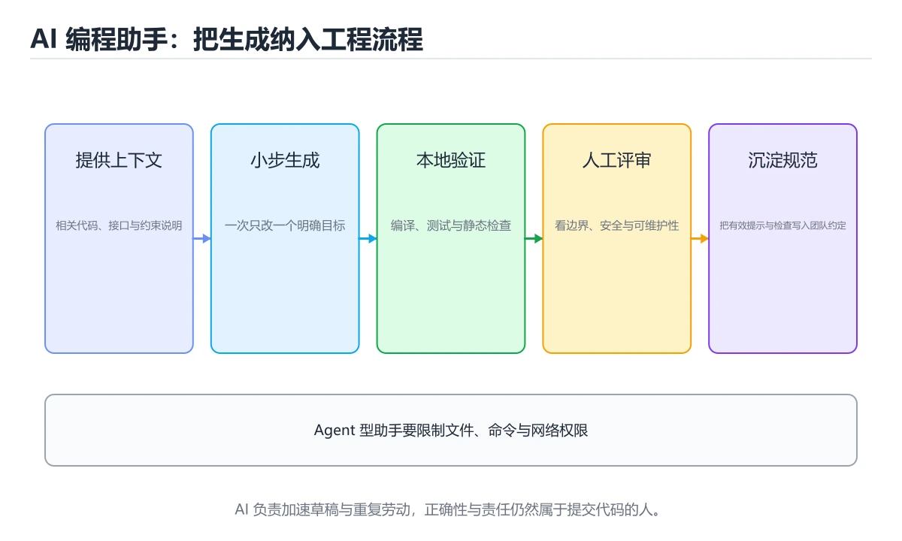
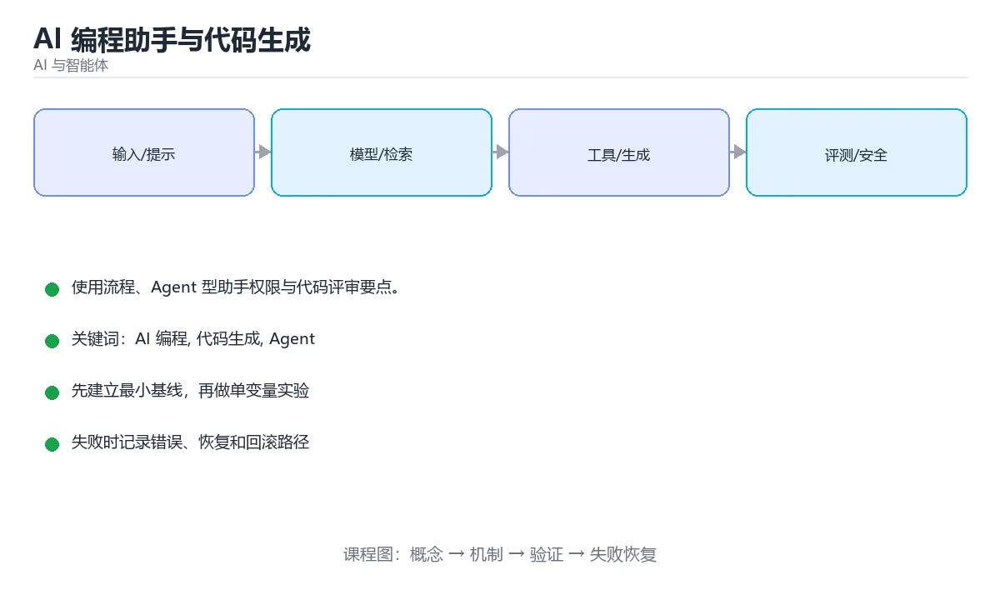

# AI 编程助手与代码生成





> 内容更新时间：2026-10-06 · 学习阶段：进阶 · 预计用时：40 分钟

## 本节知识框架

**课程定位**：所属分类 `ai`（AI 与智能体），课程主题 `AI 编程助手与代码生成`，学习阶段 进阶，建议用时 40 分钟。

本课主线：使用流程、Agent 型助手权限与代码评审要点。

**学完本课应当能够**
- 说清 `AI 编程` 与 `代码生成` 的含义与区别，并各举一个正例和一个反例。
- 用本课示例验证 `Agent` 的行为，记录输入、输出与失败条件。
- 遇到「幻觉 API」这类问题时，能说出触发条件与修复顺序。

### 从概念到验证的学习链条

1. `AI 编程`：先掌握 把模型用于代码生成、补全、解释、测试和评审的工程实践，再用它解释 `代码生成` 为什么会出现。
2. `代码生成`：先掌握 由模型、编译器或模板把更高层描述转换成可执行代码，再用它解释 `Agent` 为什么会出现。
3. `Agent`：先掌握 Agent 型助手的能力来源于工具（文件读写、终端、测试、检索）与循环（执行-观察-修正），因此权限管理与沙箱格外重要：，再用它解释 `代码评审` 为什么会出现。
4. `代码评审`：先掌握 在合并前由他人检查改动的正确性、可维护性、安全性与测试覆盖，再用它解释 本课示例的观察结果 为什么会出现。

**先修与衔接**：本课是「AI 与智能体」分类的第 10 课。先修内容：《多模态 AI：图像、语音与视频》。《多模态 AI：图像、语音与视频》里的 `一只柯基犬，坐在草地上，柔和阳光，浅景深，35mm 镜头，正面视角`、`多模态` 是本课的前提。相关或后续课程：《Agent 评测实战》。

### 完成判据

- **定义关**：不看正文也能说明 `AI 编程` 是 把模型用于代码生成、补全、解释、测试和评审的工程实践，并指出一个反例。
- **机制关**：能按“输入 → 转换 → 输出 → 验证”复述 `AI 编程助手与代码生成`，而不是只背结论。
- **示例关**：能运行或推演 `AI 编程助手与代码生成` 的 `python` 示例，并说明一个真实出现的标识符或字面量。
- **证据关**：能指出 `AI 编程助手与代码生成` 示例里的 调用了 `field()`，并说明它支持或反驳了本课的哪一条结论。
- **排错关**：能复现 幻觉 API，记录现象并按 编译 + 类型检查 + 文档核对 修复。
- **迁移关**：能把 `AI 编程`、`代码生成`、`Agent`、`代码评审` 放进一个与 `AI 编程助手与代码生成` 不同的项目场景，并保持输入与验证条件可追踪。
- **复盘关**：学完 `AI 编程助手与代码生成` 后，用一句话写下仍然不确定的结论，并列出下一次验证需要的输入、环境和成功判据。

### 复习清单

- [ ] 能不看正文复述本课核心术语，并指出一个边界或反例。
- [ ] 能运行或推演本课示例，记录输入、输出与失败现象。
- [ ] 能完成一次自测，并把错题对照错误表定位原因。

## 核心概念定义

| 术语 | 操作性定义 | 常见边界与风险 |
| --- | --- | --- |
| AI 编程 | 把模型用于代码生成、补全、解释、测试和评审的工程实践。 | 结果依赖数据分布、模型版本与算力预算，换数据集或换硬件都要重新评估。 |
| 代码生成 | 由模型、编译器或模板把更高层描述转换成可执行代码。 | 静态检查只在编译期成立，运行期输入仍需校验。 |
| Agent | Agent 型助手的能力来源于工具（文件读写、终端、测试、检索）与循环（执行-观察-修正），因此权限管理与沙箱格外重要。 | 权限与密钥策略变化会让结论失效，按最小权限并用真实凭据流程复验。 |
| 代码评审 | 在合并前由他人检查改动的正确性、可维护性、安全性与测试覆盖。 | 权限与密钥策略变化会让结论失效，按最小权限并用真实凭据流程复验。 |

## 原理与运行机制

### 机制总览

**教材衔接：能做什么**

| 场景 | 说明 |
| --- | --- |
| 代码补全 | 编辑器内根据上下文续写 |
| 代码解释 | 解释陌生函数、正则、SQL |
| 重构建议 | 提取函数、消除重复、改命名 |
| 生成测试 | 依据实现生成边界用例 |
| 定位缺陷 | 结合报错与堆栈给出假设 |
| 批量改造 | 全仓库统一替换 API 用法 |

**教材衔接：团队落地建议**

| 维度 | 做法 |
| --- | --- |
| 规范 | 明确哪些场景允许、哪些必须人工确认 |
| 安全 | 禁止把密钥与用户数据发送给外部模型 |
| 质量 | CI 强制 lint / 类型检查 / 测试，AI 代码不例外 |
| 效率 | 沉淀提示模板与常用任务清单 |
| 复盘 | 记录 AI 引入缺陷的案例，持续调整用法 |

**教材衔接：使用流程速查**

| 阶段 | 做法 | 目的 |
| --- | --- | --- |
| 明确任务 | 写清输入、输出与验收标准 | 减少来回澄清 |
| 提供上下文 | 相关文件、约定、报错原文 | 降低幻觉与猜测 |
| 小步生成 | 一次只改一小块 | 便于审查与回滚 |
| 立刻验证 | 编译、测试、静态检查 | 让机器证明正确性 |
| 人工审查 | 看边界条件、安全与风格 | 补足机器盲区 |
| 提交记录 | 说明改动与理由 | 便于追溯 |

**教材衔接：上下文工程速查**

| 内容 | 说明 |
| --- | --- |
| 项目约定 | 用 `AGENTS.md` 之类文件写明构建、测试、风格约束 |
| 相关代码 | 只给必要文件，避免整仓库塞入 |
| 接口契约 | 类型定义、Schema、示例请求响应 |
| 失败信息 | 完整报错与堆栈，而不是转述 |
| 约束 | 禁止改动哪些文件、必须保持哪些行为 |
| 输出要求 | 只给 diff、给完整文件，或给补丁说明 |

```python
import subprocess
from dataclasses import dataclass, field

@dataclass
class VerificationPipeline:
    """AI 生成代码的验证门禁：任一步失败即拒绝合入。"""

    steps: list = field(default_factory=list)
    results: list = field(default_factory=list)

    def add(self, name: str, command: list) -> "VerificationPipeline":
        self.steps.append((name, command))
        return self

    def run(self, cwd: str = ".") -> dict:
        for name, command in self.steps:
            proc = subprocess.run(command, cwd=cwd, capture_output=True, text=True)
            self.results.append({
                "name": name,
                "ok": proc.returncode == 0,
                "tail": (proc.stdout + proc.stderr).strip().splitlines()[-3:],
            })
            if proc.returncode != 0:
                break
        return {
            "passed": all(item["ok"] for item in self.results),
            "ran": len(self.results),
            "results": self.results,
        }

pipeline = (
    VerificationPipeline()
    .add("format", ["python", "-m", "ruff", "format", "--check", "."])
    .add("lint", ["python", "-m", "ruff", "check", "."])
    .add("types", ["python", "-m", "mypy", "."])
    .add("tests", ["python", "-m", "pytest", "-q"])
)
print(pipeline.run()["passed"])
```

### 机制拆解：每一步的输入、动作与输出

#### 1. `AI 编程`
- 输入：`AI 编程`；本步把 把模型用于代码生成、补全、解释、测试和评审的工程实践 当作判断规则。
- 动作：围绕 `AI 编程` 保留中间状态，并记录它与 `代码生成` 的对应关系。
- 输出：`代码生成`，它可以被下一段代码、测试或记录继续使用。
- `AI 编程` 的失败条件：结果依赖数据分布、模型版本与算力预算，换数据集或换硬件都要重新评估。

#### 2. `代码生成`
- 输入：`AI 编程`；本步把 由模型、编译器或模板把更高层描述转换成可执行代码 当作判断规则。
- 动作：围绕 `代码生成` 保留中间状态，并记录它与 `Agent` 的对应关系。
- 输出：`Agent`，它可以被下一段代码、测试或记录继续使用。
- `代码生成` 的失败条件：静态检查只在编译期成立，运行期输入仍需校验。

#### 3. `Agent`
- 输入：`代码生成`；本步把 Agent 型助手的能力来源于工具（文件读写、终端、测试、检索）与循环（执行-观察-修正），因此权限管理与沙箱格外重要： 当作判断规则。
- 动作：围绕 `Agent` 保留中间状态，并记录它与 `代码评审` 的对应关系。
- 输出：`代码评审`，它可以被下一段代码、测试或记录继续使用。
- `Agent` 的失败条件：权限与密钥策略变化会让结论失效，按最小权限并用真实凭据流程复验。

#### 4. `代码评审`
- 输入：`Agent`；本步把 在合并前由他人检查改动的正确性、可维护性、安全性与测试覆盖 当作判断规则。
- 动作：围绕 `代码评审` 保留中间状态，并记录它与 `field` 的对应关系。
- 输出：`field`，它可以被下一段代码、测试或记录继续使用。
- `代码评审` 的失败条件：权限与密钥策略变化会让结论失效，按最小权限并用真实凭据流程复验。

### 示例中的可观察事实

1. 调用了 `field()`；它对应的课程主题是 `AI 编程助手与代码生成`。
2. 调用了 `add()`；它对应的课程主题是 `AI 编程助手与代码生成`。
3. 调用了 `append()`；它对应的课程主题是 `AI 编程助手与代码生成`。
4. 调用了 `run()`；它对应的课程主题是 `AI 编程助手与代码生成`。
5. 调用了 `strip()`；它对应的课程主题是 `AI 编程助手与代码生成`。
6. 调用了 `splitlines()`；它对应的课程主题是 `AI 编程助手与代码生成`。
7. 调用了 `all()`；它对应的课程主题是 `AI 编程助手与代码生成`。
8. 调用了 `len()`；它对应的课程主题是 `AI 编程助手与代码生成`。

### 复现实验记录

- 环境：`AI 编程助手与代码生成` 使用 `python` 示例，固定 `AI 编程`、`代码生成`、`Agent`、`代码评审` 作为第一组条件。
- 首轮输入：先确认 调用了 `field()`，预测 `AI 编程` 会怎样变化。
- 基线观察：记录命令、输入、输出和错误原文，不用截图代替可复制的文本。
- 单变量修改：只改变 `AI 编程`，观察 `代码评审` 是否仍满足定义。
- 失败注入：复现 幻觉 API，确认现象是 调用了不存在的函数或参数。
- 记录结论：把“修改前、修改后、预期变化、实际变化”写成四列表，这样复盘 `AI 编程助手与代码生成` 时才能区分概念错误与实现错误。

## 典型应用场景

**教材衔接：分场景的提示模板**

| 场景 | 模板要点 |
| --- | --- |
| 补全函数 | 给出函数签名、用途、输入输出约束与边界条件，要求"只输出函数体" |
| 解释代码 | 要求"先总结意图，再逐段说明，最后指出潜在问题" |
| 修 Bug | 提供报错堆栈、最小复现代码、期望行为与实际行为 |
| 写测试 | 指定框架、覆盖目标（正常/边界/异常）与断言风格 |
| 重构 | 明确"不改变外部行为"，要求先列改动计划再改 |
| 代码评审 | 指定关注点（安全、性能、可读性），要求按严重级别输出问题 |

通用约束建议直接写进提示：不改函数签名、不引入新依赖、保持现有代码风格、先给计划后给代码、输出完整可运行片段。**约束越明确，返工越少**。

验证三件套：编译/类型检查通过、相关测试全绿、手动跑一次关键路径。AI 生成的代码**必须走与人工代码相同的评审与 CI 流程**，不能因为是"辅助生成"就降低标准。

- **幻觉 API**：典型现象是调用了不存在的函数或参数；正确做法是编译 + 类型检查 + 文档核对。
- **只看代码「像对的」**：典型现象是上线后运行时报错；正确做法是必须编译并跑测试。
- **让助手一次改很多文件**：典型现象是无法审查、难以回滚；正确做法是小步提交，单次聚焦一个目标。

### 最小验证场景

- 准备：保留 `python` 示例的原始输入，先记录 `AI 编程助手与代码生成` 的基线输出和完整运行命令。
- 观察：先核对 调用了 `field()`，再改变一个与 `AI 编程` 相关的条件。
- 判定：新结果与 `AI 编程助手与代码生成` 的基线不同不等于错误；只有当差异破坏了 `AI 编程` 的定义或错误表中的约束，才判定为失败。

### 选择与边界

- 使用 `AI 编程` 时，先满足它的定义：把模型用于代码生成、补全、解释、测试和评审的工程实践；结果依赖数据分布、模型版本与算力预算，换数据集或换硬件都要重新评估。
- 使用 `代码生成` 时，先满足它的定义：由模型、编译器或模板把更高层描述转换成可执行代码；静态检查只在编译期成立，运行期输入仍需校验。
- 使用 `Agent` 时，先满足它的定义：Agent 型助手的能力来源于工具（文件读写、终端、测试、检索）与循环（执行-观察-修正），因此权限管理与沙箱格外重要：；权限与密钥策略变化会让结论失效，按最小权限并用真实凭据流程复验。
- 使用 `代码评审` 时，先满足它的定义：在合并前由他人检查改动的正确性、可维护性、安全性与测试覆盖；权限与密钥策略变化会让结论失效，按最小权限并用真实凭据流程复验。

## 代码/协议/SQL 示例

**教材衔接：让它更可靠的使用方式**

```text
1. 给足上下文：相关文件、接口定义、报错堆栈、运行命令
2. 明确约束：语言版本、框架、代码风格、不许引入新依赖
3. 要求先计划后编码：先列改动清单，确认后再改
4. 小步提交：一次只做一件事，方便回滚与审查
5. 必须验证：编译、单测、类型检查、手动跑一遍
```

提示示例：

```text
任务：给 src/services/order.ts 的 createOrder 增加幂等校验
约束：不改动已有函数签名；使用现有 Redis 客户端；补充单元测试
输出：先给改动计划，我确认后再输出完整代码
验收：pnpm test order 全部通过，pnpm lint 无新增告警
```

**教材衔接：Agent 型助手的差异**

```text
补全型：只在你打字时给出下一段代码
Agent 型：可以读文件、跑命令、改代码、看测试结果，再自我修正
```

Agent 型助手的能力来源于**工具**（文件读写、终端、测试、检索）与**循环**（执行-观察-修正），因此权限管理与沙箱格外重要：

- 限制可写目录与可执行命令。
- 危险操作（删除、推送、发布）必须人工确认。
- 每次改动都要能回滚（Git 分支 + 小步提交）。

**教材衔接：代码评审视角看 AI 生成代码**

1. 有没有处理边界与异常？空值、超大输入、并发。
2. 是否引入安全风险？SQL 拼接、命令注入、密钥硬编码。
3. 依赖是否可信？避免为了小功能引入重量级库。
4. 测试是否真的验证了行为，而不是「跑通即通过」。
5. 命名与结构与现有代码风格是否一致。

**教材衔接：深入补充：AI 编程助手与代码生成 的取舍与边界**


### 五、AI 工程补充

**运行方式**：运行 `AI 编程助手与代码生成` 的示例时，保存为 `.py` 文件后用 `python 文件名.py` 运行；第三方依赖先在虚拟环境里安装。

### 示例精读：先找证据，再改一个条件

1. 调用了 `field()`；它出现在 `AI 编程助手与代码生成` 的示例中，阅读时先确认它前后各发生了什么。
2. 调用了 `add()`；它出现在 `AI 编程助手与代码生成` 的示例中，阅读时先确认它前后各发生了什么。
3. 调用了 `append()`；它出现在 `AI 编程助手与代码生成` 的示例中，阅读时先确认它前后各发生了什么。
4. 调用了 `run()`；它出现在 `AI 编程助手与代码生成` 的示例中，阅读时先确认它前后各发生了什么。
5. 调用了 `strip()`；它出现在 `AI 编程助手与代码生成` 的示例中，阅读时先确认它前后各发生了什么。
6. 调用了 `splitlines()`；它出现在 `AI 编程助手与代码生成` 的示例中，阅读时先确认它前后各发生了什么。
7. 调用了 `all()`；它出现在 `AI 编程助手与代码生成` 的示例中，阅读时先确认它前后各发生了什么。
8. 调用了 `len()`；它出现在 `AI 编程助手与代码生成` 的示例中，阅读时先确认它前后各发生了什么。
- 在 `AI 编程助手与代码生成` 中与 `AI 编程` 对照：示例必须能支持 把模型用于代码生成、补全、解释、测试和评审的工程实践，否则说明这一段还缺少实现或验证步骤。
- 在 `AI 编程助手与代码生成` 中与 `代码生成` 对照：示例必须能支持 由模型、编译器或模板把更高层描述转换成可执行代码，否则说明这一段还缺少实现或验证步骤。
- 在 `AI 编程助手与代码生成` 中与 `Agent` 对照：示例必须能支持 Agent 型助手的能力来源于工具（文件读写、终端、测试、检索）与循环（执行-观察-修正），因此权限管理与沙箱格外重要：，否则说明这一段还缺少实现或验证步骤。
- 在 `AI 编程助手与代码生成` 中与 `代码评审` 对照：示例必须能支持 在合并前由他人检查改动的正确性、可维护性、安全性与测试覆盖，否则说明这一段还缺少实现或验证步骤。

## 时间/空间复杂度或性能分析

**性能关注点（AI 编程助手与代码生成）**：算力与显存决定可行规模：记录训练或推理耗时、显存峰值与模型精度，换数据集要重新评估。

**本课特有开销（AI 编程助手与代码生成 · AI 编程）**：小文件看元数据开销，大文件看吞吐，两者要分别测量。

**测量方法**：以 `AI 编程助手与代码生成` 的 `AI 编程` 场景为对象，固定输入跑一遍记录基线，再把规模或并发度提高一个数量级复测；两次结果的差值与波动范围才是结论依据。

### 需要控制的变量与记录项

- `AI 编程助手与代码生成` 的 `AI 编程`：固定它的版本、输入范围和资源上限，分别记录速度、内存与失败率的变化。
- `AI 编程助手与代码生成` 的 `代码生成`：固定它的版本、输入范围和资源上限，分别记录速度、内存与失败率的变化。
- `AI 编程助手与代码生成` 的 `Agent`：固定它的版本、输入范围和资源上限，分别记录速度、内存与失败率的变化。
- `AI 编程助手与代码生成` 的 `代码评审`：固定它的版本、输入范围和资源上限，分别记录速度、内存与失败率的变化。
- `AI 编程助手与代码生成` 中 `AI 编程` 的边界：结果依赖数据分布、模型版本与算力预算，换数据集或换硬件都要重新评估。达到边界时不要外推，必须重新测量。
- `AI 编程助手与代码生成` 中 `代码生成` 的边界：静态检查只在编译期成立，运行期输入仍需校验。达到边界时不要外推，必须重新测量。
- `AI 编程助手与代码生成` 中 `Agent` 的边界：权限与密钥策略变化会让结论失效，按最小权限并用真实凭据流程复验。达到边界时不要外推，必须重新测量。
- `AI 编程助手与代码生成` 中 `代码评审` 的边界：权限与密钥策略变化会让结论失效，按最小权限并用真实凭据流程复验。达到边界时不要外推，必须重新测量。
- `AI 编程助手与代码生成` 的代码证据：先验证 调用了 `field()`，再记录该路径的输入规模与耗时；只看代码行数不能推出复杂度。

## 常见误区与易错点

| 容易写错的做法 | 实际现象 | 原因与正确做法 |
| --- | --- | --- |
| 幻觉 API | 调用了不存在的函数或参数。 | 编译 + 类型检查 + 文档核对。 |
| 只看代码「像对的」 | 上线后运行时报错。 | 必须编译并跑测试。 |
| 让助手一次改很多文件 | 无法审查、难以回滚。 | 小步提交，单次聚焦一个目标。 |

### 现场 1：幻觉 API

**症状**：调用了不存在的函数或参数。

**根因与修复**：编译 + 类型检查 + 文档核对。

**自检**：在本课示例里复现「幻觉 API」，改成编译 + 类型检查 + 文档核对后重跑；如果症状消失且失败路径按预期变化，说明定位正确。

### 现场 2：只看代码「像对的」

**症状**：上线后运行时报错。

**根因与修复**：必须编译并跑测试。

**自检**：在本课示例里复现「只看代码「像对的」」，改成必须编译并跑测试后重跑；如果症状消失且失败路径按预期变化，说明定位正确。

### 现场 3：让助手一次改很多文件

**症状**：无法审查、难以回滚。

**根因与修复**：小步提交，单次聚焦一个目标。

**自检**：在本课示例里复现「让助手一次改很多文件」，改成小步提交，单次聚焦一个目标后重跑；如果症状消失且失败路径按预期变化，说明定位正确。

## 与其他知识点的关系

- **先修**：`多模态 AI：图像、语音与视频`。本课默认这些内容已经掌握。
- **相关或后续**：`Agent 评测实战`。本课术语会在这些课程里继续使用。
- **术语归属**：`AI 编程`、`代码生成`、`Agent` 的定义以本课「核心概念定义」为准，换到其他课程时先确认定义是否被改写。
- 同一分类的《AI Agent 基础》也涉及 `Agent`；两课衔接时先确认这个术语的定义是否一致。
- 同一分类的《实战：文档问答助手（RAG + Agent）》也涉及 `Agent`；两课衔接时先确认这个术语的定义是否一致。

### 先修与后续术语接口

- `多模态 AI：图像、语音与视频`：两者通过本分类的学习顺序衔接，阅读时重点比较各自的输入与失败条件。
- `Agent 评测实战`：两者通过本分类的学习顺序衔接，阅读时重点比较各自的输入与失败条件。

### 容易混淆的相邻概念

- `AI 编程` 与 `代码生成`：前者强调 把模型用于代码生成、补全、解释、测试和评审的工程实践；后者强调 由模型、编译器或模板把更高层描述转换成可执行代码。判断时分别检查两条定义的适用范围，不要只看名称相似就互换。
- `代码生成` 与 `Agent`：前者强调 由模型、编译器或模板把更高层描述转换成可执行代码；后者强调 Agent 型助手的能力来源于工具（文件读写、终端、测试、检索）与循环（执行-观察-修正），因此权限管理与沙箱格外重要。判断时分别检查两条定义的适用范围，不要只看名称相似就互换。
- `Agent` 与 `代码评审`：前者强调 Agent 型助手的能力来源于工具（文件读写、终端、测试、检索）与循环（执行-观察-修正），因此权限管理与沙箱格外重要：；后者强调 在合并前由他人检查改动的正确性、可维护性、安全性与测试覆盖。判断时分别检查两条定义的适用范围，不要只看名称相似就互换。

## 自测题与参考答案

> 先独立作答，再对照参考答案；答案都能在本课正文、术语表或错误表里找到依据。

### 自测 1（概念复述）

不看正文，写出 `AI 编程` 的操作性定义，并说明它与 `代码生成` 的区别。

**参考答案**：把模型用于代码生成、补全、解释、测试和评审的工程实践。

`代码生成` 的定位是：由模型、编译器或模板把更高层描述转换成可执行代码；两者的差别要从适用对象与失败模式上说明。

### 自测 2（排错）

本课错误表记录了「幻觉 API」这类做法。请写出它会出现的现象、根因，以及修复顺序。

**参考答案**：现象是调用了不存在的函数或参数；正确做法是编译 + 类型检查 + 文档核对。修复时先复现现象并保留证据，再改动一处假设重跑，确认现象消失。

### 自测 3（动手验证）

运行本课的 `python` 示例，把其中的 `"AI 生成代码的验证门禁：任一步失败即拒绝合入。"` 换成一个边界值后重新运行，记录输出与错误信息。

**参考答案**：正常输入下 `python` 示例应当复现正文给出的结果；把 `"AI 生成代码的验证门禁：任一步失败即拒绝合入。"` 换成边界值后，如果结果改变或报错，先核对它是否满足 `AI 编程助手与代码生成` 中`AI 编程` 的适用范围，再检查错误表里是否有同类现象。

### 自测 4（代码阅读）

阅读本课开头的 `python` 示例，说明它体现了`AI 编程` 的哪一条性质，并指出改动哪个输入会让这条性质不再成立。

**参考答案**：`AI 编程` 的定义是 把模型用于代码生成、补全、解释、测试和评审的工程实践，示例正是在实现这条定义。改动与 `AI 编程` 有关的一个输入后，如果结果不再符合 `AI 编程助手与代码生成` 的正文描述，就说明该性质只在当前前提成立。

### 自测 5（迁移）

把 `AI 编程助手与代码生成` 的方法迁移到自己的项目：围绕 `AI 编程` 写出一个与错误表同类的风险点，并说明触发条件和检验方式。

**参考答案**：例如「让助手一次改很多文件」，它会导致无法审查、难以回滚；检验方式是按小步提交，单次聚焦一个目标改一处再复现，确认现象消失且没有引入新的失败分支。

### 自测 6（对比）

用一个表格对比 `AI 编程` 与 `代码生成`：各写一行适用场景、一行失败表现。

**参考答案**：`AI 编程` 的定义是把模型用于代码生成、补全、解释、测试和评审的工程实践；`代码生成` 的定义是由模型、编译器或模板把更高层描述转换成可执行代码。两者的失败表现分别对应本课错误表里与本术语相关的行。

### 自测 7（排错顺序）

面对「幻觉 API」引发的问题，请把“复现 调用了不存在的函数或参数 → 保留证据 → 编译 + 类型检查 + 文档核对 → 回归验证”四步写成可执行的检查清单。

**参考答案**：第一步按调用了不存在的函数或参数复现；第二步记录输入、版本与完整报错；第三步按编译 + 类型检查 + 文档核对只改一处；第四步重跑并确认失败路径也按预期变化。

### 自测 8（边界判断）

针对 `代码评审`，分别写出“可以使用”的条件和“结论不再成立”的条件。

**参考答案**：权限与密钥策略变化会让结论失效，按最小权限并用真实凭据流程复验。 同时要把 `代码评审` 的定义 在合并前由他人检查改动的正确性、可维护性、安全性与测试覆盖 与实际输入逐项对照。

### 自测 9（机制重建）

不看正文，按输入、转换、输出、验证四段重建 `AI 编程` → `代码生成` → `Agent` → `代码评审` 的作用链。

**参考答案**：起点是 `AI 编程` 的定义 把模型用于代码生成、补全、解释、测试和评审的工程实践；中间每一步都保留可观察状态；终点由 `代码评审` 检查，失败时回到错误表定位第一个偏离定义的步骤。

### 自测 10（综合排错）

在 `AI 编程助手与代码生成` 中，现象是 无法审查、难以回滚。请围绕 让助手一次改很多文件 写出最小复现、关键证据、修复动作和回归验证，并说明为什么不能只凭一次运行下结论。

**参考答案**：先复现 让助手一次改很多文件，记录输入与完整错误；再按 小步提交，单次聚焦一个目标 只改一处。回归时同时跑正常路径和边界路径，只有两次结果都可解释，才把修复视为完成。

### 自测 11（一分钟复述）

用每分钟约 200 字的速度复述 `AI 编程助手与代码生成`：先给主问题，再按顺序说出 `AI 编程`、`代码生成`、`Agent`、`代码评审`，最后给一个失败案例。

**自评标准**：主问题必须对应 使用流程、Agent 型助手权限与代码评审要点；每个术语都要能接上一句定义或边界；失败案例必须写成可观察现象，不能用“可能有风险”代替证据。

## 术语速查

| 术语 | 一句话说明 |
| --- | --- |
| `AI 编程` | 把模型用于代码生成、补全、解释、测试和评审的工程实践。 |
| `代码生成` | 由模型、编译器或模板把更高层描述转换成可执行代码。 |
| `Agent` | Agent 型助手的能力来源于工具（文件读写、终端、测试、检索）与循环（执行-观察-修正），因此权限管理与沙箱格外重要。 |
| `代码评审` | 在合并前由他人检查改动的正确性、可维护性、安全性与测试覆盖。 |

**术语关系**：`AI 编程`（把模型用于代码生成、补全、解释、测试和评审的工程实践） → `代码生成`（由模型、编译器或模板把更高层描述转换成可执行代码） → `Agent`（Agent 型助手的能力来源于工具（文件读写、终端、测试、检索）与循环（执行-观察-修正）） → `代码评审`（在合并前由他人检查改动的正确性、可维护性、安全性与测试覆盖）。

## 考点精讲

`AI 编程助手与代码生成` 的题库有 6 道题，下面逐题给出题干、正确项与判断依据：先自己作答，再核对正确项，最后回到正文对应小节复核。

### 考点 1：第 1 题

- **题目**：用 AI 助手改代码的推荐流程是？
- **正确项**：给足上下文与约束
- **判断依据**：这道题检验本课主问题：使用流程、Agent 型助手权限与代码评审要点。复习时先复述本课主问题，再举一个会让结论失效的输入。

### 考点 2：第 2 题

- **题目**：围绕“AI 编程助手与代码生成”中的 AI 编程、代码生成、Agent，下列哪两项是本课强调的实践判断？
- **正确项**：验证 代码生成 时要固定版本并覆盖边界输入，结论才可复现；学习 AI 编程 时要同时说明输入、输出和失败路径，不能只看正常流程
- **判断依据**：这道题落在术语 `AI 编程` 上：把模型用于代码生成、补全、解释、测试和评审的工程实践。复习时把 `AI 编程` 的定义、适用边界和一个反例一起说清楚，再回到「核心概念定义」核对原文。

### 考点 3：第 3 题

- **题目**：阅读这段写给助手的任务说明，下面哪项判断是正确的？
- **正确项**：交代上下文、约束、输出形式与验收标准，并要求先计划后编码，才能减少返工
- **判断依据**：这道题检验本课主问题：使用流程、Agent 型助手权限与代码评审要点。复习时先复述本课主问题，再举一个会让结论失效的输入。

### 考点 4：第 4 题

- **题目**：AI 生成代码最常见的风险是？
- **正确项**：调用不存在的 API
- **判断依据**：这道题检验本课主问题：使用流程、Agent 型助手权限与代码评审要点。复习时先复述本课主问题，再举一个会让结论失效的输入。

### 考点 5：第 5 题

- **题目**：把 AI 编程助手接入仓库前应准备什么？
- **正确项**：明确项目约定（如 AGENTS.md），并让测试与静态检查成为合并门禁
- **判断依据**：这道题落在术语 `AI 编程` 上：把模型用于代码生成、补全、解释、测试和评审的工程实践。复习时把 `AI 编程` 的定义、适用边界和一个反例一起说清楚，再回到「核心概念定义」核对原文。

### 考点 6：第 6 题

- **题目**：填空：补齐下面这段术语说明中的空缺。课程 `使用流程、Agent 型助手权限与代码评审要点。`，这段说明是：`____` 型助手的能力来源于工具（文件读写、终端、测试、检索）与循环（执行-观察-修正），因此权限管理与沙箱格外重要。空缺处应填哪个术语？
- **正确项**：Agent
- **判断依据**：这道题落在术语 `Agent` 上：Agent 型助手的能力来源于工具（文件读写、终端、测试、检索）与循环（执行-观察-修正），因此权限管理与沙箱格外重要。复习时把 `Agent` 的定义、适用边界和一个反例一起说清楚，再回到「核心概念定义」核对原文。

### 考点 7：`AI 编程`

- **要点**：把模型用于代码生成、补全、解释、测试和评审的工程实践。
- **AI 编程 的边界**：结果依赖数据分布、模型版本与算力预算，换数据集或换硬件都要重新评估。

### 考点 8：`代码生成`

- **要点**：由模型、编译器或模板把更高层描述转换成可执行代码。
- **代码生成 的边界**：静态检查只在编译期成立，运行期输入仍需校验。

### 考点 9：`Agent`

- **要点**：Agent 型助手的能力来源于工具（文件读写、终端、测试、检索）与循环（执行-观察-修正），因此权限管理与沙箱格外重要。
- **Agent 的边界**：权限与密钥策略变化会让结论失效，按最小权限并用真实凭据流程复验。

### 考点 10：`代码评审`

- **要点**：在合并前由他人检查改动的正确性、可维护性、安全性与测试覆盖。
- **代码评审 的边界**：权限与密钥策略变化会让结论失效，按最小权限并用真实凭据流程复验。

### 考点 11：排错——幻觉 API

- **现象**：调用了不存在的函数或参数。
- **处理**：编译 + 类型检查 + 文档核对。

### 考点 12：排错——只看代码「像对的」

- **现象**：上线后运行时报错。
- **处理**：必须编译并跑测试。

### 考点 13：综合辨析——`AI 编程` 与 `代码评审`

- **辨析点**：`AI 编程` 的定义是 把模型用于代码生成、补全、解释、测试和评审的工程实践；`代码评审` 的定义是 在合并前由他人检查改动的正确性、可维护性、安全性与测试覆盖。
- **答题要求**：面对 `AI 编程助手与代码生成` 的题目，先判断描述的是 `AI 编程` 还是 `代码评审`，再归到对应定义，最后写出一个会让该定义失效的边界输入。

### 考点 14：排错评分点

- **现象分**：能写出 调用了不存在的函数或参数，而不是只写“程序有错”。
- **证据分**：保留触发 幻觉 API 的输入、版本和错误原文。
- **修复分**：按 编译 + 类型检查 + 文档核对 只改一处，并同时回归正常路径与边界路径。

## 内容元数据

- 内容版本：v2.0
- 最后更新：2026-10-06
- 学习阶段：进阶
- 适用环境：主流大模型 API、开源模型与向量数据库；本课聚焦 AI 编程。
- 内容来源：内置结构化课程与工程实践整理
- 相关主题：AI 编程、代码生成、Agent、代码评审
- 质量版本：P0 测验标准 + P1 覆盖扩展 + P2 体验补全

## 参考资料与复核

- 最后复核：2026-10-04
- 下次复核：2026-12-24
- 复核范围：版本兼容、API 行为、安全建议与工程实践
- 来源性质：官方文档、标准或权威教材；本课核对关键词：AI 编程、代码生成、Agent、代码评审。

| 参考资料 | 本课用途 |
| --- | --- |
| [Anthropic 文档](https://docs.anthropic.com/) | Claude API 与 Agent 安全 |
| [OpenAI Cookbook](https://cookbook.openai.com/) | RAG、Agent 与工程示例 |
| [TensorFlow 文档](https://www.tensorflow.org/api_docs) | 模型构建与部署 |

| [本课术语索引：AI 编程助手与代码生成](#核心概念定义) | 按本课输入、术语边界和错误表现逐项核对 |
> 「AI 编程助手与代码生成」的链接用于离线阅读后的延伸核对；App 不会自动联网。