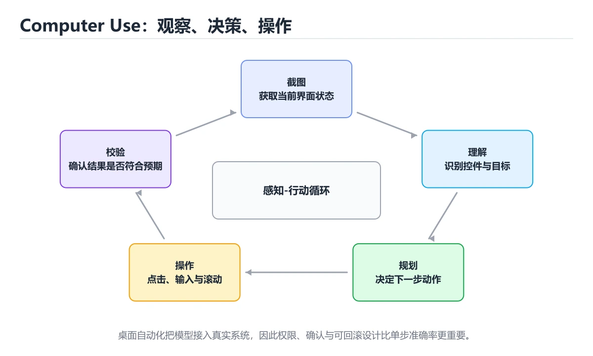
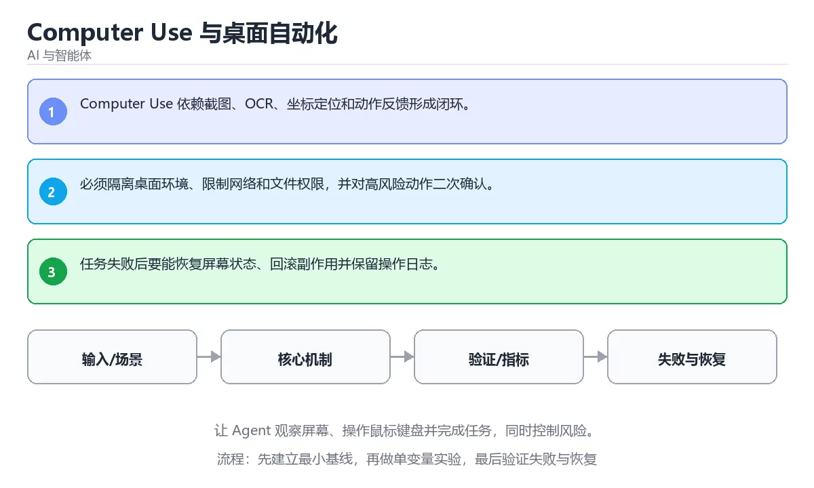

# Computer Use 与桌面自动化

> 内容更新时间：2026-10-06 · 学习阶段：进阶 · 预计用时：40 分钟





## 本节知识框架

**课程定位**：所属分类 `ai`（AI 与智能体），课程主题 `Computer Use 与桌面自动化`，学习阶段 进阶，建议用时 45 分钟。

本课主线：让 Agent 观察屏幕、操作鼠标键盘并完成任务，同时控制风险。

**学完本课应当能够**
- 说清 `Computer Use` 与 `截图` 的含义与区别，并各举一个正例和一个反例。
- 用本课示例验证 `沙箱` 的行为，记录输入、输出与失败条件。
- 遇到「只靠像素坐标点击」这类问题时，能说出触发条件与修复顺序。

### 从概念到验证的学习链条

1. `Computer Use`：先掌握 让模型通过截图和鼠标键盘操作图形界面完成任务，再用它解释 `截图` 为什么会出现。
2. `截图`：先掌握 按“Computer Use 与桌面自动化”中 Computer Use、截图、操作 的实践顺序，把四个步骤排成从准备到复盘的合理顺序，再用它解释 `沙箱` 为什么会出现。
3. `沙箱`：先掌握 隔离代码、网络和文件权限的执行环境，限制不可信操作对宿主系统的影响，再用它解释 `动作闭环` 为什么会出现。
4. `动作闭环`：先掌握 截图、识别、执行、再截图确认的循环，每一步都用新画面验证上一步是否真的生效，再用它解释 本课示例的观察结果 为什么会出现。

**先修与衔接**：本课是「AI 与智能体」分类的第 22 课。先修内容：《工具调用与结构化输出》。《工具调用与结构化输出》里的 `Function Calling`、`JSON Schema` 是本课的前提。相关或后续课程：《浏览器 Agent》。

### 完成判据

- **定义关**：不看正文也能说明 `Computer Use` 是 让模型通过截图和鼠标键盘操作图形界面完成任务，并指出一个反例。
- **机制关**：能按“输入 → 转换 → 输出 → 验证”复述 `Computer Use 与桌面自动化`，而不是只背结论。
- **示例关**：能运行或推演 `Computer Use 与桌面自动化` 的 `text` 示例，并说明一个真实出现的标识符或字面量。
- **证据关**：能指出 `Computer Use 与桌面自动化` 示例里的 调用了 `score()`，并说明它支持或反驳了本课的哪一条结论。
- **排错关**：能复现 只靠像素坐标点击，记录现象并按 以可访问性节点为主、坐标为辅，并在点击后校验结果 修复。
- **迁移关**：能把 `Computer Use`、`截图`、`操作`、`沙箱` 放进一个与 `Computer Use 与桌面自动化` 不同的项目场景，并保持输入与验证条件可追踪。
- **复盘关**：学完 `Computer Use 与桌面自动化` 后，用一句话写下仍然不确定的结论，并列出下一次验证需要的输入、环境和成功判据。

### 复习清单

- [ ] 能不看正文复述本课核心术语，并指出一个边界或反例。
- [ ] 能运行或推演本课示例，记录输入、输出与失败现象。
- [ ] 能完成一次自测，并把错题对照错误表定位原因。

## 核心概念定义

| 术语 | 操作性定义 | 常见边界与风险 |
| --- | --- | --- |
| Computer Use | 让模型通过截图和鼠标键盘操作图形界面完成任务。 | 结果依赖数据分布、模型版本与算力预算，换数据集或换硬件都要重新评估。 |
| 截图 | 按“Computer Use 与桌面自动化”中 Computer Use、截图、操作 的实践顺序，把四个步骤排成从准备到复盘的合理顺序。 | 只在「按“Computer Use 与桌面自动化”中 Computer Use、截图、操作 的实践顺序，把四个步骤排成从准备到复盘的合理顺序」这一前提下成立，换输入或换环境要重新验证。 |
| 沙箱 | 隔离代码、网络和文件权限的执行环境，限制不可信操作对宿主系统的影响。 | 隔离级别与并发事务会影响可见性，换级别或换存储引擎后要重新验证。 |
| 动作闭环 | 截图、识别、执行、再截图确认的循环，每一步都用新画面验证上一步是否真的生效。 | 只在「截图、识别、执行、再截图确认的循环，每一步都用新画面验证上一步是否真的生效」这一前提下成立，换输入或换环境要重新验证。 |

## 原理与运行机制

### 机制总览

**教材衔接：核心知识**

### 1. Computer Use 依赖截图、OCR、坐标定位和动作反馈形成闭环。

- 关键做法：先让 Computer Use 的最小示例可复现，再加入并发或规模条件。
- 验证标准：截图 的异常路径有明确错误信息与恢复动作。

### 2. 必须隔离桌面环境、限制网络和文件权限，并对高风险动作二次确认。

把这条结论放回「Computer Use 与桌面自动化」的完整流程里展开：

- 正文依据：能用自己的话解释：Computer Use 依赖截图、OCR、坐标定位和动作反馈形成闭环。
- 落地检查：把「2. 必须隔离桌面环境、限制网络和文件权限，并对高风险动作二次确认。」改写成一条可执行的核对项，逐条验证输入、超时与失败路径。

### 3. 任务失败后要能恢复屏幕状态、回滚副作用并保留操作日志。

把这条结论放回「Computer Use 与桌面自动化」的完整流程里展开：

- 正文依据：能用自己的话解释：任务失败后要能恢复屏幕状态、回滚副作用并保留操作日志。
- 落地检查：把「3. 任务失败后要能恢复屏幕状态、回滚副作用并保留操作日志。」改写成一条可执行的核对项，逐条验证输入、超时与失败路径。

**教材衔接：关键流程**

**教材衔接：实践路径**

**教材衔接：深入补充：Computer Use 与桌面自动化 的取舍与边界**


### 五、AI 工程补充

**教材衔接：零基础精讲：把Computer Use 与桌面自动化真正讲透**

### 先建立一个直觉

把「Computer Use 与桌面自动化」看成一条可评测的流水线：输入经过 Computer Use 处理，产出候选结果，再由 截图 决定哪些结果可以真正执行；每一环都要有可测的输入、输出与失败处理。

本课的摘要可以当作一张地图：让 Agent 观察屏幕、操作鼠标键盘并完成任务，同时控制风险。

### 逐步拆解

1. 澄清输入与目标。先写清「Computer Use 与桌面自动化」要解决的问题、合法输入范围和成功标准，再进入后续步骤。
2. 描述处理过程。把「Computer Use、截图、操作、沙箱」映射到具体步骤，每步都要求能单独验证。
3. 定义输出。Computer Use 的输出不仅包括正常结果，还包括错误码、日志和资源释放状态。
4. 制造一次截图的失败输入，确认错误出现在「核心知识」的哪一步，并写下恢复后如何验证状态已回到一致。
5. 把「核心知识」里的最小示例抄成 answer 一行的输入，先手算结果再执行，确认两者一致。

### 把正文串成一条执行链

- **1. Computer Use 依赖截图、OCR、坐标定位和动作反馈形成闭环。**：在「Computer Use 与桌面自动化」里，「1. Computer Use 依赖截图、OCR、坐标定位和动作反馈形成闭环。」这一步要先写清输入与预期，再记录实际结果和差异；结果不符时回到对应小节核对前提。
- **2. 必须隔离桌面环境、限制网络和文件权限，并对高风险动作二次确认。**：在「Computer Use 与桌面自动化」里，「2. 必须隔离桌面环境、限制网络和文件权限，并对高风险动作二次确认。」这一步要先写清输入与预期，再记录实际结果和差异；结果不符时回到对应小节核对前提。
- **3. 任务失败后要能恢复屏幕状态、回滚副作用并保留操作日志。**：在「Computer Use 与桌面自动化」里，「3. 任务失败后要能恢复屏幕状态、回滚副作用并保留操作日志。」这一步要先写清输入与预期，再记录实际结果和差异；结果不符时回到对应小节核对前提。
- **考点 1：核心知识 的代码阅读题**：先独立作答，再回到本课正文核对 answer 的执行路径；答错时记录是哪一个前提被忽略。
- **考点 2：按“Computer Use 与桌面自动化”中 Computer Use、截图、操作 的实践顺序，把四个步骤排成从准备到复盘的合理顺序。**：先独立作答，再回到本课对应小节核对判断依据；答错时记录是哪一个前提被忽略。
- **考点 3：关于「任务失败后要能恢复屏幕状态、回滚副作用并保留操作日志。」，下列说法正确的是？**：先独立作答，再回到本课对应小节核对判断依据；答错时记录是哪一个前提被忽略。

### 从测验反推易错点

- 参考判断：Computer Use 依赖截图、OCR、坐标定位和动作反馈形成闭环。
- 自问：如果去掉题干里的一个限定词，结论还成立吗？

- 参考判断：必须隔离桌面环境、限制网络和文件权限，并对高风险动作二次确认。

- 参考判断：任务失败后要能恢复屏幕状态、回滚副作用并保留操作日志。

**检查点 4：本课的核心学习目标是什么？**

- 参考判断：让 Agent 观察屏幕、操作鼠标键盘并完成任务，同时控制风险。

- 参考判断：Computer Use、截图

### 工程排错顺序

| 先查什么 | 要得到的证据 | 判断标准 |
| --- | --- | --- |
| 模型输入是否经过长度、格式与敏感信息检查？ | 日志、输入样例、测试或指标 | 能复现并解释，才算定位 |
| 工具调用是否最小权限、可超时、可取消？ | 日志、输入样例、测试或指标 | 能复现并解释，才算定位 |
| 输出是否有引用、置信度或人工复核兜底？ | 日志、输入样例、测试或指标 | 能复现并解释，才算定位 |
| 成本、延迟与失败率是否有指标？ | 日志、输入样例、测试或指标 | 能复现并解释，才算定位 |

### 变式训练

1. 先用一个单文件示例验证 answer，确认正确性后再引入框架或分布式组件。
2. 扩大 截图 的规模，记录本课结论在哪一个量级开始不成立。
3. 制造一次 Computer Use 相关的依赖超时或错误输入，要求错误可解释且不留半完成状态。
5. 在 核心知识 这一步去掉一个前提，观察 Computer Use 的输出怎样变化，并写出「Computer Use 与桌面自动化」里哪条假设被破坏。
6. 在低带宽或低算力条件下重跑 截图，记录降级路径是否仍然可用。


### 迁移案例库

下面用不同约束重复同一套方法，每轮只改变 Computer Use 的一个取值并记录结论。

#### 迁移案例 1：围绕「Computer Use」做一次小实验

**验收**：结论要能追溯到正文的具体小节与代码位置，并记录截图相关的指标变化。

#### 迁移案例 2：围绕「截图」做一次小实验

**步骤**：
1. 复述当前方案对「截图」的假设，写成一句可证伪的话。

#### 迁移案例 3：围绕「操作」做一次小实验

**步骤**：
1. 复述当前方案对「操作」的假设，写成一句可证伪的话。

#### 迁移案例 4：围绕「沙箱」做一次小实验

**步骤**：
1. 复述当前方案对「沙箱」的假设，写成一句可证伪的话。

#### 迁移案例 5：围绕「Computer Use」做一次小实验

**步骤**：

#### 迁移案例 6：围绕「截图」做一次小实验

**步骤**：

#### 迁移案例 7：围绕「操作」做一次小实验

**步骤**：

#### 迁移案例 8：围绕「沙箱」做一次小实验

**步骤**：

#### 迁移案例 9：围绕「Computer Use」做一次小实验

**步骤**：

#### 迁移案例 10：围绕「截图」做一次小实验

**步骤**：

#### 迁移案例 11：围绕「操作」做一次小实验

**步骤**：

#### 迁移案例 12：围绕「沙箱」做一次小实验

**步骤**：

#### 迁移案例 13：围绕「Computer Use」做一次小实验

**步骤**：

#### 迁移案例 14：围绕「截图」做一次小实验

**步骤**：

#### 迁移案例 15：围绕「操作」做一次小实验

**步骤**：

#### 迁移案例 16：围绕「沙箱」做一次小实验

**步骤**：

<!-- p0-depth-v2:end -->

**教材衔接：验证步骤**

### 机制拆解：每一步的输入、动作与输出

#### 1. `Computer Use`
- 输入：`Computer Use`；本步把 让模型通过截图和鼠标键盘操作图形界面完成任务 当作判断规则。
- 动作：围绕 `Computer Use` 保留中间状态，并记录它与 `截图` 的对应关系。
- 输出：`截图`，它可以被下一段代码、测试或记录继续使用。
- `Computer Use` 的失败条件：结果依赖数据分布、模型版本与算力预算，换数据集或换硬件都要重新评估。

#### 2. `截图`
- 输入：`Computer Use`；本步把 按“Computer Use 与桌面自动化”中 Computer Use、截图、操作 的实践顺序，把四个步骤排成从准备到复盘的合理顺序 当作判断规则。
- 动作：围绕 `截图` 保留中间状态，并记录它与 `沙箱` 的对应关系。
- 输出：`沙箱`，它可以被下一段代码、测试或记录继续使用。
- `截图` 的失败条件：只在「按“Computer Use 与桌面自动化”中 Computer Use、截图、操作 的实践顺序，把四个步骤排成从准备到复盘的合理顺序」这一前提下成立，换输入或换环境要重新验证。

#### 3. `沙箱`
- 输入：`截图`；本步把 隔离代码、网络和文件权限的执行环境，限制不可信操作对宿主系统的影响 当作判断规则。
- 动作：围绕 `沙箱` 保留中间状态，并记录它与 `动作闭环` 的对应关系。
- 输出：`动作闭环`，它可以被下一段代码、测试或记录继续使用。
- `沙箱` 的失败条件：隔离级别与并发事务会影响可见性，换级别或换存储引擎后要重新验证。

#### 4. `动作闭环`
- 输入：`沙箱`；本步把 截图、识别、执行、再截图确认的循环，每一步都用新画面验证上一步是否真的生效 当作判断规则。
- 动作：围绕 `动作闭环` 保留中间状态，并记录它与 `score` 的对应关系。
- 输出：`score`，它可以被下一段代码、测试或记录继续使用。
- `动作闭环` 的失败条件：只在「截图、识别、执行、再截图确认的循环，每一步都用新画面验证上一步是否真的生效」这一前提下成立，换输入或换环境要重新验证。

### 示例中的可观察事实

1. 调用了 `score()`；它对应的课程主题是 `Computer Use 与桌面自动化`。
2. 调用了 `strip()`；它对应的课程主题是 `Computer Use 与桌面自动化`。
3. 调用了 `print()`；它对应的课程主题是 `Computer Use 与桌面自动化`。
4. 出现字面量 `agent`；它对应的课程主题是 `Computer Use 与桌面自动化`。

### 复现实验记录

- 环境：`Computer Use 与桌面自动化` 使用 `text` 示例，固定 `Computer Use`、`截图`、`操作`、`沙箱` 作为第一组条件。
- 首轮输入：先确认 调用了 `score()`，预测 `Computer Use` 会怎样变化。
- 基线观察：记录命令、输入、输出和错误原文，不用截图代替可复制的文本。
- 单变量修改：只改变 `Computer Use`，观察 `动作闭环` 是否仍满足定义。
- 失败注入：复现 只靠像素坐标点击，确认现象是 分辨率、缩放或主题变化后点到错误位置。
- 记录结论：把“修改前、修改后、预期变化、实际变化”写成四列表，这样复盘 `Computer Use 与桌面自动化` 时才能区分概念错误与实现错误。

## 典型应用场景

- **只靠像素坐标点击**：典型现象是分辨率、缩放或主题变化后点到错误位置；正确做法是以可访问性节点为主、坐标为辅，并在点击后校验结果。
- **不做状态确认连续操作**：典型现象是上一步失败会让后续步骤连锁破坏；正确做法是每步执行后校验界面状态，失败就停下并回滚。
- **在真实桌面上直接操作**：典型现象是误删文件或泄露本地数据；正确做法是在隔离虚拟机中运行，限制可访问目录与网络。

### 最小验证场景

- 准备：保留 `text` 示例的原始输入，先记录 `Computer Use 与桌面自动化` 的基线输出和完整运行命令。
- 观察：先核对 调用了 `score()`，再改变一个与 `Computer Use` 相关的条件。
- 判定：新结果与 `Computer Use 与桌面自动化` 的基线不同不等于错误；只有当差异破坏了 `Computer Use` 的定义或错误表中的约束，才判定为失败。

### 选择与边界

- 使用 `Computer Use` 时，先满足它的定义：让模型通过截图和鼠标键盘操作图形界面完成任务；结果依赖数据分布、模型版本与算力预算，换数据集或换硬件都要重新评估。
- 使用 `截图` 时，先满足它的定义：按“Computer Use 与桌面自动化”中 Computer Use、截图、操作 的实践顺序，把四个步骤排成从准备到复盘的合理顺序；只在「按“Computer Use 与桌面自动化”中 Computer Use、截图、操作 的实践顺序，把四个步骤排成从准备到复盘的合理顺序」这一前提下成立，换输入或换环境要重新验证。
- 使用 `沙箱` 时，先满足它的定义：隔离代码、网络和文件权限的执行环境，限制不可信操作对宿主系统的影响；隔离级别与并发事务会影响可见性，换级别或换存储引擎后要重新验证。
- 使用 `动作闭环` 时，先满足它的定义：截图、识别、执行、再截图确认的循环，每一步都用新画面验证上一步是否真的生效；只在「截图、识别、执行、再截图确认的循环，每一步都用新画面验证上一步是否真的生效」这一前提下成立，换输入或换环境要重新验证。

## 代码/协议/SQL 示例

**教材衔接：最小可运行示例**

下面的示例覆盖「Computer Use 与桌面自动化」中 Computer Use 的核心路径。先原样运行，再按注释改一处：

```python
def score(answer: str) -> int:
    return 1 if answer.strip() else 0

print(score("agent"))
```

**教材衔接：预期输出**

```text
1
```

### 示例精读：先找证据，再改一个条件

1. 调用了 `score()`；它出现在 `Computer Use 与桌面自动化` 的示例中，阅读时先确认它前后各发生了什么。
2. 调用了 `strip()`；它出现在 `Computer Use 与桌面自动化` 的示例中，阅读时先确认它前后各发生了什么。
3. 调用了 `print()`；它出现在 `Computer Use 与桌面自动化` 的示例中，阅读时先确认它前后各发生了什么。
4. 出现字面量 `agent`；它出现在 `Computer Use 与桌面自动化` 的示例中，阅读时先确认它前后各发生了什么。
- 在 `Computer Use 与桌面自动化` 中与 `Computer Use` 对照：示例必须能支持 让模型通过截图和鼠标键盘操作图形界面完成任务，否则说明这一段还缺少实现或验证步骤。
- 在 `Computer Use 与桌面自动化` 中与 `截图` 对照：示例必须能支持 按“Computer Use 与桌面自动化”中 Computer Use、截图、操作 的实践顺序，把四个步骤排成从准备到复盘的合理顺序，否则说明这一段还缺少实现或验证步骤。
- 在 `Computer Use 与桌面自动化` 中与 `沙箱` 对照：示例必须能支持 隔离代码、网络和文件权限的执行环境，限制不可信操作对宿主系统的影响，否则说明这一段还缺少实现或验证步骤。
- 在 `Computer Use 与桌面自动化` 中与 `动作闭环` 对照：示例必须能支持 截图、识别、执行、再截图确认的循环，每一步都用新画面验证上一步是否真的生效，否则说明这一段还缺少实现或验证步骤。

## 时间/空间复杂度或性能分析

**性能关注点（Computer Use 与桌面自动化）**：算力与显存决定可行规模：记录训练或推理耗时、显存峰值与模型精度，换数据集要重新评估。

**本课特有开销（Computer Use 与桌面自动化 · Computer Use）**：小文件看元数据开销，大文件看吞吐，两者要分别测量。

**测量方法**：以 `Computer Use 与桌面自动化` 的 `Computer Use` 场景为对象，固定输入跑一遍记录基线，再把规模或并发度提高一个数量级复测；两次结果的差值与波动范围才是结论依据。

### 需要控制的变量与记录项

- `Computer Use 与桌面自动化` 的 `Computer Use`：固定它的版本、输入范围和资源上限，分别记录速度、内存与失败率的变化。
- `Computer Use 与桌面自动化` 的 `截图`：固定它的版本、输入范围和资源上限，分别记录速度、内存与失败率的变化。
- `Computer Use 与桌面自动化` 的 `操作`：固定它的版本、输入范围和资源上限，分别记录速度、内存与失败率的变化。
- `Computer Use 与桌面自动化` 的 `沙箱`：固定它的版本、输入范围和资源上限，分别记录速度、内存与失败率的变化。
- `Computer Use 与桌面自动化` 中 `Computer Use` 的边界：结果依赖数据分布、模型版本与算力预算，换数据集或换硬件都要重新评估。达到边界时不要外推，必须重新测量。
- `Computer Use 与桌面自动化` 中 `截图` 的边界：只在「按“Computer Use 与桌面自动化”中 Computer Use、截图、操作 的实践顺序，把四个步骤排成从准备到复盘的合理顺序」这一前提下成立，换输入或换环境要重新验证。达到边界时不要外推，必须重新测量。
- `Computer Use 与桌面自动化` 中 `沙箱` 的边界：隔离级别与并发事务会影响可见性，换级别或换存储引擎后要重新验证。达到边界时不要外推，必须重新测量。
- `Computer Use 与桌面自动化` 中 `动作闭环` 的边界：只在「截图、识别、执行、再截图确认的循环，每一步都用新画面验证上一步是否真的生效」这一前提下成立，换输入或换环境要重新验证。达到边界时不要外推，必须重新测量。
- `Computer Use 与桌面自动化` 的代码证据：先验证 调用了 `score()`，再记录该路径的输入规模与耗时；只看代码行数不能推出复杂度。

## 常见误区与易错点

| 容易写错的做法 | 实际现象 | 原因与正确做法 |
| --- | --- | --- |
| 只靠像素坐标点击 | 分辨率、缩放或主题变化后点到错误位置。 | 以可访问性节点为主、坐标为辅，并在点击后校验结果。 |
| 不做状态确认连续操作 | 上一步失败会让后续步骤连锁破坏。 | 每步执行后校验界面状态，失败就停下并回滚。 |
| 在真实桌面上直接操作 | 误删文件或泄露本地数据。 | 在隔离虚拟机中运行，限制可访问目录与网络。 |

### 现场 1：只靠像素坐标点击

**症状**：分辨率、缩放或主题变化后点到错误位置。

**根因与修复**：以可访问性节点为主、坐标为辅，并在点击后校验结果。

**自检**：在本课示例里复现「只靠像素坐标点击」，改成以可访问性节点为主、坐标为辅，并在点击后校验结果后重跑；如果症状消失且失败路径按预期变化，说明定位正确。

### 现场 2：不做状态确认连续操作

**症状**：上一步失败会让后续步骤连锁破坏。

**根因与修复**：每步执行后校验界面状态，失败就停下并回滚。

**自检**：在本课示例里复现「不做状态确认连续操作」，改成每步执行后校验界面状态，失败就停下并回滚后重跑；如果症状消失且失败路径按预期变化，说明定位正确。

### 现场 3：在真实桌面上直接操作

**症状**：误删文件或泄露本地数据。

**根因与修复**：在隔离虚拟机中运行，限制可访问目录与网络。

**自检**：在本课示例里复现「在真实桌面上直接操作」，改成在隔离虚拟机中运行，限制可访问目录与网络后重跑；如果症状消失且失败路径按预期变化，说明定位正确。

## 与其他知识点的关系

| 关系 | 课程 | 为什么 |
| --- | --- | --- |
| 先修 | 《工具调用与结构化输出》 | 本课会直接使用它的概念或操作前提。 |
| 关联 | 《浏览器 Agent》 | 用于横向比较或把本课结论迁移到相邻主题。 |
| 前置顺序 | 《工具调用与结构化输出》 | 同分类中安排在本课之前，建议先完成其自测。 |
| 后续顺序 | 《浏览器 Agent》 | 同分类中安排在本课之后，会继续使用本课术语。 |

**教材衔接：复习与迁移**

### 概念复述

- 用一句话说明「Computer Use 与桌面自动化」解决什么问题：让 Agent 观察屏幕、操作鼠标键盘并完成任务，同时控制风险。
- 写出Computer Use、截图、操作之间的关系，并各举一个例子。
- 说出本课最容易混淆的两个概念，以及区分它们的判据。

### 正文逐节复核

- **深入补充：Computer Use 与桌面自动化 的取舍与边界**：学习Computer Use 与桌面自动化时，最容易只记住结论而忽略前提。
- **零基础精讲：把Computer Use 与桌面自动化真正讲透**：本课的摘要可以当作一张地图：让 Agent 观察屏幕、操作鼠标键盘并完成任务，同时控制风险。


### 迁移练习

- **先修**：`工具调用与结构化输出`。本课默认这些内容已经掌握。
- **相关或后续**：`浏览器 Agent`。本课术语会在这些课程里继续使用。
- **术语归属**：`Computer Use`、`截图`、`沙箱` 的定义以本课「核心概念定义」为准，换到其他课程时先确认定义是否被改写。
- 同一分类的《Agent 安全、权限与沙箱》也涉及 `沙箱`；两课衔接时先确认这个术语的定义是否一致。

### 先修与后续术语接口

- `工具调用与结构化输出`：两者通过本分类的学习顺序衔接，阅读时重点比较各自的输入与失败条件。
- `浏览器 Agent`：两者通过本分类的学习顺序衔接，阅读时重点比较各自的输入与失败条件。

### 容易混淆的相邻概念

- `Computer Use` 与 `截图`：前者强调 让模型通过截图和鼠标键盘操作图形界面完成任务；后者强调 按“Computer Use 与桌面自动化”中 Computer Use、截图、操作 的实践顺序，把四个步骤排成从准备到复盘的合理顺序。判断时分别检查两条定义的适用范围，不要只看名称相似就互换。
- `截图` 与 `沙箱`：前者强调 按“Computer Use 与桌面自动化”中 Computer Use、截图、操作 的实践顺序，把四个步骤排成从准备到复盘的合理顺序；后者强调 隔离代码、网络和文件权限的执行环境，限制不可信操作对宿主系统的影响。判断时分别检查两条定义的适用范围，不要只看名称相似就互换。
- `沙箱` 与 `动作闭环`：前者强调 隔离代码、网络和文件权限的执行环境，限制不可信操作对宿主系统的影响；后者强调 截图、识别、执行、再截图确认的循环，每一步都用新画面验证上一步是否真的生效。判断时分别检查两条定义的适用范围，不要只看名称相似就互换。

## 自测题与参考答案

> 先独立作答，再对照参考答案；答案都能在本课正文、术语表或错误表里找到依据。

### 自测 1（概念复述）

不看正文，写出 `Computer Use` 的操作性定义，并说明它与 `截图` 的区别。

**参考答案**：让模型通过截图和鼠标键盘操作图形界面完成任务。

`截图` 的定位是：按“Computer Use 与桌面自动化”中 Computer Use、截图、操作 的实践顺序，把四个步骤排成从准备到复盘的合理顺序；两者的差别要从适用对象与失败模式上说明。

### 自测 2（排错）

本课错误表记录了「只靠像素坐标点击」这类做法。请写出它会出现的现象、根因，以及修复顺序。

**参考答案**：现象是分辨率、缩放或主题变化后点到错误位置；正确做法是以可访问性节点为主、坐标为辅，并在点击后校验结果。修复时先复现现象并保留证据，再改动一处假设重跑，确认现象消失。

### 自测 3（动手验证）

运行本课的 `text` 示例，改动其中一个输入后重新运行，记录输出与错误信息。

**参考答案**：正常输入下 `text` 示例应当复现正文给出的结果；改动输入后，如果结果改变或报错，先核对它是否满足 `Computer Use 与桌面自动化` 中`Computer Use` 的适用范围，再检查错误表里是否有同类现象。

### 自测 4（代码阅读）

阅读本课开头的 `text` 示例，说明它体现了`Computer Use` 的哪一条性质，并指出改动哪个输入会让这条性质不再成立。

**参考答案**：`Computer Use` 的定义是 让模型通过截图和鼠标键盘操作图形界面完成任务，示例正是在实现这条定义。改动与 `Computer Use` 有关的一个输入后，如果结果不再符合 `Computer Use 与桌面自动化` 的正文描述，就说明该性质只在当前前提成立。

### 自测 5（迁移）

把 `Computer Use 与桌面自动化` 的方法迁移到自己的项目：围绕 `Computer Use` 写出一个与错误表同类的风险点，并说明触发条件和检验方式。

**参考答案**：例如「在真实桌面上直接操作」，它会导致误删文件或泄露本地数据；检验方式是按在隔离虚拟机中运行，限制可访问目录与网络改一处再复现，确认现象消失且没有引入新的失败分支。

### 自测 6（对比）

用一个表格对比 `Computer Use` 与 `截图`：各写一行适用场景、一行失败表现。

**参考答案**：`Computer Use` 的定义是让模型通过截图和鼠标键盘操作图形界面完成任务；`截图` 的定义是按“Computer Use 与桌面自动化”中 Computer Use、截图、操作 的实践顺序，把四个步骤排成从准备到复盘的合理顺序。两者的失败表现分别对应本课错误表里与本术语相关的行。

### 自测 7（排错顺序）

面对「只靠像素坐标点击」引发的问题，请把“复现 分辨率、缩放或主题变化后点到错误位置 → 保留证据 → 以可访问性节点为主、坐标为辅，并在点击后校验结果 → 回归验证”四步写成可执行的检查清单。

**参考答案**：第一步按分辨率、缩放或主题变化后点到错误位置复现；第二步记录输入、版本与完整报错；第三步按以可访问性节点为主、坐标为辅，并在点击后校验结果只改一处；第四步重跑并确认失败路径也按预期变化。

### 自测 8（边界判断）

针对 `动作闭环`，分别写出“可以使用”的条件和“结论不再成立”的条件。

**参考答案**：只在「截图、识别、执行、再截图确认的循环，每一步都用新画面验证上一步是否真的生效」这一前提下成立，换输入或换环境要重新验证。 同时要把 `动作闭环` 的定义 截图、识别、执行、再截图确认的循环，每一步都用新画面验证上一步是否真的生效 与实际输入逐项对照。

### 自测 9（机制重建）

不看正文，按输入、转换、输出、验证四段重建 `Computer Use` → `截图` → `沙箱` → `动作闭环` 的作用链。

**参考答案**：起点是 `Computer Use` 的定义 让模型通过截图和鼠标键盘操作图形界面完成任务；中间每一步都保留可观察状态；终点由 `动作闭环` 检查，失败时回到错误表定位第一个偏离定义的步骤。

### 自测 10（综合排错）

在 `Computer Use 与桌面自动化` 中，现象是 误删文件或泄露本地数据。请围绕 在真实桌面上直接操作 写出最小复现、关键证据、修复动作和回归验证，并说明为什么不能只凭一次运行下结论。

**参考答案**：先复现 在真实桌面上直接操作，记录输入与完整错误；再按 在隔离虚拟机中运行，限制可访问目录与网络 只改一处。回归时同时跑正常路径和边界路径，只有两次结果都可解释，才把修复视为完成。

### 自测 11（一分钟复述）

用每分钟约 200 字的速度复述 `Computer Use 与桌面自动化`：先给主问题，再按顺序说出 `Computer Use`、`截图`、`沙箱`、`动作闭环`，最后给一个失败案例。

**自评标准**：主问题必须对应 让 Agent 观察屏幕、操作鼠标键盘并完成任务，同时控制风险；每个术语都要能接上一句定义或边界；失败案例必须写成可观察现象，不能用“可能有风险”代替证据。

## 术语速查

| 术语 | 一句话说明 |
| --- | --- |
| `Computer Use` | 让模型通过截图和鼠标键盘操作图形界面完成任务。 |
| `截图` | 按“Computer Use 与桌面自动化”中 Computer Use、截图、操作 的实践顺序，把四个步骤排成从准备到复盘的合理顺序。 |
| `沙箱` | 隔离代码、网络和文件权限的执行环境，限制不可信操作对宿主系统的影响。 |
| `动作闭环` | 截图、识别、执行、再截图确认的循环，每一步都用新画面验证上一步是否真的生效。 |

**术语关系**：`Computer Use`（让模型通过截图和鼠标键盘操作图形界面完成任务） → `截图`（按“Computer Use 与桌面自动化”中 Computer Use、截图、操作 的实践顺序） → `沙箱`（隔离代码、网络和文件权限的执行环境） → `动作闭环`（截图、识别、执行、再截图确认的循环）。

## 考点精讲

`Computer Use 与桌面自动化` 的题库有 5 道题，下面逐题给出题干、正确项与判断依据：先自己作答，再核对正确项，最后回到正文对应小节复核。

### 考点 1：第 1 题

- **题目**：`Computer Use 与桌面自动化` 的示例代码用于验证 `Computer Use`，其背景是让 Agent 观察屏幕、操作鼠标键盘并完成任务，同时控制风险。代码的真实内容是下面哪一项？
- **正确项**：出现字面量 `agent`
- **判断依据**：这道题落在术语 `Computer Use` 上：让模型通过截图和鼠标键盘操作图形界面完成任务。复习时把 `Computer Use` 的定义、适用边界和一个反例一起说清楚，再回到「核心概念定义」核对原文。

### 考点 2：第 2 题

- **题目**：按“Computer Use 与桌面自动化”中 Computer Use、截图、操作 的实践顺序，把四个步骤排成从准备到复盘的合理顺序。
- **正确项**：先明确 Computer Use 的输入、输出与约束 → 写出最小示例并核对 截图 的基线结果 → 只改一个变量，记录边界与失败路径的变化 → 固定版本与证据，把“Computer Use 与桌面自动化”的结论写成可复现记录
- **判断依据**：这道题落在术语 `Computer Use` 上：让模型通过截图和鼠标键盘操作图形界面完成任务。复习时把 `Computer Use` 的定义、适用边界和一个反例一起说清楚，再回到「核心概念定义」核对原文。

### 考点 3：第 3 题

- **题目**：在 `Computer Use 与桌面自动化` 里，与 `Computer Use` 有关的说法中，哪一项最符合让 Agent 观察屏幕、操作鼠标键盘并完成任务，同时控制风险。？
- **正确项**：任务失败后要能恢复屏幕状态、回滚副作用并保留操作日志。
- **判断依据**：这道题落在术语 `Computer Use` 上：让模型通过截图和鼠标键盘操作图形界面完成任务。复习时把 `Computer Use` 的定义、适用边界和一个反例一起说清楚，再回到「核心概念定义」核对原文。

### 考点 4：第 4 题

- **题目**：`Computer Use 与桌面自动化` 的主线是：让 Agent 观察屏幕、操作鼠标键盘并完成任务，同时控制风险。下面哪一项与这条主线一致？
- **正确项**：让 Agent 观察屏幕、操作鼠标键盘并完成任务，同时控制风险。
- **判断依据**：这道题落在术语 `Computer Use` 上：让模型通过截图和鼠标键盘操作图形界面完成任务。复习时把 `Computer Use` 的定义、适用边界和一个反例一起说清楚，再回到「核心概念定义」核对原文。

### 考点 5：第 5 题

- **题目**：课程 `让 Agent 观察屏幕、操作鼠标键盘并完成任务，同时控制风险。`。在 `Computer Use 与桌面自动化` 里，`Computer Use`、`截图` 与下面哪些选项属于同一层概念？（多选）
- **正确项**：Computer Use；截图
- **判断依据**：这道题落在术语 `Computer Use` 上：让模型通过截图和鼠标键盘操作图形界面完成任务。复习时把 `Computer Use` 的定义、适用边界和一个反例一起说清楚，再回到「核心概念定义」核对原文。

### 考点 6：`Computer Use`

- **要点**：让模型通过截图和鼠标键盘操作图形界面完成任务。
- **Computer Use 的边界**：结果依赖数据分布、模型版本与算力预算，换数据集或换硬件都要重新评估。

### 考点 7：`截图`

- **要点**：按“Computer Use 与桌面自动化”中 Computer Use、截图、操作 的实践顺序，把四个步骤排成从准备到复盘的合理顺序。
- **截图 的边界**：只在「按“Computer Use 与桌面自动化”中 Computer Use、截图、操作 的实践顺序，把四个步骤排成从准备到复盘的合理顺序」这一前提下成立，换输入或换环境要重新验证。

### 考点 8：`沙箱`

- **要点**：隔离代码、网络和文件权限的执行环境，限制不可信操作对宿主系统的影响。
- **沙箱 的边界**：隔离级别与并发事务会影响可见性，换级别或换存储引擎后要重新验证。

### 考点 9：`动作闭环`

- **要点**：截图、识别、执行、再截图确认的循环，每一步都用新画面验证上一步是否真的生效。
- **动作闭环 的边界**：只在「截图、识别、执行、再截图确认的循环，每一步都用新画面验证上一步是否真的生效」这一前提下成立，换输入或换环境要重新验证。

### 考点 10：排错——只靠像素坐标点击

- **现象**：分辨率、缩放或主题变化后点到错误位置。
- **处理**：以可访问性节点为主、坐标为辅，并在点击后校验结果。

### 考点 11：排错——不做状态确认连续操作

- **现象**：上一步失败会让后续步骤连锁破坏。
- **处理**：每步执行后校验界面状态，失败就停下并回滚。

### 考点 12：综合辨析——`Computer Use` 与 `动作闭环`

- **辨析点**：`Computer Use` 的定义是 让模型通过截图和鼠标键盘操作图形界面完成任务；`动作闭环` 的定义是 截图、识别、执行、再截图确认的循环，每一步都用新画面验证上一步是否真的生效。
- **答题要求**：面对 `Computer Use 与桌面自动化` 的题目，先判断描述的是 `Computer Use` 还是 `动作闭环`，再归到对应定义，最后写出一个会让该定义失效的边界输入。

### 考点 13：排错评分点

- **现象分**：能写出 分辨率、缩放或主题变化后点到错误位置，而不是只写“程序有错”。
- **证据分**：保留触发 只靠像素坐标点击 的输入、版本和错误原文。
- **修复分**：按 以可访问性节点为主、坐标为辅，并在点击后校验结果 只改一处，并同时回归正常路径与边界路径。

## 内容元数据

- 内容版本：v2.0
- 最后更新：2026-10-06
- 学习阶段：进阶
- 适用环境：主流大模型 API、开源模型与向量数据库；本课聚焦 Computer Use。
- 内容来源：内置结构化课程与工程实践整理
- 相关主题：Computer Use、截图、操作、沙箱
- 质量版本：P0 测验标准 + P1 覆盖扩展 + P2 体验补全

## 参考资料与复核

- 最后复核：2026-10-04
- 下次复核：2026-12-24
- 复核范围：版本兼容、API 行为、安全建议与工程实践
- 来源性质：官方文档、标准或权威教材；本课核对关键词：Computer Use、截图、操作、沙箱。

| 参考资料 | 本课用途 |
| --- | --- |
| [Anthropic 文档](https://docs.anthropic.com/) | Claude API 与 Agent 安全 |
| [Model Context Protocol](https://modelcontextprotocol.io/) | Agent 工具与上下文协议 |
| [Ollama 文档](https://ollama.com/) | 本地模型运行与部署 |

| [本课术语索引：Computer Use 与桌面自动化](#核心概念定义) | 按本课输入、术语边界和错误表现逐项核对 |
> 「Computer Use 与桌面自动化」的链接用于离线阅读后的延伸核对；App 不会自动联网。