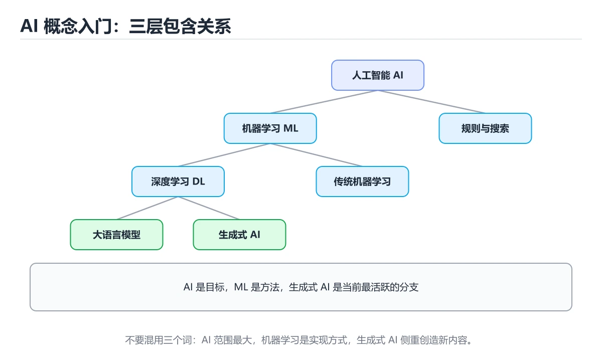
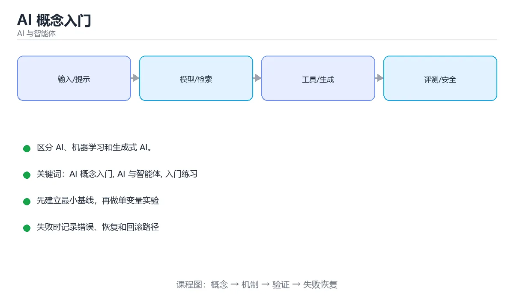

# AI 概念入门

> 内容更新时间：2026-10-06 · 学习阶段：基础 · 预计用时：35 分钟





## 学习目标

- 先认识AI 概念入门需要的工具、输入和输出。
- 按步骤运行最小示例，并记录结果与错误。
- 用一个边界输入验证自己是否真正掌握。

## 前置知识

- 会进行基本的文件或命令行操作。
- 不需要预先掌握「AI 与智能体」的高级知识。

## 一句话入门

区分 AI、机器学习和生成式 AI。

## 最小示例

```python
def classify(task):
    return "生成式 AI" if "创作" in task else "传统 AI"

print(classify("请帮我创作一首诗"))
print(classify("识别这张图片里的猫"))
```

## 预期输出

```text
生成式 AI
传统 AI
```

## 常见错误与排查

> 说明：本表由《AI 概念入门》的核心知识整理（2026-10-07），人工复核进度见 docs/content_review_batches.md。

| 易错点 | 容易踩的做法 | 正确结论 |
| --- | --- | --- |
| 把模型输出当事实 | 不做检索与核对就直接采用 | 把输出当草稿，用来源、测试或人工复核验证 |
| 混淆提示、检索与微调 | 以为不改权重模型就能稳定记住新知识 | 按知识时效与稳定性选择提示、检索或微调 |
| 只用单一指标评价系统 | 只看准确率，忽略延迟、成本与安全 | 同时记录质量、延迟、成本与安全四类指标 |

## 动手练习

1. 原样运行最小示例，保存命令和输出。
2. 把数字 2 改成 10，预测并验证新结果。
3. 制造一个错误输入，写出错误信息和修复方法。

## 本课小结

- 入门阶段先保证能运行、能观察、能解释，再追求复杂功能。
- 每次只改一个变量，记录预测与实际结果。
- 遇到错误先看第一条错误信息，再回到最小示例。

## AI、机器学习、深度学习与生成式 AI 的关系

人工智能是最大的概念，目标是让机器完成通常需要人类智能的任务；机器学习是实现 AI 的一类方法，通过数据学习规律而不是手写全部规则；深度学习是机器学习的子集，使用多层神经网络自动学习特征；生成式 AI 则强调输出新内容，例如文本、图像、音频和代码。它们不是四个并列的盒子，而是层层包含、彼此交叉的关系。一个系统可能使用深度学习模型，但不是生成式；也可能使用生成式模型，却不算完整的智能体。

传统机器学习常见三类任务：监督学习根据带标签样本预测结果，无监督学习发现数据中的结构，强化学习通过与环境交互和奖励信号学习策略。判别式模型学习“输入属于哪一类”，生成式模型学习“数据如何产生”。评估指标也随任务变化：分类看准确率、精确率、召回率和 F1，排序看命中率和 NDCG，生成任务还要看事实性、连贯性、格式合规和人工偏好。

数据和评估是 AI 系统里最容易被低估的部分。训练集、验证集和测试集必须按时间或实体正确划分，否则会发生数据泄露，让离线指标虚高。真实系统还要关注分布漂移、长尾输入、偏差、可解释性、成本和隐私。一个模型在演示样本上表现好，不代表它在真实用户输入上可靠。

## 智能体时代的系统边界

大语言模型可以作为智能体的推理核心，但智能体不等于模型。一个可用的智能体通常还包含工具调用、记忆、规划、执行循环、权限控制和评估机制。模型负责理解和生成，工具负责访问外部世界，记忆保存跨步骤状态，规划把目标拆成动作，护栏限制高风险操作，日志和指标让失败可追踪。缺少任何一环，系统都可能表现为“会说但做不成”或“能执行但不可控”。

设计 AI 功能时，先明确任务是否真的需要模型：规则可以稳定解决的问题不要交给概率模型；需要自然语言理解、内容生成或模糊判断时再引入模型。然后定义输入输出边界、失败时的降级策略和人工接管方式。对于高影响场景，必须保留证据链和可回滚操作，不能让模型直接执行不可逆动作。

可以用一个分类任务走完整个流程：收集样本、划分数据集、选择基线、训练或调用模型、计算指标、分析错误、部署监控。再把这个任务改造成生成任务，比较两类系统的输入输出、评估方式和失败模式。这样你掌握的是 AI 系统的结构，而不是一堆孤立名词。

## 代码实验：把示例跑成证据

### 实验一：建立基线

```python
def classify(task):
    return "生成式 AI" if "创作" in task else "传统 AI"

print(classify("请帮我创作一首诗"))
print(classify("识别这张图片里的猫"))
```

### 实验二：只改一个输入

沿用「AI 概念入门」的最小示例做一次单变量实验：

| 实验 | 改动 | 预测 | 实际 | 结论 |
| --- | --- | --- | --- | --- |
| 基线 | 保持「AI 概念入门」示例原样 |  |  |  |
| 边界 | 把AI 概念入门换成空值或极值 |  |  |  |
| 失败 | 给AI 与智能体传入非法输入 |  |  |  |

做完后用一句话写出「AI 概念入门」的结论：输入怎么变，结果才怎么变。

### 实验三：制造一个可控错误

把 classify 的一个参数换成不兼容的类型，先预测报错位置再实际运行；预测与实际的差异就是本课的考点。

| 实验 | 改动 | 预测 | 实际 | 结论 |
| --- | --- | --- | --- | --- |
| 基线 | 保持原样 |  |  |  |
| 边界 |  |  |  |  |
| 失败 |  |  |  |  |

### 实验四：用三句话复述

1. AI 概念入门 的输入是什么，哪些取值合法，哪些属于边界或非法范围？
2. AI 概念入门 按什么顺序处理输入，在哪一步产生了状态变化或副作用？
3. 输出如何验证，失败时第一条可观察证据是什么？

## 深入理解：AI 概念入门

### 概念之间的包含关系

人工智能是让机器表现出智能行为的总称；机器学习是其中通过数据学习规律的分支；
深度学习是使用多层神经网络的方法；生成式 AI 关注生成文本、图像、代码等内容，
通常建立在深度学习之上。它们是包含关系而不是同义词，规则引擎可以算作 AI，
但不属于机器学习。

### 三类学习范式

监督学习使用带标签数据学习输入到输出的映射，典型任务是分类与回归；无监督学习
在没有标签的情况下发现结构，例如聚类与降维；强化学习通过与环境交互、根据奖励
调整策略，适合序列决策。自监督学习从数据本身构造标签，是大规模预训练语言模型
的主要方式。选择范式取决于任务有没有标签、能不能试错。

### 训练、推理与泛化

训练阶段用数据调整参数，计算量大、可离线完成；推理阶段固定参数处理新输入，
更关心延迟与成本。模型在训练集上表现好不等于在真实场景可用，衡量指标是
在未见数据上的泛化能力。数据泄漏、分布漂移与过拟合是常见原因，必须用
独立验证集评估，并把线上反馈纳入迭代。


「AI 概念入门」的「三类学习范式」一节补全如下：

- 定位：这一节说明三类学习范式在「AI 概念入门」知识体系里的位置。
- 检查点：固定版本与输入重跑《AI 概念入门》，记录两次差异并定位不稳定条件。
- 自检：能否用一个最小例子解释三类学习范式？


<!-- p0-depth-v2:start -->

## 可运行练习

### 任务 1：先跑通，再解释

```python
def classify(task):
    return "生成式 AI" if "创作" in task else "传统 AI"

print(classify("请帮我创作一首诗"))
print(classify("识别这张图片里的猫"))
```

### 任务 2：只改一个条件

把「AI 概念入门」的最小示例复制一份，只改一个条件再跑一次：

- 改动点：把 AI 与智能体 换成边界值，其他输入保持原样。
- 预测：先写下「AI 概念入门」在改动后的输出或错误信息，再运行。
- 记录：对照改动前后的结果，指出差异出在哪一步。
- 验收：换回原条件能复现原结果，改动只影响AI 概念入门。

### 任务 3：迁移到自己的数据

把 classify 换成你自己的输入，先保持步骤不变，再比较输出差异。

## 故障现场

### 现场 1：把模型输出当事实

**症状**：在《AI 概念入门》的复现场景中，不做检索与核对就直接采用。

**根因**：“不做检索与核对就直接采用”只是表层结果。向上追溯会落到“把模型输出当事实”这一步，因为它省略了《AI 概念入门》的约束，使实现行为和预期模型发生了偏离。

**修复**：针对《AI 概念入门》的问题，把输出当草稿，用来源、测试或人工复核验证。

**验证**：在《AI 概念入门》中按“把输出当草稿，用来源、测试或人工复核验证”调整后，从“把模型输出当事实”的触发条件重放同一条路径，确认“不做检索与核对就直接采用”不再出现，并补一个相邻边界用例检查没有引入新问题。

### 现场 2：混淆提示、检索与微调

**症状**：在《AI 概念入门》的复现场景中，以为不改权重模型就能稳定记住新知识。

**根因**：当出现“混淆提示、检索与微调”时，执行路径已经绕过了《AI 概念入门》的关键约束，最终以“以为不改权重模型就能稳定记住新知识”暴露出来；修复前必须先确认约束在哪里失效。

**修复**：针对《AI 概念入门》的问题，按知识时效与稳定性选择提示、检索或微调。

**验证**：在《AI 概念入门》中按“按知识时效与稳定性选择提示、检索或微调”调整后，从“混淆提示、检索与微调”的触发条件重放同一条路径，确认“以为不改权重模型就能稳定记住新知识”不再出现，并补一个相邻边界用例检查没有引入新问题。

### 现场 3：只用单一指标评价系统

**症状**：在《AI 概念入门》的复现场景中，只看准确率，忽略延迟、成本与安全。

**根因**：当出现“只用单一指标评价系统”时，执行路径已经绕过了《AI 概念入门》的关键约束，最终以“只看准确率，忽略延迟、成本与安全”暴露出来；修复前必须先确认约束在哪里失效。

**修复**：针对《AI 概念入门》的问题，同时记录质量、延迟、成本与安全四类指标。

**验证**：保留《AI 概念入门》里触发“只看准确率，忽略延迟、成本与安全”的输入、版本和日志，按“同时记录质量、延迟、成本与安全四类指标”完成修改后原样重放；只有失败现象消失且相邻场景仍可解释，才保留改动。

## 深入补充：AI 概念入门 的取舍与边界

### 一、把概念放回真实约束

学习AI 概念入门时，最容易只记住结论而忽略前提。先写出三个约束：数据规模、时间预算、可接受的失败方式；再判断 AI 概念入门 与 AI 与智能体 在这些约束下是否仍然成立。只要约束改变，原来的最优解就可能变成错误解。

| 维度 | 要回答的问题 | 常见做法 | 失败信号 |
| --- | --- | --- | --- |
| 数据 | AI 概念入门 的训练或检索数据从哪来、质量如何 | 清洗、去重、标注与版本化 | 评测集泄漏或分布漂移 |
| 模型 | AI 与智能体 的能力边界与成本是多少 | 基线对比、离线评测、灰度发布 | 指标好看但线上任务失败 |
| 评测 | 如何证明改动真的有效 | 固定评测集、人工抽检、A/B | 只比较单例输出 |
| 安全 | 失败时会不会泄露或越权 | 权限校验、内容过滤、审计 | 提示注入或数据外泄 |

### 二、三个容易混淆的边界

1. 澄清输入与目标。先写清「AI 概念入门」要解决的问题、合法输入范围和成功标准，再进入后续步骤。
2. **把“平均值”当成“全部”**：AI 概念入门 的指标好看，不代表尾部请求、冷启动或失败重试也好看。
3. **把“当前版本”当成“永久行为”**：AI 与智能体 依赖的默认值、API 或性能特征都可能随版本变化，需要固定版本并保留回归用例。

### 三、一个生产场景

假设团队要在真实系统里使用AI 概念入门：第一周先做小流量验证，记录 AI 概念入门 的基线与异常；第二周扩大输入规模，观察 AI 与智能体 是否成为瓶颈；第三周再做故障演练，主动注入超时、重复请求和依赖不可用，确认系统能降级、能重试、能恢复。每一步都要留下指标、日志和结论，而不是只留下“感觉更快了”。

### 四、自测清单

- 能否用一句话说出AI 概念入门解决的核心问题与不适用场景？
- 能否画出 AI 概念入门 的数据流或状态变化，并标出失败路径？
- 构造一个 AI 与智能体 的反例，证明「总是成立」的说法不成立。
- 能否写出一条可复现的验证命令，让别人独立得到相同结论？

### 五、AI 工程补充

在AI 概念入门里，模型输出只是系统的一部分：输入要先经过权限与数据质量检查，检索或工具调用要有超时和降级，输出要经过引用核验或规则校验，最后记录 token、延迟、失败类型和人工反馈。评测时至少准备固定题、边界题和对抗题，并把 AI 概念入门 与 AI 与智能体 的指标分开记录；否则一次提示词改动看似提升体验，实际可能只是评测样本泄漏或随机波动。

## 本课复习清单

离开本课前，逐项确认：

- [ ] 不看解析，能说出「AI、机器学习与生成式 AI 三者的关系是？」的判断依据。
- [ ] 不看解析，能说出「判别式模型与生成式模型的核心差异是？」的判断依据。
- [ ] 不看解析，能说出「示例中两次调用 classify 的输出分别是什么？」的判断依据。
- [ ] 不看解析，能说出「训练与推理在机器学习流程中分别指什么？」的判断依据。
- [ ] 跑通「AI 概念入门」的最小示例，并记录一次失败输入的处理方式。
- [ ] 把本课最容易混淆的两个概念写成一句话对照。

| 复盘项 | 记录 |
| --- | --- |
| 已经能独立解释的考点 |  |
| 仍然说不清的概念 |  |
| 下一步验证动作 |  |

## 复习与自测

对照 AI、机器学习、深度学习与生成式 AI 的关系 复述本课结论，答不上来的部分回到 classify 的示例重跑一次。

### 最小示例

```python
def classify(task):
    return "生成式 AI" if "创作" in task else "传统 AI"

print(classify("请帮我创作一首诗"))
print(classify("识别这张图片里的猫"))
```

自检：这一节与相邻主题的边界在哪里？

### 预期输出

```text
生成式 AI
传统 AI
```

### 常见错误

自检：把这一节讲给没学过的人，最需要强调哪一点？

### 动手练习

自检：如果去掉这一节里的一个前提，结论会怎样变化？

### AI、机器学习、深度学习与生成式 AI 的关系

人工智能是最大的概念，目标是让机器完成通常需要人类智能的任务；机器学习是实现 AI 的一类方法，通过数据学习规律而不是手写全部规则；深度学习是机器学习的子集，使用多层神经网络自动学习特征；生成式 AI 则强调输出新内容，例如文本、图像、音频和代码。它们不是四个并列的盒子，而是层层包含、彼此交叉的关系。

### 智能体时代的系统边界

大语言模型可以作为智能体的推理核心，但智能体不等于模型。一个可用的智能体通常还包含工具调用、记忆、规划、执行循环、权限控制和评估机制。

### 深入理解：AI 概念入门

人工智能是让机器表现出智能行为的总称；机器学习是其中通过数据学习规律的分支；。深度学习是使用多层神经网络的方法；生成式 AI 关注生成文本、图像、代码等内容，。

## 术语速查

| 术语 | 一句话说明 |
| --- | --- |
| `模型与参数` | 模型是带大量可调参数的函数，训练就是调整这些参数。 |
| `训练与推理` | 训练用数据调整参数，推理用固定参数对新输入给出结果。 |
| `特征与标签` | 特征描述样本，标签是希望模型预测的答案。 |
| `大语言模型` | 在海量文本上训练、按上下文逐词预测的语言模型。 |
| `提示词` | 交给模型的输入文本，决定任务描述与输出格式。 |

## 零基础精讲：把AI 概念入门真正讲透

### 先建立一个直觉

把「AI 概念入门」看成一条可评测的流水线：输入经过 AI 概念入门 处理，产出候选结果，再由 AI 与智能体 决定哪些结果可以真正执行；每一环都要有可测的输入、输出与失败处理。

本课的摘要可以当作一张地图：区分 AI、机器学习和生成式 AI。

### 逐步拆解

1. 澄清输入与目标。先写清「AI 概念入门」要解决的问题、合法输入范围和成功标准，再进入后续步骤。
2. 描述处理过程。把「AI 概念入门、AI 与智能体、入门练习」映射到具体步骤，每步都要求能单独验证。
3. 定义输出。把 classify 的返回值、日志和失败信号都写清楚，缺一项都不算完整。
4. 构造一次AI 概念入门越界，记录系统是拒绝、降级还是静默出错；三者对应的修复策略完全不同。
5. 把「AI、机器学习、深度学习与生成式 AI 的关系」里的最小示例抄成 classify 一行的输入，先手算结果再执行，确认两者一致。

### 把正文串成一条执行链

- **实验一：建立基线**：先原样运行 classify 所在的示例，记录版本、命令、完整输出与退出状态。
- **实验三：制造一个可控错误**：在「AI 概念入门」里，「实验三：制造一个可控错误」这一步要先写清输入与预期，再记录实际结果和差异；结果不符时回到对应小节核对前提。
- **概念之间的包含关系**：人工智能是让机器表现出智能行为的总称；机器学习是其中通过数据学习规律的分支；
- **三类学习范式**：监督学习使用带标签数据学习输入到输出的映射，典型任务是分类与回归；无监督学习

### 从测验反推易错点

**检查点 1：AI、机器学习与生成式 AI 三者的关系是？**

- 参考判断：机器学习是 AI 的一个分支
- 自问：如果去掉题干里的一个限定词，结论还成立吗？

**检查点 2：判别式模型与生成式模型的核心差异是？**

- 参考判断：前者侧重判断类别或数值，后者侧重生成新的内容

**检查点 3：示例中两次调用 classify 的输出分别是什么？**

- 参考判断：先生成式 AI，再传统 AI，按任务关键词分类

**检查点 4：训练与推理在机器学习流程中分别指什么？**

- 参考判断：训练用数据调整模型参数，推理用训练好的模型处理新输入

- 参考判断：classify

### 工程排错顺序

| 先查什么 | 要得到的证据 | 判断标准 |
| --- | --- | --- |
| 模型输入是否经过长度、格式与敏感信息检查？ | 日志、输入样例、测试或指标 | 能复现并解释，才算定位 |
| 工具调用是否最小权限、可超时、可取消？ | 日志、输入样例、测试或指标 | 能复现并解释，才算定位 |
| 输出是否有引用、置信度或人工复核兜底？ | 日志、输入样例、测试或指标 | 能复现并解释，才算定位 |
| 成本、延迟与失败率是否有指标？ | 日志、输入样例、测试或指标 | 能复现并解释，才算定位 |

### 变式训练

1. 先用一个单文件示例验证 classify，确认正确性后再引入框架或分布式组件。
2. 把 AI 概念入门 的输入规模扩大十倍，记录时间、内存和失败路径，找出第一个瓶颈。
3. 把 AI 与智能体 换成失败输入，记录错误信息与恢复动作。
5. 故意跳过 AI 与智能体 的检查再运行，比较与正常流程的差异，并说明这个检查挡住的到底是哪一类失败。
6. 在低带宽或低算力条件下重跑 AI 与智能体，记录降级路径是否仍然可用。

### 本课自测

- [ ] 能用一句话解释AI 概念入门在本课中的角色与边界。
- [ ] 能举出一个正常例子和一个失败例子。
- [ ] 能说出最小验证步骤，以及需要记录的证据。
- [ ] 能用一句话解释「AI 与智能体」在本课中的角色与边界。
- [ ] 能说出 AI 与智能体 与相邻概念的边界。

### 迁移案例库

换一个 AI 与智能体 约束重做一次，确认结论在新条件下是否仍然成立。

#### 迁移案例 1：围绕AI 概念入门做一次小实验

**目标**：在不改变课程主体的前提下，验证AI 概念入门中的一个关键判断。

**步骤**：
1. 复述当前方案对本课的假设，写成一句可证伪的话。
2. 设计一个正常输入和一个边界输入，分别预测输出。
3. 运行或逐步演算，记录实际输出、耗时和失败信息。
4. 只调整一个参数，比较前后差异并解释原因。
5. 补充一条测试或复习卡，确保下次能更快复现。

**验收**：迁移过程要留下 classify 的可运行记录，并说明AI 与智能体在新场景下是否仍然成立。

#### 迁移案例 2：围绕「AI 与智能体」做一次小实验

**步骤**：
1. 复述当前方案对「AI 与智能体」的假设，写成一句可证伪的话。

#### 迁移案例 3：围绕「入门练习」做一次小实验

**步骤**：
1. 把 classify 依赖的前提写成一句可以被反例推翻的陈述。

#### 迁移案例 4：围绕AI 概念入门做一次小实验

**步骤**：

#### 迁移案例 5：围绕「AI 与智能体」做一次小实验

**步骤**：

#### 迁移案例 6：围绕「入门练习」做一次小实验

**步骤**：

#### 迁移案例 7：围绕AI 概念入门做一次小实验

**步骤**：

#### 迁移案例 8：围绕「AI 与智能体」做一次小实验

**步骤**：

#### 迁移案例 9：围绕「入门练习」做一次小实验

**步骤**：

#### 迁移案例 10：围绕AI 概念入门做一次小实验

**步骤**：

#### 迁移案例 11：围绕「AI 与智能体」做一次小实验

**步骤**：

#### 迁移案例 12：围绕「入门练习」做一次小实验

**步骤**：

#### 迁移案例 13：围绕AI 概念入门做一次小实验

**步骤**：

#### 迁移案例 14：围绕「AI 与智能体」做一次小实验

**步骤**：

#### 迁移案例 15：围绕「入门练习」做一次小实验

**步骤**：

#### 迁移案例 16：围绕AI 概念入门做一次小实验

**步骤**：

<!-- p0-depth-v2:end -->

## 考点精讲

### 考点 1：概念判断·AI 概念入门

- **题目**：AI、机器学习与生成式 AI 三者的关系是？
- **判断依据**：在「AI 概念入门」里，机器学习是 AI 的一个分支。AI 是让机器表现出智能行为的总称，机器学习通过数据学习规律，是 AI 的重要分支。这道题的关键在「AI 概念入门」的AI 概念入门、AI 与智能体、入门练习：先确认题干“AI、机器学习与生成式 AI 三者的”问的是哪一步，再排除偷换前提的选项。

### 考点 2：概念判断·AI 概念入门

- **题目**：判别式模型与生成式模型的核心差异是？
- **判断依据**：在「AI 概念入门」里，前者侧重判断类别或数值，后者侧重生成新的内容。判别式模型学习输入到标签的映射，常用于分类、回归与排序。「AI 概念入门」要求先交代AI 概念入门、AI 与智能体、入门练习的前提再下结论，所以“前者侧重判断类别或数值”只在题干“判别式模型与生成式模型的核心差异是”给定的条件下成立。

### 考点 3：概念判断·AI 概念入门

- **题目**：示例中两次调用 classify 的输出分别是什么？
- **判断依据**：在「AI 概念入门」里，先生成式 AI，再传统 AI，按任务关键词分类。第一次调用的任务里包含「创作」，函数返回「生成式 AI」。在「AI 概念入门」里判断这道题，要把AI 概念入门、AI 与智能体、入门练习的条件、过程与失败路径逐项对齐，换成“示例中两次调用 classify 的”这个场景，只有满足前提的结论才成立。

### 考点 4：多选辨析·AI 概念入门

- **题目**：围绕“AI 概念入门”中的 AI 概念入门、AI 与智能体、入门练习，下列哪两项是本课强调的实践判断？
- **判断依据**：题干的正确项是学习 AI 概念入门 时要同时说明输入、输出和失败路径，不能只看正常流程。结论应落在学习 AI 概念入门 时要同时说明输入、输出和失败路径。在AI 概念入门里，判断 AI 与智能体 时要固定版本与边界输入，所以“验证 AI 与智能体 时要固定版本并覆盖边界输入，结论才可复现”才可复现。

### 考点 5：填空·def ____(task)

- **题目**：补全代码：「AI 概念入门」示例中，下面这行代码缺少哪个关键字或函数名？请填入 ____。 `def ____(task):`
- **判断依据**：把“classify”代回「AI 概念入门」里“AI 概念入门示例中”的例子核对，条件一旦改变，结论就要用AI 概念入门、AI 与智能体、入门练习重新推导。回到AI 概念入门、AI 与智能体、入门练习本身再看一遍：只有“classify”与题干“概念入门示例中”的前提一致，结论才成立。

### 考点 6：排错·AI 概念入门

- **题目**：阅读「AI 概念入门」的代码片段，下面哪项判断是正确的？
- **判断依据**：在「AI 概念入门」里，题干的正确项是机器学习是 AI 的一个分支。回到「AI 概念入门」的正文示例，用“阅读AI 概念入门的代码片段”走一遍AI 概念入门、AI 与智能体、入门练习的完整流程，能复现的结论才可以保留。判断这道题时，要把AI 概念入门、AI 与智能体、入门练习的条件、过程与失败路径逐项对齐，换成“阅读AI”这个场景，只有满足前提的结论才成立。

## English Overview

**Title:** AI Concepts Basics

**Summary:** Distinguish AI, ML and generative AI.

**Category:** AI & Agents
**Level:** 基础
**Key terms:** AI 概念入门, AI 与智能体, 入门练习

## 内容元数据

- 内容版本：v2.0
- 最后更新：2026-10-06
- 学习阶段：基础
- 适用环境：主流大模型 API、开源模型与向量数据库；本课聚焦 AI 概念入门。
- 内容来源：内置结构化课程与工程实践整理
- 相关主题：AI 概念入门、AI 与智能体、入门练习
- 质量版本：P0 测验标准 + P1 覆盖扩展 + P2 体验补全

## 参考资料与复核

- 最后复核：2026-10-04
- 下次复核：2026-12-17
- 复核范围：版本兼容、API 行为、安全建议与工程实践
- 来源性质：官方文档、标准或权威教材；正文为离线教学重组

| 参考资料 | 本课用途 |
| --- | --- |
| [scikit-learn 文档](https://scikit-learn.org/stable/documentation.html) | 经典机器学习算法 |
| [Model Context Protocol](https://modelcontextprotocol.io/) | Agent 工具与上下文协议 |
| [Ollama 文档](https://ollama.com/) | 本地模型运行与部署 |

> 「AI 概念入门」的链接用于离线阅读后的延伸核对；App 不会自动联网。
