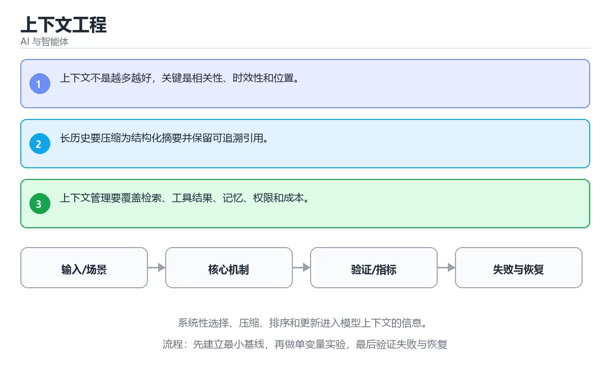

# 上下文工程



> 内容更新时间：2026-10-03 · 学习阶段：高级 · 预计用时：22 分钟

## 学习目标

- 能用自己的话解释：上下文不是越多越好，关键是相关性、时效性和位置。
- 能用自己的话解释：长历史要压缩为结构化摘要并保留可追溯引用。
- 能用自己的话解释：上下文管理要覆盖检索、工具结果、记忆、权限和成本。
- 能把本课知识放回「AI 与智能体」，并完成练习与测验。

## 前置知识

- 已完成「AI 与智能体」的基础课程，能运行正文中的最小示例。
- 本课关键词：上下文工程、摘要、检索、窗口。
- 遇到不熟悉的术语先记录问题，完成练习后再回读。

## 核心知识

### 1. 上下文不是越多越好，关键是相关性、时效性和位置。

- 它解决的问题：把「上下文不是越多越好，关键是相关性、时效性和位置。」放回真实场景，说明不做它会带来什么后果。
- 关键做法：先用最小示例建立基线，再逐步加入边界、失败和性能条件。
- 验证标准：结果可复现、错误可解释、边界有测试、失败能恢复。

### 2. 长历史要压缩为结构化摘要并保留可追溯引用。

- 它解决的问题：把「长历史要压缩为结构化摘要并保留可追溯引用。」放回真实场景，说明不做它会带来什么后果。
- 关键做法：先用最小示例建立基线，再逐步加入边界、失败和性能条件。
- 验证标准：结果可复现、错误可解释、边界有测试、失败能恢复。

### 3. 上下文管理要覆盖检索、工具结果、记忆、权限和成本。

- 它解决的问题：把「上下文管理要覆盖检索、工具结果、记忆、权限和成本。」放回真实场景，说明不做它会带来什么后果。
- 关键做法：先用最小示例建立基线，再逐步加入边界、失败和性能条件。
- 验证标准：结果可复现、错误可解释、边界有测试、失败能恢复。

## 关键流程

```text
输入 → 校验 → 核心处理 → 验证 → 记录指标 → 失败恢复
```

## 实践路径

1. 用一句话复述本课要解决的问题。
2. 跑通正文中的最小示例并记录基线。
3. 只改变一个输入或参数，预测并验证结果。
4. 补一个失败路径，记录错误、恢复和指标。
5. 把结论写成可复现的笔记或测试。

## 常见误区

| 误区 | 后果 | 修正 |
| --- | --- | --- |
| 只记术语不做实验 | 遇到真实问题无法判断 | 用最小输入跑通并记录结果 |
| 只测正常路径 | 边界和故障上线才暴露 | 补空值、极值和依赖失败 |
| 没有基线就优化 | 无法证明改进有效 | 先测量再修改 |
| 忽略成本与安全 | 性能和风险失控 | 同时记录资源、权限与失败代价 |

## 动手练习

1. 合上教程，用 3～5 句话解释「上下文工程」。
2. 从正文选一个例子，改变一个条件并预测结果。
3. 设计一个失败场景，写出止损与恢复步骤。

**验收标准**：留下输入、命令、输出、差异和下一步问题。

## 本课小结

- 本课属于「AI 与智能体」，核心关键词是 上下文工程、摘要、检索、窗口。
- 先保证正确与可复现，再讨论性能和扩展。
- 完成练习和测验后，把仍然不确定的问题写成下一轮验证清单。

> 本课由 P1 内容扩展生成，重点补充原有课程缺失的主题与工程边界。


## 深入理解：上下文工程

### 上下文是一种预算

模型的上下文窗口有限，提示词、历史对话、检索文档、工具结果和输出都要从同一预算里
分配。有效的上下文不是「塞得越多越好」，而是相关性、时效性与位置三者兼顾：与当前
任务直接相关的放前面，可能过期的资料要标注时间，关键约束放在开头或结尾，避免被
长文本淹没。先算预算，再决定放什么。

### 压缩、检索与结构化

长历史可以压缩成结构化摘要：目标、已确认的约束、已完成动作、待办与未决问题。
文档先检索再重排，只把最相关的片段放进上下文；表格、JSON、代码等结构化信息比
大段散文更容易被稳定利用。为模型提供「引用编号 + 来源」，可以在回答里回链原文，
也方便评估检索质量。

### 评估与成本

上下文方案要像代码一样评估：准备一组固定任务，比较不同压缩、检索与排序策略的
准确率、延迟与 token 成本。常见失败是「检索到了但排序靠后」「摘要丢掉了关键约束」、
「工具结果过长挤掉指令」。把每次调用的上下文组成记录下来，才能定位是检索问题
还是模型问题。上下文工程的目标是让模型在有限预算下看到最该看的信息。

## 考点精讲：把测验题还原成判断过程

本课有 5 个判断点。先自己作答，再看「判断依据」；如果结论正确但理由不完整，回到正文对应章节补足概念。

### 考点 1：关于「上下文不是越多越好 关键是相关性、时…」，下列说法正确的是？

- **正确判断**：上下文不是越多越好，关键是相关性、时效性和位置。
- **判断依据**：正确答案是「上下文不是越多越好，关键是相关性、时效性和位置。」，本课在「深入理解：上下文工程」中说明：有效的上下文不是「塞得越多越好」，而是相关性、时效性与位置三者兼顾：与当前。，本课在「核心知识」中说明：它解决的问题：把上下文不是越多越好，关键是相关性、时效性和位置。，本课在「本课小结」中说明：本课属于「AI 与智能体」，核心关键词是 上下文工程、摘要、检索、窗口。
- **迁移检查**：把题干里的一个条件换成边界值，原来的结论还成立吗？写出判断过程。

### 考点 2：关于「长历史要压缩为结构化摘要并保留可追溯…」，下列说法正确的是？

- **正确判断**：长历史要压缩为结构化摘要并保留可追溯引用。
- **判断依据**：正确答案是「长历史要压缩为结构化摘要并保留可追溯引用。」，本课在「深入理解：上下文工程」中说明：长历史可以压缩成结构化摘要：目标、已确认的约束、已完成动作、待办与未决问题。，本课在「核心知识」中说明：它解决的问题：把长历史要压缩为结构化摘要并保留可追溯引用。，本课在「深入理解：上下文工程」中说明：上下文工程的目标是让模型在有限预算下看到最该看的信息。
- **迁移检查**：把题干里的一个条件换成边界值，原来的结论还成立吗？写出判断过程。

### 考点 3：关于「上下文管理要覆盖检索、工具结果、记忆…」，下列说法正确的是？

- **正确判断**：上下文管理要覆盖检索、工具结果、记忆、权限和成本。
- **判断依据**：正确答案是「上下文管理要覆盖检索、工具结果、记忆、权限和成本。」，本课在「核心知识」中说明：它解决的问题：把上下文不是越多越好，关键是相关性、时效性和位置。，本课在「核心知识」中说明：它解决的问题：把上下文管理要覆盖检索、工具结果、记忆、权限和成本。，本课在「深入理解：上下文工程」中说明：模型的上下文窗口有限，提示词、历史对话、检索文档、工具结果和输出都要从同一预算里。本课还在「本课小结」中说明：本课属于「AI 与智能体」，核心关键词是 上下文工程、摘要、检索、窗口。
- **迁移检查**：如果给某个错误选项去掉一个限定词，它会不会变成正确？说明理由。

### 考点 4：「上下文工程」的核心学习目标是什么？

- **正确判断**：系统性选择、压缩、排序和更新进入模型上下文的信息。
- **判断依据**：正确答案是「系统性选择、压缩、排序和更新进入模型上下文的信息。」，本课在「深入理解：上下文工程」中说明：模型的上下文窗口有限，提示词、历史对话、检索文档、工具结果和输出都要从同一预算里。，本课在「深入理解：上下文工程」中说明：上下文工程的目标是让模型在有限预算下看到最该看的信息。，本课在「本课小结」中说明：本课属于「AI 与智能体」，核心关键词是 上下文工程、摘要、检索、窗口。
- **迁移检查**：遮住选项，只根据定义复述一次答案，再回来看哪个选项与复述一致。

### 考点 5：以下哪些术语与「上下文工程」直接相关？（多选）

- **正确判断**：上下文工程、摘要
- **判断依据**：正确答案是「上下文工程、摘要」，本课在「本课小结」中说明：本课属于「AI 与智能体」，核心关键词是 上下文工程、摘要、检索、窗口。本课还在「深入理解：上下文工程」中说明：上下文工程的目标是让模型在有限预算下看到最该看的信息。本课还在「深入理解：上下文工程」中说明：任务直接相关的放前面，可能过期的资料要标注时间，关键约束放在开头或结尾，避免被。
- **迁移检查**：每个正确项各自成立的条件是什么？有没有互相依赖。

## 本课复习清单

离开本课前，逐项确认：

- [ ] 不看解析，能说出「关于「上下文不是越多越好 关键是相关性、时…」，下列说法正确的是？」的判断依据。
- [ ] 不看解析，能说出「关于「长历史要压缩为结构化摘要并保留可追溯…」，下列说法正确的是？」的判断依据。
- [ ] 不看解析，能说出「关于「上下文管理要覆盖检索、工具结果、记忆…」，下列说法正确的是？」的判断依据。
- [ ] 不看解析，能说出「「上下文工程」的核心学习目标是什么？」的判断依据。
- [ ] 不看解析，能说出「以下哪些术语与「上下文工程」直接相关？（多选）」的判断依据。
- [ ] 至少运行一次本课示例，记录输入、输出和一个边界情况。
- [ ] 把本课最容易混淆的两个概念写成一句话对照。

| 复盘项 | 记录 |
| --- | --- |
| 已经能独立解释的考点 |  |
| 仍然说不清的概念 |  |
| 下一步验证动作 |  |

## 逐节复习与自检

下面按正文顺序回顾每一节，并给出一个自检问题；说不清的地方回到原章节补课。

### 核心知识

」放回真实场景，说明不做它会带来什么后果。关键做法：先用最小示例建立基线，再逐步加入边界、失败和性能条件。

自检：这一节与相邻主题的边界在哪里？

### 动手练习

合上教程，用 3～5 句话解释「上下文工程」。从正文选一个例子，改变一个条件并预测结果。

自检：如果去掉这一节里的一个前提，结论会怎样变化？

### 深入理解：上下文工程

模型的上下文窗口有限，提示词、历史对话、检索文档、工具结果和输出都要从同一预算里。有效的上下文不是「塞得越多越好」，而是相关性、时效性与位置三者兼顾：与当前。

自检：这一节的关键输入与输出分别是什么？

### 验证步骤

制造一次错误输入，记录错误信息与修复方式。

自检：如果去掉这一节里的一个前提，结论会怎样变化？

## 易错点回顾

下面把本课最容易判断错的地方集中成一张清单，复习时先自己回答，再对照解析补全理由。

- **关于「上下文不是越多越好 关键是相关性、时…」，下列说法正确的是？**：正确答案是「上下文不是越多越好，关键是相关性、时效性和位置。
- **关于「长历史要压缩为结构化摘要并保留可追溯…」，下列说法正确的是？**：正确答案是「长历史要压缩为结构化摘要并保留可追溯引用。
- **关于「上下文管理要覆盖检索、工具结果、记忆…」，下列说法正确的是？**：正确答案是「上下文管理要覆盖检索、工具结果、记忆、权限和成本。
- **「上下文工程」的核心学习目标是什么？**：正确答案是「系统性选择、压缩、排序和更新进入模型上下文的信息。
- **以下哪些术语与「上下文工程」直接相关？（多选）**：正确答案是「上下文工程、摘要」，本课在「本课小结」中说明：本课属于「AI 与智能体」，核心关键词是 上下文工程、摘要、检索、窗口。

## English Overview

**Title:** Context Engineering

**Summary:** Select, compress, order and refresh information in model context.

**Category:** AI & Agents  
**Level:** 高级  
**Key terms:** 上下文工程, 摘要, 检索, 窗口

> The full tutorial is written in Chinese. This bilingual overview helps English readers identify the topic, scope and key terms before studying the detailed examples.

## 内容元数据

- 内容版本：v2.0
- 最后更新：2026-10-03
- 学习阶段：高级
- 适用环境：主流大模型 API、开源模型与向量数据库
- 内容来源：内置结构化课程与工程实践整理
- 相关主题：上下文工程、摘要、检索、窗口
- 质量版本：P0 测验标准 + P1 覆盖扩展 + P2 体验补全


## 最小可运行示例

下面示例用于验证「上下文工程」的最小输入、处理和输出。先原样运行，再只修改一个值：

```python
def score(answer: str) -> int:
    return 1 if answer.strip() else 0

print(score("agent"))
```

## 预期输出

```text
1
```

## 验证步骤

1. 记录运行环境、命令和真实输出。
2. 修改一个输入，先写预测再运行。
3. 制造一次错误输入，记录错误信息与修复方式。
4. 把结论写回本课笔记或测试用例。


## 参考资料与复核

- 最后复核：2026-10-04
- 下次复核：2027-04-04
- 复核范围：版本兼容、API 行为、安全建议与工程实践
- 来源性质：官方文档与标准；本课正文为离线教学重组，不复制原文

| 参考资料 | 本课用途 |
| --- | --- |
| [OpenAI Docs](https://platform.openai.com/docs/) | 模型 API、工具与评估 |
| [Hugging Face Docs](https://huggingface.co/docs) | 模型、数据集与推理 |
| [Model Context Protocol](https://modelcontextprotocol.io/) | Agent 工具与上下文协议 |

> 本课主题：系统性选择、压缩、排序和更新进入模型上下文的信息。

> App 完全离线展示文字链接，不会自动联网；需要延伸阅读时可复制链接到浏览器。
