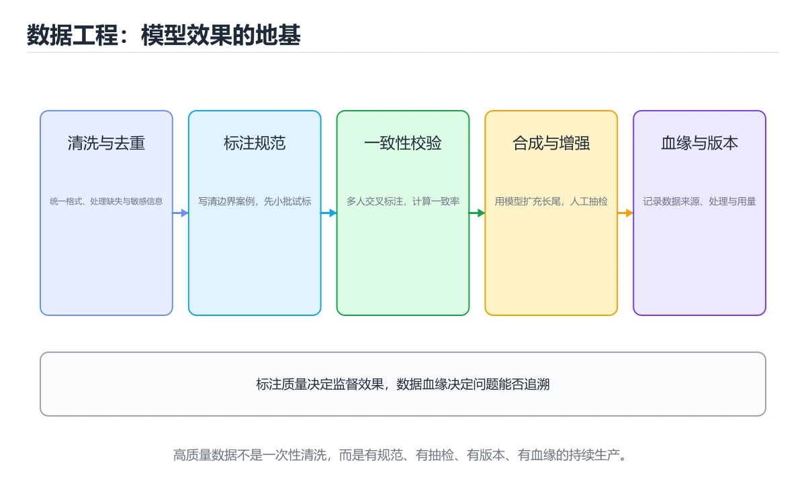

# 数据工程与标注

> 内容更新时间：2026-10-06 · 学习阶段：进阶 · 预计用时：40 分钟




## 本节知识框架

**课程定位**：所属分类 `ai`（AI 与智能体），课程主题 `数据工程与标注`，学习阶段 进阶，建议用时 40 分钟。

本课主线：数据清洗、标注一致性、合成数据与数据血缘。

**学完本课应当能够**
- 说清 `数据清洗` 与 `标注` 的含义与区别，并各举一个正例和一个反例。
- 用本课示例验证 `合成数据` 的行为，记录输入、输出与失败条件。
- 遇到「不做去重」这类问题时，能说出触发条件与修复顺序。

### 从概念到验证的学习链条

1. `数据清洗`：先掌握 处理缺失、重复、格式错误和异常值，使数据满足下游计算与质量约束，再用它解释 `标注` 为什么会出现。
2. `标注`：先掌握 给数据补充标签、类别或参考答案，作为训练和评测的监督信号，再用它解释 `合成数据` 为什么会出现。
3. `合成数据`：先掌握 由程序或模型生成、用于补足稀缺场景的模拟数据，再用它解释 `数据血缘` 为什么会出现。
4. `数据血缘`：先掌握 记录数据从来源到目标经过的任务、字段和转换关系，用于追溯与影响分析，再用它解释 `隐私` 为什么会出现。
5. `隐私`：先掌握 个人信息和控制数据的收集、使用、保留与删除边界，需要授权和最小化处理，再用它解释 本课示例的观察结果 为什么会出现。

**先修与衔接**：本课是「AI 与智能体」分类的第 15 课。相关或后续课程：《实战：文档问答助手（RAG + Agent）》。

### 完成判据

- **定义关**：不看正文也能说明 `数据清洗` 是 处理缺失、重复、格式错误和异常值，使数据满足下游计算与质量约束，并指出一个反例。
- **机制关**：能按“输入 → 转换 → 输出 → 验证”复述 `数据工程与标注`，而不是只背结论。
- **示例关**：能运行或推演 `数据工程与标注` 的 `python` 示例，并说明一个真实出现的标识符或字面量。
- **证据关**：能指出 `数据工程与标注` 示例里的 调用了 `normalize()`，并说明它支持或反驳了本课的哪一条结论。
- **排错关**：能复现 不做去重，记录现象并按 精确 + 近似去重 修复。
- **迁移关**：能把 `数据清洗`、`标注`、`合成数据`、`数据血缘` 放进一个与 `数据工程与标注` 不同的项目场景，并保持输入与验证条件可追踪。
- **复盘关**：学完 `数据工程与标注` 后，用一句话写下仍然不确定的结论，并列出下一次验证需要的输入、环境和成功判据。

### 复习清单

- [ ] 能不看正文复述本课核心术语，并指出一个边界或反例。
- [ ] 能运行或推演本课示例，记录输入、输出与失败现象。
- [ ] 能完成一次自测，并把错题对照错误表定位原因。

## 核心概念定义

| 术语 | 操作性定义 | 常见边界与风险 |
| --- | --- | --- |
| 数据清洗 | 处理缺失、重复、格式错误和异常值，使数据满足下游计算与质量约束。 | 只在「处理缺失、重复、格式错误和异常值，使数据满足下游计算与质量约束」这一前提下成立，换输入或换环境要重新验证。 |
| 标注 | 给数据补充标签、类别或参考答案，作为训练和评测的监督信号。 | 易错：一致性差；正确做法是先写手册并试标校准。 |
| 合成数据 | 由程序或模型生成、用于补足稀缺场景的模拟数据。 | 易错：噪声与幻觉被放大；正确做法是过滤低质合成样本并人工抽检。 |
| 数据血缘 | 记录数据从来源到目标经过的任务、字段和转换关系，用于追溯与影响分析。 | 易错：影响分析困难；正确做法是记录来源、处理与去向。 |
| 隐私 | 个人信息和控制数据的收集、使用、保留与删除边界，需要授权和最小化处理。 | 只在「个人信息和控制数据的收集、使用、保留与删除边界，需要授权和最小化处理」这一前提下成立，换输入或换环境要重新验证。 |

## 原理与运行机制

### 机制总览

**教材衔接：为什么数据决定上限**

模型结构和算力决定"能学到多少"，数据决定"能学到什么"。脏数据会稳定地教会模型错误的模式，且难以通过调参挽回。

**教材衔接：数据生命周期**

采集 → 清洗 → 标注 → 划分 → 版本管理 → 训练 → 反馈回流。每一步都要有质量检查与可追溯记录，否则问题无法定位。

**教材衔接：数据清洗要点**

| 问题 | 处理 |
| --- | --- |
| 缺失值 | 删除、填充或用模型补全，并记录策略 |
| 重复样本 | 精确去重 + 近似去重（SimHash/MinHash） |
| 标签噪声 | 多人标注交叉校验，建仲裁机制 |
| 分布偏移 | 监控线上分布，定期重采样 |
| 数据泄漏 | 严格按时间或实体划分，避免未来信息进入训练 |

**教材衔接：标注体系**

标注质量取决于**规范清晰 + 一致性可测**。做法：先写标注手册并给出边界样例；用双人标注计算一致性（Kappa 系数）；对分歧样本做仲裁；持续抽检并给标注员反馈。标注规范要版本化，规则变更后老数据需评估是否重标。

**教材衔接：合成数据与增强**

数据不足时可用规则变换（同义改写、旋转裁剪、加噪）、模型生成（LLM 造样本）与检索拼接。风险是**放大模型自身偏见**，必须人工抽检并保留真实数据作为评测集。合成数据只用于训练，绝不能进入测试集。

**教材衔接：数据版本与血缘**

每次训练都应能回答：用了哪一版数据、经过了哪些清洗、来源是哪里。做法是给数据集打版本号并记录处理脚本版本（数据血缘），配合内容哈希确保可复现。工具上可用 DVC、LakeFS 或对象存储 + 清单文件。

**教材衔接：反馈闭环**

线上真实请求是最宝贵的分布信息：采样 → 脱敏 → 人工标注 → 进入下一轮训练/评测集。要特别收集**失败案例与边界样本**，同时避免把线上噪声直接当作标准答案。

**教材衔接：隐私与合规**

1. 采集前明确用途与授权，最小化收集范围。
2. 存储与传输加密，访问按最小权限控制。
3. 训练前做 PII 脱敏（手机号、身份证、地址）。
4. 提供删除通道，满足用户的数据删除请求。

**教材衔接：清洗与去重的具体做法**

| 问题 | 处理手段 | 注意 |
| --- | --- | --- |
| 精确重复 | 按主键或内容哈希去重 | 保留最早或最新一条要写明规则 |
| 近似重复 | SimHash/MinHash + 汉明距离阈值 | 阈值需人工抽样校准，过松会误删 |
| 缺失值 | 删除、均值/中位数填充、模型预测 | 填充策略要记录，否则评测无法复现 |
| 异常值 | 分位数截断、业务规则过滤 | 先确认是错误还是真实长尾 |
| 格式不一 | 统一编码（UTF-8）、时间时区、数值单位 | 时区与单位不一致是最隐蔽的脏数据 |
| 敏感信息 | 正则 + 模型识别后脱敏 | 手机号、身份证、地址、密钥 |

**数据版本与血缘**：每次训练必须能回答"用了哪一版数据、经过哪些脚本、来源是什么"。做法是给数据集打版本号（如 `train-2026-10-02-v3`），把清洗脚本纳入版本控制，并记录每个版本的样本数、标签分布与哈希值。评测集必须冻结，绝不参与训练。

**教材衔接：数据流程速查**

| 阶段 | 关键动作 | 常见问题 |
| --- | --- | --- |
| 采集 | 埋点、日志、业务库导出 | 字段缺失、时区不一致 |
| 清洗 | 去重、去噪、格式化 | 正则误伤、编码混乱 |
| 标注 | 人工或半自动打标 | 标准不一致、歧义样本 |
| 质检 | 抽检、一致性校验 | 抽样偏差 |
| 版本化 | 数据集快照与变更记录 | 无法复现旧实验 |
| 切分 | 训练、验证、测试隔离 | 数据泄漏 |
| 发布 | 打包与元数据登记 | 血缘缺失 |

**教材衔接：数据血缘速查**

| 记录内容 | 用途 |
| --- | --- |
| 数据来源 | 追溯到原始系统与采集时间 |
| 处理链路 | 中间步骤与代码版本 |
| 输出去向 | 影响分析与通知下游 |
| 责任人 | 出问题找谁 |
| 质量指标 | 每步的校验结果 |
| 版本 | 支持复现与回滚 |

**教材衔接：深入补充：数据工程与标注 的取舍与边界**

### 一、把概念放回真实约束

| 维度 | 要回答的问题 | 常见做法 | 失败信号 |
| --- | --- | --- | --- |
| 数据 | 数据清洗 的训练或检索数据从哪来、质量如何 | 清洗、去重、标注与版本化 | 评测集泄漏或分布漂移 |
| 模型 | 标注 的能力边界与成本是多少 | 基线对比、离线评测、灰度发布 | 指标好看但线上任务失败 |
| 评测 | 如何证明改动真的有效 | 固定评测集、人工抽检、A/B | 只比较单例输出 |
| 安全 | 失败时会不会泄露或越权 | 权限校验、内容过滤、审计 | 提示注入或数据外泄 |


### 机制拆解：每一步的输入、动作与输出

#### 1. `数据清洗`
- 输入：`数据清洗`；本步把 处理缺失、重复、格式错误和异常值，使数据满足下游计算与质量约束 当作判断规则。
- 动作：围绕 `数据清洗` 保留中间状态，并记录它与 `标注` 的对应关系。
- 输出：`标注`，它可以被下一段代码、测试或记录继续使用。
- `数据清洗` 的失败条件：只在「处理缺失、重复、格式错误和异常值，使数据满足下游计算与质量约束」这一前提下成立，换输入或换环境要重新验证。

#### 2. `标注`
- 输入：`数据清洗`；本步把 给数据补充标签、类别或参考答案，作为训练和评测的监督信号 当作判断规则。
- 动作：围绕 `标注` 保留中间状态，并记录它与 `合成数据` 的对应关系。
- 输出：`合成数据`，它可以被下一段代码、测试或记录继续使用。
- `标注` 的失败条件：当标注无手册时，会出现一致性差。

#### 3. `合成数据`
- 输入：`标注`；本步把 由程序或模型生成、用于补足稀缺场景的模拟数据 当作判断规则。
- 动作：围绕 `合成数据` 保留中间状态，并记录它与 `数据血缘` 的对应关系。
- 输出：`数据血缘`，它可以被下一段代码、测试或记录继续使用。
- `合成数据` 的失败条件：当合成数据不做过滤时，会出现噪声与幻觉被放大。

#### 4. `数据血缘`
- 输入：`合成数据`；本步把 记录数据从来源到目标经过的任务、字段和转换关系，用于追溯与影响分析 当作判断规则。
- 动作：围绕 `数据血缘` 保留中间状态，并记录它与 `隐私` 的对应关系。
- 输出：`隐私`，它可以被下一段代码、测试或记录继续使用。
- `数据血缘` 的失败条件：当不做数据血缘时，会出现影响分析困难。

#### 5. `隐私`
- 输入：`数据血缘`；本步把 个人信息和控制数据的收集、使用、保留与删除边界，需要授权和最小化处理 当作判断规则。
- 动作：围绕 `隐私` 保留中间状态，并记录它与 `normalize` 的对应关系。
- 输出：`normalize`，它可以被下一段代码、测试或记录继续使用。
- `隐私` 的失败条件：只在「个人信息和控制数据的收集、使用、保留与删除边界，需要授权和最小化处理」这一前提下成立，换输入或换环境要重新验证。

### 示例中的可观察事实

1. 调用了 `normalize()`；它对应的课程主题是 `数据工程与标注`。
2. 调用了 `join()`；它对应的课程主题是 `数据工程与标注`。
3. 调用了 `strip()`；它对应的课程主题是 `数据工程与标注`。
4. 调用了 `lower()`；它对应的课程主题是 `数据工程与标注`。
5. 调用了 `split()`；它对应的课程主题是 `数据工程与标注`。
6. 调用了 `content_hash()`；它对应的课程主题是 `数据工程与标注`。
7. 调用了 `sha256()`；它对应的课程主题是 `数据工程与标注`。
8. 调用了 `encode()`；它对应的课程主题是 `数据工程与标注`。

### 复现实验记录

- 环境：`数据工程与标注` 使用 `python` 示例，固定 `数据清洗`、`标注`、`合成数据`、`数据血缘` 作为第一组条件。
- 首轮输入：先确认 调用了 `normalize()`，预测 `数据清洗` 会怎样变化。
- 基线观察：记录命令、输入、输出和错误原文，不用截图代替可复制的文本。
- 单变量修改：只改变 `数据清洗`，观察 `隐私` 是否仍满足定义。
- 失败注入：复现 不做去重，确认现象是 模型记忆化、评测虚高。
- 记录结论：把“修改前、修改后、预期变化、实际变化”写成四列表，这样复盘 `数据工程与标注` 时才能区分概念错误与实现错误。

## 典型应用场景

- **不做去重**：典型现象是模型记忆化、评测虚高；正确做法是精确 + 近似去重。
- **标注无手册**：典型现象是一致性差；正确做法是先写手册并试标校准。
- **只用单人标注**：典型现象是主观偏差；正确做法是双标交叉 + 仲裁。
- **抽检样本太少**：典型现象是质量结论不稳；正确做法是按分层抽样并保证样本量。

### 最小验证场景

- 准备：保留 `python` 示例的原始输入，先记录 `数据工程与标注` 的基线输出和完整运行命令。
- 观察：先核对 调用了 `normalize()`，再改变一个与 `数据清洗` 相关的条件。
- 判定：新结果与 `数据工程与标注` 的基线不同不等于错误；只有当差异破坏了 `数据清洗` 的定义或错误表中的约束，才判定为失败。

### 选择与边界

- 使用 `数据清洗` 时，先满足它的定义：处理缺失、重复、格式错误和异常值，使数据满足下游计算与质量约束；只在「处理缺失、重复、格式错误和异常值，使数据满足下游计算与质量约束」这一前提下成立，换输入或换环境要重新验证。
- 使用 `标注` 时，先满足它的定义：给数据补充标签、类别或参考答案，作为训练和评测的监督信号；易错：一致性差；正确做法是先写手册并试标校准。
- 使用 `合成数据` 时，先满足它的定义：由程序或模型生成、用于补足稀缺场景的模拟数据；易错：噪声与幻觉被放大；正确做法是过滤低质合成样本并人工抽检。
- 使用 `数据血缘` 时，先满足它的定义：记录数据从来源到目标经过的任务、字段和转换关系，用于追溯与影响分析；易错：影响分析困难；正确做法是记录来源、处理与去向。
- 使用 `隐私` 时，先满足它的定义：个人信息和控制数据的收集、使用、保留与删除边界，需要授权和最小化处理；只在「个人信息和控制数据的收集、使用、保留与删除边界，需要授权和最小化处理」这一前提下成立，换输入或换环境要重新验证。

## 代码/协议/SQL 示例

**教材衔接：标注质量速查**

| 指标 | 说明 | 目标 |
| --- | --- | --- |
| 标注一致性（Kappa） | 多人标注的一致程度 | 大于 0.8 |
| 抽检准确率 | 抽样复核的正确比例 | 大于 95% |
| 歧义率 | 无法唯一判定的比例 | 越低越好，需修标准 |
| 覆盖度 | 各类别与边界样本覆盖 | 覆盖全部关键类别 |
| 返回率 | 打回重标的比例 | 用于监控标注方质量 |

质量控制手段：**标注手册 + 试标校准 + 双标交叉 + 抽检复核 + 定期对齐会**。

```python
import hashlib
from dataclasses import dataclass, field

def normalize(text: str) -> str:
    """标准化：去空白、统一大小写，用于近似去重与比对。"""
    return " ".join(text.strip().lower().split())

def content_hash(text: str) -> str:
    """精确去重指纹。"""
    return hashlib.sha256(normalize(text).encode("utf-8")).hexdigest()[:16]

def jaccard(a: set, b: set) -> float:
    """近似去重：按词集合计算 Jaccard 相似度。"""
    if not a or not b:
        return 0.0
    return len(a & b) / len(a | b)

@dataclass
class DataQualityReport:
    total: int
    duplicates: int = 0
    empty: int = 0
    too_long: int = 0
    pii_hits: int = 0
    label_distribution: dict = field(default_factory=dict)

    def pass_gate(self, max_duplicate_rate: float = 0.02) -> bool:
        """质量门禁：重复率、空样本与 PII 命中都要达标。"""
        duplicate_rate = self.duplicates / self.total if self.total else 0.0
        return (
            duplicate_rate <= max_duplicate_rate
            and self.empty == 0
            and self.pii_hits == 0
        )

    def summary(self) -> str:
        return (
            f"样本 {self.total}，重复 {self.duplicates}，空 {self.empty}，"
            f"超长 {self.too_long}，PII {self.pii_hits}"
        )

def mask_pii(text: str, patterns: dict) -> str:
    """PII 脱敏：按正则替换手机号、邮箱、身份证等。"""
    import re

    masked = text
    for name, pattern in patterns.items():
        masked = re.sub(pattern, f"[{name}]", masked)
    return masked

PII_PATTERNS = {
    "PHONE": r"1[3-9]\d{9}",
    "EMAIL": r"[\w.+-]+@[\w-]+\.[\w.]+",
    "ID": r"\d{17}[\dXx]",
}

print(content_hash("Hello   World"))
print(mask_pii("联系 13812345678 或 a@b.com", PII_PATTERNS))
print(DataQualityReport(total=1000, duplicates=10, pii_hits=0).pass_gate())
```

**运行方式**：运行 `数据工程与标注` 的示例时，保存为 `.py` 文件后用 `python 文件名.py` 运行；第三方依赖先在虚拟环境里安装。

### 示例精读：先找证据，再改一个条件

1. 调用了 `normalize()`；它出现在 `数据工程与标注` 的示例中，阅读时先确认它前后各发生了什么。
2. 调用了 `join()`；它出现在 `数据工程与标注` 的示例中，阅读时先确认它前后各发生了什么。
3. 调用了 `strip()`；它出现在 `数据工程与标注` 的示例中，阅读时先确认它前后各发生了什么。
4. 调用了 `lower()`；它出现在 `数据工程与标注` 的示例中，阅读时先确认它前后各发生了什么。
5. 调用了 `split()`；它出现在 `数据工程与标注` 的示例中，阅读时先确认它前后各发生了什么。
6. 调用了 `content_hash()`；它出现在 `数据工程与标注` 的示例中，阅读时先确认它前后各发生了什么。
7. 调用了 `sha256()`；它出现在 `数据工程与标注` 的示例中，阅读时先确认它前后各发生了什么。
8. 调用了 `encode()`；它出现在 `数据工程与标注` 的示例中，阅读时先确认它前后各发生了什么。
- 在 `数据工程与标注` 中与 `数据清洗` 对照：示例必须能支持 处理缺失、重复、格式错误和异常值，使数据满足下游计算与质量约束，否则说明这一段还缺少实现或验证步骤。
- 在 `数据工程与标注` 中与 `标注` 对照：示例必须能支持 给数据补充标签、类别或参考答案，作为训练和评测的监督信号，否则说明这一段还缺少实现或验证步骤。
- 在 `数据工程与标注` 中与 `合成数据` 对照：示例必须能支持 由程序或模型生成、用于补足稀缺场景的模拟数据，否则说明这一段还缺少实现或验证步骤。
- 在 `数据工程与标注` 中与 `数据血缘` 对照：示例必须能支持 记录数据从来源到目标经过的任务、字段和转换关系，用于追溯与影响分析，否则说明这一段还缺少实现或验证步骤。

## 时间/空间复杂度或性能分析

**性能关注点（数据工程与标注）**：算力与显存决定可行规模：记录训练或推理耗时、显存峰值与模型精度，换数据集要重新评估。

**测量方法**：以 `数据工程与标注` 的 `数据清洗` 场景为对象，固定输入跑一遍记录基线，再把规模或并发度提高一个数量级复测；两次结果的差值与波动范围才是结论依据。

### 需要控制的变量与记录项

- `数据工程与标注` 的 `数据清洗`：固定它的版本、输入范围和资源上限，分别记录速度、内存与失败率的变化。
- `数据工程与标注` 的 `标注`：固定它的版本、输入范围和资源上限，分别记录速度、内存与失败率的变化。
- `数据工程与标注` 的 `合成数据`：固定它的版本、输入范围和资源上限，分别记录速度、内存与失败率的变化。
- `数据工程与标注` 的 `数据血缘`：固定它的版本、输入范围和资源上限，分别记录速度、内存与失败率的变化。
- `数据工程与标注` 的 `隐私`：固定它的版本、输入范围和资源上限，分别记录速度、内存与失败率的变化。
- `数据工程与标注` 中 `数据清洗` 的边界：只在「处理缺失、重复、格式错误和异常值，使数据满足下游计算与质量约束」这一前提下成立，换输入或换环境要重新验证。达到边界时不要外推，必须重新测量。
- `数据工程与标注` 中 `标注` 的边界：易错：一致性差；正确做法是先写手册并试标校准。达到边界时不要外推，必须重新测量。
- `数据工程与标注` 中 `合成数据` 的边界：易错：噪声与幻觉被放大；正确做法是过滤低质合成样本并人工抽检。达到边界时不要外推，必须重新测量。
- `数据工程与标注` 中 `数据血缘` 的边界：易错：影响分析困难；正确做法是记录来源、处理与去向。达到边界时不要外推，必须重新测量。
- `数据工程与标注` 中 `隐私` 的边界：只在「个人信息和控制数据的收集、使用、保留与删除边界，需要授权和最小化处理」这一前提下成立，换输入或换环境要重新验证。达到边界时不要外推，必须重新测量。
- `数据工程与标注` 的代码证据：先验证 调用了 `normalize()`，再记录该路径的输入规模与耗时；只看代码行数不能推出复杂度。

## 常见误区与易错点

| 容易写错的做法 | 实际现象 | 原因与正确做法 |
| --- | --- | --- |
| 不做去重 | 模型记忆化、评测虚高 | 精确 + 近似去重 |
| 标注无手册 | 一致性差 | 先写手册并试标校准 |
| 只用单人标注 | 主观偏差 | 双标交叉 + 仲裁 |
| 抽检样本太少 | 质量结论不稳 | 按分层抽样并保证样本量 |
| 不脱敏直接入训练 | 合规风险 | PII 检测与脱敏 |
| 数据处理不进版本管理 | 实验无法复现 | 数据快照 + 代码版本 |
| 训练测试集泄漏 | 指标虚高 | 按实体与时间隔离 |
| 不做数据血缘 | 影响分析困难 | 记录来源、处理与去向 |
| 合成数据不做过滤 | 噪声与幻觉被放大 | 过滤低质合成样本并人工抽检 |
| 数据变更不通知下游 | 模型突然退化 | 变更登记与影响评估 |

### 现场 1：不做去重

**症状**：模型记忆化、评测虚高。

**根因与修复**：精确 + 近似去重。

**自检**：在本课示例里复现「不做去重」，改成精确 + 近似去重后重跑；如果症状消失且失败路径按预期变化，说明定位正确。

### 现场 2：标注无手册

**症状**：一致性差。

**根因与修复**：先写手册并试标校准。

**自检**：在本课示例里复现「标注无手册」，改成先写手册并试标校准后重跑；如果症状消失且失败路径按预期变化，说明定位正确。

### 现场 3：只用单人标注

**症状**：主观偏差。

**根因与修复**：双标交叉 + 仲裁。

**自检**：在本课示例里复现「只用单人标注」，改成双标交叉 + 仲裁后重跑；如果症状消失且失败路径按预期变化，说明定位正确。

### 现场 4：抽检样本太少

**症状**：质量结论不稳。

**根因与修复**：按分层抽样并保证样本量。

**自检**：在本课示例里复现「抽检样本太少」，改成按分层抽样并保证样本量后重跑；如果症状消失且失败路径按预期变化，说明定位正确。

### 现场 5：不脱敏直接入训练

**症状**：合规风险。

**根因与修复**：PII 检测与脱敏。

**自检**：在本课示例里复现「不脱敏直接入训练」，改成PII 检测与脱敏后重跑；如果症状消失且失败路径按预期变化，说明定位正确。

### 现场 6：数据处理不进版本管理

**症状**：实验无法复现。

**根因与修复**：数据快照 + 代码版本。

**自检**：在本课示例里复现「数据处理不进版本管理」，改成数据快照 + 代码版本后重跑；如果症状消失且失败路径按预期变化，说明定位正确。

### 现场 7：训练测试集泄漏

**症状**：指标虚高。

**根因与修复**：按实体与时间隔离。

**自检**：在本课示例里复现「训练测试集泄漏」，改成按实体与时间隔离后重跑；如果症状消失且失败路径按预期变化，说明定位正确。

### 现场 8：不做数据血缘

**症状**：影响分析困难。

**根因与修复**：记录来源、处理与去向。

**自检**：在本课示例里复现「不做数据血缘」，改成记录来源、处理与去向后重跑；如果症状消失且失败路径按预期变化，说明定位正确。

### 现场 9：合成数据不做过滤

**症状**：噪声与幻觉被放大。

**根因与修复**：过滤低质合成样本并人工抽检。

**自检**：在本课示例里复现「合成数据不做过滤」，改成过滤低质合成样本并人工抽检后重跑；如果症状消失且失败路径按预期变化，说明定位正确。

## 与其他知识点的关系

- **相关或后续**：`实战：文档问答助手（RAG + Agent）`。本课术语会在这些课程里继续使用。
- **术语归属**：`数据清洗`、`标注`、`合成数据` 的定义以本课「核心概念定义」为准，换到其他课程时先确认定义是否被改写。
- 同一分类的《Agent 记忆系统》也涉及 `隐私`；两课衔接时先确认这个术语的定义是否一致。

### 先修与后续术语接口

- `实战：文档问答助手（RAG + Agent）`：两者通过本分类的学习顺序衔接，阅读时重点比较各自的输入与失败条件。

### 容易混淆的相邻概念

- `数据清洗` 与 `标注`：前者强调 处理缺失、重复、格式错误和异常值，使数据满足下游计算与质量约束；后者强调 给数据补充标签、类别或参考答案，作为训练和评测的监督信号。判断时分别检查两条定义的适用范围，不要只看名称相似就互换。
- `标注` 与 `合成数据`：前者强调 给数据补充标签、类别或参考答案，作为训练和评测的监督信号；后者强调 由程序或模型生成、用于补足稀缺场景的模拟数据。判断时分别检查两条定义的适用范围，不要只看名称相似就互换。
- `合成数据` 与 `数据血缘`：前者强调 由程序或模型生成、用于补足稀缺场景的模拟数据；后者强调 记录数据从来源到目标经过的任务、字段和转换关系，用于追溯与影响分析。判断时分别检查两条定义的适用范围，不要只看名称相似就互换。
- `数据血缘` 与 `隐私`：前者强调 记录数据从来源到目标经过的任务、字段和转换关系，用于追溯与影响分析；后者强调 个人信息和控制数据的收集、使用、保留与删除边界，需要授权和最小化处理。判断时分别检查两条定义的适用范围，不要只看名称相似就互换。

## 自测题与参考答案

> 先独立作答，再对照参考答案；答案都能在本课正文、术语表或错误表里找到依据。

### 自测 1（概念复述）

不看正文，写出 `数据清洗` 的操作性定义，并说明它与 `标注` 的区别。

**参考答案**：处理缺失、重复、格式错误和异常值，使数据满足下游计算与质量约束。

`标注` 的定位是：给数据补充标签、类别或参考答案，作为训练和评测的监督信号；两者的差别要从适用对象与失败模式上说明。

### 自测 2（排错）

本课错误表记录了「不做去重」这类做法。请写出它会出现的现象、根因，以及修复顺序。

**参考答案**：现象是模型记忆化、评测虚高；正确做法是精确 + 近似去重。修复时先复现现象并保留证据，再改动一处假设重跑，确认现象消失。

### 自测 3（动手验证）

运行本课的 `python` 示例，把其中的 `"标准化：去空白、统一大小写，用于近似去重与比对。"` 换成一个边界值后重新运行，记录输出与错误信息。

**参考答案**：正常输入下 `python` 示例应当复现正文给出的结果；把 `"标准化：去空白、统一大小写，用于近似去重与比对。"` 换成边界值后，如果结果改变或报错，先核对它是否满足 `数据工程与标注` 中`数据清洗` 的适用范围，再检查错误表里是否有同类现象。

### 自测 4（代码阅读）

阅读本课开头的 `python` 示例，说明它体现了`数据清洗` 的哪一条性质，并指出改动哪个输入会让这条性质不再成立。

**参考答案**：`数据清洗` 的定义是 处理缺失、重复、格式错误和异常值，使数据满足下游计算与质量约束，示例正是在实现这条定义。改动与 `数据清洗` 有关的一个输入后，如果结果不再符合 `数据工程与标注` 的正文描述，就说明该性质只在当前前提成立。

### 自测 5（迁移）

把 `数据工程与标注` 的方法迁移到自己的项目：围绕 `数据清洗` 写出一个与错误表同类的风险点，并说明触发条件和检验方式。

**参考答案**：例如「数据变更不通知下游」，它会导致模型突然退化；检验方式是按变更登记与影响评估改一处再复现，确认现象消失且没有引入新的失败分支。

### 自测 6（对比）

用一个表格对比 `数据清洗` 与 `标注`：各写一行适用场景、一行失败表现。

**参考答案**：`数据清洗` 的定义是处理缺失、重复、格式错误和异常值，使数据满足下游计算与质量约束；`标注` 的定义是给数据补充标签、类别或参考答案，作为训练和评测的监督信号。两者的失败表现分别对应本课错误表里与本术语相关的行。

### 自测 7（排错顺序）

面对「不做去重」引发的问题，请把“复现 模型记忆化、评测虚高 → 保留证据 → 精确 + 近似去重 → 回归验证”四步写成可执行的检查清单。

**参考答案**：第一步按模型记忆化、评测虚高复现；第二步记录输入、版本与完整报错；第三步按精确 + 近似去重只改一处；第四步重跑并确认失败路径也按预期变化。

### 自测 8（边界判断）

针对 `隐私`，分别写出“可以使用”的条件和“结论不再成立”的条件。

**参考答案**：只在「个人信息和控制数据的收集、使用、保留与删除边界，需要授权和最小化处理」这一前提下成立，换输入或换环境要重新验证。 同时要把 `隐私` 的定义 个人信息和控制数据的收集、使用、保留与删除边界，需要授权和最小化处理 与实际输入逐项对照。

### 自测 9（机制重建）

不看正文，按输入、转换、输出、验证四段重建 `数据清洗` → `标注` → `合成数据` → `数据血缘` 的作用链。

**参考答案**：起点是 `数据清洗` 的定义 处理缺失、重复、格式错误和异常值，使数据满足下游计算与质量约束；中间每一步都保留可观察状态；终点由 `隐私` 检查，失败时回到错误表定位第一个偏离定义的步骤。

### 自测 10（综合排错）

在 `数据工程与标注` 中，现象是 模型突然退化。请围绕 数据变更不通知下游 写出最小复现、关键证据、修复动作和回归验证，并说明为什么不能只凭一次运行下结论。

**参考答案**：先复现 数据变更不通知下游，记录输入与完整错误；再按 变更登记与影响评估 只改一处。回归时同时跑正常路径和边界路径，只有两次结果都可解释，才把修复视为完成。

### 自测 11（一分钟复述）

用每分钟约 200 字的速度复述 `数据工程与标注`：先给主问题，再按顺序说出 `数据清洗`、`标注`、`合成数据`、`数据血缘`，最后给一个失败案例。

**自评标准**：主问题必须对应 数据清洗、标注一致性、合成数据与数据血缘；每个术语都要能接上一句定义或边界；失败案例必须写成可观察现象，不能用“可能有风险”代替证据。

## 术语速查

| 术语 | 一句话说明 |
| --- | --- |
| `数据清洗` | 处理缺失、重复、格式错误和异常值，使数据满足下游计算与质量约束。 |
| `标注` | 给数据补充标签、类别或参考答案，作为训练和评测的监督信号。 |
| `合成数据` | 由程序或模型生成、用于补足稀缺场景的模拟数据。 |
| `数据血缘` | 记录数据从来源到目标经过的任务、字段和转换关系，用于追溯与影响分析。 |
| `隐私` | 个人信息和控制数据的收集、使用、保留与删除边界，需要授权和最小化处理。 |

**术语关系**：`数据清洗`（处理缺失、重复、格式错误和异常值） → `标注`（给数据补充标签、类别或参考答案） → `合成数据`（由程序或模型生成、用于补足稀缺场景的模拟数据） → `数据血缘`（记录数据从来源到目标经过的任务、字段和转换关系）。

## 考点精讲

`数据工程与标注` 的题库有 6 道题，下面逐题给出题干、正确项与判断依据：先自己作答，再核对正确项，最后回到正文对应小节复核。

### 考点 1：第 1 题

- **题目**：合成数据可以用于？
- **正确项**：训练
- **判断依据**：这道题落在术语 `合成数据` 上：由程序或模型生成、用于补足稀缺场景的模拟数据。复习时把 `合成数据` 的定义、适用边界和一个反例一起说清楚，再回到「核心概念定义」核对原文。

### 考点 2：第 2 题

- **题目**：阅读这段数据清洗与去重代码，下面哪项判断是正确的？
- **正确项**：先标准化再算指纹能做精确去重，近似重复还要用相似度或 MinHash 这类方案
- **判断依据**：这道题落在术语 `数据清洗` 上：处理缺失、重复、格式错误和异常值，使数据满足下游计算与质量约束。复习时把 `数据清洗` 的定义、适用边界和一个反例一起说清楚，再回到「核心概念定义」核对原文。

### 考点 3：第 3 题

- **题目**：围绕“数据工程与标注”中的 数据清洗、标注、合成数据，下列哪两项是本课强调的实践判断？
- **正确项**：学习 数据清洗 时要同时说明输入、输出和失败路径，不能只看正常流程；验证 标注 时要固定版本并覆盖边界输入，结论才可复现
- **判断依据**：这道题落在术语 `数据清洗` 上：处理缺失、重复、格式错误和异常值，使数据满足下游计算与质量约束。复习时把 `数据清洗` 的定义、适用边界和一个反例一起说清楚，再回到「核心概念定义」核对原文。

### 考点 4：第 4 题

- **题目**：训练数据去重为什么重要？
- **正确项**：重复样本会导致记忆化
- **判断依据**：这道题检验本课主问题：数据清洗、标注一致性、合成数据与数据血缘。复习时先复述本课主问题，再举一个会让结论失效的输入。

### 考点 5：第 5 题

- **题目**：PII 脱敏在数据工程中的作用是？
- **正确项**：防止个人隐私信息进入训练数据与日志，满足合规要求
- **判断依据**：这道题落在术语 `隐私` 上：个人信息和控制数据的收集、使用、保留与删除边界，需要授权和最小化处理。复习时把 `隐私` 的定义、适用边界和一个反例一起说清楚，再回到「核心概念定义」核对原文。

### 考点 6：第 6 题

- **题目**：填空：补齐下面这段术语说明中的空缺。课程 `数据清洗、标注一致性、合成数据与数据血缘。`，这段说明是：`____`：处理缺失、重复、格式错误和异常值，使数据满足下游计算与质量约束。空缺处应填哪个术语？
- **正确项**：数据清洗
- **判断依据**：这道题落在术语 `数据清洗` 上：处理缺失、重复、格式错误和异常值，使数据满足下游计算与质量约束。复习时把 `数据清洗` 的定义、适用边界和一个反例一起说清楚，再回到「核心概念定义」核对原文。

### 考点 7：`数据清洗`

- **要点**：处理缺失、重复、格式错误和异常值，使数据满足下游计算与质量约束。
- **数据清洗 的边界**：只在「处理缺失、重复、格式错误和异常值，使数据满足下游计算与质量约束」这一前提下成立，换输入或换环境要重新验证。

### 考点 8：`标注`

- **要点**：给数据补充标签、类别或参考答案，作为训练和评测的监督信号。
- **标注 的边界**：易错：一致性差；正确做法是先写手册并试标校准。

### 考点 9：`合成数据`

- **要点**：由程序或模型生成、用于补足稀缺场景的模拟数据。
- **合成数据 的边界**：易错：噪声与幻觉被放大；正确做法是过滤低质合成样本并人工抽检。

### 考点 10：`数据血缘`

- **要点**：记录数据从来源到目标经过的任务、字段和转换关系，用于追溯与影响分析。
- **数据血缘 的边界**：易错：影响分析困难；正确做法是记录来源、处理与去向。

### 考点 11：`隐私`

- **要点**：个人信息和控制数据的收集、使用、保留与删除边界，需要授权和最小化处理。
- **隐私 的边界**：只在「个人信息和控制数据的收集、使用、保留与删除边界，需要授权和最小化处理」这一前提下成立，换输入或换环境要重新验证。

### 考点 12：排错——不做去重

- **现象**：模型记忆化、评测虚高。
- **处理**：精确 + 近似去重。

### 考点 13：排错——标注无手册

- **现象**：一致性差。
- **处理**：先写手册并试标校准。

### 考点 14：综合辨析——`数据清洗` 与 `隐私`

- **辨析点**：`数据清洗` 的定义是 处理缺失、重复、格式错误和异常值，使数据满足下游计算与质量约束；`隐私` 的定义是 个人信息和控制数据的收集、使用、保留与删除边界，需要授权和最小化处理。
- **答题要求**：面对 `数据工程与标注` 的题目，先判断描述的是 `数据清洗` 还是 `隐私`，再归到对应定义，最后写出一个会让该定义失效的边界输入。

### 考点 15：排错评分点

- **现象分**：能写出 模型记忆化、评测虚高，而不是只写“程序有错”。
- **证据分**：保留触发 不做去重 的输入、版本和错误原文。
- **修复分**：按 精确 + 近似去重 只改一处，并同时回归正常路径与边界路径。

## 内容元数据

- 内容版本：v2.0
- 最后更新：2026-10-06
- 学习阶段：进阶
- 适用环境：主流大模型 API、开源模型与向量数据库；本课聚焦 数据清洗。
- 内容来源：内置结构化课程与工程实践整理
- 相关主题：数据清洗、标注、合成数据、数据血缘、隐私
- 质量版本：P0 测验标准 + P1 覆盖扩展 + P2 体验补全

## 参考资料与复核

- 最后复核：2026-10-04
- 下次复核：2026-12-24
- 复核范围：版本兼容、API 行为、安全建议与工程实践
- 来源性质：官方文档、标准或权威教材；本课核对关键词：数据清洗、标注、合成数据、数据血缘、隐私。

| 参考资料 | 本课用途 |
| --- | --- |
| [Google AI 文档](https://ai.google.dev/gemini-api/docs) | Gemini API 与多模态 |
| [Hugging Face 文档](https://huggingface.co/docs) | 模型、数据集与推理 |
| [scikit-learn 文档](https://scikit-learn.org/stable/documentation.html) | 经典机器学习算法 |

| [本课术语索引：数据工程与标注](#核心概念定义) | 按本课输入、术语边界和错误表现逐项核对 |
> 「数据工程与标注」的链接用于离线阅读后的延伸核对；App 不会自动联网。