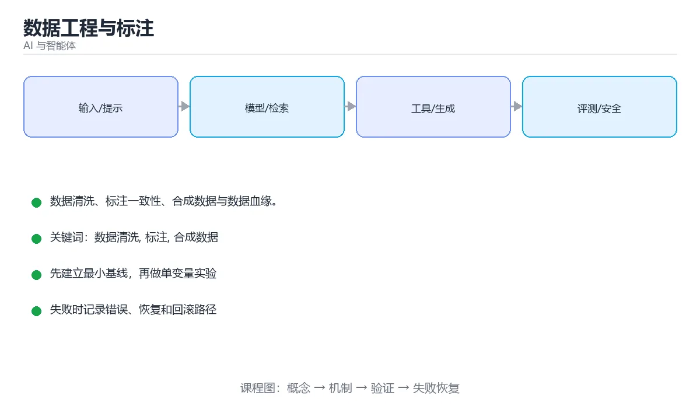

# 数据工程与标注



> 内容更新时间：2026-10-03 · 学习阶段：高级 · 预计用时：16 分钟

## 学习目标

- 能用自己的话解释「数据工程与标注」解决了什么问题，而不是只背术语。
- 能说清 「数据清洗」、「标注」、「合成数据」、「数据血缘」 之间的关系，并分别举出一个例子。
- 能把本课知识放回「AI 与智能体」的知识体系，说明它和相邻主题的边界。
- 能完成本课练习，并用验收标准检查自己的结果。

> 一句话摘要：数据清洗、标注一致性、合成数据与数据血缘。

## 前置知识

- 先完成上一课《模型训练与分布式》；如果已经掌握，可以直接用本课练习自测。
- 本课阶段：高级。建议具备同一方向的完整基础，能阅读较长的代码、配置或系统设计说明。
- 开始前先复习：数据清洗、标注、合成数据。
- 如果某一步看不懂，先记录具体卡点，完成练习后再回头读一遍。


## 为什么数据决定上限

模型结构和算力决定"能学到多少"，数据决定"能学到什么"。脏数据会稳定地教会模型错误的模式，且难以通过调参挽回。

## 数据生命周期

采集 → 清洗 → 标注 → 划分 → 版本管理 → 训练 → 反馈回流。每一步都要有质量检查与可追溯记录，否则问题无法定位。

## 数据清洗要点

| 问题 | 处理 |
| --- | --- |
| 缺失值 | 删除、填充或用模型补全，并记录策略 |
| 重复样本 | 精确去重 + 近似去重（SimHash/MinHash） |
| 标签噪声 | 多人标注交叉校验，建仲裁机制 |
| 分布偏移 | 监控线上分布，定期重采样 |
| 数据泄漏 | 严格按时间或实体划分，避免未来信息进入训练 |

## 标注体系

标注质量取决于**规范清晰 + 一致性可测**。做法：先写标注手册并给出边界样例；用双人标注计算一致性（Kappa 系数）；对分歧样本做仲裁；持续抽检并给标注员反馈。标注规范要版本化，规则变更后老数据需评估是否重标。

## 合成数据与增强

数据不足时可用规则变换（同义改写、旋转裁剪、加噪）、模型生成（LLM 造样本）与检索拼接。风险是**放大模型自身偏见**，必须人工抽检并保留真实数据作为评测集。合成数据只用于训练，绝不能进入测试集。

## 数据版本与血缘

每次训练都应能回答：用了哪一版数据、经过了哪些清洗、来源是哪里。做法是给数据集打版本号并记录处理脚本版本（数据血缘），配合内容哈希确保可复现。工具上可用 DVC、LakeFS 或对象存储 + 清单文件。

## 反馈闭环

线上真实请求是最宝贵的分布信息：采样 → 脱敏 → 人工标注 → 进入下一轮训练/评测集。要特别收集**失败案例与边界样本**，同时避免把线上噪声直接当作标准答案。

## 隐私与合规

1. 采集前明确用途与授权，最小化收集范围。
2. 存储与传输加密，访问按最小权限控制。
3. 训练前做 PII 脱敏（手机号、身份证、地址）。
4. 提供删除通道，满足用户的数据删除请求。

## 清洗与去重的具体做法

| 问题 | 处理手段 | 注意 |
| --- | --- | --- |
| 精确重复 | 按主键或内容哈希去重 | 保留最早或最新一条要写明规则 |
| 近似重复 | SimHash/MinHash + 汉明距离阈值 | 阈值需人工抽样校准，过松会误删 |
| 缺失值 | 删除、均值/中位数填充、模型预测 | 填充策略要记录，否则评测无法复现 |
| 异常值 | 分位数截断、业务规则过滤 | 先确认是错误还是真实长尾 |
| 格式不一 | 统一编码（UTF-8）、时间时区、数值单位 | 时区与单位不一致是最隐蔽的脏数据 |
| 敏感信息 | 正则 + 模型识别后脱敏 | 手机号、身份证、地址、密钥 |

**数据版本与血缘**：每次训练必须能回答"用了哪一版数据、经过哪些脚本、来源是什么"。做法是给数据集打版本号（如 `train-2026-10-02-v3`），把清洗脚本纳入版本控制，并记录每个版本的样本数、标签分布与哈希值。评测集必须冻结，绝不参与训练。

## 本课小结
数据工程的目标是**让每一份训练数据都可追溯、可复现、可解释**。把清洗、标注、版本与反馈闭环做扎实，模型效果往往自然提升。


## 数据流程速查

| 阶段 | 关键动作 | 常见问题 |
| --- | --- | --- |
| 采集 | 埋点、日志、业务库导出 | 字段缺失、时区不一致 |
| 清洗 | 去重、去噪、格式化 | 正则误伤、编码混乱 |
| 标注 | 人工或半自动打标 | 标准不一致、歧义样本 |
| 质检 | 抽检、一致性校验 | 抽样偏差 |
| 版本化 | 数据集快照与变更记录 | 无法复现旧实验 |
| 切分 | 训练、验证、测试隔离 | 数据泄漏 |
| 发布 | 打包与元数据登记 | 血缘缺失 |

## 标注质量速查

| 指标 | 说明 | 目标 |
| --- | --- | --- |
| 标注一致性（Kappa） | 多人标注的一致程度 | 大于 0.8 |
| 抽检准确率 | 抽样复核的正确比例 | 大于 95% |
| 歧义率 | 无法唯一判定的比例 | 越低越好，需修标准 |
| 覆盖度 | 各类别与边界样本覆盖 | 覆盖全部关键类别 |
| 返回率 | 打回重标的比例 | 用于监控标注方质量 |

质量控制手段：**标注手册 + 试标校准 + 双标交叉 + 抽检复核 + 定期对齐会**。

```python
import hashlib
from dataclasses import dataclass, field

def normalize(text: str) -> str:
    """标准化：去空白、统一大小写，用于近似去重与比对。"""
    return " ".join(text.strip().lower().split())


def content_hash(text: str) -> str:
    """精确去重指纹。"""
    return hashlib.sha256(normalize(text).encode("utf-8")).hexdigest()[:16]


def jaccard(a: set, b: set) -> float:
    """近似去重：按词集合计算 Jaccard 相似度。"""
    if not a or not b:
        return 0.0
    return len(a & b) / len(a | b)


@dataclass
class DataQualityReport:
    total: int
    duplicates: int = 0
    empty: int = 0
    too_long: int = 0
    pii_hits: int = 0
    label_distribution: dict = field(default_factory=dict)

    def pass_gate(self, max_duplicate_rate: float = 0.02) -> bool:
        """质量门禁：重复率、空样本与 PII 命中都要达标。"""
        duplicate_rate = self.duplicates / self.total if self.total else 0.0
        return (
            duplicate_rate <= max_duplicate_rate
            and self.empty == 0
            and self.pii_hits == 0
        )

    def summary(self) -> str:
        return (
            f"样本 {self.total}，重复 {self.duplicates}，空 {self.empty}，"
            f"超长 {self.too_long}，PII {self.pii_hits}"
        )


def mask_pii(text: str, patterns: dict) -> str:
    """PII 脱敏：按正则替换手机号、邮箱、身份证等。"""
    import re

    masked = text
    for name, pattern in patterns.items():
        masked = re.sub(pattern, f"[{name}]", masked)
    return masked


PII_PATTERNS = {
    "PHONE": r"1[3-9]\d{9}",
    "EMAIL": r"[\w.+-]+@[\w-]+\.[\w.]+",
    "ID": r"\d{17}[\dXx]",
}

print(content_hash("Hello   World"))
print(mask_pii("联系 13812345678 或 a@b.com", PII_PATTERNS))
print(DataQualityReport(total=1000, duplicates=10, pii_hits=0).pass_gate())
```

## 数据血缘速查

| 记录内容 | 用途 |
| --- | --- |
| 数据来源 | 追溯到原始系统与采集时间 |
| 处理链路 | 中间步骤与代码版本 |
| 输出去向 | 影响分析与通知下游 |
| 责任人 | 出问题找谁 |
| 质量指标 | 每步的校验结果 |
| 版本 | 支持复现与回滚 |

## 常见错误对照表

| 容易踩的做法 | 实际现象 | 原因与正确做法 |
| --- | --- | --- |
| 不做去重 | 模型记忆化、评测虚高 | 精确 + 近似去重 |
| 标注无手册 | 一致性差 | 先写手册并试标校准 |
| 只用单人标注 | 主观偏差 | 双标交叉 + 仲裁 |
| 抽检样本太少 | 质量结论不稳 | 按分层抽样并保证样本量 |
| 不脱敏直接入训练 | 合规风险 | PII 检测与脱敏 |
| 数据处理不进版本管理 | 实验无法复现 | 数据快照 + 代码版本 |
| 训练测试集泄漏 | 指标虚高 | 按实体与时间隔离 |
| 不做数据血缘 | 影响分析困难 | 记录来源、处理与去向 |
| 合成数据不做过滤 | 噪声与幻觉被放大 | 过滤低质合成样本并人工抽检 |
| 数据变更不通知下游 | 模型突然退化 | 变更登记与影响评估 |

## 自测清单

- [ ] 数据流程含采集、清洗、标注、质检、版本与切分。
- [ ] 标注有一致性指标与双标仲裁机制。
- [ ] 训练数据做精确与近似去重，并检测 PII。
- [ ] 数据快照与代码版本可复现实验。
- [ ] 血缘信息完整，变更能评估影响面。

## 动手练习


> 本课练习重点：围绕「数据清洗、标注、合成数据」完成复述、实验和交付，每个结果都要能被别人检查。

先写评测样例，再改一个提示、模型或数据变量，最后比较质量、成本与安全。

### 练习 1：建立心智模型（10 分钟）

合上教程，用 3～5 句话回答：

1. 「数据工程与标注」解决了什么问题？
2. 如果没有它，会出现什么具体后果？
3. 它和「标注」是什么关系？

**验收标准**：至少出现一个本课关键词，并写出一个反例、边界条件或失效场景。

### 练习 2：做一次可控实验（20 分钟）

从正文中选一个最小示例，完成以下操作：

1. 先预测修改一个参数、输入或步骤后的结果。
2. 再实际执行或逐步推演，记录真实结果。
3. 如果结果与预测不同，写出差异原因。

**验收标准**：留下「原例 → 改动 → 预测 → 结果 → 原因」五步记录。

### 练习 3：交付一个小结果（30 分钟）

构造 5 条小型离线样例，写清输入、期望输出、评分标准和失败案例。

任务要求：

- 结果必须能被别人检查，不能只写“我已经理解了”。
- 至少覆盖「数据清洗」和「标注」两个关键词。
- 写出 1 个仍然不确定的问题，以及下一步如何验证。

> 提示：时间有限时优先做练习 1 和练习 2；练习 3 可以拆成两次完成。


## 考点精讲：把测验题还原成判断过程

本课有 6 个判断点。先自己作答，再看「判断依据」；如果结论正确但理由不完整，回到正文对应章节补足概念。

### 考点 1：合成数据可以用于？

- **正确判断**：训练
- **判断依据**：合成数据只用于训练，进入测试集会高估效果。其他选项：合成数据可以用于训练（补充长尾与冷启动），但需要人工抽检与过滤。针对「合成数据可以用于，」，本课在「本课小结」中说明：数据工程的目标是让每一份训练数据都可追溯、可复现、可解释。本课还在「数据版本与血缘」中说明：做法是给数据集打版本号并记录处理脚本版本（数据血缘），配合内容哈希确保可复现。本课还在「数据生命周期」中说明：采集 → 清洗 → 标注 → 划分 → 版本管理 → 训练 → 反馈回流。
- **迁移检查**：如果给某个错误选项去掉一个限定词，它会不会变成正确？说明理由。

### 考点 2：保证标注质量最关键的两点是？

- **正确判断**：规范清晰可执行、一致性可测量
- **判断依据**：配合交叉标注、Kappa 一致性与仲裁机制才能稳定质量。其他选项：标注质量的关键是规范清晰可执行、一致性可测量。针对「保证标注质量最关键的两点是，」，本课在「数据版本与血缘」中说明：做法是给数据集打版本号并记录处理脚本版本（数据血缘），配合内容哈希确保可复现。本课还在「本课小结」中说明：数据工程的目标是让每一份训练数据都可追溯、可复现、可解释。本课还在「标注体系」中说明：用双人标注计算一致性（Kappa 系数）。
- **迁移检查**：把题干里的一个条件换成边界值，原来的结论还成立吗？写出判断过程。

### 考点 3：数据血缘（Lineage）的价值是？

- **正确判断**：让每次训练可追溯
- **判断依据**：能回答用了哪一版数据、经过哪些处理、来源何处。其他选项：血缘让每次训练可追溯，也便于评估变更影响。针对「数据血缘（Lineage）的价值是，」，本课在「数据版本与血缘」中说明：每次训练都应能回答：用了哪一版数据、经过了哪些清洗、来源是哪里。本课还在「清洗与去重的具体做法」中说明：数据版本与血缘：每次训练必须能回答"用了哪一版数据、经过哪些脚本、来源是什么"。本课还在「数据生命周期」中说明：每一步都要有质量检查与可追溯记录，否则问题无法定位。
- **迁移检查**：如果给某个错误选项去掉一个限定词，它会不会变成正确？说明理由。

### 考点 4：训练数据去重为什么重要？

- **正确判断**：重复样本会导致记忆化
- **判断依据**：除精确去重外，还要做近似去重（如 MinHash）处理改写与模板化重复。其他选项：重复样本会导致记忆化，因此必须做精确与近似去重。针对「训练数据去重为什么重要，」，本课在「为什么数据决定上限」中说明：模型结构和算力决定"能学到多少"，数据决定"能学到什么"。本课还在「为什么数据决定上限」中说明：脏数据会稳定地教会模型错误的模式，且难以通过调参挽回。本课还在「合成数据与增强」中说明：数据不足时可用规则变换（同义改写、旋转裁剪、加噪）、模型生成（LLM 造样本）与检索拼接。
- **迁移检查**：如果给某个错误选项去掉一个限定词，它会不会变成正确？说明理由。

### 考点 5：PII 脱敏在数据工程中的作用是？

- **正确判断**：防止个人隐私信息进入训练数据与日志，满足合规要求
- **判断依据**：正确答案是「防止个人隐私信息进入训练数据与日志，满足合规要求」，本课在「反馈闭环」中说明：线上真实请求是最宝贵的分布信息：采样 → 脱敏 → 人工标注 → 进入下一轮训练/评测集。脱敏要可审计：哪些字段被处理、用什么规则、处理前后如何比对。本课还在「本课小结」中说明：把清洗、标注、版本与反馈闭环做扎实，模型效果往往自然提升。本课还在「标注体系」中说明：标注规范要版本化，规则变更后老数据需评估是否重标。
- **迁移检查**：如果给某个错误选项去掉一个限定词，它会不会变成正确？说明理由。

### 考点 6：补全代码：「数据工程与标注」示例中，下面这行代码缺少哪个关键字或函数名？请填入 ____。 `def ____(self) -> str:`

- **正确判断**：summary
- **判断依据**：正确答案是「summary」，本课在「清洗与去重的具体做法」中说明：做法是给数据集打版本号（如 train-2026-10-02-v3），把清洗脚本纳入版本控制，并记录每个版本的样本数、标签分布与哈希值。本课还在「合成数据与增强」中说明：风险是放大模型自身偏见，必须人工抽检并保留真实数据作为评测集。本课还在「标注质量速查」中说明：质量控制手段：标注手册 + 试标校准 + 双标交叉 + 抽检复核 + 定期对齐会。
- **迁移检查**：把答案换成另一种等价写法，是否仍然正确？说明依据。

## 本课复习清单

离开本课前，逐项确认：

- [ ] 不看解析，能说出「合成数据可以用于？」的判断依据。
- [ ] 不看解析，能说出「保证标注质量最关键的两点是？」的判断依据。
- [ ] 不看解析，能说出「数据血缘（Lineage）的价值是？」的判断依据。
- [ ] 不看解析，能说出「训练数据去重为什么重要？」的判断依据。
- [ ] 不看解析，能说出「PII 脱敏在数据工程中的作用是？」的判断依据。
- [ ] 不看解析，能说出「补全代码：「数据工程与标注」示例中，下面这行代码缺少哪个关键字或函数名？请填入 …」的判断依据。
- [ ] 至少运行一次本课示例，记录输入、输出和一个边界情况。
- [ ] 把本课最容易混淆的两个概念写成一句话对照。

| 复盘项 | 记录 |
| --- | --- |
| 已经能独立解释的考点 |  |
| 仍然说不清的概念 |  |
| 下一步验证动作 |  |

## 术语速查

把本课反复出现的术语集中放在一起。复习时先遮住右列，尝试用自己的话解释，再回到正文核对。

| 术语 | 本课语境 |
| --- | --- |
| `train-2026-10-02-v3` | 数据版本与血缘**：每次训练必须能回答"用了哪一版数据、经过哪些脚本、来源是什么"。做法是给数据集打版本号（如 `train-2026-10-02-v3`），把清洗脚本纳入版本控制，并记录每个版本的样本数、标签分布与哈希… |
| `数据清洗` | 本课围绕该主题展开，结合正文与代码示例理解它的适用边界。 |
| `标注` | 本课围绕该主题展开，结合正文与代码示例理解它的适用边界。 |
| `合成数据` | 本课围绕该主题展开，结合正文与代码示例理解它的适用边界。 |
| `数据血缘` | 本课围绕该主题展开，结合正文与代码示例理解它的适用边界。 |
| `隐私` | 本课围绕该主题展开，结合正文与代码示例理解它的适用边界。 |

## 面试问答与自测

下面把本课考点换成面试追问。先口述自己的答案，
再对照参考回答检查是否遗漏了前提、边界或失败路径。

### 追问 1：合成数据可以用于？

**参考回答**：合成数据只用于训练，进入测试集会高估效果。其他选项：合成数据可以用于训练（补充长尾与冷启动），但需要人工抽检与过滤。针对「合成数据可以用于，」，本课在「本课小结」中说明：数据工程的目标是让每一份训练数据都可追溯、可复现、可解释。本课还在「数据版本与血缘」中说明：做法是给数据集打版本号并记录处理脚本版本（数据血缘），配合内容哈希确保可复现。本课还在「数据生命周期」中说明：采集 → 清洗 → 标注 → 划分 → 版本管理 → 训练 → 反馈回流。

### 追问 2：保证标注质量最关键的两点是？

**参考回答**：配合交叉标注、Kappa 一致性与仲裁机制才能稳定质量。其他选项：标注质量的关键是规范清晰可执行、一致性可测量。针对「保证标注质量最关键的两点是，」，本课在「数据版本与血缘」中说明：做法是给数据集打版本号并记录处理脚本版本（数据血缘），配合内容哈希确保可复现。本课还在「本课小结」中说明：数据工程的目标是让每一份训练数据都可追溯、可复现、可解释。本课还在「标注体系」中说明：用双人标注计算一致性（Kappa 系数）。

### 追问 3：数据血缘（Lineage）的价值是？

**参考回答**：能回答用了哪一版数据、经过哪些处理、来源何处。其他选项：血缘让每次训练可追溯，也便于评估变更影响。针对「数据血缘（Lineage）的价值是，」，本课在「数据版本与血缘」中说明：每次训练都应能回答：用了哪一版数据、经过了哪些清洗、来源是哪里。本课还在「清洗与去重的具体做法」中说明：数据版本与血缘：每次训练必须能回答"用了哪一版数据、经过哪些脚本、来源是什么"。本课还在「数据生命周期」中说明：每一步都要有质量检查与可追溯记录，否则问题无法定位。

### 追问 4：训练数据去重为什么重要？

**参考回答**：除精确去重外，还要做近似去重（如 MinHash）处理改写与模板化重复。其他选项：重复样本会导致记忆化，因此必须做精确与近似去重。针对「训练数据去重为什么重要，」，本课在「为什么数据决定上限」中说明：模型结构和算力决定"能学到多少"，数据决定"能学到什么"。本课还在「为什么数据决定上限」中说明：脏数据会稳定地教会模型错误的模式，且难以通过调参挽回。本课还在「合成数据与增强」中说明：数据不足时可用规则变换（同义改写、旋转裁剪、加噪）、模型生成（LLM 造样本）与检索拼接。

### 追问 5：PII 脱敏在数据工程中的作用是？

**参考回答**：正确答案是「防止个人隐私信息进入训练数据与日志，满足合规要求」，本课在「反馈闭环」中说明：线上真实请求是最宝贵的分布信息：采样 → 脱敏 → 人工标注 → 进入下一轮训练/评测集。脱敏要可审计：哪些字段被处理、用什么规则、处理前后如何比对。本课还在「本课小结」中说明：把清洗、标注、版本与反馈闭环做扎实，模型效果往往自然提升。本课还在「标注体系」中说明：标注规范要版本化，规则变更后老数据需评估是否重标。

## English Overview

**Title:** Data Engineering & Labeling

**Summary:** Cleaning, labeling quality, synthetic data and lineage.

**Category:** AI & Agents  
**Level:** 高级  
**Key terms:** 数据清洗, 标注, 合成数据, 数据血缘, 隐私

> The full tutorial is written in Chinese. This bilingual overview helps English readers identify the topic, scope and key terms before studying the detailed examples.

## 内容元数据

- 内容版本：v2.0
- 最后更新：2026-10-03
- 学习阶段：高级
- 适用环境：主流大模型 API、开源模型与向量数据库
- 内容来源：内置结构化课程与工程实践整理
- 相关主题：数据清洗、标注、合成数据、数据血缘、隐私
- 质量版本：P0 测验标准 + P1 覆盖扩展 + P2 体验补全


## 参考资料与复核

- 最后复核：2026-10-04
- 下次复核：2027-04-04
- 复核范围：版本兼容、API 行为、安全建议与工程实践
- 来源性质：官方文档与标准；本课正文为离线教学重组，不复制原文

| 参考资料 | 本课用途 |
| --- | --- |
| [OpenAI Docs](https://platform.openai.com/docs/) | 模型 API、工具与评估 |
| [Hugging Face Docs](https://huggingface.co/docs) | 模型、数据集与推理 |
| [Model Context Protocol](https://modelcontextprotocol.io/) | Agent 工具与上下文协议 |

> 本课主题：数据清洗、标注一致性、合成数据与数据血缘。

> App 完全离线展示文字链接，不会自动联网；需要延伸阅读时可复制链接到浏览器。
