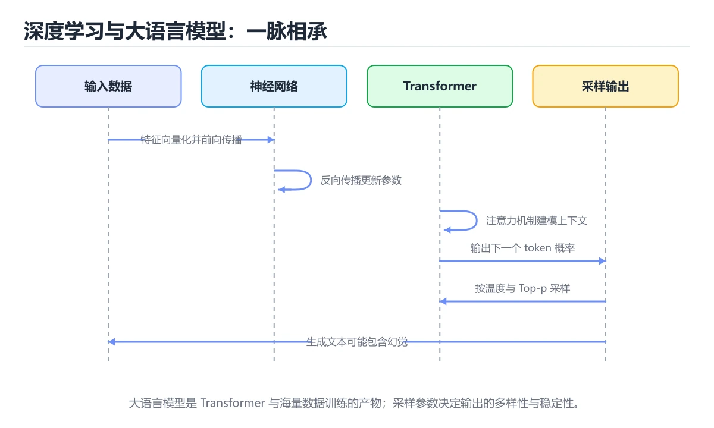
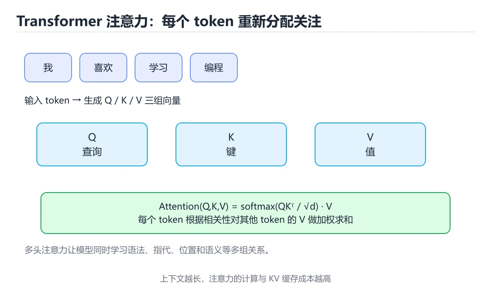
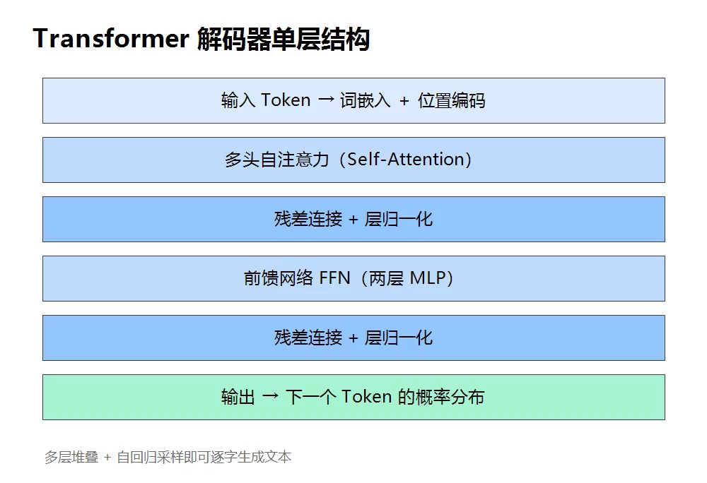

# 深度学习与大语言模型





> 内容更新时间：2026-10-06 · 学习阶段：进阶 · 预计用时：45 分钟

## 本节知识框架

**课程定位**：所属分类为「AI 与智能体」，课程主题为「深度学习与大语言模型」，学习阶段为「进阶」，建议用时 45 分钟。

**本课要解决的主问题**：神经网络训练、Transformer、幻觉与采样参数。

| 学习层次 | 要回答的问题 | 完成判据 |
| --- | --- | --- |
| 概念层 | 「深度学习与大语言模型」有哪些必须区分的对象与术语？ | 能用自己的话定义核心术语，并各举一个正例和一个反例。 |
| 机制层 | 这些对象按什么顺序发生作用，输入如何变成输出？ | 能画出或写出机制步骤，并说明每一步的失败条件。 |
| 应用层 | 什么场景适合使用「深度学习与大语言模型」，什么场景不适合？ | 能给出一个真实场景、一个最小示例和一个边界案例。 |
| 性能层 | 时间、空间、吞吐或延迟受哪些量影响？ | 能说出复杂度或性能瓶颈的证据来源；没有证据时明确写“材料未提供”。 |
| 复习层 | 怎样确认自己不是只记住了结论？ | 能独立完成本课自测，并把错误定位到概念、机制、示例或边界。 |

### 阅读路线

1. 先读「核心概念定义」，建立「深度学习」等对象的精确定义。
2. 再读「原理与运行机制」，把定义串成可重复的过程。
3. 用「代码/协议/SQL 示例」验证过程，并只改一个条件观察结果变化。
4. 最后检查性能、易错点、知识关系与自测题，形成可复习的证据链。

**前置知识**：《机器学习核心概念》

**学习位置**：本课位于《AI Agent 基础》之后；如果前一课的自测不能通过，应先回补再继续。

**后续衔接**：下一课《提示工程》会继续使用本课术语，学完后建议立即完成一次自测。

**教材衔接：学习目标**

- 能用自己的话解释深度学习与大语言模型解决了什么问题，而不是只背术语。
- 能说清 「深度学习」、「Transformer」、「大模型」、「幻觉」 之间的关系，并分别举出一个例子。
- 能把 深度学习 放回「深度学习与大语言模型」的知识体系，说明它和 Transformer 的边界。
- 能完成本课练习，并用验收标准检查自己的结果。

> 一句话摘要：神经网络训练、Transformer、幻觉与采样参数。

**教材衔接：前置知识**

- 先完成上一课《机器学习核心概念》；如果已经掌握，可以直接用本课练习自测。
- 本课阶段：进阶。建议先完成「机器学习核心概念」，或确认自己能独立跑通正文里的 train_loader 示例。
- 开始前先复习：深度学习、Transformer、大模型。
- 卡在 深度学习 上时不要跳过：把输入、预期和实际输出写成三行，再回头读正文。



**教材衔接：本课小结**

大模型的本质是**基于上下文的下一 token 预测**。理解 token、注意力、上下文窗口与采样参数，就知道它的能力边界在哪里。

## 核心概念定义

> 在阅读《深度学习与大语言模型》时，术语第一次出现先给操作性定义，再给边界；正文说法与这里冲突时，以定义和可复现示例为准。

| 术语 | 操作性定义 | 本课中的边界 |
| --- | --- | --- |
| temperature | 做抽取、分类、代码等确定性任务时调低 temperature；做创意写作时再调高。 | 仅在「深度学习与大语言模型」明确给出的输入、版本与资源条件下成立。 |
| 深度学习 | 用多层神经网络自动学习特征表示的机器学习方法。 | 仅在「深度学习与大语言模型」明确给出的输入、版本与资源条件下成立。 |
| Transformer | 基于自注意力并行建模序列关系的神经网络架构。 | 仅在「深度学习与大语言模型」明确给出的输入、版本与资源条件下成立。 |
| 大模型 | 开始前先复习：深度学习、Transformer、大模型。 | 仅在「深度学习与大语言模型」明确给出的输入、版本与资源条件下成立。 |
| 幻觉 | 幻觉：模型按概率生成，可能编造事实，必须用检索与引用校验。 | 仅在「深度学习与大语言模型」明确给出的输入、版本与资源条件下成立。 |

### 定义如何使用

在「深度学习与大语言模型」中判断一个说法是否成立，先确认它使用的是哪个对象的定义，再检查输入规模、运行环境与失败路径。定义不是口号，而是后续推导、代码示例和自测题共享的约束。

**教材衔接：大语言模型怎么工作**

```text
文本 -> 分词 Token -> 嵌入向量 + 位置信息
     -> 多层 Transformer -> 下一个 token 的概率分布
     -> 采样输出 -> 拼回文本，循环生成
```

要点：

- **预训练**：在海量文本上学习语言规律，成本最高。
- **微调（SFT / LoRA）**：用高质量数据对齐任务，LoRA 只训练少量参数。
- **对齐（RLHF / DPO）**：用人类偏好让输出更有用、更安全。
- **上下文窗口**：一次能读入的 token 上限，超长需要分块或压缩。
- **幻觉**：模型按概率生成，可能编造事实，必须用检索与引用校验。

**教材衔接：深入补充：深度学习与大语言模型 的取舍与边界**

### 一、把概念放回真实约束

学习深度学习与大语言模型时，最容易只记住结论而忽略前提。先写出三个约束：数据规模、时间预算、可接受的失败方式；再判断 深度学习 与 Transformer 在这些约束下是否仍然成立。只要约束改变，原来的最优解就可能变成错误解。

| 维度 | 要回答的问题 | 常见做法 | 失败信号 |
| --- | --- | --- | --- |
| 数据 | 深度学习 的训练或检索数据从哪来、质量如何 | 清洗、去重、标注与版本化 | 评测集泄漏或分布漂移 |
| 模型 | Transformer 的能力边界与成本是多少 | 基线对比、离线评测、灰度发布 | 指标好看但线上任务失败 |
| 评测 | 如何证明改动真的有效 | 固定评测集、人工抽检、A/B | 只比较单例输出 |
| 安全 | 失败时会不会泄露或越权 | 权限校验、内容过滤、审计 | 提示注入或数据外泄 |

### 二、三个容易混淆的边界

1. 澄清输入与目标。先写清「深度学习与大语言模型」要解决的问题、合法输入范围和成功标准，再进入后续步骤。
2. **把“平均值”当成“全部”**：深度学习 的指标好看，不代表尾部请求、冷启动或失败重试也好看。
3. **把“当前版本”当成“永久行为”**：Transformer 依赖的默认值、API 或性能特征都可能随版本变化，需要固定版本并保留回归用例。

### 三、一个生产场景

假设团队要在真实系统里使用深度学习与大语言模型：第一周先做小流量验证，记录 深度学习 的基线与异常；第二周扩大输入规模，观察 Transformer 是否成为瓶颈；第三周再做故障演练，主动注入超时、重复请求和依赖不可用，确认系统能降级、能重试、能恢复。每一步都要留下指标、日志和结论，而不是只留下“感觉更快了”。

### 四、自测清单

- 能否用一句话说出深度学习与大语言模型解决的核心问题与不适用场景？
- 能否画出 深度学习 的数据流或状态变化，并标出失败路径？
- 构造一个 Transformer 的反例，证明「总是成立」的说法不成立。
- 能否写出一条可复现的验证命令，让别人独立得到相同结论？

### 五、AI 工程补充

在深度学习与大语言模型里，模型输出只是系统的一部分：输入要先经过权限与数据质量检查，检索或工具调用要有超时和降级，输出要经过引用核验或规则校验，最后记录 token、延迟、失败类型和人工反馈。评测时至少准备固定题、边界题和对抗题，并把 深度学习 与 Transformer 的指标分开记录；否则一次提示词改动看似提升体验，实际可能只是评测样本泄漏或随机波动。

## 原理与运行机制

### 机制总览

1. **建立输入**：把「temperature」按本课定义整理成可观察、可重复的输入条件。
2. **执行转换**：围绕「深度学习」执行本课的核心步骤；每一步都记录中间状态，避免只看最终输出。
3. **产生输出**：得到「Transformer」后，用正文示例或协议/SQL 结果核对输出是否符合预期。
4. **改变一个条件**：只替换一个边界条件或环境参数，观察「深度学习与大语言模型」的结论是否仍然成立。

| 阶段 | 关注对象 | 失败时应检查 |
| --- | --- | --- |
| 输入 | temperature | 类型、范围、编码、版本或前置状态是否满足定义。 |
| 处理 | 深度学习 | 顺序、可见性、锁、路由、事务或调度规则是否被破坏。 |
| 输出 | Transformer | 结果是否可复现，错误是否被正确传播而不是被吞掉。 |

本课的机制结论要用「深度学习与大语言模型」自己的示例验证。「深度学习与大语言模型」没有给出某个数量级、吞吐或内存数据时，本课把该判断标为“材料未提供”，不从相邻主题外推。

**教材衔接：主流结构演进**

| 结构 | 核心思想 | 擅长 |
| --- | --- | --- |
| MLP | 全连接 | 表格数据、简单分类 |
| CNN | 卷积 + 权值共享 | 图像、局部模式 |
| RNN / LSTM | 循环 + 门控记忆 | 序列（早期方案） |
| Transformer | 自注意力、可并行 | 文本、图像、多模态 |
| Diffusion | 逐步去噪 | 图像与视频生成 |

Transformer 的自注意力让任意两个位置直接交互，既缓解长距离依赖，又能充分利用 GPU，是大模型的基石。

**教材衔接：采样参数组合的实际效果**

| 参数 | 取值 | 适用场景 |
| --- | --- | --- |
| temperature | 0 ~ 0.3 | 抽取、分类、代码、事实问答（要确定性） |
| temperature | 0.7 ~ 1.0 | 创意写作、头脑风暴（要多样性） |
| top_p | 0.9 ~ 1.0 | 通常与 temperature 二选一调，不要同时大改 |
| max_tokens | 按输出长度设上限 | 防止失控长输出，也控制成本 |
| frequency_penalty | 0.1 ~ 0.5 | 抑制重复用词（长文生成时有用） |
| stop | 指定结束标记 | 结构化输出时限定边界 |

经验：**先固定 temperature=0 把任务跑通**，确认效果后如需多样性再调高；同时大幅调整 temperature 与 top_p 会让结果难以复现。

上下文与成本的关系：输入 token 越多越贵且越容易分散注意力，因此长文档应先检索（RAG）或摘要，而不是整篇塞进去。常见做法是把稳定不变的内容（系统提示、示例）放在前缀以命中提示缓存，把变化内容放在后面。

**教材衔接：Transformer 结构速查**

| 组件 | 作用 |
| --- | --- |
| 词嵌入 | 把 Token 映射为向量 |
| 位置编码 | 注入位置信息（RoPE 等） |
| 多头自注意力 | 建模序列内的长距离依赖 |
| 前馈网络 | 逐位置非线性变换，占多数参数 |
| 残差与归一化 | 稳定训练，支持深层堆叠 |
| 输出头 | 映射到词表概率分布 |

| 注意力 | 可见范围 | 典型用途 |
| --- | --- | --- |
| 双向（Encoder） | 全序列 | 理解、嵌入、分类 |
| 因果（Decoder） | 只能看左侧 | 生成式模型 |
| 交叉注意力 | 编码器到解码器 | 翻译、语音识别 |

**教材衔接：训练三阶段速查**

| 阶段 | 数据 | 目标 | 成本 |
| --- | --- | --- | --- |
| 预训练 | 海量无标注文本 | 预测下一个 Token | 极高 |
| 指令微调（SFT） | 指令与答案对 | 学会遵循指令 | 中 |
| 偏好对齐（RLHF / DPO） | 人类偏好对比 | 更符合人类偏好与安全要求 | 中高 |

**教材衔接：幻觉与可控性速查**

| 手段 | 作用 | 限制 |
| --- | --- | --- |
| 检索增强（RAG） | 用外部依据约束回答 | 依赖检索质量 |
| 结构化输出 | 限制格式，便于校验 | 不能保证内容正确 |
| 引用来源 | 可溯源、可抽查 | 需要文档与位置信息 |
| 拒答话术 | 无依据时明确说不知道 | 需要评测拒答率 |
| 自一致性投票 | 多次采样取多数 | 成本成倍增加 |
| 工具校验 | 用计算器、代码执行验证 | 需为工具结果设计兜底 |

## 典型应用场景

| 场景 | 典型输入或前提 | 期望产物 |
| --- | --- | --- |
| 学习验证 | 使用本课最小示例和 深度学习、Transformer | 能复现正文结论，并解释每一步。 |
| 工程落地 | 把「深度学习与大语言模型」放入真实模块或服务边界 | 输出可观测、失败可定位、参数可配置。 |
| 故障排查 | 只改一个版本、规模、输入或依赖条件 | 能区分概念错误、实现错误和环境差异。 |

判断「深度学习与大语言模型」的场景是否成立，标准是能否写出输入、处理、输出和失败路径；材料中没有出现的数据在本课标注为“材料未提供”，不用推测替代证据。

## 代码/协议/SQL 示例

以下代码、协议或 SQL 片段来自《深度学习与大语言模型》原文，保留原有语言标记与上下文；先预测《深度学习与大语言模型》示例的输出，再按正文步骤运行或推演，示例依赖外部环境时同时记录版本与输入。

**教材衔接：从神经元到网络**

```text
z = w1*x1 + w2*x2 + ... + b
a = activation(z)        常见激活：ReLU、GELU、Sigmoid
```

多层堆叠形成神经网络：浅层学局部模式，深层学语义。训练就是前向计算 → 反向传播求梯度 → 更新参数。

```python
# PyTorch 训练循环骨架
for epoch in range(epochs):
    model.train()
    for x, y in train_loader:
        optimizer.zero_grad()
        loss = criterion(model(x), y)
        loss.backward()
        optimizer.step()
    model.eval()
```

**教材衔接：采样参数**

```python
response = client.chat.completions.create(
    model="gpt-4o-mini",
    messages=[{"role": "user", "content": "用一句话解释注意力机制"}],
    temperature=0.3,      # 越低越确定，越高越发散
    top_p=0.9,            # 核采样：只从累积概率前 90% 中选
    max_tokens=200,
)
```

做抽取、分类、代码等确定性任务时调低 `temperature`；做创意写作时再调高。

**教材衔接：成本与部署形态**

| 形态 | 特点 |
| --- | --- |
| 闭源 API | 开箱即用、效果好，按 token 计费，数据出域 |
| 开源权重本地部署 | 数据可控、可微调，需要 GPU 与运维 |
| 小模型 + 蒸馏 | 延迟低、成本低，适合特定任务 |

**教材衔接：推理参数速查**

| 参数 | 作用 | 建议 |
| --- | --- | --- |
| temperature | 控制随机性 | 事实类 0 到 0.3，创意类 0.7 到 1.0 |
| top_p | 核采样阈值 | 与 temperature 二选一调整 |
| top_k | 只保留前 k 个候选 | 需要强约束时使用 |
| max_tokens | 输出上限 | 按业务设上限控制成本 |
| stop | 停止序列 | 结构化输出时避免多余内容 |
| presence/frequency penalty | 抑制重复 | 长文生成时适度使用 |
| seed | 复现性（若支持） | 评测时固定 |

```python
import math

def softmax(logits: list[float], temperature: float = 1.0) -> list[float]:
    """温度采样：温度越低分布越尖锐，越高越平均。"""
    if temperature <= 0:
        raise ValueError("温度必须为正，贪心解码请单独实现")
    scaled = [value / temperature for value in logits]
    top = max(scaled)
    exps = [math.exp(value - top) for value in scaled]
    total = sum(exps)
    return [value / total for value in exps]

def top_p_filter(probs: list[float], top_p: float = 0.9) -> list[int]:
    """核采样：累计概率达到 top_p 的最小候选集合。"""
    order = sorted(range(len(probs)), key=lambda i: -probs[i])
    kept, cumulative = [], 0.0
    for index in order:
        kept.append(index)
        cumulative += probs[index]
        if cumulative >= top_p:
            break
    return kept

def attention_shapes(seq_len: int, d_model: int, heads: int) -> dict:
    """多头注意力张量形状，便于排查维度错误。"""
    d_head = d_model // heads
    return {
        "qkv": (seq_len, d_model),
        "per_head": (heads, seq_len, d_head),
        "attention_matrix": (heads, seq_len, seq_len),
    }

print([round(p, 3) for p in softmax([2.0, 1.0, 0.1], temperature=0.5)])
print(attention_shapes(seq_len=1024, d_model=4096, heads=32))
```

## 时间/空间复杂度或性能分析

**复杂度证据**：「深度学习与大语言模型」的现有材料没有给出渐近时间或空间复杂度的明确结论，本课只做定性检查，不补写未经验证的 $O$ 记号。

| 维度 | 本课关注点 | 判断依据 |
| --- | --- | --- |
| 时间/延迟 | 「深度学习与大语言模型」的主要步骤是否会随输入规模、并发度或网络往返增长。 | 以正文复杂度、基准数据或可重复测量为准。 |
| 空间/内存 | 中间状态、缓存、副本、连接或索引是否随规模增长。 | 记录峰值内存与数据副本，不只看最终结果。 |
| 吞吐/资源 | 版本、调度、锁、IO、序列化或协议开销是否成为瓶颈。 | 固定环境做对照实验，改变一个变量。 |

评估「深度学习与大语言模型」时要区分“正确性成立”和“性能达标”两件事；材料没有给出基准时，本课只保留量级来源与测量方法，不写不可验证的绝对数字。

## 常见误区与易错点

> 复核《深度学习与大语言模型》的易错点时，优先保留原文的错误表、故障现场与排错路径；每条修正都要能用本课示例复验。

| 易错点 | 常见表现 | 正确做法 |
| --- | --- | --- |
| 只背结论 | 能复述「深度学习与大语言模型」的定义，却说不清输入、输出与边界。 | 回到机制步骤，用最小示例逐一验证。 |
| 混淆相邻概念 | 把本课对象与相邻主题的对象当成同一类。 | 先比较定义、资源归属、生命周期和失败模式。 |
| 忽略版本与环境 | 在开发机通过后直接外推到生产环境。 | 固定版本、输入和资源条件，再记录可复现结果。 |

**教材衔接：常见错误与排查**

| 容易踩的做法 | 实际现象 | 原因与正确做法 |
| --- | --- | --- |
| 认为模型「记住」了事实 | 幻觉频发 | 事实依赖外部数据源与检索 |
| 只调 temperature 追求稳定 | 输出仍波动 | 固定 seed、降低温度、加结构化约束 |
| 同时调 temperature 与 top_p | 效果难归因 | 一次只调一个参数 |
| 忽略上下文长度 | 长文档被截断 | 分块检索或使用长上下文模型 |
| 认为参数多必然更好 | 成本与延迟上升 | 按任务选型并做 A/B |
| 不做输出校验 | 非法 JSON 进入系统 | 用 Schema 校验并重试 |
| 认为微调能补知识 | 知识更新滞后 | 知识用 RAG，行为与格式用微调 |
| 忽略位置编码长度限制 | 超长文本质量骤降 | 明确有效长度并做评测 |
| 用测试集调推理参数 | 指标虚高 | 参数调优只看验证集 |
| 不记录推理参数 | 线上问题无法复现 | 参数随请求一起入库 |

**教材衔接：故障现场**

### 现场 1：忽略上下文长度

**症状**：在《深度学习与大语言模型》的复现场景中，长文档被截断。

**根因**：触发点是把“忽略上下文长度”当成安全做法。它没有满足《深度学习与大语言模型》要求的前提，因此先表现为“长文档被截断”；排查时先完整复现这一段，再核对输入、配置与依赖。

**修复**：针对《深度学习与大语言模型》的问题，分块检索或使用长上下文模型。

**验证**：先在《深度学习与大语言模型》中记录“忽略上下文长度”留下的失败证据，再执行“分块检索或使用长上下文模型”并重放；确认错误路径变为明确结果，且修复没有掩盖同类故障。

### 现场 2：认为参数多必然更好

**症状**：在《深度学习与大语言模型》的复现场景中，成本与延迟上升。

**根因**：触发点是把“认为参数多必然更好”当成安全做法。它没有满足《深度学习与大语言模型》要求的前提，因此先表现为“成本与延迟上升”；排查时先完整复现这一段，再核对输入、配置与依赖。

**修复**：针对《深度学习与大语言模型》的问题，按任务选型并做 A/B。

**验证**：在《深度学习与大语言模型》中按“按任务选型并做 A/B”调整后，从“认为参数多必然更好”的触发条件重放同一条路径，确认“成本与延迟上升”不再出现，并补一个相邻边界用例检查没有引入新问题。

### 现场 3：不做输出校验

**症状**：在《深度学习与大语言模型》的复现场景中，非法 JSON 进入系统。

**根因**：触发点是把“不做输出校验”当成安全做法。它没有满足《深度学习与大语言模型》要求的前提，因此先表现为“非法 JSON 进入系统”；排查时先完整复现这一段，再核对输入、配置与依赖。

**修复**：针对《深度学习与大语言模型》的问题，用 Schema 校验并重试。

**验证**：在《深度学习与大语言模型》中按“用 Schema 校验并重试”调整后，从“不做输出校验”的触发条件重放同一条路径，确认“非法 JSON 进入系统”不再出现，并补一个相邻边界用例检查没有引入新问题。

## 与其他知识点的关系

| 关系 | 课程 | 为什么 |
| --- | --- | --- |
| 先修 | 《机器学习核心概念》 | 本课会直接使用它的概念或操作前提。 |
| 关联 | 《提示工程》 | 用于横向比较或把本课结论迁移到相邻主题。 |
| 前置顺序 | 《AI Agent 基础》 | 同分类中安排在本课之前，建议先完成其自测。 |
| 后续顺序 | 《提示工程》 | 同分类中安排在本课之后，会继续使用本课术语。 |

把「深度学习与大语言模型」放回知识体系时，不只要记住“前面学过什么”，还要说明两个主题在输入、机制、资源边界和失败模式上的差异。这样才能把单课知识迁移到项目、排障和后续课程。

## 自测题与参考答案

> 先独立完成《深度学习与大语言模型》的自测，再核对答案与解析。答案必须能在本课正文或示例中找到依据，不能只凭语感。

### 自测 1

Transformer 的核心机制是？

A. 卷积
B. 自注意力
C. 循环门控
D. 池化

**参考答案**：自注意力

**解析**：自注意力让序列中任意位置直接交互，并且可以高度并行。其他选项：Transformer 的核心是自注意力，让每个位置动态聚合全序列信息。回到「深度学习与大语言模型」的正文示例，用“Transformer 的核心机制是”走一遍深度学习、Transformer、大模型的完整流程，能复现的结论才可以保留。

### 自测 2

阅读「深度学习与大语言模型」正文里的这段 Python 代码，下面哪一项判断是正确的？

```python
response = client.chat.completions.create(
    model="gpt-4o-mini",
    messages=[{"role": "user", "content": "用一句话解释注意力机制"}],
    temperature=0.3,      # 越低越确定，越高越发散
    top_p=0.9,            # 核采样：只从累积概率前 90% 中选
    max_tokens=200,
)
```

A. 这段代码会产生可观察的输出，运行后能看到结果。
B. 这段代码包含循环结构，同一段逻辑会被重复执行。
C. 这段代码只做静态声明，没有循环、分支或可观察输出。
D. 这段代码会读取外部输入，结果依赖传入的数据。

**参考答案**：这段代码只做静态声明，没有循环、分支或可观察输出。

**解析**：在「深度学习与大语言模型」里，题干的正确项是这段代码只做静态声明，没有循环、分支或可观察输出，在「深度学习与大语言模型」里它只能证明深度学习相关约束存在，不能替代真实运行证据。把输入或边界换成空值、极值或失败情况后，结论要以「深度学习与大语言模型」的实际运行结果为准。把“这段代码只做静态声明，没有循环”代回「深度学习与大语言模型」里“阅读深度学习与大语言模型正文里的这段 Python 代码”的例子核对，条件一旦改变，结论就要用深度学习、Transformer、大模型重新推导。

### 自测 3

围绕“深度学习与大语言模型”中的 深度学习、Transformer、大模型，下列哪两项是本课强调的实践判断？

A. 验证 Transformer 时要固定版本并覆盖边界输入，结论才可复现
B. 把 Transformer 的单次运行结果当成所有版本和规模都成立
C. 学习 深度学习 时要同时说明输入、输出和失败路径，不能只看正常流程
D. 只要 深度学习 的常规示例通过，就可以跳过边界与异常路径

**参考答案**：验证 Transformer 时要固定版本并覆盖边界输入，结论才可复现；学习 深度学习 时要同时说明输入、输出和失败路径，不能只看正常流程

**解析**：结论应落在验证 Transformer 时要固定版本并覆盖边界输入。本课把深度学习与大语言模型拆成概念、示例与故障现场三部分，因此判断 深度学习 时必须同时交代输入、输出和失败路径，这使“学习 深度学习 时要同时说明输入、输出和失败路径，不能只看正常流程”成立。在深度学习与大语言模型里，判断 Transformer 时要固定版本与边界输入，所以“验证 Transformer 时要固定版本并覆盖边界输入，结论才可复现”才可复现。

**教材衔接：复习与自测**

- [ ] 能说出 Transformer 的主要组件与作用。
- [ ] 记得预训练、SFT、偏好对齐三阶段的目标。
- [ ] 会按任务设置温度与输出上限。
- [ ] 知道幻觉只能抑制，无法根除，必须配合检索与校验。
- [ ] 推理参数与模型版本进入请求日志。

**教材衔接：动手练习**

> 本课练习重点：围绕「深度学习、Transformer、大模型」完成复述、实验和交付，每个结果都要能被别人检查。

先写 深度学习 的评测样例，再改一个变量，最后比较质量、成本与安全。

### 练习 1：建立心智模型（10 分钟）

合上教程，用 3～5 句话回答：

1. 深度学习与大语言模型解决了什么问题？
2. 如果没有它，会出现什么具体后果？
3. 它和「Transformer」是什么关系？

验收标准：说明 深度学习 与 Transformer 的分工，并写出一个失效场景。

### 练习 2：做一次可控实验（20 分钟）

从正文中选一个最小示例，完成以下操作：

1. 先预测修改一个参数、输入或步骤后的结果。
2. 再实际执行或逐步推演，记录真实结果。
3. 如果结果与预测不同，写出差异原因。

**验收标准**：把 train_loader 当作原例，改动一次Transformer的取值，记录命令、输出与差异原因；五步里缺任意一步都算未完成。

### 练习 3：交付一个小结果（30 分钟）

为 train_loader 准备 5 条固定样例，覆盖正常、边界与失败三类。

任务要求：

- 结果必须能被别人检查，不能只写“我已经理解了”。
- 至少覆盖「深度学习」和「Transformer」两个关键词。
- 写出 1 个仍然不确定的问题，以及下一步如何验证。

> 提示：时间有限时优先做练习 1 和练习 2；练习 3 可以拆成两次完成。

**教材衔接：可运行练习**

### 任务 1：先跑通，再解释

```python
import math

def softmax(logits: list[float], temperature: float = 1.0) -> list[float]:
    """温度采样：温度越低分布越尖锐，越高越平均。"""
    if temperature <= 0:
        raise ValueError("温度必须为正，贪心解码请单独实现")
    scaled = [value / temperature for value in logits]
    top = max(scaled)
    exps = [math.exp(value - top) for value in scaled]
    total = sum(exps)
    return [value / total for value in exps]

def top_p_filter(probs: list[float], top_p: float = 0.9) -> list[int]:
    """核采样：累计概率达到 top_p 的最小候选集合。"""
    order = sorted(range(len(probs)), key=lambda i: -probs[i])
    kept, cumulative = [], 0.0
    for index in order:
        kept.append(index)
        cumulative += probs[index]
        if cumulative >= top_p:
            break
    return kept

def attention_shapes(seq_len: int, d_model: int, heads: int) -> dict:
    """多头注意力张量形状，便于排查维度错误。"""
    d_head = d_model // heads
    return {
        "qkv": (seq_len, d_model),
        "per_head": (heads, seq_len, d_head),
        "attention_matrix": (heads, seq_len, seq_len),
    }

print([round(p, 3) for p in softmax([2.0, 1.0, 0.1], temperature=0.5)])
print(attention_shapes(seq_len=1024, d_model=4096, heads=32))
```

### 任务 2：只改一个条件

把「深度学习与大语言模型」的最小示例复制一份，只改一个条件再跑一次：

- 改动点：只把 深度学习 的输入换成空值、极值或错误输入，其余保持不变。
- 预测：先写下「深度学习与大语言模型」在改动后的输出或错误信息，再运行。
- 记录：对照改动前后的结果，指出差异出在哪一步。
- 验收：换回原条件能复现原结果，改动只影响深度学习。

### 任务 3：迁移到自己的数据

用同一套思路处理一组你自己的 深度学习 数据，保持输出格式与任务 1 一致。

**教材衔接：本课复习清单**

离开本课前，逐项确认：

- [ ] 不看解析，能说出「Transformer 的核心机制是？」的判断依据。
- [ ] 不看解析，能说出「大模型产生幻觉的根本原因是？」的判断依据。
- [ ] 不看解析，能说出「LoRA 微调的特点是？」的判断依据。
- [ ] 不看解析，能说出「自注意力机制中 Q、K、V 的作用是？」的判断依据。
- [ ] 不看解析，能说出「位置编码（positional encoding）解决什么问题？」的判断依据。
- [ ] 跑通「深度学习与大语言模型」的最小示例，并记录一次失败输入的处理方式。
- [ ] 把本课最容易混淆的两个概念写成一句话对照。

| 复盘项 | 记录 |
| --- | --- |
| 已经能独立解释的考点 |  |
| 仍然说不清的概念 |  |
| 下一步验证动作 |  |

---

## 术语速查

| 术语 | 一句话说明 |
| --- | --- |
| `temperature` | 做抽取、分类、代码等确定性任务时调低 `temperature`；做创意写作时再调高。 |
| `深度学习` | 用多层神经网络自动学习特征表示的机器学习方法。 |
| `Transformer` | 基于自注意力并行建模序列关系的神经网络架构。 |
| `大模型` | 开始前先复习：深度学习、Transformer、大模型。 |
| `幻觉` | 幻觉：模型按概率生成，可能编造事实，必须用检索与引用校验。 |

## 考点精讲

### 考点 1：概念判断·深度学习

- **题目**：Transformer 的核心机制是？
- **判断依据**：自注意力让序列中任意位置直接交互，并且可以高度并行。其他选项：Transformer 的核心是自注意力，让每个位置动态聚合全序列信息。回到「深度学习与大语言模型」的正文示例，用“Transformer 的核心机制是”走一遍深度学习、Transformer、大模型的完整流程，能复现的结论才可以保留。

### 考点 2：概念判断·深度学习

- **题目**：大模型产生幻觉的根本原因是？
- **判断依据**：在「深度学习与大语言模型」里，按概率生成下一个 token，可能编造事实。模型优化的是「像不像」，不是「对不对」，需要用检索与校验来兜底。这道题的关键在「深度学习与大语言模型」的深度学习、Transformer、大模型：先确认题干“大模型产生幻觉的根本原因是”问的是哪一步，再排除偷换前提的选项。

### 考点 3：代码补全·深度学习

- **题目**：阅读「深度学习与大语言模型」正文里的这段 Python 代码，下面哪一项判断是正确的？
- **判断依据**：在「深度学习与大语言模型」里，题干的正确项是这段代码只做静态声明，没有循环、分支或可观察输出，在「深度学习与大语言模型」里它只能证明深度学习相关约束存在，不能替代真实运行证据。把输入或边界换成空值、极值或失败情况后，结论要以「深度学习与大语言模型」的实际运行结果为准。把“这段代码只做静态声明，没有循环”代回「深度学习与大语言模型」里“阅读深度学习与大语言模型正文里的这段 Python 代码”的例子核对，条件一旦改变，结论就要用深度学习、Transformer、大模型重新推导。

### 考点 4：多选辨析·深度学习

- **题目**：围绕“深度学习与大语言模型”中的 深度学习、Transformer、大模型，下列哪两项是本课强调的实践判断？
- **判断依据**：结论应落在验证 Transformer 时要固定版本并覆盖边界输入。本课把深度学习与大语言模型拆成概念、示例与故障现场三部分，因此判断 深度学习 时必须同时交代输入、输出和失败路径，这使“学习 深度学习 时要同时说明输入、输出和失败路径，不能只看正常流程”成立。在深度学习与大语言模型里，判断 Transformer 时要固定版本与边界输入，所以“验证 Transformer 时要固定版本并覆盖边界输入，结论才可复现”才可复现。

### 考点 5：概念判断·深度学习

- **题目**：位置编码（positional encoding）解决什么问题？
- **判断依据**：在「深度学习与大语言模型」里，自注意力本身对顺序不敏感。「猫追狗」与「狗追猫」的 Token 集合相同，只有位置信息才能区分语义。「深度学习与大语言模型」要求先交代深度学习、Transformer、大模型的前提再下结论，所以“自注意力本身对顺序不敏感”只在题干“位置编码（positional encoding）解决什么问”给定的条件下成立。

### 考点 6：填空·深度学习

- **题目**：补全代码：「深度学习与大语言模型」示例中，下面这行代码缺少哪个关键字或函数名？请填入 ____。 `____=0.3, # 越低越确定，越高越发散`
- **判断依据**：在「深度学习与大语言模型」里，temperature。这道题的关键在「深度学习与大语言模型」的深度学习、Transformer、大模型：先确认题干“补全代码”问的是哪一步，再排除偷换前提的选项。回到深度学习、Transformer、大模型本身再看一遍：只有“temperature”与题干“temperature”的前提一致，结论才成立。

## English Overview

**Title:** Deep Learning & LLMs

**Summary:** Neural nets, Transformers, hallucination and sampling.

**Category:** AI & Agents
**Level:** 进阶
**Key terms:** 深度学习, Transformer, 大模型, 幻觉, temperature

## 内容元数据

- 内容版本：v2.0
- 最后更新：2026-10-06
- 学习阶段：进阶
- 适用环境：主流大模型 API、开源模型与向量数据库；本课聚焦 深度学习。
- 内容来源：内置结构化课程与工程实践整理
- 相关主题：深度学习、Transformer、大模型、幻觉、temperature
- 质量版本：P0 测验标准 + P1 覆盖扩展 + P2 体验补全

## 参考资料与复核

- 最后复核：2026-10-04
- 下次复核：2026-12-24
- 复核范围：版本兼容、API 行为、安全建议与工程实践
- 来源性质：官方文档、标准或权威教材；正文为离线教学重组

| 参考资料 | 本课用途 |
| --- | --- |
| [Hugging Face 文档](https://huggingface.co/docs) | 模型、数据集与推理 |
| [TensorFlow 文档](https://www.tensorflow.org/api_docs) | 模型构建与部署 |
| [OpenAI 开发者文档](https://platform.openai.com/docs/) | 模型 API、工具与评估 |

> 「深度学习与大语言模型」的链接用于离线阅读后的延伸核对；App 不会自动联网。
