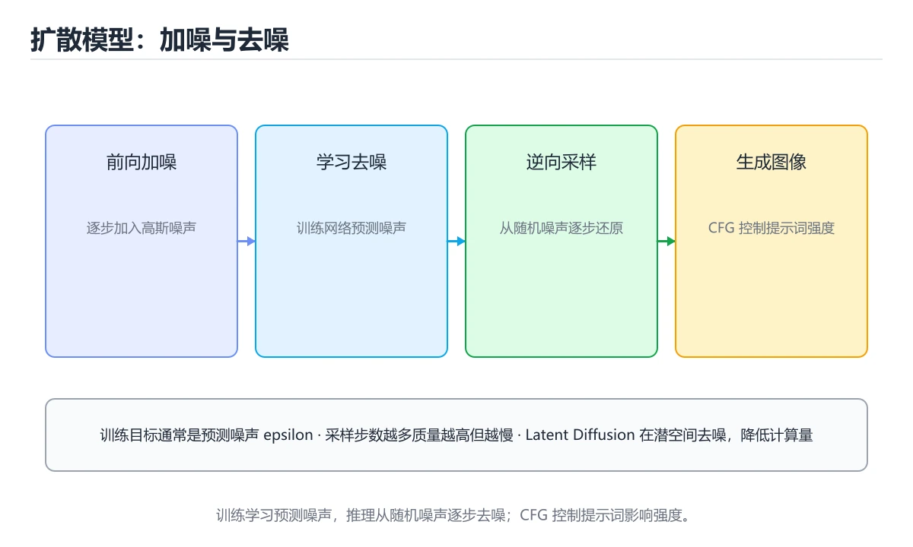
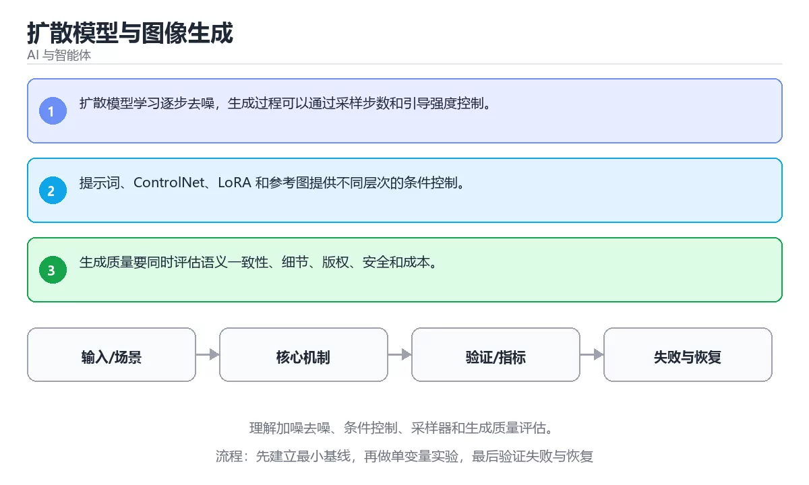

# 扩散模型与图像生成

> 内容更新时间：2026-10-06 · 学习阶段：进阶 · 预计用时：30 分钟





## 学习目标

- 能用自己的话解释：扩散模型学习逐步去噪，生成过程可以通过采样步数和引导强度控制。
- 能用自己的话解释：提示词、ControlNet、LoRA 和参考图提供不同层次的条件控制。
- 能用自己的话解释：生成质量要同时评估语义一致性、细节、版权、安全和成本。
- 能把本课知识放回「AI 与智能体」，并完成练习与测验。

## 前置知识

- 已完成「AI 与智能体」的基础课程，能运行正文中的最小示例。
- 本课关键词：扩散模型、图像生成、采样器、条件控制。
- 遇到不熟悉的术语先记录问题，完成练习后再回读。

## 核心知识

### 1. 扩散模型学习逐步去噪，生成过程可以通过采样步数和引导强度控制。

- 关键做法：先用最小示例建立基线，再逐步加入边界、失败和性能条件。
- 验证标准：结果可复现、错误可解释、边界有测试、失败能恢复。

### 2. 提示词、ControlNet、LoRA 和参考图提供不同层次的条件控制。

把这条结论放回「扩散模型与图像生成」的完整流程里展开：

- 正文依据：能用自己的话解释：扩散模型学习逐步去噪，生成过程可以通过采样步数和引导强度控制。
- 落地检查：把「2. 提示词、ControlNet、LoRA 和参考图提供不同层次的条件控制。」改写成一条可执行的核对项，逐条验证输入、超时与失败路径。

### 3. 生成质量要同时评估语义一致性、细节、版权、安全和成本。

把这条结论放回「扩散模型与图像生成」的完整流程里展开：

- 正文依据：能用自己的话解释：提示词、ControlNet、LoRA 和参考图提供不同层次的条件控制。
- 落地检查：把「3. 生成质量要同时评估语义一致性、细节、版权、安全和成本。」改写成一条可执行的核对项，逐条验证输入、超时与失败路径。

## 关键流程

```text
输入 → 校验 → 核心处理 → 验证 → 记录指标 → 失败恢复
```

## 实践路径

1. 用一句话复述本课要解决的问题。
2. 跑通正文中的最小示例并记录基线。
3. 只改变一个输入或参数，预测并验证结果。
4. 补一个失败路径，记录错误、恢复和指标。
5. 把结论写成可复现的笔记或测试。

## 常见误区

| 误区 | 后果 | 修正 |
| --- | --- | --- |
| 只记术语不做实验 | 遇到真实问题无法判断 | 用最小输入跑通并记录结果 |
| 只测正常路径 | 边界和故障上线才暴露 | 补空值、极值和依赖失败 |
| 没有基线就优化 | 无法证明改进有效 | 先测量再修改 |
| 忽略成本与安全 | 性能和风险失控 | 同时记录资源、权限与失败代价 |

## 动手练习

1. 合上教程，用 3～5 句话解释扩散模型与图像生成。
2. 从正文选一个例子，改变一个条件并预测结果。
3. 设计一个失败场景，写出止损与恢复步骤。

**验收标准**：留下输入、命令、输出、差异和下一步问题。

## 本课小结

- 本课属于「AI 与智能体」，核心关键词是 扩散模型、图像生成、采样器、条件控制。
- 先保证正确与可复现，再讨论性能和扩展。
- 完成练习和测验后，把仍然不确定的问题写成下一轮验证清单。

> 本课由 P1 内容扩展生成，重点补充原有课程缺失的主题与工程边界。

## 可运行练习

### 任务 1：先跑通，再解释

```python
def score(answer: str) -> int:
    return 1 if answer.strip() else 0

print(score("agent"))
```

### 任务 2：只改一个条件

把「扩散模型与图像生成」的最小示例复制一份，只改一个条件再跑一次：

- 改动点：只把扩散模型的输入换成空值、极值或错误输入，其余保持不变。
- 预测：先写下「扩散模型与图像生成」在改动后的输出或错误信息，再运行。
- 记录：对照改动前后的结果，指出差异出在哪一步。
- 验收：换回原条件能复现原结果，改动只影响扩散模型。

### 任务 3：迁移到自己的数据

用同一套思路处理一组你自己的数据或场景，保持输出格式与任务 1 一致。

## 故障现场

### 现场 1：本课的 扩散模型 常规用例通过，但边界用例失败

**症状**：在本课的练习或生产场景里出现“本课的 扩散模型 常规用例通过，但边界用例失败”。

**复现**：准备一组最小输入，只保留触发“本课的 扩散模型 常规用例通过，但边界用例失败”的必要条件，连续运行两次确认结果稳定。

**定位**：围绕“扩散模型 的前置条件与取值边界没有写进代码，默认值掩盖了空值和极值”检查调用链、输入数据和环境配置，先验证假设再改代码。

**预防**：把“本课的 扩散模型 常规用例通过，但边界用例失败”写成一条自动化用例，并在本课的验收清单里保留对应检查项。

### 现场 2：本课的 图像生成 结果在两次运行之间不一致

**症状**：在本课的练习或生产场景里出现“本课的 图像生成 结果在两次运行之间不一致”。

**复现**：准备一组最小输入，只保留触发“本课的 图像生成 结果在两次运行之间不一致”的必要条件，连续运行两次确认结果稳定。

**定位**：围绕“图像生成 依赖了当前版本、执行顺序或共享状态，单次运行无法暴露差异”检查调用链、输入数据和环境配置，先验证假设再改代码。

**预防**：把“本课的 图像生成 结果在两次运行之间不一致”写成一条自动化用例，并在本课的验收清单里保留对应检查项。

### 现场 3：离线评测分数很高，线上仍然频繁给出错误答案

**定位**：围绕“评测集与真实输入分布不一致，扩散模型 的提示词或检索结果没有覆盖失败场景”检查调用链、输入数据和环境配置，先验证假设再改代码。

## 深入补充：扩散模型与图像生成 的取舍与边界

### 一、把概念放回真实约束

学习扩散模型与图像生成时，最容易只记住结论而忽略前提。先写出三个约束：数据规模、时间预算、可接受的失败方式；再判断 扩散模型 与 图像生成 在这些约束下是否仍然成立。只要约束改变，原来的最优解就可能变成错误解。

| 维度 | 要回答的问题 | 常见做法 | 失败信号 |
| --- | --- | --- | --- |
| 数据 | 扩散模型 的训练或检索数据从哪来、质量如何 | 清洗、去重、标注与版本化 | 评测集泄漏或分布漂移 |
| 模型 | 图像生成 的能力边界与成本是多少 | 基线对比、离线评测、灰度发布 | 指标好看但线上任务失败 |
| 评测 | 如何证明改动真的有效 | 固定评测集、人工抽检、A/B | 只比较单例输出 |
| 安全 | 失败时会不会泄露或越权 | 权限校验、内容过滤、审计 | 提示注入或数据外泄 |

### 二、三个容易混淆的边界

1. 澄清输入与目标。先写清「扩散模型与图像生成」要解决的问题、合法输入范围和成功标准，再进入后续步骤。
2. **把“平均值”当成“全部”**：扩散模型 的指标好看，不代表尾部请求、冷启动或失败重试也好看。
3. **把“当前版本”当成“永久行为”**：图像生成 依赖的默认值、API 或性能特征都可能随版本变化，需要固定版本并保留回归用例。

### 三、一个生产场景

假设团队要在真实系统里使用扩散模型与图像生成：第一周先做小流量验证，记录 扩散模型 的基线与异常；第二周扩大输入规模，观察 图像生成 是否成为瓶颈；第三周再做故障演练，主动注入超时、重复请求和依赖不可用，确认系统能降级、能重试、能恢复。每一步都要留下指标、日志和结论，而不是只留下“感觉更快了”。

### 四、自测清单

- 能否用一句话说出扩散模型与图像生成解决的核心问题与不适用场景？
- 能否画出 扩散模型 的数据流或状态变化，并标出失败路径？
- 能否给出一个反例，证明某个看似合理的结论在边界条件下不成立？
- 能否写出一条可复现的验证命令，让别人独立得到相同结论？

### 五、AI 工程补充

在扩散模型与图像生成里，模型输出只是系统的一部分：输入要先经过权限与数据质量检查，检索或工具调用要有超时和降级，输出要经过引用核验或规则校验，最后记录 token、延迟、失败类型和人工反馈。评测时至少准备固定题、边界题和对抗题，并把 扩散模型 与 图像生成 的指标分开记录；否则一次提示词改动看似提升体验，实际可能只是评测样本泄漏或随机波动。

## 本课复习清单

离开本课前，逐项确认：

- [ ] 不看解析，能说出「关于，下列说法正确的是？」的判断依据。
- [ ] 不看解析，能说出「本课的核心学习目标是什么？」的判断依据。
- [ ] 至少运行一次本课示例，记录输入、输出和一个边界情况。
- [ ] 把本课最容易混淆的两个概念写成一句话对照。

| 复盘项 | 记录 |
| --- | --- |
| 已经能独立解释的考点 |  |
| 仍然说不清的概念 |  |
| 下一步验证动作 |  |

## 逐节复习与自检

下面按正文顺序回顾每一节，并给出一个自检问题；说不清的地方回到原章节补课。

### 核心知识

自检：这一节与相邻主题的边界在哪里？

### 动手练习

自检：如果去掉这一节里的一个前提，结论会怎样变化？

### 验证步骤

制造一次错误输入，记录错误信息与修复方式。

## 易错点回顾

- **关于，下列说法正确的是？**：正确答案是「扩散模型学习逐步去噪，生成过程可以通过采样步数和引导强度控制。
- **关于，下列说法正确的是？**：正确答案是「提示词、ControlNet、LoRA 和参考图提供不同层次的条件控制。
- **关于，下列说法正确的是？**：正确答案是「生成质量要同时评估语义一致性、细节、版权、安全和成本。
- **本课的核心学习目标是什么？**：正确答案是「理解加噪去噪、条件控制、采样器和生成质量评估。

## 深度追问与自测

### 追问 1：关于，下列说法正确的是？

- 先写下判断，再对照：扩散模型学习逐步去噪，生成过程可以通过采样步数和引导强度控制。
- 检查点：如果输入换成边界值，这个结论还需要补充哪个前提？

### 追问 2：关于，下列说法正确的是？

- 先写下判断，再对照：提示词、ControlNet、LoRA 和参考图提供不同层次的条件控制。

### 追问 3：关于，下列说法正确的是？

- 先写下判断，再对照：生成质量要同时评估语义一致性、细节、版权、安全和成本。

### 追问 4：本课的核心学习目标是什么？

- 先写下判断，再对照：理解加噪去噪、条件控制、采样器和生成质量评估。

### 追问 5：以下哪些术语与扩散模型与图像生成直接相关？（多选）

- 先写下判断，再对照：扩散模型、图像生成

## 术语速查

| 术语 | 本课语境 |
| --- | --- |
| `扩散模型` | 围绕“评测集与真实输入分布不一致，扩散模型 的提示词或检索结果没有覆盖失败场景”检查调用链、输入数据和环境配置，先验证假设再改代码。 |
| `图像生成` | 围绕“图像生成 依赖了当前版本、执行顺序或共享状态，单次运行无法暴露差异”检查调用链、输入数据和环境配置，先验证假设再改代码。 |
| `采样器` | 按“扩散模型与图像生成”中 扩散模型、图像生成、采样器 的实践顺序，把四个步骤排成从准备到复盘的合理顺序。 |
| `条件控制` | 用一句话说明「扩散模型与图像生成」解决什么问题：理解加噪去噪、条件控制、采样器和生成质量评估。 |

## 零基础精讲：把扩散模型与图像生成真正讲透

### 先建立一个直觉

把 AI 系统看成一条流水线：数据进入模型，模型产生候选结果，工具与策略再决定哪些结果能真正执行。每个环节都要有可测的输入、输出和失败处理。

本课的摘要可以当作一张地图：理解加噪去噪、条件控制、采样器和生成质量评估。

### 逐步拆解

1. 澄清输入与目标。先写清「扩散模型与图像生成」要解决的问题、合法输入范围和成功标准，再进入后续步骤。
2. 描述处理过程。把「扩散模型、图像生成、采样器、条件控制」映射到具体步骤，每步都要求能单独验证。
3. 定义输出。输出不仅包括正常结果，还包括错误码、日志、指标和资源释放状态。
4. 找出一条失败路径。让错误尽早暴露，并说明重试、降级、回滚或人工处理的边界。
5. 用一个小例子贯穿全过程。先手算或预测结果，再运行代码或实验，最后解释差异。

### 把正文串成一条执行链

- **1. 扩散模型学习逐步去噪，生成过程可以通过采样步数和引导强度控制。**：在「扩散模型与图像生成」里，「1. 扩散模型学习逐步去噪，生成过程可以通过采样步数和引导强度控制。」这一步要先写清输入与预期，再记录实际结果和差异；结果不符时回到对应小节核对前提。
- **2. 提示词、ControlNet、LoRA 和参考图提供不同层次的条件控制。**：在「扩散模型与图像生成」里，「2. 提示词、ControlNet、LoRA 和参考图提供不同层次的条件控制。」这一步要先写清输入与预期，再记录实际结果和差异；结果不符时回到对应小节核对前提。
- **3. 生成质量要同时评估语义一致性、细节、版权、安全和成本。**：在「扩散模型与图像生成」里，「3. 生成质量要同时评估语义一致性、细节、版权、安全和成本。」这一步要先写清输入与预期，再记录实际结果和差异；结果不符时回到对应小节核对前提。
- **考点 1：关于，下列说法正确的是？**：针对「扩散模型与图像生成」，先自问「关于，下列说法正确的是」；作答后回到对应考点核对判断依据。
- **考点 2：关于，下列说法正确的是？**：针对「扩散模型与图像生成」，先自问「关于，下列说法正确的是」；作答后回到对应考点核对判断依据。
- **考点 3：关于，下列说法正确的是？**：针对「扩散模型与图像生成」，先自问「关于，下列说法正确的是」；作答后回到对应考点核对判断依据。

### 从测验反推易错点

**检查点 1：关于，下列说法正确的是？**

- 参考判断：扩散模型学习逐步去噪，生成过程可以通过采样步数和引导强度控制。
- 自问：如果去掉题干里的一个限定词，结论还成立吗？

**检查点 2：关于，下列说法正确的是？**

- 参考判断：提示词、ControlNet、LoRA 和参考图提供不同层次的条件控制。

**检查点 3：关于，下列说法正确的是？**

- 参考判断：生成质量要同时评估语义一致性、细节、版权、安全和成本。

**检查点 4：本课的核心学习目标是什么？**

- 参考判断：理解加噪去噪、条件控制、采样器和生成质量评估。

**检查点 5：以下哪些术语与扩散模型与图像生成直接相关？（多选）**

- 参考判断：扩散模型、图像生成

### 工程排错顺序

| 先查什么 | 要得到的证据 | 判断标准 |
| --- | --- | --- |
| 模型输入是否经过长度、格式与敏感信息检查？ | 日志、输入样例、测试或指标 | 能复现并解释，才算定位 |
| 工具调用是否最小权限、可超时、可取消？ | 日志、输入样例、测试或指标 | 能复现并解释，才算定位 |
| 输出是否有引用、置信度或人工复核兜底？ | 日志、输入样例、测试或指标 | 能复现并解释，才算定位 |
| 成本、延迟与失败率是否有指标？ | 日志、输入样例、测试或指标 | 能复现并解释，才算定位 |

### 变式训练

1. 把它放进一个只有单机、没有额外依赖的小项目，先保证正确，再考虑扩展。
2. 把输入规模扩大十倍，记录时间、内存和失败路径，找出第一个真正瓶颈。
3. 制造一次依赖超时或错误输入，要求系统给出可解释错误并且不留下半完成状态。
5. 删掉一个看似必要的步骤，观察哪个测试或指标先失败，用证据说明它为什么必要。
6. 把方案切换到低资源设备，重新评估默认参数、超时和降级策略。

### 本课自测

- [ ] 能用一句话解释「扩散模型」在本课中的角色与边界。
- [ ] 能举出一个正常例子和一个失败例子。
- [ ] 能说出最小验证步骤，以及需要记录的证据。
- [ ] 能用一句话解释「图像生成」在本课中的角色与边界。
- [ ] 能用一句话解释「采样器」在本课中的角色与边界。
- [ ] 能用一句话解释「条件控制」在本课中的角色与边界。

### 迁移案例库

下面用不同约束重复同一套方法。每完成一轮，都把结论写进笔记，并只改变一个变量。

#### 迁移案例 1：围绕「扩散模型」做一次小实验

**目标**：在不改变课程主体的前提下，验证扩散模型与图像生成中的一个关键判断。

**步骤**：
1. 复述当前方案对「扩散模型」的假设，写成一句可证伪的话。
2. 设计一个正常输入和一个边界输入，分别预测输出。
3. 运行或逐步演算，记录实际输出、耗时和失败信息。
4. 只调整一个参数，比较前后差异并解释原因。
5. 补充一条测试或复习卡，确保下次能更快复现。

**验收**：结论有证据、差异可解释、失败可恢复；如果做不到，说明还需要缩小问题范围。

#### 迁移案例 2：围绕「图像生成」做一次小实验

**步骤**：
1. 复述当前方案对「图像生成」的假设，写成一句可证伪的话。

#### 迁移案例 3：围绕「采样器」做一次小实验

**步骤**：
1. 复述当前方案对「采样器」的假设，写成一句可证伪的话。

#### 迁移案例 4：围绕「条件控制」做一次小实验

**步骤**：
1. 复述当前方案对「条件控制」的假设，写成一句可证伪的话。

#### 迁移案例 5：围绕「扩散模型」做一次小实验

**步骤**：

#### 迁移案例 6：围绕「图像生成」做一次小实验

**步骤**：

#### 迁移案例 7：围绕「采样器」做一次小实验

**步骤**：

#### 迁移案例 8：围绕「条件控制」做一次小实验

**步骤**：

#### 迁移案例 9：围绕「扩散模型」做一次小实验

**步骤**：

#### 迁移案例 10：围绕「图像生成」做一次小实验

**步骤**：

#### 迁移案例 11：围绕「采样器」做一次小实验

**步骤**：

#### 迁移案例 12：围绕「条件控制」做一次小实验

**步骤**：

#### 迁移案例 13：围绕「扩散模型」做一次小实验

**步骤**：

#### 迁移案例 14：围绕「图像生成」做一次小实验

**步骤**：

#### 迁移案例 15：围绕「采样器」做一次小实验

**步骤**：

#### 迁移案例 16：围绕「条件控制」做一次小实验

**步骤**：

<!-- p0-depth-v2:end -->

## 考点精讲

### 考点 1：顺序排列·扩散模型

- **题目**：按“扩散模型与图像生成”中 扩散模型、图像生成、采样器 的实践顺序，把四个步骤排成从准备到复盘的合理顺序。
- **判断依据**：题干的正确项是固定版本与证据，把“扩散模型与图像生成”的结论写成可复现记录。在「扩散模型与图像生成」里，在本课的练习里，顺序应当是：先明确 扩散模型 的输入、输出与约束 → 写出最小示例并核对 图像生成 的基线结果 → 只改一个变量，记录边界与失败路径的变化 → 固定版本与证据，把本课的结论写成可复现记录。这个顺序把 扩散模型 的输入、输出和约束放在最前面，在扩散模型与图像生成里避免概念没对齐就开始调参。第二步用 图像生成 建立可核对的基线，在扩散模型与图像生成里第三步才允许改变一个变量并观察失败路径。

### 考点 2：代码补全·扩散模型

- **题目**：阅读「扩散模型与图像生成」正文里的这段 Python 代码，下面哪一项判断是正确的？
- **判断依据**：在「扩散模型与图像生成」里，题干的正确项是这段代码把主要逻辑封装在函数或方法里，需要被调用才会执行，在「扩散模型与图像生成」里封装边界决定扩散模型从哪一步开始生效。把输入或边界换成空值、极值或失败情况后，结论要以「扩散模型与图像生成」的实际运行结果为准。在「扩散模型与图像生成」里判断这道题，要把扩散模型、图像生成、采样器的条件、过程与失败路径逐项对齐，换成“阅读扩散模型与图像生成正文里的这段”这个场景，只有满足前提的结论才成立。

### 考点 3：概念判断·扩散模型

- **题目**：关于「生成质量要同时评估语义一致性、细节、版权、安全和成本。」，下列说法正确的是？
- **判断依据**：在「扩散模型与图像生成」里，生成质量要同时评估语义一致性、细节、版权、安全和成本。在「扩散模型与图像生成」里判断这道题，要把扩散模型、图像生成、采样器的条件、过程与失败路径逐项对齐，换成“关于生成质量要同时评估语义一致性、细”这个场景，只有满足前提的结论才成立。回到「扩散模型与图像生成」的正文示例，用“关于生成质量要同时评估语义一致性、细”走一遍扩散模型、图像生成、采样器的完整流程，能复现的结论才可以保留。

### 考点 4：概念判断·扩散模型

- **题目**：「扩散模型与图像生成」的核心学习目标是什么？
- **判断依据**：在「扩散模型与图像生成」里，这道题要求区分概念与边界，理解加噪去噪、条件控制、采样器和生成质量评估。这道题的关键在「扩散模型与图像生成」的扩散模型、图像生成、采样器：先确认题干“扩散模型与图像生成的核心学习目标是什”问的是哪一步，再排除偷换前提的选项。这道题的关键在扩散模型、图像生成、采样器：先确认题干“的核心学习目标是什么”问的是哪一步，再排除偷换前提的选项。

### 考点 5：多选辨析·扩散模型

- **题目**：以下哪些术语与「扩散模型与图像生成」直接相关？（多选）
- **判断依据**：这道题的关键在「扩散模型与图像生成」的扩散模型、图像生成、采样器：先确认题干“以下哪些术语与扩散模型与图像生成直接”问的是哪一步，再排除偷换前提的选项。回到扩散模型、图像生成、采样器本身再看一遍：只有“扩散模型”与题干“以下哪些术语与直接相关（多选）”的前提一致，结论才成立。

## English Overview

**Title:** Diffusion Models and Image Generation

**Summary:** Understand noise-denoising, conditioning, samplers and generation quality.

**Category:** AI & Agents
**Level:** 高级
**Key terms:** 扩散模型, 图像生成, 采样器, 条件控制

## 内容元数据

- 内容版本：v2.0
- 最后更新：2026-10-06
- 学习阶段：进阶
- 适用环境：主流大模型 API、开源模型与向量数据库
- 内容来源：内置结构化课程与工程实践整理
- 相关主题：扩散模型、图像生成、采样器、条件控制
- 质量版本：P0 测验标准 + P1 覆盖扩展 + P2 体验补全

## 最小可运行示例

下面示例用于验证本课的最小输入、处理和输出。先原样运行，再只修改一个值：

```python
def score(answer: str) -> int:
    return 1 if answer.strip() else 0

print(score("agent"))
```

## 预期输出

```text
1
```

## 验证步骤

1. 记录运行环境、命令和真实输出。
2. 修改一个输入，先写预测再运行。
4. 把结论写回本课笔记或测试用例。

## 参考资料与复核

- 最后复核：2026-10-04
- 下次复核：2027-04-04
- 复核范围：版本兼容、API 行为、安全建议与工程实践
- 来源性质：官方文档、标准或权威教材；正文为离线教学重组

| 参考资料 | 本课用途 |
| --- | --- |
| [OpenAI Cookbook](https://cookbook.openai.com/) | RAG、Agent 与工程示例 |
| [LlamaIndex 文档](https://docs.llamaindex.ai/) | 索引、检索与数据框架 |
| [TensorFlow 文档](https://www.tensorflow.org/api_docs) | 模型构建与部署 |

> 「扩散模型与图像生成」的链接用于离线阅读后的延伸核对；App 不会自动联网。

## 复习与迁移

复习目标：把「扩散模型与图像生成」的判断标准放回可复现的例子里。先自己作答，再对照依据；如果结论正确但理由不完整，回到正文补足前提。

### 概念复述

- 用一句话说明「扩散模型与图像生成」解决什么问题：理解加噪去噪、条件控制、采样器和生成质量评估。
- 写出扩散模型、图像生成、采样器之间的关系，并各举一个例子。
- 说出本课最容易混淆的两个概念，以及区分它们的判据。

### 正文逐节复核

- **深入补充：扩散模型与图像生成 的取舍与边界**：学习扩散模型与图像生成时，最容易只记住结论而忽略前提。
- **零基础精讲：把扩散模型与图像生成真正讲透**：本课的摘要可以当作一张地图：理解加噪去噪、条件控制、采样器和生成质量评估。

### 测验回顾

1. 按“扩散模型与图像生成”中 扩散模型、图像生成、采样器 的实践顺序，把四个步骤排成从准备到复盘的合理顺序。
   - 依据：题干的正确项是固定版本与证据，把“扩散模型与图像生成”的结论写成可复现记录。在「扩散模型与图像生成」里，在本课的练习里，顺序应当是：先明确 扩散模型 的输入、输出与约束 → 写出最小示例并核对 图像生成 的基线结果 → 只改一个变量，记录边界与失败路径的变化 → 固定版本与证据，把本课的结论写成可复现记录。这个顺序把 扩散模型 的输入、输出和约束放在最前面，在扩散模型与图像生成里避免概念没对齐就开始调参。第二步用 图像生成 建立可核对的基线，在扩散模型与图像生成里第三步才允许改变一个变量并观察失败路径。
2. 阅读「扩散模型与图像生成」正文里的这段 Python 代码，下面哪一项判断是正确的？
   - 依据：在「扩散模型与图像生成」里，题干的正确项是这段代码把主要逻辑封装在函数或方法里，需要被调用才会执行，在「扩散模型与图像生成」里封装边界决定扩散模型从哪一步开始生效。把输入或边界换成空值、极值或失败情况后，结论要以「扩散模型与图像生成」的实际运行结果为准。在「扩散模型与图像生成」里判断这道题，要把扩散模型、图像生成、采样器的条件、过程与失败路径逐项对齐，换成“阅读扩散模型与图像生成正文里的这段”这个场景，只有满足前提的结论才成立。
3. 关于「生成质量要同时评估语义一致性、细节、版权、安全和成本。」，下列说法正确的是？
   - 依据：在「扩散模型与图像生成」里，生成质量要同时评估语义一致性、细节、版权、安全和成本。在「扩散模型与图像生成」里判断这道题，要把扩散模型、图像生成、采样器的条件、过程与失败路径逐项对齐，换成“关于生成质量要同时评估语义一致性、细”这个场景，只有满足前提的结论才成立。回到「扩散模型与图像生成」的正文示例，用“关于生成质量要同时评估语义一致性、细”走一遍扩散模型、图像生成、采样器的完整流程，能复现的结论才可以保留。
4. 「扩散模型与图像生成」的核心学习目标是什么？
   - 依据：在「扩散模型与图像生成」里，这道题要求区分概念与边界，理解加噪去噪、条件控制、采样器和生成质量评估。这道题的关键在「扩散模型与图像生成」的扩散模型、图像生成、采样器：先确认题干“扩散模型与图像生成的核心学习目标是什”问的是哪一步，再排除偷换前提的选项。这道题的关键在扩散模型、图像生成、采样器：先确认题干“的核心学习目标是什么”问的是哪一步，再排除偷换前提的选项。
5. 以下哪些术语与「扩散模型与图像生成」直接相关？（多选）
   - 依据：这道题的关键在「扩散模型与图像生成」的扩散模型、图像生成、采样器：先确认题干“以下哪些术语与扩散模型与图像生成直接”问的是哪一步，再排除偷换前提的选项。回到扩散模型、图像生成、采样器本身再看一遍：只有“扩散模型”与题干“以下哪些术语与直接相关（多选）”的前提一致，结论才成立。

### 迁移练习

把「扩散模型与图像生成」的结论迁移到相邻主题，每次迁移都写清预测与证据：

1. 换输入：用扩散模型处理一组你自己的数据，对比教材示例的结果差异。
2. 换失败条件：制造一个图像生成相关的错误，说明如何从错误信息定位根因。
3. 换规模：把数据量或并发度提高一个数量级，说明「扩散模型与图像生成」的结论是否仍成立。
