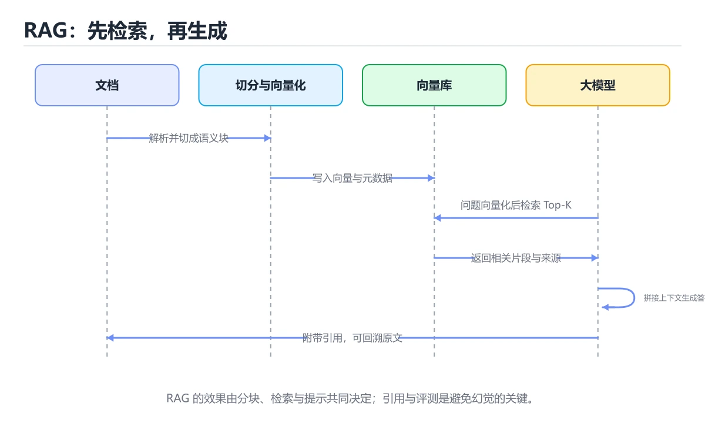
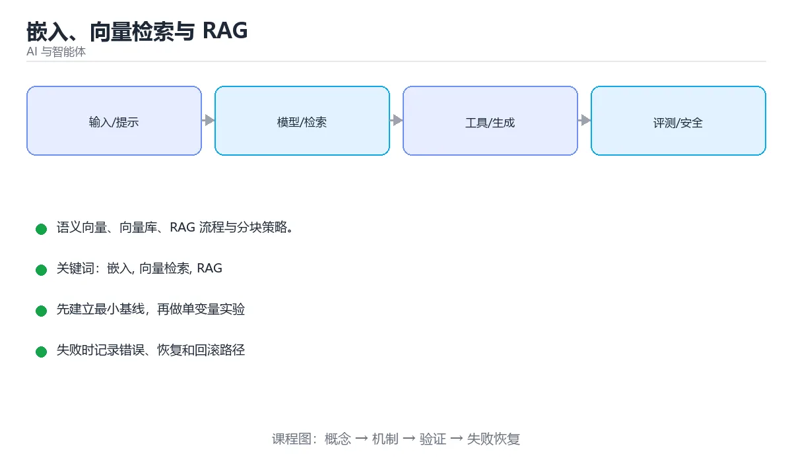

# 嵌入、向量检索与 RAG

> 内容更新时间：2026-10-06 · 学习阶段：进阶 · 预计用时：45 分钟





## 本节知识框架

**课程定位**：所属分类 `ai`（AI 与智能体），课程主题 `嵌入、向量检索与 RAG`，学习阶段 进阶，建议用时 45 分钟。

本课主线：语义向量、向量库、RAG 流程与分块策略。

**学完本课应当能够**
- 说清 `嵌入` 与 `向量检索` 的含义与区别，并各举一个正例和一个反例。
- 用本课示例验证 `RAG` 的行为，记录输入、输出与失败条件。
- 遇到「查询与文档用不同嵌入模型」这类问题时，能说出触发条件与修复顺序。

### 从概念到验证的学习链条

1. `嵌入`：先掌握 把文本、图像等对象映射成保留语义关系的稠密向量，再用它解释 `向量检索` 为什么会出现。
2. `向量检索`：先掌握 把文本、图像等编码成向量，并按相似度快速找出语义最接近的条目，再用它解释 `RAG` 为什么会出现。
3. `RAG`：先掌握 先检索外部知识，再把证据与问题一起交给模型生成可引用的回答，再用它解释 `分块` 为什么会出现。
4. `分块`：先掌握 把长文档切成适合嵌入和检索的片段，并保留必要的上下文重叠，再用它解释 `重排序` 为什么会出现。
5. `重排序`：先掌握 对初步召回的候选重新计算更精确的相关性分数，以提高最终排序质量，再用它解释 本课示例的观察结果 为什么会出现。

**先修与衔接**：本课是「AI 与智能体」分类的第 8 课。先修内容：《提示工程》。《提示工程》里的 `提示词`、`few-shot` 是本课的前提。相关或后续课程：《AI Agent 基础》、《图解 RAG 检索增强生成流程》、《图解向量检索与 HNSW 索引》、《实战：本地 RAG 客服 Agent》。

### 完成判据

- **定义关**：不看正文也能说明 `嵌入` 是 把文本、图像等对象映射成保留语义关系的稠密向量，并指出一个反例。
- **机制关**：能按“输入 → 转换 → 输出 → 验证”复述 `嵌入、向量检索与 RAG`，而不是只背结论。
- **示例关**：能运行或推演 `嵌入、向量检索与 RAG` 的 `text` 示例，并说明一个真实出现的标识符或字面量。
- **证据关**：能指出 `嵌入、向量检索与 RAG` 示例里的 调用了 `answer()`，并说明它支持或反驳了本课的哪一条结论。
- **排错关**：能复现 查询与文档用不同嵌入模型，记录现象并按 统一模型与版本 修复。
- **迁移关**：能把 `嵌入`、`向量检索`、`RAG`、`分块` 放进一个与 `嵌入、向量检索与 RAG` 不同的项目场景，并保持输入与验证条件可追踪。
- **复盘关**：学完 `嵌入、向量检索与 RAG` 后，用一句话写下仍然不确定的结论，并列出下一次验证需要的输入、环境和成功判据。

### 复习清单

- [ ] 能不看正文复述本课核心术语，并指出一个边界或反例。
- [ ] 能运行或推演本课示例，记录输入、输出与失败现象。
- [ ] 能完成一次自测，并把错题对照错误表定位原因。

## 核心概念定义

| 术语 | 操作性定义 | 常见边界与风险 |
| --- | --- | --- |
| 嵌入 | 把文本、图像等对象映射成保留语义关系的稠密向量。 | 易错：检索结果随机；正确做法是统一模型与版本。 |
| 向量检索 | 把文本、图像等编码成向量，并按相似度快速找出语义最接近的条目。 | 换编码、换字节序或换平台都可能改变结果，处理前先固定输入编码。 |
| RAG | 先检索外部知识，再把证据与问题一起交给模型生成可引用的回答。 | 越界、悬垂引用与释放顺序会破坏结论，必须在边界输入下复验。 |
| 分块 | 把长文档切成适合嵌入和检索的片段，并保留必要的上下文重叠。 | 易错：检索噪声多；正确做法是300 到 800 Token，加重叠。 |
| 重排序 | 对初步召回的候选重新计算更精确的相关性分数，以提高最终排序质量。 | 只在「对初步召回的候选重新计算更精确的相关性分数，以提高最终排序质量」这一前提下成立，换输入或换环境要重新验证。 |

## 原理与运行机制

### 机制总览

**教材衔接：向量数据库**

| 方案 | 特点 |
| --- | --- |
| FAISS | 单机库，速度快，适合原型与离线检索 |
| Chroma | 轻量、易用，适合小规模本地应用 |
| pgvector | 直接长在 PostgreSQL 上，省一套运维 |
| Milvus / Qdrant / Pinecone | 面向大规模或托管场景 |

检索流程：查询向量化 → 近似最近邻搜索（ANN）→ 取 Top-K → 可选重排序（Rerank）。

**教材衔接：分块策略**

| 策略 | 适用 |
| --- | --- |
| 固定长度 + 重叠 | 通用，简单可靠 |
| 按标题/段落切分 | 结构化文档，语义完整 |
| 按代码/表格切分 | 技术文档，保持语法完整 |
| 父子块（小块检索、大块喂给模型） | 兼顾检索精度与上下文完整性 |

块太大噪声多，太小语义不完整；常见起点是 300~800 token，重叠 10%~20%。

**教材衔接：影响效果的关键点**

1. 检索质量比提示词更重要——检索不到，模型只能编。
2. 加入重排序（cross-encoder）通常能明显提升 Top-K 质量。
3. 必须做引用与溯源，便于用户核实。
4. 混合检索（关键词 BM25 + 向量）对专有名词与代码更友好。
5. 定期评测：命中率、答案正确率、引用准确率。

**教材衔接：评测脚本要点**

1. 准备四类用例：可直接查到、需跨文档综合、无答案、含对抗性表述（提示注入）。
2. 每条记录：问题、标准答案要点、期望命中的文档 ID。
3. 自动指标：命中率（Top-K 是否包含期望文档）、要点覆盖率、引用准确率、无答案问题的正确拒答率。
4. 用 LLM-as-Judge 打分后**人工抽检校准**，避免评审判偏。
5. 每次改分块、改嵌入模型、改提示后重跑同一套用例并对比，形成回归。

把这套脚本接进 CI，就能避免"改一次提示、感觉变好了、实际变差"的常见陷阱。

**教材衔接：混合检索与重排的调参**

**为什么需要混合**：向量检索擅长语义相似（"怎么退货" ↔ "退款流程"），但对专有名词、代码标识符、型号编号容易失手；关键词检索（BM25）恰好相反。两者互补。

| 方案 | 优点 | 缺点 |
| --- | --- | --- |
| 纯向量 | 语义泛化好 | 稀有词/精确匹配弱 |
| 纯 BM25 | 精确匹配强、速度快 | 不理解同义与改写 |
| 混合 + 重排 | 召回与精度兼顾 | 链路更长、延迟与成本增加 |

**融合策略**：常见做法是两路各取 Top-20，用 RRF（倒数排名融合）合并——只看名次不看分数，避免两路分数量纲不可比的问题。RRF 的核心参数是常数 k（常用 60），k 越大越弱化头部差异。

**两阶段检索的阈值调参**：

1. 粗排召回 Top-K：K 太小会漏（召回率低），太大会引入噪声，建议从 20 起调。
2. 重排后取 Top-N 喂给模型：N 常取 3~5，取决于上下文预算。
3. 相似度阈值：低于阈值直接判"资料中没有"，**这个阈值必须用评测集标定**（不同嵌入模型的分数分布差异极大，不能照搬别人的 0.8）。
4. 用「命中率」与「答案正确率」两条曲线判断：K 增大命中率上升但正确率可能下降，取两者都较好的区间。

评测方法：固定问题集，分别跑纯向量、纯 BM25、混合、混合+重排四种配置，对比命中率、答案正确率、P95 延迟与每问成本，用数据决定是否值得引入重排。

**教材衔接：RAG 链路速查**

| 阶段 | 关键决策 | 常见做法 |
| --- | --- | --- |
| 解析 | 保留结构与页码 | PDF 解析、表格结构化 |
| 分块 | 粒度与重叠 | 300 到 800 Token，重叠 10% 到 20% |
| 嵌入 | 模型与维度 | 中文优先选中文或多语模型 |
| 存储 | 向量库与元数据 | 向量 + 文档 ID + 位置 + 权限 |
| 检索 | 召回策略 | 向量 + 关键词混合，取 top 20 到 50 |
| 重排 | 精排 | Cross-Encoder 取 top 3 到 8 |
| 生成 | 提示构造 | 片段编号 + 要求引用 |
| 评测 | 命中与作答 | 召回率、忠实度、引用准确率 |

**教材衔接：深入补充：嵌入、向量检索与 RAG 的取舍与边界**


### 机制拆解：每一步的输入、动作与输出

#### 1. `嵌入`
- 输入：`嵌入`；本步把 把文本、图像等对象映射成保留语义关系的稠密向量 当作判断规则。
- 动作：围绕 `嵌入` 保留中间状态，并记录它与 `向量检索` 的对应关系。
- 输出：`向量检索`，它可以被下一段代码、测试或记录继续使用。
- `嵌入` 的失败条件：当查询与文档用不同嵌入模型时，会出现检索结果随机。

#### 2. `向量检索`
- 输入：`嵌入`；本步把 把文本、图像等编码成向量，并按相似度快速找出语义最接近的条目 当作判断规则。
- 动作：围绕 `向量检索` 保留中间状态，并记录它与 `RAG` 的对应关系。
- 输出：`RAG`，它可以被下一段代码、测试或记录继续使用。
- `向量检索` 的失败条件：换编码、换字节序或换平台都可能改变结果，处理前先固定输入编码。

#### 3. `RAG`
- 输入：`向量检索`；本步把 先检索外部知识，再把证据与问题一起交给模型生成可引用的回答 当作判断规则。
- 动作：围绕 `RAG` 保留中间状态，并记录它与 `分块` 的对应关系。
- 输出：`分块`，它可以被下一段代码、测试或记录继续使用。
- `RAG` 的失败条件：越界、悬垂引用与释放顺序会破坏结论，必须在边界输入下复验。

#### 4. `分块`
- 输入：`RAG`；本步把 把长文档切成适合嵌入和检索的片段，并保留必要的上下文重叠 当作判断规则。
- 动作：围绕 `分块` 保留中间状态，并记录它与 `重排序` 的对应关系。
- 输出：`重排序`，它可以被下一段代码、测试或记录继续使用。
- `分块` 的失败条件：当分块过大时，会出现检索噪声多。

#### 5. `重排序`
- 输入：`分块`；本步把 对初步召回的候选重新计算更精确的相关性分数，以提高最终排序质量 当作判断规则。
- 动作：围绕 `重排序` 保留中间状态，并记录它与 `answer` 的对应关系。
- 输出：`answer`，它可以被下一段代码、测试或记录继续使用。
- `重排序` 的失败条件：只在「对初步召回的候选重新计算更精确的相关性分数，以提高最终排序质量」这一前提下成立，换输入或换环境要重新验证。

### 示例中的可观察事实

1. 调用了 `answer()`；它对应的课程主题是 `嵌入、向量检索与 RAG`。
2. 调用了 `embed()`；它对应的课程主题是 `嵌入、向量检索与 RAG`。
3. 调用了 `search()`；它对应的课程主题是 `嵌入、向量检索与 RAG`。
4. 调用了 `join()`；它对应的课程主题是 `嵌入、向量检索与 RAG`。
5. 调用了 `enumerate()`；它对应的课程主题是 `嵌入、向量检索与 RAG`。
6. 调用了 `llm()`；它对应的课程主题是 `嵌入、向量检索与 RAG`。
7. 出现字面量 `[{i+1}] {c.text}`；它对应的课程主题是 `嵌入、向量检索与 RAG`。
8. 调用了 `OpenAI()`；它对应的课程主题是 `嵌入、向量检索与 RAG`。

### 复现实验记录

- 环境：`嵌入、向量检索与 RAG` 使用 `text` 示例，固定 `嵌入`、`向量检索`、`RAG`、`分块` 作为第一组条件。
- 首轮输入：先确认 调用了 `answer()`，预测 `嵌入` 会怎样变化。
- 基线观察：记录命令、输入、输出和错误原文，不用截图代替可复制的文本。
- 单变量修改：只改变 `嵌入`，观察 `重排序` 是否仍满足定义。
- 失败注入：复现 查询与文档用不同嵌入模型，确认现象是 检索结果随机。
- 记录结论：把“修改前、修改后、预期变化、实际变化”写成四列表，这样复盘 `嵌入、向量检索与 RAG` 时才能区分概念错误与实现错误。

## 典型应用场景

- **查询与文档用不同嵌入模型**：典型现象是检索结果随机；正确做法是统一模型与版本。
- **分块过大**：典型现象是检索噪声多；正确做法是300 到 800 Token，加重叠。
- **分块过小**：典型现象是语义断裂；正确做法是保留标题与上下文前缀。
- **不做重排**：典型现象是相关性不足；正确做法是向量召回后加 Cross-Encoder 精排。

### 最小验证场景

- 准备：保留 `text` 示例的原始输入，先记录 `嵌入、向量检索与 RAG` 的基线输出和完整运行命令。
- 观察：先核对 调用了 `answer()`，再改变一个与 `嵌入` 相关的条件。
- 判定：新结果与 `嵌入、向量检索与 RAG` 的基线不同不等于错误；只有当差异破坏了 `嵌入` 的定义或错误表中的约束，才判定为失败。

### 选择与边界

- 使用 `嵌入` 时，先满足它的定义：把文本、图像等对象映射成保留语义关系的稠密向量；易错：检索结果随机；正确做法是统一模型与版本。
- 使用 `向量检索` 时，先满足它的定义：把文本、图像等编码成向量，并按相似度快速找出语义最接近的条目；换编码、换字节序或换平台都可能改变结果，处理前先固定输入编码。
- 使用 `RAG` 时，先满足它的定义：先检索外部知识，再把证据与问题一起交给模型生成可引用的回答；越界、悬垂引用与释放顺序会破坏结论，必须在边界输入下复验。
- 使用 `分块` 时，先满足它的定义：把长文档切成适合嵌入和检索的片段，并保留必要的上下文重叠；易错：检索噪声多；正确做法是300 到 800 Token，加重叠。
- 使用 `重排序` 时，先满足它的定义：对初步召回的候选重新计算更精确的相关性分数，以提高最终排序质量；只在「对初步召回的候选重新计算更精确的相关性分数，以提高最终排序质量」这一前提下成立，换输入或换环境要重新验证。

## 代码/协议/SQL 示例

**教材衔接：嵌入：把文本变成向量**

嵌入模型把文本映射成高维向量，语义相近的文本在向量空间中距离更近。

```python
from openai import OpenAI
client = OpenAI()
response = client.embeddings.create(
    model="text-embedding-3-small",
    input=["二分查找的时间复杂度", "二分法查找效率"],
)
v1, v2 = [item.embedding for item in response.data]
```

相似度常用**余弦相似度**（只看向量方向，与长度无关）：

```text
cos(a, b) = (a · b) / (|a| × |b|)      越接近 1 越相似
```

**教材衔接：可直接套用的提示模板**

```text
角色：你是严谨的技术文档助手。
要求：
1. 仅依据【资料】回答，不要使用资料之外的知识。
2. 资料不足时明确回答「资料中没有相关信息」，不要猜测。
3. 引用格式：[编号]，如 [1][3]，编号对应【资料】中的序号。
4. 涉及数字、版本号、参数时，必须与资料原文完全一致。
5. 回答先给结论，再给依据，最后列出引用来源。

【资料】
[1] ……
[2] ……

【问题】{question}
```

模板的价值在于**把约束显式化**：限定来源、规定引用、要求一致、禁止编造。生产环境还要配合长度限制、敏感词过滤与超时降级。

**教材衔接：相似度速查**

| 度量 | 公式直觉 | 适用 |
| --- | --- | --- |
| 余弦相似度 | 看方向夹角 | 文本嵌入（最常用） |
| 点积 | 方向与长度都算 | 归一化后等价于余弦 |
| 欧氏距离 | 看空间距离 | 图像特征 |
| 内积最大值搜索（MIPS） | 最大内积 | 推荐与检索 |

重要前提：**查询与文档必须使用同一个嵌入模型与同一版本**，否则向量空间不一致。

```python
import math
from dataclasses import dataclass

def cosine_similarity(a: list[float], b: list[float]) -> float:
    dot = sum(x * y for x, y in zip(a, b))
    norm_a = math.sqrt(sum(x * x for x in a))
    norm_b = math.sqrt(sum(y * y for y in b))
    return 0.0 if norm_a == 0 or norm_b == 0 else dot / (norm_a * norm_b)

@dataclass
class Chunk:
    doc_id: str
    position: int
    text: str
    vector: list[float]
    metadata: dict

def hybrid_score(vector_score: float, keyword_score: float, alpha: float = 0.7) -> float:
    """混合检索：向量分与关键词分加权，alpha 控制偏向。"""
    return alpha * vector_score + (1 - alpha) * keyword_score

def retrieve(query_vec, chunks, top_k=5, filters=None, alpha=0.7, keyword_fn=None):
    """带元数据过滤与混合打分的检索。"""
    scored = []
    for chunk in chunks:
        if filters and not all(chunk.metadata.get(k) == v for k, v in filters.items()):
            continue
        vector_score = cosine_similarity(query_vec, chunk.vector)
        keyword_score = keyword_fn(chunk.text) if keyword_fn else 0.0
        scored.append((hybrid_score(vector_score, keyword_score, alpha), chunk))
    scored.sort(key=lambda item: -item[0])
    return scored[:top_k]

def build_prompt(question: str, hits) -> str:
    """把检索片段编号后拼进提示，便于要求引用来源。"""
    context = "\n\n".join(
        f"[{i + 1}] ({c.doc_id} 第 {c.position} 段)\n{c.text}"
        for i, (_, c) in enumerate(hits)
    )
    return (
        "只能依据下面的资料回答；资料不足时明确说明无法回答。\n"
        "回答末尾用 [编号] 标注引用来源。\n\n"
        f"资料：\n{context}\n\n问题：{question}"
    )

print(round(cosine_similarity([1, 2, 3], [2, 4, 6]), 4))
```

### 示例精读：先找证据，再改一个条件

1. 调用了 `answer()`；它出现在 `嵌入、向量检索与 RAG` 的示例中，阅读时先确认它前后各发生了什么。
2. 调用了 `embed()`；它出现在 `嵌入、向量检索与 RAG` 的示例中，阅读时先确认它前后各发生了什么。
3. 调用了 `search()`；它出现在 `嵌入、向量检索与 RAG` 的示例中，阅读时先确认它前后各发生了什么。
4. 调用了 `join()`；它出现在 `嵌入、向量检索与 RAG` 的示例中，阅读时先确认它前后各发生了什么。
5. 调用了 `enumerate()`；它出现在 `嵌入、向量检索与 RAG` 的示例中，阅读时先确认它前后各发生了什么。
6. 调用了 `llm()`；它出现在 `嵌入、向量检索与 RAG` 的示例中，阅读时先确认它前后各发生了什么。
7. 出现字面量 `[{i+1}] {c.text}`；它出现在 `嵌入、向量检索与 RAG` 的示例中，阅读时先确认它前后各发生了什么。
8. 调用了 `OpenAI()`；它出现在 `嵌入、向量检索与 RAG` 的示例中，阅读时先确认它前后各发生了什么。
- 在 `嵌入、向量检索与 RAG` 中与 `嵌入` 对照：示例必须能支持 把文本、图像等对象映射成保留语义关系的稠密向量，否则说明这一段还缺少实现或验证步骤。
- 在 `嵌入、向量检索与 RAG` 中与 `向量检索` 对照：示例必须能支持 把文本、图像等编码成向量，并按相似度快速找出语义最接近的条目，否则说明这一段还缺少实现或验证步骤。
- 在 `嵌入、向量检索与 RAG` 中与 `RAG` 对照：示例必须能支持 先检索外部知识，再把证据与问题一起交给模型生成可引用的回答，否则说明这一段还缺少实现或验证步骤。
- 在 `嵌入、向量检索与 RAG` 中与 `分块` 对照：示例必须能支持 把长文档切成适合嵌入和检索的片段，并保留必要的上下文重叠，否则说明这一段还缺少实现或验证步骤。

## 时间/空间复杂度或性能分析

**性能关注点（嵌入、向量检索与 RAG）**：算力与显存决定可行规模：记录训练或推理耗时、显存峰值与模型精度，换数据集要重新评估。

**本课特有开销（嵌入、向量检索与 RAG · 嵌入）**：比较次数与内存移动决定开销，注意稳定性与额外空间。

**测量方法**：以 `嵌入、向量检索与 RAG` 的 `嵌入` 场景为对象，固定输入跑一遍记录基线，再把规模或并发度提高一个数量级复测；两次结果的差值与波动范围才是结论依据。

### 需要控制的变量与记录项

- `嵌入、向量检索与 RAG` 的 `嵌入`：固定它的版本、输入范围和资源上限，分别记录速度、内存与失败率的变化。
- `嵌入、向量检索与 RAG` 的 `向量检索`：固定它的版本、输入范围和资源上限，分别记录速度、内存与失败率的变化。
- `嵌入、向量检索与 RAG` 的 `RAG`：固定它的版本、输入范围和资源上限，分别记录速度、内存与失败率的变化。
- `嵌入、向量检索与 RAG` 的 `分块`：固定它的版本、输入范围和资源上限，分别记录速度、内存与失败率的变化。
- `嵌入、向量检索与 RAG` 的 `重排序`：固定它的版本、输入范围和资源上限，分别记录速度、内存与失败率的变化。
- `嵌入、向量检索与 RAG` 中 `嵌入` 的边界：易错：检索结果随机；正确做法是统一模型与版本。达到边界时不要外推，必须重新测量。
- `嵌入、向量检索与 RAG` 中 `向量检索` 的边界：换编码、换字节序或换平台都可能改变结果，处理前先固定输入编码。达到边界时不要外推，必须重新测量。
- `嵌入、向量检索与 RAG` 中 `RAG` 的边界：越界、悬垂引用与释放顺序会破坏结论，必须在边界输入下复验。达到边界时不要外推，必须重新测量。
- `嵌入、向量检索与 RAG` 中 `分块` 的边界：易错：检索噪声多；正确做法是300 到 800 Token，加重叠。达到边界时不要外推，必须重新测量。
- `嵌入、向量检索与 RAG` 中 `重排序` 的边界：只在「对初步召回的候选重新计算更精确的相关性分数，以提高最终排序质量」这一前提下成立，换输入或换环境要重新验证。达到边界时不要外推，必须重新测量。
- `嵌入、向量检索与 RAG` 的代码证据：先验证 调用了 `answer()`，再记录该路径的输入规模与耗时；只看代码行数不能推出复杂度。

## 常见误区与易错点

| 容易写错的做法 | 实际现象 | 原因与正确做法 |
| --- | --- | --- |
| 查询与文档用不同嵌入模型 | 检索结果随机 | 统一模型与版本 |
| 分块过大 | 检索噪声多 | 300 到 800 Token，加重叠 |
| 分块过小 | 语义断裂 | 保留标题与上下文前缀 |
| 不做重排 | 相关性不足 | 向量召回后加 Cross-Encoder 精排 |
| 无元数据过滤 | 越权召回他人文档 | 强制按租户与权限过滤 |
| 没有引用信息 | 回答无法核验 | 片段带文档 ID 与位置，回答标引用 |
| 只测检索不测作答 | 端到端质量差 | 分别评测召回与生成 |
| 语料更新后不重建索引 | 用户拿到旧内容 | 变更触发增量索引与版本标记 |
| 直接拼接用户输入 | 提示注入 | 分隔符隔离并声明资料不可信 |
| 忽略文档解析质量 | 表格数字错乱 | 解析后抽样人工校验 |

### 现场 1：查询与文档用不同嵌入模型

**症状**：检索结果随机。

**根因与修复**：统一模型与版本。

**自检**：在本课示例里复现「查询与文档用不同嵌入模型」，改成统一模型与版本后重跑；如果症状消失且失败路径按预期变化，说明定位正确。

### 现场 2：分块过大

**症状**：检索噪声多。

**根因与修复**：300 到 800 Token，加重叠。

**自检**：在本课示例里复现「分块过大」，改成300 到 800 Token，加重叠后重跑；如果症状消失且失败路径按预期变化，说明定位正确。

### 现场 3：分块过小

**症状**：语义断裂。

**根因与修复**：保留标题与上下文前缀。

**自检**：在本课示例里复现「分块过小」，改成保留标题与上下文前缀后重跑；如果症状消失且失败路径按预期变化，说明定位正确。

### 现场 4：不做重排

**症状**：相关性不足。

**根因与修复**：向量召回后加 Cross-Encoder 精排。

**自检**：在本课示例里复现「不做重排」，改成向量召回后加 Cross-Encoder 精排后重跑；如果症状消失且失败路径按预期变化，说明定位正确。

### 现场 5：无元数据过滤

**症状**：越权召回他人文档。

**根因与修复**：强制按租户与权限过滤。

**自检**：在本课示例里复现「无元数据过滤」，改成强制按租户与权限过滤后重跑；如果症状消失且失败路径按预期变化，说明定位正确。

### 现场 6：没有引用信息

**症状**：回答无法核验。

**根因与修复**：片段带文档 ID 与位置，回答标引用。

**自检**：在本课示例里复现「没有引用信息」，改成片段带文档 ID 与位置，回答标引用后重跑；如果症状消失且失败路径按预期变化，说明定位正确。

### 现场 7：只测检索不测作答

**症状**：端到端质量差。

**根因与修复**：分别评测召回与生成。

**自检**：在本课示例里复现「只测检索不测作答」，改成分别评测召回与生成后重跑；如果症状消失且失败路径按预期变化，说明定位正确。

### 现场 8：语料更新后不重建索引

**症状**：用户拿到旧内容。

**根因与修复**：变更触发增量索引与版本标记。

**自检**：在本课示例里复现「语料更新后不重建索引」，改成变更触发增量索引与版本标记后重跑；如果症状消失且失败路径按预期变化，说明定位正确。

### 现场 9：直接拼接用户输入

**症状**：提示注入。

**根因与修复**：分隔符隔离并声明资料不可信。

**自检**：在本课示例里复现「直接拼接用户输入」，改成分隔符隔离并声明资料不可信后重跑；如果症状消失且失败路径按预期变化，说明定位正确。

## 与其他知识点的关系

| 关系 | 课程 | 为什么 |
| --- | --- | --- |
| 先修 | 《提示工程》 | 本课会直接使用它的概念或操作前提。 |
| 关联 | 《AI Agent 基础》 | 用于横向比较或把本课结论迁移到相邻主题。 |
| 关联 | 《图解 RAG 检索增强生成流程》 | 用于横向比较或把本课结论迁移到相邻主题。 |
| 关联 | 《图解向量检索与 HNSW 索引》 | 用于横向比较或把本课结论迁移到相邻主题。 |
| 关联 | 《实战：本地 RAG 客服 Agent》 | 用于横向比较或把本课结论迁移到相邻主题。 |
| 前置顺序 | 《提示工程》 | 同分类中安排在本课之前，建议先完成其自测。 |
| 后续顺序 | 《多模态 AI：图像、语音与视频》 | 同分类中安排在本课之后，会继续使用本课术语。 |

**教材衔接：分块策略对照**

| 策略 | 适用 | 注意 |
| --- | --- | --- |
| 固定长度 | 通用快速方案 | 可能切断句子 |
| 按段落 | 结构清晰的文档 | 段落过长需再切 |
| 按标题层级 | 手册、规范 | 保留标题作为上下文 |
| 语义分块 | 内容主题变化明显 | 计算成本较高 |
| 父子块 | 检索小块、返回大块 | 兼顾精度与上下文 |
| 表格与图表单独处理 | 财务报表、论文 | 转成结构化描述 |

- **先修**：`提示工程`。本课默认这些内容已经掌握。
- **相关或后续**：`AI Agent 基础`、`图解 RAG 检索增强生成流程`、`图解向量检索与 HNSW 索引`、`实战：本地 RAG 客服 Agent`。本课术语会在这些课程里继续使用。
- **术语归属**：`嵌入`、`向量检索`、`RAG` 的定义以本课「核心概念定义」为准，换到其他课程时先确认定义是否被改写。
- 同一分类的《多模态 RAG》也涉及 `重排序`；两课衔接时先确认这个术语的定义是否一致。
- 同一分类的《实战：文档问答助手（RAG + Agent）》也涉及 `RAG`；两课衔接时先确认这个术语的定义是否一致。

### 先修与后续术语接口

- `AI Agent 基础`：两者通过本分类的学习顺序衔接，阅读时重点比较各自的输入与失败条件。
- `提示工程`：两者通过本分类的学习顺序衔接，阅读时重点比较各自的输入与失败条件。
- `图解 RAG 检索增强生成流程`：共享术语 `RAG`、`分块`、`重排序`，共同关键词 `RAG`、`分块`、`向量检索`。
- `图解向量检索与 HNSW 索引`：共享术语 `向量检索`、`RAG`，共同关键词 `向量检索`、`RAG`。
- `实战：本地 RAG 客服 Agent`：共享术语 `RAG`、`向量检索`，共同关键词 `RAG`、`向量检索`。

### 容易混淆的相邻概念

- `嵌入` 与 `向量检索`：前者强调 把文本、图像等对象映射成保留语义关系的稠密向量；后者强调 把文本、图像等编码成向量，并按相似度快速找出语义最接近的条目。判断时分别检查两条定义的适用范围，不要只看名称相似就互换。
- `向量检索` 与 `RAG`：前者强调 把文本、图像等编码成向量，并按相似度快速找出语义最接近的条目；后者强调 先检索外部知识，再把证据与问题一起交给模型生成可引用的回答。判断时分别检查两条定义的适用范围，不要只看名称相似就互换。
- `RAG` 与 `分块`：前者强调 先检索外部知识，再把证据与问题一起交给模型生成可引用的回答；后者强调 把长文档切成适合嵌入和检索的片段，并保留必要的上下文重叠。判断时分别检查两条定义的适用范围，不要只看名称相似就互换。
- `分块` 与 `重排序`：前者强调 把长文档切成适合嵌入和检索的片段，并保留必要的上下文重叠；后者强调 对初步召回的候选重新计算更精确的相关性分数，以提高最终排序质量。判断时分别检查两条定义的适用范围，不要只看名称相似就互换。

## 自测题与参考答案

> 先独立作答，再对照参考答案；答案都能在本课正文、术语表或错误表里找到依据。

### 自测 1（概念复述）

不看正文，写出 `嵌入` 的操作性定义，并说明它与 `向量检索` 的区别。

**参考答案**：把文本、图像等对象映射成保留语义关系的稠密向量。

`向量检索` 的定位是：把文本、图像等编码成向量，并按相似度快速找出语义最接近的条目；两者的差别要从适用对象与失败模式上说明。

### 自测 2（排错）

本课错误表记录了「查询与文档用不同嵌入模型」这类做法。请写出它会出现的现象、根因，以及修复顺序。

**参考答案**：现象是检索结果随机；正确做法是统一模型与版本。修复时先复现现象并保留证据，再改动一处假设重跑，确认现象消失。

### 自测 3（动手验证）

运行本课的 `text` 示例，改动其中一个输入后重新运行，记录输出与错误信息。

**参考答案**：正常输入下 `text` 示例应当复现正文给出的结果；改动输入后，如果结果改变或报错，先核对它是否满足 `嵌入、向量检索与 RAG` 中`嵌入` 的适用范围，再检查错误表里是否有同类现象。

### 自测 4（代码阅读）

阅读本课开头的 `text` 示例，说明它体现了`嵌入` 的哪一条性质，并指出改动哪个输入会让这条性质不再成立。

**参考答案**：`嵌入` 的定义是 把文本、图像等对象映射成保留语义关系的稠密向量，示例正是在实现这条定义。改动与 `嵌入` 有关的一个输入后，如果结果不再符合 `嵌入、向量检索与 RAG` 的正文描述，就说明该性质只在当前前提成立。

### 自测 5（迁移）

把 `嵌入、向量检索与 RAG` 的方法迁移到自己的项目：围绕 `嵌入` 写出一个与错误表同类的风险点，并说明触发条件和检验方式。

**参考答案**：例如「忽略文档解析质量」，它会导致表格数字错乱；检验方式是按解析后抽样人工校验改一处再复现，确认现象消失且没有引入新的失败分支。

### 自测 6（对比）

用一个表格对比 `嵌入` 与 `向量检索`：各写一行适用场景、一行失败表现。

**参考答案**：`嵌入` 的定义是把文本、图像等对象映射成保留语义关系的稠密向量；`向量检索` 的定义是把文本、图像等编码成向量，并按相似度快速找出语义最接近的条目。两者的失败表现分别对应本课错误表里与本术语相关的行。

### 自测 7（排错顺序）

面对「查询与文档用不同嵌入模型」引发的问题，请把“复现 检索结果随机 → 保留证据 → 统一模型与版本 → 回归验证”四步写成可执行的检查清单。

**参考答案**：第一步按检索结果随机复现；第二步记录输入、版本与完整报错；第三步按统一模型与版本只改一处；第四步重跑并确认失败路径也按预期变化。

### 自测 8（边界判断）

针对 `重排序`，分别写出“可以使用”的条件和“结论不再成立”的条件。

**参考答案**：只在「对初步召回的候选重新计算更精确的相关性分数，以提高最终排序质量」这一前提下成立，换输入或换环境要重新验证。 同时要把 `重排序` 的定义 对初步召回的候选重新计算更精确的相关性分数，以提高最终排序质量 与实际输入逐项对照。

### 自测 9（机制重建）

不看正文，按输入、转换、输出、验证四段重建 `嵌入` → `向量检索` → `RAG` → `分块` 的作用链。

**参考答案**：起点是 `嵌入` 的定义 把文本、图像等对象映射成保留语义关系的稠密向量；中间每一步都保留可观察状态；终点由 `重排序` 检查，失败时回到错误表定位第一个偏离定义的步骤。

### 自测 10（综合排错）

在 `嵌入、向量检索与 RAG` 中，现象是 表格数字错乱。请围绕 忽略文档解析质量 写出最小复现、关键证据、修复动作和回归验证，并说明为什么不能只凭一次运行下结论。

**参考答案**：先复现 忽略文档解析质量，记录输入与完整错误；再按 解析后抽样人工校验 只改一处。回归时同时跑正常路径和边界路径，只有两次结果都可解释，才把修复视为完成。

### 自测 11（一分钟复述）

用每分钟约 200 字的速度复述 `嵌入、向量检索与 RAG`：先给主问题，再按顺序说出 `嵌入`、`向量检索`、`RAG`、`分块`，最后给一个失败案例。

**自评标准**：主问题必须对应 语义向量、向量库、RAG 流程与分块策略；每个术语都要能接上一句定义或边界；失败案例必须写成可观察现象，不能用“可能有风险”代替证据。

## 术语速查

| 术语 | 一句话说明 |
| --- | --- |
| `嵌入` | 把文本、图像等对象映射成保留语义关系的稠密向量。 |
| `向量检索` | 把文本、图像等编码成向量，并按相似度快速找出语义最接近的条目。 |
| `RAG` | 先检索外部知识，再把证据与问题一起交给模型生成可引用的回答。 |
| `分块` | 把长文档切成适合嵌入和检索的片段，并保留必要的上下文重叠。 |
| `重排序` | 对初步召回的候选重新计算更精确的相关性分数，以提高最终排序质量。 |

**术语关系**：`嵌入`（把文本、图像等对象映射成保留语义关系的稠密向量） → `向量检索`（把文本、图像等编码成向量） → `RAG`（先检索外部知识） → `分块`（把长文档切成适合嵌入和检索的片段）。

## 考点精讲

`嵌入、向量检索与 RAG` 的题库有 6 道题，下面逐题给出题干、正确项与判断依据：先自己作答，再核对正确项，最后回到正文对应小节复核。

### 考点 1：第 1 题

- **题目**：嵌入（Embedding）的作用是？
- **正确项**：把文本映射成语义向量
- **判断依据**：这道题落在术语 `嵌入` 上：把文本、图像等对象映射成保留语义关系的稠密向量。复习时把 `嵌入` 的定义、适用边界和一个反例一起说清楚，再回到「核心概念定义」核对原文。

### 考点 2：第 2 题

- **题目**：围绕“嵌入、向量检索与 RAG”中的 嵌入、向量检索、RAG，下列哪两项是本课强调的实践判断？
- **正确项**：验证 向量检索 时要固定版本并覆盖边界输入，结论才可复现；学习 嵌入 时要同时说明输入、输出和失败路径，不能只看正常流程
- **判断依据**：这道题落在术语 `嵌入` 上：把文本、图像等对象映射成保留语义关系的稠密向量。复习时把 `嵌入` 的定义、适用边界和一个反例一起说清楚，再回到「核心概念定义」核对原文。

### 考点 3：第 3 题

- **题目**：代码语言为 `python`，选自 `嵌入、向量检索与 RAG` 的 `嵌入` 部分。课程问题为语义向量、向量库、RAG 流程与分块策略。哪一项描述与代码一致？
- **正确项**：出现字面量 `[{i+1}] {c.text}`
- **判断依据**：这道题落在术语 `嵌入` 上：把文本、图像等对象映射成保留语义关系的稠密向量。复习时把 `嵌入` 的定义、适用边界和一个反例一起说清楚，再回到「核心概念定义」核对原文。

### 考点 4：第 4 题

- **题目**：RAG 中引入重排序（Rerank）的目的是？
- **正确项**：对召回结果精排
- **判断依据**：这道题落在术语 `RAG` 上：先检索外部知识，再把证据与问题一起交给模型生成可引用的回答。复习时把 `RAG` 的定义、适用边界和一个反例一起说清楚，再回到「核心概念定义」核对原文。

### 考点 5：第 5 题

- **题目**：文本分块时设置重叠（overlap）的主要原因是？
- **正确项**：避免语义在切分点被截断
- **判断依据**：这道题落在术语 `分块` 上：把长文档切成适合嵌入和检索的片段，并保留必要的上下文重叠。复习时把 `分块` 的定义、适用边界和一个反例一起说清楚，再回到「核心概念定义」核对原文。

### 考点 6：第 6 题

- **题目**：填空：补齐下面这段术语说明中的空缺。课程 `语义向量、向量库、RAG 流程与分块策略。`，这段说明是：`____`：先检索外部知识，再把证据与问题一起交给模型生成可引用的回答。空缺处应填哪个术语？
- **正确项**：RAG
- **判断依据**：这道题落在术语 `RAG` 上：先检索外部知识，再把证据与问题一起交给模型生成可引用的回答。复习时把 `RAG` 的定义、适用边界和一个反例一起说清楚，再回到「核心概念定义」核对原文。

### 考点 7：`嵌入`

- **要点**：把文本、图像等对象映射成保留语义关系的稠密向量。
- **嵌入 的边界**：易错：检索结果随机；正确做法是统一模型与版本。

### 考点 8：`向量检索`

- **要点**：把文本、图像等编码成向量，并按相似度快速找出语义最接近的条目。
- **向量检索 的边界**：换编码、换字节序或换平台都可能改变结果，处理前先固定输入编码。

### 考点 9：`RAG`

- **要点**：先检索外部知识，再把证据与问题一起交给模型生成可引用的回答。
- **RAG 的边界**：越界、悬垂引用与释放顺序会破坏结论，必须在边界输入下复验。

### 考点 10：`分块`

- **要点**：把长文档切成适合嵌入和检索的片段，并保留必要的上下文重叠。
- **分块 的边界**：易错：检索噪声多；正确做法是300 到 800 Token，加重叠。

### 考点 11：`重排序`

- **要点**：对初步召回的候选重新计算更精确的相关性分数，以提高最终排序质量。
- **重排序 的边界**：只在「对初步召回的候选重新计算更精确的相关性分数，以提高最终排序质量」这一前提下成立，换输入或换环境要重新验证。

### 考点 12：排错——查询与文档用不同嵌入模型

- **现象**：检索结果随机。
- **处理**：统一模型与版本。

### 考点 13：排错——分块过大

- **现象**：检索噪声多。
- **处理**：300 到 800 Token，加重叠。

### 考点 14：综合辨析——`嵌入` 与 `重排序`

- **辨析点**：`嵌入` 的定义是 把文本、图像等对象映射成保留语义关系的稠密向量；`重排序` 的定义是 对初步召回的候选重新计算更精确的相关性分数，以提高最终排序质量。
- **答题要求**：面对 `嵌入、向量检索与 RAG` 的题目，先判断描述的是 `嵌入` 还是 `重排序`，再归到对应定义，最后写出一个会让该定义失效的边界输入。

### 考点 15：排错评分点

- **现象分**：能写出 检索结果随机，而不是只写“程序有错”。
- **证据分**：保留触发 查询与文档用不同嵌入模型 的输入、版本和错误原文。
- **修复分**：按 统一模型与版本 只改一处，并同时回归正常路径与边界路径。

## 内容元数据

- 内容版本：v2.0
- 最后更新：2026-10-06
- 学习阶段：进阶
- 适用环境：主流大模型 API、开源模型与向量数据库；本课聚焦 嵌入。
- 内容来源：内置结构化课程与工程实践整理
- 相关主题：嵌入、向量检索、RAG、分块、重排序
- 质量版本：P0 测验标准 + P1 覆盖扩展 + P2 体验补全

## 参考资料与复核

- 最后复核：2026-10-04
- 下次复核：2026-12-24
- 复核范围：版本兼容、API 行为、安全建议与工程实践
- 来源性质：官方文档、标准或权威教材；本课核对关键词：嵌入、向量检索、RAG、分块、重排序。

| 参考资料 | 本课用途 |
| --- | --- |
| [LlamaIndex 文档](https://docs.llamaindex.ai/) | 索引、检索与数据框架 |
| [OpenAI Cookbook](https://cookbook.openai.com/) | RAG、Agent 与工程示例 |
| [Model Context Protocol](https://modelcontextprotocol.io/) | Agent 工具与上下文协议 |

| [本课术语索引：嵌入、向量检索与 RAG](#核心概念定义) | 按本课输入、术语边界和错误表现逐项核对 |
> 「嵌入、向量检索与 RAG」的链接用于离线阅读后的延伸核对；App 不会自动联网。