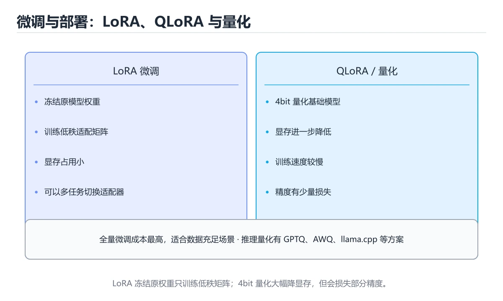
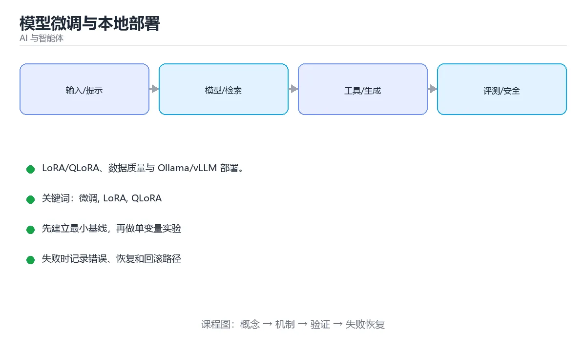

# 模型微调与本地部署





> 内容更新时间：2026-10-03 · 学习阶段：高级 · 预计用时：17 分钟

## 学习目标

- 能用自己的话解释「模型微调与本地部署」解决了什么问题，而不是只背术语。
- 能说清 「微调」、「LoRA」、「QLoRA」、「vLLM」 之间的关系，并分别举出一个例子。
- 能把本课知识放回「AI 与智能体」的知识体系，说明它和相邻主题的边界。
- 能完成本课练习，并用验收标准检查自己的结果。

> 一句话摘要：LoRA/QLoRA、数据质量与 Ollama/vLLM 部署。

## 前置知识

- 先完成上一课《AI 应用工程化》；如果已经掌握，可以直接用本课练习自测。
- 本课阶段：高级。建议具备同一方向的完整基础，能阅读较长的代码、配置或系统设计说明。
- 开始前先复习：微调、LoRA、QLoRA。
- 如果某一步看不懂，先记录具体卡点，完成练习后再回头读一遍。


## 先问：真的需要微调吗

```text
提示工程 -> RAG -> 微调 -> 从零训练
成本递增，先穷尽更便宜的手段
```

| 需求 | 推荐方案 |
| --- | --- |
| 让模型知道私有知识 | RAG（检索） |
| 固定输出格式与风格 | 提示工程 + 少样本 |
| 特定任务稳定提升（分类、抽取、代码风格） | 微调 |
| 学习全新能力或领域 | 继续预训练（成本最高） |

## 微调方式

| 方式 | 说明 | 成本 |
| --- | --- | --- |
| 全参数微调 | 更新所有参数 | 最高，需多卡 |
| LoRA | 冻结原模型，训练低秩矩阵 | 低，单卡可做 |
| QLoRA | 4-bit 量化 + LoRA | 更低，消费级显卡可跑 |
| 指令微调 SFT | 用「指令-回答」数据对齐 | 中等 |
| 偏好对齐 DPO / RLHF | 用人类偏好数据优化 | 较高 |

```python
# LoRA 微调配置示例（Hugging Face PEFT）
from peft import LoraConfig, get_peft_model
config = LoraConfig(
    r=8,                      # 低秩维度：越大容量越强，成本越高
    lora_alpha=16,
    target_modules=["q_proj", "v_proj"],
    lora_dropout=0.05,
    task_type="CAUSAL_LM",
)
model = get_peft_model(base_model, config)
model.print_trainable_parameters()   # 通常只占全参数的 0.1%~1%
```

## 数据质量比数量重要

1. 样本要覆盖真实输入分布，包含边界与反例。
2. 指令、输入、输出字段清晰一致，不要混入互相矛盾的标注。
3. 划分训练 / 验证集，观察验证损失防过拟合。
4. 保留一批**从未参与训练**的评测样本，用于对比微调前后效果。

## 本地部署方案

| 方案 | 特点 | 适用 |
| --- | --- | --- |
| Ollama | 一条命令拉取并运行模型 | 个人开发、桌面应用 |
| llama.cpp | C++ 实现，CPU/Metal 可用，量化友好 | 边缘设备、轻量服务 |
| vLLM | PagedAttention，高吞吐 | 生产级 GPU 服务 |
| TensorRT-LLM | NVIDIA 深度优化 | 极致延迟与吞吐 |
| TGI | Hugging Face 推理服务 | 与 HF 生态集成 |

```bash
ollama run qwen2.5:7b            # 本地对话
ollama list                      # 查看已下载模型

# vLLM 启动 OpenAI 兼容服务
python -m vllm.entrypoints.openai.api_server \
  --model Qwen/Qwen2.5-7B-Instruct \
  --tensor-parallel-size 2 --max-model-len 8192
```

vLLM 提供 OpenAI 兼容接口，业务代码通常只需改 `base_url` 与模型名，就能从云端切到本地。

## 量化与选型

```text
FP16 / BF16   精度最高，显存占用 2 字节/参数
INT8          几乎无损，显存减半
INT4 / Q4_K_M 显存再减半，质量略有下降，性价比高
```

显存估算经验：参数 7B 的模型用 INT4 约需 4~6 GB，FP16 约需 14~16 GB（含 KV Cache 与中间激活）。

## 生产部署清单

1. 明确吞吐与延迟目标（QPS、首 token 延迟、每 token 延迟）。
2. 开启动态批处理（continuous batching）提升 GPU 利用率。
3. 用网关做模型路由、限流、超时与降级。
4. 记录每次请求的 token、耗时与成本，接入可观测性。
5. 保留云端模型作为兜底，本地故障时自动切换。

## LoRA 参数与显存估算

| 参数 | 含义 | 经验取值 |
| --- | --- | --- |
| r（秩） | 低秩矩阵维度，越大容量越强 | 8~64，任务越复杂取值越大 |
| lora_alpha | 缩放系数，常设为 2r | 16~128 |
| target_modules | 注入哪些层 | 通常 q_proj、v_proj（或全部注意力层） |
| lora_dropout | 防过拟合 | 0.05~0.1 |
| 学习率 | 比全量微调大一个量级 | 1e-4 ~ 3e-4 |
| 训练轮数 | 数据量小易过拟合 | 1~3 epoch，配合早停 |

可训练参数占比：r=8 时通常只占全参数的 **0.1%~1%**，因此单卡即可微调 7B 模型。

**显存估算（7B 模型为例）**

| 精度/方式 | 权重 | 优化器与梯度 | 合计参考 |
| --- | --- | --- | --- |
| 全量 FP16 + Adam | 14 GB | 约 56 GB | 70 GB 以上，需多卡 |
| LoRA FP16 | 14 GB（冻结） | 约 1 GB | 16~20 GB |
| QLoRA 4-bit + LoRA | 约 4 GB | 约 1 GB | 6~10 GB |

再叠加激活值与 KV Cache（与批大小、序列长度成正比）。显存不够时的顺序：**降批量 → 梯度累积 → 梯度检查点 → 降精度（4-bit）→ 缩短序列长度**。

## 上线前的推理成本对照

| 部署方式 | 相对成本 | 适用 |
| --- | --- | --- |
| 云端大模型 API | 按 token 计费，无运维 | 流量小、需要最强效果 |
| 自建 vLLM（FP16） | 需 GPU 常驻，吞吐高 | 流量稳定、数据敏感 |
| 量化后本地部署（INT4） | 显存减半以上 | 边缘设备、成本敏感 |
| 蒸馏小模型 | 延迟低、成本极低 | 任务明确、可接受精度损失 |

估算顺序：先算峰值 QPS × 平均 token 数 → 选模型与量化精度 → 用 vLLM 压测确认吞吐与延迟 → 再决定实例数量与扩容策略。

## 本课小结
微调解决「稳定性与风格」，RAG 解决「知识时效」，部署决定「成本与延迟」。三者组合，才能构成可上线的 AI 服务。


## 微调方式对照

| 方式 | 可训练参数 | 显存需求 | 适用 |
| --- | --- | --- | --- |
| 全参微调 | 100% | 极高 | 有大量数据与算力 |
| LoRA | 约 0.1% 到 1% | 中 | 大多数业务微调 |
| QLoRA | 同上（基座 4bit） | 低 | 单卡消费级显卡 |
| Prefix / P-Tuning | 极少 | 低 | 轻量适配 |
| 适配器（Adapter） | 少量 | 低 | 多任务共用基座 |

## 量化与推理引擎对照

| 方案 | 精度 | 显存 | 特点 |
| --- | --- | --- | --- |
| FP16 / BF16 | 高 | 高 | 基准质量 |
| INT8 | 较高 | 中 | 质量损失小 |
| INT4（GPTQ / AWQ） | 中 | 低 | 常用折中方案 |
| GGUF（llama.cpp） | 可变 | 极低 | CPU 与消费级设备友好 |

| 引擎 | 适用场景 | 特点 |
| --- | --- | --- |
| vLLM | 高吞吐服务 | PagedAttention、连续批处理 |
| TensorRT-LLM | NVIDIA 极致性能 | 编译优化、需转换 |
| SGLang | 结构化与高并发 | RadixAttention 前缀复用 |
| llama.cpp / Ollama | 本地与边缘 | 部署简单、CPU 可用 |
| TGI | 生产服务 | 与 HuggingFace 生态集成 |

```python
def lora_param_count(hidden: int, layers: int, rank: int, targets: int = 4) -> dict:
    """估算 LoRA 参数量与占比，判断显存预算是否可行。"""
    # 每个目标模块加两组低秩矩阵：rank * hidden + hidden * rank
    per_layer = targets * 2 * rank * hidden
    lora_total = per_layer * layers
    # 粗略的基座参数量级（注意力与前馈合计约 12 * hidden^2 每层）
    base_total = 12 * hidden * hidden * layers
    return {
        "lora_params": lora_total,
        "base_params": base_total,
        "ratio": round(lora_total / base_total, 5),
    }


def vram_estimate_gb(params_b: float, bytes_per_param: float, overhead: float = 1.3) -> float:
    """按参数规模估算推理显存：权重 + 额外开销。"""
    weight_gb = params_b * 1e9 * bytes_per_param / (1024 ** 3)
    return round(weight_gb * overhead, 2)


def should_fine_tune(needs: dict) -> str:
    """决策表：先提示工程，再 RAG，最后才微调。"""
    if needs.get("knowledge_updates_frequently"):
        return "用 RAG：知识可随时更新"
    if needs.get("needs_strict_format") or needs.get("needs_style"):
        return "考虑 LoRA 微调：约束输出行为"
    if needs.get("no_training_data"):
        return "先做提示工程与少量示例"
    return "先评测基线，再决定是否微调"


print(lora_param_count(hidden=4096, layers=32, rank=8))
print(vram_estimate_gb(7, 2), vram_estimate_gb(7, 0.5))     # FP16 与 INT4
```

## 微调数据速查

| 要点 | 建议 |
| --- | --- |
| 数据量 | 数百到数万条高质量样本起步 |
| 格式 | 指令-输入-输出，或对话多轮结构 |
| 质量 | 人工抽检准确率，宁少勿滥 |
| 去重 | 精确与近似去重都要做 |
| 覆盖 | 包含边界、拒答与对抗样例 |
| 划分 | 训练、验证、测试严格隔离 |
| 模板 | 与推理时的提示模板保持一致 |
| 评测 | 微调前后同一评测集对比 |

## 常见错误对照表

| 容易踩的做法 | 实际现象 | 原因与正确做法 |
| --- | --- | --- |
| 用微调补知识 | 知识很快过期 | 知识用 RAG，微调改行为 |
| 训练与推理模板不一致 | 效果明显下降 | 严格复用同一模板与特殊 Token |
| 数据量少且质量差 | 学不到规律还过拟合 | 优先提数据质量与数量 |
| 不做基线评测 | 无法证明微调有效 | 先评测提示工程与 RAG 基线 |
| 学习率过大 | 灾难性遗忘 | 小学习率 + 少量 step + 验证集早停 |
| 只用训练损失判断 | 过拟合无感知 | 看验证集与任务指标 |
| 忽略量化带来的质量差 | 上线后质量下降 | 量化前后同评测集对比 |
| 不做吞吐压测 | 上线后延迟爆炸 | 用目标并发压测 P95 与吞吐 |
| 直接上全参微调 | 成本高收益小 | 先用 LoRA / QLoRA 验证 |
| 不监控线上质量 | 漂移无人知 | 加质量抽检与用户反馈闭环 |

## 自测清单

- [ ] 先评估提示工程与 RAG，再决定是否微调。
- [ ] 微调训练与推理使用同一模板。
- [ ] 量化前后用同一评测集对比质量。
- [ ] 部署引擎按吞吐与延迟目标选择。
- [ ] 有线上质量监控与反馈闭环。

## 动手练习


> 本课练习重点：围绕「微调、LoRA、QLoRA」完成复述、实验和交付，每个结果都要能被别人检查。

先写评测样例，再改一个提示、模型或数据变量，最后比较质量、成本与安全。

### 练习 1：建立心智模型（10 分钟）

合上教程，用 3～5 句话回答：

1. 「模型微调与本地部署」解决了什么问题？
2. 如果没有它，会出现什么具体后果？
3. 它和「LoRA」是什么关系？

**验收标准**：至少出现一个本课关键词，并写出一个反例、边界条件或失效场景。

### 练习 2：做一次可控实验（20 分钟）

从正文中选一个最小示例，完成以下操作：

1. 先预测修改一个参数、输入或步骤后的结果。
2. 再实际执行或逐步推演，记录真实结果。
3. 如果结果与预测不同，写出差异原因。

**验收标准**：留下「原例 → 改动 → 预测 → 结果 → 原因」五步记录。

### 练习 3：交付一个小结果（30 分钟）

构造 5 条小型离线样例，写清输入、期望输出、评分标准和失败案例。

任务要求：

- 结果必须能被别人检查，不能只写“我已经理解了”。
- 至少覆盖「微调」和「LoRA」两个关键词。
- 写出 1 个仍然不确定的问题，以及下一步如何验证。

> 提示：时间有限时优先做练习 1 和练习 2；练习 3 可以拆成两次完成。


## 考点精讲：把测验题还原成判断过程

本课有 6 个判断点。先自己作答，再看「判断依据」；如果结论正确但理由不完整，回到正文对应章节补足概念。

### 考点 1：让模型掌握私有知识，最经济有效的方案通常是？

- **正确判断**：RAG 检索增强
- **判断依据**：正确答案是「RAG 检索增强」，本课在「LoRA 参数与显存估算」中说明：可训练参数占比：r=8 时通常只占全参数的 0.1%~1%，因此单卡即可微调 7B 模型。RAG 无需训练即可更新知识且可溯源。本课还在「本地部署方案」中说明：vLLM 提供 OpenAI 兼容接口，业务代码通常只需改 baseurl 与模型名，就能从云端切到本地。本课还在「数据质量比数量重要」中说明：保留一批从未参与训练的评测样本，用于对比微调前后效果。
- **迁移检查**：遮住选项，只根据定义复述一次答案，再回来看哪个选项与复述一致。

### 考点 2：LoRA 的核心思路是？

- **正确判断**：冻结原模型
- **判断依据**：LoRA 大幅降低可训练参数与显存占用。其他选项：LoRA 冻结原模型。针对「LoRA 的核心思路是，」，本课在「生产部署清单」中说明：保留云端模型作为兜底，本地故障时自动切换。本课还在「上线前的推理成本对照」中说明：估算顺序：先算峰值 QPS × 平均 token 数 → 选模型与量化精度 → 用 vLLM 压测确认吞吐与延迟 → 再决定实例数量与扩容策略。本课还在「本课小结」中说明：微调解决「稳定性与风格」，RAG 解决「知识时效」，部署决定「成本与延迟」。
- **迁移检查**：遮住选项，只根据定义复述一次答案，再回来看哪个选项与复述一致。

### 考点 3：需要高吞吐的本地 OpenAI 兼容服务，首选？

- **正确判断**：vLLM
- **判断依据**：vLLM 的 PagedAttention 与连续批处理在高并发下吞吐优势明显。其他选项：vLLM 靠 PagedAttention 与连续批处理提供高吞吐的 OpenAI 兼容服务。针对「需要高吞吐的本地 OpenAI 兼容服务，首选，」，本课在「本地部署方案」中说明：vLLM 提供 OpenAI 兼容接口，业务代码通常只需改 baseurl 与模型名，就能从云端切到本地。本课还在「上线前的推理成本对照」中说明：估算顺序：先算峰值 QPS × 平均 token 数 → 选模型与量化精度 → 用 vLLM 压测确认吞吐与延迟 → 再决定实例数量与扩容策略。
- **迁移检查**：如果给某个错误选项去掉一个限定词，它会不会变成正确？说明理由。

### 考点 4：什么时候应该考虑微调而不是只改提示？

- **正确判断**：需要稳定的特定风格/格式或专门任务能力，且提示工程与 RAG 已达到瓶颈
- **判断依据**：正确答案是「需要稳定的特定风格/格式或专门任务能力，且提示工程与 RAG 已达到瓶颈」，本课在「本课小结」中说明：微调解决「稳定性与风格」，RAG 解决「知识时效」，部署决定「成本与延迟」。知识更新优先用 RAG（可即时更新），行为与格式约束才更适合微调。本课还在「量化与选型」中说明：显存估算经验：参数 7B 的模型用 INT4 约需 4~6 GB，FP16 约需 14~16 GB（含 KV Cache 与中间激活）。
- **迁移检查**：如果给某个错误选项去掉一个限定词，它会不会变成正确？说明理由。

### 考点 5：量化部署（如 4-bit）的取舍是？

- **正确判断**：显存占用显著下降
- **判断依据**：正确答案是「显存占用显著下降」，本课在「LoRA 参数与显存估算」中说明：显存不够时的顺序：降批量 → 梯度累积 → 梯度检查点 → 降精度（4-bit）→ 缩短序列长度。常见方案有 GPTQ、AWQ、GGUF 等，选择时要结合硬件与质量要求实测。本课还在「数据质量比数量重要」中说明：划分训练 / 验证集，观察验证损失防过拟合。本课还在「LoRA 参数与显存估算」中说明：可训练参数占比：r=8 时通常只占全参数的 0.1%~1%，因此单卡即可微调 7B 模型。
- **迁移检查**：把题干里的一个条件换成边界值，原来的结论还成立吗？写出判断过程。

### 考点 6：补全代码：「模型微调与本地部署」示例中，下面这行代码缺少哪个关键字或函数名？请填入 ____。 `____=["q_proj", "v_proj"],`

- **正确判断**：target_modules
- **判断依据**：正确答案是「target_modules」，这道题在问补全代码：模型微调与本地部署示例中，下面这行代码缺少…"q_proj","v_proj"],`，判断时要把题干限定的输入、边界与目标逐项对齐。请填入 …=["qproj", "vproj"], 限定的语境来判断。
- **迁移检查**：如果填成相近的另一个函数或关键字，程序会在哪一步出错？

## 本课复习清单

离开本课前，逐项确认：

- [ ] 不看解析，能说出「让模型掌握私有知识，最经济有效的方案通常是？」的判断依据。
- [ ] 不看解析，能说出「LoRA 的核心思路是？」的判断依据。
- [ ] 不看解析，能说出「需要高吞吐的本地 OpenAI 兼容服务，首选？」的判断依据。
- [ ] 不看解析，能说出「什么时候应该考虑微调而不是只改提示？」的判断依据。
- [ ] 不看解析，能说出「量化部署（如 4-bit）的取舍是？」的判断依据。
- [ ] 不看解析，能说出「补全代码：「模型微调与本地部署」示例中，下面这行代码缺少哪个关键字或函数名？请填…」的判断依据。
- [ ] 至少运行一次本课示例，记录输入、输出和一个边界情况。
- [ ] 把本课最容易混淆的两个概念写成一句话对照。

| 复盘项 | 记录 |
| --- | --- |
| 已经能独立解释的考点 |  |
| 仍然说不清的概念 |  |
| 下一步验证动作 |  |

## 术语速查

把本课反复出现的术语集中放在一起。复习时先遮住右列，尝试用自己的话解释，再回到正文核对。

| 术语 | 本课语境 |
| --- | --- |
| `base_url` | vLLM 提供 OpenAI 兼容接口，业务代码通常只需改 `base_url` 与模型名，就能从云端切到本地。 |
| `微调` | 本课围绕该主题展开，结合正文与代码示例理解它的适用边界。 |
| `LoRA` | 本课围绕该主题展开，结合正文与代码示例理解它的适用边界。 |
| `QLoRA` | 本课围绕该主题展开，结合正文与代码示例理解它的适用边界。 |
| `vLLM` | 本课围绕该主题展开，结合正文与代码示例理解它的适用边界。 |
| `Ollama` | 本课围绕该主题展开，结合正文与代码示例理解它的适用边界。 |
| `量化` | 本课围绕该主题展开，结合正文与代码示例理解它的适用边界。 |

## 面试问答与自测

下面把本课考点换成面试追问。先口述自己的答案，
再对照参考回答检查是否遗漏了前提、边界或失败路径。

### 追问 1：让模型掌握私有知识，最经济有效的方案通常是？

**参考回答**：正确答案是「RAG 检索增强」，本课在「LoRA 参数与显存估算」中说明：可训练参数占比：r=8 时通常只占全参数的 0.1%~1%，因此单卡即可微调 7B 模型。RAG 无需训练即可更新知识且可溯源。本课还在「本地部署方案」中说明：vLLM 提供 OpenAI 兼容接口，业务代码通常只需改 baseurl 与模型名，就能从云端切到本地。本课还在「数据质量比数量重要」中说明：保留一批从未参与训练的评测样本，用于对比微调前后效果。

### 追问 2：LoRA 的核心思路是？

**参考回答**：LoRA 大幅降低可训练参数与显存占用。其他选项：LoRA 冻结原模型。针对「LoRA 的核心思路是，」，本课在「生产部署清单」中说明：保留云端模型作为兜底，本地故障时自动切换。本课还在「上线前的推理成本对照」中说明：估算顺序：先算峰值 QPS × 平均 token 数 → 选模型与量化精度 → 用 vLLM 压测确认吞吐与延迟 → 再决定实例数量与扩容策略。本课还在「本课小结」中说明：微调解决「稳定性与风格」，RAG 解决「知识时效」，部署决定「成本与延迟」。

### 追问 3：需要高吞吐的本地 OpenAI 兼容服务，首选？

**参考回答**：vLLM 的 PagedAttention 与连续批处理在高并发下吞吐优势明显。其他选项：vLLM 靠 PagedAttention 与连续批处理提供高吞吐的 OpenAI 兼容服务。针对「需要高吞吐的本地 OpenAI 兼容服务，首选，」，本课在「本地部署方案」中说明：vLLM 提供 OpenAI 兼容接口，业务代码通常只需改 baseurl 与模型名，就能从云端切到本地。本课还在「上线前的推理成本对照」中说明：估算顺序：先算峰值 QPS × 平均 token 数 → 选模型与量化精度 → 用 vLLM 压测确认吞吐与延迟 → 再决定实例数量与扩容策略。

### 追问 4：什么时候应该考虑微调而不是只改提示？

**参考回答**：正确答案是「需要稳定的特定风格/格式或专门任务能力，且提示工程与 RAG 已达到瓶颈」，本课在「本课小结」中说明：微调解决「稳定性与风格」，RAG 解决「知识时效」，部署决定「成本与延迟」。知识更新优先用 RAG（可即时更新），行为与格式约束才更适合微调。本课还在「量化与选型」中说明：显存估算经验：参数 7B 的模型用 INT4 约需 4~6 GB，FP16 约需 14~16 GB（含 KV Cache 与中间激活）。

### 追问 5：量化部署（如 4-bit）的取舍是？

**参考回答**：正确答案是「显存占用显著下降」，本课在「LoRA 参数与显存估算」中说明：显存不够时的顺序：降批量 → 梯度累积 → 梯度检查点 → 降精度（4-bit）→ 缩短序列长度。常见方案有 GPTQ、AWQ、GGUF 等，选择时要结合硬件与质量要求实测。本课还在「数据质量比数量重要」中说明：划分训练 / 验证集，观察验证损失防过拟合。本课还在「LoRA 参数与显存估算」中说明：可训练参数占比：r=8 时通常只占全参数的 0.1%~1%，因此单卡即可微调 7B 模型。

## English Overview

**Title:** Fine-tuning & Deployment

**Summary:** LoRA, data quality and local serving.

**Category:** AI & Agents  
**Level:** 高级  
**Key terms:** 微调, LoRA, QLoRA, vLLM, Ollama, 量化

> The full tutorial is written in Chinese. This bilingual overview helps English readers identify the topic, scope and key terms before studying the detailed examples.

## 内容元数据

- 内容版本：v2.0
- 最后更新：2026-10-03
- 学习阶段：高级
- 适用环境：主流大模型 API、开源模型与向量数据库
- 内容来源：内置结构化课程与工程实践整理
- 相关主题：微调、LoRA、QLoRA、vLLM、Ollama、量化
- 质量版本：P0 测验标准 + P1 覆盖扩展 + P2 体验补全


## 参考资料与复核

- 最后复核：2026-10-04
- 下次复核：2027-04-04
- 复核范围：版本兼容、API 行为、安全建议与工程实践
- 来源性质：官方文档与标准；本课正文为离线教学重组，不复制原文

| 参考资料 | 本课用途 |
| --- | --- |
| [OpenAI Docs](https://platform.openai.com/docs/) | 模型 API、工具与评估 |
| [Hugging Face Docs](https://huggingface.co/docs) | 模型、数据集与推理 |
| [Model Context Protocol](https://modelcontextprotocol.io/) | Agent 工具与上下文协议 |

> 本课主题：LoRA/QLoRA、数据质量与 Ollama/vLLM 部署。

> App 完全离线展示文字链接，不会自动联网；需要延伸阅读时可复制链接到浏览器。
