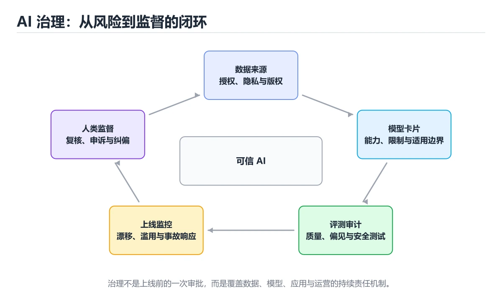
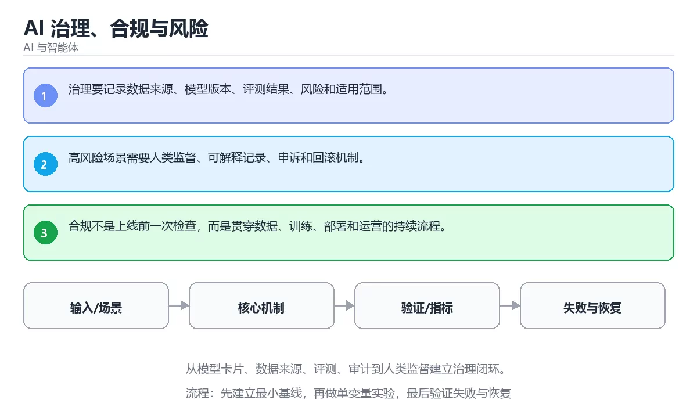

# AI 治理、合规与风险

> 内容更新时间：2026-10-06 · 学习阶段：进阶 · 预计用时：35 分钟





## 本节知识框架

**课程定位**：所属分类 `ai`（AI 与智能体），课程主题 `AI 治理、合规与风险`，学习阶段 进阶，建议用时 40 分钟。

本课主线：从模型卡片、数据来源、评测、审计到人类监督建立治理闭环。

**学完本课应当能够**
- 说清 `AI 治理` 与 `合规` 的含义与区别，并各举一个正例和一个反例。
- 用本课示例验证 `审计` 的行为，记录输入、输出与失败条件。
- 遇到「只在首次上线前做合规评估」这类问题时，能说出触发条件与修复顺序。

### 从概念到验证的学习链条

1. `AI 治理`：先掌握 为 AI 系统建立责任、风险、合规、透明度和人类监督机制，再用它解释 `合规` 为什么会出现。
2. `合规`：先掌握 满足法律、行业规范和内部政策对数据与系统的要求，再用它解释 `审计` 为什么会出现。
3. `审计`：先掌握 按“AI 治理、合规与风险”中 AI 治理、合规、审计 的实践顺序，把四个步骤排成从准备到复盘的合理顺序，再用它解释 `人类监督` 为什么会出现。
4. `人类监督`：先掌握 在高风险决策中保留人工审查、批准或接管能力，再用它解释 本课示例的观察结果 为什么会出现。

**先修与衔接**：本课是「AI 与智能体」分类的第 29 课。相关或后续课程：《AI 概念入门》。

### 完成判据

- **定义关**：不看正文也能说明 `AI 治理` 是 为 AI 系统建立责任、风险、合规、透明度和人类监督机制，并指出一个反例。
- **机制关**：能按“输入 → 转换 → 输出 → 验证”复述 `AI 治理、合规与风险`，而不是只背结论。
- **示例关**：能运行或推演 `AI 治理、合规与风险` 的 `text` 示例，并说明一个真实出现的标识符或字面量。
- **证据关**：能指出 `AI 治理、合规与风险` 示例里的 调用了 `score()`，并说明它支持或反驳了本课的哪一条结论。
- **排错关**：能复现 只在首次上线前做合规评估，记录现象并按 把评估接入变更流程，并在重大更新后复评 修复。
- **迁移关**：能把 `AI 治理`、`合规`、`审计`、`人类监督` 放进一个与 `AI 治理、合规与风险` 不同的项目场景，并保持输入与验证条件可追踪。
- **复盘关**：学完 `AI 治理、合规与风险` 后，用一句话写下仍然不确定的结论，并列出下一次验证需要的输入、环境和成功判据。

### 复习清单

- [ ] 能不看正文复述本课核心术语，并指出一个边界或反例。
- [ ] 能运行或推演本课示例，记录输入、输出与失败现象。
- [ ] 能完成一次自测，并把错题对照错误表定位原因。

## 核心概念定义

| 术语 | 操作性定义 | 常见边界与风险 |
| --- | --- | --- |
| AI 治理 | 为 AI 系统建立责任、风险、合规、透明度和人类监督机制。 | 只在「为 AI 系统建立责任、风险、合规、透明度和人类监督机制」这一前提下成立，换输入或换环境要重新验证。 |
| 合规 | 满足法律、行业规范和内部政策对数据与系统的要求。 | 易错：模型或数据变更后风险重新出现；正确做法是把评估接入变更流程，并在重大更新后复评。 |
| 审计 | 按“AI 治理、合规与风险”中 AI 治理、合规、审计 的实践顺序，把四个步骤排成从准备到复盘的合理顺序。 | 只在「按“AI 治理、合规与风险”中 AI 治理、合规、审计 的实践顺序，把四个步骤排成从准备到复盘的合理顺序」这一前提下成立，换输入或换环境要重新验证。 |
| 人类监督 | 在高风险决策中保留人工审查、批准或接管能力。 | 只在「在高风险决策中保留人工审查、批准或接管能力」这一前提下成立，换输入或换环境要重新验证。 |

## 原理与运行机制

### 机制总览

**教材衔接：核心知识**

### 1. 治理要记录数据来源、模型版本、评测结果、风险和适用范围。

- 关键做法：先用 answer 建立 AI 治理 的基线，再逐步加入边界与失败条件。
- 验证标准：AI 治理 的结果可复现、错误可解释、失败能恢复。

### 2. 高风险场景需要人类监督、可解释记录、申诉和回滚机制。

把这条结论放回「AI 治理、合规与风险」的完整流程里展开：

- 正文依据：能用自己的话解释：高风险场景需要人类监督、可解释记录、申诉和回滚机制。
- 落地检查：把「2. 高风险场景需要人类监督、可解释记录、申诉和回滚机制。」改写成一条可执行的核对项，逐条验证输入、超时与失败路径。

### 3. 合规不是上线前一次检查，而是贯穿数据、训练、部署和运营的持续流程。

把这条结论放回「AI 治理、合规与风险」的完整流程里展开：

- 正文依据：能用自己的话解释：合规不是上线前一次检查，而是贯穿数据、训练、部署和运营的持续流程。
- 落地检查：把「3. 合规不是上线前一次检查，而是贯穿数据、训练、部署和运营的持续流程。」改写成一条可执行的核对项，逐条验证输入、超时与失败路径。

**教材衔接：关键流程**

**教材衔接：实践路径**

**教材衔接：深入补充：AI 治理、合规与风险 的取舍与边界**

### 一、把概念放回真实约束

| 维度 | 要回答的问题 | 常见做法 | 失败信号 |
| --- | --- | --- | --- |
| 数据 | AI 治理 的训练或检索数据从哪来、质量如何 | 清洗、去重、标注与版本化 | 评测集泄漏或分布漂移 |
| 模型 | 合规 的能力边界与成本是多少 | 基线对比、离线评测、灰度发布 | 指标好看但线上任务失败 |
| 评测 | 如何证明改动真的有效 | 固定评测集、人工抽检、A/B | 只比较单例输出 |
| 安全 | 失败时会不会泄露或越权 | 权限校验、内容过滤、审计 | 提示注入或数据外泄 |


### 五、AI 工程补充

**教材衔接：零基础精讲：把AI 治理、合规与风险真正讲透**

### 先建立一个直觉

把「AI 治理、合规与风险」看成一条可评测的流水线：输入经过 AI 治理 处理，产出候选结果，再由 合规 决定哪些结果可以真正执行；每一环都要有可测的输入、输出与失败处理。

本课的摘要可以当作一张地图：从模型卡片、数据来源、评测、审计到人类监督建立治理闭环。

### 逐步拆解

1. 澄清输入与目标。先写清「AI 治理、合规与风险」要解决的问题、合法输入范围和成功标准，再进入后续步骤。
2. 描述处理过程。把「AI 治理、合规、审计、人类监督」映射到具体步骤，每步都要求能单独验证。
3. 定义输出。明确 AI 治理 与 合规 各自的产物，以及失败时留下什么证据。
4. 把 answer 的输入换成空值、极值或类型不符的形式，记录第一条错误信息、发生位置和修复动作。
5. 用同一个AI 治理输入跑两遍：一遍按正文步骤，一遍故意跳过一步，比较输出并解释为什么必须按顺序执行。

### 把正文串成一条执行链

- **1. 治理要记录数据来源、模型版本、评测结果、风险和适用范围。**：在「AI 治理、合规与风险」里，「1. 治理要记录数据来源、模型版本、评测结果、风险和适用范围。」这一步要先写清输入与预期，再记录实际结果和差异；结果不符时回到对应小节核对前提。
- **2. 高风险场景需要人类监督、可解释记录、申诉和回滚机制。**：在「AI 治理、合规与风险」里，「2. 高风险场景需要人类监督、可解释记录、申诉和回滚机制。」这一步要先写清输入与预期，再记录实际结果和差异；结果不符时回到对应小节核对前提。
- **3. 合规不是上线前一次检查，而是贯穿数据、训练、部署和运营的持续流程。**：在「AI 治理、合规与风险」里，「3. 合规不是上线前一次检查，而是贯穿数据、训练、部署和运营的持续流程。」这一步要先写清输入与预期，再记录实际结果和差异；结果不符时回到对应小节核对前提。
- **考点 1：核心知识 的代码阅读题**：先独立作答，再回到本课正文核对 answer 的执行路径；答错时记录是哪一个前提被忽略。
- **考点 2：关于「高风险场景需要人类监督、可解释记录、申诉和回滚机制。」，下列说法正确的是？**：先独立作答，再回到本课对应小节核对判断依据；答错时记录是哪一个前提被忽略。
- **考点 3：按“AI 治理、合规与风险”中 AI 治理、合规、审计 的实践顺序，把四个步骤排成从准备到复盘的合理顺序。**：先独立作答，再回到本课对应小节核对判断依据；答错时记录是哪一个前提被忽略。

### 从测验反推易错点

- 参考判断：治理要记录数据来源、模型版本、评测结果、风险和适用范围。
- 自问：如果去掉题干里的一个限定词，结论还成立吗？

- 参考判断：高风险场景需要人类监督、可解释记录、申诉和回滚机制。

- 参考判断：合规不是上线前一次检查，而是贯穿数据、训练、部署和运营的持续流程。

**检查点 4：本课的核心学习目标是什么？**

- 参考判断：从模型卡片、数据来源、评测、审计到人类监督建立治理闭环。

**检查点 5：以下哪些术语与AI 治理、合规与风险直接相关？（多选）**

- 参考判断：AI 治理、合规

### 工程排错顺序

| 先查什么 | 要得到的证据 | 判断标准 |
| --- | --- | --- |
| 模型输入是否经过长度、格式与敏感信息检查？ | 日志、输入样例、测试或指标 | 能复现并解释，才算定位 |
| 工具调用是否最小权限、可超时、可取消？ | 日志、输入样例、测试或指标 | 能复现并解释，才算定位 |
| 输出是否有引用、置信度或人工复核兜底？ | 日志、输入样例、测试或指标 | 能复现并解释，才算定位 |
| 成本、延迟与失败率是否有指标？ | 日志、输入样例、测试或指标 | 能复现并解释，才算定位 |

### 变式训练

1. 把 AI 治理 的实现压缩到一个进程内，去掉所有外部依赖后再谈扩展。
2. 扩大 合规 的规模，记录本课结论在哪一个量级开始不成立。
3. 让 answer 的外部依赖超时，确认系统能回滚或补偿，而不是留下脏数据。
5. 减少一个输入字段后重跑 answer，记录失败信息出现在哪一层，据此判断这个字段是必填还是可推导。
6. 限制 CPU 与内存上限后重跑 answer，观察哪一项参数需要重新设定。


### 迁移案例库

围绕 answer 重复同一套方法，每完成一轮就把差异写进笔记。

#### 迁移案例 1：围绕「AI 治理」做一次小实验

**验收**：至少给出一个反例，说明AI 治理在什么情况下会失效；只写成功案例不算通过。

#### 迁移案例 2：围绕「合规」做一次小实验

**步骤**：
1. 复述当前方案对「合规」的假设，写成一句可证伪的话。

#### 迁移案例 3：围绕「审计」做一次小实验

**步骤**：
1. 复述当前方案对「审计」的假设，写成一句可证伪的话。

#### 迁移案例 4：围绕「人类监督」做一次小实验

**步骤**：
1. 复述当前方案对「人类监督」的假设，写成一句可证伪的话。

#### 迁移案例 5：围绕「AI 治理」做一次小实验

**步骤**：

#### 迁移案例 6：围绕「合规」做一次小实验

**步骤**：

#### 迁移案例 7：围绕「审计」做一次小实验

**步骤**：

#### 迁移案例 8：围绕「人类监督」做一次小实验

**步骤**：

#### 迁移案例 9：围绕「AI 治理」做一次小实验

**步骤**：

#### 迁移案例 10：围绕「合规」做一次小实验

**步骤**：

#### 迁移案例 11：围绕「审计」做一次小实验

**步骤**：

#### 迁移案例 12：围绕「人类监督」做一次小实验

**步骤**：

#### 迁移案例 13：围绕「AI 治理」做一次小实验

**步骤**：

#### 迁移案例 14：围绕「合规」做一次小实验

**步骤**：

#### 迁移案例 15：围绕「审计」做一次小实验

**步骤**：

#### 迁移案例 16：围绕「人类监督」做一次小实验

**步骤**：

<!-- p0-depth-v2:end -->

**教材衔接：验证步骤**

### 机制拆解：每一步的输入、动作与输出

#### 1. `AI 治理`
- 输入：`AI 治理`；本步把 为 AI 系统建立责任、风险、合规、透明度和人类监督机制 当作判断规则。
- 动作：围绕 `AI 治理` 保留中间状态，并记录它与 `合规` 的对应关系。
- 输出：`合规`，它可以被下一段代码、测试或记录继续使用。
- `AI 治理` 的失败条件：只在「为 AI 系统建立责任、风险、合规、透明度和人类监督机制」这一前提下成立，换输入或换环境要重新验证。

#### 2. `合规`
- 输入：`AI 治理`；本步把 满足法律、行业规范和内部政策对数据与系统的要求 当作判断规则。
- 动作：围绕 `合规` 保留中间状态，并记录它与 `审计` 的对应关系。
- 输出：`审计`，它可以被下一段代码、测试或记录继续使用。
- `合规` 的失败条件：当只在首次上线前做合规评估时，会出现模型或数据变更后风险重新出现。

#### 3. `审计`
- 输入：`合规`；本步把 按“AI 治理、合规与风险”中 AI 治理、合规、审计 的实践顺序，把四个步骤排成从准备到复盘的合理顺序 当作判断规则。
- 动作：围绕 `审计` 保留中间状态，并记录它与 `人类监督` 的对应关系。
- 输出：`人类监督`，它可以被下一段代码、测试或记录继续使用。
- `审计` 的失败条件：只在「按“AI 治理、合规与风险”中 AI 治理、合规、审计 的实践顺序，把四个步骤排成从准备到复盘的合理顺序」这一前提下成立，换输入或换环境要重新验证。

#### 4. `人类监督`
- 输入：`审计`；本步把 在高风险决策中保留人工审查、批准或接管能力 当作判断规则。
- 动作：围绕 `人类监督` 保留中间状态，并记录它与 `score` 的对应关系。
- 输出：`score`，它可以被下一段代码、测试或记录继续使用。
- `人类监督` 的失败条件：只在「在高风险决策中保留人工审查、批准或接管能力」这一前提下成立，换输入或换环境要重新验证。

### 示例中的可观察事实

1. 调用了 `score()`；它对应的课程主题是 `AI 治理、合规与风险`。
2. 调用了 `strip()`；它对应的课程主题是 `AI 治理、合规与风险`。
3. 调用了 `print()`；它对应的课程主题是 `AI 治理、合规与风险`。
4. 出现字面量 `agent`；它对应的课程主题是 `AI 治理、合规与风险`。

### 复现实验记录

- 环境：`AI 治理、合规与风险` 使用 `text` 示例，固定 `AI 治理`、`合规`、`审计`、`人类监督` 作为第一组条件。
- 首轮输入：先确认 调用了 `score()`，预测 `AI 治理` 会怎样变化。
- 基线观察：记录命令、输入、输出和错误原文，不用截图代替可复制的文本。
- 单变量修改：只改变 `AI 治理`，观察 `人类监督` 是否仍满足定义。
- 失败注入：复现 只在首次上线前做合规评估，确认现象是 模型或数据变更后风险重新出现。
- 记录结论：把“修改前、修改后、预期变化、实际变化”写成四列表，这样复盘 `AI 治理、合规与风险` 时才能区分概念错误与实现错误。

## 典型应用场景

- **只在首次上线前做合规评估**：典型现象是模型或数据变更后风险重新出现；正确做法是把评估接入变更流程，并在重大更新后复评。
- **没有数据来源与授权记录**：典型现象是无法证明训练与使用合法；正确做法是登记来源、授权范围与使用目的，保留可追溯记录。
- **把责任推给模型供应商**：典型现象是事故责任仍由使用方承担；正确做法是明确内部责任人与人工兜底、申诉与下线流程。

### 最小验证场景

- 准备：保留 `text` 示例的原始输入，先记录 `AI 治理、合规与风险` 的基线输出和完整运行命令。
- 观察：先核对 调用了 `score()`，再改变一个与 `AI 治理` 相关的条件。
- 判定：新结果与 `AI 治理、合规与风险` 的基线不同不等于错误；只有当差异破坏了 `AI 治理` 的定义或错误表中的约束，才判定为失败。

### 选择与边界

- 使用 `AI 治理` 时，先满足它的定义：为 AI 系统建立责任、风险、合规、透明度和人类监督机制；只在「为 AI 系统建立责任、风险、合规、透明度和人类监督机制」这一前提下成立，换输入或换环境要重新验证。
- 使用 `合规` 时，先满足它的定义：满足法律、行业规范和内部政策对数据与系统的要求；易错：模型或数据变更后风险重新出现；正确做法是把评估接入变更流程，并在重大更新后复评。
- 使用 `审计` 时，先满足它的定义：按“AI 治理、合规与风险”中 AI 治理、合规、审计 的实践顺序，把四个步骤排成从准备到复盘的合理顺序；只在「按“AI 治理、合规与风险”中 AI 治理、合规、审计 的实践顺序，把四个步骤排成从准备到复盘的合理顺序」这一前提下成立，换输入或换环境要重新验证。
- 使用 `人类监督` 时，先满足它的定义：在高风险决策中保留人工审查、批准或接管能力；只在「在高风险决策中保留人工审查、批准或接管能力」这一前提下成立，换输入或换环境要重新验证。

## 代码/协议/SQL 示例

**教材衔接：最小可运行示例**

下面示例用于验证 AI 治理 的最小输入、处理和输出。先原样运行，再只修改一个值：

```python
def score(answer: str) -> int:
    return 1 if answer.strip() else 0

print(score("agent"))
```

**教材衔接：预期输出**

```text
1
```

### 示例精读：先找证据，再改一个条件

1. 调用了 `score()`；它出现在 `AI 治理、合规与风险` 的示例中，阅读时先确认它前后各发生了什么。
2. 调用了 `strip()`；它出现在 `AI 治理、合规与风险` 的示例中，阅读时先确认它前后各发生了什么。
3. 调用了 `print()`；它出现在 `AI 治理、合规与风险` 的示例中，阅读时先确认它前后各发生了什么。
4. 出现字面量 `agent`；它出现在 `AI 治理、合规与风险` 的示例中，阅读时先确认它前后各发生了什么。
- 在 `AI 治理、合规与风险` 中与 `AI 治理` 对照：示例必须能支持 为 AI 系统建立责任、风险、合规、透明度和人类监督机制，否则说明这一段还缺少实现或验证步骤。
- 在 `AI 治理、合规与风险` 中与 `合规` 对照：示例必须能支持 满足法律、行业规范和内部政策对数据与系统的要求，否则说明这一段还缺少实现或验证步骤。
- 在 `AI 治理、合规与风险` 中与 `审计` 对照：示例必须能支持 按“AI 治理、合规与风险”中 AI 治理、合规、审计 的实践顺序，把四个步骤排成从准备到复盘的合理顺序，否则说明这一段还缺少实现或验证步骤。
- 在 `AI 治理、合规与风险` 中与 `人类监督` 对照：示例必须能支持 在高风险决策中保留人工审查、批准或接管能力，否则说明这一段还缺少实现或验证步骤。

## 时间/空间复杂度或性能分析

**性能关注点（AI 治理、合规与风险）**：算力与显存决定可行规模：记录训练或推理耗时、显存峰值与模型精度，换数据集要重新评估。

**测量方法**：以 `AI 治理、合规与风险` 的 `AI 治理` 场景为对象，固定输入跑一遍记录基线，再把规模或并发度提高一个数量级复测；两次结果的差值与波动范围才是结论依据。

### 需要控制的变量与记录项

- `AI 治理、合规与风险` 的 `AI 治理`：固定它的版本、输入范围和资源上限，分别记录速度、内存与失败率的变化。
- `AI 治理、合规与风险` 的 `合规`：固定它的版本、输入范围和资源上限，分别记录速度、内存与失败率的变化。
- `AI 治理、合规与风险` 的 `审计`：固定它的版本、输入范围和资源上限，分别记录速度、内存与失败率的变化。
- `AI 治理、合规与风险` 的 `人类监督`：固定它的版本、输入范围和资源上限，分别记录速度、内存与失败率的变化。
- `AI 治理、合规与风险` 中 `AI 治理` 的边界：只在「为 AI 系统建立责任、风险、合规、透明度和人类监督机制」这一前提下成立，换输入或换环境要重新验证。达到边界时不要外推，必须重新测量。
- `AI 治理、合规与风险` 中 `合规` 的边界：易错：模型或数据变更后风险重新出现；正确做法是把评估接入变更流程，并在重大更新后复评。达到边界时不要外推，必须重新测量。
- `AI 治理、合规与风险` 中 `审计` 的边界：只在「按“AI 治理、合规与风险”中 AI 治理、合规、审计 的实践顺序，把四个步骤排成从准备到复盘的合理顺序」这一前提下成立，换输入或换环境要重新验证。达到边界时不要外推，必须重新测量。
- `AI 治理、合规与风险` 中 `人类监督` 的边界：只在「在高风险决策中保留人工审查、批准或接管能力」这一前提下成立，换输入或换环境要重新验证。达到边界时不要外推，必须重新测量。
- `AI 治理、合规与风险` 的代码证据：先验证 调用了 `score()`，再记录该路径的输入规模与耗时；只看代码行数不能推出复杂度。

## 常见误区与易错点

| 容易写错的做法 | 实际现象 | 原因与正确做法 |
| --- | --- | --- |
| 只在首次上线前做合规评估 | 模型或数据变更后风险重新出现。 | 把评估接入变更流程，并在重大更新后复评。 |
| 没有数据来源与授权记录 | 无法证明训练与使用合法。 | 登记来源、授权范围与使用目的，保留可追溯记录。 |
| 把责任推给模型供应商 | 事故责任仍由使用方承担。 | 明确内部责任人与人工兜底、申诉与下线流程。 |

### 现场 1：只在首次上线前做合规评估

**症状**：模型或数据变更后风险重新出现。

**根因与修复**：把评估接入变更流程，并在重大更新后复评。

**自检**：在本课示例里复现「只在首次上线前做合规评估」，改成把评估接入变更流程，并在重大更新后复评后重跑；如果症状消失且失败路径按预期变化，说明定位正确。

### 现场 2：没有数据来源与授权记录

**症状**：无法证明训练与使用合法。

**根因与修复**：登记来源、授权范围与使用目的，保留可追溯记录。

**自检**：在本课示例里复现「没有数据来源与授权记录」，改成登记来源、授权范围与使用目的，保留可追溯记录后重跑；如果症状消失且失败路径按预期变化，说明定位正确。

### 现场 3：把责任推给模型供应商

**症状**：事故责任仍由使用方承担。

**根因与修复**：明确内部责任人与人工兜底、申诉与下线流程。

**自检**：在本课示例里复现「把责任推给模型供应商」，改成明确内部责任人与人工兜底、申诉与下线流程后重跑；如果症状消失且失败路径按预期变化，说明定位正确。

## 与其他知识点的关系

**教材衔接：复习与迁移**

### 概念复述

- 用一句话说明「AI 治理、合规与风险」解决什么问题：从模型卡片、数据来源、评测、审计到人类监督建立治理闭环。
- 写出AI 治理、合规、审计之间的关系，并各举一个例子。
- 说出本课最容易混淆的两个概念，以及区分它们的判据。

### 正文逐节复核

- **深入补充：AI 治理、合规与风险 的取舍与边界**：学习AI 治理、合规与风险时，最容易只记住结论而忽略前提。
- **零基础精讲：把AI 治理、合规与风险真正讲透**：本课的摘要可以当作一张地图：从模型卡片、数据来源、评测、审计到人类监督建立治理闭环。


### 迁移练习

把「AI 治理、合规与风险」的结论迁移到相邻主题，每次迁移都写清预测与证据：

- **相关或后续**：`AI 概念入门`。本课术语会在这些课程里继续使用。
- **术语归属**：`AI 治理`、`合规`、`审计` 的定义以本课「核心概念定义」为准，换到其他课程时先确认定义是否被改写。

### 先修与后续术语接口

- `AI 概念入门`：两者通过本分类的学习顺序衔接，阅读时重点比较各自的输入与失败条件。

### 容易混淆的相邻概念

- `AI 治理` 与 `合规`：前者强调 为 AI 系统建立责任、风险、合规、透明度和人类监督机制；后者强调 满足法律、行业规范和内部政策对数据与系统的要求。判断时分别检查两条定义的适用范围，不要只看名称相似就互换。
- `合规` 与 `审计`：前者强调 满足法律、行业规范和内部政策对数据与系统的要求；后者强调 按“AI 治理、合规与风险”中 AI 治理、合规、审计 的实践顺序，把四个步骤排成从准备到复盘的合理顺序。判断时分别检查两条定义的适用范围，不要只看名称相似就互换。
- `审计` 与 `人类监督`：前者强调 按“AI 治理、合规与风险”中 AI 治理、合规、审计 的实践顺序，把四个步骤排成从准备到复盘的合理顺序；后者强调 在高风险决策中保留人工审查、批准或接管能力。判断时分别检查两条定义的适用范围，不要只看名称相似就互换。

## 自测题与参考答案

> 先独立作答，再对照参考答案；答案都能在本课正文、术语表或错误表里找到依据。

### 自测 1（概念复述）

不看正文，写出 `AI 治理` 的操作性定义，并说明它与 `合规` 的区别。

**参考答案**：为 AI 系统建立责任、风险、合规、透明度和人类监督机制。

`合规` 的定位是：满足法律、行业规范和内部政策对数据与系统的要求；两者的差别要从适用对象与失败模式上说明。

### 自测 2（排错）

本课错误表记录了「只在首次上线前做合规评估」这类做法。请写出它会出现的现象、根因，以及修复顺序。

**参考答案**：现象是模型或数据变更后风险重新出现；正确做法是把评估接入变更流程，并在重大更新后复评。修复时先复现现象并保留证据，再改动一处假设重跑，确认现象消失。

### 自测 3（动手验证）

运行本课的 `text` 示例，改动其中一个输入后重新运行，记录输出与错误信息。

**参考答案**：正常输入下 `text` 示例应当复现正文给出的结果；改动输入后，如果结果改变或报错，先核对它是否满足 `AI 治理、合规与风险` 中`AI 治理` 的适用范围，再检查错误表里是否有同类现象。

### 自测 4（代码阅读）

阅读本课开头的 `text` 示例，说明它体现了`AI 治理` 的哪一条性质，并指出改动哪个输入会让这条性质不再成立。

**参考答案**：`AI 治理` 的定义是 为 AI 系统建立责任、风险、合规、透明度和人类监督机制，示例正是在实现这条定义。改动与 `AI 治理` 有关的一个输入后，如果结果不再符合 `AI 治理、合规与风险` 的正文描述，就说明该性质只在当前前提成立。

### 自测 5（迁移）

把 `AI 治理、合规与风险` 的方法迁移到自己的项目：围绕 `AI 治理` 写出一个与错误表同类的风险点，并说明触发条件和检验方式。

**参考答案**：例如「把责任推给模型供应商」，它会导致事故责任仍由使用方承担；检验方式是按明确内部责任人与人工兜底、申诉与下线流程改一处再复现，确认现象消失且没有引入新的失败分支。

### 自测 6（对比）

用一个表格对比 `AI 治理` 与 `合规`：各写一行适用场景、一行失败表现。

**参考答案**：`AI 治理` 的定义是为 AI 系统建立责任、风险、合规、透明度和人类监督机制；`合规` 的定义是满足法律、行业规范和内部政策对数据与系统的要求。两者的失败表现分别对应本课错误表里与本术语相关的行。

### 自测 7（排错顺序）

面对「只在首次上线前做合规评估」引发的问题，请把“复现 模型或数据变更后风险重新出现 → 保留证据 → 把评估接入变更流程，并在重大更新后复评 → 回归验证”四步写成可执行的检查清单。

**参考答案**：第一步按模型或数据变更后风险重新出现复现；第二步记录输入、版本与完整报错；第三步按把评估接入变更流程，并在重大更新后复评只改一处；第四步重跑并确认失败路径也按预期变化。

### 自测 8（边界判断）

针对 `人类监督`，分别写出“可以使用”的条件和“结论不再成立”的条件。

**参考答案**：只在「在高风险决策中保留人工审查、批准或接管能力」这一前提下成立，换输入或换环境要重新验证。 同时要把 `人类监督` 的定义 在高风险决策中保留人工审查、批准或接管能力 与实际输入逐项对照。

### 自测 9（机制重建）

不看正文，按输入、转换、输出、验证四段重建 `AI 治理` → `合规` → `审计` → `人类监督` 的作用链。

**参考答案**：起点是 `AI 治理` 的定义 为 AI 系统建立责任、风险、合规、透明度和人类监督机制；中间每一步都保留可观察状态；终点由 `人类监督` 检查，失败时回到错误表定位第一个偏离定义的步骤。

### 自测 10（综合排错）

在 `AI 治理、合规与风险` 中，现象是 事故责任仍由使用方承担。请围绕 把责任推给模型供应商 写出最小复现、关键证据、修复动作和回归验证，并说明为什么不能只凭一次运行下结论。

**参考答案**：先复现 把责任推给模型供应商，记录输入与完整错误；再按 明确内部责任人与人工兜底、申诉与下线流程 只改一处。回归时同时跑正常路径和边界路径，只有两次结果都可解释，才把修复视为完成。

### 自测 11（一分钟复述）

用每分钟约 200 字的速度复述 `AI 治理、合规与风险`：先给主问题，再按顺序说出 `AI 治理`、`合规`、`审计`、`人类监督`，最后给一个失败案例。

**自评标准**：主问题必须对应 从模型卡片、数据来源、评测、审计到人类监督建立治理闭环；每个术语都要能接上一句定义或边界；失败案例必须写成可观察现象，不能用“可能有风险”代替证据。

## 术语速查

| 术语 | 一句话说明 |
| --- | --- |
| `AI 治理` | 为 AI 系统建立责任、风险、合规、透明度和人类监督机制。 |
| `合规` | 满足法律、行业规范和内部政策对数据与系统的要求。 |
| `审计` | 按“AI 治理、合规与风险”中 AI 治理、合规、审计 的实践顺序，把四个步骤排成从准备到复盘的合理顺序。 |
| `人类监督` | 在高风险决策中保留人工审查、批准或接管能力。 |

**术语关系**：`AI 治理`（为 AI 系统建立责任、风险、合规、透明度和人类监督机制） → `合规`（满足法律、行业规范和内部政策对数据与系统的要求） → `审计`（按“AI 治理、合规与风险”中 AI 治理、合规、审计 的实践顺序） → `人类监督`（在高风险决策中保留人工审查、批准或接管能力）。

## 考点精讲

`AI 治理、合规与风险` 的题库有 5 道题，下面逐题给出题干、正确项与判断依据：先自己作答，再核对正确项，最后回到正文对应小节复核。

### 考点 1：第 1 题

- **题目**：这段 `python` 代码对应 `AI 治理、合规与风险` 的 `AI 治理`。课程要解决的是从模型卡片、数据来源、评测、审计到人类监督建立治理闭环。关于代码内容，哪一项说法准确？
- **正确项**：出现字面量 `agent`
- **判断依据**：这道题落在术语 `AI 治理` 上：为 AI 系统建立责任、风险、合规、透明度和人类监督机制。复习时把 `AI 治理` 的定义、适用边界和一个反例一起说清楚，再回到「核心概念定义」核对原文。

### 考点 2：第 2 题

- **题目**：在 `AI 治理、合规与风险` 里，与 `AI 治理` 有关的说法中，哪一项最符合从模型卡片、数据来源、评测、审计到人类监督建立治理闭环。？
- **正确项**：高风险场景需要人类监督、可解释记录、申诉和回滚机制。
- **判断依据**：这道题落在术语 `AI 治理` 上：为 AI 系统建立责任、风险、合规、透明度和人类监督机制。复习时把 `AI 治理` 的定义、适用边界和一个反例一起说清楚，再回到「核心概念定义」核对原文。

### 考点 3：第 3 题

- **题目**：按“AI 治理、合规与风险”中 AI 治理、合规、审计 的实践顺序，把四个步骤排成从准备到复盘的合理顺序。
- **正确项**：先明确 AI 治理 的输入、输出与约束 → 写出最小示例并核对 合规 的基线结果 → 只改一个变量，记录边界与失败路径的变化 → 固定版本与证据，把“AI 治理、合规与风险”的结论写成可复现记录
- **判断依据**：这道题落在术语 `AI 治理` 上：为 AI 系统建立责任、风险、合规、透明度和人类监督机制。复习时把 `AI 治理` 的定义、适用边界和一个反例一起说清楚，再回到「核心概念定义」核对原文。

### 考点 4：第 4 题

- **题目**：`AI 治理、合规与风险` 的主线是：从模型卡片、数据来源、评测、审计到人类监督建立治理闭环。下面哪一项与这条主线一致？
- **正确项**：从模型卡片、数据来源、评测、审计到人类监督建立治理闭环。
- **判断依据**：这道题落在术语 `AI 治理` 上：为 AI 系统建立责任、风险、合规、透明度和人类监督机制。复习时把 `AI 治理` 的定义、适用边界和一个反例一起说清楚，再回到「核心概念定义」核对原文。

### 考点 5：第 5 题

- **题目**：课程 `从模型卡片、数据来源、评测、审计到人类监督建立治理闭环。`。在 `AI 治理、合规与风险` 里，`AI 治理`、`合规` 与下面哪些选项属于同一层概念？（多选）
- **正确项**：AI 治理；合规
- **判断依据**：这道题落在术语 `AI 治理` 上：为 AI 系统建立责任、风险、合规、透明度和人类监督机制。复习时把 `AI 治理` 的定义、适用边界和一个反例一起说清楚，再回到「核心概念定义」核对原文。

### 考点 6：`AI 治理`

- **要点**：为 AI 系统建立责任、风险、合规、透明度和人类监督机制。
- **AI 治理 的边界**：只在「为 AI 系统建立责任、风险、合规、透明度和人类监督机制」这一前提下成立，换输入或换环境要重新验证。

### 考点 7：`合规`

- **要点**：满足法律、行业规范和内部政策对数据与系统的要求。
- **合规 的边界**：易错：模型或数据变更后风险重新出现；正确做法是把评估接入变更流程，并在重大更新后复评。

### 考点 8：`审计`

- **要点**：按“AI 治理、合规与风险”中 AI 治理、合规、审计 的实践顺序，把四个步骤排成从准备到复盘的合理顺序。
- **审计 的边界**：只在「按“AI 治理、合规与风险”中 AI 治理、合规、审计 的实践顺序，把四个步骤排成从准备到复盘的合理顺序」这一前提下成立，换输入或换环境要重新验证。

### 考点 9：`人类监督`

- **要点**：在高风险决策中保留人工审查、批准或接管能力。
- **人类监督 的边界**：只在「在高风险决策中保留人工审查、批准或接管能力」这一前提下成立，换输入或换环境要重新验证。

### 考点 10：排错——只在首次上线前做合规评估

- **现象**：模型或数据变更后风险重新出现。
- **处理**：把评估接入变更流程，并在重大更新后复评。

### 考点 11：排错——没有数据来源与授权记录

- **现象**：无法证明训练与使用合法。
- **处理**：登记来源、授权范围与使用目的，保留可追溯记录。

### 考点 12：综合辨析——`AI 治理` 与 `人类监督`

- **辨析点**：`AI 治理` 的定义是 为 AI 系统建立责任、风险、合规、透明度和人类监督机制；`人类监督` 的定义是 在高风险决策中保留人工审查、批准或接管能力。
- **答题要求**：面对 `AI 治理、合规与风险` 的题目，先判断描述的是 `AI 治理` 还是 `人类监督`，再归到对应定义，最后写出一个会让该定义失效的边界输入。

### 考点 13：排错评分点

- **现象分**：能写出 模型或数据变更后风险重新出现，而不是只写“程序有错”。
- **证据分**：保留触发 只在首次上线前做合规评估 的输入、版本和错误原文。
- **修复分**：按 把评估接入变更流程，并在重大更新后复评 只改一处，并同时回归正常路径与边界路径。

## 内容元数据

- 内容版本：v2.0
- 最后更新：2026-10-06
- 学习阶段：进阶
- 适用环境：主流大模型 API、开源模型与向量数据库；本课聚焦 AI 治理。
- 内容来源：内置结构化课程与工程实践整理
- 相关主题：AI 治理、合规、审计、人类监督
- 质量版本：P0 测验标准 + P1 覆盖扩展 + P2 体验补全

## 参考资料与复核

- 最后复核：2026-10-04
- 下次复核：2026-12-24
- 复核范围：版本兼容、API 行为、安全建议与工程实践
- 来源性质：官方文档、标准或权威教材；本课核对关键词：AI 治理、合规、审计、人类监督。

| 参考资料 | 本课用途 |
| --- | --- |
| [Hugging Face 文档](https://huggingface.co/docs) | 模型、数据集与推理 |
| [Model Context Protocol](https://modelcontextprotocol.io/) | Agent 工具与上下文协议 |
| [TensorFlow 文档](https://www.tensorflow.org/api_docs) | 模型构建与部署 |

| [本课术语索引：AI 治理、合规与风险](#核心概念定义) | 按本课输入、术语边界和错误表现逐项核对 |
> 「AI 治理、合规与风险」的链接用于离线阅读后的延伸核对；App 不会自动联网。