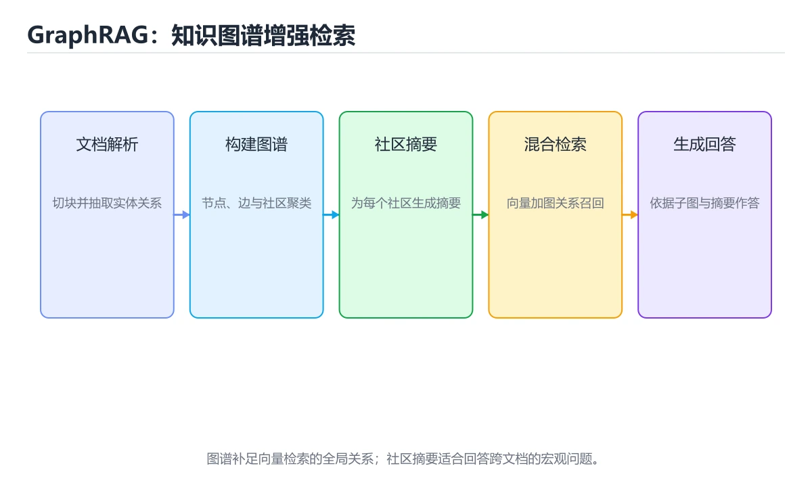
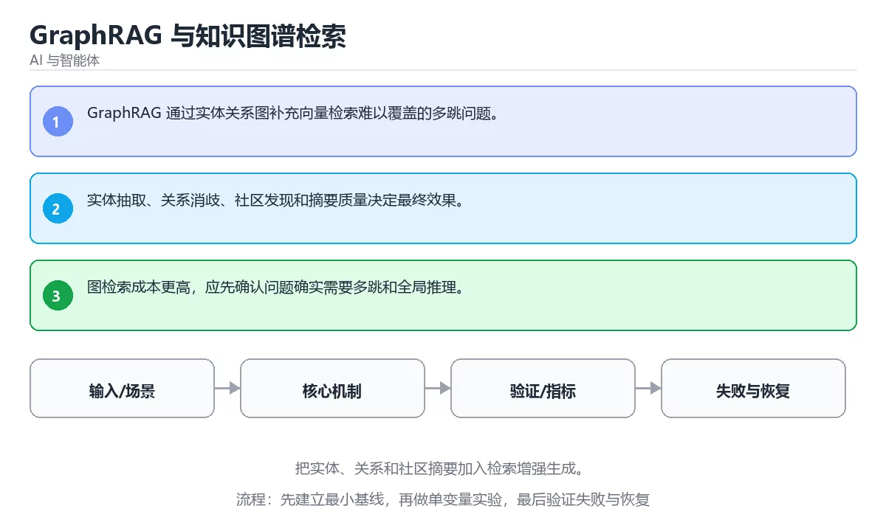

# GraphRAG 与知识图谱检索

> 内容更新时间：2026-10-06 · 学习阶段：进阶 · 预计用时：35 分钟





## 学习目标

- 能用自己的话解释：GraphRAG 通过实体关系图补充向量检索难以覆盖的多跳问题。
- 能用自己的话解释：实体抽取、关系消歧、社区发现和摘要质量决定最终效果。
- 能用自己的话解释：图检索成本更高，应先确认问题确实需要多跳和全局推理。
- 能把本课知识放回「AI 与智能体」，并完成练习与测验。

## 前置知识

- 已完成本分类的基础课程，能独立运行 GraphRAG 的最小示例。
- 本课关键词：GraphRAG、知识图谱、实体、社区摘要。
- 遇到不熟悉的术语先记录问题，完成练习后再回读。

## 核心知识

### 1. GraphRAG 通过实体关系图补充向量检索难以覆盖的多跳问题。

- 关键做法：先让 GraphRAG 的最小示例可复现，再加入并发或规模条件。
- 验证标准：GraphRAG 的结果可复现、错误可解释、失败能恢复。

### 2. 实体抽取、关系消歧、社区发现和摘要质量决定最终效果。

把这条结论放回「GraphRAG 与知识图谱检索」的完整流程里展开：

- 正文依据：能用自己的话解释：GraphRAG 通过实体关系图补充向量检索难以覆盖的多跳问题。
- 落地检查：把「2. 实体抽取、关系消歧、社区发现和摘要质量决定最终效果。」改写成一条可执行的核对项，逐条验证输入、超时与失败路径。

### 3. 图检索成本更高，应先确认问题确实需要多跳和全局推理。

把这条结论放回「GraphRAG 与知识图谱检索」的完整流程里展开：

- 正文依据：能用自己的话解释：实体抽取、关系消歧、社区发现和摘要质量决定最终效果。
- 落地检查：把「3. 图检索成本更高，应先确认问题确实需要多跳和全局推理。」改写成一条可执行的核对项，逐条验证输入、超时与失败路径。

## 关键流程

```text
输入 → 校验 → 核心处理 → 验证 → 记录指标 → 失败恢复
```

## 实践路径

1. 用一句话复述本课要解决的问题。
2. 跑通正文中的最小示例并记录基线。
3. 只改变一个输入或参数，预测并验证结果。
4. 补一个失败路径，记录错误、恢复和指标。
5. 把结论写成可复现的笔记或测试。

## 常见错误与排查

> 说明：本表由《GraphRAG 与知识图谱检索》的核心知识整理（2026-10-07），人工复核进度见 docs/content_review_batches.md。

| 易错点 | 容易踩的做法 | 正确结论 |
| --- | --- | --- |
| 抽取图谱不做校验 | 错误实体和关系会被当成事实反复引用 | 对抽取结果抽样核对，并保留原文出处 |
| 只抽实体不定义关系 | 图检索退化回关键词匹配 | 定义关系 schema 与方向，为边标注置信度和来源 |
| 全局问题仍走子图检索 | 跨文档的总结类问题答不全 | 全局问题用社区摘要与分层摘要回答，再回到原文核对 |

## 动手练习

1. 合上教程，用 3～5 句话解释GraphRAG 与知识图谱检索。
2. 从正文选一个例子，改变一个条件并预测结果。
3. 设计一个失败场景，写出止损与恢复步骤。

**验收标准**：留下输入、命令、输出、差异和下一步问题。

## 本课小结

- 本课围绕 GraphRAG、知识图谱、实体、社区摘要 展开，复习时重点核对它们的输入、输出和失败路径。
- 把还不确定的 answer 行为写成一条可执行验证，再进入下一课。


## 可运行练习

### 任务 1：先跑通，再解释

```python
def score(answer: str) -> int:
    return 1 if answer.strip() else 0

print(score("agent"))
```

### 任务 2：只改一个条件

把「GraphRAG 与知识图谱检索」的最小示例复制一份，只改一个条件再跑一次：

- 改动点：只调整 answer 的一个参数，其余条件一律不动。
- 预测：先写下「GraphRAG 与知识图谱检索」在改动后的输出或错误信息，再运行。
- 记录：对照改动前后的结果，指出差异出在哪一步。
- 验收：换回原条件能复现原结果，改动只影响GraphRAG。

### 任务 3：迁移到自己的数据

用同一套思路处理一组你自己的 GraphRAG 数据，保持输出格式与任务 1 一致。

## 故障现场

### 现场 1：抽取图谱不做校验

**症状**：在《GraphRAG 与知识图谱检索》的复现场景中，错误实体和关系会被当成事实反复引用。

**根因**：当出现“抽取图谱不做校验”时，执行路径已经绕过了《GraphRAG 与知识图谱检索》的关键约束，最终以“错误实体和关系会被当成事实反复引用”暴露出来；修复前必须先确认约束在哪里失效。

**修复**：针对《GraphRAG 与知识图谱检索》的问题，对抽取结果抽样核对，并保留原文出处。

**验证**：保留《GraphRAG 与知识图谱检索》里触发“错误实体和关系会被当成事实反复引用”的输入、版本和日志，按“对抽取结果抽样核对，并保留原文出处”完成修改后原样重放；只有失败现象消失且相邻场景仍可解释，才保留改动。

### 现场 2：只抽实体不定义关系

**症状**：在《GraphRAG 与知识图谱检索》的复现场景中，图检索退化回关键词匹配。

**根因**：当出现“只抽实体不定义关系”时，执行路径已经绕过了《GraphRAG 与知识图谱检索》的关键约束，最终以“图检索退化回关键词匹配”暴露出来；修复前必须先确认约束在哪里失效。

**修复**：针对《GraphRAG 与知识图谱检索》的问题，定义关系 schema 与方向，为边标注置信度和来源。

**验证**：保留《GraphRAG 与知识图谱检索》里触发“图检索退化回关键词匹配”的输入、版本和日志，按“定义关系 schema 与方向，为边标注置信度和来源”完成修改后原样重放；只有失败现象消失且相邻场景仍可解释，才保留改动。

### 现场 3：全局问题仍走子图检索

**症状**：在《GraphRAG 与知识图谱检索》的复现场景中，跨文档的总结类问题答不全。

**根因**：触发点是把“全局问题仍走子图检索”当成安全做法。它没有满足《GraphRAG 与知识图谱检索》要求的前提，因此先表现为“跨文档的总结类问题答不全”；排查时先完整复现这一段，再核对输入、配置与依赖。

**修复**：针对《GraphRAG 与知识图谱检索》的问题，全局问题用社区摘要与分层摘要回答，再回到原文核对。

**验证**：先在《GraphRAG 与知识图谱检索》中记录“全局问题仍走子图检索”留下的失败证据，再执行“全局问题用社区摘要与分层摘要回答，再回到原文核对”并重放；确认错误路径变为明确结果，且修复没有掩盖同类故障。

## 深入补充：GraphRAG 与知识图谱检索 的取舍与边界

### 一、把概念放回真实约束

学习GraphRAG 与知识图谱检索时，最容易只记住结论而忽略前提。先写出三个约束：数据规模、时间预算、可接受的失败方式；再判断 GraphRAG 与 知识图谱 在这些约束下是否仍然成立。只要约束改变，原来的最优解就可能变成错误解。

| 维度 | 要回答的问题 | 常见做法 | 失败信号 |
| --- | --- | --- | --- |
| 数据 | GraphRAG 的训练或检索数据从哪来、质量如何 | 清洗、去重、标注与版本化 | 评测集泄漏或分布漂移 |
| 模型 | 知识图谱 的能力边界与成本是多少 | 基线对比、离线评测、灰度发布 | 指标好看但线上任务失败 |
| 评测 | 如何证明改动真的有效 | 固定评测集、人工抽检、A/B | 只比较单例输出 |
| 安全 | 失败时会不会泄露或越权 | 权限校验、内容过滤、审计 | 提示注入或数据外泄 |

### 二、三个容易混淆的边界

1. 澄清输入与目标。先写清「GraphRAG 与知识图谱检索」要解决的问题、合法输入范围和成功标准，再进入后续步骤。
2. **把“平均值”当成“全部”**：GraphRAG 的指标好看，不代表尾部请求、冷启动或失败重试也好看。
3. **把“当前版本”当成“永久行为”**：知识图谱 依赖的默认值、API 或性能特征都可能随版本变化，需要固定版本并保留回归用例。

### 三、一个生产场景

假设团队要在真实系统里使用GraphRAG 与知识图谱检索：第一周先做小流量验证，记录 GraphRAG 的基线与异常；第二周扩大输入规模，观察 知识图谱 是否成为瓶颈；第三周再做故障演练，主动注入超时、重复请求和依赖不可用，确认系统能降级、能重试、能恢复。每一步都要留下指标、日志和结论，而不是只留下“感觉更快了”。

### 四、自测清单

- 能否用一句话说出GraphRAG 与知识图谱检索解决的核心问题与不适用场景？
- 能否画出 GraphRAG 的数据流或状态变化，并标出失败路径？
- 把 answer 的输入推到边界，说明本课哪一条结论会先失效。
- 能否写出一条可复现的验证命令，让别人独立得到相同结论？

### 五、AI 工程补充

在GraphRAG 与知识图谱检索里，模型输出只是系统的一部分：输入要先经过权限与数据质量检查，检索或工具调用要有超时和降级，输出要经过引用核验或规则校验，最后记录 token、延迟、失败类型和人工反馈。评测时至少准备固定题、边界题和对抗题，并把 GraphRAG 与 知识图谱 的指标分开记录；否则一次提示词改动看似提升体验，实际可能只是评测样本泄漏或随机波动。

## 本课复习清单


离开本课前，逐项确认：

- [ ] 不看解析，能说出「关于「实体抽取、关系消歧、社区发现和摘要质量决定最终效果。」，下列说法正确的是？」的判断依据。
- [ ] 不看解析，能说出「关于「图检索成本更高，应先确认问题确实需要多跳和全局推理。」，下列说法正确的是？」的判断依据。
- [ ] 不看解析，能说出「这段 Python 代码是「GraphRAG 与知识图谱检索」的示例片段，下面哪一项描述与它一致？」的判断依据。
- [ ] 至少运行一次《GraphRAG 与知识图谱检索》的示例，记录输入、输出和一个边界情况。
- [ ] 把本课最容易混淆的两个概念写成一句话对照。

| 复盘项 | 记录 |
| --- | --- |
| 已经能独立解释的考点 |  |
| 仍然说不清的概念 |  |
| 下一步验证动作 |  |

## 复习与自测

对照 核心知识 复述本课结论，答不上来的部分回到 answer 的示例重跑一次。

### 核心知识

自检：这一节与相邻主题的边界在哪里？

### 动手练习

自检：如果去掉这一节里的一个前提，结论会怎样变化？

### 验证步骤

制造一次错误输入，记录错误信息与修复方式。
### 追问 1：关于「GraphRAG 通过实体关系图补充向量检索难以覆盖的多跳问题。」，下列说法正确的是？

- 先写下判断，再对照：GraphRAG 通过实体关系图补充向量检索难以覆盖的多跳问题。
- 检查点：answer 在输入越界时会产生什么可观察的结果？

### 追问 2：关于「实体抽取、关系消歧、社区发现和摘要质量决定最终效果。」，下列说法正确的是？

- 先写下判断，再对照：实体抽取、关系消歧、社区发现和摘要质量决定最终效果。

### 追问 3：关于「图检索成本更高，应先确认问题确实需要多跳和全局推理。」，下列说法正确的是？

- 先写下判断，再对照：图检索成本更高，应先确认问题确实需要多跳和全局推理。

### 追问 4：本课的核心学习目标是什么？

- 先写下判断，再对照：把实体、关系和社区摘要加入检索增强生成。

### 追问 5：以下哪些术语与GraphRAG 与知识图谱检索直接相关？（多选）

- 先写下判断，再对照：GraphRAG、知识图谱

## 术语速查

| 术语 | 一句话说明 |
| --- | --- |
| `GraphRAG` | GraphRAG 通过实体关系图补充向量检索难以覆盖的多跳问题。 |
| `知识图谱` | 用实体、关系和属性组织的结构化知识网络。 |
| `实体` | 按“GraphRAG 与知识图谱检索”中 GraphRAG、知识图谱、实体 的实践顺序，把四个步骤排成从准备到复盘的合理顺序。 |
| `社区摘要` | 对图结构中一组紧密节点生成概括，用于回答全局性问题并连接局部事实。 |

## 零基础精讲：把GraphRAG 与知识图谱检索真正讲透

### 先建立一个直觉

把「GraphRAG 与知识图谱检索」看成一条可评测的流水线：输入经过 GraphRAG 处理，产出候选结果，再由 知识图谱 决定哪些结果可以真正执行；每一环都要有可测的输入、输出与失败处理。

本课的摘要可以当作一张地图：把实体、关系和社区摘要加入检索增强生成。

### 逐步拆解

1. 澄清输入与目标。先写清「GraphRAG 与知识图谱检索」要解决的问题、合法输入范围和成功标准，再进入后续步骤。
2. 描述处理过程。把「GraphRAG、知识图谱、实体、社区摘要」映射到具体步骤，每步都要求能单独验证。
3. 定义输出。把 answer 的返回值、日志和失败信号都写清楚，缺一项都不算完整。
4. 让「GraphRAG 与知识图谱检索」的失败路径尽早暴露：把GraphRAG推到边界值，记录错误信息、重试或降级动作，以及人工兜底条件。
5. 选一个只有两三步的GraphRAG例子，先写出预期输出，再运行确认；不一致时先怀疑前提而不是代码。

### 把正文串成一条执行链

- **1. GraphRAG 通过实体关系图补充向量检索难以覆盖的多跳问题。**：在「GraphRAG 与知识图谱检索」里，「1. GraphRAG 通过实体关系图补充向量检索难以覆盖的多跳问题。」这一步要先写清输入与预期，再记录实际结果和差异；结果不符时回到对应小节核对前提。
- **2. 实体抽取、关系消歧、社区发现和摘要质量决定最终效果。**：在「GraphRAG 与知识图谱检索」里，「2. 实体抽取、关系消歧、社区发现和摘要质量决定最终效果。」这一步要先写清输入与预期，再记录实际结果和差异；结果不符时回到对应小节核对前提。
- **3. 图检索成本更高，应先确认问题确实需要多跳和全局推理。**：在「GraphRAG 与知识图谱检索」里，「3. 图检索成本更高，应先确认问题确实需要多跳和全局推理。」这一步要先写清输入与预期，再记录实际结果和差异；结果不符时回到对应小节核对前提。
- **考点 1：按“GraphRAG 与知识图谱检索”中 GraphRAG、知识图谱、实体 的实践顺序，把四个步骤排成从准备到复盘的合理顺序。**：先独立作答，再回到本课对应小节核对判断依据；答错时记录是哪一个前提被忽略。
- **考点 2：关于「实体抽取、关系消歧、社区发现和摘要质量决定最终效果。」，下列说法正确的是？**：先独立作答，再回到本课对应小节核对判断依据；答错时记录是哪一个前提被忽略。
- **考点 3：关于「图检索成本更高，应先确认问题确实需要多跳和全局推理。」，下列说法正确的是？**：先独立作答，再回到本课对应小节核对判断依据；答错时记录是哪一个前提被忽略。

### 从测验反推易错点

**检查点 1：关于「GraphRAG 通过实体关系图补充向量检索难以覆盖的多跳问题。」，下列说法正确的是？**

- 参考判断：GraphRAG 通过实体关系图补充向量检索难以覆盖的多跳问题。
- 自问：如果去掉题干里的一个限定词，结论还成立吗？

**检查点 2：关于「实体抽取、关系消歧、社区发现和摘要质量决定最终效果。」，下列说法正确的是？**

- 参考判断：实体抽取、关系消歧、社区发现和摘要质量决定最终效果。

**检查点 3：关于「图检索成本更高，应先确认问题确实需要多跳和全局推理。」，下列说法正确的是？**

- 参考判断：图检索成本更高，应先确认问题确实需要多跳和全局推理。

**检查点 4：本课的核心学习目标是什么？**

- 参考判断：把实体、关系和社区摘要加入检索增强生成。

**检查点 5：以下哪些术语与GraphRAG 与知识图谱检索直接相关？（多选）**

- 参考判断：GraphRAG、知识图谱

### 工程排错顺序

| 先查什么 | 要得到的证据 | 判断标准 |
| --- | --- | --- |
| 模型输入是否经过长度、格式与敏感信息检查？ | 日志、输入样例、测试或指标 | 能复现并解释，才算定位 |
| 工具调用是否最小权限、可超时、可取消？ | 日志、输入样例、测试或指标 | 能复现并解释，才算定位 |
| 输出是否有引用、置信度或人工复核兜底？ | 日志、输入样例、测试或指标 | 能复现并解释，才算定位 |
| 成本、延迟与失败率是否有指标？ | 日志、输入样例、测试或指标 | 能复现并解释，才算定位 |

### 变式训练

1. 把 GraphRAG 放进一个只有单机、没有额外依赖的小项目，先保证正确再扩展。
2. 把 answer 的数据量提高一个数量级，观察延迟与内存的变化拐点。
3. 制造一次 GraphRAG 相关的依赖超时或错误输入，要求错误可解释且不留半完成状态。
5. 减少一个输入字段后重跑 answer，记录失败信息出现在哪一层，据此判断这个字段是必填还是可推导。
6. 在低带宽或低算力条件下重跑 知识图谱，记录降级路径是否仍然可用。

### 本课自测

- [ ] 能用一句话解释「GraphRAG」在本课中的角色与边界。
- [ ] 能举出一个正常例子和一个失败例子。
- [ ] 能说出最小验证步骤，以及需要记录的证据。
- [ ] 能用一句话解释「知识图谱」在本课中的角色与边界。
- [ ] 能用一句话解释「实体」在本课中的角色与边界。
- [ ] 能用一句话解释「社区摘要」在本课中的角色与边界。

### 迁移案例库

围绕 answer 重复同一套方法，每完成一轮就把差异写进笔记。

#### 迁移案例 1：围绕「GraphRAG」做一次小实验

**目标**：在不改变课程主体的前提下，验证GraphRAG 与知识图谱检索中的一个关键判断。

**步骤**：
1. 复述当前方案对「GraphRAG」的假设，写成一句可证伪的话。
2. 设计一个正常输入和一个边界输入，分别预测输出。
3. 运行或逐步演算，记录实际输出、耗时和失败信息。
4. 只调整一个参数，比较前后差异并解释原因。
5. 补充一条测试或复习卡，确保下次能更快复现。

**验收**：GraphRAG的结论要有证据、差异可解释、失败可恢复；做不到时回到「核心知识」缩小问题范围。

#### 迁移案例 2：围绕「知识图谱」做一次小实验

**步骤**：
1. 复述当前方案对「知识图谱」的假设，写成一句可证伪的话。

#### 迁移案例 3：围绕「实体」做一次小实验

**步骤**：
1. 复述当前方案对「实体」的假设，写成一句可证伪的话。

#### 迁移案例 4：围绕「社区摘要」做一次小实验

**步骤**：
1. 复述当前方案对「社区摘要」的假设，写成一句可证伪的话。

#### 迁移案例 5：围绕「GraphRAG」做一次小实验

**步骤**：

#### 迁移案例 6：围绕「知识图谱」做一次小实验

**步骤**：

#### 迁移案例 7：围绕「实体」做一次小实验

**步骤**：

#### 迁移案例 8：围绕「社区摘要」做一次小实验

**步骤**：

#### 迁移案例 9：围绕「GraphRAG」做一次小实验

**步骤**：

#### 迁移案例 10：围绕「知识图谱」做一次小实验

**步骤**：

#### 迁移案例 11：围绕「实体」做一次小实验

**步骤**：

#### 迁移案例 12：围绕「社区摘要」做一次小实验

**步骤**：

#### 迁移案例 13：围绕「GraphRAG」做一次小实验

**步骤**：

#### 迁移案例 14：围绕「知识图谱」做一次小实验

**步骤**：

#### 迁移案例 15：围绕「实体」做一次小实验

**步骤**：

#### 迁移案例 16：围绕「社区摘要」做一次小实验

**步骤**：

<!-- p0-depth-v2:end -->

## 考点精讲

### 考点 1：顺序排列·GraphRAG

- **题目**：按“GraphRAG 与知识图谱检索”中 GraphRAG、知识图谱、实体 的实践顺序，把四个步骤排成从准备到复盘的合理顺序。
- **判断依据**：在「GraphRAG 与知识图谱检索」里，在本课的练习里，顺序应当是：先明确 GraphRAG 的输入、输出与约束 → 写出最小示例并核对 知识图谱 的基线结果 → 只改一个变量，记录边界与失败路径的变化 → 固定版本与证据，把本课的结论写成可复现记录。这个顺序把 GraphRAG 的输入、输出和约束放在最前面，在GraphRAG 与知识图谱检索里避免概念没对齐就开始调参。第二步用 知识图谱 建立可核对的基线，在GraphRAG 与知识图谱检索里第三步才允许改变一个变量并观察失败路径。

### 考点 2：概念判断·GraphRAG

- **题目**：关于「实体抽取、关系消歧、社区发现和摘要质量决定最终效果。」，下列说法正确的是？
- **判断依据**：在「GraphRAG 与知识图谱检索」里，实体抽取、关系消歧、社区发现和摘要质量决定最终效果。这道题的关键在「GraphRAG 与知识图谱检索」的GraphRAG、知识图谱、实体：先确认题干“关于实体抽取、关系消歧、社区发现和摘”问的是哪一步，再排除偷换前提的选项。把“实体抽取、关系消歧”代回「GraphRAG 与知识图谱检索」里“实体抽取、关系消歧、社区发现和摘要质量决定最终效果”的例子核对，条件一旦改变，结论就要用GraphRAG、知识图谱、实体重新推导。

### 考点 3：概念判断·GraphRAG

- **题目**：关于「图检索成本更高，应先确认问题确实需要多跳和全局推理。」，下列说法正确的是？
- **判断依据**：在「GraphRAG 与知识图谱检索」里，图检索成本更高，应先确认问题确实需要多跳和全局推理。在「GraphRAG 与知识图谱检索」里判断这道题，要把GraphRAG、知识图谱、实体的条件、过程与失败路径逐项对齐，换成“关于图检索成本更高”这个场景，只有满足前提的结论才成立。回到「GraphRAG 与知识图谱检索」的正文示例，用“关于图检索成本更高”走一遍GraphRAG、知识图谱、实体的完整流程，能复现的结论才可以保留。

### 考点 4：代码补全·GraphRAG

- **题目**：这段 Python 代码是「GraphRAG 与知识图谱检索」的示例片段，下面哪一项描述与它一致？
- **判断依据**：在「GraphRAG 与知识图谱检索」里，这段代码会产生可观察的输出，运行后能看到结果。这段代码出自「GraphRAG 与知识图谱检索」的正文示例，围绕GraphRAG、知识图谱、实体展开；把输入或边界换成空值、极值或失败情况后，结论要以「GraphRAG 与知识图谱检索」的实际运行结果为准。

### 考点 5：多选辨析·GraphRAG

- **题目**：以下哪些术语与「GraphRAG 与知识图谱检索」直接相关？（多选）
- **判断依据**：回到「GraphRAG 与知识图谱检索」的正文示例，用“以下哪些术语与GraphRAG 与知”走一遍GraphRAG、知识图谱、实体的完整流程，能复现的结论才可以保留。在「GraphRAG 与知识图谱检索」里，回到GraphRAG、知识图谱、实体本身再看一遍：只有“GraphRAG”与题干“以下哪些术语与GraphRAG”的前提一致，结论才成立。

## English Overview

**Title:** GraphRAG and Knowledge Graph Retrieval

**Summary:** Add entities, relations and community summaries to retrieval-augmented generation.

**Category:** AI & Agents
**Level:** 高级
**Key terms:** GraphRAG, 知识图谱, 实体, 社区摘要

## 内容元数据

- 内容版本：v2.0
- 最后更新：2026-10-06
- 学习阶段：进阶
- 适用环境：主流大模型 API、开源模型与向量数据库；本课聚焦 GraphRAG。
- 内容来源：内置结构化课程与工程实践整理
- 相关主题：GraphRAG、知识图谱、实体、社区摘要
- 质量版本：P0 测验标准 + P1 覆盖扩展 + P2 体验补全

## 最小可运行示例

先用下面的示例确认 GraphRAG 的基线，再只改一个与 知识图谱 相关的值：

```python
def score(answer: str) -> int:
    return 1 if answer.strip() else 0

print(score("agent"))
```

## 预期输出

```text
1
```

## 验证步骤

1. 记录运行环境、命令和真实输出。
2. 修改一个输入，先写预测再运行。
4. 把结论写回本课笔记或测试用例。

## 参考资料与复核

- 最后复核：2026-10-04
- 下次复核：2026-12-24
- 复核范围：版本兼容、API 行为、安全建议与工程实践
- 来源性质：官方文档、标准或权威教材；正文为离线教学重组

| 参考资料 | 本课用途 |
| --- | --- |
| [LlamaIndex 文档](https://docs.llamaindex.ai/) | 索引、检索与数据框架 |
| [Anthropic 文档](https://docs.anthropic.com/) | Claude API 与 Agent 安全 |
| [scikit-learn 文档](https://scikit-learn.org/stable/documentation.html) | 经典机器学习算法 |

> 「GraphRAG 与知识图谱检索」的链接用于离线阅读后的延伸核对；App 不会自动联网。

## 复习与迁移

复习目标：把「GraphRAG 与知识图谱检索」的判断标准放回可复现的例子里。先自己作答，再对照依据；如果结论正确但理由不完整，回到正文补足前提。

### 概念复述

- 用一句话说明「GraphRAG 与知识图谱检索」解决什么问题：把实体、关系和社区摘要加入检索增强生成。
- 写出GraphRAG、知识图谱、实体之间的关系，并各举一个例子。
- 说出本课最容易混淆的两个概念，以及区分它们的判据。

### 正文逐节复核

- **深入补充：GraphRAG 与知识图谱检索 的取舍与边界**：学习GraphRAG 与知识图谱检索时，最容易只记住结论而忽略前提。
- **零基础精讲：把GraphRAG 与知识图谱检索真正讲透**：本课的摘要可以当作一张地图：把实体、关系和社区摘要加入检索增强生成。

### 测验回顾

1. 按“GraphRAG 与知识图谱检索”中 GraphRAG、知识图谱、实体 的实践顺序，把四个步骤排成从准备到复盘的合理顺序。
   - 依据：在「GraphRAG 与知识图谱检索」里，在本课的练习里，顺序应当是：先明确 GraphRAG 的输入、输出与约束 → 写出最小示例并核对 知识图谱 的基线结果 → 只改一个变量，记录边界与失败路径的变化 → 固定版本与证据，把本课的结论写成可复现记录。这个顺序把 GraphRAG 的输入、输出和约束放在最前面，在GraphRAG 与知识图谱检索里避免概念没对齐就开始调参。第二步用 知识图谱 建立可核对的基线，在GraphRAG 与知识图谱检索里第三步才允许改变一个变量并观察失败路径。
2. 关于「实体抽取、关系消歧、社区发现和摘要质量决定最终效果。」，下列说法正确的是？
   - 依据：在「GraphRAG 与知识图谱检索」里，实体抽取、关系消歧、社区发现和摘要质量决定最终效果。这道题的关键在「GraphRAG 与知识图谱检索」的GraphRAG、知识图谱、实体：先确认题干“关于实体抽取、关系消歧、社区发现和摘”问的是哪一步，再排除偷换前提的选项。把“实体抽取、关系消歧”代回「GraphRAG 与知识图谱检索」里“实体抽取、关系消歧、社区发现和摘要质量决定最终效果”的例子核对，条件一旦改变，结论就要用GraphRAG、知识图谱、实体重新推导。
3. 关于「图检索成本更高，应先确认问题确实需要多跳和全局推理。」，下列说法正确的是？
   - 依据：在「GraphRAG 与知识图谱检索」里，图检索成本更高，应先确认问题确实需要多跳和全局推理。在「GraphRAG 与知识图谱检索」里判断这道题，要把GraphRAG、知识图谱、实体的条件、过程与失败路径逐项对齐，换成“关于图检索成本更高”这个场景，只有满足前提的结论才成立。回到「GraphRAG 与知识图谱检索」的正文示例，用“关于图检索成本更高”走一遍GraphRAG、知识图谱、实体的完整流程，能复现的结论才可以保留。
4. 这段 Python 代码是「GraphRAG 与知识图谱检索」的示例片段，下面哪一项描述与它一致？
   - 依据：在「GraphRAG 与知识图谱检索」里，这段代码会产生可观察的输出，运行后能看到结果。这段代码出自「GraphRAG 与知识图谱检索」的正文示例，围绕GraphRAG、知识图谱、实体展开；把输入或边界换成空值、极值或失败情况后，结论要以「GraphRAG 与知识图谱检索」的实际运行结果为准。
5. 以下哪些术语与「GraphRAG 与知识图谱检索」直接相关？（多选）
   - 依据：回到「GraphRAG 与知识图谱检索」的正文示例，用“以下哪些术语与GraphRAG 与知”走一遍GraphRAG、知识图谱、实体的完整流程，能复现的结论才可以保留。在「GraphRAG 与知识图谱检索」里，回到GraphRAG、知识图谱、实体本身再看一遍：只有“GraphRAG”与题干“以下哪些术语与GraphRAG”的前提一致，结论才成立。

### 迁移练习

把「GraphRAG 与知识图谱检索」的结论迁移到相邻主题，每次迁移都写清预测与证据：

1. 换输入：用GraphRAG处理一组你自己的数据，对比教材示例的结果差异。
2. 换失败条件：制造一个知识图谱相关的错误，说明如何从错误信息定位根因。
3. 换规模：把数据量或并发度提高一个数量级，说明「GraphRAG 与知识图谱检索」的结论是否仍成立。
