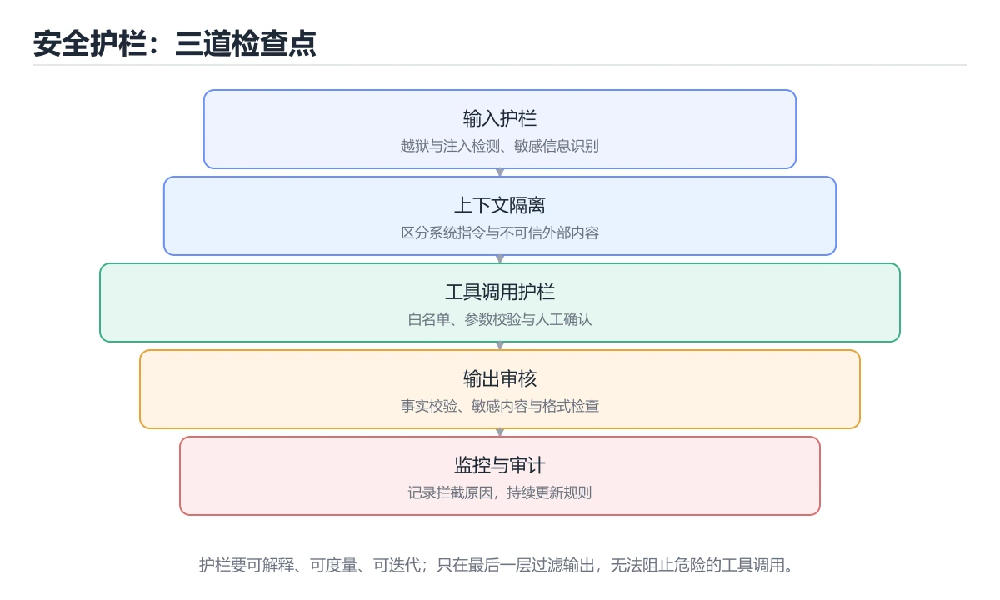
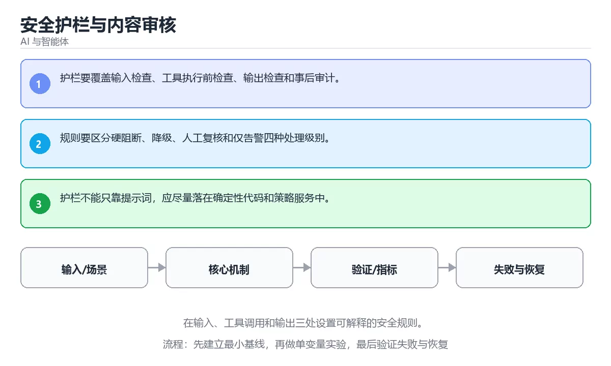

# 安全护栏与内容审核





> 内容更新时间：2026-10-06 · 学习阶段：高级 · 预计用时：35 分钟

## 本节知识框架

**课程定位**：所属分类 `ai`（AI 与智能体），课程主题 `安全护栏与内容审核`，学习阶段 高级，建议用时 40 分钟。

本课主线：在输入、工具调用和输出三处设置可解释的安全规则。

**学完本课应当能够**
- 说清 `Guardrail` 与 `内容审核` 的含义与区别，并各举一个正例和一个反例。
- 用本课示例验证 `策略` 的行为，记录输入、输出与失败条件。
- 遇到「只用关键词黑名单」这类问题时，能说出触发条件与修复顺序。

### 从概念到验证的学习链条

1. `Guardrail`：先掌握 在模型输入输出前后检查安全、格式和权限，越界时拦截或降级，再用它解释 `内容审核` 为什么会出现。
2. `内容审核`：先掌握 检查输入或输出是否包含违规、有害或敏感内容，再用它解释 `策略` 为什么会出现。
3. `策略`：先掌握 按“安全护栏与内容审核”中 Guardrail、内容审核、策略 的实践顺序，把四个步骤排成从准备到复盘的合理顺序，再用它解释 `兜底` 为什么会出现。
4. `兜底`：先掌握 主流程失败时仍能给出安全、可解释结果的降级路径，再用它解释 本课示例的观察结果 为什么会出现。

**先修与衔接**：本课是「AI 与智能体」分类的第 41 课。先修内容：《Agent 安全、权限与沙箱》。《Agent 安全、权限与沙箱》里的 `Agent 安全`、`提示注入` 是本课的前提。相关或后续课程：《GraphRAG 与知识图谱检索》。

### 完成判据

- **定义关**：不看正文也能说明 `Guardrail` 是 在模型输入输出前后检查安全、格式和权限，越界时拦截或降级，并指出一个反例。
- **机制关**：能按“输入 → 转换 → 输出 → 验证”复述 `安全护栏与内容审核`，而不是只背结论。
- **示例关**：能运行或推演 `安全护栏与内容审核` 的 `text` 示例，并说明一个真实出现的标识符或字面量。
- **证据关**：能指出 `安全护栏与内容审核` 示例里的 调用了 `score()`，并说明它支持或反驳了本课的哪一条结论。
- **排错关**：能复现 只用关键词黑名单，记录现象并按 规则与分类模型并用，高风险命中转人工复核 修复。
- **迁移关**：能把 `Guardrail`、`内容审核`、`策略`、`兜底` 放进一个与 `安全护栏与内容审核` 不同的项目场景，并保持输入与验证条件可追踪。
- **复盘关**：学完 `安全护栏与内容审核` 后，用一句话写下仍然不确定的结论，并列出下一次验证需要的输入、环境和成功判据。

### 复习清单

- [ ] 能不看正文复述本课核心术语，并指出一个边界或反例。
- [ ] 能运行或推演本课示例，记录输入、输出与失败现象。
- [ ] 能完成一次自测，并把错题对照错误表定位原因。

## 核心概念定义

| 术语 | 操作性定义 | 常见边界与风险 |
| --- | --- | --- |
| Guardrail | 在模型输入输出前后检查安全、格式和权限，越界时拦截或降级。 | 权限与密钥策略变化会让结论失效，按最小权限并用真实凭据流程复验。 |
| 内容审核 | 检查输入或输出是否包含违规、有害或敏感内容。 | 只在「检查输入或输出是否包含违规、有害或敏感内容」这一前提下成立，换输入或换环境要重新验证。 |
| 策略 | 按“安全护栏与内容审核”中 Guardrail、内容审核、策略 的实践顺序，把四个步骤排成从准备到复盘的合理顺序。 | 权限与密钥策略变化会让结论失效，按最小权限并用真实凭据流程复验。 |
| 兜底 | 主流程失败时仍能给出安全、可解释结果的降级路径。 | 权限与密钥策略变化会让结论失效，按最小权限并用真实凭据流程复验。 |

## 原理与运行机制

### 机制总览

**教材衔接：核心知识**

### 1. 护栏要覆盖输入检查、工具执行前检查、输出检查和事后审计。

- 关键做法：先让 Guardrail 的最小示例可复现，再加入并发或规模条件。
- 验证标准：answer 的输出能被他人复现，边界输入有对应用例。

### 2. 规则要区分硬阻断、降级、人工复核和仅告警四种处理级别。

把这条结论放回「安全护栏与内容审核」的完整流程里展开：

- 正文依据：能用自己的话解释：护栏不能只靠提示词，应尽量落在确定性代码和策略服务中。
- 落地检查：把「2. 规则要区分硬阻断、降级、人工复核和仅告警四种处理级别。」改写成一条可执行的核对项，逐条验证输入、超时与失败路径。

### 3. 护栏不能只靠提示词，应尽量落在确定性代码和策略服务中。

把这条结论放回「安全护栏与内容审核」的完整流程里展开：

- 正文依据：本课关键词：Guardrail、内容审核、策略、兜底。
- 落地检查：把「3. 护栏不能只靠提示词，应尽量落在确定性代码和策略服务中。」改写成一条可执行的核对项，逐条验证输入、超时与失败路径。

**教材衔接：关键流程**

**教材衔接：实践路径**

**教材衔接：深入补充：安全护栏与内容审核 的取舍与边界**


### 五、AI 工程补充

**教材衔接：零基础精讲：把安全护栏与内容审核真正讲透**

### 先建立一个直觉

把「安全护栏与内容审核」看成一条可评测的流水线：输入经过 Guardrail 处理，产出候选结果，再由 内容审核 决定哪些结果可以真正执行；每一环都要有可测的输入、输出与失败处理。

本课的摘要可以当作一张地图：在输入、工具调用和输出三处设置可解释的安全规则。

### 逐步拆解

1. 澄清输入与目标。先写清「安全护栏与内容审核」要解决的问题、合法输入范围和成功标准，再进入后续步骤。
2. 描述处理过程。把「Guardrail、内容审核、策略、兜底」映射到具体步骤，每步都要求能单独验证。
3. 定义输出。Guardrail 的输出不仅包括正常结果，还包括错误码、日志和资源释放状态。
4. 让「安全护栏与内容审核」的失败路径尽早暴露：把Guardrail推到边界值，记录错误信息、重试或降级动作，以及人工兜底条件。
5. 用 answer 贯穿一次小实验：先预测输出，再运行或逐步推演，最后解释差异来自哪一步。

### 把正文串成一条执行链

- **1. 护栏要覆盖输入检查、工具执行前检查、输出检查和事后审计。**：在「安全护栏与内容审核」里，「1. 护栏要覆盖输入检查、工具执行前检查、输出检查和事后审计。」这一步要先写清输入与预期，再记录实际结果和差异；结果不符时回到对应小节核对前提。
- **2. 规则要区分硬阻断、降级、人工复核和仅告警四种处理级别。**：在「安全护栏与内容审核」里，「2. 规则要区分硬阻断、降级、人工复核和仅告警四种处理级别。」这一步要先写清输入与预期，再记录实际结果和差异；结果不符时回到对应小节核对前提。
- **3. 护栏不能只靠提示词，应尽量落在确定性代码和策略服务中。**：在「安全护栏与内容审核」里，「3. 护栏不能只靠提示词，应尽量落在确定性代码和策略服务中。」这一步要先写清输入与预期，再记录实际结果和差异；结果不符时回到对应小节核对前提。
- **考点 1：关于「护栏要覆盖输入检查、工具执行前检查、输出检查和事后审计。」，下列说法正确的是？**：先独立作答，再回到本课对应小节核对判断依据；答错时记录是哪一个前提被忽略。
- **考点 2：按“安全护栏与内容审核”中 Guardrail、内容审核、策略 的实践顺序，把四个步骤排成从准备到复盘的合理顺序。**：先独立作答，再回到本课对应小节核对判断依据；答错时记录是哪一个前提被忽略。
- **考点 3：关于「护栏不能只靠提示词，应尽量落在确定性代码和策略服务中。」，下列说法正确的是？**：先独立作答，再回到本课对应小节核对判断依据；答错时记录是哪一个前提被忽略。

### 从测验反推易错点

- 参考判断：护栏要覆盖输入检查、工具执行前检查、输出检查和事后审计。
- 自问：如果去掉题干里的一个限定词，结论还成立吗？

- 参考判断：规则要区分硬阻断、降级、人工复核和仅告警四种处理级别。

- 参考判断：护栏不能只靠提示词，应尽量落在确定性代码和策略服务中。

**检查点 4：本课的核心学习目标是什么？**

- 参考判断：在输入、工具调用和输出三处设置可解释的安全规则。

**检查点 5：以下哪些术语与安全护栏与内容审核直接相关？（多选）**

- 参考判断：Guardrail、内容审核

### 工程排错顺序

| 先查什么 | 要得到的证据 | 判断标准 |
| --- | --- | --- |
| 模型输入是否经过长度、格式与敏感信息检查？ | 日志、输入样例、测试或指标 | 能复现并解释，才算定位 |
| 工具调用是否最小权限、可超时、可取消？ | 日志、输入样例、测试或指标 | 能复现并解释，才算定位 |
| 输出是否有引用、置信度或人工复核兜底？ | 日志、输入样例、测试或指标 | 能复现并解释，才算定位 |
| 成本、延迟与失败率是否有指标？ | 日志、输入样例、测试或指标 | 能复现并解释，才算定位 |

### 变式训练

1. 把 Guardrail 放进一个只有单机、没有额外依赖的小项目，先保证正确再扩展。
2. 把 Guardrail 的输入规模扩大十倍，记录时间、内存和失败路径，找出第一个瓶颈。
3. 把 内容审核 换成失败输入，记录错误信息与恢复动作。
5. 把 answer 的执行顺序调换一次，记录哪个中间结果先错；顺序敏感的地方就是本课的关键约束。
6. 在低带宽或低算力条件下重跑 内容审核，记录降级路径是否仍然可用。


### 迁移案例库

换一个 内容审核 约束重做一次，确认结论在新条件下是否仍然成立。

#### 迁移案例 1：围绕「Guardrail」做一次小实验

**验收**：Guardrail 的正常、边界、失败三条路径都要有结论；失败路径要写清恢复动作与「安全护栏与内容审核」里仍然存在的剩余风险。

#### 迁移案例 2：围绕「内容审核」做一次小实验

**步骤**：
1. 复述当前方案对「内容审核」的假设，写成一句可证伪的话。

#### 迁移案例 3：围绕「策略」做一次小实验

**步骤**：
1. 复述当前方案对「策略」的假设，写成一句可证伪的话。

#### 迁移案例 4：围绕「兜底」做一次小实验

**步骤**：
1. 复述当前方案对「兜底」的假设，写成一句可证伪的话。

#### 迁移案例 5：围绕「Guardrail」做一次小实验

**步骤**：

#### 迁移案例 6：围绕「内容审核」做一次小实验

**步骤**：

#### 迁移案例 7：围绕「策略」做一次小实验

**步骤**：

#### 迁移案例 8：围绕「兜底」做一次小实验

**步骤**：

#### 迁移案例 9：围绕「Guardrail」做一次小实验

**步骤**：

#### 迁移案例 10：围绕「内容审核」做一次小实验

**步骤**：

#### 迁移案例 11：围绕「策略」做一次小实验

**步骤**：

#### 迁移案例 12：围绕「兜底」做一次小实验

**步骤**：

#### 迁移案例 13：围绕「Guardrail」做一次小实验

**步骤**：

#### 迁移案例 14：围绕「内容审核」做一次小实验

**步骤**：

#### 迁移案例 15：围绕「策略」做一次小实验

**步骤**：

#### 迁移案例 16：围绕「兜底」做一次小实验

**步骤**：

<!-- p0-depth-v2:end -->

**教材衔接：验证步骤**

### 机制拆解：每一步的输入、动作与输出

#### 1. `Guardrail`
- 输入：`Guardrail`；本步把 在模型输入输出前后检查安全、格式和权限，越界时拦截或降级 当作判断规则。
- 动作：围绕 `Guardrail` 保留中间状态，并记录它与 `内容审核` 的对应关系。
- 输出：`内容审核`，它可以被下一段代码、测试或记录继续使用。
- `Guardrail` 的失败条件：权限与密钥策略变化会让结论失效，按最小权限并用真实凭据流程复验。

#### 2. `内容审核`
- 输入：`Guardrail`；本步把 检查输入或输出是否包含违规、有害或敏感内容 当作判断规则。
- 动作：围绕 `内容审核` 保留中间状态，并记录它与 `策略` 的对应关系。
- 输出：`策略`，它可以被下一段代码、测试或记录继续使用。
- `内容审核` 的失败条件：只在「检查输入或输出是否包含违规、有害或敏感内容」这一前提下成立，换输入或换环境要重新验证。

#### 3. `策略`
- 输入：`内容审核`；本步把 按“安全护栏与内容审核”中 Guardrail、内容审核、策略 的实践顺序，把四个步骤排成从准备到复盘的合理顺序 当作判断规则。
- 动作：围绕 `策略` 保留中间状态，并记录它与 `兜底` 的对应关系。
- 输出：`兜底`，它可以被下一段代码、测试或记录继续使用。
- `策略` 的失败条件：权限与密钥策略变化会让结论失效，按最小权限并用真实凭据流程复验。

#### 4. `兜底`
- 输入：`策略`；本步把 主流程失败时仍能给出安全、可解释结果的降级路径 当作判断规则。
- 动作：围绕 `兜底` 保留中间状态，并记录它与 `score` 的对应关系。
- 输出：`score`，它可以被下一段代码、测试或记录继续使用。
- `兜底` 的失败条件：权限与密钥策略变化会让结论失效，按最小权限并用真实凭据流程复验。

### 示例中的可观察事实

1. 调用了 `score()`；它对应的课程主题是 `安全护栏与内容审核`。
2. 调用了 `strip()`；它对应的课程主题是 `安全护栏与内容审核`。
3. 调用了 `print()`；它对应的课程主题是 `安全护栏与内容审核`。
4. 出现字面量 `agent`；它对应的课程主题是 `安全护栏与内容审核`。

### 复现实验记录

- 环境：`安全护栏与内容审核` 使用 `text` 示例，固定 `Guardrail`、`内容审核`、`策略`、`兜底` 作为第一组条件。
- 首轮输入：先确认 调用了 `score()`，预测 `Guardrail` 会怎样变化。
- 基线观察：记录命令、输入、输出和错误原文，不用截图代替可复制的文本。
- 单变量修改：只改变 `Guardrail`，观察 `兜底` 是否仍满足定义。
- 失败注入：复现 只用关键词黑名单，确认现象是 改写、拆字或多语言就能绕过。
- 记录结论：把“修改前、修改后、预期变化、实际变化”写成四列表，这样复盘 `安全护栏与内容审核` 时才能区分概念错误与实现错误。

## 典型应用场景

- **只用关键词黑名单**：典型现象是改写、拆字或多语言就能绕过；正确做法是规则与分类模型并用，高风险命中转人工复核。
- **只做输入过滤**：典型现象是输出阶段仍可能生成有害内容；正确做法是输入、上下文与输出三段都设检查点。
- **拦截后不记录不解释**：典型现象是规则无法复盘也难以改进；正确做法是记录命中的规则、置信度与处置结果，定期回看误判。

### 最小验证场景

- 准备：保留 `text` 示例的原始输入，先记录 `安全护栏与内容审核` 的基线输出和完整运行命令。
- 观察：先核对 调用了 `score()`，再改变一个与 `Guardrail` 相关的条件。
- 判定：新结果与 `安全护栏与内容审核` 的基线不同不等于错误；只有当差异破坏了 `Guardrail` 的定义或错误表中的约束，才判定为失败。

### 选择与边界

- 使用 `Guardrail` 时，先满足它的定义：在模型输入输出前后检查安全、格式和权限，越界时拦截或降级；权限与密钥策略变化会让结论失效，按最小权限并用真实凭据流程复验。
- 使用 `内容审核` 时，先满足它的定义：检查输入或输出是否包含违规、有害或敏感内容；只在「检查输入或输出是否包含违规、有害或敏感内容」这一前提下成立，换输入或换环境要重新验证。
- 使用 `策略` 时，先满足它的定义：按“安全护栏与内容审核”中 Guardrail、内容审核、策略 的实践顺序，把四个步骤排成从准备到复盘的合理顺序；权限与密钥策略变化会让结论失效，按最小权限并用真实凭据流程复验。
- 使用 `兜底` 时，先满足它的定义：主流程失败时仍能给出安全、可解释结果的降级路径；权限与密钥策略变化会让结论失效，按最小权限并用真实凭据流程复验。

## 代码/协议/SQL 示例

**教材衔接：最小可运行示例**

下面这段代码演示 Guardrail 的最小路径，先原样运行，再按注释改一处：

```python
def score(answer: str) -> int:
    return 1 if answer.strip() else 0

print(score("agent"))
```

**教材衔接：预期输出**

```text
1
```

### 示例精读：先找证据，再改一个条件

1. 调用了 `score()`；它出现在 `安全护栏与内容审核` 的示例中，阅读时先确认它前后各发生了什么。
2. 调用了 `strip()`；它出现在 `安全护栏与内容审核` 的示例中，阅读时先确认它前后各发生了什么。
3. 调用了 `print()`；它出现在 `安全护栏与内容审核` 的示例中，阅读时先确认它前后各发生了什么。
4. 出现字面量 `agent`；它出现在 `安全护栏与内容审核` 的示例中，阅读时先确认它前后各发生了什么。
- 在 `安全护栏与内容审核` 中与 `Guardrail` 对照：示例必须能支持 在模型输入输出前后检查安全、格式和权限，越界时拦截或降级，否则说明这一段还缺少实现或验证步骤。
- 在 `安全护栏与内容审核` 中与 `内容审核` 对照：示例必须能支持 检查输入或输出是否包含违规、有害或敏感内容，否则说明这一段还缺少实现或验证步骤。
- 在 `安全护栏与内容审核` 中与 `策略` 对照：示例必须能支持 按“安全护栏与内容审核”中 Guardrail、内容审核、策略 的实践顺序，把四个步骤排成从准备到复盘的合理顺序，否则说明这一段还缺少实现或验证步骤。
- 在 `安全护栏与内容审核` 中与 `兜底` 对照：示例必须能支持 主流程失败时仍能给出安全、可解释结果的降级路径，否则说明这一段还缺少实现或验证步骤。

## 时间/空间复杂度或性能分析

**性能关注点（安全护栏与内容审核）**：算力与显存决定可行规模：记录训练或推理耗时、显存峰值与模型精度，换数据集要重新评估。

**测量方法**：以 `安全护栏与内容审核` 的 `Guardrail` 场景为对象，固定输入跑一遍记录基线，再把规模或并发度提高一个数量级复测；两次结果的差值与波动范围才是结论依据。

### 需要控制的变量与记录项

- `安全护栏与内容审核` 的 `Guardrail`：固定它的版本、输入范围和资源上限，分别记录速度、内存与失败率的变化。
- `安全护栏与内容审核` 的 `内容审核`：固定它的版本、输入范围和资源上限，分别记录速度、内存与失败率的变化。
- `安全护栏与内容审核` 的 `策略`：固定它的版本、输入范围和资源上限，分别记录速度、内存与失败率的变化。
- `安全护栏与内容审核` 的 `兜底`：固定它的版本、输入范围和资源上限，分别记录速度、内存与失败率的变化。
- `安全护栏与内容审核` 中 `Guardrail` 的边界：权限与密钥策略变化会让结论失效，按最小权限并用真实凭据流程复验。达到边界时不要外推，必须重新测量。
- `安全护栏与内容审核` 中 `内容审核` 的边界：只在「检查输入或输出是否包含违规、有害或敏感内容」这一前提下成立，换输入或换环境要重新验证。达到边界时不要外推，必须重新测量。
- `安全护栏与内容审核` 中 `策略` 的边界：权限与密钥策略变化会让结论失效，按最小权限并用真实凭据流程复验。达到边界时不要外推，必须重新测量。
- `安全护栏与内容审核` 中 `兜底` 的边界：权限与密钥策略变化会让结论失效，按最小权限并用真实凭据流程复验。达到边界时不要外推，必须重新测量。
- `安全护栏与内容审核` 的代码证据：先验证 调用了 `score()`，再记录该路径的输入规模与耗时；只看代码行数不能推出复杂度。

## 常见误区与易错点

| 容易写错的做法 | 实际现象 | 原因与正确做法 |
| --- | --- | --- |
| 只用关键词黑名单 | 改写、拆字或多语言就能绕过。 | 规则与分类模型并用，高风险命中转人工复核。 |
| 只做输入过滤 | 输出阶段仍可能生成有害内容。 | 输入、上下文与输出三段都设检查点。 |
| 拦截后不记录不解释 | 规则无法复盘也难以改进。 | 记录命中的规则、置信度与处置结果，定期回看误判。 |

### 现场 1：只用关键词黑名单

**症状**：改写、拆字或多语言就能绕过。

**根因与修复**：规则与分类模型并用，高风险命中转人工复核。

**自检**：在本课示例里复现「只用关键词黑名单」，改成规则与分类模型并用，高风险命中转人工复核后重跑；如果症状消失且失败路径按预期变化，说明定位正确。

### 现场 2：只做输入过滤

**症状**：输出阶段仍可能生成有害内容。

**根因与修复**：输入、上下文与输出三段都设检查点。

**自检**：在本课示例里复现「只做输入过滤」，改成输入、上下文与输出三段都设检查点后重跑；如果症状消失且失败路径按预期变化，说明定位正确。

### 现场 3：拦截后不记录不解释

**症状**：规则无法复盘也难以改进。

**根因与修复**：记录命中的规则、置信度与处置结果，定期回看误判。

**自检**：在本课示例里复现「拦截后不记录不解释」，改成记录命中的规则、置信度与处置结果，定期回看误判后重跑；如果症状消失且失败路径按预期变化，说明定位正确。

## 与其他知识点的关系

**教材衔接：复习与迁移**

### 概念复述

- 用一句话说明「安全护栏与内容审核」解决什么问题：在输入、工具调用和输出三处设置可解释的安全规则。
- 写出Guardrail、内容审核、策略之间的关系，并各举一个例子。
- 说出本课最容易混淆的两个概念，以及区分它们的判据。

### 正文逐节复核

- **深入补充：安全护栏与内容审核 的取舍与边界**：学习安全护栏与内容审核时，最容易只记住结论而忽略前提。
- **零基础精讲：把安全护栏与内容审核真正讲透**：把 AI 系统看成一条流水线：数据进入模型，模型产生候选结果，工具与策略再决定哪些结果能真正执行。


### 迁移练习

把「安全护栏与内容审核」的结论迁移到相邻主题，每次迁移都写清预测与证据：

- **先修**：`Agent 安全、权限与沙箱`。本课默认这些内容已经掌握。
- **相关或后续**：`GraphRAG 与知识图谱检索`。本课术语会在这些课程里继续使用。
- **术语归属**：`Guardrail`、`内容审核`、`策略` 的定义以本课「核心概念定义」为准，换到其他课程时先确认定义是否被改写。
- 同一分类的《强化学习基础》也涉及 `策略`；两课衔接时先确认这个术语的定义是否一致。

### 先修与后续术语接口

- `GraphRAG 与知识图谱检索`：两者通过本分类的学习顺序衔接，阅读时重点比较各自的输入与失败条件。
- `Agent 安全、权限与沙箱`：两者通过本分类的学习顺序衔接，阅读时重点比较各自的输入与失败条件。

### 容易混淆的相邻概念

- `Guardrail` 与 `内容审核`：前者强调 在模型输入输出前后检查安全、格式和权限，越界时拦截或降级；后者强调 检查输入或输出是否包含违规、有害或敏感内容。判断时分别检查两条定义的适用范围，不要只看名称相似就互换。
- `内容审核` 与 `策略`：前者强调 检查输入或输出是否包含违规、有害或敏感内容；后者强调 按“安全护栏与内容审核”中 Guardrail、内容审核、策略 的实践顺序，把四个步骤排成从准备到复盘的合理顺序。判断时分别检查两条定义的适用范围，不要只看名称相似就互换。
- `策略` 与 `兜底`：前者强调 按“安全护栏与内容审核”中 Guardrail、内容审核、策略 的实践顺序，把四个步骤排成从准备到复盘的合理顺序；后者强调 主流程失败时仍能给出安全、可解释结果的降级路径。判断时分别检查两条定义的适用范围，不要只看名称相似就互换。

## 自测题与参考答案

> 先独立作答，再对照参考答案；答案都能在本课正文、术语表或错误表里找到依据。

### 自测 1（概念复述）

不看正文，写出 `Guardrail` 的操作性定义，并说明它与 `内容审核` 的区别。

**参考答案**：在模型输入输出前后检查安全、格式和权限，越界时拦截或降级。

`内容审核` 的定位是：检查输入或输出是否包含违规、有害或敏感内容；两者的差别要从适用对象与失败模式上说明。

### 自测 2（排错）

本课错误表记录了「只用关键词黑名单」这类做法。请写出它会出现的现象、根因，以及修复顺序。

**参考答案**：现象是改写、拆字或多语言就能绕过；正确做法是规则与分类模型并用，高风险命中转人工复核。修复时先复现现象并保留证据，再改动一处假设重跑，确认现象消失。

### 自测 3（动手验证）

运行本课的 `text` 示例，改动其中一个输入后重新运行，记录输出与错误信息。

**参考答案**：正常输入下 `text` 示例应当复现正文给出的结果；改动输入后，如果结果改变或报错，先核对它是否满足 `安全护栏与内容审核` 中`Guardrail` 的适用范围，再检查错误表里是否有同类现象。

### 自测 4（代码阅读）

阅读本课开头的 `text` 示例，说明它体现了`Guardrail` 的哪一条性质，并指出改动哪个输入会让这条性质不再成立。

**参考答案**：`Guardrail` 的定义是 在模型输入输出前后检查安全、格式和权限，越界时拦截或降级，示例正是在实现这条定义。改动与 `Guardrail` 有关的一个输入后，如果结果不再符合 `安全护栏与内容审核` 的正文描述，就说明该性质只在当前前提成立。

### 自测 5（迁移）

把 `安全护栏与内容审核` 的方法迁移到自己的项目：围绕 `Guardrail` 写出一个与错误表同类的风险点，并说明触发条件和检验方式。

**参考答案**：例如「拦截后不记录不解释」，它会导致规则无法复盘也难以改进；检验方式是按记录命中的规则、置信度与处置结果，定期回看误判改一处再复现，确认现象消失且没有引入新的失败分支。

### 自测 6（对比）

用一个表格对比 `Guardrail` 与 `内容审核`：各写一行适用场景、一行失败表现。

**参考答案**：`Guardrail` 的定义是在模型输入输出前后检查安全、格式和权限，越界时拦截或降级；`内容审核` 的定义是检查输入或输出是否包含违规、有害或敏感内容。两者的失败表现分别对应本课错误表里与本术语相关的行。

### 自测 7（排错顺序）

面对「只用关键词黑名单」引发的问题，请把“复现 改写、拆字或多语言就能绕过 → 保留证据 → 规则与分类模型并用，高风险命中转人工复核 → 回归验证”四步写成可执行的检查清单。

**参考答案**：第一步按改写、拆字或多语言就能绕过复现；第二步记录输入、版本与完整报错；第三步按规则与分类模型并用，高风险命中转人工复核只改一处；第四步重跑并确认失败路径也按预期变化。

### 自测 8（边界判断）

针对 `兜底`，分别写出“可以使用”的条件和“结论不再成立”的条件。

**参考答案**：权限与密钥策略变化会让结论失效，按最小权限并用真实凭据流程复验。 同时要把 `兜底` 的定义 主流程失败时仍能给出安全、可解释结果的降级路径 与实际输入逐项对照。

### 自测 9（机制重建）

不看正文，按输入、转换、输出、验证四段重建 `Guardrail` → `内容审核` → `策略` → `兜底` 的作用链。

**参考答案**：起点是 `Guardrail` 的定义 在模型输入输出前后检查安全、格式和权限，越界时拦截或降级；中间每一步都保留可观察状态；终点由 `兜底` 检查，失败时回到错误表定位第一个偏离定义的步骤。

### 自测 10（综合排错）

在 `安全护栏与内容审核` 中，现象是 规则无法复盘也难以改进。请围绕 拦截后不记录不解释 写出最小复现、关键证据、修复动作和回归验证，并说明为什么不能只凭一次运行下结论。

**参考答案**：先复现 拦截后不记录不解释，记录输入与完整错误；再按 记录命中的规则、置信度与处置结果，定期回看误判 只改一处。回归时同时跑正常路径和边界路径，只有两次结果都可解释，才把修复视为完成。

### 自测 11（一分钟复述）

用每分钟约 200 字的速度复述 `安全护栏与内容审核`：先给主问题，再按顺序说出 `Guardrail`、`内容审核`、`策略`、`兜底`，最后给一个失败案例。

**自评标准**：主问题必须对应 在输入、工具调用和输出三处设置可解释的安全规则；每个术语都要能接上一句定义或边界；失败案例必须写成可观察现象，不能用“可能有风险”代替证据。

## 术语速查

| 术语 | 一句话说明 |
| --- | --- |
| `Guardrail` | 在模型输入输出前后检查安全、格式和权限，越界时拦截或降级。 |
| `内容审核` | 检查输入或输出是否包含违规、有害或敏感内容。 |
| `策略` | 按“安全护栏与内容审核”中 Guardrail、内容审核、策略 的实践顺序，把四个步骤排成从准备到复盘的合理顺序。 |
| `兜底` | 主流程失败时仍能给出安全、可解释结果的降级路径。 |

**术语关系**：`Guardrail`（在模型输入输出前后检查安全、格式和权限） → `内容审核`（检查输入或输出是否包含违规、有害或敏感内容） → `策略`（按“安全护栏与内容审核”中 Guardrail、内容审核、策略 的实践顺序） → `兜底`（主流程失败时仍能给出安全、可解释结果的降级路径）。

## 考点精讲

`安全护栏与内容审核` 的题库有 5 道题，下面逐题给出题干、正确项与判断依据：先自己作答，再核对正确项，最后回到正文对应小节复核。

### 考点 1：第 1 题

- **题目**：在 `安全护栏与内容审核` 里，与 `Guardrail` 有关的说法中，哪一项最符合在输入、工具调用和输出三处设置可解释的安全规则。？
- **正确项**：护栏要覆盖输入检查、工具执行前检查、输出检查和事后审计。
- **判断依据**：这道题落在术语 `Guardrail` 上：在模型输入输出前后检查安全、格式和权限，越界时拦截或降级。复习时把 `Guardrail` 的定义、适用边界和一个反例一起说清楚，再回到「核心概念定义」核对原文。

### 考点 2：第 2 题

- **题目**：按“安全护栏与内容审核”中 Guardrail、内容审核、策略 的实践顺序，把四个步骤排成从准备到复盘的合理顺序。
- **正确项**：先明确 Guardrail 的输入、输出与约束 → 写出最小示例并核对 内容审核 的基线结果 → 只改一个变量，记录边界与失败路径的变化 → 固定版本与证据，把“安全护栏与内容审核”的结论写成可复现记录
- **判断依据**：这道题落在术语 `Guardrail` 上：在模型输入输出前后检查安全、格式和权限，越界时拦截或降级。复习时把 `Guardrail` 的定义、适用边界和一个反例一起说清楚，再回到「核心概念定义」核对原文。

### 考点 3：第 3 题

- **题目**：在 `安全护栏与内容审核` 里，与 `Guardrail` 有关的说法中，哪一项最符合在输入、工具调用和输出三处设置可解释的安全规则。？（安全护栏与内容审核·AI 与智能体 第 3 题）
- **正确项**：护栏不能只靠提示词，应尽量落在确定性代码和策略服务中。
- **判断依据**：这道题落在术语 `Guardrail` 上：在模型输入输出前后检查安全、格式和权限，越界时拦截或降级。复习时把 `Guardrail` 的定义、适用边界和一个反例一起说清楚，再回到「核心概念定义」核对原文。

### 考点 4：第 4 题

- **题目**：阅读 `安全护栏与内容审核` 的 `Guardrail` 示例。它服务于在输入、工具调用和输出三处设置可解释的安全规则。代码中实际包含下列哪一项？
- **正确项**：出现字面量 `agent`
- **判断依据**：这道题落在术语 `Guardrail` 上：在模型输入输出前后检查安全、格式和权限，越界时拦截或降级。复习时把 `Guardrail` 的定义、适用边界和一个反例一起说清楚，再回到「核心概念定义」核对原文。

### 考点 5：第 5 题

- **题目**：课程 `在输入、工具调用和输出三处设置可解释的安全规则。`。在 `安全护栏与内容审核` 里，`Guardrail`、`内容审核` 与下面哪些选项属于同一层概念？（多选）
- **正确项**：Guardrail；内容审核
- **判断依据**：这道题落在术语 `Guardrail` 上：在模型输入输出前后检查安全、格式和权限，越界时拦截或降级。复习时把 `Guardrail` 的定义、适用边界和一个反例一起说清楚，再回到「核心概念定义」核对原文。

### 考点 6：`Guardrail`

- **要点**：在模型输入输出前后检查安全、格式和权限，越界时拦截或降级。
- **Guardrail 的边界**：权限与密钥策略变化会让结论失效，按最小权限并用真实凭据流程复验。

### 考点 7：`内容审核`

- **要点**：检查输入或输出是否包含违规、有害或敏感内容。
- **内容审核 的边界**：只在「检查输入或输出是否包含违规、有害或敏感内容」这一前提下成立，换输入或换环境要重新验证。

### 考点 8：`策略`

- **要点**：按“安全护栏与内容审核”中 Guardrail、内容审核、策略 的实践顺序，把四个步骤排成从准备到复盘的合理顺序。
- **策略 的边界**：权限与密钥策略变化会让结论失效，按最小权限并用真实凭据流程复验。

### 考点 9：`兜底`

- **要点**：主流程失败时仍能给出安全、可解释结果的降级路径。
- **兜底 的边界**：权限与密钥策略变化会让结论失效，按最小权限并用真实凭据流程复验。

### 考点 10：排错——只用关键词黑名单

- **现象**：改写、拆字或多语言就能绕过。
- **处理**：规则与分类模型并用，高风险命中转人工复核。

### 考点 11：排错——只做输入过滤

- **现象**：输出阶段仍可能生成有害内容。
- **处理**：输入、上下文与输出三段都设检查点。

### 考点 12：综合辨析——`Guardrail` 与 `兜底`

- **辨析点**：`Guardrail` 的定义是 在模型输入输出前后检查安全、格式和权限，越界时拦截或降级；`兜底` 的定义是 主流程失败时仍能给出安全、可解释结果的降级路径。
- **答题要求**：面对 `安全护栏与内容审核` 的题目，先判断描述的是 `Guardrail` 还是 `兜底`，再归到对应定义，最后写出一个会让该定义失效的边界输入。

### 考点 13：排错评分点

- **现象分**：能写出 改写、拆字或多语言就能绕过，而不是只写“程序有错”。
- **证据分**：保留触发 只用关键词黑名单 的输入、版本和错误原文。
- **修复分**：按 规则与分类模型并用，高风险命中转人工复核 只改一处，并同时回归正常路径与边界路径。

## 内容元数据

- 内容版本：v2.0
- 最后更新：2026-10-06
- 学习阶段：高级
- 适用环境：主流大模型 API、开源模型与向量数据库；本课聚焦 Guardrail。
- 内容来源：内置结构化课程与工程实践整理
- 相关主题：Guardrail、内容审核、策略、兜底
- 质量版本：P0 测验标准 + P1 覆盖扩展 + P2 体验补全

## 参考资料与复核

- 最后复核：2026-10-04
- 下次复核：2026-12-24
- 复核范围：版本兼容、API 行为、安全建议与工程实践
- 来源性质：官方文档、标准或权威教材；本课核对关键词：Guardrail、内容审核、策略、兜底。

| 参考资料 | 本课用途 |
| --- | --- |
| [Anthropic 文档](https://docs.anthropic.com/) | Claude API 与 Agent 安全 |
| [Google AI 文档](https://ai.google.dev/gemini-api/docs) | Gemini API 与多模态 |
| [LlamaIndex 文档](https://docs.llamaindex.ai/) | 索引、检索与数据框架 |

| [本课术语索引：安全护栏与内容审核](#核心概念定义) | 按本课输入、术语边界和错误表现逐项核对 |
> 「安全护栏与内容审核」的链接用于离线阅读后的延伸核对；App 不会自动联网。