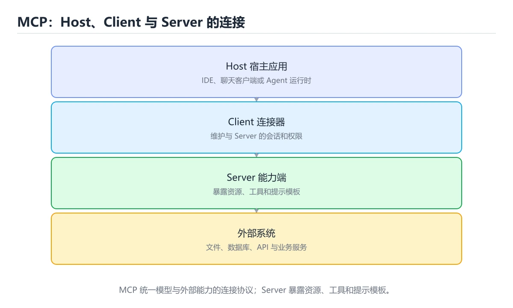
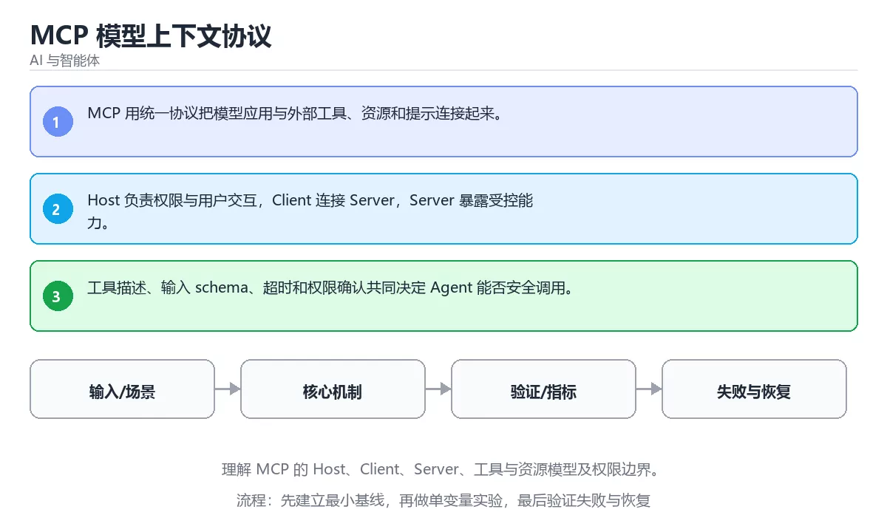

# MCP 模型上下文协议

> 内容更新时间：2026-10-03





## 学习目标

- 能用自己的话解释：MCP 用统一协议把模型应用与外部工具、资源和提示连接起来。
- 能用自己的话解释：Host 负责权限与用户交互，Client 连接 Server，Server 暴露受控能力。
- 能用自己的话解释：工具描述、输入 schema、超时和权限确认共同决定 Agent 能否安全调用。
- 能把本课知识放回「AI 与智能体」，并完成练习与测验。

## 前置知识

- 已完成「AI 与智能体」的基础课程，能运行正文中的最小示例。
- 本课关键词：MCP、工具协议、资源、权限。
- 遇到不熟悉的术语先记录问题，完成练习后再回读。

## 核心知识

### 1. MCP 用统一协议把模型应用与外部工具、资源和提示连接起来。

- 关键做法：先用最小示例建立基线，再逐步加入边界、失败和性能条件。
- 验证标准：结果可复现、错误可解释、边界有测试、失败能恢复。

### 2. Host 负责权限与用户交互，Client 连接 Server，Server 暴露受控能力。

把这条结论放回「MCP 模型上下文协议」的完整流程里展开：

- 正文依据：能用自己的话解释：MCP 用统一协议把模型应用与外部工具、资源和提示连接起来。
- 落地检查：把「2. Host 负责权限与用户交互，Client 连接 Server，Server 暴露受控能力。」改写成一条可执行的核对项，逐条验证输入、超时与失败路径。

### 3. 工具描述、输入 schema、超时和权限确认共同决定 Agent 能否安全调用。

把这条结论放回「MCP 模型上下文协议」的完整流程里展开：

- 正文依据：能用自己的话解释：Host 负责权限与用户交互，Client 连接 Server，Server 暴露受控能力。
- 落地检查：把「3. 工具描述、输入 schema、超时和权限确认共同决定 Agent 能否安全调用。」改写成一条可执行的核对项，逐条验证输入、超时与失败路径。

## 关键流程

```text
输入 → 校验 → 核心处理 → 验证 → 记录指标 → 失败恢复
```

## 实践路径

1. 用一句话复述本课要解决的问题。
2. 跑通正文中的最小示例并记录基线。
3. 只改变一个输入或参数，预测并验证结果。
4. 补一个失败路径，记录错误、恢复和指标。
5. 把结论写成可复现的笔记或测试。

## 常见误区

| 误区 | 后果 | 修正 |
| --- | --- | --- |
| 只记术语不做实验 | 遇到真实问题无法判断 | 用最小输入跑通并记录结果 |
| 只测正常路径 | 边界和故障上线才暴露 | 补空值、极值和依赖失败 |
| 没有基线就优化 | 无法证明改进有效 | 先测量再修改 |
| 忽略成本与安全 | 性能和风险失控 | 同时记录资源、权限与失败代价 |

## 动手练习

1. 合上教程，用 3～5 句话解释MCP 模型上下文协议。
2. 从正文选一个例子，改变一个条件并预测结果。
3. 设计一个失败场景，写出止损与恢复步骤。

**验收标准**：留下输入、命令、输出、差异和下一步问题。

## 本课小结

- 本课属于「AI 与智能体」，核心关键词是 MCP、工具协议、资源、权限。
- 先保证正确与可复现，再讨论性能和扩展。
- 完成练习和测验后，把仍然不确定的问题写成下一轮验证清单。

> 本课由 P1 内容扩展生成，重点补充原有课程缺失的主题与工程边界。

## 可运行练习

### 任务 1：先跑通，再解释

```python
def score(answer: str) -> int:
    return 1 if answer.strip() else 0

print(score("agent"))
```

### 任务 2：只改一个条件

把「MCP 模型上下文协议」的最小示例复制一份，只改一个条件再跑一次：

- 改动点：只把MCP的输入换成空值、极值或错误输入，其余保持不变。
- 预测：先写下「MCP 模型上下文协议」在改动后的输出或错误信息，再运行。
- 记录：对照改动前后的结果，指出差异出在哪一步。
- 验收：换回原条件能复现原结果，改动只影响MCP。

### 任务 3：迁移到自己的数据

用同一套思路处理一组你自己的数据或场景，保持输出格式与任务 1 一致。

## 故障现场

### 现场 1：本课的 MCP 常规用例通过，但边界用例失败

**症状**：在本课的练习或生产场景里出现“本课的 MCP 常规用例通过，但边界用例失败”。

**复现**：准备一组最小输入，只保留触发“本课的 MCP 常规用例通过，但边界用例失败”的必要条件，连续运行两次确认结果稳定。

**定位**：围绕“MCP 的前置条件与取值边界没有写进代码，默认值掩盖了空值和极值”检查调用链、输入数据和环境配置，先验证假设再改代码。

**预防**：把“本课的 MCP 常规用例通过，但边界用例失败”写成一条自动化用例，并在本课的验收清单里保留对应检查项。

### 现场 2：本课的 工具协议 结果在两次运行之间不一致

**症状**：在本课的练习或生产场景里出现“本课的 工具协议 结果在两次运行之间不一致”。

**复现**：准备一组最小输入，只保留触发“本课的 工具协议 结果在两次运行之间不一致”的必要条件，连续运行两次确认结果稳定。

**定位**：围绕“工具协议 依赖了当前版本、执行顺序或共享状态，单次运行无法暴露差异”检查调用链、输入数据和环境配置，先验证假设再改代码。

**预防**：把“本课的 工具协议 结果在两次运行之间不一致”写成一条自动化用例，并在本课的验收清单里保留对应检查项。

### 现场 3：离线评测分数很高，线上仍然频繁给出错误答案

**定位**：围绕“评测集与真实输入分布不一致，MCP 的提示词或检索结果没有覆盖失败场景”检查调用链、输入数据和环境配置，先验证假设再改代码。

## 深入补充：MCP 模型上下文协议 的取舍与边界

### 一、把概念放回真实约束

学习MCP 模型上下文协议时，最容易只记住结论而忽略前提。先写出三个约束：数据规模、时间预算、可接受的失败方式；再判断 MCP 与 工具协议 在这些约束下是否仍然成立。只要约束改变，原来的最优解就可能变成错误解。

| 维度 | 要回答的问题 | 常见做法 | 失败信号 |
| --- | --- | --- | --- |
| 数据 | MCP 的训练或检索数据从哪来、质量如何 | 清洗、去重、标注与版本化 | 评测集泄漏或分布漂移 |
| 模型 | 工具协议 的能力边界与成本是多少 | 基线对比、离线评测、灰度发布 | 指标好看但线上任务失败 |
| 评测 | 如何证明改动真的有效 | 固定评测集、人工抽检、A/B | 只比较单例输出 |
| 安全 | 失败时会不会泄露或越权 | 权限校验、内容过滤、审计 | 提示注入或数据外泄 |

### 二、三个容易混淆的边界

1. 澄清输入与目标。先写清「MCP 模型上下文协议」要解决的问题、合法输入范围和成功标准，再进入后续步骤。
2. **把“平均值”当成“全部”**：MCP 的指标好看，不代表尾部请求、冷启动或失败重试也好看。
3. **把“当前版本”当成“永久行为”**：工具协议 依赖的默认值、API 或性能特征都可能随版本变化，需要固定版本并保留回归用例。

### 三、一个生产场景

假设团队要在真实系统里使用MCP 模型上下文协议：第一周先做小流量验证，记录 MCP 的基线与异常；第二周扩大输入规模，观察 工具协议 是否成为瓶颈；第三周再做故障演练，主动注入超时、重复请求和依赖不可用，确认系统能降级、能重试、能恢复。每一步都要留下指标、日志和结论，而不是只留下“感觉更快了”。

### 四、自测清单

- 能否用一句话说出MCP 模型上下文协议解决的核心问题与不适用场景？
- 能否画出 MCP 的数据流或状态变化，并标出失败路径？
- 能否给出一个反例，证明某个看似合理的结论在边界条件下不成立？
- 能否写出一条可复现的验证命令，让别人独立得到相同结论？

### 五、AI 工程补充

在MCP 模型上下文协议里，模型输出只是系统的一部分：输入要先经过权限与数据质量检查，检索或工具调用要有超时和降级，输出要经过引用核验或规则校验，最后记录 token、延迟、失败类型和人工反馈。评测时至少准备固定题、边界题和对抗题，并把 MCP 与 工具协议 的指标分开记录；否则一次提示词改动看似提升体验，实际可能只是评测样本泄漏或随机波动。

## 本课复习清单

离开本课前，逐项确认：

- [ ] 不看解析，能说出「关于，下列说法正确的是？」的判断依据。
- [ ] 不看解析，能说出「本课的核心学习目标是什么？」的判断依据。
- [ ] 至少运行一次本课示例，记录输入、输出和一个边界情况。
- [ ] 把本课最容易混淆的两个概念写成一句话对照。

| 复盘项 | 记录 |
| --- | --- |
| 已经能独立解释的考点 |  |
| 仍然说不清的概念 |  |
| 下一步验证动作 |  |

## 术语速查

| 术语 | 本课语境 |
| --- | --- |
| `MCP` | Model Context Protocol focuses on Understand MCP hosts, clients, servers, tools, resources and permissions.。 |
| `工具协议` | 围绕“工具协议 依赖了当前版本、执行顺序或共享状态，单次运行无法暴露差异”检查调用链、输入数据和环境配置，先验证假设再改代码。 |
| `资源` | “MCP 模型上下文协议”中的 MCP、工具协议、资源，下列哪两项是本课强调的实践判断。 |
| `权限` | 本课属于「AI 与智能体」，核心关键词是 MCP、工具协议、资源、权限。 |

## 考点精讲

### 考点 1：代码补全·MCP

- **题目**：这段 Python 代码是「MCP 模型上下文协议」的示例片段，下面哪一项描述与它一致？
- **判断依据**：题干的正确项是这段代码会产生可观察的输出，运行后能看到结果，在「MCP 模型上下文协议」里要结合MCP核对输出是否符合预期。这段代码出自「MCP 模型上下文协议」的正文示例，围绕MCP、工具协议、资源展开；把输入或边界换成空值、极值或失败情况后，结论要以「MCP 模型上下文协议」的实际运行结果为准。回到「MCP 模型上下文协议」的正文示例，用“这段 Python 代码是MCP 模”走一遍MCP、工具协议、资源的完整流程，能复现的结论才可以保留。

### 考点 2：多选辨析·MCP

- **题目**：围绕“MCP 模型上下文协议”中的 MCP、工具协议、资源，下列哪两项是本课强调的实践判断？
- **判断依据**：本课把MCP 模型上下文协议拆成概念、示例与故障现场三部分，因此判断 MCP 时必须同时交代输入、输出和失败路径，这使“学习 MCP 时要同时说明输入、输出和失败路径，不能只看正常流程”成立。在MCP 模型上下文协议里，判断 工具协议 时要固定版本与边界输入，所以“验证 工具协议 时要固定版本并覆盖边界输入，结论才可复现”才可复现。

### 考点 3：概念判断·MCP

- **题目**：关于「工具描述、输入 schema、超时和权限确认共同决定 Agent 能否安全调用。」，下列说法正确的是？
- **判断依据**：在「MCP 模型上下文协议」里，工具描述、输入 schema、超时和权限确认共同决定 Agent 能否安全调用。「MCP 模型上下文协议」要求先交代MCP、工具协议、资源的前提再下结论，所以“工具描述、输入 schema”只在题干“工具描述、输入 schema、超时和权限确认共同决定 Age”给定的条件下成立。

### 考点 4：概念判断·MCP

- **题目**：「MCP 模型上下文协议」的核心学习目标是什么？
- **判断依据**：在「MCP 模型上下文协议」里，结论应落在理解 MCP 的 Host、Client、Server、工具与资源模型及权限边界。在「MCP 模型上下文协议」里判断这道题，要把MCP、工具协议、资源的条件、过程与失败路径逐项对齐，换成“MCP 模型上下文协议的核心学习目标”这个场景，只有满足前提的结论才成立。

### 考点 5：填空·MCP

- **题目**：补全代码：「MCP 模型上下文协议」示例中，下面这行代码缺少哪个关键字或函数名？请填入 ____。 `return 1 if ____.strip else 0`
- **判断依据**：在「MCP 模型上下文协议」里，answer。回到「MCP 模型上下文协议」的正文示例，用“补全代码”走一遍MCP、工具协议、资源的完整流程，能复现的结论才可以保留。回到MCP、工具协议、资源本身再看一遍：只有“answer”与题干“模型上下文协议示例中”的前提一致，结论才成立。

### 考点 6：顺序排列·MCP

- **题目**：按照「MCP 模型上下文协议」从概念到实践的讲解顺序排列下列主题。
- **判断依据**：结合MCP、工具协议来看，正确的执行顺序是「核心知识 → 关键流程 → 实践路径 → 常见误区」。本课围绕理解 MCP 的 Host、Client、Server、工具与资源模型及权限边界。「MCP 模型上下文协议」要求先交代MCP、工具协议、资源的前提再下结论，所以“核心知识”只在题干“按照MCP 模型上下文协议从概念到实践的讲解顺序排列下列主题”给定的条件下成立。

## English Overview

**Title:** Model Context Protocol

**Summary:** Understand MCP hosts, clients, servers, tools, resources and permissions.

**Category:** AI & Agents
**Level:** 高级
**Key terms:** MCP, 工具协议, 资源, 权限

## 内容元数据

- 内容版本：v2.0
- 最后更新：2026-10-03
- 学习阶段：高级
- 适用环境：主流大模型 API、开源模型与向量数据库
- 内容来源：内置结构化课程与工程实践整理
- 相关主题：MCP、工具协议、资源、权限
- 质量版本：P0 测验标准 + P1 覆盖扩展 + P2 体验补全

## 最小可运行示例

下面示例用于验证本课的最小输入、处理和输出。先原样运行，再只修改一个值：

```python
def score(answer: str) -> int:
    return 1 if answer.strip() else 0

print(score("agent"))
```

## 预期输出

```text
1
```

## 验证步骤

1. 记录运行环境、命令和真实输出。
2. 修改一个输入，先写预测再运行。
3. 制造一次错误输入，记录错误信息与修复方式。
4. 把结论写回本课笔记或测试用例。

## Full English Study Guide

### Overview

**Model Context Protocol** focuses on Understand MCP hosts, clients, servers, tools, resources and permissions.

### Learning Outcomes

- Explain what **Model Context Protocol** solves and when it should be used.

### Glossary

- Topic: **Model Context Protocol**
- Related terms: MCP, 工具协议, 资源, 权限

## Bilingual Section Outline

| 中文小节 | English section |
| --- | --- |
| 学习目标 | Learning Objectives |
| 前置知识 | Pre-knowledge |
| 核心知识 | Core knowledge |
| 关键流程 | Key Processes |
| 实践路径 | Practice Path |
| 常见误区 | Common Misconceptions |
| 动手练习 | Hands on exercise: |
| 本课小结 | Lesson Summary |
| 最小可运行示例 | Minimal Runnable Examples |
| 预期输出 | Expected Output |

## 参考资料与复核

- 最后复核：2026-10-04
- 下次复核：2027-04-04
- 复核范围：版本兼容、API 行为、安全建议与工程实践
- 来源性质：官方文档、标准或权威教材；正文为离线教学重组

| 参考资料 | 本课用途 |
| --- | --- |
| [Model Context Protocol](https://modelcontextprotocol.io/) | Agent 工具与上下文协议 |
| [Google AI 文档](https://ai.google.dev/gemini-api/docs) | Gemini API 与多模态 |
| [Ollama 文档](https://ollama.com/) | 本地模型运行与部署 |

> 「MCP 模型上下文协议」的链接用于离线阅读后的延伸核对；App 不会自动联网。

## 复习与迁移

复习目标：把「MCP 模型上下文协议」的判断标准放回可复现的例子里。先自己作答，再对照依据；如果结论正确但理由不完整，回到正文补足前提。

### 概念复述

- 用一句话说明「MCP 模型上下文协议」解决什么问题：理解 MCP 的 Host、Client、Server、工具与资源模型及权限边界。
- 写出MCP、工具协议、资源之间的关系，并各举一个例子。
- 说出本课最容易混淆的两个概念，以及区分它们的判据。

### 正文逐节复核

- **深入补充：MCP 模型上下文协议 的取舍与边界**：学习MCP 模型上下文协议时，最容易只记住结论而忽略前提。

### 测验回顾

1. 这段 Python 代码是「MCP 模型上下文协议」的示例片段，下面哪一项描述与它一致？
   - 依据：题干的正确项是这段代码会产生可观察的输出，运行后能看到结果，在「MCP 模型上下文协议」里要结合MCP核对输出是否符合预期。这段代码出自「MCP 模型上下文协议」的正文示例，围绕MCP、工具协议、资源展开；把输入或边界换成空值、极值或失败情况后，结论要以「MCP 模型上下文协议」的实际运行结果为准。回到「MCP 模型上下文协议」的正文示例，用“这段 Python 代码是MCP 模”走一遍MCP、工具协议、资源的完整流程，能复现的结论才可以保留。
2. 围绕“MCP 模型上下文协议”中的 MCP、工具协议、资源，下列哪两项是本课强调的实践判断？
   - 依据：本课把MCP 模型上下文协议拆成概念、示例与故障现场三部分，因此判断 MCP 时必须同时交代输入、输出和失败路径，这使“学习 MCP 时要同时说明输入、输出和失败路径，不能只看正常流程”成立。在MCP 模型上下文协议里，判断 工具协议 时要固定版本与边界输入，所以“验证 工具协议 时要固定版本并覆盖边界输入，结论才可复现”才可复现。
3. 关于「工具描述、输入 schema、超时和权限确认共同决定 Agent 能否安全调用。」，下列说法正确的是？
   - 依据：在「MCP 模型上下文协议」里，工具描述、输入 schema、超时和权限确认共同决定 Agent 能否安全调用。「MCP 模型上下文协议」要求先交代MCP、工具协议、资源的前提再下结论，所以“工具描述、输入 schema”只在题干“工具描述、输入 schema、超时和权限确认共同决定 Age”给定的条件下成立。
4. 「MCP 模型上下文协议」的核心学习目标是什么？
   - 依据：在「MCP 模型上下文协议」里，结论应落在理解 MCP 的 Host、Client、Server、工具与资源模型及权限边界。在「MCP 模型上下文协议」里判断这道题，要把MCP、工具协议、资源的条件、过程与失败路径逐项对齐，换成“MCP 模型上下文协议的核心学习目标”这个场景，只有满足前提的结论才成立。
5. 补全代码：「MCP 模型上下文协议」示例中，下面这行代码缺少哪个关键字或函数名？请填入 ____。

`return 1 if ____.strip else 0`
   - 依据：在「MCP 模型上下文协议」里，answer。回到「MCP 模型上下文协议」的正文示例，用“补全代码”走一遍MCP、工具协议、资源的完整流程，能复现的结论才可以保留。回到MCP、工具协议、资源本身再看一遍：只有“answer”与题干“模型上下文协议示例中”的前提一致，结论才成立。
1. 按照「MCP 模型上下文协议」从概念到实践的讲解顺序排列下列主题。
   - 依据：结合MCP、工具协议来看，正确的执行顺序是「核心知识 → 关键流程 → 实践路径 → 常见误区」。本课围绕理解 MCP 的 Host、Client、Server、工具与资源模型及权限边界。「MCP 模型上下文协议」要求先交代MCP、工具协议、资源的前提再下结论，所以“核心知识”只在题干“按照MCP 模型上下文协议从概念到实践的讲解顺序排列下列主题”给定的条件下成立。

### 迁移练习

把「MCP 模型上下文协议」的结论迁移到相邻主题，每次迁移都写清预测与证据：

1. 换输入：用MCP处理一组你自己的数据，对比教材示例的结果差异。
2. 换失败条件：制造一个工具协议相关的错误，说明如何从错误信息定位根因。
3. 换规模：把数据量或并发度提高一个数量级，说明「MCP 模型上下文协议」的结论是否仍成立。

## 工程化精练：决策、失败与验证

这一章把「MCP 模型上下文协议」从“看懂”推进到“能判断、能验证、能排错”。所有判断都围绕MCP、工具协议与资源展开，并与前文的示例、测验和失败现场互相对照。

### 一、MCP 的判断算法

| 步骤 | 要回答的问题 | 判断依据 | 记录什么 |
| --- | --- | --- | --- |
| 1. 定目标 | 「MCP 模型上下文协议」这一步要解决什么问题？ | 把MCP的目标写成一句可验证的结论 | 输入、约束、成功标准 |
| 2. 找边界 | 工具协议在什么条件下失效？ | 先列空值、极值、重复和失败路径 | 反例与触发条件 |
| 3. 跑基线 | 原始示例的真实输出是什么？ | 命令、版本和环境必须可复现 | 命令、输出、耗时 |
| 4. 只改一处 | 把资源换成另一种取值会怎样？ | 预测写在运行之前 | 预测与实际的差异 |
| 5. 回写结论 | 结论能否被他人复现？ | 把判断写成清单或测试 | 结论、证据、遗留问题 |

这张表的用法不是从上到下浏览，而是每次只填一行：先用「MCP 模型上下文协议」前文的示例验证第 3 行，再故意破坏一个条件验证第 2 行。当你能在不看解析的情况下说出MCP的判断依据，才算真正掌握本课。

- 先从MCP入手：把它写成“输入是什么、输出是什么、哪一步最容易出错”。如果这三句话中有一句说不清，说明对「MCP 模型上下文协议」的理解还停留在术语层面，需要回到正文的最小示例重新观察一次。

- 再把工具协议当成对照实验的变量：固定其他条件，只改变它的取值，记录输出是否变化。结论“变”或“不变”都要写出理由，并说明这个理由能否被他人独立复现。

- 针对资源做一次失败演练：故意给出空值、极值或错误类型，观察「MCP 模型上下文协议」的报错位置和处理方式。错误信息只是入口，真正要定位的是哪一层假设被破坏。

- 把「MCP 模型上下文协议」的结论压缩成一条可执行清单：先检查输入，再检查版本与环境，然后跑最小用例，最后才扩大规模。顺序颠倒会让排错范围成倍增加。

- 如果结论依赖时间或规模，就把数据量提高一个数量级再跑一次。在「MCP 模型上下文协议」里，小样本成立不代表大样本成立，复杂度、资源占用和失败率都要重新记录。

- 如果结论依赖并发或共享状态，就固定输入并连续运行多次。结果不一致时，优先怀疑「MCP 模型上下文协议」中MCP相关步骤的隐藏状态，而不是先改代码。

- 把「MCP 模型上下文协议」的判断写成测试：一个正常用例、一个边界用例、一个失败用例。测试通过只是起点，还要确认失败用例确实以预期方式失败。

- 把本课与相邻主题连起来：MCP解决的是“怎么做”，工具协议回答“什么时候不适用”。两者都答得出来，迁移才算完成。

> 第 2 轮复核「MCP 模型上下文协议」：把上面的结论逐条改写为可验证的问题，并记录仍不确定的部分。

- 先从MCP入手：把它写成“输入是什么、输出是什么、哪一步最容易出错”。如果这三句话中有一句说不清，说明对「MCP 模型上下文协议」的理解还停留在术语层面，需要回到正文的最小示例重新观察一次。

- 再把工具协议当成对照实验的变量：固定其他条件，只改变它的取值，记录输出是否变化。结论“变”或“不变”都要写出理由，并说明这个理由能否被他人独立复现。

- 针对资源做一次失败演练：故意给出空值、极值或错误类型，观察「MCP 模型上下文协议」的报错位置和处理方式。错误信息只是入口，真正要定位的是哪一层假设被破坏。

- 把「MCP 模型上下文协议」的结论压缩成一条可执行清单：先检查输入，再检查版本与环境，然后跑最小用例，最后才扩大规模。顺序颠倒会让排错范围成倍增加。

- 如果结论依赖时间或规模，就把数据量提高一个数量级再跑一次。在「MCP 模型上下文协议」里，小样本成立不代表大样本成立，复杂度、资源占用和失败率都要重新记录。

- 如果结论依赖并发或共享状态，就固定输入并连续运行多次。结果不一致时，优先怀疑「MCP 模型上下文协议」中MCP相关步骤的隐藏状态，而不是先改代码。

- 把「MCP 模型上下文协议」的判断写成测试：一个正常用例、一个边界用例、一个失败用例。测试通过只是起点，还要确认失败用例确实以预期方式失败。

- 把本课与相邻主题连起来：MCP解决的是“怎么做”，工具协议回答“什么时候不适用”。两者都答得出来，迁移才算完成。

### 二、MCP 模型上下文协议 的机制拆解与自测

把本课考点还原成可回答的问题，再逐题写出依据：

**问题 1**：这段 Python 代码是「MCP 模型上下文协议」的示例片段，下面哪一项描述与它一致？

- 关联术语：MCP
- 判断依据：回到「MCP 模型上下文协议」正文对应小节，先用最小示例验证再下结论。
- 追问：如果把MCP的条件换成边界值，这个结论是否仍然成立？

**问题 2**：围绕“MCP 模型上下文协议”中的 MCP、工具协议、资源，下列哪两项是本课强调的实践判断？

- 关联术语：工具协议
- 判断依据：验证 工具协议 时要固定版本并覆盖边界输入，结论才可复现
- 追问：如果把工具协议的条件换成边界值，这个结论是否仍然成立？

**问题 3**：关于「工具描述、输入 schema、超时和权限确认共同决定 Agent 能否安全调用。」，下列说法正确的是？

- 关联术语：资源
- 判断依据：工具描述、输入 schema、超时和权限确认共同决定 Agent 能否安全调用。
- 追问：如果把资源的条件换成边界值，这个结论是否仍然成立？

**问题 4**：「MCP 模型上下文协议」的核心学习目标是什么？

- 关联术语：权限
- 判断依据：理解 MCP 的 Host、Client、Server、工具与资源模型及权限边界。
- 追问：如果把权限的条件换成边界值，这个结论是否仍然成立？

**问题 5**：补全代码：「MCP 模型上下文协议」示例中，下面这行代码缺少哪个关键字或函数名？请填入 ____。

`return 1 if ____.strip else 0`

- 关联术语：MCP
- 判断依据：回到「MCP 模型上下文协议」正文对应小节，先用最小示例验证再下结论。
- 追问：如果把MCP的条件换成边界值，这个结论是否仍然成立？

**问题 6**：按照「MCP 模型上下文协议」从概念到实践的讲解顺序排列下列主题。

- 关联术语：工具协议
- 判断依据：回到「MCP 模型上下文协议」正文对应小节，先用最小示例验证再下结论。
- 追问：如果把工具协议的条件换成边界值，这个结论是否仍然成立？

### 三、失败模式与修复顺序

| 失败信号 | 常见根因 | 先做什么 | 修复后如何确认 |
| --- | --- | --- | --- |
| 「MCP 模型上下文协议」中 MCP 相关步骤报错 | 输入、版本或前置条件与示例不一致 | 保留第一条错误信息，回到最小输入 | 用验证 工具协议 时要固定版本并覆盖边界输入，结论才可复现复跑，确认输出可复现 |
| 「MCP 模型上下文协议」中 工具协议 相关步骤报错 | 输入、版本或前置条件与示例不一致 | 保留第一条错误信息，回到最小输入 | 用工具描述、输入 schema、超时和权限确认共同决定 Agent 能否安全调用。复跑，确认输出可复现 |
| 「MCP 模型上下文协议」中 资源 相关步骤报错 | 输入、版本或前置条件与示例不一致 | 保留第一条错误信息，回到最小输入 | 用理解 MCP 的 Host、Client、Server、工具与资源模型及权限边界。复跑，确认输出可复现 |
| 结果在两次运行之间不一致 | 隐藏状态、并发或环境差异 | 固定版本与输入，记录随机因素 | 连续运行三次得到同一结论 |
| 单次结果正确但规模一大就失效 | 只测了正常路径，没有覆盖边界 | 把数据量或并发度提高一个数量级 | 记录边界值、耗时与失败率 |

排错顺序固定为：先复现，再缩小输入，然后只改一个条件，最后把结论写成回归用例。对「MCP 模型上下文协议」来说，任何不能复现的“修好了”都不算完成。

### 四、离开本课前的验证清单

| 检查项 | 通过标准 | 证据 |
| --- | --- | --- |
| 能复述 | 用三句话说明「MCP 模型上下文协议」解决什么问题、边界在哪 | 不看解析写出的结论 |
| 能运行 | 最小示例在本机跑通 | 命令、输出与版本 |
| 能改条件 | 只改一个输入并解释差异 | 预测与实际的对照 |
| 能排错 | 至少制造并修复一个失败 | 错误信息与修复步骤 |
| 能迁移 | 把MCP、工具协议、资源、权限用到新场景 | 一个自选练习的结论 |

完成标准：能不看解析说清「MCP 模型上下文协议」全部自测题的依据，并且至少有一条MCP相关的结论经过真实运行验证。如果某一步只停留在“感觉懂了”，就把它写成下一轮针对「MCP 模型上下文协议」的最小验证任务。

### 五、把结论写成可检查的证据

学习「MCP 模型上下文协议」时，最容易出现的情况是“听过、看懂了，但换一个输入就说不清”。下面把MCP与工具协议放进一条可检查的证据链：每一句结论都要能回答“从哪里来、在什么条件下成立、失败时怎么发现”。

| 证据类型 | 本课要求 | 不合格的表现 |
| --- | --- | --- |
| 概念证据 | 用一句话说明MCP的定义与适用场景 | 只背术语，说不出它解决什么问题 |
| 运行证据 | 能复现「MCP 模型上下文协议」的最小示例 | 输出与记录对不上，或换机器就不一致 |
| 对照证据 | 只改一个条件，说明差异来自哪里 | 一次改多个变量，无法归因 |
| 失败证据 | 故意制造错误并记录恢复步骤 | 只测正常路径，失败时靠猜 |
| 迁移证据 | 把工具协议用到自选场景 | 换一个例子就完全套不上 |

举例：验证 工具协议 时要固定版本并覆盖边界输入，结论才可复现。把这个结论代回「MCP 模型上下文协议」的正文，找出它对应的输入、处理步骤与输出；再换掉其中一个条件，观察结论是否仍然成立。能完成这一步，才说明这条知识已经从“记忆”变成“可用的判断”。

最后留一个自检问题：如果只能保留三条笔记，你会写下哪三句？把答案限定为「MCP 模型上下文协议」中的可验证结论，并给每条结论配一个反例。这三句加上对应反例，就是本课最值得带入后续课程的复习材料。
