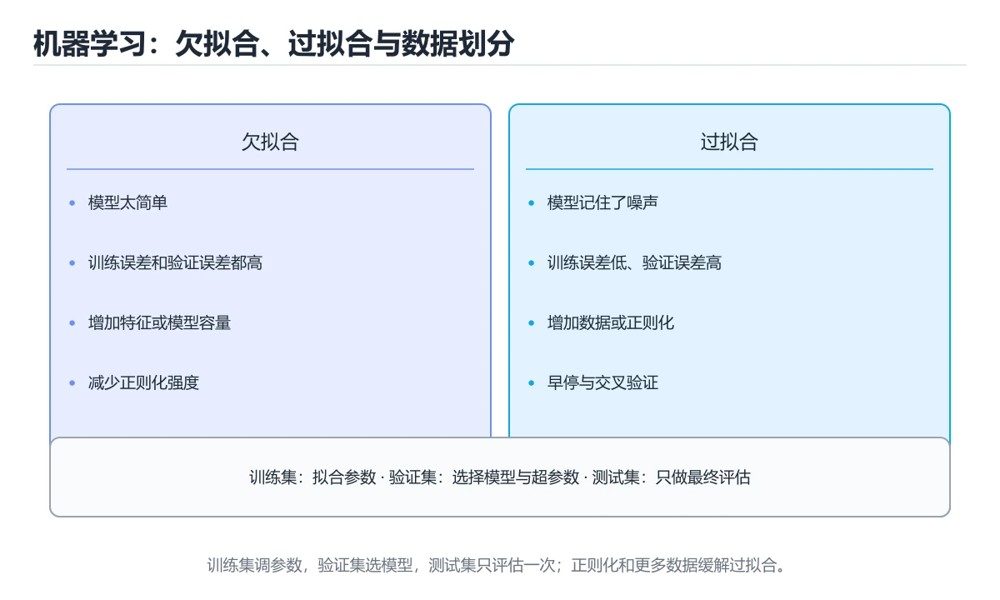
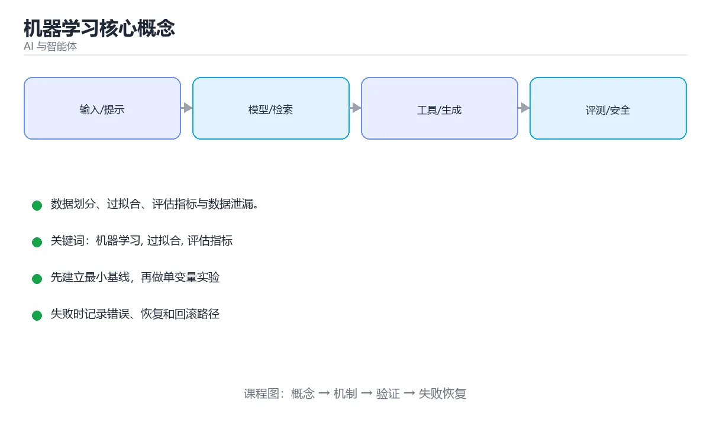

# 机器学习核心概念

> 内容更新时间：2026-10-06 · 学习阶段：基础 · 预计用时：35 分钟





## 学习目标

- 能用自己的话解释机器学习核心概念解决了什么问题，而不是只背术语。
- 能说清 「机器学习」、「过拟合」、「评估指标」、「交叉验证」 之间的关系，并分别举出一个例子。
- 能把 机器学习 放回「机器学习核心概念」的知识体系，说明它和 过拟合 的边界。
- 能完成本课练习，并用验收标准检查自己的结果。

> 一句话摘要：数据划分、过拟合、评估指标与数据泄漏。

## 前置知识

- 先完成上一课《AI、机器学习与生成式 AI》；如果已经掌握，可以直接用本课练习自测。
- 本课阶段：基础。建议先完成「AI、机器学习与生成式 AI」，或确认自己能独立跑通正文里的 classification_report 示例。
- 开始前先复习：机器学习、过拟合、评估指标。
- 卡在 机器学习 上时不要跳过：把输入、预期和实际输出写成三行，再回头读正文。

## 从数据到模型

```text
收集数据 -> 清洗与特征工程 -> 划分训练/验证/测试集
        -> 选择模型 -> 训练 -> 评估 -> 调参 -> 上线监控
```

训练集学参数，验证集选超参数与早停，测试集只在最后评估一次。用测试集调参等于作弊。

## 三类学习范式

| 范式 | 数据 | 目标 | 例子 |
| --- | --- | --- | --- |
| 监督学习 | 带标签 | 预测标签 | 房价预测、分类 |
| 无监督学习 | 无标签 | 发现结构 | 聚类、降维、异常检测 |
| 强化学习 | 奖励信号 | 学策略 | 游戏 AI、机器人控制 |

## 一个最小示例

```python
from sklearn.model_selection import train_test_split
from sklearn.linear_model import LogisticRegression
from sklearn.metrics import classification_report
X_train, X_test, y_train, y_test = train_test_split(
    features, labels, test_size=0.2, random_state=42, stratify=labels)
model = LogisticRegression(max_iter=1000)
model.fit(X_train, y_train)
print(classification_report(y_test, model.predict(X_test)))
```

## 过拟合与欠拟合

| 现象 | 表现 | 对策 |
| --- | --- | --- |
| 欠拟合 | 训练集与验证集都差 | 增加模型复杂度、补特征 |
| 过拟合 | 训练集好、验证集差 | 更多数据、正则化、Dropout、早停 |

训练误差下降而验证误差开始上升的那一刻，就是过拟合的起点。

## 常用指标

```text
准确率 Accuracy   预测正确的比例（类别不平衡时失真）
精确率 Precision  预测为正的样本中真正为正的比例
召回率 Recall     真正的正样本中被找出来的比例
F1               精确率与召回率的调和平均
ROC-AUC          排序质量，对阈值不敏感
```

欺诈检测等极不平衡场景应看 Precision / Recall / F1 / AUC，而不是准确率。

## 交叉验证与数据泄漏

```python
from sklearn.model_selection import cross_val_score
scores = cross_val_score(model, X, y, cv=5, scoring="f1")
print(scores.mean(), scores.std())
```

数据泄漏最隐蔽：把目标信息混进特征，或**在划分数据集之前**做了全局标准化与缺失值填充。正确顺序是先划分，再在训练集上拟合预处理并应用到验证集。

## 正则化与交叉验证实例

| 手段 | 作用 | 使用要点 |
| --- | --- | --- |
| L2 正则（权重衰减） | 抑制权重过大，缓解过拟合 | 强度（λ 或 weight_decay）是最常调的超参数 |
| L1 正则 | 产生稀疏权重，可做特征选择 | 与 L2 可组合成 Elastic Net |
| Dropout | 训练时随机丢弃神经元 | 仅训练期启用，推理必须关闭 |
| 早停（Early Stopping） | 验证集指标不再提升就停止 | 需设 patience，避免噪声导致误停 |
| 数据增强 | 扩充样本多样性 | 图像可用翻转裁剪、文本可用同义改写 |

交叉验证的标准做法是 K 折（常见 K=5 或 10）：把训练集切成 K 份，轮流留一份做验证，取 K 次指标的平均与标准差。**分类任务要用分层抽样（stratify）**，否则某折可能缺少少数类。时间序列必须用**时序切分**（前段训练、后段验证），随机切分会造成未来信息泄漏。

判断是否过拟合的实操信号：训练损失持续下降而验证损失开始上升；训练指标与验证指标差距不断扩大。此时优先补数据、加正则化、降低模型容量，而不是继续调学习率。

## 本课小结

效果上限由**数据质量**决定，其次才是模型。牢记：划分要干净、指标要匹配业务、验证要独立。

## 数据划分速查

| 集合 | 用途 | 典型比例 |
| --- | --- | --- |
| 训练集 | 学习参数 | 60% 到 80% |
| 验证集 | 调参、早停、选模型 | 10% 到 20% |
| 测试集 | 最终评估（只用一次） | 10% 到 20% |

| 划分方式 | 适用 |
| --- | --- |
| 随机划分 | 样本独立同分布 |
| 时间划分 | 时序预测（用过去预测未来） |
| 分组划分 | 同一用户或设备的数据不能跨集合 |
| 分层划分 | 类别不平衡时保持比例 |
| K 折交叉验证 | 小数据集 |

## 评估指标速查

| 任务 | 常用指标 | 注意 |
| --- | --- | --- |
| 二分类 | 准确率、精确率、召回率、F1、AUC | 不平衡时准确率会误导 |
| 多分类 | 宏平均、微平均、混淆矩阵 | 关注少数类表现 |
| 回归 | MAE、RMSE、R² | RMSE 对大误差更敏感 |
| 排序 | NDCG、MRR、Recall@K | 关注前 K 位质量 |
| 生成 | 人工评分、BLEU/ROUGE、LLM 评审 | 自动指标与人类偏好常不一致 |

```python
def confusion_metrics(tp: int, fp: int, fn: int, tn: int) -> dict:
    """从混淆矩阵计算精确率、召回率与 F1。"""
    precision = tp / (tp + fp) if tp + fp else 0.0
    recall = tp / (tp + fn) if tp + fn else 0.0
    f1 = 2 * precision * recall / (precision + recall) if precision + recall else 0.0
    accuracy = (tp + tn) / (tp + fp + fn + tn)
    return {
        "precision": round(precision, 4),
        "recall": round(recall, 4),
        "f1": round(f1, 4),
        "accuracy": round(accuracy, 4),
    }

def time_split(records, time_key, ratio: float = 0.8):
    """按时间划分：过去训练、未来验证，避免时间穿越。"""
    ordered = sorted(records, key=lambda r: r[time_key])
    cut = int(len(ordered) * ratio)
    return ordered[:cut], ordered[cut:]

def check_leakage(train_ids: set, test_ids: set) -> set:
    """检查数据泄漏：同一实体同时出现在训练与测试集。"""
    return train_ids & test_ids

print(confusion_metrics(tp=80, fp=20, fn=10, tn=890))
print(check_leakage({"u1", "u2"}, {"u2", "u3"}))
```

## 过拟合与欠拟合速查

| 现象 | 训练集表现 | 验证集表现 | 对策 |
| --- | --- | --- | --- |
| 欠拟合 | 差 | 差 | 增大模型、加特征、训练更久 |
| 过拟合 | 好 | 差 | 加数据、正则化、早停、简化模型、数据增强 |
| 数据泄漏 | 异常好 | 线上骤降 | 检查特征是否含未来信息 |
| 分布漂移 | 训练好 | 线上逐渐变差 | 监控特征分布并定期重训 |

## 常见错误与排查

| 容易踩的做法 | 实际现象 | 原因与正确做法 |
| --- | --- | --- |
| 用测试集反复调参 | 线上效果远低于预期 | 测试集只用一次，调参看验证集 |
| 类别不平衡只看准确率 | 指标虚高 | 看精确率、召回率、F1 与 AUC |
| 随机划分时序数据 | 指标虚高 | 按时间划分 |
| 同一用户跨训练与测试 | 数据泄漏 | 按用户分组划分 |
| 特征里含未来信息 | 线上暴跌 | 审查特征生成时间点 |
| 不做数据分布监控 | 漂移无人发现 | 监控特征与预测分布 |
| 只报告平均值 | 掩盖细分问题 | 按关键切片（地区、版本）分别看 |
| 忽略置信区间 | 小样本结论不稳 | 报告样本量与区间 |
| 样本量极少就下结论 | 结论随机 | 交叉验证并扩大样本 |
| 训练与推理特征处理不一致 | 线上效果差 | 复用同一特征管道 |

## 复习与自测

- [ ] 训练、验证、测试集职责分明，测试集只用一次。
- [ ] 时序与分组数据使用对应划分方式。
- [ ] 类别不平衡时看精确率、召回率与 F1。
- [ ] 有数据泄漏检查与分布监控。
- [ ] 结论报告样本量、切片与不确定性。

## 动手练习

> 本课练习重点：围绕「机器学习、过拟合、评估指标」完成复述、实验和交付，每个结果都要能被别人检查。

先写 机器学习 的评测样例，再改一个变量，最后比较质量、成本与安全。

### 练习 1：建立心智模型（10 分钟）

合上教程，用 3～5 句话回答：

1. 机器学习核心概念解决了什么问题？
2. 如果没有它，会出现什么具体后果？
3. 它和「过拟合」是什么关系？

验收标准：说明 机器学习 与 过拟合 的分工，并写出一个失效场景。

### 练习 2：做一次可控实验（20 分钟）

从正文中选一个最小示例，完成以下操作：

1. 先预测修改一个参数、输入或步骤后的结果。
2. 再实际执行或逐步推演，记录真实结果。
3. 如果结果与预测不同，写出差异原因。

**验收标准**：先在「从数据到模型」里找一个可运行的最小输入，再按五步法记录机器学习的影响；预测与结果不一致时补写被忽略的前提。

### 练习 3：交付一个小结果（30 分钟）

构造 5 条 机器学习 的小型离线样例，写清输入、期望输出与失败案例。

任务要求：

- 结果必须能被别人检查，不能只写“我已经理解了”。
- 至少覆盖「机器学习」和「过拟合」两个关键词。
- 写出 1 个仍然不确定的问题，以及下一步如何验证。

> 提示：时间有限时优先做练习 1 和练习 2；练习 3 可以拆成两次完成。

## 可运行练习

### 任务 1：先跑通，再解释

```python
from sklearn.model_selection import train_test_split
from sklearn.linear_model import LogisticRegression
from sklearn.metrics import classification_report
X_train, X_test, y_train, y_test = train_test_split(
    features, labels, test_size=0.2, random_state=42, stratify=labels)
model = LogisticRegression(max_iter=1000)
model.fit(X_train, y_train)
print(classification_report(y_test, model.predict(X_test)))
```

### 任务 2：只改一个条件

把「机器学习核心概念」的最小示例复制一份，只改一个条件再跑一次：

- 改动点：把 过拟合 换成边界值，其他输入保持原样。
- 预测：先写下「机器学习核心概念」在改动后的输出或错误信息，再运行。
- 记录：对照改动前后的结果，指出差异出在哪一步。
- 验收：换回原条件能复现原结果，改动只影响机器学习。

### 任务 3：迁移到自己的数据

换一个 过拟合 场景重做一次，确认结论不是只对示例数据成立。

## 故障现场

### 现场 1：用测试集反复调参

**症状**：在《机器学习核心概念》的复现场景中，线上效果远低于预期。

**根因**：“线上效果远低于预期”只是表层结果。向上追溯会落到“用测试集反复调参”这一步，因为它省略了《机器学习核心概念》的约束，使实现行为和预期模型发生了偏离。

**修复**：针对《机器学习核心概念》的问题，测试集只用一次，调参看验证集。

**验证**：先在《机器学习核心概念》中记录“用测试集反复调参”留下的失败证据，再执行“测试集只用一次，调参看验证集”并重放；确认错误路径变为明确结果，且修复没有掩盖同类故障。

### 现场 2：不做数据分布监控

**症状**：在《机器学习核心概念》的复现场景中，漂移无人发现。

**根因**：当出现“不做数据分布监控”时，执行路径已经绕过了《机器学习核心概念》的关键约束，最终以“漂移无人发现”暴露出来；修复前必须先确认约束在哪里失效。

**修复**：针对《机器学习核心概念》的问题，监控特征与预测分布。

**验证**：在《机器学习核心概念》中按“监控特征与预测分布”调整后，从“不做数据分布监控”的触发条件重放同一条路径，确认“漂移无人发现”不再出现，并补一个相邻边界用例检查没有引入新问题。

### 现场 3：只报告平均值

**症状**：在《机器学习核心概念》的复现场景中，掩盖细分问题。

**根因**：当出现“只报告平均值”时，执行路径已经绕过了《机器学习核心概念》的关键约束，最终以“掩盖细分问题”暴露出来；修复前必须先确认约束在哪里失效。

**修复**：针对《机器学习核心概念》的问题，按关键切片（地区、版本）分别看。

**验证**：在《机器学习核心概念》中按“按关键切片（地区、版本）分别看”调整后，从“只报告平均值”的触发条件重放同一条路径，确认“掩盖细分问题”不再出现，并补一个相邻边界用例检查没有引入新问题。

## 深入补充：机器学习核心概念 的取舍与边界

### 一、把概念放回真实约束

学习机器学习核心概念时，最容易只记住结论而忽略前提。先写出三个约束：数据规模、时间预算、可接受的失败方式；再判断 机器学习 与 过拟合 在这些约束下是否仍然成立。只要约束改变，原来的最优解就可能变成错误解。

| 维度 | 要回答的问题 | 常见做法 | 失败信号 |
| --- | --- | --- | --- |
| 数据 | 机器学习 的训练或检索数据从哪来、质量如何 | 清洗、去重、标注与版本化 | 评测集泄漏或分布漂移 |
| 模型 | 过拟合 的能力边界与成本是多少 | 基线对比、离线评测、灰度发布 | 指标好看但线上任务失败 |
| 评测 | 如何证明改动真的有效 | 固定评测集、人工抽检、A/B | 只比较单例输出 |
| 安全 | 失败时会不会泄露或越权 | 权限校验、内容过滤、审计 | 提示注入或数据外泄 |

### 二、三个容易混淆的边界

1. 澄清输入与目标。先写清「机器学习核心概念」要解决的问题、合法输入范围和成功标准，再进入后续步骤。
2. **把“平均值”当成“全部”**：机器学习 的指标好看，不代表尾部请求、冷启动或失败重试也好看。
3. **把“当前版本”当成“永久行为”**：过拟合 依赖的默认值、API 或性能特征都可能随版本变化，需要固定版本并保留回归用例。

### 三、一个生产场景

假设团队要在真实系统里使用机器学习核心概念：第一周先做小流量验证，记录 机器学习 的基线与异常；第二周扩大输入规模，观察 过拟合 是否成为瓶颈；第三周再做故障演练，主动注入超时、重复请求和依赖不可用，确认系统能降级、能重试、能恢复。每一步都要留下指标、日志和结论，而不是只留下“感觉更快了”。

### 四、自测清单

- 能否用一句话说出机器学习核心概念解决的核心问题与不适用场景？
- 能否画出 机器学习 的数据流或状态变化，并标出失败路径？
- 把 classification_report 的输入推到边界，说明本课哪一条结论会先失效。
- 能否写出一条可复现的验证命令，让别人独立得到相同结论？

### 五、AI 工程补充

在机器学习核心概念里，模型输出只是系统的一部分：输入要先经过权限与数据质量检查，检索或工具调用要有超时和降级，输出要经过引用核验或规则校验，最后记录 token、延迟、失败类型和人工反馈。评测时至少准备固定题、边界题和对抗题，并把 机器学习 与 过拟合 的指标分开记录；否则一次提示词改动看似提升体验，实际可能只是评测样本泄漏或随机波动。

## 本课复习清单

离开本课前，逐项确认：

- [ ] 不看解析，能说出「测试集的正确用法是？」的判断依据。
- [ ] 不看解析，能说出「训练集表现很好但验证集很差，说明？」的判断依据。
- [ ] 不看解析，能说出「类别极度不平衡时，最不该只看哪个指标？」的判断依据。
- [ ] 不看解析，能说出「交叉验证（cross validation）的作用是？」的判断依据。
- [ ] 不看解析，能说出「L1 与 L2 正则化的区别是？」的判断依据。
- [ ] 至少运行一次 classification_report 的示例，记录输入、输出和 机器学习 的边界情况。
- [ ] 把本课最容易混淆的两个概念写成一句话对照。

| 复盘项 | 记录 |
| --- | --- |
| 已经能独立解释的考点 |  |
| 仍然说不清的概念 |  |
| 下一步验证动作 |  |

## 术语速查

| 术语 | 一句话说明 |
| --- | --- |
| `机器学习` | 让模型从数据中学习规律并对新样本作出预测的方法体系。 |
| `过拟合` | 模型记住训练集细节而无法泛化到新数据，表现为训练好、验证差。 |
| `评估指标` | 把任务目标转成可计算数值，如准确率、召回率、延迟或成本。 |
| `交叉验证` | 把数据分折轮流验证和训练，用多折结果估计泛化能力。 |

## 考点精讲

### 考点 1：概念判断·机器学习

- **题目**：测试集的正确用法是？
- **判断依据**：用测试集调参会间接过拟合，验证集才用于选超参数。在「机器学习核心概念」里，作答时，先用机器学习建立输入与输出的基线，再把只在最后评估一次代入边界条件核对，结论才能复现。“测试集的正确用法是”与「机器学习核心概念」的术语表相呼应，只有符合机器学习、过拟合、评估指标约束的“只在最后评估一次”才是正文支持的结论。

### 考点 2：多选辨析·机器学习

- **题目**：围绕“机器学习核心概念”中的 机器学习、过拟合、评估指标，下列哪两项是本课强调的实践判断？
- **判断依据**：本课把机器学习核心概念拆成概念、示例与故障现场三部分，因此判断 机器学习 时必须同时交代输入、输出和失败路径，这使“学习 机器学习 时要同时说明输入、输出和失败路径，不能只看正常流程”成立。在机器学习核心概念里，判断 过拟合 时要固定版本与边界输入，所以“验证 过拟合 时要固定版本并覆盖边界输入，结论才可复现”才可复现。

### 考点 3：概念判断·机器学习

- **题目**：类别极度不平衡时，最不该只看哪个指标？
- **判断依据**：在「机器学习核心概念」里，准确率 Accuracy。在「机器学习核心概念」里，全预测为多数类也能得到很高准确率，此时应看 Precision/Recall/F1/AUC。回到「机器学习核心概念」的正文示例，用“类别极度不平衡时”走一遍机器学习、过拟合、评估指标的完整流程，能复现的结论才可以保留。

### 考点 4：代码补全·机器学习

- **题目**：下面这段 Python 代码摘自「机器学习核心概念」的正文示例。关于这段代码，下面哪一项说法与实际内容相符？
- **判断依据**：题干的正确项是这段代码会产生可观察的输出，运行后能看到结果，在「机器学习核心概念」里要结合机器学习核对输出是否符合预期。这段代码出自「机器学习核心概念」的正文示例，围绕机器学习、过拟合、评估指标展开；把输入或边界换成空值、极值或失败情况后，结论要以「机器学习核心概念」的实际运行结果为准。在「机器学习核心概念」里判断这道题，要把机器学习、过拟合、评估指标的条件、过程与失败路径逐项对齐，换成“下面这段 Python 代码摘自机器”这个场景，只有满足前提的结论才成立。

### 考点 5：概念判断·机器学习

- **题目**：L1 与 L2 正则化的区别是？
- **判断依据**：在「机器学习核心概念」里，L1 倾向于把部分权重压到 0（稀疏），L2 倾向于让权重整体变小。两者都用于抑制过拟合，稀疏性使 L1 常用于特征选择。把“L1 倾向于把部分权重压到 0（稀疏）”代回「机器学习核心概念」里“L1 与 L2 正则化的区别是”的例子核对，条件一旦改变，结论就要用机器学习、过拟合、评估指标重新推导。

### 考点 6：填空·机器学习

- **题目**：补全代码：「机器学习核心概念」示例中，下面这行代码缺少哪个关键字或函数名？请填入 ____。 `____ = tp / (tp + fp) if tp + fp else 0.0`
- **判断依据**：在「机器学习核心概念」里判断这道题，要把机器学习、过拟合、评估指标的条件、过程与失败路径逐项对齐，换成“补全代码”这个场景，只有满足前提的结论才成立。“机器学习核心概念示例中”与「机器学习核心概念」的术语表相呼应，只有符合机器学习、过拟合、评估指标约束的“precision”才是正文支持的结论。

## English Overview

**Title:** ML Fundamentals

**Summary:** Splits, overfitting, metrics and leakage.

**Category:** AI & Agents
**Level:** 进阶
**Key terms:** 机器学习, 过拟合, 评估指标, 交叉验证

## 内容元数据

- 内容版本：v2.0
- 最后更新：2026-10-06
- 学习阶段：基础
- 适用环境：主流大模型 API、开源模型与向量数据库；本课聚焦 机器学习。
- 内容来源：内置结构化课程与工程实践整理
- 相关主题：机器学习、过拟合、评估指标、交叉验证
- 质量版本：P0 测验标准 + P1 覆盖扩展 + P2 体验补全

## 参考资料与复核

- 最后复核：2026-10-04
- 下次复核：2027-04-17
- 复核范围：版本兼容、API 行为、安全建议与工程实践
- 来源性质：官方文档、标准或权威教材；正文为离线教学重组

| 参考资料 | 本课用途 |
| --- | --- |
| [scikit-learn 文档](https://scikit-learn.org/stable/documentation.html) | 经典机器学习算法 |
| [OpenAI Cookbook](https://cookbook.openai.com/) | RAG、Agent 与工程示例 |
| [Anthropic 文档](https://docs.anthropic.com/) | Claude API 与 Agent 安全 |

> 「机器学习核心概念」的链接用于离线阅读后的延伸核对；App 不会自动联网。

<!-- p1-deep-dive:start -->
## 深挖「机器学习」的边界与代价

这一章只用「机器学习核心概念」自己的正文、代码和测验题，把机器学习推到边界再看一遍：先确认它在什么条件下成立，再估计代价，最后给出可复现的证据。

### 一、机器学习 的关键句与适用条件

| 正文出处 | 原句 | 用之前先确认 |
| --- | --- | --- |
| 过拟合与欠拟合 | 训练误差下降而验证误差开始上升的那一刻，就是过拟合的起点。 | 把 过拟合 换成边界值时，这一步是否仍然成立 |
| 正则化与交叉验证实例 | 交叉验证的标准做法是 K 折（常见 K=5 或 10）：把训练集切成 K 份，轮流留一份做验证，取 K 次指标的平均与标准差。 | 把 交叉验证 换成边界值时，这一步是否仍然成立 |
| 正则化与交叉验证实例 | 判断是否过拟合的实操信号：训练损失持续下降而验证损失开始上升； | 把 过拟合 换成边界值时，这一步是否仍然成立 |
| 现场 1：用测试集反复调参 | 根因：“线上效果远低于预期”只是表层结果。向上追溯会落到“用测试集反复调参”这一步，因为它省略了《机器学习核心概念》的约束，使实现行为和预期模型发生了偏离。 | 把 机器学习 换成边界值时，这一步是否仍然成立 |
| 现场 1：用测试集反复调参 | 验证：先在《机器学习核心概念》中记录“用测试集反复调参”留下的失败证据，再执行“测试集只用一次，调参看验证集”并重放；确认错误路径变为明确结果，且修复没有掩盖同类故障。 | 把 机器学习 换成边界值时，这一步是否仍然成立 |

读这张表时不要只记结论：每一句都要问「把机器学习换成边界值还成立吗」。如果第二列的原句里已经写明前提，第三列就写成「前提不变」；如果原句省略了前提，第三列必须补出来。

### 二、把 机器学习核心概念 推到边界

下面是本课第一段代码（text），先原样运行一次作为基线：

```text
收集数据 -> 清洗与特征工程 -> 划分训练/验证/测试集
        -> 选择模型 -> 训练 -> 评估 -> 调参 -> 上线监控
```

| 变式 | 怎么改 | 先写下什么 | 观察点 |
| --- | --- | --- | --- |
| 边界输入 | 把 机器学习核心概念 的输入换成空值或最大值 | 预测输出 | 是否报错、是否静默返回 |
| 只改一处 | 把 机器学习核心概念 的一个参数改成另一档 | 预测差异来源 | 输出变化能否用本课结论解释 |
| 去掉一步 | 注释掉 机器学习核心概念 之后的一行 | 预测哪一步先失败 | 错误位置是否与预期一致 |

三次实验都要保留「原例 → 改动 → 预测 → 结果 → 原因」五步记录；其中「原因」必须引用「机器学习核心概念」正文里的结论，而不是只写「正常」或「报错」。

### 三、「机器学习」的代价怎么量

| 观察项 | 怎么测 | 结论怎么写 |
| --- | --- | --- |
| 时间 | 把 机器学习 的输入规模翻倍，记录耗时变化 | 写出增长是线性、对数还是常数，并给出实测数据 |
| 空间 | 记录 过拟合 占用的内存或存储峰值 | 说明峰值出现在哪一步，以及能否提前释放 |
| 可读性 | 统计完成同一件事需要多少行代码或多少步操作 | 用具体行数代替「更简洁」这类主观描述 |
| 失败代价 | 触发一次失败，记录恢复所需步骤 | 写清失败后是否有残留状态、如何回滚 |

如果在「机器学习核心概念」里量不出上表的任何一项，说明实验还停留在阅读层面：先把输入规模翻倍，再回来填表。

### 四、测验复盘

| 题号 | 正确答案 | 最容易选错的干扰项 | 复盘动作 |
| --- | --- | --- | --- |
| 1 | 只在最后评估一次 | 用来反复调参 | 把干扰项改写成一句反例，再说明它违反本课哪条前提 |
| 2 | 学习 机器学习 时要同时说明输入、输出和失败路径，不能只看正常流程 | 只要 机器学习 的常规示例通过，就可以跳过边界与异常路径 | 把干扰项改写成一句反例，再说明它违反本课哪条前提 |
| 3 | 准确率 Accuracy | F1 | 把干扰项改写成一句反例，再说明它违反本课哪条前提 |
| 4 | 这段代码会产生可观察的输出，运行后能看到结果。 | 这段代码包含异常处理分支，失败时会走专门的补救路径。 | 把干扰项改写成一句反例，再说明它违反本课哪条前提 |
| 5 | L1 倾向于把部分权重压到 0（稀疏），L2 倾向于让权重整体变小 | L2 会产生稀疏解（只在边界情况下成立，不能回答本题） | 把干扰项改写成一句反例，再说明它违反本课哪条前提 |
| 6 | 0 | （无干扰项） | 把干扰项改写成一句反例，再说明它违反本课哪条前提 |

复盘「机器学习核心概念」时只写「我记住了」没有意义：每个错误选项都要能对应到本课的一条前提，写完后再回到第一节的关键句表核对一次。

### 五、离开本课前的自检

- [ ] 能用一句话说明 机器学习 解决什么问题、在什么条件下失效。
- [ ] 能指出 过拟合 与相邻概念的分工，并各举一个反例。
- [ ] 能在不看解析的情况下重做本课测验，并解释机器学习核心概念中每个错误选项。
- [ ] 能按第二节的表格完成至少两次 机器学习 实验，并留下命令与输出。
- [ ] 能写出「机器学习核心概念」的三条结论，每条都配一个适用边界。

全部勾选后，再去做「机器学习核心概念」的测验与练习；只要有一项答不上来，就回到对应小节补一次实验，而不是先背结论。
<!-- p1-deep-dive:end -->
