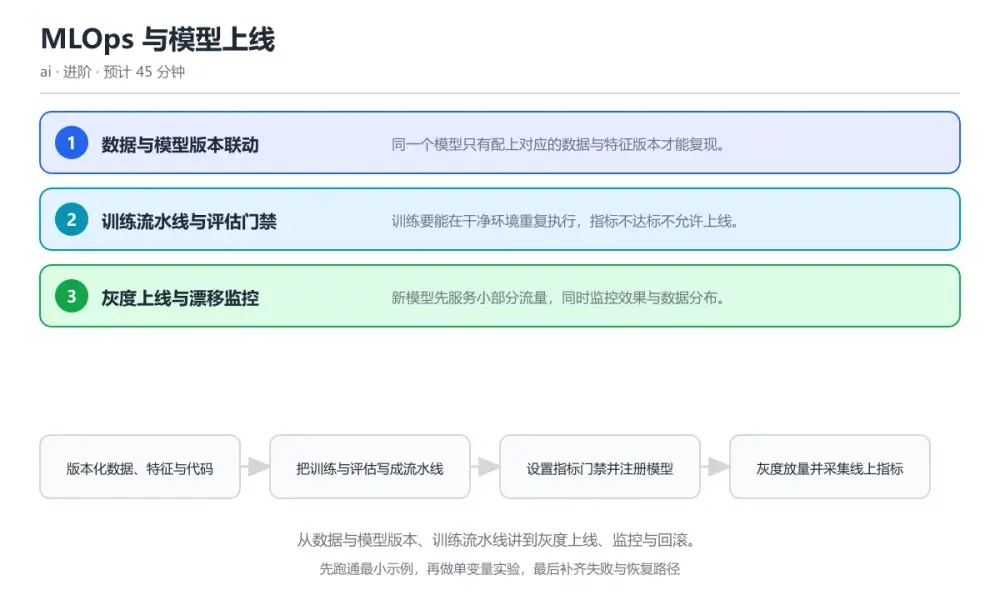
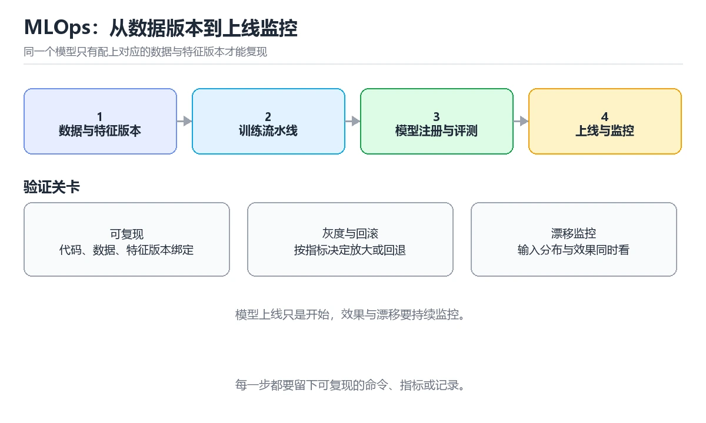

# MLOps 与模型上线

> 内容更新时间：2026-10-06 · 学习阶段：进阶 · 预计用时：40 分钟

分类：ai。关键词：MLOps、模型版本、训练流水线、灰度上线、数据漂移。从数据与模型版本、训练流水线讲到灰度上线、监控与回滚。



## 本节知识框架

**课程定位**：所属分类 `ai`（AI 与智能体），课程主题 `MLOps 与模型上线`，学习阶段 进阶，建议用时 40 分钟。

本课主线：从数据与模型版本、训练流水线讲到灰度上线、监控与回滚。

**学完本课应当能够**
- 说清 `模型注册表` 与 `特征一致性` 的含义与区别，并各举一个正例和一个反例。
- 用本课示例验证 `灰度上线` 的行为，记录输入、输出与失败条件。
- 遇到「线上效果与离线评估不符」这类问题时，能说出触发条件与修复顺序。

### 从概念到验证的学习链条

1. `模型注册表`：先掌握 集中管理模型版本与元数据的服务，再用它解释 `特征一致性` 为什么会出现。
2. `特征一致性`：先掌握 训练与服务使用同一套特征计算逻辑，再用它解释 `灰度上线` 为什么会出现。
3. `灰度上线`：先掌握 新版本先服务部分流量再逐步放量，再用它解释 `数据漂移` 为什么会出现。
4. `数据漂移`：先掌握 线上输入分布与训练分布发生偏移，再用它解释 `回滚` 为什么会出现。
5. `回滚`：先掌握 异常时切回上一个稳定版本，再用它解释 本课示例的观察结果 为什么会出现。

**先修与衔接**：本课是「AI 与智能体」分类的第 30 课。当前没有登记显式先修或后续课程；课程主线是从数据与模型版本、训练流水线讲到灰度上线、监控与回滚。学完后按 `ai` 分类顺序继续。

### 完成判据

- **定义关**：不看正文也能说明 `模型注册表` 是 集中管理模型版本与元数据的服务，并指出一个反例。
- **机制关**：能按“输入 → 转换 → 输出 → 验证”复述 `MLOps 与模型上线`，而不是只背结论。
- **示例关**：能运行或推演 `MLOps 与模型上线` 的 `text` 示例，并说明一个真实出现的标识符或字面量。
- **证据关**：能指出 `MLOps 与模型上线` 示例里的 调用了 `train_and_register()`，并说明它支持或反驳了本课的哪一条结论。
- **排错关**：能复现 线上效果与离线评估不符，记录现象并按 训练与服务共用同一份特征定义代码，并对线上特征做一致性校验 修复。
- **迁移关**：能把 `MLOps`、`模型版本`、`训练流水线`、`灰度上线` 放进一个与 `MLOps 与模型上线` 不同的项目场景，并保持输入与验证条件可追踪。
- **复盘关**：学完 `MLOps 与模型上线` 后，用一句话写下仍然不确定的结论，并列出下一次验证需要的输入、环境和成功判据。

### 复习清单

- [ ] 能不看正文复述本课核心术语，并指出一个边界或反例。
- [ ] 能运行或推演本课示例，记录输入、输出与失败现象。
- [ ] 能完成一次自测，并把错题对照错误表定位原因。

**本课配图**



## 核心概念定义

| 术语 | 操作性定义 | 常见边界与风险 |
| --- | --- | --- |
| 模型注册表 | 集中管理模型版本与元数据的服务。 | 易错：只保存模型文件，数据与代码版本没有记录；正确做法是模型注册表强制记录数据快照、特征版本与代码提交号，缺失元数据不允许上线。 |
| 特征一致性 | 训练与服务使用同一套特征计算逻辑。 | 结果依赖数据分布、模型版本与算力预算，换数据集或换硬件都要重新评估。 |
| 灰度上线 | 新版本先服务部分流量再逐步放量。 | 不同版本与依赖组合的行为可能不同，升级或换环境前要按官方变更说明重新验证。 |
| 数据漂移 | 线上输入分布与训练分布发生偏移。 | 结果依赖数据分布、模型版本与算力预算，换数据集或换硬件都要重新评估。 |
| 回滚 | 异常时切回上一个稳定版本。 | 易错：一次性全量上线且没有灰度与回滚方案；正确做法是按比例灰度并设定观察窗口，回退命令与阈值在上线前就准备好。 |

## 原理与运行机制

### 机制总览

**教材衔接：核心知识**

### 1. 数据与模型版本联动

同一个模型只有配上对应的数据与特征版本才能复现。

训练时记录数据快照标识、特征定义版本、超参数与代码提交号，模型注册表把它们作为元数据一起保存。

在MLOps 与模型上线里可以这样验证：在本课示例里用两次不同的数据快照训练同一份代码，对比评估指标的差异。

边界：只保存模型文件而丢失数据版本，出了问题时无法判断是数据变化还是代码变化。

工程视角：模型注册表强制填写数据与特征版本，缺失元数据的产物不允许进入上线流程。

### 2. 训练流水线与评估门禁

训练要能在干净环境重复执行，指标不达标不允许上线。

流水线依次完成取数、特征生成、训练与离线评估，评估结果写入记录；门禁校验指标阈值与数据质量后决定是否注册新版本。

在MLOps 与模型上线里可以这样验证：在本课示例里让一次训练指标低于基线，观察流水线在门禁处阻止注册。

边界：离线指标达标不代表线上有效，分布不一致会让线上表现显著低于离线评估。

工程视角：门禁同时检查整体指标与关键切片指标，任何切片显著退化都需要说明。

### 3. 灰度上线与漂移监控

新模型先服务小部分流量，同时监控效果与数据分布。

按比例分流并把请求与预测结果记录到日志，比较新旧模型的关键指标；输入特征的分布漂移触发告警并暂停放量。

在MLOps 与模型上线里可以这样验证：在本课示例里让两个模型各服务一部分流量，观察分流比例与效果差异。

边界：一次性全量上线且没有回滚路径，模型变差时会直接影响全部用户。

工程视角：上线流程固定包含灰度比例、观察窗口与回滚命令，指标回退时能在分钟级完成切换。

### 机制拆解：每一步的输入、动作与输出

#### 1. `模型注册表`
- 输入：`MLOps`；本步把 集中管理模型版本与元数据的服务 当作判断规则。
- 动作：围绕 `模型注册表` 保留中间状态，并记录它与 `特征一致性` 的对应关系。
- 输出：`特征一致性`，它可以被下一段代码、测试或记录继续使用。
- `模型注册表` 的失败条件：当出问题无法复现时，会出现只保存模型文件，数据与代码版本没有记录。

#### 2. `特征一致性`
- 输入：`模型注册表`；本步把 训练与服务使用同一套特征计算逻辑 当作判断规则。
- 动作：围绕 `特征一致性` 保留中间状态，并记录它与 `灰度上线` 的对应关系。
- 输出：`灰度上线`，它可以被下一段代码、测试或记录继续使用。
- `特征一致性` 的失败条件：结果依赖数据分布、模型版本与算力预算，换数据集或换硬件都要重新评估。

#### 3. `灰度上线`
- 输入：`特征一致性`；本步把 新版本先服务部分流量再逐步放量 当作判断规则。
- 动作：围绕 `灰度上线` 保留中间状态，并记录它与 `数据漂移` 的对应关系。
- 输出：`数据漂移`，它可以被下一段代码、测试或记录继续使用。
- `灰度上线` 的失败条件：不同版本与依赖组合的行为可能不同，升级或换环境前要按官方变更说明重新验证。

#### 4. `数据漂移`
- 输入：`灰度上线`；本步把 线上输入分布与训练分布发生偏移 当作判断规则。
- 动作：围绕 `数据漂移` 保留中间状态，并记录它与 `回滚` 的对应关系。
- 输出：`回滚`，它可以被下一段代码、测试或记录继续使用。
- `数据漂移` 的失败条件：结果依赖数据分布、模型版本与算力预算，换数据集或换硬件都要重新评估。

#### 5. `回滚`
- 输入：`数据漂移`；本步把 异常时切回上一个稳定版本 当作判断规则。
- 动作：围绕 `回滚` 保留中间状态，并记录它与 `train_and_register` 的对应关系。
- 输出：`train_and_register`，它可以被下一段代码、测试或记录继续使用。
- `回滚` 的失败条件：当模型变差无从回退时，会出现一次性全量上线且没有灰度与回滚方案。

### 示例中的可观察事实

1. 调用了 `train_and_register()`；它对应的课程主题是 `MLOps 与模型上线`。
2. 调用了 `start_run()`；它对应的课程主题是 `MLOps 与模型上线`。
3. 调用了 `log_params()`；它对应的课程主题是 `MLOps 与模型上线`。
4. 调用了 `train()`；它对应的课程主题是 `MLOps 与模型上线`。
5. 调用了 `log_metrics()`；它对应的课程主题是 `MLOps 与模型上线`。
6. 调用了 `SystemExit()`；它对应的课程主题是 `MLOps 与模型上线`。
7. 调用了 `log_artifact()`；它对应的课程主题是 `MLOps 与模型上线`。
8. 调用了 `register_model()`；它对应的课程主题是 `MLOps 与模型上线`。

### 复现实验记录

- 环境：`MLOps 与模型上线` 使用 `text` 示例，固定 `MLOps`、`模型版本`、`训练流水线`、`灰度上线` 作为第一组条件。
- 首轮输入：先确认 调用了 `train_and_register()`，预测 `模型注册表` 会怎样变化。
- 基线观察：记录命令、输入、输出和错误原文，不用截图代替可复制的文本。
- 单变量修改：只改变 `MLOps`，观察 `回滚` 是否仍满足定义。
- 失败注入：复现 线上效果与离线评估不符，确认现象是 离线与线上使用不同的特征计算实现。
- 记录结论：把“修改前、修改后、预期变化、实际变化”写成四列表，这样复盘 `MLOps 与模型上线` 时才能区分概念错误与实现错误。

## 典型应用场景

**教材衔接：深度拓展与实战**

### 机制拆解 1：数据与模型版本联动

训练时记录数据快照标识、特征定义版本、超参数与代码提交号，模型注册表把它们作为元数据一起保存。

落地时先确认前提：只保存模型文件而丢失数据版本，出了问题时无法判断是数据变化还是代码变化。再把结论写进检查表，让下一位同学可以按同样的输入复现。

工程做法：模型注册表强制填写数据与特征版本，缺失元数据的产物不允许进入上线流程。

### 机制拆解 2：训练流水线与评估门禁

流水线依次完成取数、特征生成、训练与离线评估，评估结果写入记录；门禁校验指标阈值与数据质量后决定是否注册新版本。

落地时先确认前提：离线指标达标不代表线上有效，分布不一致会让线上表现显著低于离线评估。再把结论写进检查表，让下一位同学可以按同样的输入复现。

工程做法：门禁同时检查整体指标与关键切片指标，任何切片显著退化都需要说明。

### 机制拆解 3：灰度上线与漂移监控

按比例分流并把请求与预测结果记录到日志，比较新旧模型的关键指标；输入特征的分布漂移触发告警并暂停放量。

落地时先确认前提：一次性全量上线且没有回滚路径，模型变差时会直接影响全部用户。再把结论写进检查表，让下一位同学可以按同样的输入复现。

工程做法：上线流程固定包含灰度比例、观察窗口与回滚命令，指标回退时能在分钟级完成切换。

### 机制对照表

| 概念 | 解决什么问题 | 关键前提 | 失败信号 |
| --- | --- | --- | --- |
| 数据与模型版本联动 | 同一个模型只有配上对应的数据与特征版本才能复现。 | 只保存模型文件而丢失数据版本，出了问题时无法判断是数据变化还是代码变化。 | 模型注册表强制填写数据与特征版本，缺失元数据的产物不允许进入上线流程。 |
| 训练流水线与评估门禁 | 训练要能在干净环境重复执行，指标不达标不允许上线。 | 离线指标达标不代表线上有效，分布不一致会让线上表现显著低于离线评估。 | 门禁同时检查整体指标与关键切片指标，任何切片显著退化都需要说明。 |
| 灰度上线与漂移监控 | 新模型先服务小部分流量，同时监控效果与数据分布。 | 一次性全量上线且没有回滚路径，模型变差时会直接影响全部用户。 | 上线流程固定包含灰度比例、观察窗口与回滚命令，指标回退时能在分钟级完成切 |

### 自测问答

**问 1**：模型注册表必须记录数据与特征版本的原因是？

**答**：出现问题时能复现当时的训练条件。只有数据、特征与代码版本一起记录，才能复现模型行为并判断指标变化来自哪一侧。 正确选项「出现问题时能复现当时的训练条件」对应《MLOps 与模型上线》的要点「数据与模型版本联动」：同一个模型只有配上对应的数据与特征版本才能复现。判断「数据与模型版本联动」时先确认前提是否成立，再回到《MLOps 与模型上线》的示例核对一次；把别的语言或框架的默认做法直接搬到数据与模型版本联动上，往往会在本课的边界条件里失效。

**问 2**：离线指标达标但线上效果差，最常见的原因是？

**答**：训练与服务特征计算不一致。特征在训练与线上使用两套实现时，输入分布会系统性偏移，离线评估无法反映真实服务效果。 正确选项「训练与服务特征计算不一致」对应《MLOps 与模型上线》的要点「训练流水线与评估门禁」：训练要能在干净环境重复执行，指标不达标不允许上线。判断「训练流水线与评估门禁」时先确认前提是否成立，再回到《MLOps 与模型上线》的示例核对一次；借鉴相邻主题的经验之前，先核对训练流水线与评估门禁的前提是否成立。

**问 3**：一次可回滚的上线应具备哪些要素？（多选）

**答**：按比例灰度放量；明确的观察窗口与阈值；已验证的回滚命令。灰度、观察与回滚构成安全上线闭环；删除旧版本会让回滚无路可走。 正确选项「按比例灰度放量；明确的观察窗口与阈值；已验证的回滚命令」对应《MLOps 与模型上线》的要点「灰度上线与漂移监控」：新模型先服务小部分流量，同时监控效果与数据分布。判断「灰度上线与漂移监控」时先确认前提是否成立，再回到《MLOps 与模型上线》的示例核对一次；记住灰度上线与漂移监控的结论之外还要记住适用条件，换一个输入往往就不成立了。

**问 4**：请按一次模型上线的顺序排列。

**答**：固化数据与代码版本并训练。先训练并注册，再灰度观察，指标稳定才逐步放量，异常时按预案回滚，保证用户影响可控。 正确选项「固化数据与代码版本并训练；评估通过门禁后注册模型；部署新版本并按比例灰度；观察线上指标与漂移情况；逐步放量或按需回滚」对应《MLOps 与模型上线》的要点「数据与模型版本联动」：同一个模型只有配上对应的数据与特征版本才能复现。判断「数据与模型版本联动」时先确认前提是否成立，再回到《MLOps 与模型上线》的示例核对一次；干扰项常常是相邻主题里成立的结论，只有按数据与模型版本联动的输入与约束判断才能排除。

**问 5**：阅读这段上线代码，风险是什么？

**答**：训练与服务特征处理不一致，线上效果会明显偏移。两侧的标准化口径不同，训练时用当批统计而服务用历史统计，特征分布不一致会让模型在线上产生系统性误差。 正确选项「训练与服务特征处理不一致，线上效果会明显偏移」对应《MLOps 与模型上线》的要点「训练流水线与评估门禁」：训练要能在干净环境重复执行，指标不达标不允许上线。判断「训练流水线与评估门禁」时先确认前提是否成立，再回到《MLOps 与模型上线》的示例核对一次；把训练流水线与评估门禁的做法换到别的约束下未必成立，先确认边界再决定答案。


### 工程检查表

- [ ] 版本化数据、特征与代码
- [ ] 把训练与评估写成流水线
- [ ] 设置指标门禁并注册模型
- [ ] 灰度放量并采集线上指标
- [ ] 监控漂移并准备回滚
- [ ] 【数据与模型版本联动】模型注册表强制填写数据与特征版本，缺失元数据的产物不允许进入上线流程。
- [ ] 【训练流水线与评估门禁】门禁同时检查整体指标与关键切片指标，任何切片显著退化都需要说明。
- [ ] 【灰度上线与漂移监控】上线流程固定包含灰度比例、观察窗口与回滚命令，指标回退时能在分钟级完成切换。


### 结论与下一步

- **线上效果与离线评估不符**：典型现象是离线与线上使用不同的特征计算实现；正确做法是训练与服务共用同一份特征定义代码，并对线上特征做一致性校验。
- **出问题无法复现**：典型现象是只保存模型文件，数据与代码版本没有记录；正确做法是模型注册表强制记录数据快照、特征版本与代码提交号，缺失元数据不允许上线。
- **模型变差无从回退**：典型现象是一次性全量上线且没有灰度与回滚方案；正确做法是按比例灰度并设定观察窗口，回退命令与阈值在上线前就准备好。

### 最小验证场景

- 准备：保留 `text` 示例的原始输入，先记录 `MLOps 与模型上线` 的基线输出和完整运行命令。
- 观察：先核对 调用了 `train_and_register()`，再改变一个与 `模型注册表` 相关的条件。
- 判定：新结果与 `MLOps 与模型上线` 的基线不同不等于错误；只有当差异破坏了 `模型注册表` 的定义或错误表中的约束，才判定为失败。

### 选择与边界

- 使用 `模型注册表` 时，先满足它的定义：集中管理模型版本与元数据的服务；易错：只保存模型文件，数据与代码版本没有记录；正确做法是模型注册表强制记录数据快照、特征版本与代码提交号，缺失元数据不允许上线。
- 使用 `特征一致性` 时，先满足它的定义：训练与服务使用同一套特征计算逻辑；结果依赖数据分布、模型版本与算力预算，换数据集或换硬件都要重新评估。
- 使用 `灰度上线` 时，先满足它的定义：新版本先服务部分流量再逐步放量；不同版本与依赖组合的行为可能不同，升级或换环境前要按官方变更说明重新验证。
- 使用 `数据漂移` 时，先满足它的定义：线上输入分布与训练分布发生偏移；结果依赖数据分布、模型版本与算力预算，换数据集或换硬件都要重新评估。
- 使用 `回滚` 时，先满足它的定义：异常时切回上一个稳定版本；易错：一次性全量上线且没有灰度与回滚方案；正确做法是按比例灰度并设定观察窗口，回退命令与阈值在上线前就准备好。

## 代码/协议/SQL 示例

**教材衔接：关键流程**

```text
版本化数据、特征与代码 → 把训练与评估写成流水线 → 设置指标门禁并注册模型 → 灰度放量并采集线上指标 → 监控漂移并准备回滚
```

1. 版本化数据、特征与代码
2. 把训练与评估写成流水线
3. 设置指标门禁并注册模型
4. 灰度放量并采集线上指标
5. 监控漂移并准备回滚

```python
# 训练记录与门禁：把数据版本、指标与产物绑定在一起
import mlflow

def train_and_register(data_version: str, feature_version: str, commit: str):
    with mlflow.start_run() as run:
        mlflow.log_params({"data_version": data_version,
                           "feature_version": feature_version,
                           "code_commit": commit})
        model, metrics = train()                       # 训练并返回评估指标
        mlflow.log_metrics(metrics)

        # 门禁：准确率与关键切片都必须不低于阈值
        if metrics["auc"] < 0.86:
            raise SystemExit(f"gate failed: auc={metrics['auc']:.3f} < 0.86")
        if metrics["auc_new_user"] < 0.74:
            raise SystemExit("gate failed: new-user slice regressed")

        mlflow.log_artifact(model.path)
        mlflow.register_model(f"runs:/{run.info.run_id}/model", "reco_ranker")
```

### 示例精读：先找证据，再改一个条件

1. 调用了 `train_and_register()`；它出现在 `MLOps 与模型上线` 的示例中，阅读时先确认它前后各发生了什么。
2. 调用了 `start_run()`；它出现在 `MLOps 与模型上线` 的示例中，阅读时先确认它前后各发生了什么。
3. 调用了 `log_params()`；它出现在 `MLOps 与模型上线` 的示例中，阅读时先确认它前后各发生了什么。
4. 调用了 `train()`；它出现在 `MLOps 与模型上线` 的示例中，阅读时先确认它前后各发生了什么。
5. 调用了 `log_metrics()`；它出现在 `MLOps 与模型上线` 的示例中，阅读时先确认它前后各发生了什么。
6. 调用了 `SystemExit()`；它出现在 `MLOps 与模型上线` 的示例中，阅读时先确认它前后各发生了什么。
7. 调用了 `log_artifact()`；它出现在 `MLOps 与模型上线` 的示例中，阅读时先确认它前后各发生了什么。
8. 调用了 `register_model()`；它出现在 `MLOps 与模型上线` 的示例中，阅读时先确认它前后各发生了什么。
- 在 `MLOps 与模型上线` 中与 `模型注册表` 对照：示例必须能支持 集中管理模型版本与元数据的服务，否则说明这一段还缺少实现或验证步骤。
- 在 `MLOps 与模型上线` 中与 `特征一致性` 对照：示例必须能支持 训练与服务使用同一套特征计算逻辑，否则说明这一段还缺少实现或验证步骤。
- 在 `MLOps 与模型上线` 中与 `灰度上线` 对照：示例必须能支持 新版本先服务部分流量再逐步放量，否则说明这一段还缺少实现或验证步骤。
- 在 `MLOps 与模型上线` 中与 `数据漂移` 对照：示例必须能支持 线上输入分布与训练分布发生偏移，否则说明这一段还缺少实现或验证步骤。

## 时间/空间复杂度或性能分析

**性能关注点（MLOps 与模型上线）**：算力与显存决定可行规模：记录训练或推理耗时、显存峰值与模型精度，换数据集要重新评估。

**本课特有开销（MLOps 与模型上线 · MLOps）**：比较次数与内存移动决定开销，注意稳定性与额外空间。

**测量方法**：以 `MLOps 与模型上线` 的 `MLOps` 场景为对象，固定输入跑一遍记录基线，再把规模或并发度提高一个数量级复测；两次结果的差值与波动范围才是结论依据。

### 需要控制的变量与记录项

- `MLOps 与模型上线` 的 `MLOps`：固定它的版本、输入范围和资源上限，分别记录速度、内存与失败率的变化。
- `MLOps 与模型上线` 的 `模型版本`：固定它的版本、输入范围和资源上限，分别记录速度、内存与失败率的变化。
- `MLOps 与模型上线` 的 `训练流水线`：固定它的版本、输入范围和资源上限，分别记录速度、内存与失败率的变化。
- `MLOps 与模型上线` 的 `灰度上线`：固定它的版本、输入范围和资源上限，分别记录速度、内存与失败率的变化。
- `MLOps 与模型上线` 的 `数据漂移`：固定它的版本、输入范围和资源上限，分别记录速度、内存与失败率的变化。
- `MLOps 与模型上线` 中 `模型注册表` 的边界：易错：只保存模型文件，数据与代码版本没有记录；正确做法是模型注册表强制记录数据快照、特征版本与代码提交号，缺失元数据不允许上线。达到边界时不要外推，必须重新测量。
- `MLOps 与模型上线` 中 `特征一致性` 的边界：结果依赖数据分布、模型版本与算力预算，换数据集或换硬件都要重新评估。达到边界时不要外推，必须重新测量。
- `MLOps 与模型上线` 中 `灰度上线` 的边界：不同版本与依赖组合的行为可能不同，升级或换环境前要按官方变更说明重新验证。达到边界时不要外推，必须重新测量。
- `MLOps 与模型上线` 中 `数据漂移` 的边界：结果依赖数据分布、模型版本与算力预算，换数据集或换硬件都要重新评估。达到边界时不要外推，必须重新测量。
- `MLOps 与模型上线` 中 `回滚` 的边界：易错：一次性全量上线且没有灰度与回滚方案；正确做法是按比例灰度并设定观察窗口，回退命令与阈值在上线前就准备好。达到边界时不要外推，必须重新测量。
- `MLOps 与模型上线` 的代码证据：先验证 调用了 `train_and_register()`，再记录该路径的输入规模与耗时；只看代码行数不能推出复杂度。

## 常见误区与易错点

| 容易写错的做法 | 实际现象 | 原因与正确做法 |
| --- | --- | --- |
| 线上效果与离线评估不符 | 离线与线上使用不同的特征计算实现。 | 训练与服务共用同一份特征定义代码，并对线上特征做一致性校验。 |
| 出问题无法复现 | 只保存模型文件，数据与代码版本没有记录。 | 模型注册表强制记录数据快照、特征版本与代码提交号，缺失元数据不允许上线。 |
| 模型变差无从回退 | 一次性全量上线且没有灰度与回滚方案。 | 按比例灰度并设定观察窗口，回退命令与阈值在上线前就准备好。 |

### 现场 1：线上效果与离线评估不符

**症状**：离线与线上使用不同的特征计算实现。

**根因与修复**：训练与服务共用同一份特征定义代码，并对线上特征做一致性校验。

**自检**：在本课示例里复现「线上效果与离线评估不符」，改成训练与服务共用同一份特征定义代码，并对线上特征做一致性校验后重跑；如果症状消失且失败路径按预期变化，说明定位正确。

### 现场 2：出问题无法复现

**症状**：只保存模型文件，数据与代码版本没有记录。

**根因与修复**：模型注册表强制记录数据快照、特征版本与代码提交号，缺失元数据不允许上线。

**自检**：在本课示例里复现「出问题无法复现」，改成模型注册表强制记录数据快照、特征版本与代码提交号，缺失元数据不允许上线后重跑；如果症状消失且失败路径按预期变化，说明定位正确。

### 现场 3：模型变差无从回退

**症状**：一次性全量上线且没有灰度与回滚方案。

**根因与修复**：按比例灰度并设定观察窗口，回退命令与阈值在上线前就准备好。

**自检**：在本课示例里复现「模型变差无从回退」，改成按比例灰度并设定观察窗口，回退命令与阈值在上线前就准备好后重跑；如果症状消失且失败路径按预期变化，说明定位正确。

## 与其他知识点的关系

**教材衔接：复习与迁移**


### 迁移练习

- **术语归属**：`模型注册表`、`特征一致性`、`灰度上线` 的定义以本课「核心概念定义」为准，换到其他课程时先确认定义是否被改写。

### 容易混淆的相邻概念

- `模型注册表` 与 `特征一致性`：前者强调 集中管理模型版本与元数据的服务；后者强调 训练与服务使用同一套特征计算逻辑。判断时分别检查两条定义的适用范围，不要只看名称相似就互换。
- `特征一致性` 与 `灰度上线`：前者强调 训练与服务使用同一套特征计算逻辑；后者强调 新版本先服务部分流量再逐步放量。判断时分别检查两条定义的适用范围，不要只看名称相似就互换。
- `灰度上线` 与 `数据漂移`：前者强调 新版本先服务部分流量再逐步放量；后者强调 线上输入分布与训练分布发生偏移。判断时分别检查两条定义的适用范围，不要只看名称相似就互换。
- `数据漂移` 与 `回滚`：前者强调 线上输入分布与训练分布发生偏移；后者强调 异常时切回上一个稳定版本。判断时分别检查两条定义的适用范围，不要只看名称相似就互换。

## 自测题与参考答案

> 先独立作答，再对照参考答案；答案都能在本课正文、术语表或错误表里找到依据。

### 自测 1（概念复述）

不看正文，写出 `模型注册表` 的操作性定义，并说明它与 `特征一致性` 的区别。

**参考答案**：集中管理模型版本与元数据的服务。

`特征一致性` 的定位是：训练与服务使用同一套特征计算逻辑；两者的差别要从适用对象与失败模式上说明。

### 自测 2（排错）

本课错误表记录了「线上效果与离线评估不符」这类做法。请写出它会出现的现象、根因，以及修复顺序。

**参考答案**：现象是离线与线上使用不同的特征计算实现；正确做法是训练与服务共用同一份特征定义代码，并对线上特征做一致性校验。修复时先复现现象并保留证据，再改动一处假设重跑，确认现象消失。

### 自测 3（动手验证）

运行本课的 `text` 示例，改动其中一个输入后重新运行，记录输出与错误信息。

**参考答案**：正常输入下 `text` 示例应当复现正文给出的结果；改动输入后，如果结果改变或报错，先核对它是否满足 `MLOps 与模型上线` 中`模型注册表` 的适用范围，再检查错误表里是否有同类现象。

### 自测 4（代码阅读）

阅读本课开头的 `text` 示例，说明它体现了`模型注册表` 的哪一条性质，并指出改动哪个输入会让这条性质不再成立。

**参考答案**：`模型注册表` 的定义是 集中管理模型版本与元数据的服务，示例正是在实现这条定义。改动与 `模型注册表` 有关的一个输入后，如果结果不再符合 `MLOps 与模型上线` 的正文描述，就说明该性质只在当前前提成立。

### 自测 5（迁移）

把 `MLOps 与模型上线` 的方法迁移到自己的项目：围绕 `模型注册表` 写出一个与错误表同类的风险点，并说明触发条件和检验方式。

**参考答案**：例如「模型变差无从回退」，它会导致一次性全量上线且没有灰度与回滚方案；检验方式是按按比例灰度并设定观察窗口，回退命令与阈值在上线前就准备好改一处再复现，确认现象消失且没有引入新的失败分支。

### 自测 6（对比）

用一个表格对比 `模型注册表` 与 `特征一致性`：各写一行适用场景、一行失败表现。

**参考答案**：`模型注册表` 的定义是集中管理模型版本与元数据的服务；`特征一致性` 的定义是训练与服务使用同一套特征计算逻辑。两者的失败表现分别对应本课错误表里与本术语相关的行。

### 自测 7（排错顺序）

面对「线上效果与离线评估不符」引发的问题，请把“复现 离线与线上使用不同的特征计算实现 → 保留证据 → 训练与服务共用同一份特征定义代码，并对线上特征做一致性校验 → 回归验证”四步写成可执行的检查清单。

**参考答案**：第一步按离线与线上使用不同的特征计算实现复现；第二步记录输入、版本与完整报错；第三步按训练与服务共用同一份特征定义代码，并对线上特征做一致性校验只改一处；第四步重跑并确认失败路径也按预期变化。

### 自测 8（边界判断）

针对 `回滚`，分别写出“可以使用”的条件和“结论不再成立”的条件。

**参考答案**：易错：一次性全量上线且没有灰度与回滚方案；正确做法是按比例灰度并设定观察窗口，回退命令与阈值在上线前就准备好。 同时要把 `回滚` 的定义 异常时切回上一个稳定版本 与实际输入逐项对照。

### 自测 9（机制重建）

不看正文，按输入、转换、输出、验证四段重建 `模型注册表` → `特征一致性` → `灰度上线` → `数据漂移` 的作用链。

**参考答案**：起点是 `模型注册表` 的定义 集中管理模型版本与元数据的服务；中间每一步都保留可观察状态；终点由 `回滚` 检查，失败时回到错误表定位第一个偏离定义的步骤。

### 自测 10（综合排错）

在 `MLOps 与模型上线` 中，现象是 一次性全量上线且没有灰度与回滚方案。请围绕 模型变差无从回退 写出最小复现、关键证据、修复动作和回归验证，并说明为什么不能只凭一次运行下结论。

**参考答案**：先复现 模型变差无从回退，记录输入与完整错误；再按 按比例灰度并设定观察窗口，回退命令与阈值在上线前就准备好 只改一处。回归时同时跑正常路径和边界路径，只有两次结果都可解释，才把修复视为完成。

### 自测 11（一分钟复述）

用每分钟约 200 字的速度复述 `MLOps 与模型上线`：先给主问题，再按顺序说出 `模型注册表`、`特征一致性`、`灰度上线`、`数据漂移`，最后给一个失败案例。

**自评标准**：主问题必须对应 从数据与模型版本、训练流水线讲到灰度上线、监控与回滚；每个术语都要能接上一句定义或边界；失败案例必须写成可观察现象，不能用“可能有风险”代替证据。

## 术语速查

| 术语 | 一句话说明 |
| --- | --- |
| `模型注册表` | 集中管理模型版本与元数据的服务。 |
| `特征一致性` | 训练与服务使用同一套特征计算逻辑。 |
| `灰度上线` | 新版本先服务部分流量再逐步放量。 |
| `数据漂移` | 线上输入分布与训练分布发生偏移。 |
| `回滚` | 异常时切回上一个稳定版本。 |

**术语关系**：`模型注册表`（集中管理模型版本与元数据的服务） → `特征一致性`（训练与服务使用同一套特征计算逻辑） → `灰度上线`（新版本先服务部分流量再逐步放量） → `数据漂移`（线上输入分布与训练分布发生偏移）。

## 考点精讲

`MLOps 与模型上线` 的题库有 5 道题，下面逐题给出题干、正确项与判断依据：先自己作答，再核对正确项，最后回到正文对应小节复核。

### 考点 1：第 1 题

- **题目**：模型注册表必须记录数据与特征版本的原因是？
- **正确项**：出现问题时能复现当时的训练条件
- **判断依据**：这道题落在术语 `模型注册表` 上：集中管理模型版本与元数据的服务。复习时把 `模型注册表` 的定义、适用边界和一个反例一起说清楚，再回到「核心概念定义」核对原文。

### 考点 2：第 2 题

- **题目**：离线指标达标但线上效果差，最常见的原因是？
- **正确项**：训练与服务特征计算不一致
- **判断依据**：这道题检验本课主问题：从数据与模型版本、训练流水线讲到灰度上线、监控与回滚。复习时先复述本课主问题，再举一个会让结论失效的输入。

### 考点 3：第 3 题

- **题目**：一次可回滚的上线应具备哪些要素？（多选）
- **正确项**：按比例灰度放量；明确的观察窗口与阈值；已验证的回滚命令
- **判断依据**：这道题落在术语 `回滚` 上：异常时切回上一个稳定版本。复习时把 `回滚` 的定义、适用边界和一个反例一起说清楚，再回到「核心概念定义」核对原文。

### 考点 4：第 4 题

- **题目**：请按一次模型上线的顺序排列。
- **正确项**：固化数据与代码版本并训练 → 评估通过门禁后注册模型 → 部署新版本并按比例灰度 → 观察线上指标与漂移情况 → 逐步放量或按需回滚
- **判断依据**：这道题落在术语 `回滚` 上：异常时切回上一个稳定版本。复习时把 `回滚` 的定义、适用边界和一个反例一起说清楚，再回到「核心概念定义」核对原文。

### 考点 5：第 5 题

- **题目**：阅读这段上线代码，风险是什么？
- **正确项**：训练与服务特征处理不一致，线上效果会明显偏移
- **判断依据**：这道题检验本课主问题：从数据与模型版本、训练流水线讲到灰度上线、监控与回滚。复习时先复述本课主问题，再举一个会让结论失效的输入。

### 考点 6：`模型注册表`

- **要点**：集中管理模型版本与元数据的服务。
- **模型注册表 的边界**：易错：只保存模型文件，数据与代码版本没有记录；正确做法是模型注册表强制记录数据快照、特征版本与代码提交号，缺失元数据不允许上线。

### 考点 7：`特征一致性`

- **要点**：训练与服务使用同一套特征计算逻辑。
- **特征一致性 的边界**：结果依赖数据分布、模型版本与算力预算，换数据集或换硬件都要重新评估。

### 考点 8：`灰度上线`

- **要点**：新版本先服务部分流量再逐步放量。
- **灰度上线 的边界**：不同版本与依赖组合的行为可能不同，升级或换环境前要按官方变更说明重新验证。

### 考点 9：`数据漂移`

- **要点**：线上输入分布与训练分布发生偏移。
- **数据漂移 的边界**：结果依赖数据分布、模型版本与算力预算，换数据集或换硬件都要重新评估。

### 考点 10：`回滚`

- **要点**：异常时切回上一个稳定版本。
- **回滚 的边界**：易错：一次性全量上线且没有灰度与回滚方案；正确做法是按比例灰度并设定观察窗口，回退命令与阈值在上线前就准备好。

### 考点 11：排错——线上效果与离线评估不符

- **现象**：离线与线上使用不同的特征计算实现。
- **处理**：训练与服务共用同一份特征定义代码，并对线上特征做一致性校验。

### 考点 12：排错——出问题无法复现

- **现象**：只保存模型文件，数据与代码版本没有记录。
- **处理**：模型注册表强制记录数据快照、特征版本与代码提交号，缺失元数据不允许上线。

### 考点 13：综合辨析——`模型注册表` 与 `回滚`

- **辨析点**：`模型注册表` 的定义是 集中管理模型版本与元数据的服务；`回滚` 的定义是 异常时切回上一个稳定版本。
- **答题要求**：面对 `MLOps 与模型上线` 的题目，先判断描述的是 `模型注册表` 还是 `回滚`，再归到对应定义，最后写出一个会让该定义失效的边界输入。

### 考点 14：排错评分点

- **现象分**：能写出 离线与线上使用不同的特征计算实现，而不是只写“程序有错”。
- **证据分**：保留触发 线上效果与离线评估不符 的输入、版本和错误原文。
- **修复分**：按 训练与服务共用同一份特征定义代码，并对线上特征做一致性校验 只改一处，并同时回归正常路径与边界路径。

## 内容元数据

- 内容版本：v2.0
- 最后更新：2026-10-06
- 学习阶段：进阶

| 字段 | 值 |
| --- | --- |
| 课程 ID | `ai_mlops` |
| 所属分类 | `ai` |
| 难度 | 进阶 |
| 预计用时 | 45 分钟 |
| 关键词 | MLOps、模型版本、训练流水线、灰度上线、数据漂移 |
| 配图 | `images/lesson_ai_mlops.webp` |
| 参考资料 | 2 条 |
| 内容更新时间 | 2026-10-06 |

## 参考资料与复核

- 来源性质：官方文档、标准或权威教材；本课核对关键词：MLOps、模型版本、训练流水线、灰度上线、数据漂移。
- 最后复核：2026-10-04
- 下次复核：2026-12-24
- 复核范围：版本兼容、API 行为与工程实践

下面列出的资料用于核对本课结论，复习时可以对照阅读：
- [MLflow 官方文档：模型注册表](https://mlflow.org/docs/latest/model-registry.html)
- [Google 机器学习运维实践指南](https://cloud.google.com/architecture/mlops-continuous-delivery-and-automation-pipelines-in-machine-learning)

| [本课术语索引：MLOps 与模型上线](#核心概念定义) | 按本课输入、术语边界和错误表现逐项核对 |
> 复核提示：《MLOps 与模型上线》的结论如与资料冲突，以资料中的规范文本为准，并在笔记里记录差异与日期。