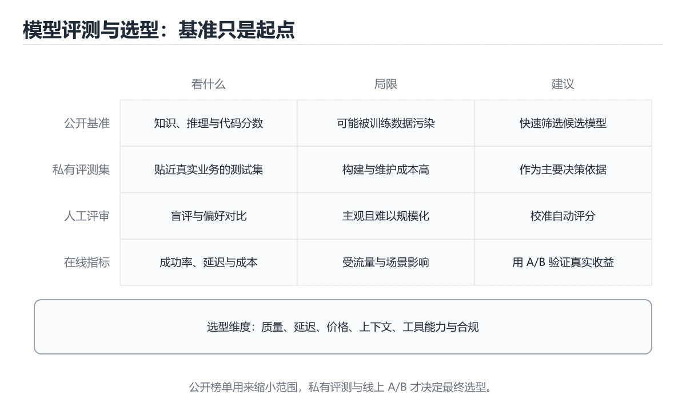
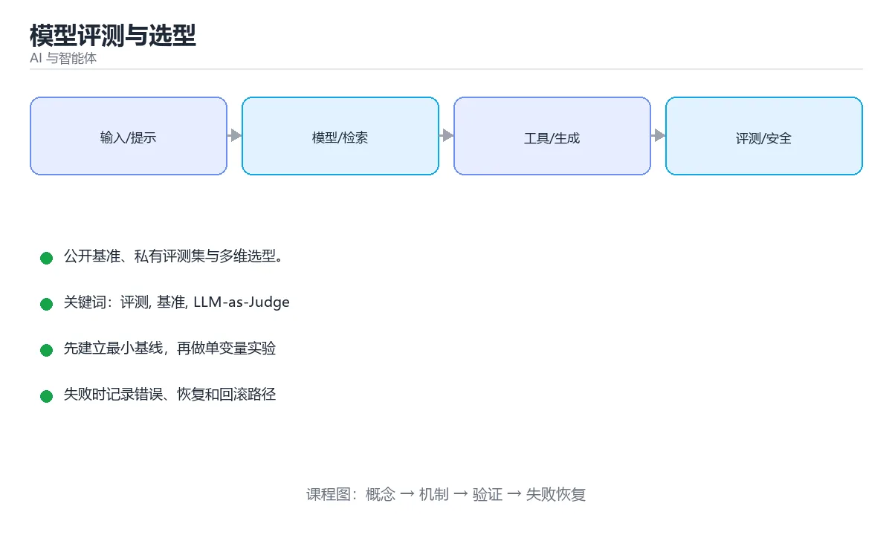

# 模型评测与选型





> 内容更新时间：2026-10-03 · 学习阶段：高级 · 预计用时：16 分钟

## 学习目标

- 能用自己的话解释「模型评测与选型」解决了什么问题，而不是只背术语。
- 能说清 「评测」、「基准」、「LLM-as-Judge」、「选型」 之间的关系，并分别举出一个例子。
- 能把本课知识放回「AI 与智能体」的知识体系，说明它和相邻主题的边界。
- 能完成本课练习，并用验收标准检查自己的结果。

> 一句话摘要：公开基准、私有评测集与多维选型。

## 前置知识

- 先完成上一课《Agent 成本与性能优化》；如果已经掌握，可以直接用本课练习自测。
- 本课阶段：高级。建议具备同一方向的完整基础，能阅读较长的代码、配置或系统设计说明。
- 开始前先复习：评测、基准、LLM-as-Judge。
- 如果某一步看不懂，先记录具体卡点，完成练习后再回头读一遍。


## 三类评测

| 类型 | 做法 | 用途 |
| --- | --- | --- |
| 公开基准 | MMLU、GSM8K、HumanEval、MT-Bench 等标准题集 | 快速了解模型通用能力 |
| 私有评测集 | 用自己业务的真实样本构建 | 决定「到底用哪个模型」 |
| 在线评测 | A/B 实验、满意度、采纳率 | 验证真实收益 |

公开基准只能做初筛：题目可能进入训练数据（数据污染），且与你的业务分布往往不同。

## 评测维度

1. **效果**：正确率、忠实度（是否忠于资料）、格式合规率。
2. **成本**：每千 token 价格、每任务平均 token、每成功任务费用。
3. **延迟**：首 token 延迟、端到端 P95。
4. **稳定性**：同一输入多次运行的一致率、失败重试率。
5. **安全**：越狱与提示注入的成功率、敏感信息泄露率。

单看准确率容易误判，**效果、成本、延迟必须同时看**。

## 私有评测集怎么建

1. 从线上真实请求采样，覆盖高频场景与长尾。
2. 标注标准答案与评分规则（要点清单比逐字比对更实用）。
3. 包含对抗样本：提示注入、超长输入、歧义问题、无答案问题。
4. 分为开发集（调提示）与保留集（最终验收），防止过拟合。

规模不一定要大：50~200 条高质量、覆盖关键场景的用例，往往比几千条自动生成的题目更有价值。

## 打分方式

| 方式 | 优点 | 局限 |
| --- | --- | --- |
| 规则断言 | 客观、可进 CI | 只适合结构化任务 |
| 参考答案比对 | 可量化 | 自然语言答案难以逐字匹配 |
| LLM-as-Judge | 灵活，成本低 | 有偏见，需要人工校准 |
| 人工评审 | 最可靠 | 昂贵、慢 |

实践：先用规则覆盖可判定的部分，再用 LLM 评委打分，最后抽样人工校准评委的准确率。

## 选型建议

1. 先用小模型跑评测集，不达标再升级模型，避免默认用最贵的。
2. 关注「每成功任务成本」，而不是每千 token 单价。
3. 评估供应商的限流、可用性承诺与数据合规条款。
4. 保留可切换能力：用统一网关抽象模型调用，方便随时换模型或做灰度。
5. 模型版本会更新，评测集要长期保留并定期重跑。

## 本课小结
模型选型不是「谁榜单第一」，而是**用你的评测集，在效果、成本、延迟、安全四个维度上找到最合适的那个**。


## 选型维度速查

| 维度 | 关注点 | 权重示例 |
| --- | --- | --- |
| 任务质量 | 在你的评测集上的表现 | 40% |
| 成本 | 每千 Token 价格与实际用量 | 20% |
| 延迟 | P95 首 Token 与总时长 | 15% |
| 上下文长度 | 是否满足资料规模 | 10% |
| 工具与结构化输出 | 函数调用与 Schema 支持 | 10% |
| 合规与部署 | 数据出境、私有化能力 | 5% |
| 稳定性 | 限流、可用性与版本策略 | 附加项 |

## 评测集设计速查

| 要求 | 说明 |
| --- | --- |
| 来自真实流量 | 用线上请求构造，避免凭空想象 |
| 覆盖切片 | 按业务线、语言、长度、难度分层 |
| 答案可判定 | 有明确的标准答案或评分标准 |
| 保密 | 不进公开数据，避免污染 |
| 规模 | 每类至少数十条，关键场景上百条 |
| 可扩展 | 支持持续新增与版本管理 |
| 双向 | 含应该拒答与应该澄清的样例 |

```python
from dataclasses import dataclass, field

@dataclass
class ModelScore:
    name: str
    quality: float          # 0 到 1
    cost_per_1k: float      # 相对成本
    p95_latency_ms: float
    context_tokens: int
    tool_support: float     # 0 到 1
    compliance: float = 1.0

    def weighted(self, weights: dict) -> float:
        normalized_latency = 1 - min(1.0, self.p95_latency_ms / 5000)
        normalized_cost = 1 - min(1.0, self.cost_per_1k / 0.05)
        normalized_context = min(1.0, self.context_tokens / 200_000)
        parts = {
            "quality": self.quality,
            "cost": normalized_cost,
            "latency": normalized_latency,
            "context": normalized_context,
            "tool": self.tool_support,
            "compliance": self.compliance,
        }
        return round(sum(parts[key] * weights[key] for key in weights), 4)


WEIGHTS = {
    "quality": 0.40, "cost": 0.20, "latency": 0.15,
    "context": 0.10, "tool": 0.10, "compliance": 0.05,
}


def rank(models: list, weights: dict = WEIGHTS) -> list:
    scored = [(m, m.weighted(weights)) for m in models]
    return sorted(scored, key=lambda item: -item[1])


def equivalent_cost(input_tokens: int, output_tokens: int, in_price: float, out_price: float) -> float:
    """按真实用量算等效成本，比单价更有意义。"""
    return round(input_tokens / 1000 * in_price + output_tokens / 1000 * out_price, 6)


candidates = [
    ModelScore("model-a", 0.82, 0.010, 1200, 128_000, 0.9),
    ModelScore("model-b", 0.88, 0.030, 900, 200_000, 0.95),
    ModelScore("model-c", 0.75, 0.004, 1600, 64_000, 0.7),
]
print([(m.name, s) for m, s in rank(candidates)])
print(equivalent_cost(3000, 800, 0.01, 0.03))
```

## 公开基准的局限

| 局限 | 说明 |
| --- | --- |
| 数据污染 | 测试集可能进入训练数据 |
| 与业务无关 | 高分不代表适合你的任务 |
| 指标单一 | 忽略成本、延迟与安全 |
| 版本漂移 | 模型悄悄更新导致分数变化 |
| 可刷分 | 针对基准优化而非真实能力 |

结论：公开基准用于初筛，**最终决策必须基于自建评测集与线上灰度**。

## 常见错误对照表

| 容易踩的做法 | 实际现象 | 原因与正确做法 |
| --- | --- | --- |
| 只看公开榜单 | 上线后效果不符 | 自建评测集 + 灰度验证 |
| 只看单价 | 实际成本更高 | 用真实用量算等效成本 |
| 评测集与业务脱节 | 结论无参考价值 | 从真实请求构造 |
| 用测试集反复调参 | 指标虚高 | 划分验证与测试集 |
| 忽略拒答与澄清样例 | 上线后乱答 | 评测集包含应拒答用例 |
| 不看延迟分位 | 高并发下体验差 | 关注 P95 与首 Token 延迟 |
| 忽略合规与部署要求 | 无法落地 | 先过合规与部署门槛 |
| 模型静默升级不做回归 | 质量突变 | 固定版本并定期回归 |
| 只评估单一模型 | 错过更优组合 | 评估「小模型 + 升级路由」组合 |
| 不记录评测配置 | 结果不可复现 | 记录模型版本与参数 |

## 自测清单

- [ ] 选型以自建评测集为主，公开榜单仅作初筛。
- [ ] 成本用真实用量计算而非单价比较。
- [ ] 评测集来自真实流量且覆盖关键切片。
- [ ] 评测包含拒答、澄清与安全用例。
- [ ] 记录模型版本与参数，可复现、可回归。

## 动手练习


> 本课练习重点：围绕「评测、基准、LLM-as-Judge」完成复述、实验和交付，每个结果都要能被别人检查。

先写评测样例，再改一个提示、模型或数据变量，最后比较质量、成本与安全。

### 练习 1：建立心智模型（10 分钟）

合上教程，用 3～5 句话回答：

1. 「模型评测与选型」解决了什么问题？
2. 如果没有它，会出现什么具体后果？
3. 它和「基准」是什么关系？

**验收标准**：至少出现一个本课关键词，并写出一个反例、边界条件或失效场景。

### 练习 2：做一次可控实验（20 分钟）

从正文中选一个最小示例，完成以下操作：

1. 先预测修改一个参数、输入或步骤后的结果。
2. 再实际执行或逐步推演，记录真实结果。
3. 如果结果与预测不同，写出差异原因。

**验收标准**：留下「原例 → 改动 → 预测 → 结果 → 原因」五步记录。

### 练习 3：交付一个小结果（30 分钟）

构造 5 条小型离线样例，写清输入、期望输出、评分标准和失败案例。

任务要求：

- 结果必须能被别人检查，不能只写“我已经理解了”。
- 至少覆盖「评测」和「基准」两个关键词。
- 写出 1 个仍然不确定的问题，以及下一步如何验证。

> 提示：时间有限时优先做练习 1 和练习 2；练习 3 可以拆成两次完成。


## 可运行练习

下面 3 个任务围绕“模型评测与选型”展开，代码可以直接粘贴到 App 的离线沙箱里运行；如果示例会读取标准输入，请按代码注释在沙箱的 stdin 区域填入同样格式的数据。

### 任务 1：先跑通，再解释

```python
from dataclasses import dataclass, field

@dataclass
class ModelScore:
    name: str
    quality: float          # 0 到 1
    cost_per_1k: float      # 相对成本
    p95_latency_ms: float
    context_tokens: int
    tool_support: float     # 0 到 1
    compliance: float = 1.0

    def weighted(self, weights: dict) -> float:
        normalized_latency = 1 - min(1.0, self.p95_latency_ms / 5000)
        normalized_cost = 1 - min(1.0, self.cost_per_1k / 0.05)
        normalized_context = min(1.0, self.context_tokens / 200_000)
        parts = {
            "quality": self.quality,
            "cost": normalized_cost,
            "latency": normalized_latency,
            "context": normalized_context,
            "tool": self.tool_support,
            "compliance": self.compliance,
        }
        return round(sum(parts[key] * weights[key] for key in weights), 4)


WEIGHTS = {
    "quality": 0.40, "cost": 0.20, "latency": 0.15,
    "context": 0.10, "tool": 0.10, "compliance": 0.05,
}


def rank(models: list, weights: dict = WEIGHTS) -> list:
    scored = [(m, m.weighted(weights)) for m in models]
    return sorted(scored, key=lambda item: -item[1])


def equivalent_cost(input_tokens: int, output_tokens: int, in_price: float, out_price: float) -> float:
    """按真实用量算等效成本，比单价更有意义。"""
    return round(input_tokens / 1000 * in_price + output_tokens / 1000 * out_price, 6)


candidates = [
    ModelScore("model-a", 0.82, 0.010, 1200, 128_000, 0.9),
    ModelScore("model-b", 0.88, 0.030, 900, 200_000, 0.95),
    ModelScore("model-c", 0.75, 0.004, 1600, 64_000, 0.7),
]
print([(m.name, s) for m, s in rank(candidates)])
print(equivalent_cost(3000, 800, 0.01, 0.03))
```

**预期输出**：运行后会输出与“模型评测与选型”相关的关键结果；请重点核对输出行数、最后一个数值和异常提示。

**验收标准**：代码能正常运行；逐行解释每个变量的值如何变化，并指出哪一行决定了最终结果。

### 任务 2：只改一个条件

复制上面的代码，只修改一个输入、边界或参数（例如空值、最大值、循环次数、过滤条件），先写出你的预测，再实际运行。

**验收标准**：留下“原结果 → 改动 → 预测 → 实际结果 → 差异原因”五步记录；如果预测错误，要写出修正后的心智模型。

### 任务 3：迁移到自己的数据

用同一套思路处理一组你自己的数据或场景，保持输出格式与任务 1 一致。

**验收标准**：代码不少于 10 行，至少包含 1 个边界检查；把代码和运行结果保存到笔记或片段库。


## 故障现场

这一节把“模型评测与选型”最常见的失败方式还原成现场记录，练习时按“症状 → 复现 → 定位 → 修复 → 预防”的顺序排查。

### 现场 1：“模型评测与选型”的 评测 常规用例通过，但边界用例失败

**症状**：在“模型评测与选型”的练习或生产场景里出现““模型评测与选型”的 评测 常规用例通过，但边界用例失败”。

**复现**：准备一组最小输入，只保留触发““模型评测与选型”的 评测 常规用例通过，但边界用例失败”的必要条件，连续运行两次确认结果稳定。

**定位**：围绕“评测 的前置条件与取值边界没有写进代码，默认值掩盖了空值和极值”检查调用链、输入数据和环境配置，先验证假设再改代码。

**修复**：为“模型评测与选型”补一条空值或极值用例，把前置条件写成断言，并让失败信息直接指出是哪个输入越界

**预防**：把““模型评测与选型”的 评测 常规用例通过，但边界用例失败”写成一条自动化用例，并在“模型评测与选型”的验收清单里保留对应检查项。


### 现场 2：“模型评测与选型”的 基准 结果在两次运行之间不一致

**症状**：在“模型评测与选型”的练习或生产场景里出现““模型评测与选型”的 基准 结果在两次运行之间不一致”。

**复现**：准备一组最小输入，只保留触发““模型评测与选型”的 基准 结果在两次运行之间不一致”的必要条件，连续运行两次确认结果稳定。

**定位**：围绕“基准 依赖了当前版本、执行顺序或共享状态，单次运行无法暴露差异”检查调用链、输入数据和环境配置，先验证假设再改代码。

**修复**：固定“模型评测与选型”使用的版本与随机种子，记录两次运行的完整输入和输出，再逐项消除非确定性来源

**预防**：把““模型评测与选型”的 基准 结果在两次运行之间不一致”写成一条自动化用例，并在“模型评测与选型”的验收清单里保留对应检查项。


### 现场 3：离线评测分数很高，线上仍然频繁给出错误答案

**症状**：在“模型评测与选型”的练习或生产场景里出现“离线评测分数很高，线上仍然频繁给出错误答案”。

**复现**：准备一组最小输入，只保留触发“离线评测分数很高，线上仍然频繁给出错误答案”的必要条件，连续运行两次确认结果稳定。

**定位**：围绕“评测集与真实输入分布不一致，评测 的提示词或检索结果没有覆盖失败场景”检查调用链、输入数据和环境配置，先验证假设再改代码。

**修复**：为“模型评测与选型”建立固定评测集、边界题和对抗题，分别记录准确率、拒答率、延迟与 token 成本

**预防**：把“离线评测分数很高，线上仍然频繁给出错误答案”写成一条自动化用例，并在“模型评测与选型”的验收清单里保留对应检查项。


## 深入补充：模型评测与选型 的取舍与边界

### 一、把概念放回真实约束

学习“模型评测与选型”时，最容易只记住结论而忽略前提。先写出三个约束：数据规模、时间预算、可接受的失败方式；再判断 评测 与 基准 在这些约束下是否仍然成立。只要约束改变，原来的最优解就可能变成错误解。

| 维度 | 要回答的问题 | 常见做法 | 失败信号 |
| --- | --- | --- | --- |
| 数据 | 评测 的训练或检索数据从哪来、质量如何 | 清洗、去重、标注与版本化 | 评测集泄漏或分布漂移 |
| 模型 | 基准 的能力边界与成本是多少 | 基线对比、离线评测、灰度发布 | 指标好看但线上任务失败 |
| 评测 | 如何证明改动真的有效 | 固定评测集、人工抽检、A/B | 只比较单例输出 |
| 安全 | 失败时会不会泄露或越权 | 权限校验、内容过滤、审计 | 提示注入或数据外泄 |

### 二、三个容易混淆的边界

1. **把“能跑”当成“正确”**：模型评测与选型 的示例通过，只说明这条输入路径可用；还要用空值、极值和并发路径验证。
2. **把“平均值”当成“全部”**：评测 的指标好看，不代表尾部请求、冷启动或失败重试也好看。
3. **把“当前版本”当成“永久行为”**：基准 依赖的默认值、API 或性能特征都可能随版本变化，需要固定版本并保留回归用例。

### 三、一个生产场景

假设团队要在真实系统里使用“模型评测与选型”：第一周先做小流量验证，记录 评测 的基线与异常；第二周扩大输入规模，观察 基准 是否成为瓶颈；第三周再做故障演练，主动注入超时、重复请求和依赖不可用，确认系统能降级、能重试、能恢复。每一步都要留下指标、日志和结论，而不是只留下“感觉更快了”。

### 四、自测清单

- 能否用一句话说出“模型评测与选型”解决的核心问题与不适用场景？
- 能否画出 评测 的数据流或状态变化，并标出失败路径？
- 能否给出一个反例，证明某个看似合理的结论在边界条件下不成立？
- 能否写出一条可复现的验证命令，让别人独立得到相同结论？

### 五、AI 工程补充

在“模型评测与选型”里，模型输出只是系统的一部分：输入要先经过权限与数据质量检查，检索或工具调用要有超时和降级，输出要经过引用核验或规则校验，最后记录 token、延迟、失败类型和人工反馈。评测时至少准备固定题、边界题和对抗题，并把 评测 与 基准 的指标分开记录；否则一次提示词改动看似提升体验，实际可能只是评测样本泄漏或随机波动。


## 考点精讲：把测验题还原成判断过程

本课有 6 个判断点。先自己作答，再看「判断依据」；如果结论正确但理由不完整，回到正文对应章节补足概念。

### 考点 1：选择生产模型最应依据什么？

- **正确判断**：用自己业务的私有评测集实测
- **判断依据**：正确答案是「用自己业务的私有评测集实测」，本课在「本课小结」中说明：模型选型不是「谁榜单第一」，而是用你的评测集，在效果、成本、延迟、安全四个维度上找到最合适的那个。公开基准可能被污染，且与业务分布不同。本课还在「公开基准的局限」中说明：结论：公开基准用于初筛，最终决策必须基于自建评测集与线上灰度。本课还在「选型建议」中说明：先用小模型跑评测集，不达标再升级模型，避免默认用最贵的。
- **迁移检查**：如果给某个错误选项去掉一个限定词，它会不会变成正确？说明理由。

### 考点 2：比「每千 token 单价」更有意义的成本指标是？

- **正确判断**：每成功任务成本
- **判断依据**：它把效果与成本结合，反映真实性价比。其他选项：每成功任务成本比单价更有意义，因为它把失败重试与 token 用量都计算在内。针对「比每千 token 单价更有意义的成本指标是，」，本课在「选型建议」中说明：关注「每成功任务成本」，而不是每千 token 单价。本课还在「评测维度」中说明：成本：每千 token 价格、每任务平均 token、每成功任务费用。本课还在「评测维度」中说明：延迟：首 token 延迟、端到端 P95。
- **迁移检查**：遮住选项，只根据定义复述一次答案，再回来看哪个选项与复述一致。

### 考点 3：公开基准的主要局限是？

- **正确判断**：可能存在数据污染且与业务分布不匹配
- **判断依据**：正确答案是「可能存在数据污染且与业务分布不匹配」，本课在「三类评测」中说明：公开基准只能做初筛：题目可能进入训练数据（数据污染），且与你的业务分布往往不同。因此只能用于初筛，不能替代私有评测。本课还在「公开基准的局限」中说明：结论：公开基准用于初筛，最终决策必须基于自建评测集与线上灰度。本课还在「私有评测集怎么建」中说明：规模不一定要大：50~200 条高质量、覆盖关键场景的用例，往往比几千条自动生成的题目更有价值。
- **迁移检查**：如果给某个错误选项去掉一个限定词，它会不会变成正确？说明理由。

### 考点 4：离线评测与在线 A/B 测试的关系是？

- **正确判断**：离线评测筛掉明显不合格的方案
- **判断依据**：离线指标高不等于用户满意，两者缺一不可。其他选项：离线评测筛掉明显不合格的方案，两者互补、不能互相替代。针对「离线评测与在线 A/B 测试的关系是，」，本课在「本课小结」中说明：模型选型不是「谁榜单第一」，而是用你的评测集，在效果、成本、延迟、安全四个维度上找到最合适的那个。本课还在「评测维度」中说明：单看准确率容易误判，效果、成本、延迟必须同时看。本课还在「选型建议」中说明：模型版本会更新，评测集要长期保留并定期重跑。
- **迁移检查**：把题干里的一个条件换成边界值，原来的结论还成立吗？写出判断过程。

### 考点 5：评测数据「污染」（contamination）指的是？

- **正确判断**：测试样本出现在训练数据中
- **判断依据**：公开基准容易污染，因此需要自建、保密且持续更新的评测集。其他选项：污染指测试样本出现在训练数据中导致分数虚高。针对「评测数据污染（contamination）指的是，」，本课在「三类评测」中说明：公开基准只能做初筛：题目可能进入训练数据（数据污染），且与你的业务分布往往不同。本课还在「私有评测集怎么建」中说明：包含对抗样本：提示注入、超长输入、歧义问题、无答案问题。本课还在「选型建议」中说明：评估供应商的限流、可用性承诺与数据合规条款。
- **迁移检查**：如果给某个错误选项去掉一个限定词，它会不会变成正确？说明理由。

### 考点 6：补全代码：「模型评测与选型」示例中，下面这行代码缺少哪个关键字或函数名？请填入 ____。 `normalized_latency = 1 - ____(1.0, self.p95_latency_ms / 5000)`

- **正确判断**：min
- **判断依据**：min 是完成这条语句的关键部分，去掉或替换它就无法表达同样的语义，也得不到示例给出的结果。针对「补全代码：模型评测与选型示例中，下面这行代码缺少…」，本课在「选型建议」中说明：保留可切换能力：用统一网关抽象模型调用，方便随时换模型或做灰度。
- **迁移检查**：如果填成相近的另一个函数或关键字，程序会在哪一步出错？

### 补充自测（2 题）

1. 围绕“模型评测与选型”中的 评测、基准、LLM-as-Judge，下列哪两项是本课强调的实践判断？
2. 下面这段 Python 代码复现了“模型评测与选型”中 评测、基准、LLM-as-Judge 相关的一个常见故障，哪一项最准确地解释了问题？

这些题按“先定位概念、再排除边界错误、最后核对答案”的顺序作答；每题解析都给出了判断依据。


## 本课复习清单

离开本课前，逐项确认：

- [ ] 不看解析，能说出「选择生产模型最应依据什么？」的判断依据。
- [ ] 不看解析，能说出「比「每千 token 单价」更有意义的成本指标是？」的判断依据。
- [ ] 不看解析，能说出「公开基准的主要局限是？」的判断依据。
- [ ] 不看解析，能说出「离线评测与在线 A/B 测试的关系是？」的判断依据。
- [ ] 不看解析，能说出「评测数据「污染」（contamination）指的是？」的判断依据。
- [ ] 不看解析，能说出「补全代码：「模型评测与选型」示例中，下面这行代码缺少哪个关键字或函数名？请填入 …」的判断依据。
- [ ] 至少运行一次本课示例，记录输入、输出和一个边界情况。
- [ ] 把本课最容易混淆的两个概念写成一句话对照。

| 复盘项 | 记录 |
| --- | --- |
| 已经能独立解释的考点 |  |
| 仍然说不清的概念 |  |
| 下一步验证动作 |  |

## 术语速查

把本课反复出现的术语集中放在一起。复习时先遮住右列，尝试用自己的话解释，再回到正文核对。

| 术语 | 本课语境 |
| --- | --- |
| `评测` | 本课围绕该主题展开，结合正文与代码示例理解它的适用边界。 |
| `基准` | 本课围绕该主题展开，结合正文与代码示例理解它的适用边界。 |
| `LLM-as-Judge` | 本课围绕该主题展开，结合正文与代码示例理解它的适用边界。 |
| `选型` | 本课围绕该主题展开，结合正文与代码示例理解它的适用边界。 |
| `成本` | 本课围绕该主题展开，结合正文与代码示例理解它的适用边界。 |

## 面试问答与自测

下面把本课考点换成面试追问。先口述自己的答案，
再对照参考回答检查是否遗漏了前提、边界或失败路径。

### 追问 1：选择生产模型最应依据什么？

**参考回答**：正确答案是「用自己业务的私有评测集实测」，本课在「本课小结」中说明：模型选型不是「谁榜单第一」，而是用你的评测集，在效果、成本、延迟、安全四个维度上找到最合适的那个。公开基准可能被污染，且与业务分布不同。本课还在「公开基准的局限」中说明：结论：公开基准用于初筛，最终决策必须基于自建评测集与线上灰度。本课还在「选型建议」中说明：先用小模型跑评测集，不达标再升级模型，避免默认用最贵的。

### 追问 2：比「每千 token 单价」更有意义的成本指标是？

**参考回答**：它把效果与成本结合，反映真实性价比。其他选项：每成功任务成本比单价更有意义，因为它把失败重试与 token 用量都计算在内。针对「比每千 token 单价更有意义的成本指标是，」，本课在「选型建议」中说明：关注「每成功任务成本」，而不是每千 token 单价。本课还在「评测维度」中说明：成本：每千 token 价格、每任务平均 token、每成功任务费用。本课还在「评测维度」中说明：延迟：首 token 延迟、端到端 P95。

### 追问 3：公开基准的主要局限是？

**参考回答**：正确答案是「可能存在数据污染且与业务分布不匹配」，本课在「三类评测」中说明：公开基准只能做初筛：题目可能进入训练数据（数据污染），且与你的业务分布往往不同。因此只能用于初筛，不能替代私有评测。本课还在「公开基准的局限」中说明：结论：公开基准用于初筛，最终决策必须基于自建评测集与线上灰度。本课还在「私有评测集怎么建」中说明：规模不一定要大：50~200 条高质量、覆盖关键场景的用例，往往比几千条自动生成的题目更有价值。

### 追问 4：离线评测与在线 A/B 测试的关系是？

**参考回答**：离线指标高不等于用户满意，两者缺一不可。其他选项：离线评测筛掉明显不合格的方案，两者互补、不能互相替代。针对「离线评测与在线 A/B 测试的关系是，」，本课在「本课小结」中说明：模型选型不是「谁榜单第一」，而是用你的评测集，在效果、成本、延迟、安全四个维度上找到最合适的那个。本课还在「评测维度」中说明：单看准确率容易误判，效果、成本、延迟必须同时看。本课还在「选型建议」中说明：模型版本会更新，评测集要长期保留并定期重跑。

### 追问 5：评测数据「污染」（contamination）指的是？

**参考回答**：公开基准容易污染，因此需要自建、保密且持续更新的评测集。其他选项：污染指测试样本出现在训练数据中导致分数虚高。针对「评测数据污染（contamination）指的是，」，本课在「三类评测」中说明：公开基准只能做初筛：题目可能进入训练数据（数据污染），且与你的业务分布往往不同。本课还在「私有评测集怎么建」中说明：包含对抗样本：提示注入、超长输入、歧义问题、无答案问题。本课还在「选型建议」中说明：评估供应商的限流、可用性承诺与数据合规条款。

## English Overview

**Title:** Model Evaluation

**Summary:** Benchmarks, private eval sets and selection.

**Category:** AI & Agents  
**Level:** 高级  
**Key terms:** 评测, 基准, LLM-as-Judge, 选型, 成本

> The full tutorial is written in Chinese. This bilingual overview helps English readers identify the topic, scope and key terms before studying the detailed examples.

## 内容元数据

- 内容版本：v2.0
- 最后更新：2026-10-03
- 学习阶段：高级
- 适用环境：主流大模型 API、开源模型与向量数据库
- 内容来源：内置结构化课程与工程实践整理
- 相关主题：评测、基准、LLM-as-Judge、选型、成本
- 质量版本：P0 测验标准 + P1 覆盖扩展 + P2 体验补全


## 参考资料与复核

- 最后复核：2026-10-04
- 下次复核：2027-04-04
- 复核范围：版本兼容、API 行为、安全建议与工程实践
- 来源性质：官方文档与标准；本课正文为离线教学重组，不复制原文

| 参考资料 | 本课用途 |
| --- | --- |
| [OpenAI Docs](https://platform.openai.com/docs/) | 模型 API、工具与评估 |
| [Hugging Face Docs](https://huggingface.co/docs) | 模型、数据集与推理 |
| [Model Context Protocol](https://modelcontextprotocol.io/) | Agent 工具与上下文协议 |

> 本课主题：公开基准、私有评测集与多维选型。

> App 完全离线展示文字链接，不会自动联网；需要延伸阅读时可复制链接到浏览器。
