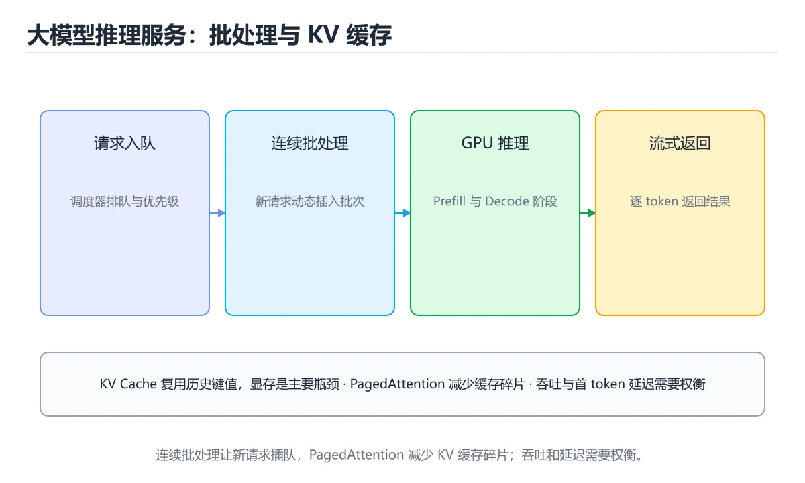
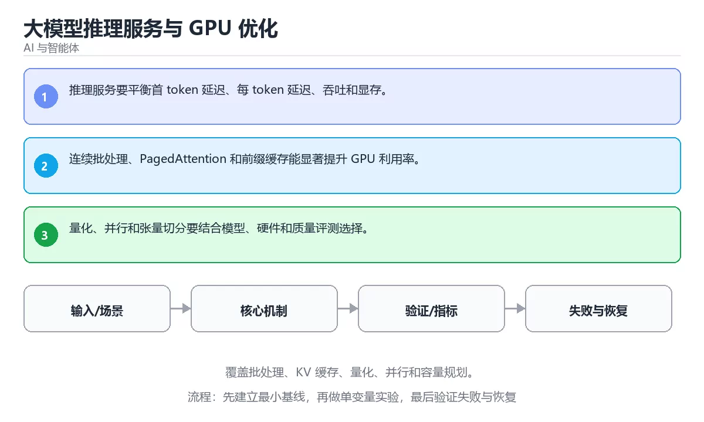

# 大模型推理服务与 GPU 优化





> 内容更新时间：2026-10-06 · 学习阶段：高级 · 预计用时：35 分钟

## 本节知识框架

**课程定位**：所属分类 `ai`（AI 与智能体），课程主题 `大模型推理服务与 GPU 优化`，学习阶段 高级，建议用时 40 分钟。

本课主线：覆盖批处理、KV 缓存、量化、并行和容量规划。

**学完本课应当能够**
- 说清 `推理服务` 与 `KV Cache` 的含义与区别，并各举一个正例和一个反例。
- 用本课示例验证 `批处理` 的行为，记录输入、输出与失败条件。
- 遇到「只测单请求延迟」这类问题时，能说出触发条件与修复顺序。

### 从概念到验证的学习链条

1. `推理服务`：先掌握 在线上接收请求、调度模型并返回结果的低延迟服务，再用它解释 `KV Cache` 为什么会出现。
2. `KV Cache`：先掌握 缓存已生成 token 的注意力键值，避免每步重算，直接决定长上下文的显存占用，再用它解释 `批处理` 为什么会出现。
3. `批处理`：先掌握 按“大模型推理服务与 GPU 优化”中 推理服务、KV Cache、批处理 的实践顺序，把四个步骤排成从准备到复盘的合理顺序，再用它解释 `量化` 为什么会出现。
4. `量化`：先掌握 用更低位宽表示权重与激活，换取更小显存和更高吞吐，代价是精度略降，再用它解释 本课示例的观察结果 为什么会出现。

**先修与衔接**：本课是「AI 与智能体」分类的第 42 课。先修内容：《Realtime API 与语音交互》。《Realtime API 与语音交互》里的 `Realtime`、`语音` 是本课的前提。相关或后续课程：《AI 治理、合规与风险》。

### 完成判据

- **定义关**：不看正文也能说明 `推理服务` 是 在线上接收请求、调度模型并返回结果的低延迟服务，并指出一个反例。
- **机制关**：能按“输入 → 转换 → 输出 → 验证”复述 `大模型推理服务与 GPU 优化`，而不是只背结论。
- **示例关**：能运行或推演 `大模型推理服务与 GPU 优化` 的 `text` 示例，并说明一个真实出现的标识符或字面量。
- **证据关**：能指出 `大模型推理服务与 GPU 优化` 示例里的 调用了 `score()`，并说明它支持或反驳了本课的哪一条结论。
- **排错关**：能复现 只测单请求延迟，记录现象并按 用压测同时看吞吐、P95/P99 与显存占用 修复。
- **迁移关**：能把 `推理服务`、`KV Cache`、`批处理`、`量化` 放进一个与 `大模型推理服务与 GPU 优化` 不同的项目场景，并保持输入与验证条件可追踪。
- **复盘关**：学完 `大模型推理服务与 GPU 优化` 后，用一句话写下仍然不确定的结论，并列出下一次验证需要的输入、环境和成功判据。

### 复习清单

- [ ] 能不看正文复述本课核心术语，并指出一个边界或反例。
- [ ] 能运行或推演本课示例，记录输入、输出与失败现象。
- [ ] 能完成一次自测，并把错题对照错误表定位原因。

## 核心概念定义

| 术语 | 操作性定义 | 常见边界与风险 |
| --- | --- | --- |
| 推理服务 | 在线上接收请求、调度模型并返回结果的低延迟服务。 | 结论随输入规模变化，小规模成立不代表大规模成立，需要重新测量。 |
| KV Cache | 缓存已生成 token 的注意力键值，避免每步重算，直接决定长上下文的显存占用。 | 缓存与状态残留会让结果过期，先明确失效策略再判断正确性。 |
| 批处理 | 按“大模型推理服务与 GPU 优化”中 推理服务、KV Cache、批处理 的实践顺序，把四个步骤排成从准备到复盘的合理顺序。 | 易错：显存吃满反而排队，延迟飙升；正确做法是按显存与延迟目标调批大小，配合连续批处理与限流。 |
| 量化 | 用更低位宽表示权重与激活，换取更小显存和更高吞吐，代价是精度略降。 | 结论随输入规模变化，小规模成立不代表大规模成立，需要重新测量。 |
| 数据 | 推理服务 的训练或检索数据从哪来、质量如何 | 结果依赖数据分布、模型版本与算力预算，换数据集或换硬件都要重新评估。 |
| 模型 | KV Cache 的能力边界与成本是多少 | 只在「KV Cache 的能力边界与成本是多少」这一前提下成立，换输入或换环境要重新验证。 |
| 评测 | 如何证明改动真的有效 | 只在「如何证明改动真的有效」这一前提下成立，换输入或换环境要重新验证。 |
| 安全 | 失败时会不会泄露或越权 | 只在「失败时会不会泄露或越权」这一前提下成立，换输入或换环境要重新验证。 |
| 模型输入是否经过长度、格式与敏感信息检查？ | 日志、输入样例、测试或指标 | 只在「日志、输入样例、测试或指标」这一前提下成立，换输入或换环境要重新验证。 |
| 工具调用是否最小权限、可超时、可取消？ | 日志、输入样例、测试或指标 | 只在「日志、输入样例、测试或指标」这一前提下成立，换输入或换环境要重新验证。 |
| 输出是否有引用、置信度或人工复核兜底？ | 日志、输入样例、测试或指标 | 只在「日志、输入样例、测试或指标」这一前提下成立，换输入或换环境要重新验证。 |
| 成本、延迟与失败率是否有指标？ | 日志、输入样例、测试或指标 | 只在「日志、输入样例、测试或指标」这一前提下成立，换输入或换环境要重新验证。 |

## 原理与运行机制

### 机制总览

**教材衔接：核心知识**

### 1. 推理服务要平衡首 token 延迟、每 token 延迟、吞吐和显存。

- 关键做法：先让 推理服务 的最小示例可复现，再加入并发或规模条件。
- 验证标准：answer 的输出能被他人复现，边界输入有对应用例。

### 2. 连续批处理、PagedAttention 和前缀缓存能显著提升 GPU 利用率。

把这条结论放回「大模型推理服务与 GPU 优化」的完整流程里展开：

- 正文依据：能用自己的话解释：推理服务要平衡首 token 延迟、每 token 延迟、吞吐和显存。
- 落地检查：把「2. 连续批处理、PagedAttention 和前缀缓存能显著提升 GPU 利用率。」改写成一条可执行的核对项，逐条验证输入、超时与失败路径。

### 3. 量化、并行和张量切分要结合模型、硬件和质量评测选择。

把这条结论放回「大模型推理服务与 GPU 优化」的完整流程里展开：

- 正文依据：能用自己的话解释：连续批处理、PagedAttention 和前缀缓存能显著提升 GPU 利用率。
- 落地检查：把「3. 量化、并行和张量切分要结合模型、硬件和质量评测选择。」改写成一条可执行的核对项，逐条验证输入、超时与失败路径。

**教材衔接：关键流程**

**教材衔接：实践路径**

**教材衔接：验证步骤**

### 机制拆解：每一步的输入、动作与输出

#### 1. `推理服务`
- 输入：`推理服务`；本步把 在线上接收请求、调度模型并返回结果的低延迟服务 当作判断规则。
- 动作：围绕 `推理服务` 保留中间状态，并记录它与 `KV Cache` 的对应关系。
- 输出：`KV Cache`，它可以被下一段代码、测试或记录继续使用。
- `推理服务` 的失败条件：结论随输入规模变化，小规模成立不代表大规模成立，需要重新测量。

#### 2. `KV Cache`
- 输入：`推理服务`；本步把 缓存已生成 token 的注意力键值，避免每步重算，直接决定长上下文的显存占用 当作判断规则。
- 动作：围绕 `KV Cache` 保留中间状态，并记录它与 `批处理` 的对应关系。
- 输出：`批处理`，它可以被下一段代码、测试或记录继续使用。
- `KV Cache` 的失败条件：缓存与状态残留会让结果过期，先明确失效策略再判断正确性。

#### 3. `批处理`
- 输入：`KV Cache`；本步把 按“大模型推理服务与 GPU 优化”中 推理服务、KV Cache、批处理 的实践顺序，把四个步骤排成从准备到复盘的合理顺序 当作判断规则。
- 动作：围绕 `批处理` 保留中间状态，并记录它与 `量化` 的对应关系。
- 输出：`量化`，它可以被下一段代码、测试或记录继续使用。
- `批处理` 的失败条件：当批大小越大越好时，会出现显存吃满反而排队，延迟飙升。

#### 4. `量化`
- 输入：`批处理`；本步把 用更低位宽表示权重与激活，换取更小显存和更高吞吐，代价是精度略降 当作判断规则。
- 动作：围绕 `量化` 保留中间状态，并记录它与 `score` 的对应关系。
- 输出：`score`，它可以被下一段代码、测试或记录继续使用。
- `量化` 的失败条件：结论随输入规模变化，小规模成立不代表大规模成立，需要重新测量。

### 示例中的可观察事实

1. 调用了 `score()`；它对应的课程主题是 `大模型推理服务与 GPU 优化`。
2. 调用了 `strip()`；它对应的课程主题是 `大模型推理服务与 GPU 优化`。
3. 调用了 `print()`；它对应的课程主题是 `大模型推理服务与 GPU 优化`。
4. 出现字面量 `agent`；它对应的课程主题是 `大模型推理服务与 GPU 优化`。

### 复现实验记录

- 环境：`大模型推理服务与 GPU 优化` 使用 `text` 示例，固定 `推理服务`、`KV Cache`、`批处理`、`量化` 作为第一组条件。
- 首轮输入：先确认 调用了 `score()`，预测 `推理服务` 会怎样变化。
- 基线观察：记录命令、输入、输出和错误原文，不用截图代替可复制的文本。
- 单变量修改：只改变 `推理服务`，观察 `量化` 是否仍满足定义。
- 失败注入：复现 只测单请求延迟，确认现象是 并发上来后吞吐与尾延迟都失控。
- 记录结论：把“修改前、修改后、预期变化、实际变化”写成四列表，这样复盘 `大模型推理服务与 GPU 优化` 时才能区分概念错误与实现错误。

## 典型应用场景

- **只测单请求延迟**：典型现象是并发上来后吞吐与尾延迟都失控；正确做法是用压测同时看吞吐、P95/P99 与显存占用。
- **不区分预填充与解码**：典型现象是优化方向选错，改了半天没效果；正确做法是分别测首 token 延迟与每 token 延迟，再针对瓶颈优化。
- **批大小越大越好**：典型现象是显存吃满反而排队，延迟飙升；正确做法是按显存与延迟目标调批大小，配合连续批处理与限流。

### 最小验证场景

- 准备：保留 `text` 示例的原始输入，先记录 `大模型推理服务与 GPU 优化` 的基线输出和完整运行命令。
- 观察：先核对 调用了 `score()`，再改变一个与 `推理服务` 相关的条件。
- 判定：新结果与 `大模型推理服务与 GPU 优化` 的基线不同不等于错误；只有当差异破坏了 `推理服务` 的定义或错误表中的约束，才判定为失败。

### 选择与边界

- 使用 `推理服务` 时，先满足它的定义：在线上接收请求、调度模型并返回结果的低延迟服务；结论随输入规模变化，小规模成立不代表大规模成立，需要重新测量。
- 使用 `KV Cache` 时，先满足它的定义：缓存已生成 token 的注意力键值，避免每步重算，直接决定长上下文的显存占用；缓存与状态残留会让结果过期，先明确失效策略再判断正确性。
- 使用 `批处理` 时，先满足它的定义：按“大模型推理服务与 GPU 优化”中 推理服务、KV Cache、批处理 的实践顺序，把四个步骤排成从准备到复盘的合理顺序；易错：显存吃满反而排队，延迟飙升；正确做法是按显存与延迟目标调批大小，配合连续批处理与限流。
- 使用 `量化` 时，先满足它的定义：用更低位宽表示权重与激活，换取更小显存和更高吞吐，代价是精度略降；结论随输入规模变化，小规模成立不代表大规模成立，需要重新测量。

## 代码/协议/SQL 示例

**教材衔接：最小可运行示例**

下面这段代码演示 推理服务 的最小路径，先原样运行，再按注释改一处：

```python
def score(answer: str) -> int:
    return 1 if answer.strip() else 0

print(score("agent"))
```

**教材衔接：预期输出**

```text
1
```

### 示例精读：先找证据，再改一个条件

1. 调用了 `score()`；它出现在 `大模型推理服务与 GPU 优化` 的示例中，阅读时先确认它前后各发生了什么。
2. 调用了 `strip()`；它出现在 `大模型推理服务与 GPU 优化` 的示例中，阅读时先确认它前后各发生了什么。
3. 调用了 `print()`；它出现在 `大模型推理服务与 GPU 优化` 的示例中，阅读时先确认它前后各发生了什么。
4. 出现字面量 `agent`；它出现在 `大模型推理服务与 GPU 优化` 的示例中，阅读时先确认它前后各发生了什么。
- 在 `大模型推理服务与 GPU 优化` 中与 `推理服务` 对照：示例必须能支持 在线上接收请求、调度模型并返回结果的低延迟服务，否则说明这一段还缺少实现或验证步骤。
- 在 `大模型推理服务与 GPU 优化` 中与 `KV Cache` 对照：示例必须能支持 缓存已生成 token 的注意力键值，避免每步重算，直接决定长上下文的显存占用，否则说明这一段还缺少实现或验证步骤。
- 在 `大模型推理服务与 GPU 优化` 中与 `批处理` 对照：示例必须能支持 按“大模型推理服务与 GPU 优化”中 推理服务、KV Cache、批处理 的实践顺序，把四个步骤排成从准备到复盘的合理顺序，否则说明这一段还缺少实现或验证步骤。
- 在 `大模型推理服务与 GPU 优化` 中与 `量化` 对照：示例必须能支持 用更低位宽表示权重与激活，换取更小显存和更高吞吐，代价是精度略降，否则说明这一段还缺少实现或验证步骤。

## 时间/空间复杂度或性能分析

**性能关注点（大模型推理服务与 GPU 优化）**：算力与显存决定可行规模：记录训练或推理耗时、显存峰值与模型精度，换数据集要重新评估。

**本课特有开销（大模型推理服务与 GPU 优化 · 推理服务）**：缓存命中率比缓存实现本身更关键，先记录命中率与失效策略再谈优化。

**测量方法**：以 `大模型推理服务与 GPU 优化` 的 `推理服务` 场景为对象，固定输入跑一遍记录基线，再把规模或并发度提高一个数量级复测；两次结果的差值与波动范围才是结论依据。

### 需要控制的变量与记录项

- `大模型推理服务与 GPU 优化` 的 `推理服务`：固定它的版本、输入范围和资源上限，分别记录速度、内存与失败率的变化。
- `大模型推理服务与 GPU 优化` 的 `KV Cache`：固定它的版本、输入范围和资源上限，分别记录速度、内存与失败率的变化。
- `大模型推理服务与 GPU 优化` 的 `批处理`：固定它的版本、输入范围和资源上限，分别记录速度、内存与失败率的变化。
- `大模型推理服务与 GPU 优化` 的 `量化`：固定它的版本、输入范围和资源上限，分别记录速度、内存与失败率的变化。
- `大模型推理服务与 GPU 优化` 中 `推理服务` 的边界：结论随输入规模变化，小规模成立不代表大规模成立，需要重新测量。达到边界时不要外推，必须重新测量。
- `大模型推理服务与 GPU 优化` 中 `KV Cache` 的边界：缓存与状态残留会让结果过期，先明确失效策略再判断正确性。达到边界时不要外推，必须重新测量。
- `大模型推理服务与 GPU 优化` 中 `批处理` 的边界：易错：显存吃满反而排队，延迟飙升；正确做法是按显存与延迟目标调批大小，配合连续批处理与限流。达到边界时不要外推，必须重新测量。
- `大模型推理服务与 GPU 优化` 中 `量化` 的边界：结论随输入规模变化，小规模成立不代表大规模成立，需要重新测量。达到边界时不要外推，必须重新测量。
- `大模型推理服务与 GPU 优化` 的代码证据：先验证 调用了 `score()`，再记录该路径的输入规模与耗时；只看代码行数不能推出复杂度。

## 常见误区与易错点

| 容易写错的做法 | 实际现象 | 原因与正确做法 |
| --- | --- | --- |
| 只测单请求延迟 | 并发上来后吞吐与尾延迟都失控。 | 用压测同时看吞吐、P95/P99 与显存占用。 |
| 不区分预填充与解码 | 优化方向选错，改了半天没效果。 | 分别测首 token 延迟与每 token 延迟，再针对瓶颈优化。 |
| 批大小越大越好 | 显存吃满反而排队，延迟飙升。 | 按显存与延迟目标调批大小，配合连续批处理与限流。 |

### 现场 1：只测单请求延迟

**症状**：并发上来后吞吐与尾延迟都失控。

**根因与修复**：用压测同时看吞吐、P95/P99 与显存占用。

**自检**：在本课示例里复现「只测单请求延迟」，改成用压测同时看吞吐、P95/P99 与显存占用后重跑；如果症状消失且失败路径按预期变化，说明定位正确。

### 现场 2：不区分预填充与解码

**症状**：优化方向选错，改了半天没效果。

**根因与修复**：分别测首 token 延迟与每 token 延迟，再针对瓶颈优化。

**自检**：在本课示例里复现「不区分预填充与解码」，改成分别测首 token 延迟与每 token 延迟，再针对瓶颈优化后重跑；如果症状消失且失败路径按预期变化，说明定位正确。

### 现场 3：批大小越大越好

**症状**：显存吃满反而排队，延迟飙升。

**根因与修复**：按显存与延迟目标调批大小，配合连续批处理与限流。

**自检**：在本课示例里复现「批大小越大越好」，改成按显存与延迟目标调批大小，配合连续批处理与限流后重跑；如果症状消失且失败路径按预期变化，说明定位正确。

## 与其他知识点的关系

| 关系 | 课程 | 为什么 |
| --- | --- | --- |
| 先修 | 《Realtime API 与语音交互》 | 本课会直接使用它的概念或操作前提。 |
| 关联 | 《AI 治理、合规与风险》 | 用于横向比较或把本课结论迁移到相邻主题。 |
| 前置顺序 | 《安全护栏与内容审核》 | 同分类中安排在本课之前，建议先完成其自测。 |

**教材衔接：复习与迁移**

### 概念复述

- 用一句话说明「大模型推理服务与 GPU 优化」解决什么问题：覆盖批处理、KV 缓存、量化、并行和容量规划。
- 写出推理服务、KV Cache、批处理之间的关系，并各举一个例子。
- 说出本课最容易混淆的两个概念，以及区分它们的判据。

### 正文逐节复核

- **深入补充：大模型推理服务与 GPU 优化 的取舍与边界**：学习大模型推理服务与 GPU 优化时，最容易只记住结论而忽略前提。
- **零基础精讲：把大模型推理服务与 GPU 优化真正讲透**：本课的摘要可以当作一张地图：覆盖批处理、KV 缓存、量化、并行和容量规划。


### 迁移练习

- **先修**：`Realtime API 与语音交互`。本课默认这些内容已经掌握。
- **相关或后续**：`AI 治理、合规与风险`。本课术语会在这些课程里继续使用。
- **术语归属**：`推理服务`、`KV Cache`、`批处理` 的定义以本课「核心概念定义」为准，换到其他课程时先确认定义是否被改写。
- 同一分类的《模型微调与本地部署》也涉及 `量化`；两课衔接时先确认这个术语的定义是否一致。

### 先修与后续术语接口

- `Realtime API 与语音交互`：两者通过本分类的学习顺序衔接，阅读时重点比较各自的输入与失败条件。
- `AI 治理、合规与风险`：两者通过本分类的学习顺序衔接，阅读时重点比较各自的输入与失败条件。

### 容易混淆的相邻概念

- `推理服务` 与 `KV Cache`：前者强调 在线上接收请求、调度模型并返回结果的低延迟服务；后者强调 缓存已生成 token 的注意力键值，避免每步重算，直接决定长上下文的显存占用。判断时分别检查两条定义的适用范围，不要只看名称相似就互换。
- `KV Cache` 与 `批处理`：前者强调 缓存已生成 token 的注意力键值，避免每步重算，直接决定长上下文的显存占用；后者强调 按“大模型推理服务与 GPU 优化”中 推理服务、KV Cache、批处理 的实践顺序，把四个步骤排成从准备到复盘的合理顺序。判断时分别检查两条定义的适用范围，不要只看名称相似就互换。
- `批处理` 与 `量化`：前者强调 按“大模型推理服务与 GPU 优化”中 推理服务、KV Cache、批处理 的实践顺序，把四个步骤排成从准备到复盘的合理顺序；后者强调 用更低位宽表示权重与激活，换取更小显存和更高吞吐，代价是精度略降。判断时分别检查两条定义的适用范围，不要只看名称相似就互换。

## 自测题与参考答案

> 先独立作答，再对照参考答案；答案都能在本课正文、术语表或错误表里找到依据。

### 自测 1（概念复述）

不看正文，写出 `推理服务` 的操作性定义，并说明它与 `KV Cache` 的区别。

**参考答案**：在线上接收请求、调度模型并返回结果的低延迟服务。

`KV Cache` 的定位是：缓存已生成 token 的注意力键值，避免每步重算，直接决定长上下文的显存占用；两者的差别要从适用对象与失败模式上说明。

### 自测 2（排错）

本课错误表记录了「只测单请求延迟」这类做法。请写出它会出现的现象、根因，以及修复顺序。

**参考答案**：现象是并发上来后吞吐与尾延迟都失控；正确做法是用压测同时看吞吐、P95/P99 与显存占用。修复时先复现现象并保留证据，再改动一处假设重跑，确认现象消失。

### 自测 3（动手验证）

运行本课的 `text` 示例，改动其中一个输入后重新运行，记录输出与错误信息。

**参考答案**：正常输入下 `text` 示例应当复现正文给出的结果；改动输入后，如果结果改变或报错，先核对它是否满足 `大模型推理服务与 GPU 优化` 中`推理服务` 的适用范围，再检查错误表里是否有同类现象。

### 自测 4（代码阅读）

阅读本课开头的 `text` 示例，说明它体现了`推理服务` 的哪一条性质，并指出改动哪个输入会让这条性质不再成立。

**参考答案**：`推理服务` 的定义是 在线上接收请求、调度模型并返回结果的低延迟服务，示例正是在实现这条定义。改动与 `推理服务` 有关的一个输入后，如果结果不再符合 `大模型推理服务与 GPU 优化` 的正文描述，就说明该性质只在当前前提成立。

### 自测 5（迁移）

把 `大模型推理服务与 GPU 优化` 的方法迁移到自己的项目：围绕 `推理服务` 写出一个与错误表同类的风险点，并说明触发条件和检验方式。

**参考答案**：例如「批大小越大越好」，它会导致显存吃满反而排队，延迟飙升；检验方式是按按显存与延迟目标调批大小，配合连续批处理与限流改一处再复现，确认现象消失且没有引入新的失败分支。

### 自测 6（对比）

用一个表格对比 `推理服务` 与 `KV Cache`：各写一行适用场景、一行失败表现。

**参考答案**：`推理服务` 的定义是在线上接收请求、调度模型并返回结果的低延迟服务；`KV Cache` 的定义是缓存已生成 token 的注意力键值，避免每步重算，直接决定长上下文的显存占用。两者的失败表现分别对应本课错误表里与本术语相关的行。

### 自测 7（排错顺序）

面对「只测单请求延迟」引发的问题，请把“复现 并发上来后吞吐与尾延迟都失控 → 保留证据 → 用压测同时看吞吐、P95/P99 与显存占用 → 回归验证”四步写成可执行的检查清单。

**参考答案**：第一步按并发上来后吞吐与尾延迟都失控复现；第二步记录输入、版本与完整报错；第三步按用压测同时看吞吐、P95/P99 与显存占用只改一处；第四步重跑并确认失败路径也按预期变化。

### 自测 8（边界判断）

针对 `量化`，分别写出“可以使用”的条件和“结论不再成立”的条件。

**参考答案**：结论随输入规模变化，小规模成立不代表大规模成立，需要重新测量。 同时要把 `量化` 的定义 用更低位宽表示权重与激活，换取更小显存和更高吞吐，代价是精度略降 与实际输入逐项对照。

### 自测 9（机制重建）

不看正文，按输入、转换、输出、验证四段重建 `推理服务` → `KV Cache` → `批处理` → `量化` 的作用链。

**参考答案**：起点是 `推理服务` 的定义 在线上接收请求、调度模型并返回结果的低延迟服务；中间每一步都保留可观察状态；终点由 `量化` 检查，失败时回到错误表定位第一个偏离定义的步骤。

### 自测 10（综合排错）

在 `大模型推理服务与 GPU 优化` 中，现象是 显存吃满反而排队，延迟飙升。请围绕 批大小越大越好 写出最小复现、关键证据、修复动作和回归验证，并说明为什么不能只凭一次运行下结论。

**参考答案**：先复现 批大小越大越好，记录输入与完整错误；再按 按显存与延迟目标调批大小，配合连续批处理与限流 只改一处。回归时同时跑正常路径和边界路径，只有两次结果都可解释，才把修复视为完成。

### 自测 11（一分钟复述）

用每分钟约 200 字的速度复述 `大模型推理服务与 GPU 优化`：先给主问题，再按顺序说出 `推理服务`、`KV Cache`、`批处理`、`量化`，最后给一个失败案例。

**自评标准**：主问题必须对应 覆盖批处理、KV 缓存、量化、并行和容量规划；每个术语都要能接上一句定义或边界；失败案例必须写成可观察现象，不能用“可能有风险”代替证据。

## 术语速查

| 术语 | 一句话说明 |
| --- | --- |
| `推理服务` | 在线上接收请求、调度模型并返回结果的低延迟服务。 |
| `KV Cache` | 缓存已生成 token 的注意力键值，避免每步重算，直接决定长上下文的显存占用。 |
| `批处理` | 按“大模型推理服务与 GPU 优化”中 推理服务、KV Cache、批处理 的实践顺序，把四个步骤排成从准备到复盘的合理顺序。 |
| `量化` | 用更低位宽表示权重与激活，换取更小显存和更高吞吐，代价是精度略降。 |

**术语关系**：`推理服务`（在线上接收请求、调度模型并返回结果的低延迟服务） → `KV Cache`（缓存已生成 token 的注意力键值） → `批处理`（按“大模型推理服务与 GPU 优化”中 推理服务、KV Cache、批处理 的实践顺序） → `量化`（用更低位宽表示权重与激活）。

## 考点精讲

`大模型推理服务与 GPU 优化` 的题库有 5 道题，下面逐题给出题干、正确项与判断依据：先自己作答，再核对正确项，最后回到正文对应小节复核。

### 考点 1：第 1 题

- **题目**：按“大模型推理服务与 GPU 优化”中 推理服务、KV Cache、批处理 的实践顺序，把四个步骤排成从准备到复盘的合理顺序。
- **正确项**：先明确 推理服务 的输入、输出与约束 → 写出最小示例并核对 KV Cache 的基线结果 → 只改一个变量，记录边界与失败路径的变化 → 固定版本与证据，把“大模型推理服务与 GPU 优化”的结论写成可复现记录
- **判断依据**：这道题落在术语 `推理服务` 上：在线上接收请求、调度模型并返回结果的低延迟服务。复习时把 `推理服务` 的定义、适用边界和一个反例一起说清楚，再回到「核心概念定义」核对原文。

### 考点 2：第 2 题

- **题目**：在 `大模型推理服务与 GPU 优化` 里，与 `推理服务` 有关的说法中，哪一项最符合覆盖批处理、KV 缓存、量化、并行和容量规划。？
- **正确项**：连续批处理、PagedAttention 和前缀缓存能显著提升 GPU 利用率。
- **判断依据**：这道题落在术语 `推理服务` 上：在线上接收请求、调度模型并返回结果的低延迟服务。复习时把 `推理服务` 的定义、适用边界和一个反例一起说清楚，再回到「核心概念定义」核对原文。

### 考点 3：第 3 题

- **题目**：在 `大模型推理服务与 GPU 优化` 里，与 `推理服务` 有关的说法中，哪一项最符合覆盖批处理、KV 缓存、量化、并行和容量规划。？（大模型推理服务与 GPU 优化·AI 与智能体 第 3 题）
- **正确项**：量化、并行和张量切分要结合模型、硬件和质量评测选择。
- **判断依据**：这道题落在术语 `推理服务` 上：在线上接收请求、调度模型并返回结果的低延迟服务。复习时把 `推理服务` 的定义、适用边界和一个反例一起说清楚，再回到「核心概念定义」核对原文。

### 考点 4：第 4 题

- **题目**：代码语言为 `python`，选自 `大模型推理服务与 GPU 优化` 的 `推理服务` 部分。课程问题为覆盖批处理、KV 缓存、量化、并行和容量规划。哪一项描述与代码一致？
- **正确项**：出现字面量 `agent`
- **判断依据**：这道题落在术语 `推理服务` 上：在线上接收请求、调度模型并返回结果的低延迟服务。复习时把 `推理服务` 的定义、适用边界和一个反例一起说清楚，再回到「核心概念定义」核对原文。

### 考点 5：第 5 题

- **题目**：课程 `覆盖批处理、KV 缓存、量化、并行和容量规划。`。在 `大模型推理服务与 GPU 优化` 里，`推理服务`、`KV Cache` 与下面哪些选项属于同一层概念？（多选）
- **正确项**：推理服务；KV Cache
- **判断依据**：这道题落在术语 `推理服务` 上：在线上接收请求、调度模型并返回结果的低延迟服务。复习时把 `推理服务` 的定义、适用边界和一个反例一起说清楚，再回到「核心概念定义」核对原文。

### 考点 6：`推理服务`

- **要点**：在线上接收请求、调度模型并返回结果的低延迟服务。
- **推理服务 的边界**：结论随输入规模变化，小规模成立不代表大规模成立，需要重新测量。

### 考点 7：`KV Cache`

- **要点**：缓存已生成 token 的注意力键值，避免每步重算，直接决定长上下文的显存占用。
- **KV Cache 的边界**：缓存与状态残留会让结果过期，先明确失效策略再判断正确性。

### 考点 8：`批处理`

- **要点**：按“大模型推理服务与 GPU 优化”中 推理服务、KV Cache、批处理 的实践顺序，把四个步骤排成从准备到复盘的合理顺序。
- **批处理 的边界**：易错：显存吃满反而排队，延迟飙升；正确做法是按显存与延迟目标调批大小，配合连续批处理与限流。

### 考点 9：`量化`

- **要点**：用更低位宽表示权重与激活，换取更小显存和更高吞吐，代价是精度略降。
- **量化 的边界**：结论随输入规模变化，小规模成立不代表大规模成立，需要重新测量。

### 考点 10：排错——只测单请求延迟

- **现象**：并发上来后吞吐与尾延迟都失控。
- **处理**：用压测同时看吞吐、P95/P99 与显存占用。

### 考点 11：排错——不区分预填充与解码

- **现象**：优化方向选错，改了半天没效果。
- **处理**：分别测首 token 延迟与每 token 延迟，再针对瓶颈优化。

### 考点 12：综合辨析——`推理服务` 与 `量化`

- **辨析点**：`推理服务` 的定义是 在线上接收请求、调度模型并返回结果的低延迟服务；`量化` 的定义是 用更低位宽表示权重与激活，换取更小显存和更高吞吐，代价是精度略降。
- **答题要求**：面对 `大模型推理服务与 GPU 优化` 的题目，先判断描述的是 `推理服务` 还是 `量化`，再归到对应定义，最后写出一个会让该定义失效的边界输入。

### 考点 13：排错评分点

- **现象分**：能写出 并发上来后吞吐与尾延迟都失控，而不是只写“程序有错”。
- **证据分**：保留触发 只测单请求延迟 的输入、版本和错误原文。
- **修复分**：按 用压测同时看吞吐、P95/P99 与显存占用 只改一处，并同时回归正常路径与边界路径。

## 内容元数据

- 内容版本：v2.0
- 最后更新：2026-10-06
- 学习阶段：高级
- 适用环境：主流大模型 API、开源模型与向量数据库；本课聚焦 推理服务。
- 内容来源：内置结构化课程与工程实践整理
- 相关主题：推理服务、KV Cache、批处理、量化
- 质量版本：P0 测验标准 + P1 覆盖扩展 + P2 体验补全

## 参考资料与复核

- 最后复核：2026-10-04
- 下次复核：2027-04-17
- 复核范围：版本兼容、API 行为、安全建议与工程实践
- 来源性质：官方文档、标准或权威教材；本课核对关键词：推理服务、KV Cache、批处理、量化。

| 参考资料 | 本课用途 |
| --- | --- |
| [Hugging Face 文档](https://huggingface.co/docs) | 模型、数据集与推理 |
| [Anthropic 文档](https://docs.anthropic.com/) | Claude API 与 Agent 安全 |
| [PyTorch 文档](https://pytorch.org/docs/stable/index.html) | 张量、训练与推理 |

| [本课术语索引：大模型推理服务与 GPU 优化](#核心概念定义) | 按本课输入、术语边界和错误表现逐项核对 |
> 「大模型推理服务与 GPU 优化」的链接用于离线阅读后的延伸核对；App 不会自动联网。