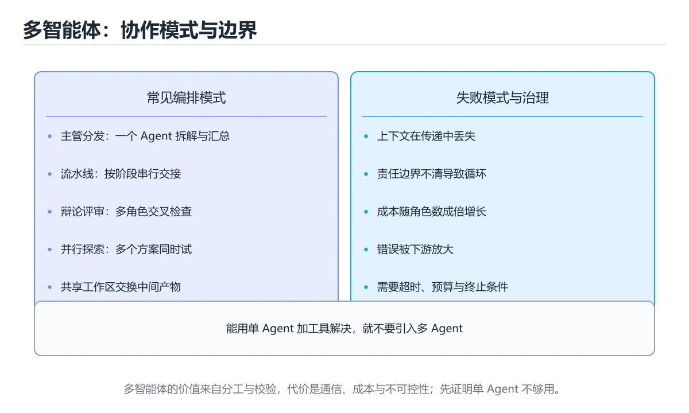
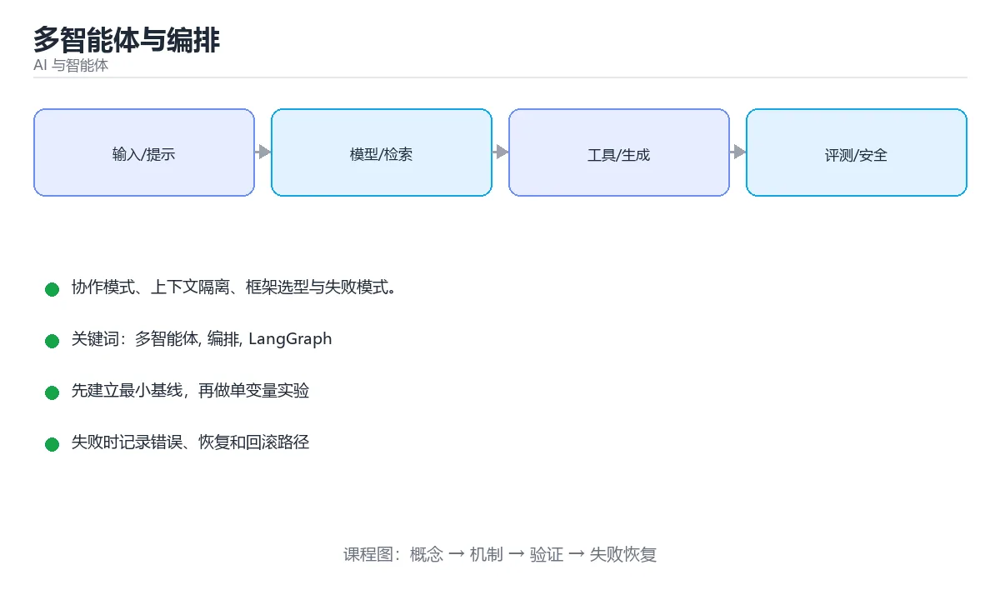

# 多智能体与编排





> 内容更新时间：2026-10-03 · 学习阶段：高级 · 预计用时：16 分钟

## 学习目标

- 能用自己的话解释「多智能体与编排」解决了什么问题，而不是只背术语。
- 能说清 「多智能体」、「编排」、「LangGraph」、「CrewAI」 之间的关系，并分别举出一个例子。
- 能把本课知识放回「AI 与智能体」的知识体系，说明它和相邻主题的边界。
- 能完成本课练习，并用验收标准检查自己的结果。

> 一句话摘要：协作模式、上下文隔离、框架选型与失败模式。

## 前置知识

- 先完成上一课《AI Agent 基础》；如果已经掌握，可以直接用本课练习自测。
- 本课阶段：高级。建议具备同一方向的完整基础，能阅读较长的代码、配置或系统设计说明。
- 开始前先复习：多智能体、编排、LangGraph。
- 如果某一步看不懂，先记录具体卡点，完成练习后再回头读一遍。


## 为什么需要多个 Agent

单 Agent 处理复杂任务时容易：上下文过载、职责混乱、一步失败全盘皆输。多智能体把任务拆开，让每个角色有明确的职责与上下文。

```text
用户目标 -> 编排者（Planner）
             ├── 检索 Agent   负责找资料
             ├── 分析 Agent   负责计算与推理
             ├── 写作 Agent   负责成文
             └── 评审 Agent   负责检查与打分
           -> 汇总输出
```

## 常见协作模式

| 模式 | 结构 | 适用 |
| --- | --- | --- |
| 编排者-工作者 | 一个主 Agent 分派子任务 | 任务可分解、需要汇总 |
| 路由 | 先判断类型再交给专精 Agent | 客服分流、多领域问答 |
| 流水线 / DAG | 固定顺序或依赖图 | 流程稳定的生产任务 |
| 辩论 / 评审 | 多个 Agent 互相质疑 | 提升准确率、降低偏见 |
| 群聊 | 共享消息池自由发言 | 探索性任务，成本高 |

## 上下文隔离是关键

```text
推荐：每个子 Agent 只拿到自己需要的上下文与工具
避免：把完整对话历史与全部工具塞给每个 Agent
```

上下文隔离带来三个好处：token 成本可控、注意力不被干扰、权限最小化。

## 常见框架

| 框架 | 特点 |
| --- | --- |
| LangGraph | 以图/状态机方式编排，可控性强 |
| CrewAI | 角色与任务抽象直观，上手快 |
| AutoGen / AG2 | 多 Agent 对话式协作 |
| OpenAI Agents SDK | 工具、交接（handoff）、护栏一体化 |
| Claude Agent SDK | 专注工具使用与代码执行场景 |

选型建议：先用**单 Agent + 好工具**，确实遇到瓶颈再引入多智能体，否则复杂度会失控。

## 失败模式

1. **无限循环**：Agent 之间互相转发任务，必须限制轮数与总预算。
2. **责任扩散**：没人负责最终结果，需要明确的汇总者与验收标准。
3. **信息衰减**：多轮转述后关键信息丢失，应传递结构化数据而非自然语言长文。
4. **成本爆炸**：N 个 Agent × M 轮调用，token 消耗指数增长。
5. **错误放大**：一个 Agent 的错误被后续 Agent 当成事实，需要评审与交叉验证。

## 设计建议

- 优先用代码做确定性流程控制，把 LLM 用在真正需要判断的节点。
- 每个 Agent 输出结构化结果（JSON），便于校验与传递。
- 引入评审 Agent 或规则校验，关键结论要能溯源。
- 全程 trace，记录每个 Agent 的输入、输出、耗时与成本。
- 生产环境加人工确认点，尤其是写操作与对外发送。

## 编排器-工作者：状态传递设计

推荐的状态结构（用结构化字段，不要拼接长文本）：

| 字段 | 含义 |
| --- | --- |
| question | 用户目标，全程只读 |
| plan | 编排者拆解出的子任务列表（2~5 条） |
| findings | 子任务到「结论摘要」的映射，只存要点 |
| answer | 最终汇总结果，由唯一的汇总者写入 |
| steps | 已执行步数，每步自增并检查上限 |

流程要点：编排者只做两件事——拆解与汇总；每个子 Agent 拿到独立上下文与自己需要的工具；子任务返回结果后**先摘要再入 findings**，避免把长过程反复往下传；每步都累计 steps，超过上限（如 8）就以「部分结论」收口。

四条实践规则：状态字段结构化、上下文按需隔离、执行步数有上限、汇总者唯一（明确谁对最终结果负责）。

## 什么时候不要用多智能体

1. 一次提示加一个好工具就能解决。
2. 对延迟敏感（多 Agent 会成倍增加往返次数）。
3. 还没有 trace 与评测能力（多 Agent 出问题极难定位）。
4. 预算固定且敏感（N 个 Agent × M 轮的 token 是乘法级增长）。

判断标准始终是：**单 Agent 加好工具之后，是否真的遇到了无法逾越的瓶颈**。

## 本课小结
多智能体的价值在于**分工与隔离上下文**，代价是复杂度与成本。判断标准只有一个：单 Agent 是否真的做不到。


## 拓扑模式对照

| 模式 | 结构 | 优点 | 缺点 |
| --- | --- | --- | --- |
| 单 Agent | 一个循环 + 工具 | 简单可控、成本低 | 复杂任务容易失控 |
| 主管（Supervisor） | 一个协调者分派 | 流程清晰、易观测 | 主管成瓶颈 |
| 流水线（Pipeline） | 固定阶段串联 | 可预测、易测试 | 不够灵活 |
| 辩论（Debate） | 多角色互评 | 提升推理质量 | 成本高、可能不收敛 |
| 群体（Swarm） | 动态交接 | 灵活 | 难以调试与限流 |
| 层级（Hierarchical） | 多层主管 | 支持超大任务 | 状态传递复杂 |

经验法则：**先尝试单 Agent + 好工具；只有当职责确实可分离、且并行能带来明显收益时才引入多智能体。**

## 角色分工速查

| 角色 | 职责 | 输出 |
| --- | --- | --- |
| 规划者 | 拆解任务与顺序 | 步骤清单 |
| 执行者 | 调用工具完成任务 | 结果与证据 |
| 评审者 | 检查正确性与完整性 | 通过或修改意见 |
| 汇总者 | 整合结果与格式化 | 最终答复 |
| 守卫者 | 检查安全与合规 | 拦截或放行 |

```python
from dataclasses import dataclass, field
from enum import Enum

class Status(Enum):
    OK = "ok"
    NEEDS_FIX = "needs_fix"
    BLOCKED = "blocked"

@dataclass
class Handoff:
    """Agent 之间的结构化交接：只传结论与证据，不传完整对话。"""

    task: str
    summary: str
    artifacts: dict
    open_questions: list = field(default_factory=list)
    step: int = 0


@dataclass
class Orchestrator:
    """主管模式：限制最大步数、防止循环、汇总成本。"""

    max_steps: int = 8
    steps: int = 0
    history: list = field(default_factory=list)

    def can_continue(self) -> bool:
        return self.steps < self.max_steps

    def dispatch(self, handoff: Handoff, worker) -> Handoff:
        if not self.can_continue():
            raise RuntimeError("超过最大步数，交由人工处理")
        self.steps += 1
        result = worker(handoff)
        self.history.append({"task": handoff.task, "status": result.artifacts.get("status")})
        return result

    def detect_loop(self, window: int = 3) -> bool:
        """连续多次相同任务视为循环，需要打断。"""
        if len(self.history) < window:
            return False
        recent = [item["task"] for item in self.history[-window:]]
        return len(set(recent)) == 1


def planner(handoff: Handoff) -> Handoff:
    return Handoff(
        task="规划",
        summary="拆成三步：检索、计算、汇总",
        artifacts={"status": Status.OK.value, "plan": ["检索", "计算", "汇总"]},
    )


orch = Orchestrator()
print(orch.dispatch(Handoff("分析销售数据", "", {}), planner).artifacts["plan"])
print(orch.detect_loop())
```

## 通信与状态速查

| 问题 | 做法 |
| --- | --- |
| 上下文膨胀 | 只传摘要与结构化结果 |
| 任务重复 | 用任务 ID 去重，记录已完成步骤 |
| 无限循环 | 最大步数 + 相同动作检测 + 超时 |
| 责任不清 | 每个角色有明确输入输出契约 |
| 结果冲突 | 设裁决规则（评审优先或投票） |
| 成本失控 | 每步记录 Token 与耗时，设总预算 |
| 可观测性 | 记录每次交接的输入、输出与决策 |
| 失败恢复 | 保存中间产物，支持从某步重跑 |

## 常见错误对照表

| 容易踩的做法 | 实际现象 | 原因与正确做法 |
| --- | --- | --- |
| 一上来就上多智能体 | 复杂度高、效果不如单 Agent | 先用单 Agent + 好工具验证 |
| Agent 之间传完整对话 | 上下文爆炸、成本翻倍 | 传摘要与结构化产物 |
| 没有步数上限 | 无限循环烧钱 | 设最大步数与总预算 |
| 角色职责重叠 | 相互推诿或重复劳动 | 明确输入输出契约 |
| 无裁决机制 | 意见冲突无法收敛 | 设评审优先或投票规则 |
| 不做中间产物持久化 | 失败后全部重跑 | 保存每步产物与状态 |
| 不记录交接轨迹 | 出问题无法定位 | 记录每次交接的决策依据 |
| 依赖单一模型 | 单点故障 | 关键角色支持模型降级切换 |
| 让 Agent 直接改生产数据 | 事故风险 | 写操作必须人工确认或灰度 |
| 忽略并行收益评估 | 成本翻倍但没提速 | 先测串行与并行的实际差异 |

## 自测清单

- [ ] 能说明何时才需要多智能体（职责可分离 + 并行有收益）。
- [ ] Agent 之间只传摘要与结构化结果。
- [ ] 有最大步数、循环检测与总预算限制。
- [ ] 每个角色有明确输入输出契约与裁决规则。
- [ ] 交接轨迹与中间产物可持久化、可重跑。

## 动手练习


> 本课练习重点：围绕「多智能体、编排、LangGraph」完成复述、实验和交付，每个结果都要能被别人检查。

先写评测样例，再改一个提示、模型或数据变量，最后比较质量、成本与安全。

### 练习 1：建立心智模型（10 分钟）

合上教程，用 3～5 句话回答：

1. 「多智能体与编排」解决了什么问题？
2. 如果没有它，会出现什么具体后果？
3. 它和「编排」是什么关系？

**验收标准**：至少出现一个本课关键词，并写出一个反例、边界条件或失效场景。

### 练习 2：做一次可控实验（20 分钟）

从正文中选一个最小示例，完成以下操作：

1. 先预测修改一个参数、输入或步骤后的结果。
2. 再实际执行或逐步推演，记录真实结果。
3. 如果结果与预测不同，写出差异原因。

**验收标准**：留下「原例 → 改动 → 预测 → 结果 → 原因」五步记录。

### 练习 3：交付一个小结果（30 分钟）

构造 5 条小型离线样例，写清输入、期望输出、评分标准和失败案例。

任务要求：

- 结果必须能被别人检查，不能只写“我已经理解了”。
- 至少覆盖「多智能体」和「编排」两个关键词。
- 写出 1 个仍然不确定的问题，以及下一步如何验证。

> 提示：时间有限时优先做练习 1 和练习 2；练习 3 可以拆成两次完成。


## 考点精讲：把测验题还原成判断过程

本课有 6 个判断点。先自己作答，再看「判断依据」；如果结论正确但理由不完整，回到正文对应章节补足概念。

### 考点 1：多智能体相比单 Agent 的最大收益是？

- **正确判断**：分工与上下文隔离
- **判断依据**：拆分子任务并隔离上下文能降低干扰，但会带来成本与协调复杂度。其他选项：多智能体的收益来自分工与上下文隔离。针对「多智能体相比单 Agent 的最大收益是，」，本课在「为什么需要多个 Agent」中说明：多智能体把任务拆开，让每个角色有明确的职责与上下文。本课还在「本课小结」中说明：多智能体的价值在于分工与隔离上下文，代价是复杂度与成本。本课还在「上下文隔离是关键」中说明：上下文隔离带来三个好处：token 成本可控、注意力不被干扰、权限最小化。
- **迁移检查**：如果给某个错误选项去掉一个限定词，它会不会变成正确？说明理由。

### 考点 2：防范 Agent 之间无限循环的关键手段是？

- **正确判断**：限制轮数与总预算
- **判断依据**：正确答案是「限制轮数与总预算」，本课在「失败模式」中说明：无限循环：Agent 之间互相转发任务，必须限制轮数与总预算。必须有步数、token 与费用上限，以及可中断的人机确认点。本课还在「为什么需要多个 Agent」中说明：多智能体把任务拆开，让每个角色有明确的职责与上下文。本课还在「上下文隔离是关键」中说明：上下文隔离带来三个好处：token 成本可控、注意力不被干扰、权限最小化。
- **迁移检查**：把题干里的一个条件换成边界值，原来的结论还成立吗？写出判断过程。

### 考点 3：什么时候才应该引入多智能体？

- **正确判断**：单 Agent 加好工具后确实遇到瓶颈时
- **判断依据**：先用单 Agent + 好工具，遇到真实瓶颈再拆分，否则复杂度会失控。其他选项：只有单 Agent 加好工具后确实遇到瓶颈时才引入多智能体。针对「什么时候才应该引入多智能体，」，本课在「常见框架」中说明：选型建议：先用单 Agent + 好工具，确实遇到瓶颈再引入多智能体，否则复杂度会失控。本课还在「拓扑模式对照」中说明：只有当职责确实可分离、且并行能带来明显收益时才引入多智能体。本课还在「本课小结」中说明：多智能体的价值在于分工与隔离上下文，代价是复杂度与成本。
- **迁移检查**：遮住选项，只根据定义复述一次答案，再回来看哪个选项与复述一致。

### 考点 4：Supervisor（主管）模式与其他多智能体模式的区别是？

- **正确判断**：由一个协调者负责分派任务与汇总结果
- **判断依据**：正确答案是「由一个协调者负责分派任务与汇总结果」，本课在「常见框架」中说明：选型建议：先用单 Agent + 好工具，确实遇到瓶颈再引入多智能体，否则复杂度会失控。中心化协调更容易控制流程与成本，代价是主管可能成为瓶颈。本课还在「本课小结」中说明：判断标准只有一个：单 Agent 是否真的做不到。本课还在「拓扑模式对照」中说明：只有当职责确实可分离、且并行能带来明显收益时才引入多智能体。
- **迁移检查**：遮住选项，只根据定义复述一次答案，再回来看哪个选项与复述一致。

### 考点 5：多智能体通信中上下文膨胀应如何应对？

- **正确判断**：只传递摘要与结构化结果
- **判断依据**：正确答案是「只传递摘要与结构化结果」，本课在「设计建议」中说明：每个 Agent 输出结构化结果（JSON），便于校验与传递。消息越长成本越高、噪声越多，结构化交接能显著提升稳定性。本课还在「编排器-工作者：状态传递设计」中说明：四条实践规则：状态字段结构化、上下文按需隔离、执行步数有上限、汇总者唯一（明确谁对最终结果负责）。本课还在「为什么需要多个 Agent」中说明：单 Agent 处理复杂任务时容易：上下文过载、职责混乱、一步失败全盘皆输。
- **迁移检查**：如果给某个错误选项去掉一个限定词，它会不会变成正确？说明理由。

### 考点 6：补全代码：「多智能体与编排」示例中，下面这行代码缺少哪个关键字或函数名？请填入 ____。 `print(orch.dispatch(____("分析销售数据", "", {}), planner).artifacts["plan"])`

- **正确判断**：Handoff / handoff
- **判断依据**：正确答案是「Handoff」，本课在「编排器-工作者：状态传递设计」中说明：每个子 Agent 拿到独立上下文与自己需要的工具。本课还在「为什么需要多个 Agent」中说明：单 Agent 处理复杂任务时容易：上下文过载、职责混乱、一步失败全盘皆输。本课还在「编排器-工作者：状态传递设计」中说明：四条实践规则：状态字段结构化、上下文按需隔离、执行步数有上限、汇总者唯一（明确谁对最终结果负责）。
- **迁移检查**：把答案换成另一种等价写法，是否仍然正确？说明依据。

## 本课复习清单

离开本课前，逐项确认：

- [ ] 不看解析，能说出「多智能体相比单 Agent 的最大收益是？」的判断依据。
- [ ] 不看解析，能说出「防范 Agent 之间无限循环的关键手段是？」的判断依据。
- [ ] 不看解析，能说出「什么时候才应该引入多智能体？」的判断依据。
- [ ] 不看解析，能说出「Supervisor（主管）模式与其他多智能体模式的区别是？」的判断依据。
- [ ] 不看解析，能说出「多智能体通信中上下文膨胀应如何应对？」的判断依据。
- [ ] 不看解析，能说出「补全代码：「多智能体与编排」示例中，下面这行代码缺少哪个关键字或函数名？请填入 …」的判断依据。
- [ ] 至少运行一次本课示例，记录输入、输出和一个边界情况。
- [ ] 把本课最容易混淆的两个概念写成一句话对照。

| 复盘项 | 记录 |
| --- | --- |
| 已经能独立解释的考点 |  |
| 仍然说不清的概念 |  |
| 下一步验证动作 |  |

## 术语速查

把本课反复出现的术语集中放在一起。复习时先遮住右列，尝试用自己的话解释，再回到正文核对。

| 术语 | 本课语境 |
| --- | --- |
| `多智能体` | 本课围绕该主题展开，结合正文与代码示例理解它的适用边界。 |
| `编排` | 本课围绕该主题展开，结合正文与代码示例理解它的适用边界。 |
| `LangGraph` | 本课围绕该主题展开，结合正文与代码示例理解它的适用边界。 |
| `CrewAI` | 本课围绕该主题展开，结合正文与代码示例理解它的适用边界。 |
| `上下文隔离` | 本课围绕该主题展开，结合正文与代码示例理解它的适用边界。 |

## 面试问答与自测

下面把本课考点换成面试追问。先口述自己的答案，
再对照参考回答检查是否遗漏了前提、边界或失败路径。

### 追问 1：多智能体相比单 Agent 的最大收益是？

**参考回答**：拆分子任务并隔离上下文能降低干扰，但会带来成本与协调复杂度。其他选项：多智能体的收益来自分工与上下文隔离。针对「多智能体相比单 Agent 的最大收益是，」，本课在「为什么需要多个 Agent」中说明：多智能体把任务拆开，让每个角色有明确的职责与上下文。本课还在「本课小结」中说明：多智能体的价值在于分工与隔离上下文，代价是复杂度与成本。本课还在「上下文隔离是关键」中说明：上下文隔离带来三个好处：token 成本可控、注意力不被干扰、权限最小化。

### 追问 2：防范 Agent 之间无限循环的关键手段是？

**参考回答**：正确答案是「限制轮数与总预算」，本课在「失败模式」中说明：无限循环：Agent 之间互相转发任务，必须限制轮数与总预算。必须有步数、token 与费用上限，以及可中断的人机确认点。本课还在「为什么需要多个 Agent」中说明：多智能体把任务拆开，让每个角色有明确的职责与上下文。本课还在「上下文隔离是关键」中说明：上下文隔离带来三个好处：token 成本可控、注意力不被干扰、权限最小化。

### 追问 3：什么时候才应该引入多智能体？

**参考回答**：先用单 Agent + 好工具，遇到真实瓶颈再拆分，否则复杂度会失控。其他选项：只有单 Agent 加好工具后确实遇到瓶颈时才引入多智能体。针对「什么时候才应该引入多智能体，」，本课在「常见框架」中说明：选型建议：先用单 Agent + 好工具，确实遇到瓶颈再引入多智能体，否则复杂度会失控。本课还在「拓扑模式对照」中说明：只有当职责确实可分离、且并行能带来明显收益时才引入多智能体。本课还在「本课小结」中说明：多智能体的价值在于分工与隔离上下文，代价是复杂度与成本。

### 追问 4：Supervisor（主管）模式与其他多智能体模式的区别是？

**参考回答**：正确答案是「由一个协调者负责分派任务与汇总结果」，本课在「常见框架」中说明：选型建议：先用单 Agent + 好工具，确实遇到瓶颈再引入多智能体，否则复杂度会失控。中心化协调更容易控制流程与成本，代价是主管可能成为瓶颈。本课还在「本课小结」中说明：判断标准只有一个：单 Agent 是否真的做不到。本课还在「拓扑模式对照」中说明：只有当职责确实可分离、且并行能带来明显收益时才引入多智能体。

### 追问 5：多智能体通信中上下文膨胀应如何应对？

**参考回答**：正确答案是「只传递摘要与结构化结果」，本课在「设计建议」中说明：每个 Agent 输出结构化结果（JSON），便于校验与传递。消息越长成本越高、噪声越多，结构化交接能显著提升稳定性。本课还在「编排器-工作者·状态传递设计」中说明：四条实践规则：状态字段结构化、上下文按需隔离、执行步数有上限、汇总者唯一（明确谁对最终结果负责）。本课还在「为什么需要多个 Agent」中说明：单 Agent 处理复杂任务时容易：上下文过载、职责混乱、一步失败全盘皆输。

## English Overview

**Title:** Multi-Agent Systems

**Summary:** Patterns, context isolation, frameworks and pitfalls.

**Category:** AI & Agents  
**Level:** 高级  
**Key terms:** 多智能体, 编排, LangGraph, CrewAI, 上下文隔离

> The full tutorial is written in Chinese. This bilingual overview helps English readers identify the topic, scope and key terms before studying the detailed examples.

## 内容元数据

- 内容版本：v2.0
- 最后更新：2026-10-03
- 学习阶段：高级
- 适用环境：主流大模型 API、开源模型与向量数据库
- 内容来源：内置结构化课程与工程实践整理
- 相关主题：多智能体、编排、LangGraph、CrewAI、上下文隔离
- 质量版本：P0 测验标准 + P1 覆盖扩展 + P2 体验补全


## 参考资料与复核

- 最后复核：2026-10-04
- 下次复核：2027-04-04
- 复核范围：版本兼容、API 行为、安全建议与工程实践
- 来源性质：官方文档与标准；本课正文为离线教学重组，不复制原文

| 参考资料 | 本课用途 |
| --- | --- |
| [OpenAI Docs](https://platform.openai.com/docs/) | 模型 API、工具与评估 |
| [Hugging Face Docs](https://huggingface.co/docs) | 模型、数据集与推理 |
| [Model Context Protocol](https://modelcontextprotocol.io/) | Agent 工具与上下文协议 |

> 本课主题：协作模式、上下文隔离、框架选型与失败模式。

> App 完全离线展示文字链接，不会自动联网；需要延伸阅读时可复制链接到浏览器。
