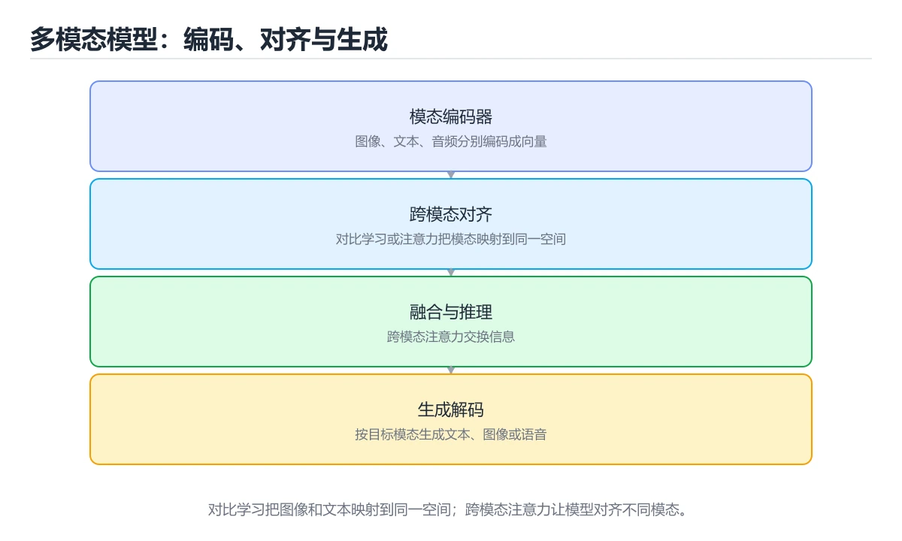
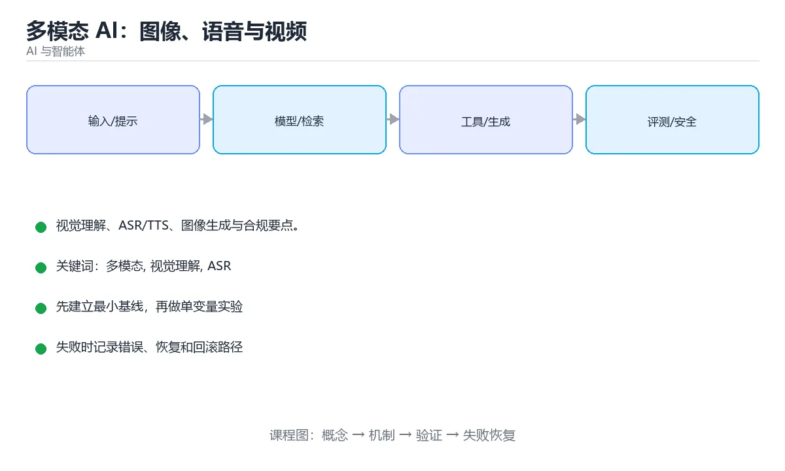

# 多模态 AI：图像、语音与视频

> 内容更新时间：2026-10-06





## 学习目标

- 能用自己的话解释多模态 AI：图像、语音与视频解决了什么问题，而不是只背术语。
- 能说清 「多模态」、「视觉理解」、「ASR」、「TTS」 之间的关系，并分别举出一个例子。
- 能把本课知识放回「AI 与智能体」的知识体系，说明它和相邻主题的边界。
- 能完成本课练习，并用验收标准检查自己的结果。

> 一句话摘要：视觉理解、ASR/TTS、图像生成与合规要点。

## 前置知识

- 先完成上一课《模型微调与本地部署》；如果已经掌握，可以直接用本课练习自测。
- 本课阶段：进阶。建议先掌握同一分类的基础课程，并能独立运行正文中的最小示例。
- 开始前先复习：多模态、视觉理解、ASR。
- 如果某一步看不懂，先记录具体卡点，完成练习后再回头读一遍。

## 什么是多模态

模型能同时理解或生成多种模态（文本、图像、音频、视频）。常见形态：

| 能力 | 说明 | 典型应用 |
| --- | --- | --- |
| 视觉理解 | 读图、OCR、图表问答 | 票据识别、质检、无障碍 |
| 图像生成 | 文生图、图生图、局部重绘 | 设计素材、电商图 |
| 语音识别 ASR | 语音转文字 | 会议纪要、字幕 |
| 语音合成 TTS | 文字转语音 | 有声书、语音助手 |
| 视频理解 / 生成 | 视频问答、文生视频 | 内容审核、短视频创作 |

## 视觉理解调用示例

```python
from openai import OpenAI
client = OpenAI()
response = client.chat.completions.create(
    model="gpt-4o-mini",
    messages=[{
        "role": "user",
        "content": [
            {"type": "text", "text": "这张票据的金额和日期分别是多少？只输出 JSON。"},
            {"type": "image_url", "image_url": {"url": "https://example.com/receipt.jpg"}},
        ],
    }],
)
print(response.choices[0].message.content)
```

工程要点：

1. 图片先压缩与裁剪到模型推荐分辨率，能显著降成本。
2. 要求结构化输出（JSON），便于程序解析与校验。
3. 关键字段（金额、证件号）必须做二次规则校验，不能只信模型。
4. 大批量任务用批处理接口，单价通常更低。

## 语音：识别与合成

```python
# 语音转文字
with open("meeting.mp3", "rb") as audio:
    transcript = client.audio.transcriptions.create(
        model="whisper-1", file=audio, language="zh")

# 文字转语音
with client.audio.speech.with_streaming_response.create(
        model="tts-1", voice="alloy", input="你好，欢迎使用语音助手") as resp:
    resp.stream_to_file("reply.mp3")
```

长音频要分段（按静音切分）并处理说话人分离（diarization）；实时对话还需处理打断（barge-in）。

## 图像生成的工作流

```text
提示词（主体 + 风格 + 构图 + 光照 + 镜头）
  -> 生成多张候选
  -> 人工或模型筛选
  -> 局部重绘（inpainting）修细节
  -> 放大（upscale）后交付
```

提示词越具体越可控：`一只柯基犬，坐在草地上，柔和阳光，浅景深，35mm 镜头，正面视角`。

## 成本与合规

- 图像与视频的 token / 计费单位与文本不同，先估算再放量。
- 生成内容需加水印或标识，遵守平台与法律要求（深度合成规定）。
- 人脸、证件、医疗影像等敏感数据，优先本地部署或脱敏处理。
- 保留生成记录，便于追溯与版权说明。

## 各模态的选型与成本对照

| 任务 | 方案选择 | 成本要点 |
| --- | --- | --- |
| 票据/证件识别 | 专用 OCR + 规则校验，必要时再上视觉模型兜底 | 专用 OCR 单价远低于通用视觉模型 |
| 图表问答 | 多模态模型（需理解结构与趋势） | 图片分辨率直接影响 token 数 |
| 图像生成 | 按质量/速度选模型（草稿用快模型，交付用高质量） | 按张计费，多张候选会成倍增加成本 |
| 语音转写 | 短音频用在线接口，长音频/隐私场景用本地模型 | 按分钟计费，分段可避免整段失败重跑 |
| 语音合成 | 预置常用短语音频 + 动态内容实时合成 | 按字符计费，回复越短越省 |
| 视频理解 | 抽帧 + 视觉模型，或专用视频模型 | 帧率与分辨率决定成本，先降采样再看效果 |

三条通用原则：**能降采样就先降采样**（图片压到模型推荐尺寸、视频抽帧）；**能规则校验就别全靠模型**（金额、证件号、日期必须二次校验）；**能本地就不上云**（敏感数据与高频调用）。

## 本课小结
多模态让 AI 从「读文字」扩展到「看、听、说、画」。落地时把重点放在**结构化输出 + 人工校验 + 成本控制**上，而不是追求模型炫技。

## 模态与任务对照

| 模态 | 输入 | 输出 | 典型任务 |
| --- | --- | --- | --- |
| 图像 | 图片 | 文本或标签 | 分类、检测、OCR、理解 |
| 语音 | 音频 | 文本或音频 | 识别、翻译、合成 |
| 视频 | 视频 | 文本或标注 | 摘要、检索、动作识别 |
| 图文混合 | 图 + 文 | 文本 | 图文问答、票据解析 |
| 文档 | PDF / 扫描件 | 结构化字段 | 抽取、问答 |

## 工程要点速查

| 场景 | 建议做法 |
| --- | --- |
| 票据与表单 | OCR 取字 + 规则校验 + 模型理解 |
| 长音频 | 分段（VAD）后识别，再按时间戳拼接 |
| 大图 | 缩放或分块，保留关键区域 |
| 表格 | 转成结构化文本或 HTML 后送入模型 |
| 多图输入 | 标注图片编号，要求按编号引用 |
| 生成内容 | 加水印或元数据标识，声明 AI 生成 |
| 隐私 | 人脸、证件等敏感信息先脱敏 |
| 成本 | 图片 Token 更高，按需降采样与裁剪 |

```python
from dataclasses import dataclass

@dataclass
class MediaSegment:
    start: float
    end: float
    text: str

    @property
    def duration(self) -> float:
        return max(0.0, self.end - self.start)

def merge_segments(segments: list, max_gap: float = 0.8, max_chars: int = 400) -> list:
    """合并过短的语音片段，减少下游调用次数。"""
    merged: list = []
    for seg in segments:
        if merged:
            last = merged[-1]
            if seg.start - last.end <= max_gap and len(last.text) + len(seg.text) <= max_chars:
                merged[-1] = MediaSegment(last.start, seg.end, f"{last.text} {seg.text}".strip())
                continue
        merged.append(seg)
    return merged

def estimate_image_tokens(width: int, height: int, patch: int = 28) -> int:
    """粗略估算图像 Token 数：按切块数量计算。"""
    return max(1, (width // patch) * (height // patch))

def needs_downscale(width: int, height: int, max_side: int = 1536) -> bool:
    """超过最长边阈值时建议降采样，兼顾质量与成本。"""
    return max(width, height) > max_side

segments = [MediaSegment(0, 1.0, "大家好"), MediaSegment(1.2, 2.5, "今天讲多模态")]
print([(s.start, s.end, s.text) for s in merge_segments(segments)])
print(estimate_image_tokens(1024, 1024), needs_downscale(4000, 3000))
```

## 质量与合规速查

| 关注点 | 做法 |
| --- | --- |
| 识别准确率 | 按字段分别统计，金额、单号单独校验 |
| 幻觉 | 关键字段要求引用原文位置 |
| 多语言 | 明确语言或自动检测，术语表统一 |
| 内容安全 | 输入输出双重审核，禁止生成违法内容 |
| 标识 | 生成内容加标识与元数据，便于追溯 |
| 版权 | 训练与生成内容注意授权范围 |
| 隐私 | 不把人脸、声纹等生物特征用于未授权用途 |

## 常见错误对照表

| 容易踩的做法 | 实际现象 | 原因与正确做法 |
| --- | --- | --- |
| 让模型直接读原始扫描件取数字 | 关键字段出错 | OCR + 规则校验 + 交叉验证 |
| 长音频整段送入 | 超上下文或截断 | VAD 分段后逐段处理并拼接 |
| 大图不降采样 | 成本高、超时 | 按需缩放或裁剪关键区域 |
| 不标注图片编号 | 回答无法对应 | 每图编号并要求引用 |
| 只信模型输出的金额 | 财务风险 | 与原始 OCR 或规则结果比对 |
| 不做输入内容审核 | 违规内容进入系统 | 前置审核与拦截 |
| 生成内容无标识 | 合规风险 | 加水印或元数据声明 AI 生成 |
| 忽略模态对齐错误 | 图文不匹配 | 校验数量与顺序一致性 |
| 不统计各模态成本 | 成本不可控 | 分别记录文本、图像、音频用量 |
| 不做人工抽检 | 长尾错误无人发现 | 定期抽样并统计字段级准确率 |

## 自测清单

- [ ] 能按模态选择合适的处理链路。
- [ ] 票据类场景使用 OCR + 规则 + 模型三重校验。
- [ ] 长音频与超大图先分段或降采样。
- [ ] 多图输入有编号与引用约束。
- [ ] 生成内容有标识，敏感信息先脱敏。

## 动手练习

### 练习 1：概念复述（10 分钟）

合上教程，用 3～5 句话解释多模态 AI：图像、语音与视频解决什么问题，并写出一个边界条件。

**验收标准**：至少使用一个本课关键词，并给出一个反例。

### 练习 2：示例改写（20 分钟）

从正文选一个最小示例，先预测修改一个输入后的结果，再实际验证并记录差异。

**验收标准**：留下「原例 → 改动 → 预测 → 结果 → 原因」五步记录。

### 练习 3：迁移任务（30 分钟）

构造 5 条小型离线样例，写清输入、期望输出、评分标准和失败案例。

- 至少覆盖「多模态」和「视觉理解」两个关键词。
- 产出一个别人可以检查的结果。
- 写出一个仍不确定的问题和验证方法。

## 可运行练习

### 任务 1：先跑通，再解释

```python
from openai import OpenAI
client = OpenAI()
response = client.chat.completions.create(
    model="gpt-4o-mini",
    messages=[{
        "role": "user",
        "content": [
            {"type": "text", "text": "这张票据的金额和日期分别是多少？只输出 JSON。"},
            {"type": "image_url", "image_url": {"url": "https://example.com/receipt.jpg"}},
        ],
    }],
)
print(response.choices[0].message.content)
```

### 任务 2：只改一个条件

把「多模态 AI：图像、语音与视频」的最小示例复制一份，只改一个条件再跑一次：

- 改动点：只把多模态的输入换成空值、极值或错误输入，其余保持不变。
- 预测：先写下「多模态 AI：图像、语音与视频」在改动后的输出或错误信息，再运行。
- 记录：对照改动前后的结果，指出差异出在哪一步。
- 验收：换回原条件能复现原结果，改动只影响多模态。

### 任务 3：迁移到自己的数据

用同一套思路处理一组你自己的数据或场景，保持输出格式与任务 1 一致。

## 故障现场

### 现场 1：本课的 多模态 常规用例通过，但边界用例失败

**症状**：在本课的练习或生产场景里出现“本课的 多模态 常规用例通过，但边界用例失败”。

**复现**：准备一组最小输入，只保留触发“本课的 多模态 常规用例通过，但边界用例失败”的必要条件，连续运行两次确认结果稳定。

**定位**：围绕“多模态 的前置条件与取值边界没有写进代码，默认值掩盖了空值和极值”检查调用链、输入数据和环境配置，先验证假设再改代码。

**预防**：把“本课的 多模态 常规用例通过，但边界用例失败”写成一条自动化用例，并在本课的验收清单里保留对应检查项。

### 现场 2：本课的 视觉理解 结果在两次运行之间不一致

**症状**：在本课的练习或生产场景里出现“本课的 视觉理解 结果在两次运行之间不一致”。

**复现**：准备一组最小输入，只保留触发“本课的 视觉理解 结果在两次运行之间不一致”的必要条件，连续运行两次确认结果稳定。

**定位**：围绕“视觉理解 依赖了当前版本、执行顺序或共享状态，单次运行无法暴露差异”检查调用链、输入数据和环境配置，先验证假设再改代码。

**预防**：把“本课的 视觉理解 结果在两次运行之间不一致”写成一条自动化用例，并在本课的验收清单里保留对应检查项。

### 现场 3：离线评测分数很高，线上仍然频繁给出错误答案

**定位**：围绕“评测集与真实输入分布不一致，多模态 的提示词或检索结果没有覆盖失败场景”检查调用链、输入数据和环境配置，先验证假设再改代码。

## 深入补充：多模态 AI：图像、语音与视频 的取舍与边界

### 一、把概念放回真实约束

学习多模态 AI：图像、语音与视频时，最容易只记住结论而忽略前提。先写出三个约束：数据规模、时间预算、可接受的失败方式；再判断 多模态 与 视觉理解 在这些约束下是否仍然成立。只要约束改变，原来的最优解就可能变成错误解。

| 维度 | 要回答的问题 | 常见做法 | 失败信号 |
| --- | --- | --- | --- |
| 数据 | 多模态 的训练或检索数据从哪来、质量如何 | 清洗、去重、标注与版本化 | 评测集泄漏或分布漂移 |
| 模型 | 视觉理解 的能力边界与成本是多少 | 基线对比、离线评测、灰度发布 | 指标好看但线上任务失败 |
| 评测 | 如何证明改动真的有效 | 固定评测集、人工抽检、A/B | 只比较单例输出 |
| 安全 | 失败时会不会泄露或越权 | 权限校验、内容过滤、审计 | 提示注入或数据外泄 |

### 二、三个容易混淆的边界

1. 澄清输入与目标。先写清「多模态 AI：图像、语音与视频」要解决的问题、合法输入范围和成功标准，再进入后续步骤。
2. **把“平均值”当成“全部”**：多模态 的指标好看，不代表尾部请求、冷启动或失败重试也好看。
3. **把“当前版本”当成“永久行为”**：视觉理解 依赖的默认值、API 或性能特征都可能随版本变化，需要固定版本并保留回归用例。

### 三、一个生产场景

假设团队要在真实系统里使用多模态 AI：图像、语音与视频：第一周先做小流量验证，记录 多模态 的基线与异常；第二周扩大输入规模，观察 视觉理解 是否成为瓶颈；第三周再做故障演练，主动注入超时、重复请求和依赖不可用，确认系统能降级、能重试、能恢复。每一步都要留下指标、日志和结论，而不是只留下“感觉更快了”。

### 四、自测清单

- 能否用一句话说出多模态 AI：图像、语音与视频解决的核心问题与不适用场景？
- 能否画出 多模态 的数据流或状态变化，并标出失败路径？
- 能否给出一个反例，证明某个看似合理的结论在边界条件下不成立？
- 能否写出一条可复现的验证命令，让别人独立得到相同结论？

### 五、AI 工程补充

在多模态 AI：图像、语音与视频里，模型输出只是系统的一部分：输入要先经过权限与数据质量检查，检索或工具调用要有超时和降级，输出要经过引用核验或规则校验，最后记录 token、延迟、失败类型和人工反馈。评测时至少准备固定题、边界题和对抗题，并把 多模态 与 视觉理解 的指标分开记录；否则一次提示词改动看似提升体验，实际可能只是评测样本泄漏或随机波动。

## 本课复习清单

离开本课前，逐项确认：

- [ ] 不看解析，能说出「用模型识别票据信息，工程上最稳妥的是？」的判断依据。
- [ ] 不看解析，能说出「处理长音频通常需要？」的判断依据。
- [ ] 不看解析，能说出「关于 AI 生成内容，正确做法是？」的判断依据。
- [ ] 不看解析，能说出「OCR 与视觉语言模型（VLM）在票据处理中的分工是？」的判断依据。
- [ ] 不看解析，能说出「多模态 RAG 中图片如何参与检索？」的判断依据。
- [ ] 不看解析，能说出的判断依据。
- [ ] 至少运行一次本课示例，记录输入、输出和一个边界情况。
- [ ] 把本课最容易混淆的两个概念写成一句话对照。

| 复盘项 | 记录 |
| --- | --- |
| 已经能独立解释的考点 |  |
| 仍然说不清的概念 |  |
| 下一步验证动作 |  |

## 术语速查

| 术语 | 本课语境 |
| --- | --- |
| `一只柯基犬，坐在草地上，柔和阳光，浅景深，35mm 镜头，正面视角` | 提示词越具体越可控：`一只柯基犬，坐在草地上，柔和阳光，浅景深，35mm 镜头，正面视角`。 |
| `多模态` | 围绕“评测集与真实输入分布不一致，多模态 的提示词或检索结果没有覆盖失败场景”检查调用链、输入数据和环境配置，先验证假设再改代码。 |
| `视觉理解` | 围绕“视觉理解 依赖了当前版本、执行顺序或共享状态，单次运行无法暴露差异”检查调用链、输入数据和环境配置，先验证假设再改代码。 |
| `ASR` | 它在「多模态 AI：图像、语音与视频」里是理解「ASR」的关键术语，用来解释定义、适用条件与失败路径；它与多模态、视觉理解共同决定这一节的判断边界。复习时回到正文示例核对输入、输出和验证方式。 |
| `TTS` | 它在「多模态 AI：图像、语音与视频」里是理解「TTS」的关键术语，用来解释定义、适用条件与失败路径；它与多模态、视觉理解共同决定这一节的判断边界。复习时回到正文示例核对输入、输出和验证方式。 |
| `图像生成` | 它在「多模态 AI：图像、语音与视频」里是理解「图像生成」的关键术语，用来解释定义、适用条件与失败路径；它与多模态、视觉理解共同决定这一节的判断边界。复习时回到正文示例核对输入、输出和验证方式。 |

## 考点精讲

### 考点 1：概念判断·多模态

- **题目**：用模型识别票据信息，工程上最稳妥的是？
- **判断依据**：结构化输出便于解析，关键字段仍需二次校验。作答时，先用多模态建立输入与输出的基线，再把压缩图片代入边界条件核对，结论才能复现。回到「多模态 AI：图像、语音与视频」的正文示例，用“用模型识别票据信息”走一遍多模态、视觉理解、ASR的完整流程，能复现的结论才可以保留。

### 考点 2：多选辨析·多模态

- **题目**：围绕“多模态 AI：图像、语音与视频”中的 多模态、视觉理解、ASR，下列哪两项是本课强调的实践判断？
- **判断依据**：本课把多模态 AI：图像、语音与视频拆成概念、示例与故障现场三部分，因此判断 多模态 时必须同时交代输入、输出和失败路径，这使“学习 多模态 时要同时说明输入、输出和失败路径，不能只看正常流程”成立。在多模态 AI：图像、语音与视频里，判断 视觉理解 时要固定版本与边界输入，所以“验证 视觉理解 时要固定版本并覆盖边界输入，结论才可复现”才可复现。

### 考点 3：概念判断·多模态

- **题目**：关于 AI 生成内容，正确做法是？
- **判断依据**：在「多模态 AI：图像、语音与视频」里，其他选项：生成内容应按法规加标识或水印并保留生成记录。在「多模态 AI：图像、语音与视频」里，如果只凭关键词作答，很容易把「无需标识」、「删除日志」与「按法规加标识或水印并保留生成记录」混在一起；「多模态 AI：图像、语音与视频」要求先交代多模态、视觉理解、ASR的前提再下结论，所以“按法规加标识或水印并保留生成记录”只在题干“AI 生成内容”给定的条件下成立。

### 考点 4：概念判断·多模态

- **题目**：OCR 与视觉语言模型（VLM）在票据处理中的分工是？
- **判断依据**：金额、单号等关键字段仍建议用 OCR + 规则校验兜底，保证数值准确。在「多模态 AI：图像、语音与视频」里，其他选项：OCR 负责精确提取文字，两者互补而非等价。在「多模态 AI：图像、语音与视频」里，这道题要求区分概念与边界，「OCR 负责精确提取文字」只有在题干给出的前提下才成立，而「两者功能完全相同」、「VLM 只能识别纯文本」缺少同一组条件。

### 考点 5：代码补全·多模态

- **题目**：这段 Python 代码是「多模态 AI：图像、语音与视频」的示例片段，下面哪一项描述与它一致？
- **判断依据**：在「多模态 AI：图像、语音与视频」里，这段代码只做静态声明，没有循环、分支或可观察输出。这段代码出自「多模态 AI：图像、语音与视频」的正文示例，围绕多模态、视觉理解、ASR展开；把输入或边界换成空值、极值或失败情况后，结论要以「多模态 AI：图像、语音与视频」的实际运行结果为准。

### 考点 6：填空·client = ____

- **题目**：补全代码：「多模态 AI：图像、语音与视频」示例中，下面这行代码缺少哪个关键字或函数名？请填入 ____。 `client = ____`
- **判断依据**：在「多模态 AI：图像、语音与视频」里，OpenAI。这道题的关键在「多模态 AI：图像、语音与视频」的多模态、视觉理解、ASR：先确认题干“补全代码”问的是哪一步，再排除偷换前提的选项。回到多模态、视觉理解、ASR本身再看一遍：只有“OpenAI”与题干“语音与视频示例中”的前提一致，结论才成立。

## English Overview

**Title:** Multimodal AI

**Summary:** Vision, speech and image generation.

**Category:** AI & Agents
**Level:** 进阶
**Key terms:** 多模态, 视觉理解, ASR, TTS, 图像生成

## 内容元数据

- 内容版本：v2.0
- 最后更新：2026-10-06
- 学习阶段：进阶
- 适用环境：主流大模型 API、开源模型与向量数据库
- 内容来源：内置结构化课程与工程实践整理
- 相关主题：多模态、视觉理解、ASR、TTS、图像生成
- 质量版本：P0 测验标准 + P1 覆盖扩展 + P2 体验补全

## 参考资料与复核

- 最后复核：2026-10-04
- 下次复核：2027-04-04
- 复核范围：版本兼容、API 行为、安全建议与工程实践
- 来源性质：官方文档、标准或权威教材；正文为离线教学重组

| 参考资料 | 本课用途 |
| --- | --- |
| [Google AI 文档](https://ai.google.dev/gemini-api/docs) | Gemini API 与多模态 |
| [Anthropic 文档](https://docs.anthropic.com/) | Claude API 与 Agent 安全 |
| [OpenAI 开发者文档](https://platform.openai.com/docs/) | 模型 API、工具与评估 |

> 「多模态 AI：图像、语音与视频」的链接用于离线阅读后的延伸核对；App 不会自动联网。
