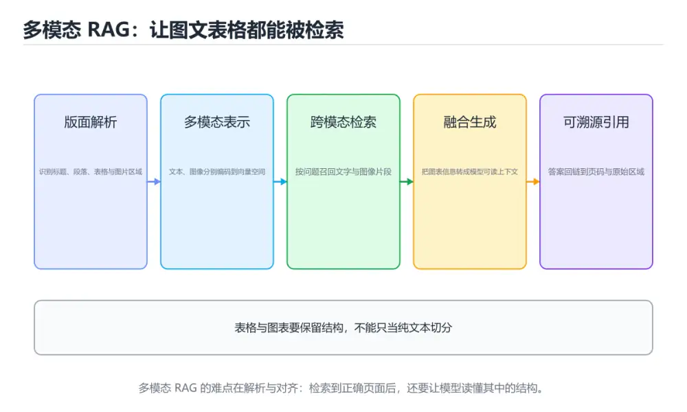
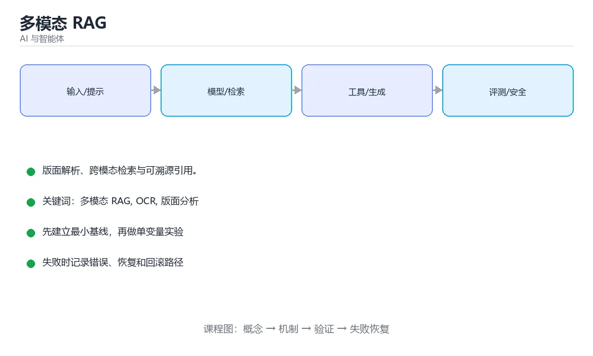

# 多模态 RAG

> 内容更新时间：2026-10-06 · 学习阶段：进阶 · 预计用时：35 分钟





## 本节知识框架

**课程定位**：所属分类为「AI 与智能体」，课程主题为「多模态 RAG」，学习阶段为「进阶」，建议用时 35 分钟。

**本课要解决的主问题**：版面解析、跨模态检索与可溯源引用。

| 学习层次 | 要回答的问题 | 完成判据 |
| --- | --- | --- |
| 概念层 | 「多模态 RAG」有哪些必须区分的对象与术语？ | 能用自己的话定义核心术语，并各举一个正例和一个反例。 |
| 机制层 | 这些对象按什么顺序发生作用，输入如何变成输出？ | 能画出或写出机制步骤，并说明每一步的失败条件。 |
| 应用层 | 什么场景适合使用「多模态 RAG」，什么场景不适合？ | 能给出一个真实场景、一个最小示例和一个边界案例。 |
| 性能层 | 时间、空间、吞吐或延迟受哪些量影响？ | 能说出复杂度或性能瓶颈的证据来源；没有证据时明确写“材料未提供”。 |
| 复习层 | 怎样确认自己不是只记住了结论？ | 能独立完成本课自测，并把错误定位到概念、机制、示例或边界。 |

### 阅读路线

1. 先读「核心概念定义」，建立「多模态 RAG」等对象的精确定义。
2. 再读「原理与运行机制」，把定义串成可重复的过程。
3. 用「代码/协议/SQL 示例」验证过程，并只改一个条件观察结果变化。
4. 最后检查性能、易错点、知识关系与自测题，形成可复习的证据链。

**前置知识**：没有硬性先修课；仍建议先具备本分类的基础阅读与操作能力。

**学习位置**：本课位于《Agent 评测实战》之后；如果前一课的自测不能通过，应先回补再继续。

**后续衔接**：下一课《模型评测与选型》会继续使用本课术语，学完后建议立即完成一次自测。

**教材衔接：学习目标**

- 能用自己的话解释多模态 RAG解决了什么问题，而不是只背术语。
- 能说清 多模态 RAG、「OCR」、「版面分析」、「重排序」 之间的关系，并分别举出一个例子。
- 能把 多模态 RAG 放回「多模态 RAG」的知识体系，说明它和 OCR 的边界。
- 能完成本课练习，并用验收标准检查自己的结果。

> 一句话摘要：版面解析、跨模态检索与可溯源引用。

**教材衔接：前置知识**

- 先完成上一课《实时语音对话》；如果已经掌握，可以直接用本课练习自测。
- 开始前先复习：多模态 RAG、OCR、版面分析。
- 卡在 多模态 RAG 上时不要跳过：把输入、预期和实际输出写成三行，再回头读正文。

**教材衔接：本课小结**

多模态 RAG 的核心是**结构化解析 + 跨模态检索 + 可溯源引用**。先把文档解析做扎实，再谈模型与提示。

## 核心概念定义

> 在阅读《多模态 RAG》时，术语第一次出现先给操作性定义，再给边界；正文说法与这里冲突时，以定义和可复现示例为准。

| 术语 | 操作性定义 | 本课中的边界 |
| --- | --- | --- |
| 多模态 RAG | 检索文本、图像或音视频等多模态证据并融合生成回答。 | 仅在「多模态 RAG」明确给出的输入、版本与资源条件下成立。 |
| OCR | 光学字符识别，从图片中检测并识别文字，再按版面恢复阅读顺序。 | 仅在「多模态 RAG」明确给出的输入、版本与资源条件下成立。 |
| 版面分析 | 开始前先复习：多模态 RAG、OCR、版面分析。 | 仅在「多模态 RAG」明确给出的输入、版本与资源条件下成立。 |
| 重排序 | 对初步召回的候选重新计算更精确的相关性分数，以提高最终排序质量。 | 仅在「多模态 RAG」明确给出的输入、版本与资源条件下成立。 |
| 引用 | 指向另一个值或资源的别名；在存储语境中也可能指数据来源。 | 仅在「多模态 RAG」明确给出的输入、版本与资源条件下成立。 |

### 定义如何使用

在「多模态 RAG」中判断一个说法是否成立，先确认它使用的是哪个对象的定义，再检查输入规模、运行环境与失败路径。定义不是口号，而是后续推导、代码示例和自测题共享的约束。

## 原理与运行机制

### 机制总览

1. **建立输入**：把「多模态 RAG」按本课定义整理成可观察、可重复的输入条件。
2. **执行转换**：围绕「OCR」执行本课的核心步骤；每一步都记录中间状态，避免只看最终输出。
3. **产生输出**：得到「版面分析」后，用正文示例或协议/SQL 结果核对输出是否符合预期。
4. **改变一个条件**：只替换一个边界条件或环境参数，观察「多模态 RAG」的结论是否仍然成立。

| 阶段 | 关注对象 | 失败时应检查 |
| --- | --- | --- |
| 输入 | 多模态 RAG | 类型、范围、编码、版本或前置状态是否满足定义。 |
| 处理 | OCR | 顺序、可见性、锁、路由、事务或调度规则是否被破坏。 |
| 输出 | 版面分析 | 结果是否可复现，错误是否被正确传播而不是被吞掉。 |

本课的机制结论要用「多模态 RAG」自己的示例验证。「多模态 RAG」没有给出某个数量级、吞吐或内存数据时，本课把该判断标为“材料未提供”，不从相邻主题外推。

**教材衔接：与文本 RAG 的区别**

文本 RAG 把文档切成文本块再嵌入检索；多模态 RAG 还要处理图片、表格、扫描页与音频，最终回答时能引用原图与原页。难点是**跨模态对齐**：用户的文字问题要能匹配到图片、表格与扫描内容。

**教材衔接：三种主流做法**

| 方案 | 做法 | 优缺点 |
| --- | --- | --- |
| 统一嵌入 | 用 CLIP 类模型把图文映射到同一向量空间 | 实现简单，细粒度文字识别弱 |
| 描述转文本 | 先用视觉模型生成图片描述，再按文本处理 | 兼容现有链路，细节有损失 |
| 多向量混合 | 图片向量 + OCR 文本 + 版面结构分别建索引后融合 | 效果好，工程量最大 |

**教材衔接：文档解析是关键**

解析 PDF 时应做版面分析，把内容拆成「标题 / 段落 / 表格 / 图片」四类块，并**保留页码与坐标（bbox）**。表格转成 Markdown 保留行列关系，图片用视觉模型生成描述，随后每块单独入库。

要点：

1. 扫描件必须先 OCR，质量差会直接导致检索不到。
2. 表格要按结构化文本存储，数值不能与原文不一致。
3. 记录页码与 bbox，回答时才能引用原页原图供用户核对。

**教材衔接：检索与重排**

流程：问题同时走关键词检索（BM25）与向量检索（语义）→ 候选合并 → Rerank 精排 → 命中的图表以「图片 + 说明」一起送给多模态模型。

**教材衔接：生成阶段的提示设计**

提示中要明确三点：只依据给定资料回答；资料不足时明说「资料中没有」；回答末尾标注来源（如「[页码 p12，图 3]」）。涉及数字时必须与表格原始数值一致。

**教材衔接：评测指标**

| 指标 | 说明 |
| --- | --- |
| 检索命中率 | 正确页面或图片是否进入 Top-K |
| 引用准确率 | 给出的页码是否真的支撑结论 |
| 数值一致性 | 表格类问题答案与原文数值是否吻合 |
| 多模态覆盖率 | 必须看图才能答的问题是否被正确回答 |

**教材衔接：多模态分块速查**

| 内容类型 | 分块策略 | 说明 |
| --- | --- | --- |
| 正文段落 | 按语义单元，300 到 800 Token | 保留标题路径 |
| 表格 | 转成结构化描述或 Markdown | 保留表头与单位 |
| 图表 | 生成描述 + 原始图片引用 | 描述用于检索，原图用于引用 |
| 公式 | 用 LaTeX 保留 | 避免图片化丢失信息 |
| 扫描件 | OCR 后按版面分块 | 保留页码与坐标 |
| 幻灯片 | 一页一块 | 页标题作为上下文前缀 |

**教材衔接：工程要点速查**

| 要点 | 做法 |
| --- | --- |
| 解析质量 | 抽样人工校验关键字段 |
| 图片存储 | 原图放对象存储，索引只存 URI |
| 权限 | 检索时按用户权限过滤元数据 |
| 增量更新 | 文档变更触发局部重建索引 |
| 成本 | 图表描述可按需生成并缓存 |
| 评测 | 分别评测文本检索、图表检索与引用准确性 |

**教材衔接：深入补充：多模态 RAG 的取舍与边界**

### 一、把概念放回真实约束

学习多模态 RAG时，最容易只记住结论而忽略前提。先写出三个约束：数据规模、时间预算、可接受的失败方式；再判断 多模态 RAG 与 OCR 在这些约束下是否仍然成立。只要约束改变，原来的最优解就可能变成错误解。

| 维度 | 要回答的问题 | 常见做法 | 失败信号 |
| --- | --- | --- | --- |
| 数据 | 多模态 RAG 的训练或检索数据从哪来、质量如何 | 清洗、去重、标注与版本化 | 评测集泄漏或分布漂移 |
| 模型 | OCR 的能力边界与成本是多少 | 基线对比、离线评测、灰度发布 | 指标好看但线上任务失败 |
| 评测 | 如何证明改动真的有效 | 固定评测集、人工抽检、A/B | 只比较单例输出 |
| 安全 | 失败时会不会泄露或越权 | 权限校验、内容过滤、审计 | 提示注入或数据外泄 |

### 二、三个容易混淆的边界

1. 澄清输入与目标。先写清「多模态 RAG」要解决的问题、合法输入范围和成功标准，再进入后续步骤。
2. **把“平均值”当成“全部”**：多模态 RAG 的指标好看，不代表尾部请求、冷启动或失败重试也好看。
3. **把“当前版本”当成“永久行为”**：OCR 依赖的默认值、API 或性能特征都可能随版本变化，需要固定版本并保留回归用例。

### 三、一个生产场景

假设团队要在真实系统里使用多模态 RAG：第一周先做小流量验证，记录 多模态 RAG 的基线与异常；第二周扩大输入规模，观察 OCR 是否成为瓶颈；第三周再做故障演练，主动注入超时、重复请求和依赖不可用，确认系统能降级、能重试、能恢复。每一步都要留下指标、日志和结论，而不是只留下“感觉更快了”。

### 四、自测清单

- 能否用一句话说出多模态 RAG解决的核心问题与不适用场景？
- 能否画出 多模态 RAG 的数据流或状态变化，并标出失败路径？
- 能否给出一个反例，证明 多模态 RAG 的结论在边界条件下不成立？
- 能否写出一条可复现的验证命令，让别人独立得到相同结论？

### 五、AI 工程补充

在多模态 RAG里，模型输出只是系统的一部分：输入要先经过权限与数据质量检查，检索或工具调用要有超时和降级，输出要经过引用核验或规则校验，最后记录 token、延迟、失败类型和人工反馈。评测时至少准备固定题、边界题和对抗题，并把 多模态 RAG 与 OCR 的指标分开记录；否则一次提示词改动看似提升体验，实际可能只是评测样本泄漏或随机波动。

## 典型应用场景

| 场景 | 典型输入或前提 | 期望产物 |
| --- | --- | --- |
| 学习验证 | 使用本课最小示例和 多模态 RAG、OCR | 能复现正文结论，并解释每一步。 |
| 工程落地 | 把「多模态 RAG」放入真实模块或服务边界 | 输出可观测、失败可定位、参数可配置。 |
| 故障排查 | 只改一个版本、规模、输入或依赖条件 | 能区分概念错误、实现错误和环境差异。 |

判断「多模态 RAG」的场景是否成立，标准是能否写出输入、处理、输出和失败路径；材料中没有出现的数据在本课标注为“材料未提供”，不用推测替代证据。

## 代码/协议/SQL 示例

以下代码、协议或 SQL 片段来自《多模态 RAG》原文，保留原有语言标记与上下文；先预测《多模态 RAG》示例的输出，再按正文步骤运行或推演，示例依赖外部环境时同时记录版本与输入。

**教材衔接：检索与溯源速查**

| 环节 | 要求 |
| --- | --- |
| 向量表示 | 文本与图像映射到同一空间（多模态嵌入） |
| 元数据 | 文档 ID、页码、块序号、模态类型、权限 |
| 混合检索 | 文本关键词 + 向量 + 图表描述 |
| 重排 | 对候选片段精排，控制噪声 |
| 生成 | 片段带编号，回答必须引用编号 |
| 展示 | 前端支持点击引用跳转到原图与页码 |

```python
from dataclasses import dataclass, field

@dataclass
class MultiModalChunk:
    chunk_id: str
    modality: str          # text / table / image / formula
    content: str           # 文本，或图片/图表的文字描述
    doc_id: str
    page: int
    asset_uri: str | None = None
    metadata: dict = field(default_factory=dict)

    def citation(self) -> str:
        label = {"text": "段落", "table": "表格", "image": "图", "formula": "公式"}
        return f"{self.doc_id} 第 {self.page} 页{label.get(self.modality, '内容')}"

def build_context(hits: list) -> str:
    """构造带编号与来源的上下文，要求模型只依据这些内容作答。"""
    blocks = [
        f"[{i + 1}] {chunk.citation()}\n{chunk.content}"
        for i, chunk in enumerate(hits)
    ]
    return "可用资料如下，回答必须引用编号，资料不足时说明无法回答。\n\n" + "\n\n".join(blocks)

def citation_coverage(answer: str, hit_count: int) -> float:
    """统计回答里出现的引用编号覆盖率，用于评测可溯源性。"""
    if hit_count == 0:
        return 0.0
    cited = {i for i in range(1, hit_count + 1) if f"[{i}]" in answer}
    return round(len(cited) / hit_count, 4)

hits = [
    MultiModalChunk("c1", "table", "2024 年营收 1.2 亿元", "report-2024", 12),
    MultiModalChunk("c2", "image", "折线图显示三季度环比增长 15%", "report-2024", 13, "s3://x/p13.png"),
]
print(build_context(hits))
print(citation_coverage("营收为 1.2 亿元 [1]，三季度环比增长 15% [2]", len(hits)))
```

## 时间/空间复杂度或性能分析

**复杂度证据**：「多模态 RAG」的现有材料没有给出渐近时间或空间复杂度的明确结论，本课只做定性检查，不补写未经验证的 $O$ 记号。

| 维度 | 本课关注点 | 判断依据 |
| --- | --- | --- |
| 时间/延迟 | 「多模态 RAG」的主要步骤是否会随输入规模、并发度或网络往返增长。 | 以正文复杂度、基准数据或可重复测量为准。 |
| 空间/内存 | 中间状态、缓存、副本、连接或索引是否随规模增长。 | 记录峰值内存与数据副本，不只看最终结果。 |
| 吞吐/资源 | 版本、调度、锁、IO、序列化或协议开销是否成为瓶颈。 | 固定环境做对照实验，改变一个变量。 |

评估「多模态 RAG」时要区分“正确性成立”和“性能达标”两件事；材料没有给出基准时，本课只保留量级来源与测量方法，不写不可验证的绝对数字。

## 常见误区与易错点

> 复核《多模态 RAG》的易错点时，优先保留原文的错误表、故障现场与排错路径；每条修正都要能用本课示例复验。

| 易错点 | 常见表现 | 正确做法 |
| --- | --- | --- |
| 只背结论 | 能复述「多模态 RAG」的定义，却说不清输入、输出与边界。 | 回到机制步骤，用最小示例逐一验证。 |
| 混淆相邻概念 | 把本课对象与相邻主题的对象当成同一类。 | 先比较定义、资源归属、生命周期和失败模式。 |
| 忽略版本与环境 | 在开发机通过后直接外推到生产环境。 | 固定版本、输入和资源条件，再记录可复现结果。 |

**教材衔接：常见错误与排查**

1. 页面整页嵌入，检索粒度过粗，噪声淹没答案。
2. 表格被拍平成纯文本，行列关系丢失。
3. 图片只存向量不给描述，生成阶段无法引用细节。
4. 不保留页码坐标，回答无法溯源。
| 容易踩的做法 | 实际现象 | 原因与正确做法 |
| --- | --- | --- |
| 只索引正文忽略图表 | 图表问题无法回答 | 图表生成描述后一起入库 |
| 图片描述过于笼统 | 检索命中率低 | 包含关键数值、单位与趋势 |
| 不保留原始图片 | 无法人工核验 | 索引存 URI，原图可点开 |
| 表格转成纯文本丢表头 | 数值含义错位 | 保留表头与单位 |
| 共用一套嵌入模型处理所有模态 | 相似度不可比 | 用多模态嵌入或分别建索引 |
| 不做权限过滤 | 越权检索到他人资料 | 检索阶段强制过滤 |
| 引用编号与片段不匹配 | 溯源错误 | 生成后校验编号存在性 |
| 文档更新不重建 | 检索到旧内容 | 变更触发增量重建 |
| 只测文本问答 | 图表场景未验证 | 评测集覆盖表格与图表 |
| 无人工抽检 | 解析错误长期存在 | 定期抽样校验关键字段 |

**教材衔接：故障现场**

### 现场 1：只索引正文忽略图表

**症状**：在《多模态 RAG》的复现场景中，图表问题无法回答。

**根因**：当出现“只索引正文忽略图表”时，执行路径已经绕过了《多模态 RAG》的关键约束，最终以“图表问题无法回答”暴露出来；修复前必须先确认约束在哪里失效。

**修复**：针对《多模态 RAG》的问题，图表生成描述后一起入库。

**验证**：保留《多模态 RAG》里触发“图表问题无法回答”的输入、版本和日志，按“图表生成描述后一起入库”完成修改后原样重放；只有失败现象消失且相邻场景仍可解释，才保留改动。

### 现场 2：图片描述过于笼统

**症状**：在《多模态 RAG》的复现场景中，检索命中率低。

**根因**：“检索命中率低”只是表层结果。向上追溯会落到“图片描述过于笼统”这一步，因为它省略了《多模态 RAG》的约束，使实现行为和预期模型发生了偏离。

**修复**：针对《多模态 RAG》的问题，包含关键数值、单位与趋势。

**验证**：保留《多模态 RAG》里触发“检索命中率低”的输入、版本和日志，按“包含关键数值、单位与趋势”完成修改后原样重放；只有失败现象消失且相邻场景仍可解释，才保留改动。

### 现场 3：不保留原始图片

**症状**：在《多模态 RAG》的复现场景中，无法人工核验。

**根因**：“无法人工核验”只是表层结果。向上追溯会落到“不保留原始图片”这一步，因为它省略了《多模态 RAG》的约束，使实现行为和预期模型发生了偏离。

**修复**：针对《多模态 RAG》的问题，索引存 URI，原图可点开。

**验证**：先在《多模态 RAG》中记录“不保留原始图片”留下的失败证据，再执行“索引存 URI，原图可点开”并重放；确认错误路径变为明确结果，且修复没有掩盖同类故障。

## 与其他知识点的关系

| 关系 | 课程 | 为什么 |
| --- | --- | --- |
| 关联 | 《Agent 成本与性能优化》 | 用于横向比较或把本课结论迁移到相邻主题。 |
| 前置顺序 | 《Agent 评测实战》 | 同分类中安排在本课之前，建议先完成其自测。 |
| 后续顺序 | 《模型评测与选型》 | 同分类中安排在本课之后，会继续使用本课术语。 |

把「多模态 RAG」放回知识体系时，不只要记住“前面学过什么”，还要说明两个主题在输入、机制、资源边界和失败模式上的差异。这样才能把单课知识迁移到项目、排障和后续课程。

## 自测题与参考答案

> 先独立完成《多模态 RAG》的自测，再核对答案与解析。答案必须能在本课正文或示例中找到依据，不能只凭语感。

### 自测 1

多模态 RAG 的核心难点是？

A. 难点在于统一各种文件与接口的编码格式
B. 模型太小
C. 存储成本
D. 跨模态对齐：文字问题要匹配图片与表格

**参考答案**：跨模态对齐：文字问题要匹配图片与表格

**解析**：在「多模态 RAG」里，题干的正确项是跨模态对齐：文字问题要匹配图片与表格。需要把文字、图像与版面结构映射到可比较的表示上。在「多模态 RAG」里判断这道题，要把多模态 RAG、OCR、版面分析的条件、过程与失败路径逐项对齐，换成“多模态 RAG 的核心难点是”这个场景，只有满足前提的结论才成立。

### 自测 2

围绕“多模态 RAG”中的 多模态 RAG、OCR、版面分析，下列哪两项是本课强调的实践判断？

A. 把 OCR 的单次运行结果当成所有版本和规模都成立
B. 学习 多模态 RAG 时要同时说明输入、输出和失败路径，不能只看正常流程
C. 只要 多模态 RAG 的常规示例通过，就可以跳过边界与异常路径
D. 验证 OCR 时要固定版本并覆盖边界输入，结论才可复现

**参考答案**：学习 多模态 RAG 时要同时说明输入、输出和失败路径，不能只看正常流程；验证 OCR 时要固定版本并覆盖边界输入，结论才可复现

**解析**：题干的正确项是学习 多模态 RAG 时要同时说明输入、输出和失败路径，不能只看正常流程；在「多模态 RAG」里，验证 OCR 时要固定版本并覆盖边界输入，结论才可复现。回到「多模态 RAG」的正文示例，用“围绕多模态 RAG中的 多模态 RA”走一遍多模态 RAG、OCR、版面分析的完整流程，能复现的结论才可以保留。

### 自测 3

阅读这个多模态分块结构，下面哪项判断是正确的？

```python
@dataclass
class MultiModalChunk:
    chunk_id: str
    modality: str          # text / table / image / formula
    content: str           # 文本，或图片与图表的文字描述
    doc_id: str
    page: int
    asset_uri: str | None = None
```

A. 每个分块保留模态、文档与页码等定位信息，才能把答案引用回原始图片或表格
B. 图片分块只存一句描述即可，页码与资源地址可以省略
C. 多模态 RAG 只需把图片转成文字，检索时不必区分模态
D. 分块越粗越好，整篇文档一个分块能保留最完整的上下文

**参考答案**：每个分块保留模态、文档与页码等定位信息，才能把答案引用回原始图片或表格

**解析**：正确判断是每个分块保留模态、文档与页码等定位信息，才能把答案引用回原始图片或表格。多模态 RAG 的难点不在拼接文本，而在让文字、表格、图片与公式进入同一检索空间：图片要先做 OCR 与版面分析生成描述，表格要保留表头与单位，分块必须携带文档、页码与资源地址，回答时才能给出可点开的引用。重排序阶段还要把跨模态分数校准到同一尺度，否则某一模态会长期霸占结果。

**教材衔接：复习与自测**

- [ ] 不同模态有各自的分块与表示策略。
- [ ] 片段带文档、页码、块序号与权限元数据。
- [ ] 回答强制引用编号，前端可跳转原图。
- [ ] 检索阶段做权限过滤，避免越权。
- [ ] 评测覆盖文本、表格、图表与引用准确性。

**教材衔接：动手练习**

> 本课练习重点：围绕「多模态 RAG、OCR、版面分析」完成复述、实验和交付，每个结果都要能被别人检查。

先定义 OCR 的评测指标，再做单变量实验。

### 练习 1：建立心智模型（10 分钟）

合上教程，用 3～5 句话回答：

1. 多模态 RAG解决了什么问题？
2. 如果没有它，会出现什么具体后果？
3. 它和「OCR」是什么关系？

验收标准：用自己的话解释 多模态 RAG，并给出一个它不成立的反例。

### 练习 2：做一次可控实验（20 分钟）

从正文中选一个最小示例，完成以下操作：

1. 先预测修改一个参数、输入或步骤后的结果。
2. 再实际执行或逐步推演，记录真实结果。
3. 如果结果与预测不同，写出差异原因。

**验收标准**：五步记录要写进笔记——原例是 MultiModalChunk，改动落在多模态 RAG上，结论必须能被他人在同一环境里复现。

### 练习 3：交付一个小结果（30 分钟）

把 OCR 的评测样例固定下来，并写清评分标准。

任务要求：

- 结果必须能被别人检查，不能只写“我已经理解了”。
- 至少覆盖多模态 RAG和「OCR」两个关键词。
- 写出 1 个仍然不确定的问题，以及下一步如何验证。

> 提示：时间有限时优先做练习 1 和练习 2；练习 3 可以拆成两次完成。

**教材衔接：可运行练习**

### 任务 1：先跑通，再解释

```python
from dataclasses import dataclass, field

@dataclass
class MultiModalChunk:
    chunk_id: str
    modality: str          # text / table / image / formula
    content: str           # 文本，或图片/图表的文字描述
    doc_id: str
    page: int
    asset_uri: str | None = None
    metadata: dict = field(default_factory=dict)

    def citation(self) -> str:
        label = {"text": "段落", "table": "表格", "image": "图", "formula": "公式"}
        return f"{self.doc_id} 第 {self.page} 页{label.get(self.modality, '内容')}"

def build_context(hits: list) -> str:
    """构造带编号与来源的上下文，要求模型只依据这些内容作答。"""
    blocks = [
        f"[{i + 1}] {chunk.citation()}\n{chunk.content}"
        for i, chunk in enumerate(hits)
    ]
    return "可用资料如下，回答必须引用编号，资料不足时说明无法回答。\n\n" + "\n\n".join(blocks)

def citation_coverage(answer: str, hit_count: int) -> float:
    """统计回答里出现的引用编号覆盖率，用于评测可溯源性。"""
    if hit_count == 0:
        return 0.0
    cited = {i for i in range(1, hit_count + 1) if f"[{i}]" in answer}
    return round(len(cited) / hit_count, 4)

hits = [
    MultiModalChunk("c1", "table", "2024 年营收 1.2 亿元", "report-2024", 12),
    MultiModalChunk("c2", "image", "折线图显示三季度环比增长 15%", "report-2024", 13, "s3://x/p13.png"),
]
print(build_context(hits))
print(citation_coverage("营收为 1.2 亿元 [1]，三季度环比增长 15% [2]", len(hits)))
```

### 任务 2：只改一个条件

把「多模态 RAG」的最小示例复制一份，只改一个条件再跑一次：

- 改动点：把 OCR 换成边界值，其他输入保持原样。
- 预测：先写下「多模态 RAG」在改动后的输出或错误信息，再运行。
- 记录：对照改动前后的结果，指出差异出在哪一步。
- 验收：换回原条件能复现原结果，改动只影响多模态 RAG。

### 任务 3：迁移到自己的数据

换一个 OCR 场景重做一次，确认结论不是只对示例数据成立。

**教材衔接：本课复习清单**

离开本课前，逐项确认：

- [ ] 不看解析，能说出「多模态 RAG 的核心难点是？」的判断依据。
- [ ] 不看解析，能说出「解析 PDF 时必须保留什么以便回答可溯源？」的判断依据。
- [ ] 不看解析，能说出「表格入库的推荐做法是？」的判断依据。
- [ ] 不看解析，能说出「图文混排文档的检索粒度应如何设计？」的判断依据。
- [ ] 不看解析，能说出「跨模态检索的常见实现方式是？」的判断依据。
- [ ] 跑通「多模态 RAG」的最小示例，并记录一次失败输入的处理方式。
- [ ] 把本课最容易混淆的两个概念写成一句话对照。

| 复盘项 | 记录 |
| --- | --- |
| 已经能独立解释的考点 |  |
| 仍然说不清的概念 |  |
| 下一步验证动作 |  |

---

## 术语速查

| 术语 | 一句话说明 |
| --- | --- |
| `多模态 RAG` | 检索文本、图像或音视频等多模态证据并融合生成回答。 |
| `OCR` | 光学字符识别，从图片中检测并识别文字，再按版面恢复阅读顺序。 |
| `版面分析` | 开始前先复习：多模态 RAG、OCR、版面分析。 |
| `重排序` | 对初步召回的候选重新计算更精确的相关性分数，以提高最终排序质量。 |
| `引用` | 指向另一个值或资源的别名；在存储语境中也可能指数据来源。 |

## 考点精讲

### 考点 1：概念判断·多模态 RAG

- **题目**：多模态 RAG 的核心难点是？
- **判断依据**：在「多模态 RAG」里，题干的正确项是跨模态对齐：文字问题要匹配图片与表格。需要把文字、图像与版面结构映射到可比较的表示上。在「多模态 RAG」里判断这道题，要把多模态 RAG、OCR、版面分析的条件、过程与失败路径逐项对齐，换成“多模态 RAG 的核心难点是”这个场景，只有满足前提的结论才成立。

### 考点 2：多选辨析·多模态 RAG

- **题目**：围绕“多模态 RAG”中的 多模态 RAG、OCR、版面分析，下列哪两项是本课强调的实践判断？
- **判断依据**：题干的正确项是学习 多模态 RAG 时要同时说明输入、输出和失败路径，不能只看正常流程；在「多模态 RAG」里，验证 OCR 时要固定版本并覆盖边界输入，结论才可复现。回到「多模态 RAG」的正文示例，用“围绕多模态 RAG中的 多模态 RA”走一遍多模态 RAG、OCR、版面分析的完整流程，能复现的结论才可以保留。

### 考点 3：概念判断·多模态 RAG

- **题目**：表格入库的推荐做法是？
- **判断依据**：在「多模态 RAG」里，题干的正确项是转成 Markdown 等结构化格式保留行列关系。结构化存储能保证数值与行列语义不丢失。“表格入库的推荐做法是”与「多模态 RAG」的术语表相呼应，只有符合多模态 RAG、OCR、版面分析约束的“转成 Markdown 等结构化格式保留”才是正文支持的结论。

### 考点 4：代码阅读·多模态分块

- **题目**：阅读这个多模态分块结构，下面哪项判断是正确的？
- **正确判断**：每个分块保留模态、文档与页码等定位信息，才能把答案引用回原始图片或表格
- **判断依据**：正确判断是每个分块保留模态、文档与页码等定位信息，才能把答案引用回原始图片或表格。多模态 RAG 的难点不在拼接文本，而在让文字、表格、图片与公式进入同一检索空间：图片要先做 OCR 与版面分析生成描述，表格要保留表头与单位，分块必须携带文档、页码与资源地址，回答时才能给出可点开的引用。重排序阶段还要把跨模态分数校准到同一尺度，否则某一模态会长期霸占结果。

### 考点 5：概念判断·多模态 RAG

- **题目**：跨模态检索的常见实现方式是？
- **判断依据**：在「多模态 RAG」里，用多模态嵌入把文本与图像映射到同一向量空间后做相似度检索。CLIP 类模型是典型代表，让「以文搜图」与「以图搜文」成为可能。“跨模态检索的常见实现方式是”与「多模态 RAG」的术语表相呼应，只有符合多模态 RAG、OCR、版面分析约束的“用多模态嵌入把文本与图像映射到同一向量空”才是正文支持的结论。

### 考点 6：填空·多模态 RAG

- **题目**：补全代码：「多模态 RAG」示例中，下面这行代码缺少哪个关键字或函数名？请填入 ____。 `f"[{i + 1}] {chunk.____}\n{chunk.content}"`
- **判断依据**：在「多模态 RAG」里，citation。回到「多模态 RAG」的正文示例，用“补全代码”走一遍多模态 RAG、OCR、版面分析的完整流程，能复现的结论才可以保留。回到正文示例，用“RAG示例中”走一遍多模态 RAG、OCR、版面分析的完整流程，能复现的结论才可以保留。

## English Overview

**Title:** Multimodal RAG

**Summary:** Layout parsing, cross-modal retrieval and citations.

**Category:** AI & Agents
**Level:** 高级
**Key terms:** 多模态 RAG, OCR, 版面分析, 重排序, 引用

## 内容元数据

- 内容版本：v2.0
- 最后更新：2026-10-06
- 学习阶段：进阶
- 适用环境：主流大模型 API、开源模型与向量数据库；本课聚焦 多模态 RAG。
- 内容来源：内置结构化课程与工程实践整理
- 相关主题：多模态 RAG、OCR、版面分析、重排序、引用
- 质量版本：P0 测验标准 + P1 覆盖扩展 + P2 体验补全

## 参考资料与复核

- 最后复核：2026-10-04
- 下次复核：2027-04-17
- 复核范围：版本兼容、API 行为、安全建议与工程实践
- 来源性质：官方文档、标准或权威教材；正文为离线教学重组

| 参考资料 | 本课用途 |
| --- | --- |
| [LlamaIndex 文档](https://docs.llamaindex.ai/) | 索引、检索与数据框架 |
| [OpenAI Cookbook](https://cookbook.openai.com/) | RAG、Agent 与工程示例 |
| [Hugging Face 文档](https://huggingface.co/docs) | 模型、数据集与推理 |

> 「多模态 RAG」的链接用于离线阅读后的延伸核对；App 不会自动联网。
