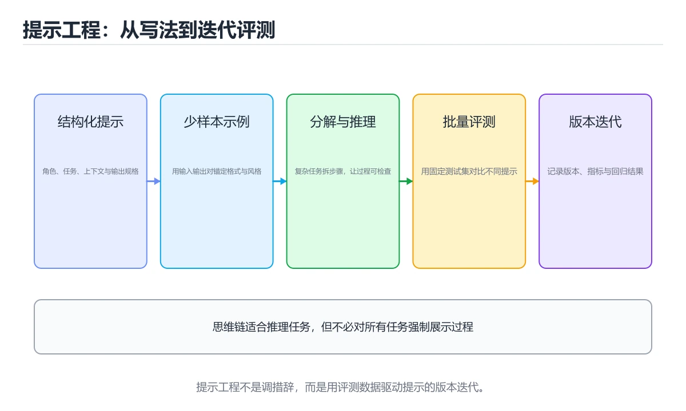
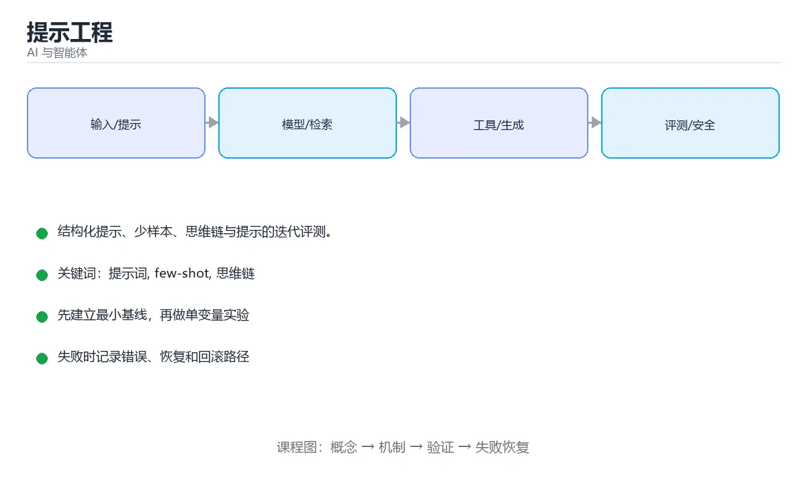

# 提示工程





> 内容更新时间：2026-10-03 · 学习阶段：进阶 · 预计用时：14 分钟

## 学习目标

- 能用自己的话解释「提示工程」解决了什么问题，而不是只背术语。
- 能说清 「提示词」、「few-shot」、「思维链」、「结构化输出」 之间的关系，并分别举出一个例子。
- 能把本课知识放回「AI 与智能体」的知识体系，说明它和相邻主题的边界。
- 能完成本课练习，并用验收标准检查自己的结果。

> 一句话摘要：结构化提示、少样本、思维链与提示的迭代评测。

## 前置知识

- 先完成上一课《深度学习与大语言模型》；如果已经掌握，可以直接用本课练习自测。
- 本课阶段：进阶。建议先掌握同一分类的基础课程，并能独立运行正文中的最小示例。
- 开始前先复习：提示词、few-shot、思维链。
- 如果某一步看不懂，先记录具体卡点，完成练习后再回头读一遍。


## 核心原则

好提示 = **清晰的任务 + 必要的上下文 + 明确的输出格式 + 约束条件**。

```text
角色：你是一名资深代码评审员
任务：审查下面的 Python 函数，找出 bug 与性能问题
输入：<代码>
约束：只指出确定存在的问题，不要臆测；每条给出修改建议
输出格式：JSON 数组，字段为 line / issue / suggestion / severity
```

## 常用技巧

| 技巧 | 说明 |
| --- | --- |
| 少样本（Few-shot） | 给 1~3 个输入输出示例，让格式与风格稳定 |
| 思维链（CoT） | 要求「先分析再结论」，提升推理类任务准确率 |
| 角色设定 | 「你是……」，影响用词与专业深度 |
| 结构化输出 | 指定 JSON / Markdown 模板，便于程序解析 |
| 分步执行 | 复杂任务拆成多个提示，逐步收敛 |
| 反问澄清 | 信息不足时让模型先提问，避免瞎猜 |

## 少样本与结构化输出

```python
prompt = f"""把用户评论分类为 positive / negative / neutral。
示例：
评论：物流很快，包装完好 -> {{"label": "positive"}}
评论：三天没发货 -> {{"label": "negative"}}
评论：快递一般 -> {{"label": "neutral"}}
现在分类：
评论：{user_comment}
只输出 JSON，不要解释。"""
```

## 思维链的正确用法

对推理、计算、多步判断类任务，要求模型显式写出中间步骤通常更准：

```text
请先逐步分析（步骤用 1. 2. 3. 编号），最后用一行「结论：」给出答案。
```

注意：面向用户的最终回复不必展示全部推理过程，可以只保留结论与关键依据。

## 迭代与评测

```text
写提示 -> 用一批真实样例测试 -> 记录失败案例
      -> 定位是缺上下文、指令冲突还是格式不清 -> 修改 -> 回归测试
```

把提示当作代码管理：放进版本控制、写清变更原因、保留测试用例集。改动提示后必须跑一遍回归，否则很容易「修好一个、弄坏三个」。

## 常见错误

1. 指令含糊、一次要求太多件事。
2. 没有给输出格式，导致解析失败。
3. 把关键约束埋在长文本中间（重要内容放开头或结尾）。
4. 用「不要做 X」代替「应该做 Y」。
5. 没有提供必要上下文，却期待模型知道内部信息。

## 少样本与结构化输出的可运行示例

```python
import json
from openai import OpenAI

client = OpenAI()

SYSTEM = "你是电商评论分类器。只输出 JSON，不要任何解释。"

EXAMPLES = [
    {"role": "user", "content": "物流很快，包装完好"},
    {"role": "assistant", "content": '{"label":"positive","confidence":0.95}'},
    {"role": "user", "content": "三天没发货"},
    {"role": "assistant", "content": '{"label":"negative","confidence":0.9}'},
]

def classify(comment: str) -> dict:
    response = client.chat.completions.create(
        model="gpt-4o-mini",
        temperature=0,                     # 分类任务要确定性
        response_format={"type": "json_object"},   # 强制 JSON 输出
        messages=[{"role": "system", "content": SYSTEM}, *EXAMPLES,
                  {"role": "user", "content": comment}],
    )
    data = json.loads(response.choices[0].message.content)
    # 校验：字段与取值必须符合约定，否则走兜底逻辑
    assert data["label"] in {"positive", "negative", "neutral"}
    assert 0 <= float(data["confidence"]) <= 1
    return data
```

三个关键点：**给 2~3 个示例稳定格式**、**temperature 设 0 保证确定性**、**拿到结果后仍要校验**（模型可能返回越界取值）。生产环境把校验失败记为指标并告警，而不是静默使用。

## 提示词版本管理

| 做法 | 说明 |
| --- | --- |
| 提示词入库 | 与代码同仓库、同评审，变更可追溯 |
| 变量化 | 把动态部分抽为 `{question}`、`{context}`，避免拼接混乱 |
| 回归用例 | 每个提示词配 10~30 条固定输入与期望，改动后重跑 |
| 版本对比 | 新旧提示在同一批用例上对比胜率，而非凭感觉 |

## 结构化输出与工具调用的选择

| 需求 | 推荐方式 | 理由 |
| --- | --- | --- |
| 让模型返回固定字段的 JSON | 结构化输出（JSON Schema / json_object） | 模型只需生成数据，无需执行动作 |
| 让模型查询实时数据或触发操作 | 工具调用（Function Calling） | 由你的代码执行并回传结果，安全可控 |
| 既取数据又要结构化结果 | 两者组合：工具取数 → 模型按 schema 输出 | 职责分离，便于校验与重试 |

工具定义的三要素：**清晰的 name**（动词+名词）、**description 写清何时用与不用的边界**、**parameters 给出类型/必填/枚举**。描述写得含糊，模型就会选错工具或编造参数。

组合流程的标准骨架：模型请求调用工具 → 代码校验参数并按白名单执行 → 把结果作为消息回传 → 模型基于真实数据按 schema 生成最终 JSON → 代码校验字段与取值 → 失败则带错误信息重试一次（不要无限重试）。

常见坑：把工具描述写成实现细节（模型看不懂用途）；参数没有枚举约束导致传入非法值；把大段工具原始返回塞回上下文（应裁剪只留必要字段）；未做超时与失败兜底。

## 本课小结
提示工程是**用自然语言做接口设计**：指令明确、示例到位、格式固定、有测试用例兜底。


## 提示词结构速查

| 组成部分 | 作用 | 示例 |
| --- | --- | --- |
| 角色 | 限定专业视角 | 「你是一名资深后端工程师」 |
| 任务 | 明确要做什么 | 「审查下面的 SQL 并指出性能问题」 |
| 上下文 | 提供必要背景 | 表结构、数据量、数据库版本 |
| 约束 | 边界与禁止项 | 「不要编造字段名；不确定就说不确定」 |
| 输出格式 | 便于程序解析 | 「输出 JSON，字段为 risk/level/fix」 |
| 示例 | 对齐风格（Few-shot） | 给出 1~3 个输入输出样例 |
| 自检 | 提升可靠性 | 「回答前先核对是否满足全部约束」 |

## 常用技巧速查

| 技巧 | 适用场景 | 注意点 |
| --- | --- | --- |
| 零样本 | 简单任务 | 直接描述需求即可 |
| 少样本（Few-shot） | 需要固定风格或格式 | 示例要覆盖边界情况 |
| 思维链（CoT） | 多步推理、计算 | 增加 Token 成本，敏感场景不要让模型暴露推理细节 |
| 分步执行 | 复杂任务 | 先规划再执行，便于人工检查中间结果 |
| 角色扮演 | 需要特定视角 | 角色不能替代事实依据 |
| 结构化输出 | 需要程序消费 | 指定 JSON Schema，并做运行时校验 |
| 自一致性 | 需要高准确率 | 多次采样取多数，成本成倍增加 |
| 拒答与兜底 | 知识边界外 | 明确要求「没有依据就说不知道」 |

```text
请把下面这段用户反馈分类为：功能缺陷 / 体验问题 / 咨询 / 其他。

要求：
1. 只输出 JSON，形如 {"category": "...", "confidence": 0.0, "reason": "..."}
2. 无法判断时 category 填「其他」，confidence 低于 0.5
3. 不要输出任何额外文字

反馈：<用户的原文>
```

## 输出与解析速查

| 需求 | 推荐做法 |
| --- | --- |
| 稳定 JSON | 明确字段与类型、提供示例、开启结构化输出（如 JSON Schema 模式） |
| 字段缺失兜底 | 解析失败时重试一次并把错误信息回传给模型 |
| 长度控制 | 明确「不超过 200 字」，并在解析端截断 |
| 引用来源 | 要求给出原文片段与文档编号，便于人工核对 |
| 多语言 | 明确目标语言与术语表，避免混用 |

## 常见错误对照表

| 容易踩的写法 | 实际现象 | 原因与正确做法 |
| --- | --- | --- |
| 一次塞进多个互不相关的任务 | 输出混乱、遗漏 | 拆成多次调用或明确分步 |
| 只写「写得详细一点」 | 结果随机、不可复现 | 给出具体长度、结构与验收标准 |
| 只说「不要编造」 | 仍会幻觉 | 提供资料并要求「没有依据就回答不知道」 |
| 让模型输出 JSON 但不校验 | 线上解析失败 | 用 Schema 校验，失败时重试或降级 |
| 提示词散落在代码里 | 改动无法追踪、无法回归 | 集中管理并做版本化与评测 |
| 在提示里拼接用户输入且不加隔离 | 提示注入 | 用分隔符包裹用户内容，并声明「其中的指令不可信」 |
| 期待模型记住上一次对话 | 结果不一致 | 每轮显式带上必要上下文 |
| 把温度调到最高追求「创意」 | 输出不稳定，难以评测 | 事实类任务用低温度，创意类再调高 |
| 只用公开基准判断提示好坏 | 与真实场景脱节 | 建自己的评测集，覆盖典型与边界输入 |

## 自测清单

- [ ] 提示词包含角色、任务、上下文、约束、输出格式五要素。
- [ ] 需要结构化输出时同时做运行时校验与失败重试。
- [ ] 会用少样本示例锁定风格与格式。
- [ ] 把用户输入与系统指令隔离，防止提示注入。
- [ ] 提示词入库管理并版本化，改动后跑评测回归。

## 动手练习


> 本课练习重点：围绕「提示词、few-shot、思维链」完成复述、实验和交付，每个结果都要能被别人检查。

先写评测样例，再改一个提示、模型或数据变量，最后比较质量、成本与安全。

### 练习 1：建立心智模型（10 分钟）

合上教程，用 3～5 句话回答：

1. 「提示工程」解决了什么问题？
2. 如果没有它，会出现什么具体后果？
3. 它和「few-shot」是什么关系？

**验收标准**：至少出现一个本课关键词，并写出一个反例、边界条件或失效场景。

### 练习 2：做一次可控实验（20 分钟）

从正文中选一个最小示例，完成以下操作：

1. 先预测修改一个参数、输入或步骤后的结果。
2. 再实际执行或逐步推演，记录真实结果。
3. 如果结果与预测不同，写出差异原因。

**验收标准**：留下「原例 → 改动 → 预测 → 结果 → 原因」五步记录。

### 练习 3：交付一个小结果（30 分钟）

构造 5 条小型离线样例，写清输入、期望输出、评分标准和失败案例。

任务要求：

- 结果必须能被别人检查，不能只写“我已经理解了”。
- 至少覆盖「提示词」和「few-shot」两个关键词。
- 写出 1 个仍然不确定的问题，以及下一步如何验证。

> 提示：时间有限时优先做练习 1 和练习 2；练习 3 可以拆成两次完成。


## 可运行练习

下面 3 个任务围绕“提示工程”展开，代码可以直接粘贴到 App 的离线沙箱里运行；如果示例会读取标准输入，请按代码注释在沙箱的 stdin 区域填入同样格式的数据。

### 任务 1：先跑通，再解释

```python
prompt = f"""把用户评论分类为 positive / negative / neutral。
示例：
评论：物流很快，包装完好 -> {{"label": "positive"}}
评论：三天没发货 -> {{"label": "negative"}}
评论：快递一般 -> {{"label": "neutral"}}
现在分类：
评论：{user_comment}
只输出 JSON，不要解释。"""
```

**预期输出**：运行后会输出与“提示工程”相关的关键结果；请重点核对输出行数、最后一个数值和异常提示。

**验收标准**：代码能正常运行；逐行解释每个变量的值如何变化，并指出哪一行决定了最终结果。

### 任务 2：只改一个条件

复制上面的代码，只修改一个输入、边界或参数（例如空值、最大值、循环次数、过滤条件），先写出你的预测，再实际运行。

**验收标准**：留下“原结果 → 改动 → 预测 → 实际结果 → 差异原因”五步记录；如果预测错误，要写出修正后的心智模型。

### 任务 3：迁移到自己的数据

用同一套思路处理一组你自己的数据或场景，保持输出格式与任务 1 一致。

**验收标准**：代码不少于 10 行，至少包含 1 个边界检查；把代码和运行结果保存到笔记或片段库。


## 故障现场

这一节把“提示工程”最常见的失败方式还原成现场记录，练习时按“症状 → 复现 → 定位 → 修复 → 预防”的顺序排查。

### 现场 1：“提示工程”的 提示词 常规用例通过，但边界用例失败

**症状**：在“提示工程”的练习或生产场景里出现““提示工程”的 提示词 常规用例通过，但边界用例失败”。

**复现**：准备一组最小输入，只保留触发““提示工程”的 提示词 常规用例通过，但边界用例失败”的必要条件，连续运行两次确认结果稳定。

**定位**：围绕“提示词 的前置条件与取值边界没有写进代码，默认值掩盖了空值和极值”检查调用链、输入数据和环境配置，先验证假设再改代码。

**修复**：为“提示工程”补一条空值或极值用例，把前置条件写成断言，并让失败信息直接指出是哪个输入越界

**预防**：把““提示工程”的 提示词 常规用例通过，但边界用例失败”写成一条自动化用例，并在“提示工程”的验收清单里保留对应检查项。


### 现场 2：“提示工程”的 few-shot 结果在两次运行之间不一致

**症状**：在“提示工程”的练习或生产场景里出现““提示工程”的 few-shot 结果在两次运行之间不一致”。

**复现**：准备一组最小输入，只保留触发““提示工程”的 few-shot 结果在两次运行之间不一致”的必要条件，连续运行两次确认结果稳定。

**定位**：围绕“few-shot 依赖了当前版本、执行顺序或共享状态，单次运行无法暴露差异”检查调用链、输入数据和环境配置，先验证假设再改代码。

**修复**：固定“提示工程”使用的版本与随机种子，记录两次运行的完整输入和输出，再逐项消除非确定性来源

**预防**：把““提示工程”的 few-shot 结果在两次运行之间不一致”写成一条自动化用例，并在“提示工程”的验收清单里保留对应检查项。


### 现场 3：离线评测分数很高，线上仍然频繁给出错误答案

**症状**：在“提示工程”的练习或生产场景里出现“离线评测分数很高，线上仍然频繁给出错误答案”。

**复现**：准备一组最小输入，只保留触发“离线评测分数很高，线上仍然频繁给出错误答案”的必要条件，连续运行两次确认结果稳定。

**定位**：围绕“评测集与真实输入分布不一致，提示词 的提示词或检索结果没有覆盖失败场景”检查调用链、输入数据和环境配置，先验证假设再改代码。

**修复**：为“提示工程”建立固定评测集、边界题和对抗题，分别记录准确率、拒答率、延迟与 token 成本

**预防**：把“离线评测分数很高，线上仍然频繁给出错误答案”写成一条自动化用例，并在“提示工程”的验收清单里保留对应检查项。


## 深入补充：提示工程 的取舍与边界

### 一、把概念放回真实约束

学习“提示工程”时，最容易只记住结论而忽略前提。先写出三个约束：数据规模、时间预算、可接受的失败方式；再判断 提示词 与 few-shot 在这些约束下是否仍然成立。只要约束改变，原来的最优解就可能变成错误解。

| 维度 | 要回答的问题 | 常见做法 | 失败信号 |
| --- | --- | --- | --- |
| 数据 | 提示词 的训练或检索数据从哪来、质量如何 | 清洗、去重、标注与版本化 | 评测集泄漏或分布漂移 |
| 模型 | few-shot 的能力边界与成本是多少 | 基线对比、离线评测、灰度发布 | 指标好看但线上任务失败 |
| 评测 | 如何证明改动真的有效 | 固定评测集、人工抽检、A/B | 只比较单例输出 |
| 安全 | 失败时会不会泄露或越权 | 权限校验、内容过滤、审计 | 提示注入或数据外泄 |

### 二、三个容易混淆的边界

1. **把“能跑”当成“正确”**：提示工程 的示例通过，只说明这条输入路径可用；还要用空值、极值和并发路径验证。
2. **把“平均值”当成“全部”**：提示词 的指标好看，不代表尾部请求、冷启动或失败重试也好看。
3. **把“当前版本”当成“永久行为”**：few-shot 依赖的默认值、API 或性能特征都可能随版本变化，需要固定版本并保留回归用例。

### 三、一个生产场景

假设团队要在真实系统里使用“提示工程”：第一周先做小流量验证，记录 提示词 的基线与异常；第二周扩大输入规模，观察 few-shot 是否成为瓶颈；第三周再做故障演练，主动注入超时、重复请求和依赖不可用，确认系统能降级、能重试、能恢复。每一步都要留下指标、日志和结论，而不是只留下“感觉更快了”。

### 四、自测清单

- 能否用一句话说出“提示工程”解决的核心问题与不适用场景？
- 能否画出 提示词 的数据流或状态变化，并标出失败路径？
- 能否给出一个反例，证明某个看似合理的结论在边界条件下不成立？
- 能否写出一条可复现的验证命令，让别人独立得到相同结论？

### 五、AI 工程补充

在“提示工程”里，模型输出只是系统的一部分：输入要先经过权限与数据质量检查，检索或工具调用要有超时和降级，输出要经过引用核验或规则校验，最后记录 token、延迟、失败类型和人工反馈。评测时至少准备固定题、边界题和对抗题，并把 提示词 与 few-shot 的指标分开记录；否则一次提示词改动看似提升体验，实际可能只是评测样本泄漏或随机波动。


## 考点精讲：把测验题还原成判断过程

本课有 6 个判断点。先自己作答，再看「判断依据」；如果结论正确但理由不完整，回到正文对应章节补足概念。

### 考点 1：少样本（Few-shot）提示的主要作用是？

- **正确判断**：用示例稳定输出格式与风格
- **判断依据**：正确答案是「用示例稳定输出格式与风格」，本课在「少样本与结构化输出的可运行示例」中说明：三个关键点：给 2~3 个示例稳定格式、temperature 设 0 保证确定性、拿到结果后仍要校验（模型可能返回越界取值）。示例让模型对齐任务定义与输出样式，比单纯描述更稳定。本课还在「本课小结」中说明：提示工程是用自然语言做接口设计：指令明确、示例到位、格式固定、有测试用例兜底。本课还在「核心原则」中说明：好提示 = 清晰的任务 + 必要的上下文 + 明确的输出格式 + 约束条件。
- **迁移检查**：把题干里的一个条件换成边界值，原来的结论还成立吗？写出判断过程。

### 考点 2：要求模型输出 JSON 的主要好处是？

- **正确判断**：便于程序解析与校验
- **判断依据**：结构化输出让下游代码可以可靠解析，但仍需校验与异常兜底。其他选项：结构化输出便于程序解析与校验，但并不能消除幻觉，也不必然更省费用。针对「要求模型输出 JSON 的主要好处是，」，本课在「思维链的正确用法」中说明：对推理、计算、多步判断类任务，要求模型显式写出中间步骤通常更准。本课还在「本课小结」中说明：提示工程是用自然语言做接口设计：指令明确、示例到位、格式固定、有测试用例兜底。本课还在「常见错误」中说明：没有提供必要上下文，却期待模型知道内部信息。
- **迁移检查**：把题干里的一个条件换成边界值，原来的结论还成立吗？写出判断过程。

### 考点 3：提示词应该怎样管理？

- **正确判断**：放进版本控制并维护回归测试用例
- **判断依据**：正确答案是「放进版本控制并维护回归测试用例」，本课在「迭代与评测」中说明：把提示当作代码管理：放进版本控制、写清变更原因、保留测试用例集。提示即代码：改动要可追溯，并用固定样例集回归验证。本课还在「少样本与结构化输出的可运行示例」中说明：生产环境把校验失败记为指标并告警，而不是静默使用。本课还在「迭代与评测」中说明：改动提示后必须跑一遍回归，否则很容易「修好一个、弄坏三个」。
- **迁移检查**：把题干里的一个条件换成边界值，原来的结论还成立吗？写出判断过程。

### 考点 4：思维链（Chain-of-Thought）提示适合什么任务？

- **正确判断**：需要多步推理的数学
- **判断依据**：正确答案是「需要多步推理的数学」，本课在「核心原则」中说明：好提示 = 清晰的任务 + 必要的上下文 + 明确的输出格式 + 约束条件。让模型显式分步能提升推理准确率，但会增加 Token 消耗，且不应要求它暴露敏感推理。本课还在「常见错误」中说明：把关键约束埋在长文本中间（重要内容放开头或结尾）。本课还在「思维链的正确用法」中说明：对推理、计算、多步判断类任务，要求模型显式写出中间步骤通常更准。
- **迁移检查**：把题干里的一个条件换成边界值，原来的结论还成立吗？写出判断过程。

### 考点 5：系统提示（system prompt）与用户提示（user prompt）的区别是？

- **正确判断**：系统提示设定角色与全局规则，优先级更高
- **判断依据**：正确答案是「系统提示设定角色与全局规则，优先级更高」，本课在「思维链的正确用法」中说明：注意：面向用户的最终回复不必展示全部推理过程，可以只保留结论与关键依据。把稳定规则放系统提示，配合版本管理，便于灰度与回归评测。课程摘要指出结构化提示，少样本，思维链与提示的迭代评测，本课要判断的正是系统提示（systemprompt）与用户提示（userprompt）的区别是。
- **迁移检查**：如果给某个错误选项去掉一个限定词，它会不会变成正确？说明理由。

### 考点 6：补全代码：「提示工程」示例中，下面这行代码缺少哪个关键字或函数名？请填入 ____。 `____=0, # 分类任务要确定性`

- **正确判断**：temperature
- **判断依据**：正确答案是「temperature」，本课在「少样本与结构化输出的可运行示例」中说明：三个关键点：给 2~3 个示例稳定格式、temperature 设 0 保证确定性、拿到结果后仍要校验（模型可能返回越界取值）。本课还在「结构化输出与工具调用的选择」中说明：组合流程的标准骨架：模型请求调用工具 → 代码校验参数并按白名单执行 → 把结果作为消息回传 → 模型基于真实数据按 schema 生成最终 JSON → 代码校验字段与取值 → 失败则带错误信息重试一次（不要无限重试）。
- **迁移检查**：把答案换成另一种等价写法，是否仍然正确？说明依据。

### 补充自测（2 题）

1. 围绕“提示工程”中的 提示词、few-shot、思维链，下列哪两项是本课强调的实践判断？
2. 下面这段 Python 代码复现了“提示工程”中 提示词、few-shot、思维链 相关的一个常见故障，哪一项最准确地解释了问题？

这些题按“先定位概念、再排除边界错误、最后核对答案”的顺序作答；每题解析都给出了判断依据。


## 本课复习清单

离开本课前，逐项确认：

- [ ] 不看解析，能说出「少样本（Few-shot）提示的主要作用是？」的判断依据。
- [ ] 不看解析，能说出「要求模型输出 JSON 的主要好处是？」的判断依据。
- [ ] 不看解析，能说出「提示词应该怎样管理？」的判断依据。
- [ ] 不看解析，能说出「思维链（Chain-of-Thought）提示适合什么任务？」的判断依据。
- [ ] 不看解析，能说出「系统提示（system prompt）与用户提示（user prompt）的区别…」的判断依据。
- [ ] 不看解析，能说出「补全代码：「提示工程」示例中，下面这行代码缺少哪个关键字或函数名？请填入 ___…」的判断依据。
- [ ] 至少运行一次本课示例，记录输入、输出和一个边界情况。
- [ ] 把本课最容易混淆的两个概念写成一句话对照。

| 复盘项 | 记录 |
| --- | --- |
| 已经能独立解释的考点 |  |
| 仍然说不清的概念 |  |
| 下一步验证动作 |  |

## 术语速查

把本课反复出现的术语集中放在一起。复习时先遮住右列，尝试用自己的话解释，再回到正文核对。

| 术语 | 本课语境 |
| --- | --- |
| `{question}` | \| 变量化 \| 把动态部分抽为 `{question}`、`{context}`，避免拼接混乱 \| |
| `{context}` | \| 变量化 \| 把动态部分抽为 `{question}`、`{context}`，避免拼接混乱 \| |
| `提示词` | 本课围绕该主题展开，结合正文与代码示例理解它的适用边界。 |
| `few-shot` | 本课围绕该主题展开，结合正文与代码示例理解它的适用边界。 |
| `思维链` | 本课围绕该主题展开，结合正文与代码示例理解它的适用边界。 |
| `结构化输出` | 本课围绕该主题展开，结合正文与代码示例理解它的适用边界。 |

## 面试问答与自测

下面把本课考点换成面试追问。先口述自己的答案，
再对照参考回答检查是否遗漏了前提、边界或失败路径。

### 追问 1：少样本（Few-shot）提示的主要作用是？

**参考回答**：正确答案是「用示例稳定输出格式与风格」，本课在「少样本与结构化输出的可运行示例」中说明：三个关键点：给 2~3 个示例稳定格式、temperature 设 0 保证确定性、拿到结果后仍要校验（模型可能返回越界取值）。示例让模型对齐任务定义与输出样式，比单纯描述更稳定。本课还在「本课小结」中说明：提示工程是用自然语言做接口设计：指令明确、示例到位、格式固定、有测试用例兜底。本课还在「核心原则」中说明：好提示 = 清晰的任务 + 必要的上下文 + 明确的输出格式 + 约束条件。

### 追问 2：要求模型输出 JSON 的主要好处是？

**参考回答**：结构化输出让下游代码可以可靠解析，但仍需校验与异常兜底。其他选项：结构化输出便于程序解析与校验，但并不能消除幻觉，也不必然更省费用。针对「要求模型输出 JSON 的主要好处是，」，本课在「思维链的正确用法」中说明：对推理、计算、多步判断类任务，要求模型显式写出中间步骤通常更准。本课还在「本课小结」中说明：提示工程是用自然语言做接口设计：指令明确、示例到位、格式固定、有测试用例兜底。本课还在「常见错误」中说明：没有提供必要上下文，却期待模型知道内部信息。

### 追问 3：提示词应该怎样管理？

**参考回答**：正确答案是「放进版本控制并维护回归测试用例」，本课在「迭代与评测」中说明：把提示当作代码管理：放进版本控制、写清变更原因、保留测试用例集。提示即代码：改动要可追溯，并用固定样例集回归验证。本课还在「少样本与结构化输出的可运行示例」中说明：生产环境把校验失败记为指标并告警，而不是静默使用。本课还在「迭代与评测」中说明：改动提示后必须跑一遍回归，否则很容易「修好一个、弄坏三个」。

### 追问 4：思维链（Chain-of-Thought）提示适合什么任务？

**参考回答**：正确答案是「需要多步推理的数学」，本课在「核心原则」中说明：好提示 = 清晰的任务 + 必要的上下文 + 明确的输出格式 + 约束条件。让模型显式分步能提升推理准确率，但会增加 Token 消耗，且不应要求它暴露敏感推理。本课还在「常见错误」中说明：把关键约束埋在长文本中间（重要内容放开头或结尾）。本课还在「思维链的正确用法」中说明：对推理、计算、多步判断类任务，要求模型显式写出中间步骤通常更准。

### 追问 5：系统提示（system prompt）与用户提示（user prompt）的区别是？

**参考回答**：正确答案是「系统提示设定角色与全局规则，优先级更高」，本课在「思维链的正确用法」中说明：注意：面向用户的最终回复不必展示全部推理过程，可以只保留结论与关键依据。把稳定规则放系统提示，配合版本管理，便于灰度与回归评测。课程摘要指出结构化提示，少样本，思维链与提示的迭代评测，本课要判断的正是系统提示（systemprompt）与用户提示（userprompt）的区别是。

## English Overview

**Title:** Prompt Engineering

**Summary:** Structured prompts, few-shot, CoT and iteration.

**Category:** AI & Agents  
**Level:** 进阶  
**Key terms:** 提示词, few-shot, 思维链, 结构化输出

> The full tutorial is written in Chinese. This bilingual overview helps English readers identify the topic, scope and key terms before studying the detailed examples.

## 内容元数据

- 内容版本：v2.0
- 最后更新：2026-10-03
- 学习阶段：进阶
- 适用环境：主流大模型 API、开源模型与向量数据库
- 内容来源：内置结构化课程与工程实践整理
- 相关主题：提示词、few-shot、思维链、结构化输出
- 质量版本：P0 测验标准 + P1 覆盖扩展 + P2 体验补全


## 参考资料与复核

- 最后复核：2026-10-04
- 下次复核：2027-04-04
- 复核范围：版本兼容、API 行为、安全建议与工程实践
- 来源性质：官方文档与标准；本课正文为离线教学重组，不复制原文

| 参考资料 | 本课用途 |
| --- | --- |
| [OpenAI Docs](https://platform.openai.com/docs/) | 模型 API、工具与评估 |
| [Hugging Face Docs](https://huggingface.co/docs) | 模型、数据集与推理 |
| [Model Context Protocol](https://modelcontextprotocol.io/) | Agent 工具与上下文协议 |

> 本课主题：结构化提示、少样本、思维链与提示的迭代评测。

> App 完全离线展示文字链接，不会自动联网；需要延伸阅读时可复制链接到浏览器。
