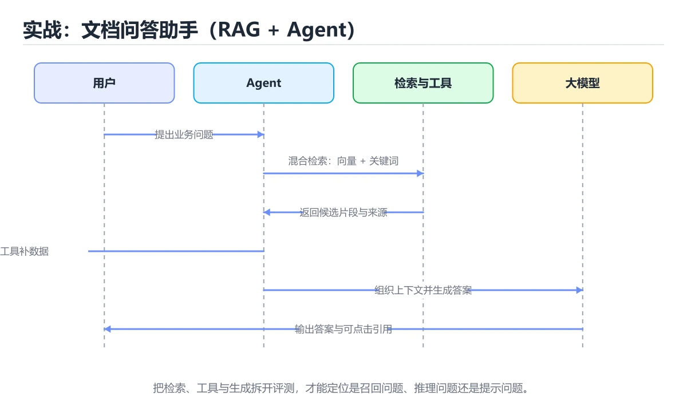
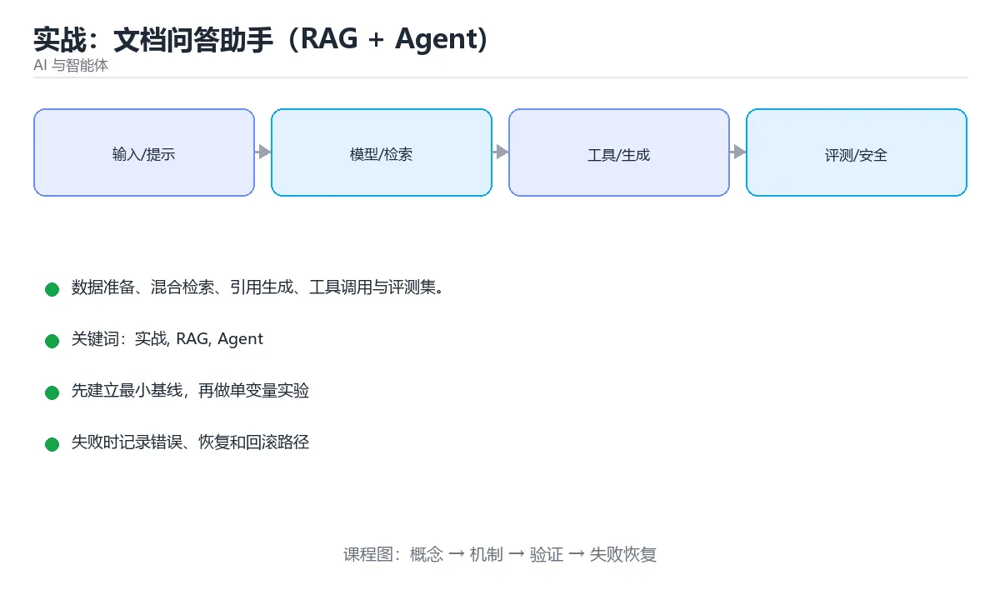

# 实战：文档问答助手（RAG + Agent）





> 内容更新时间：2026-10-06 · 学习阶段：进阶 · 预计用时：60 分钟

## 学习目标

- 能用自己的话解释实战：文档问答助手（RAG + Agent）解决了什么问题，而不是只背术语。
- 能说清 「实战」、「RAG」、「Agent」、「评测」 之间的关系，并分别举出一个例子。
- 能把本课知识放回「AI 与智能体」的知识体系，说明它和相邻主题的边界。
- 能完成本课练习，并用验收标准检查自己的结果。

> 一句话摘要：数据准备、混合检索、引用生成、工具调用与评测集。

## 前置知识

- 先完成上一课《数据工程与标注》；如果已经掌握，可以直接用本课练习自测。
- 开始前先复习：实战、RAG、Agent。
- 如果某一步看不懂，先记录具体卡点，完成练习后再回头读一遍。

## 目标

用 RAG + Agent 做一个能回答"我们自己的文档"的助手，并配一套**评测集**验证效果，而不是靠感觉。

## 步骤一：数据准备

收集文档（Markdown/PDF）→ 解析（PDF 需版面分析，保留页码与 bbox）→ 清洗（去页眉页脚、去重）→ 分块（300~800 token，重叠 10%~20%，按标题切分保持语义完整）。**元数据必留**：来源、页码、标题路径，供引用。

## 步骤二：索引与检索

向量化后存入向量库（FAISS/Chroma/pgvector 任选）；检索阶段用混合策略：BM25 关键词 + 向量语义，再加重排序（cross-encoder）。Top-K 建议 5~8 条，重排后取 3~5 条喂给模型。

## 步骤三：生成与引用

提示要求：仅依据资料回答、不足时明说"资料中没有"、结论后标注来源编号。把命中的原文片段一并返回给用户，便于核对。

## 步骤四：加上 Agent 能力

给助手两个工具：① 检索文档；② 计算/查询结构化数据（如从表格取数）。用 ReAct 循环让模型自己决定是否检索，并限制最大步数（如 5 步）与总预算。工具执行必须做权限校验与超时。

## 步骤五：评测

| 指标 | 怎么测 |
| --- | --- |
| 检索命中率 | 标准问题对应的文档是否进入 Top-K |
| 答案正确率 | 要点覆盖度或 LLM-as-Judge 打分 |
| 引用准确率 | 标注的来源是否真的支撑结论 |
| 幻觉率 | 无答案问题上是否编造 |
| 成本与延迟 | 每问题 token、P95 延迟 |

评测集至少 50 条，覆盖：可直接查到、需要跨文档综合、无答案、含对抗性表述四类。

## 常见错误与排查

1. 只调提示不优化检索——检索不到，模型只能编。
2. 分块过大导致噪声淹没答案，过小导致语义不完整。
3. 不保留页码，回答无法溯源，用户不敢信任。
4. 没有评测集，改一次提示就"感觉更好了"。
5. 无答案问题不设兜底，幻觉率飙升。
| 容易踩的做法 | 实际现象 | 原因与正确做法 |
| --- | --- | --- |
| 只调生成不看检索 | 优化无效 | 先测 Recall@K 定位瓶颈 |
| 检索无权限过滤 | 越权返回他人资料 | 检索阶段强制过滤 |
| 资料不足仍强行作答 | 幻觉 | 设置相似度阈值与拒答策略 |
| 无引用 | 无法核验 | 片段编号 + 引用校验 |
| 无步数上限 | 成本失控 | 限制步数与总 Token |
| 只做端到端评测 | 问题定位困难 | 召回与作答分别评测 |
| 不做坏例分析 | 问题反复出现 | 定期复盘 weak cases |
| 索引更新不及时 | 用户拿到旧答案 | 文档变更触发增量重建 |
| 没有回滚开关 | 出问题只能停服 | 支持一键切回上一版本 |
| 无成本监控 | 预算被突破 | 按租户与接口统计并告警 |

## 评测集模板与打分脚本结构

**评测集字段**（JSON Lines，一行一条）：id、question、expected_points（标准答案要点数组）、expected_doc_ids（应命中的文档）、no_answer（布尔，表示资料中确实没有答案）、adversarial（布尔，含提示注入）。

**打分流程五步**：

1. 跑检索，记录 Top-K 命中文档 ID → 计算**命中率**（expected_doc_ids 是否被包含）。
2. 跑生成，拿到答案与引用列表 → 计算**要点覆盖率**（expected_points 中按语义匹配到的比例）。
3. 校验**引用准确率**（引用编号对应的原文是否真的支撑结论）。
4. 对 no_answer 用例检查是否正确拒答 → **幻觉率**。
5. 记录每问的 token 数与耗时 → **成本与 P95 延迟**。

**四类用例的参考配比**：可直接查到 50%、需跨文档综合 25%、无答案 15%、对抗性输入 10%。每类都要有，否则指标会失真——只测"能查到"的用例会掩盖幻觉问题。

**回归与门禁**：把评测脚本接入 CI（或每次发布前手动跑），对比基线的命中率、正确率与成本；任一指标下降超过阈值（如 5%）就阻断发布。改动分块策略、嵌入模型、提示词或重排参数后都必须重跑。

## 交付物与评分标准

**交付物**：文档解析与分块脚本、向量库索引（可重建）、检索+生成链路代码、50 条评测集（JSON Lines）、评测报告（命中率/要点覆盖/引用准确/幻觉率/成本与延迟五项指标）。

**评分标准**：检索质量 30%（命中率有数据）、生成可靠 30%（引用可溯源、无答案问题能拒答）、工程完整 25%（索引可重建、配置外置、异常有兜底）、评测规范 15%（评测集冻结且四类用例齐全）。

**常见失败案例**：① 只调提示不优化检索，命中率低却以为模型不行；② 分块过大导致噪声淹没答案；③ 不保留页码，回答无法溯源；④ 没有评测集，改动后凭感觉判断效果。

## 本课小结

这个实战走完**数据 → 检索 → 生成 → 工具 → 评测**全链路；其中评测集是最容易被跳过、却最决定成败的一步。

## 端到端架构速查

| 层 | 组件 | 关键点 |
| --- | --- | --- |
| 接入 | 鉴权、限流、会话 | 用户与租户隔离 |
| 解析 | PDF、表格、图片 | 保留结构与页码 |
| 索引 | 分块、嵌入、向量库 | 元数据含权限与位置 |
| 检索 | 混合检索 + 重排 | 先过滤再打分 |
| 编排 | Agent 循环 + 工具 | 步数上限与超时 |
| 生成 | 提示 + 引用 | 只依据资料作答 |
| 评测 | 召回与作答分开 | 持续回归 |
| 观测 | 日志、指标、追踪 | 记录提示版本与轨迹 |

## 关键指标速查

| 指标 | 说明 | 目标示例 |
| --- | --- | --- |
| 检索 Recall@5 | 前 5 条是否含正确片段 | 大于 0.9 |
| 引用准确率 | 引用是否真的支持结论 | 大于 0.95 |
| 忠实度 | 回答是否只基于资料 | 大于 0.95 |
| 拒答正确率 | 资料不足时是否明确说明 | 大于 0.9 |
| 端到端 P95 延迟 | 从提问到首字 | 小于 3 秒 |
| 单次问答成本 | 平均 Token 费用 | 按预算设定 |

```python
from dataclasses import dataclass, field

@dataclass
class QAResult:
    question: str
    answer: str
    citations: list
    retrieved: int
    steps: int
    tokens: int
    latency_ms: float
    refused: bool = False

@dataclass
class ProjectMetrics:
    results: list = field(default_factory=list)

    def add(self, result: QAResult) -> None:
        self.results.append(result)

    def summary(self) -> dict:
        total = len(self.results)
        if not total:
            return {"cases": 0}
        with_citation = sum(1 for r in self.results if r.citations)
        latencies = sorted(r.latency_ms for r in self.results)
        return {
            "cases": total,
            "citation_rate": round(with_citation / total, 4),
            "refusal_rate": round(sum(r.refused for r in self.results) / total, 4),
            "avg_steps": round(sum(r.steps for r in self.results) / total, 2),
            "avg_tokens": round(sum(r.tokens for r in self.results) / total, 1),
            "p95_ms": latencies[int(total * 0.95) - 1],
        }

    def weak_cases(self, min_citations: int = 1) -> list:
        """挑出引用不足或步骤过多的用例，作为优化输入。"""
        return [
            r.question for r in self.results
            if len(r.citations) < min_citations or r.steps > 6
        ]

def answer_policy(retrieved: int, top_score: float, min_score: float = 0.35) -> str:
    """兜底策略：检索质量不足时直接拒答，避免编造。"""
    if retrieved == 0 or top_score < min_score:
        return "资料不足，建议补充文档或换个问法"
    return "正常作答并要求引用来源"

metrics = ProjectMetrics()
metrics.add(QAResult("报销标准是多少", "按 [1] 说明……", [1], 5, 3, 3200, 2100))
metrics.add(QAResult("明年预算", "无法从现有资料确认", [], 2, 2, 900, 800, refused=True))
print(metrics.summary())
print(metrics.weak_cases())
print(answer_policy(retrieved=0, top_score=0.0))
```

## 上线与运营速查

| 阶段 | 动作 |
| --- | --- |
| 内测 | 用评测集跑通，修复明显问题 |
| 灰度 | 小流量上线，观察指标与反馈 |
| 全量 | 达标后放量，保留回滚开关 |
| 运营 | 收集未命中问题，持续补文档与调参 |
| 迭代 | 提示、分块、模型分别独立实验 |
| 复盘 | 定期看坏例与成本趋势 |

## 复习与自测

- [ ] 架构覆盖解析、索引、检索、编排、生成、评测与观测。
- [ ] 检索与作答分别评测，能定位瓶颈。
- [ ] 有拒答策略、引用校验与权限过滤。
- [ ] 有步数与成本上限，支持灰度与回滚。
- [ ] 运营侧持续收集坏例并迭代文档与参数。

## 动手练习

> 本课练习重点：围绕「实战、RAG、Agent」完成复述、实验和交付，每个结果都要能被别人检查。

先写评测样例，再改一个提示、模型或数据变量，最后比较质量、成本与安全。

### 练习 1：建立心智模型（10 分钟）

合上教程，用 3～5 句话回答：

1. 实战：文档问答助手（RAG + Agent）解决了什么问题？
2. 如果没有它，会出现什么具体后果？
3. 它和「RAG」是什么关系？

**验收标准**：至少出现一个本课关键词，并写出一个反例、边界条件或失效场景。

### 练习 2：做一次可控实验（20 分钟）

从正文中选一个最小示例，完成以下操作：

1. 先预测修改一个参数、输入或步骤后的结果。
2. 再实际执行或逐步推演，记录真实结果。
3. 如果结果与预测不同，写出差异原因。

**验收标准**：留下「原例 → 改动 → 预测 → 结果 → 原因」五步记录。

### 练习 3：交付一个小结果（30 分钟）

构造 5 条小型离线样例，写清输入、期望输出、评分标准和失败案例。

任务要求：

- 结果必须能被别人检查，不能只写“我已经理解了”。
- 至少覆盖「实战」和「RAG」两个关键词。
- 写出 1 个仍然不确定的问题，以及下一步如何验证。

> 提示：时间有限时优先做练习 1 和练习 2；练习 3 可以拆成两次完成。

## 验证命令与预期输出

项目代码不能只看“能编译”，还要能按固定命令复现结果。下表给出最低验证集：

| 阶段 | 命令 | 预期输出 |
| --- | --- | --- |
| 安装依赖 | `python -m pip install -r requirements.txt` | 依赖安装完成，没有版本冲突 |
| 语法检查 | `python -m compileall .` | 所有模块编译通过 |
| 运行测试 | `python -m pytest -q` | 测试全部通过，失败用例数为 0 |
| 启动示例 | `python main.py` | 服务启动并输出监听地址 |

### 验收证据

- [ ] 保存依赖安装和启动命令的完整输出。
- [ ] 至少运行 3 条测试，其中包含一条非法输入或失败路径。
- [ ] 重复执行同一操作两次，确认没有重复写入或副作用。
- [ ] 记录一次失败状态码、错误日志和恢复步骤。
- [ ] 在 README 中写明环境版本、启动方式和回滚方式。

### 回归与回滚

1. 先在一个可丢弃的目录或临时数据库执行，避免污染真实数据。
2. 修改一处逻辑后重跑全部验证命令，确认没有回归。
3. 若失败，回滚到上一个可运行版本并保留失败日志。
4. 定位原因后补一条自动化测试，再重新执行发布流程。
5. 把教训写入项目复盘或本课笔记，形成下一次的检查项。

## 可运行练习

### 任务 1：先跑通，再解释

```python
from dataclasses import dataclass, field

@dataclass
class QAResult:
    question: str
    answer: str
    citations: list
    retrieved: int
    steps: int
    tokens: int
    latency_ms: float
    refused: bool = False

@dataclass
class ProjectMetrics:
    results: list = field(default_factory=list)

    def add(self, result: QAResult) -> None:
        self.results.append(result)

    def summary(self) -> dict:
        total = len(self.results)
        if not total:
            return {"cases": 0}
        with_citation = sum(1 for r in self.results if r.citations)
        latencies = sorted(r.latency_ms for r in self.results)
        return {
            "cases": total,
            "citation_rate": round(with_citation / total, 4),
            "refusal_rate": round(sum(r.refused for r in self.results) / total, 4),
            "avg_steps": round(sum(r.steps for r in self.results) / total, 2),
            "avg_tokens": round(sum(r.tokens for r in self.results) / total, 1),
            "p95_ms": latencies[int(total * 0.95) - 1],
        }

    def weak_cases(self, min_citations: int = 1) -> list:
        """挑出引用不足或步骤过多的用例，作为优化输入。"""
        return [
            r.question for r in self.results
            if len(r.citations) < min_citations or r.steps > 6
        ]

def answer_policy(retrieved: int, top_score: float, min_score: float = 0.35) -> str:
    """兜底策略：检索质量不足时直接拒答，避免编造。"""
    if retrieved == 0 or top_score < min_score:
        return "资料不足，建议补充文档或换个问法"
    return "正常作答并要求引用来源"

metrics = ProjectMetrics()
metrics.add(QAResult("报销标准是多少", "按 [1] 说明……", [1], 5, 3, 3200, 2100))
metrics.add(QAResult("明年预算", "无法从现有资料确认", [], 2, 2, 900, 800, refused=True))
print(metrics.summary())
print(metrics.weak_cases())
print(answer_policy(retrieved=0, top_score=0.0))
```

### 任务 2：只改一个条件

把「实战：文档问答助手（RAG + Agent）」的最小示例复制一份，只改一个条件再跑一次：

- 改动点：只把实战的输入换成空值、极值或错误输入，其余保持不变。
- 预测：先写下「实战：文档问答助手（RAG + Agent）」在改动后的输出或错误信息，再运行。
- 记录：对照改动前后的结果，指出差异出在哪一步。
- 验收：换回原条件能复现原结果，改动只影响实战。

### 任务 3：迁移到自己的数据

用同一套思路处理一组你自己的数据或场景，保持输出格式与任务 1 一致。

## 故障现场

### 现场 1：本课的 实战 常规用例通过，但边界用例失败

**症状**：在本课的练习或生产场景里出现“本课的 实战 常规用例通过，但边界用例失败”。

**复现**：准备一组最小输入，只保留触发“本课的 实战 常规用例通过，但边界用例失败”的必要条件，连续运行两次确认结果稳定。

**定位**：围绕“实战 的前置条件与取值边界没有写进代码，默认值掩盖了空值和极值”检查调用链、输入数据和环境配置，先验证假设再改代码。

**预防**：把“本课的 实战 常规用例通过，但边界用例失败”写成一条自动化用例，并在本课的验收清单里保留对应检查项。

### 现场 2：本课的 RAG 结果在两次运行之间不一致

**症状**：在本课的练习或生产场景里出现“本课的 RAG 结果在两次运行之间不一致”。

**复现**：准备一组最小输入，只保留触发“本课的 RAG 结果在两次运行之间不一致”的必要条件，连续运行两次确认结果稳定。

**定位**：围绕“RAG 依赖了当前版本、执行顺序或共享状态，单次运行无法暴露差异”检查调用链、输入数据和环境配置，先验证假设再改代码。

**预防**：把“本课的 RAG 结果在两次运行之间不一致”写成一条自动化用例，并在本课的验收清单里保留对应检查项。

### 现场 3：离线评测分数很高，线上仍然频繁给出错误答案

**定位**：围绕“评测集与真实输入分布不一致，实战 的提示词或检索结果没有覆盖失败场景”检查调用链、输入数据和环境配置，先验证假设再改代码。

## 深入补充：实战：文档问答助手（RAG + Agent） 的取舍与边界

### 一、把概念放回真实约束

学习实战：文档问答助手（RAG + Agent）时，最容易只记住结论而忽略前提。先写出三个约束：数据规模、时间预算、可接受的失败方式；再判断 实战 与 RAG 在这些约束下是否仍然成立。只要约束改变，原来的最优解就可能变成错误解。

| 维度 | 要回答的问题 | 常见做法 | 失败信号 |
| --- | --- | --- | --- |
| 数据 | 实战 的训练或检索数据从哪来、质量如何 | 清洗、去重、标注与版本化 | 评测集泄漏或分布漂移 |
| 模型 | RAG 的能力边界与成本是多少 | 基线对比、离线评测、灰度发布 | 指标好看但线上任务失败 |
| 评测 | 如何证明改动真的有效 | 固定评测集、人工抽检、A/B | 只比较单例输出 |
| 安全 | 失败时会不会泄露或越权 | 权限校验、内容过滤、审计 | 提示注入或数据外泄 |

### 二、三个容易混淆的边界

1. 澄清输入与目标。先写清「实战：文档问答助手（RAG + Agent）」要解决的问题、合法输入范围和成功标准，再进入后续步骤。
2. **把“平均值”当成“全部”**：实战 的指标好看，不代表尾部请求、冷启动或失败重试也好看。
3. **把“当前版本”当成“永久行为”**：RAG 依赖的默认值、API 或性能特征都可能随版本变化，需要固定版本并保留回归用例。

### 三、一个生产场景

假设团队要在真实系统里使用实战：文档问答助手（RAG + Agent）：第一周先做小流量验证，记录 实战 的基线与异常；第二周扩大输入规模，观察 RAG 是否成为瓶颈；第三周再做故障演练，主动注入超时、重复请求和依赖不可用，确认系统能降级、能重试、能恢复。每一步都要留下指标、日志和结论，而不是只留下“感觉更快了”。

### 四、自测清单

- 能否用一句话说出实战：文档问答助手（RAG + Agent）解决的核心问题与不适用场景？
- 能否画出 实战 的数据流或状态变化，并标出失败路径？
- 能否给出一个反例，证明某个看似合理的结论在边界条件下不成立？
- 能否写出一条可复现的验证命令，让别人独立得到相同结论？

### 五、AI 工程补充

在实战：文档问答助手（RAG + Agent）里，模型输出只是系统的一部分：输入要先经过权限与数据质量检查，检索或工具调用要有超时和降级，输出要经过引用核验或规则校验，最后记录 token、延迟、失败类型和人工反馈。评测时至少准备固定题、边界题和对抗题，并把 实战 与 RAG 的指标分开记录；否则一次提示词改动看似提升体验，实际可能只是评测样本泄漏或随机波动。

## 本课复习清单

离开本课前，逐项确认：

- [ ] 不看解析，能说出「检索质量差会直接导致？」的判断依据。
- [ ] 不看解析，能说出「分块的常见起点是？」的判断依据。
- [ ] 不看解析，能说出「评测集应覆盖哪些类型？」的判断依据。
- [ ] 不看解析，能说出「RAG 中重排序（rerank）的作用是？」的判断依据。
- [ ] 不看解析，能说出「让回答可溯源应如何实现？」的判断依据。
- [ ] 不看解析，能说出的判断依据。
- [ ] 至少运行一次本课示例，记录输入、输出和一个边界情况。
- [ ] 把本课最容易混淆的两个概念写成一句话对照。

| 复盘项 | 记录 |
| --- | --- |
| 已经能独立解释的考点 |  |
| 仍然说不清的概念 |  |
| 下一步验证动作 |  |

## 术语速查

| 术语 | 一句话说明 |
| --- | --- |
| `python -m compileall .` | \| 语法检查 \| `python -m compileall .` \| 所有模块编译通过 \| |
| `python -m pytest -q` | \| 运行测试 \| `python -m pytest -q` \| 测试全部通过，失败用例数为 0 \| |
| `python main.py` | \| 启动示例 \| `python main.py` \| 服务启动并输出监听地址 \| |
| `实战` | 围绕“评测集与真实输入分布不一致，实战 的提示词或检索结果没有覆盖失败场景”检查调用链、输入数据和环境配置，先验证假设再改代码。 |
| `RAG` | 围绕“RAG 依赖了当前版本、执行顺序或共享状态，单次运行无法暴露差异”检查调用链、输入数据和环境配置，先验证假设再改代码。 |
| `Agent` | 用 RAG + Agent 做一个能回答"我们自己的文档"的助手，并配一套评测集验证效果，而不是靠感觉。 |

## 考点精讲

### 考点 1：顺序排列·实战

- **题目**：按“实战：文档问答助手（RAG + Agent）”中 实战、RAG、Agent 的实践顺序，把四个步骤排成从准备到复盘的合理顺序。
- **判断依据**：在「实战：文档问答助手（RAG + Agent）」里，在本课的练习里，顺序应当是：先明确 实战 的输入、输出与约束 → 写出最小示例并核对 RAG 的基线结果 → 只改一个变量，记录边界与失败路径的变化 → 固定版本与证据，把本课的结论写成可复现记录。这个顺序把 实战 的输入、输出和约束放在最前面，在实战：文档问答助手（RAG + Agent）里避免概念没对齐就开始调参。第二步用 RAG 建立可核对的基线，在实战：文档问答助手（RAG + Agent）里第三步才允许改变一个变量并观察失败路径。

### 考点 2：多选辨析·实战

- **题目**：围绕“实战：文档问答助手（RAG + Agent）”中的 实战、RAG、Agent，下列哪两项是本课强调的实践判断？
- **判断依据**：在「实战：文档问答助手（RAG + Agent）」里，学习 实战 时要同时说明输入、输出和失败路径，不能只看正常流程。在实战：文档问答助手（RAG + Agent）里，判断 RAG 时要固定版本与边界输入，所以“验证 RAG 时要固定版本并覆盖边界输入，结论才可复现”才可复现。回到「实战：文档问答助手（RAG + Agent）」的正文示例，用“围绕实战”走一遍实战、RAG、Agent的完整流程，能复现的结论才可以保留。

### 考点 3：概念判断·实战

- **题目**：评测集应覆盖哪些类型？
- **判断依据**：无答案问题用于检测幻觉，对抗样本用于检测提示注入。在「实战：文档问答助手（RAG + Agent）」里，作答时，先用实战建立输入与输出的基线，再把可直接查到，需跨文档综合代入边界条件核对，结论才能复现。回到「实战：文档问答助手（RAG + Agent）」的正文示例，用“评测集应覆盖哪些类型”走一遍实战、RAG、Agent的完整流程，能复现的结论才可以保留。

### 考点 4：概念判断·实战

- **题目**：RAG 中重排序（rerank）的作用是？
- **判断依据**：在「实战：文档问答助手（RAG + Agent）」里，结论应落在「对初筛出的候选做精排」。向量召回快但精度有限，cross-encoder 精排慢但准，二者组合最常见。在「实战：文档问答助手（RAG + Agent）」里，这道题要求区分概念与边界，「对初筛出的候选做精排」只有在题干给出的前提下才成立，而「生成最终答案」、「压缩文档体积」缺少同一组条件。

### 考点 5：概念判断·实战

- **题目**：让回答可溯源应如何实现？
- **判断依据**：在「实战：文档问答助手（RAG + Agent）」里，检索片段携带文档 ID 与位置。可溯源是 RAG 相对纯生成的核心优势，也是用户信任与纠错的基础。回到「实战：文档问答助手（RAG + Agent）」的正文示例，用“让回答可溯源应如何实现”走一遍实战、RAG、Agent的完整流程，能复现的结论才可以保留。

### 考点 6：排错·实战

- **题目**：阅读「实战：文档问答助手（RAG + Agent）」的代码片段，下面哪项判断是正确的？
- **判断依据**：在「实战：文档问答助手（RAG + Agent）」里，模型缺少依据而编造答案。这道题的关键在「实战：文档问答助手（RAG + Agent）」的实战、RAG、Agent：先确认题干“阅读实战”问的是哪一步，再排除偷换前提的选项。在「实战：文档问答助手（RAG + Agent）」里，回到实战、RAG、Agent本身再看一遍：只有“模型缺少依据而编造答案”与题干“阅读实战”的前提一致，结论才成立。

## English Overview

**Title:** Project: RAG and Agent Assistant

**Summary:** Data, retrieval, citations, tools and evals.

**Category:** AI & Agents
**Level:** 高级
**Key terms:** 实战, RAG, Agent, 评测, 引用

## 内容元数据

- 内容版本：v2.0
- 最后更新：2026-10-06
- 学习阶段：进阶
- 适用环境：主流大模型 API、开源模型与向量数据库
- 内容来源：内置结构化课程与工程实践整理
- 相关主题：实战、RAG、Agent、评测、引用
- 质量版本：P0 测验标准 + P1 覆盖扩展 + P2 体验补全

## 项目专属规格：实战：文档问答助手（RAG + Agent）

### 核心场景

数据准备、混合检索、引用生成、工具调用与评测集。 项目目标是把「实战、RAG、Agent、评测、引用」落实为可运行、可测试、可回滚的交付物。

### 架构与数据流

```text
用户/输入 → 接口或命令 → 领域逻辑 → 存储/外部依赖 → 输出与监控
                         ↘ 失败分类 → 重试/补偿 → 回滚
```

### 最小数据模型

| 对象 | 关键字段 | 约束 |
| --- | --- | --- |
| 输入实体 | 实战、时间、来源 | 必填校验、长度限制、幂等键 |
| 任务实体 | 状态、优先级、创建时间 | 状态迁移合法、不可重复执行 |
| 结果实体 | 输出、错误码、耗时 | 可序列化、错误可解释 |
| 审计记录 | 操作者、动作、结果、时间 | 不可篡改、可查询、脱敏 |

### 验收场景

1. 正常路径：最小输入得到预期输出，并留下日志与指标。
2. 边界路径：空值、最大值、重复数据和超长内容得到明确处理。
3. 失败路径：依赖超时或不可用时能快速失败、重试或降级。
4. 幂等路径：同一请求执行两次不会产生重复副作用。
5. 回滚路径：回滚后数据一致，且能说明恢复时间和影响范围。

## 项目交付物

### 建议仓库结构

```text
src/
tests/
docs/
README.md
```

### 测试矩阵

| 层级 | 覆盖内容 | 最低数量 | 通过标准 |
| --- | --- | ---: | --- |
| 单元测试 | 领域规则、边界和错误分类 | 8 | 正常、边界、失败路径全部通过 |
| 集成测试 | 数据库、网络、文件或平台边界 | 3 | 使用真实边界且可重复运行 |
| 端到端测试 | 核心用户路径 | 1 | 从输入到输出完整跑通 |
| 手动验收 | 文档中列出的 5 个场景 | 5 | 有命令、输出和结论记录 |

### 验收数据

```json
{
  "project": "ai_rag_agent_project",
  "input": {"case": "normal", "value": 5},
  "expected": {"ok": true, "result": 5},
  "failure_case": {"value": -1, "error": "validation_error"},
  "idempotency_key": "demo-001"
}
```

### 复盘模板

| 问题 | 记录 |
| --- | --- |
| 原目标是什么？ | 用一句话描述可验收目标 |
| 实际发生了什么？ | 时间线、指标和关键日志 |
| 哪个假设被推翻？ | 根因与促成因素 |
| 如何回滚？ | 步骤、耗时和数据校验 |
| 下一步做什么？ | 负责人、期限和验证方式 |

> 项目验收围绕「实战、RAG、Agent」：至少完成一次正常路径、一次边界输入、一次失败恢复和一次幂等检查。

## 参考资料与复核

- 最后复核：2026-10-04
- 下次复核：2027-04-04
- 复核范围：版本兼容、API 行为、安全建议与工程实践
- 来源性质：官方文档、标准或权威教材；正文为离线教学重组

| 参考资料 | 本课用途 |
| --- | --- |
| [Model Context Protocol](https://modelcontextprotocol.io/) | Agent 工具与上下文协议 |
| [OpenAI Cookbook](https://cookbook.openai.com/) | RAG、Agent 与工程示例 |
| [scikit-learn 文档](https://scikit-learn.org/stable/documentation.html) | 经典机器学习算法 |

> 「实战：文档问答助手（RAG + Agent）」的链接用于离线阅读后的延伸核对；App 不会自动联网。
