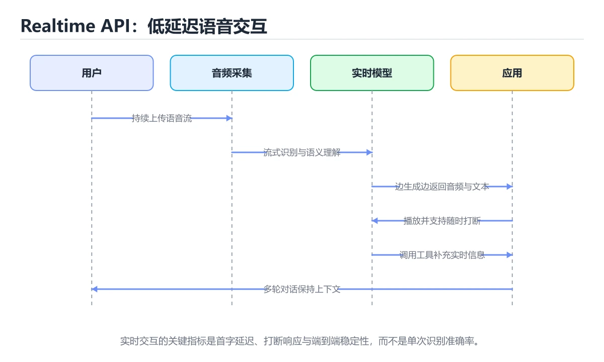
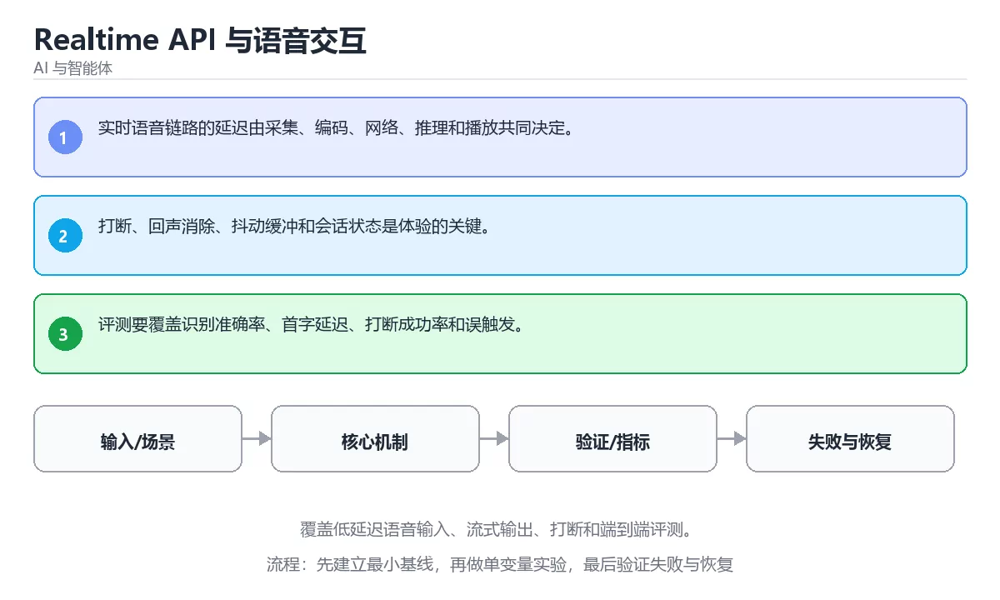

# Realtime API 与语音交互

> 内容更新时间：2026-10-06 · 学习阶段：进阶 · 预计用时：40 分钟





## 本节知识框架

**课程定位**：所属分类 `ai`（AI 与智能体），课程主题 `Realtime API 与语音交互`，学习阶段 进阶，建议用时 45 分钟。

本课主线：覆盖低延迟语音输入、流式输出、打断和端到端评测。

**学完本课应当能够**
- 说清 `Realtime` 与 `语音` 的含义与区别，并各举一个正例和一个反例。
- 用本课示例验证 `延迟` 的行为，记录输入、输出与失败条件。
- 遇到「用普通请求响应做语音」这类问题时，能说出触发条件与修复顺序。

### 从概念到验证的学习链条

1. `Realtime`：先掌握 通过长连接或实时会话在低延迟下持续交换文本、音频或事件，再用它解释 `语音` 为什么会出现。
2. `语音`：先掌握 按“Realtime API 与语音交互”中 Realtime、语音、流式 的实践顺序，把四个步骤排成从准备到复盘的合理顺序，再用它解释 `延迟` 为什么会出现。
3. `延迟`：先掌握 从请求发出到收到响应或事件发生到被处理之间的时间，再用它解释 `打断` 为什么会出现。
4. `打断`：先掌握 用户随时开口就立刻停掉当前播报并切换到新问题，是实时语音链路最关键的体验指标，再用它解释 本课示例的观察结果 为什么会出现。

**先修与衔接**：本课是「AI 与智能体」分类的第 28 课。先修内容：《扩散模型与图像生成》。《扩散模型与图像生成》里的 `扩散模型`、`图像生成` 是本课的前提。相关或后续课程：《大模型推理服务与 GPU 优化》。

### 完成判据

- **定义关**：不看正文也能说明 `Realtime` 是 通过长连接或实时会话在低延迟下持续交换文本、音频或事件，并指出一个反例。
- **机制关**：能按“输入 → 转换 → 输出 → 验证”复述 `Realtime API 与语音交互`，而不是只背结论。
- **示例关**：能运行或推演 `Realtime API 与语音交互` 的 `text` 示例，并说明一个真实出现的标识符或字面量。
- **证据关**：能指出 `Realtime API 与语音交互` 示例里的 调用了 `score()`，并说明它支持或反驳了本课的哪一条结论。
- **排错关**：能复现 用普通请求响应做语音，记录现象并按 用双向流式会话处理音频，支持随时取消当前响应 修复。
- **迁移关**：能把 `Realtime`、`语音`、`流式`、`延迟` 放进一个与 `Realtime API 与语音交互` 不同的项目场景，并保持输入与验证条件可追踪。
- **复盘关**：学完 `Realtime API 与语音交互` 后，用一句话写下仍然不确定的结论，并列出下一次验证需要的输入、环境和成功判据。

### 复习清单

- [ ] 能不看正文复述本课核心术语，并指出一个边界或反例。
- [ ] 能运行或推演本课示例，记录输入、输出与失败现象。
- [ ] 能完成一次自测，并把错题对照错误表定位原因。

## 核心概念定义

| 术语 | 操作性定义 | 常见边界与风险 |
| --- | --- | --- |
| Realtime | 通过长连接或实时会话在低延迟下持续交换文本、音频或事件。 | 结论随输入规模变化，小规模成立不代表大规模成立，需要重新测量。 |
| 语音 | 按“Realtime API 与语音交互”中 Realtime、语音、流式 的实践顺序，把四个步骤排成从准备到复盘的合理顺序。 | 易错：交互延迟高且无法中途打断；正确做法是用双向流式会话处理音频，支持随时取消当前响应。 |
| 延迟 | 从请求发出到收到响应或事件发生到被处理之间的时间。 | 易错：交互延迟高且无法中途打断；正确做法是用双向流式会话处理音频，支持随时取消当前响应。 |
| 打断 | 用户随时开口就立刻停掉当前播报并切换到新问题，是实时语音链路最关键的体验指标。 | 易错：交互延迟高且无法中途打断；正确做法是用双向流式会话处理音频，支持随时取消当前响应。 |

## 原理与运行机制

### 机制总览

**教材衔接：核心知识**

### 1. 实时语音链路的延迟由采集、编码、网络、推理和播放共同决定。

- 关键做法：先让 Realtime 的最小示例可复现，再加入并发或规模条件。
- 验证标准：Realtime 的结果可复现、错误可解释、失败能恢复。

### 2. 打断、回声消除、抖动缓冲和会话状态是体验的关键。

把这条结论放回「Realtime API 与语音交互」的完整流程里展开：

- 正文依据：能用自己的话解释：实时语音链路的延迟由采集、编码、网络、推理和播放共同决定。
- 落地检查：把「2. 打断、回声消除、抖动缓冲和会话状态是体验的关键。」改写成一条可执行的核对项，逐条验证输入、超时与失败路径。

### 3. 评测要覆盖识别准确率、首字延迟、打断成功率和误触发。

把这条结论放回「Realtime API 与语音交互」的完整流程里展开：

- 正文依据：能用自己的话解释：评测要覆盖识别准确率、首字延迟、打断成功率和误触发。
- 落地检查：把「3. 评测要覆盖识别准确率、首字延迟、打断成功率和误触发。」改写成一条可执行的核对项，逐条验证输入、超时与失败路径。

**教材衔接：关键流程**

**教材衔接：实践路径**

**教材衔接：验证步骤**

### 机制拆解：每一步的输入、动作与输出

#### 1. `Realtime`
- 输入：`Realtime`；本步把 通过长连接或实时会话在低延迟下持续交换文本、音频或事件 当作判断规则。
- 动作：围绕 `Realtime` 保留中间状态，并记录它与 `语音` 的对应关系。
- 输出：`语音`，它可以被下一段代码、测试或记录继续使用。
- `Realtime` 的失败条件：结论随输入规模变化，小规模成立不代表大规模成立，需要重新测量。

#### 2. `语音`
- 输入：`Realtime`；本步把 按“Realtime API 与语音交互”中 Realtime、语音、流式 的实践顺序，把四个步骤排成从准备到复盘的合理顺序 当作判断规则。
- 动作：围绕 `语音` 保留中间状态，并记录它与 `延迟` 的对应关系。
- 输出：`延迟`，它可以被下一段代码、测试或记录继续使用。
- `语音` 的失败条件：当用普通请求响应做语音时，会出现交互延迟高且无法中途打断。

#### 3. `延迟`
- 输入：`语音`；本步把 从请求发出到收到响应或事件发生到被处理之间的时间 当作判断规则。
- 动作：围绕 `延迟` 保留中间状态，并记录它与 `打断` 的对应关系。
- 输出：`打断`，它可以被下一段代码、测试或记录继续使用。
- `延迟` 的失败条件：当用普通请求响应做语音时，会出现交互延迟高且无法中途打断。

#### 4. `打断`
- 输入：`延迟`；本步把 用户随时开口就立刻停掉当前播报并切换到新问题，是实时语音链路最关键的体验指标 当作判断规则。
- 动作：围绕 `打断` 保留中间状态，并记录它与 `score` 的对应关系。
- 输出：`score`，它可以被下一段代码、测试或记录继续使用。
- `打断` 的失败条件：当用普通请求响应做语音时，会出现交互延迟高且无法中途打断。

### 示例中的可观察事实

1. 调用了 `score()`；它对应的课程主题是 `Realtime API 与语音交互`。
2. 调用了 `strip()`；它对应的课程主题是 `Realtime API 与语音交互`。
3. 调用了 `print()`；它对应的课程主题是 `Realtime API 与语音交互`。
4. 出现字面量 `agent`；它对应的课程主题是 `Realtime API 与语音交互`。

### 复现实验记录

- 环境：`Realtime API 与语音交互` 使用 `text` 示例，固定 `Realtime`、`语音`、`流式`、`延迟` 作为第一组条件。
- 首轮输入：先确认 调用了 `score()`，预测 `Realtime` 会怎样变化。
- 基线观察：记录命令、输入、输出和错误原文，不用截图代替可复制的文本。
- 单变量修改：只改变 `Realtime`，观察 `打断` 是否仍满足定义。
- 失败注入：复现 用普通请求响应做语音，确认现象是 交互延迟高且无法中途打断。
- 记录结论：把“修改前、修改后、预期变化、实际变化”写成四列表，这样复盘 `Realtime API 与语音交互` 时才能区分概念错误与实现错误。

## 典型应用场景

**教材衔接：深度拓展与实战**

这一节把「Realtime API 与语音交互」正文里的定义、代码和失败模式串成一条可操作的复习路线。

### 机制拆解

- **1. 实时语音链路的延迟由采集、编码、网络、推理和播放共同决定。**：在「Realtime API 与语音交互」里，「1. 实时语音链路的延迟由采集、编码、网络、推理和播放共同决定。」这一步要先写清输入与预期，再记录实际结果和差异；结果不符时回到对应小节核对前提。
- **2. 打断、回声消除、抖动缓冲和会话状态是体验的关键。**：在「Realtime API 与语音交互」里，「2. 打断、回声消除、抖动缓冲和会话状态是体验的关键。」这一步要先写清输入与预期，再记录实际结果和差异；结果不符时回到对应小节核对前提。
- **3. 评测要覆盖识别准确率、首字延迟、打断成功率和误触发。**：在「Realtime API 与语音交互」里，「3. 评测要覆盖识别准确率、首字延迟、打断成功率和误触发。」这一步要先写清输入与预期，再记录实际结果和差异；结果不符时回到对应小节核对前提。
- **考点 1：核心知识 的代码阅读题**：先独立作答，再回到本课正文核对 answer 的执行路径；答错时记录是哪一个前提被忽略。
- **考点 2：按“Realtime API 与语音交互”中 Realtime、语音、流式 的实践顺序，把四个步骤排成从准备到复盘的合理顺序。**：先独立作答，再回到本课对应小节核对判断依据；答错时记录是哪一个前提被忽略。


### 工程检查表

- [ ] 能否用自己的话说明Realtime API 与语音交互解决什么问题，以及它不负责什么？
- [ ] 能否指出 answer 最小示例的输入、输出和一条失败路径？
- [ ] 能否解释本课关键词在真实项目中的边界与取舍？
- [ ] 换一个输入后，answer 的判断依据是否仍然成立？

### 迁移练习

1. 保持正文示例不变，写出它的输入、处理步骤和预期输出。
2. 把 语音 换成边界值，说明依据后再实际运行。
3. 结合Realtime、语音、流式、延迟，写出一个真实项目中的使用场景。
4. 写下一个反例，说明它在什么条件下会使朴素做法失效。

<!-- p0-depth-v2:start -->

- **用普通请求响应做语音**：典型现象是交互延迟高且无法中途打断；正确做法是用双向流式会话处理音频，支持随时取消当前响应。
- **不做轮次与说话人管理**：典型现象是用户插话后模型继续自说自话；正确做法是区分说话人并维护轮次，插话时先停止当前输出。
- **忽略网络抖动**：典型现象是音频断续、顺序错乱；正确做法是设置缓冲与重连策略，记录端到端延迟并做降级。

### 最小验证场景

- 准备：保留 `text` 示例的原始输入，先记录 `Realtime API 与语音交互` 的基线输出和完整运行命令。
- 观察：先核对 调用了 `score()`，再改变一个与 `Realtime` 相关的条件。
- 判定：新结果与 `Realtime API 与语音交互` 的基线不同不等于错误；只有当差异破坏了 `Realtime` 的定义或错误表中的约束，才判定为失败。

### 选择与边界

- 使用 `Realtime` 时，先满足它的定义：通过长连接或实时会话在低延迟下持续交换文本、音频或事件；结论随输入规模变化，小规模成立不代表大规模成立，需要重新测量。
- 使用 `语音` 时，先满足它的定义：按“Realtime API 与语音交互”中 Realtime、语音、流式 的实践顺序，把四个步骤排成从准备到复盘的合理顺序；易错：交互延迟高且无法中途打断；正确做法是用双向流式会话处理音频，支持随时取消当前响应。
- 使用 `延迟` 时，先满足它的定义：从请求发出到收到响应或事件发生到被处理之间的时间；易错：交互延迟高且无法中途打断；正确做法是用双向流式会话处理音频，支持随时取消当前响应。
- 使用 `打断` 时，先满足它的定义：用户随时开口就立刻停掉当前播报并切换到新问题，是实时语音链路最关键的体验指标；易错：交互延迟高且无法中途打断；正确做法是用双向流式会话处理音频，支持随时取消当前响应。

## 代码/协议/SQL 示例

**教材衔接：深入补充：Realtime API 与语音交互 的取舍与边界**


### 五、AI 工程补充

在Realtime API 与语音交互里，模型输出只是系统的一部分：输入要先经过权限与数据质量检查，检索或工具调用要有超时和降级，输出要经过引用核验或规则校验，最后记录 token、延迟、失败类型和人工反馈。评测时至少准备固定题、边界题和对抗题，并把 Realtime 与 语音 的指标分开记录；否则一次提示词改动看似提升体验，实际可能只是评测样本泄漏或随机波动。

**教材衔接：零基础精讲：把Realtime API 与语音交互真正讲透**

### 先建立一个直觉

把「Realtime API 与语音交互」看成一条可评测的流水线：输入经过 Realtime 处理，产出候选结果，再由 语音 决定哪些结果可以真正执行；每一环都要有可测的输入、输出与失败处理。

本课的摘要可以当作一张地图：覆盖低延迟语音输入、流式输出、打断和端到端评测。

### 逐步拆解

1. 澄清输入与目标。先写清「Realtime API 与语音交互」要解决的问题、合法输入范围和成功标准，再进入后续步骤。
2. 描述处理过程。把「Realtime、语音、流式、延迟」映射到具体步骤，每步都要求能单独验证。
3. 定义输出。Realtime 的输出不仅包括正常结果，还包括错误码、日志和资源释放状态。
4. 关掉一个看似必要的检查（语音相关），观察哪个测试或指标先失败，用证据说明它为什么不能省。
5. 用同一个Realtime输入跑两遍：一遍按正文步骤，一遍故意跳过一步，比较输出并解释为什么必须按顺序执行。

### 把正文串成一条执行链

- **考点 3：关于「评测要覆盖识别准确率、首字延迟、打断成功率和误触发。」，下列说法正确的是？**：先独立作答，再回到本课对应小节核对判断依据；答错时记录是哪一个前提被忽略。

### 从测验反推易错点

- 参考判断：实时语音链路的延迟由采集、编码、网络、推理和播放共同决定。
- 自问：如果去掉题干里的一个限定词，结论还成立吗？

- 参考判断：打断、回声消除、抖动缓冲和会话状态是体验的关键。

- 参考判断：评测要覆盖识别准确率、首字延迟、打断成功率和误触发。

**检查点 4：本课的核心学习目标是什么？**

- 参考判断：覆盖低延迟语音输入、流式输出、打断和端到端评测。

- 参考判断：Realtime、语音

### 工程排错顺序

| 先查什么 | 要得到的证据 | 判断标准 |
| --- | --- | --- |
| 模型输入是否经过长度、格式与敏感信息检查？ | 日志、输入样例、测试或指标 | 能复现并解释，才算定位 |
| 工具调用是否最小权限、可超时、可取消？ | 日志、输入样例、测试或指标 | 能复现并解释，才算定位 |
| 输出是否有引用、置信度或人工复核兜底？ | 日志、输入样例、测试或指标 | 能复现并解释，才算定位 |
| 成本、延迟与失败率是否有指标？ | 日志、输入样例、测试或指标 | 能复现并解释，才算定位 |

### 变式训练

1. 把 Realtime 的实现压缩到一个进程内，去掉所有外部依赖后再谈扩展。
2. 扩大 语音 的规模，记录本课结论在哪一个量级开始不成立。
3. 让 answer 的外部依赖超时，确认系统能回滚或补偿，而不是留下脏数据。
5. 减少一个输入字段后重跑 answer，记录失败信息出现在哪一层，据此判断这个字段是必填还是可推导。
6. 在低带宽或低算力条件下重跑 语音，记录降级路径是否仍然可用。


### 迁移案例库

围绕 answer 重复同一套方法，每完成一轮就把差异写进笔记。

#### 迁移案例 1：围绕「Realtime」做一次小实验

**验收**：Realtime的结论要有证据、差异可解释、失败可恢复；做不到时回到「核心知识」缩小问题范围。

#### 迁移案例 2：围绕「语音」做一次小实验

**步骤**：
1. 复述当前方案对「语音」的假设，写成一句可证伪的话。

#### 迁移案例 3：围绕「流式」做一次小实验

**步骤**：
1. 复述当前方案对「流式」的假设，写成一句可证伪的话。

#### 迁移案例 4：围绕「延迟」做一次小实验

**步骤**：
1. 复述当前方案对「延迟」的假设，写成一句可证伪的话。

#### 迁移案例 5：围绕「Realtime」做一次小实验

**步骤**：

#### 迁移案例 6：围绕「语音」做一次小实验

**步骤**：

#### 迁移案例 7：围绕「流式」做一次小实验

**步骤**：

#### 迁移案例 8：围绕「延迟」做一次小实验

**步骤**：

#### 迁移案例 9：围绕「Realtime」做一次小实验

**步骤**：

#### 迁移案例 10：围绕「语音」做一次小实验

**步骤**：

#### 迁移案例 11：围绕「流式」做一次小实验

**步骤**：

#### 迁移案例 12：围绕「延迟」做一次小实验

**步骤**：

#### 迁移案例 13：围绕「Realtime」做一次小实验

**步骤**：

#### 迁移案例 14：围绕「语音」做一次小实验

**步骤**：

#### 迁移案例 15：围绕「流式」做一次小实验

**步骤**：

#### 迁移案例 16：围绕「延迟」做一次小实验

**步骤**：

<!-- p0-depth-v2:end -->

**教材衔接：最小可运行示例**

下面示例用于验证 Realtime 的最小输入、处理和输出。先原样运行，再只修改一个值：

```python
def score(answer: str) -> int:
    return 1 if answer.strip() else 0

print(score("agent"))
```

**教材衔接：预期输出**

```text
1
```

### 示例精读：先找证据，再改一个条件

1. 调用了 `score()`；它出现在 `Realtime API 与语音交互` 的示例中，阅读时先确认它前后各发生了什么。
2. 调用了 `strip()`；它出现在 `Realtime API 与语音交互` 的示例中，阅读时先确认它前后各发生了什么。
3. 调用了 `print()`；它出现在 `Realtime API 与语音交互` 的示例中，阅读时先确认它前后各发生了什么。
4. 出现字面量 `agent`；它出现在 `Realtime API 与语音交互` 的示例中，阅读时先确认它前后各发生了什么。
- 在 `Realtime API 与语音交互` 中与 `Realtime` 对照：示例必须能支持 通过长连接或实时会话在低延迟下持续交换文本、音频或事件，否则说明这一段还缺少实现或验证步骤。
- 在 `Realtime API 与语音交互` 中与 `语音` 对照：示例必须能支持 按“Realtime API 与语音交互”中 Realtime、语音、流式 的实践顺序，把四个步骤排成从准备到复盘的合理顺序，否则说明这一段还缺少实现或验证步骤。
- 在 `Realtime API 与语音交互` 中与 `延迟` 对照：示例必须能支持 从请求发出到收到响应或事件发生到被处理之间的时间，否则说明这一段还缺少实现或验证步骤。
- 在 `Realtime API 与语音交互` 中与 `打断` 对照：示例必须能支持 用户随时开口就立刻停掉当前播报并切换到新问题，是实时语音链路最关键的体验指标，否则说明这一段还缺少实现或验证步骤。

## 时间/空间复杂度或性能分析

**性能关注点（Realtime API 与语音交互）**：算力与显存决定可行规模：记录训练或推理耗时、显存峰值与模型精度，换数据集要重新评估。

**本课特有开销（Realtime API 与语音交互 · Realtime）**：重试与超时会成倍放大尾延迟，记录 P99 而不是平均值。

**测量方法**：以 `Realtime API 与语音交互` 的 `Realtime` 场景为对象，固定输入跑一遍记录基线，再把规模或并发度提高一个数量级复测；两次结果的差值与波动范围才是结论依据。

### 需要控制的变量与记录项

- `Realtime API 与语音交互` 的 `Realtime`：固定它的版本、输入范围和资源上限，分别记录速度、内存与失败率的变化。
- `Realtime API 与语音交互` 的 `语音`：固定它的版本、输入范围和资源上限，分别记录速度、内存与失败率的变化。
- `Realtime API 与语音交互` 的 `流式`：固定它的版本、输入范围和资源上限，分别记录速度、内存与失败率的变化。
- `Realtime API 与语音交互` 的 `延迟`：固定它的版本、输入范围和资源上限，分别记录速度、内存与失败率的变化。
- `Realtime API 与语音交互` 中 `Realtime` 的边界：结论随输入规模变化，小规模成立不代表大规模成立，需要重新测量。达到边界时不要外推，必须重新测量。
- `Realtime API 与语音交互` 中 `语音` 的边界：易错：交互延迟高且无法中途打断；正确做法是用双向流式会话处理音频，支持随时取消当前响应。达到边界时不要外推，必须重新测量。
- `Realtime API 与语音交互` 中 `延迟` 的边界：易错：交互延迟高且无法中途打断；正确做法是用双向流式会话处理音频，支持随时取消当前响应。达到边界时不要外推，必须重新测量。
- `Realtime API 与语音交互` 中 `打断` 的边界：易错：交互延迟高且无法中途打断；正确做法是用双向流式会话处理音频，支持随时取消当前响应。达到边界时不要外推，必须重新测量。
- `Realtime API 与语音交互` 的代码证据：先验证 调用了 `score()`，再记录该路径的输入规模与耗时；只看代码行数不能推出复杂度。

## 常见误区与易错点

| 容易写错的做法 | 实际现象 | 原因与正确做法 |
| --- | --- | --- |
| 用普通请求响应做语音 | 交互延迟高且无法中途打断。 | 用双向流式会话处理音频，支持随时取消当前响应。 |
| 不做轮次与说话人管理 | 用户插话后模型继续自说自话。 | 区分说话人并维护轮次，插话时先停止当前输出。 |
| 忽略网络抖动 | 音频断续、顺序错乱。 | 设置缓冲与重连策略，记录端到端延迟并做降级。 |

### 现场 1：用普通请求响应做语音

**症状**：交互延迟高且无法中途打断。

**根因与修复**：用双向流式会话处理音频，支持随时取消当前响应。

**自检**：在本课示例里复现「用普通请求响应做语音」，改成用双向流式会话处理音频，支持随时取消当前响应后重跑；如果症状消失且失败路径按预期变化，说明定位正确。

### 现场 2：不做轮次与说话人管理

**症状**：用户插话后模型继续自说自话。

**根因与修复**：区分说话人并维护轮次，插话时先停止当前输出。

**自检**：在本课示例里复现「不做轮次与说话人管理」，改成区分说话人并维护轮次，插话时先停止当前输出后重跑；如果症状消失且失败路径按预期变化，说明定位正确。

### 现场 3：忽略网络抖动

**症状**：音频断续、顺序错乱。

**根因与修复**：设置缓冲与重连策略，记录端到端延迟并做降级。

**自检**：在本课示例里复现「忽略网络抖动」，改成设置缓冲与重连策略，记录端到端延迟并做降级后重跑；如果症状消失且失败路径按预期变化，说明定位正确。

## 与其他知识点的关系

**教材衔接：复习与迁移**

### 概念复述

- 用一句话说明「Realtime API 与语音交互」解决什么问题：覆盖低延迟语音输入、流式输出、打断和端到端评测。
- 写出Realtime、语音、流式之间的关系，并各举一个例子。
- 说出本课最容易混淆的两个概念，以及区分它们的判据。

### 正文逐节复核

- **深入补充：Realtime API 与语音交互 的取舍与边界**：学习Realtime API 与语音交互时，最容易只记住结论而忽略前提。
- **零基础精讲：把Realtime API 与语音交互真正讲透**：本课的摘要可以当作一张地图：覆盖低延迟语音输入、流式输出、打断和端到端评测。


### 迁移练习

- **先修**：`扩散模型与图像生成`。本课默认这些内容已经掌握。
- **相关或后续**：`大模型推理服务与 GPU 优化`。本课术语会在这些课程里继续使用。
- **术语归属**：`Realtime`、`语音`、`延迟` 的定义以本课「核心概念定义」为准，换到其他课程时先确认定义是否被改写。

### 先修与后续术语接口

- `扩散模型与图像生成`：两者通过本分类的学习顺序衔接，阅读时重点比较各自的输入与失败条件。
- `大模型推理服务与 GPU 优化`：两者通过本分类的学习顺序衔接，阅读时重点比较各自的输入与失败条件。

### 容易混淆的相邻概念

- `Realtime` 与 `语音`：前者强调 通过长连接或实时会话在低延迟下持续交换文本、音频或事件；后者强调 按“Realtime API 与语音交互”中 Realtime、语音、流式 的实践顺序，把四个步骤排成从准备到复盘的合理顺序。判断时分别检查两条定义的适用范围，不要只看名称相似就互换。
- `语音` 与 `延迟`：前者强调 按“Realtime API 与语音交互”中 Realtime、语音、流式 的实践顺序，把四个步骤排成从准备到复盘的合理顺序；后者强调 从请求发出到收到响应或事件发生到被处理之间的时间。判断时分别检查两条定义的适用范围，不要只看名称相似就互换。
- `延迟` 与 `打断`：前者强调 从请求发出到收到响应或事件发生到被处理之间的时间；后者强调 用户随时开口就立刻停掉当前播报并切换到新问题，是实时语音链路最关键的体验指标。判断时分别检查两条定义的适用范围，不要只看名称相似就互换。

## 自测题与参考答案

> 先独立作答，再对照参考答案；答案都能在本课正文、术语表或错误表里找到依据。

### 自测 1（概念复述）

不看正文，写出 `Realtime` 的操作性定义，并说明它与 `语音` 的区别。

**参考答案**：通过长连接或实时会话在低延迟下持续交换文本、音频或事件。

`语音` 的定位是：按“Realtime API 与语音交互”中 Realtime、语音、流式 的实践顺序，把四个步骤排成从准备到复盘的合理顺序；两者的差别要从适用对象与失败模式上说明。

### 自测 2（排错）

本课错误表记录了「用普通请求响应做语音」这类做法。请写出它会出现的现象、根因，以及修复顺序。

**参考答案**：现象是交互延迟高且无法中途打断；正确做法是用双向流式会话处理音频，支持随时取消当前响应。修复时先复现现象并保留证据，再改动一处假设重跑，确认现象消失。

### 自测 3（动手验证）

运行本课的 `text` 示例，改动其中一个输入后重新运行，记录输出与错误信息。

**参考答案**：正常输入下 `text` 示例应当复现正文给出的结果；改动输入后，如果结果改变或报错，先核对它是否满足 `Realtime API 与语音交互` 中`Realtime` 的适用范围，再检查错误表里是否有同类现象。

### 自测 4（代码阅读）

阅读本课开头的 `text` 示例，说明它体现了`Realtime` 的哪一条性质，并指出改动哪个输入会让这条性质不再成立。

**参考答案**：`Realtime` 的定义是 通过长连接或实时会话在低延迟下持续交换文本、音频或事件，示例正是在实现这条定义。改动与 `Realtime` 有关的一个输入后，如果结果不再符合 `Realtime API 与语音交互` 的正文描述，就说明该性质只在当前前提成立。

### 自测 5（迁移）

把 `Realtime API 与语音交互` 的方法迁移到自己的项目：围绕 `Realtime` 写出一个与错误表同类的风险点，并说明触发条件和检验方式。

**参考答案**：例如「忽略网络抖动」，它会导致音频断续、顺序错乱；检验方式是按设置缓冲与重连策略，记录端到端延迟并做降级改一处再复现，确认现象消失且没有引入新的失败分支。

### 自测 6（对比）

用一个表格对比 `Realtime` 与 `语音`：各写一行适用场景、一行失败表现。

**参考答案**：`Realtime` 的定义是通过长连接或实时会话在低延迟下持续交换文本、音频或事件；`语音` 的定义是按“Realtime API 与语音交互”中 Realtime、语音、流式 的实践顺序，把四个步骤排成从准备到复盘的合理顺序。两者的失败表现分别对应本课错误表里与本术语相关的行。

### 自测 7（排错顺序）

面对「用普通请求响应做语音」引发的问题，请把“复现 交互延迟高且无法中途打断 → 保留证据 → 用双向流式会话处理音频，支持随时取消当前响应 → 回归验证”四步写成可执行的检查清单。

**参考答案**：第一步按交互延迟高且无法中途打断复现；第二步记录输入、版本与完整报错；第三步按用双向流式会话处理音频，支持随时取消当前响应只改一处；第四步重跑并确认失败路径也按预期变化。

### 自测 8（边界判断）

针对 `打断`，分别写出“可以使用”的条件和“结论不再成立”的条件。

**参考答案**：易错：交互延迟高且无法中途打断；正确做法是用双向流式会话处理音频，支持随时取消当前响应。 同时要把 `打断` 的定义 用户随时开口就立刻停掉当前播报并切换到新问题，是实时语音链路最关键的体验指标 与实际输入逐项对照。

### 自测 9（机制重建）

不看正文，按输入、转换、输出、验证四段重建 `Realtime` → `语音` → `延迟` → `打断` 的作用链。

**参考答案**：起点是 `Realtime` 的定义 通过长连接或实时会话在低延迟下持续交换文本、音频或事件；中间每一步都保留可观察状态；终点由 `打断` 检查，失败时回到错误表定位第一个偏离定义的步骤。

### 自测 10（综合排错）

在 `Realtime API 与语音交互` 中，现象是 音频断续、顺序错乱。请围绕 忽略网络抖动 写出最小复现、关键证据、修复动作和回归验证，并说明为什么不能只凭一次运行下结论。

**参考答案**：先复现 忽略网络抖动，记录输入与完整错误；再按 设置缓冲与重连策略，记录端到端延迟并做降级 只改一处。回归时同时跑正常路径和边界路径，只有两次结果都可解释，才把修复视为完成。

### 自测 11（一分钟复述）

用每分钟约 200 字的速度复述 `Realtime API 与语音交互`：先给主问题，再按顺序说出 `Realtime`、`语音`、`延迟`、`打断`，最后给一个失败案例。

**自评标准**：主问题必须对应 覆盖低延迟语音输入、流式输出、打断和端到端评测；每个术语都要能接上一句定义或边界；失败案例必须写成可观察现象，不能用“可能有风险”代替证据。

## 术语速查

| 术语 | 一句话说明 |
| --- | --- |
| `Realtime` | 通过长连接或实时会话在低延迟下持续交换文本、音频或事件。 |
| `语音` | 按“Realtime API 与语音交互”中 Realtime、语音、流式 的实践顺序，把四个步骤排成从准备到复盘的合理顺序。 |
| `延迟` | 从请求发出到收到响应或事件发生到被处理之间的时间。 |
| `打断` | 用户随时开口就立刻停掉当前播报并切换到新问题，是实时语音链路最关键的体验指标。 |

**术语关系**：`Realtime`（通过长连接或实时会话在低延迟下持续交换文本、音频或事件） → `语音`（按“Realtime API 与语音交互”中 Realtime、语音、流式 的实践顺序） → `延迟`（从请求发出到收到响应或事件发生到被处理之间的时间） → `打断`（用户随时开口就立刻停掉当前播报并切换到新问题）。

## 考点精讲

`Realtime API 与语音交互` 的题库有 5 道题，下面逐题给出题干、正确项与判断依据：先自己作答，再核对正确项，最后回到正文对应小节复核。

### 考点 1：第 1 题

- **题目**：下面这段 `python` 代码来自 `Realtime API 与语音交互`。课程主线是覆盖低延迟语音输入、流式输出、打断和端到端评测。代码与 `Realtime` 有关。哪一项是代码里真实出现的内容？
- **正确项**：调用了 `strip()`
- **判断依据**：这道题落在术语 `Realtime` 上：通过长连接或实时会话在低延迟下持续交换文本、音频或事件。复习时把 `Realtime` 的定义、适用边界和一个反例一起说清楚，再回到「核心概念定义」核对原文。

### 考点 2：第 2 题

- **题目**：按“Realtime API 与语音交互”中 Realtime、语音、流式 的实践顺序，把四个步骤排成从准备到复盘的合理顺序。
- **正确项**：先明确 Realtime 的输入、输出与约束 → 写出最小示例并核对 语音 的基线结果 → 只改一个变量，记录边界与失败路径的变化 → 固定版本与证据，把“Realtime API 与语音交互”的结论写成可复现记录
- **判断依据**：这道题落在术语 `Realtime` 上：通过长连接或实时会话在低延迟下持续交换文本、音频或事件。复习时把 `Realtime` 的定义、适用边界和一个反例一起说清楚，再回到「核心概念定义」核对原文。

### 考点 3：第 3 题

- **题目**：在 `Realtime API 与语音交互` 里，与 `Realtime` 有关的说法中，哪一项最符合覆盖低延迟语音输入、流式输出、打断和端到端评测。？
- **正确项**：评测要覆盖识别准确率、首字延迟、打断成功率和误触发。
- **判断依据**：这道题落在术语 `Realtime` 上：通过长连接或实时会话在低延迟下持续交换文本、音频或事件。复习时把 `Realtime` 的定义、适用边界和一个反例一起说清楚，再回到「核心概念定义」核对原文。

### 考点 4：第 4 题

- **题目**：`Realtime API 与语音交互` 的主线是：覆盖低延迟语音输入、流式输出、打断和端到端评测。下面哪一项与这条主线一致？
- **正确项**：覆盖低延迟语音输入、流式输出、打断和端到端评测。
- **判断依据**：这道题落在术语 `Realtime` 上：通过长连接或实时会话在低延迟下持续交换文本、音频或事件。复习时把 `Realtime` 的定义、适用边界和一个反例一起说清楚，再回到「核心概念定义」核对原文。

### 考点 5：第 5 题

- **题目**：课程 `覆盖低延迟语音输入、流式输出、打断和端到端评测。`。在 `Realtime API 与语音交互` 里，`Realtime`、`语音` 与下面哪些选项属于同一层概念？（多选）
- **正确项**：Realtime；语音
- **判断依据**：这道题落在术语 `Realtime` 上：通过长连接或实时会话在低延迟下持续交换文本、音频或事件。复习时把 `Realtime` 的定义、适用边界和一个反例一起说清楚，再回到「核心概念定义」核对原文。

### 考点 6：`Realtime`

- **要点**：通过长连接或实时会话在低延迟下持续交换文本、音频或事件。
- **Realtime 的边界**：结论随输入规模变化，小规模成立不代表大规模成立，需要重新测量。

### 考点 7：`语音`

- **要点**：按“Realtime API 与语音交互”中 Realtime、语音、流式 的实践顺序，把四个步骤排成从准备到复盘的合理顺序。
- **语音 的边界**：易错：交互延迟高且无法中途打断；正确做法是用双向流式会话处理音频，支持随时取消当前响应。

### 考点 8：`延迟`

- **要点**：从请求发出到收到响应或事件发生到被处理之间的时间。
- **延迟 的边界**：易错：交互延迟高且无法中途打断；正确做法是用双向流式会话处理音频，支持随时取消当前响应。

### 考点 9：`打断`

- **要点**：用户随时开口就立刻停掉当前播报并切换到新问题，是实时语音链路最关键的体验指标。
- **打断 的边界**：易错：交互延迟高且无法中途打断；正确做法是用双向流式会话处理音频，支持随时取消当前响应。

### 考点 10：排错——用普通请求响应做语音

- **现象**：交互延迟高且无法中途打断。
- **处理**：用双向流式会话处理音频，支持随时取消当前响应。

### 考点 11：排错——不做轮次与说话人管理

- **现象**：用户插话后模型继续自说自话。
- **处理**：区分说话人并维护轮次，插话时先停止当前输出。

### 考点 12：综合辨析——`Realtime` 与 `打断`

- **辨析点**：`Realtime` 的定义是 通过长连接或实时会话在低延迟下持续交换文本、音频或事件；`打断` 的定义是 用户随时开口就立刻停掉当前播报并切换到新问题，是实时语音链路最关键的体验指标。
- **答题要求**：面对 `Realtime API 与语音交互` 的题目，先判断描述的是 `Realtime` 还是 `打断`，再归到对应定义，最后写出一个会让该定义失效的边界输入。

### 考点 13：排错评分点

- **现象分**：能写出 交互延迟高且无法中途打断，而不是只写“程序有错”。
- **证据分**：保留触发 用普通请求响应做语音 的输入、版本和错误原文。
- **修复分**：按 用双向流式会话处理音频，支持随时取消当前响应 只改一处，并同时回归正常路径与边界路径。

## 内容元数据

- 内容版本：v2.0
- 最后更新：2026-10-06
- 学习阶段：进阶
- 适用环境：主流大模型 API、开源模型与向量数据库；本课聚焦 Realtime。
- 内容来源：内置结构化课程与工程实践整理
- 相关主题：Realtime、语音、流式、延迟
- 质量版本：P0 测验标准 + P1 覆盖扩展 + P2 体验补全

## 参考资料与复核

- 最后复核：2026-10-04
- 下次复核：2027-04-17
- 复核范围：版本兼容、API 行为、安全建议与工程实践
- 来源性质：官方文档、标准或权威教材；本课核对关键词：Realtime、语音、流式、延迟。

| 参考资料 | 本课用途 |
| --- | --- |
| [Google AI 文档](https://ai.google.dev/gemini-api/docs) | Gemini API 与多模态 |
| [Hugging Face 文档](https://huggingface.co/docs) | 模型、数据集与推理 |
| [PyTorch 文档](https://pytorch.org/docs/stable/index.html) | 张量、训练与推理 |

| [本课术语索引：Realtime API 与语音交互](#核心概念定义) | 按本课输入、术语边界和错误表现逐项核对 |
> 「Realtime API 与语音交互」的链接用于离线阅读后的延伸核对；App 不会自动联网。