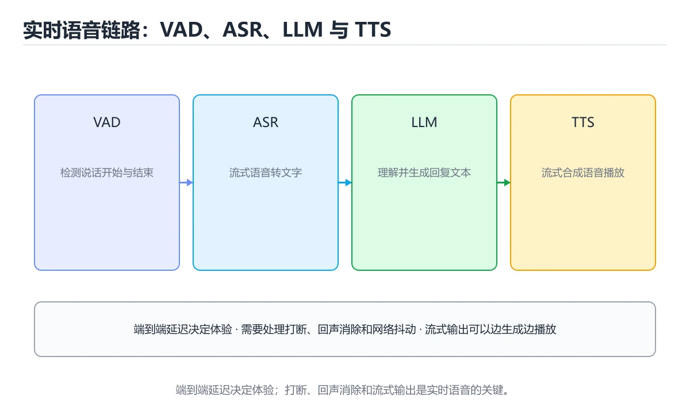
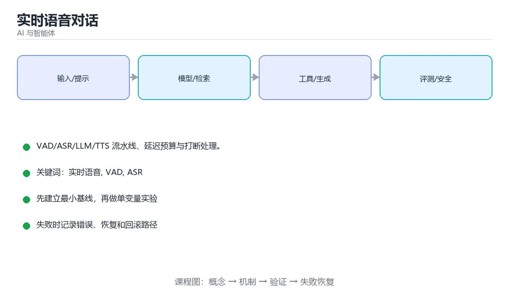

# 本课主题





> 内容更新时间：2026-10-03 · 学习阶段：高级 · 预计用时：15 分钟

## 学习目标

- 能用自己的话解释本课主题解决了什么问题，而不是只背术语。
- 能说清 「实时语音」、「VAD」、「ASR」、「TTS」 之间的关系，并分别举出一个例子。
- 能把本课知识放回「AI 与智能体」的知识体系，说明它和相邻主题的边界。
- 能完成本课练习，并用验收标准检查自己的结果。

> 一句话摘要：VAD/ASR/LLM/TTS 流水线、延迟预算与打断处理。

## 前置知识

- 先完成上一课《Agent 评测实战》；如果已经掌握，可以直接用本课练习自测。
- 开始前先复习：实时语音、VAD、ASR。
- 如果某一步看不懂，先记录具体卡点，完成练习后再回头读一遍。

## 技术管线

```text
麦克风 -> VAD（静音检测）-> ASR（语音转文字）-> LLM（生成回复）
      -> TTS（文字转语音）-> 扬声器播放
```

实时性来自**流水线并行**：ASR 边识别边输出（流式）、LLM 边生成边分句、TTS 收到第一句就开始合成。

## 延迟预算

| 环节 | 目标 | 优化手段 |
| --- | --- | --- |
| 采集与 VAD | < 100 ms | 本地端点检测，减少等待 |
| ASR | < 300 ms（首字） | 流式识别、就近部署 |
| LLM 首 token | < 500 ms | 小模型先行、提示精简、KV 缓存 |
| TTS 首音频 | < 300 ms | 流式合成、预置音色 |
| 网络与播放 | < 100 ms | 就近接入、WebRTC/WebSocket |

端到端目标是「说完到听到回应」控制在 1 秒左右；超过 1.5 秒用户会明显感到卡顿。

## 打断（Barge-in）

用户不等播完就开口时，系统必须立刻停止播放并转而处理新输入：

```python
class VoiceSession:
    def __init__(self):
        self.cancelled = False
    async def speak(self, text: str):
        self.cancelled = False
        async for audio_chunk in tts_stream(text):
            if self.cancelled:            # 被打断立刻中止
                await self.player.stop()
                return
            await self.player.play(audio_chunk)
    async def on_user_speech(self):
        self.cancelled = True             # VAD 检测到用户开口
        await self.asr.start_stream()
```

要点：VAD 要能区分「用户说话」与「扬声器回声」，通常需要回声消除（AEC）。

## 传输协议

| 协议 | 特点 | 适用 |
| --- | --- | --- |
| WebSocket | 双向、实现简单、基于 TCP | 语音助手、字幕 |
| WebRTC | UDP、低延迟、自带回声消除与抖动缓冲 | 实时通话、强交互 |
| HTTP 流式 | 单向、简单 | 只播不说的场景 |

## 工程要点

1. 采样率与编码统一（常见 16 kHz 单声道、PCM/Opus），避免反复转码。
2. 音频分帧处理（20~40 ms 一帧），便于 VAD 与流式识别。
3. 设置静音超时（如 700 ms）判定「说完了」，过短会切断句子，过长会显得迟钝。
4. 多轮对话要维护上下文，同时限制历史长度控制成本。
5. 记录每段延迟（ASR/TTS/首 token），做端到端监控。

## 成本与质量权衡

- 简单指令走小模型或规则命中，复杂问题再交给大模型。
- 常用回复可缓存音频（如「好的」「请稍等」）。
- 语音合成按字符计费，回复要简洁；长内容改为「先播摘要 + 屏幕展示全文」。

## 延迟分解与优化实测方向

| 环节 | 常见耗时 | 优化手段 | 可降幅度参考 |
| --- | --- | --- | --- |
| 端点检测（VAD） | 300~700ms 静音等待 | 自适应阈值、缩短尾部静音 | 100~300ms |
| ASR 首字 | 200~500ms | 流式识别、就近部署、专用模型 | 100~200ms |
| LLM 首 token | 300~800ms | 小模型先行、提示精简、KV 缓存 | 200~400ms |
| TTS 首音频 | 200~500ms | 流式合成、预置常用短语音频 | 100~300ms |
| 网络往返 | 50~300ms | 就近接入、WebRTC 替代 WebSocket | 50~150ms |

优化顺序：先量出各段耗时（打点记录每段首字节时间），再优化占比最大的两段——**通常 VAD 等待与 LLM 首 token 是最大头**，而不是网络。

体验红线：端到端超过 1.5 秒用户就会明显感到卡顿；打断响应（barge-in）超过 300ms 会觉得"抢话抢不动"。这两个数字比任何模型参数都更影响主观感受。

## 本课小结
实时语音体验 = **低延迟 + 可打断 + 稳定识别**。把延迟拆成环节逐项优化，比单纯换更强的模型更有效。

## 管线与延迟预算速查

| 环节 | 典型耗时 | 优化方向 |
| --- | --- | --- |
| 采集与编码 | 10 到 30 ms | 小帧、低延迟编码 |
| VAD 检测 | 20 到 100 ms | 调灵敏度，避免过早切断 |
| 语音识别（ASR） | 100 到 500 ms | 流式识别、就近部署 |
| 大模型推理 | 300 到 2000 ms | 小模型、前缀缓存、流式输出 |
| 语音合成（TTS） | 100 到 400 ms | 流式合成、首包优先 |
| 网络往返 | 20 到 200 ms | 就近接入、QUIC |

经验目标：**端到端首响小于 800 ms**，交互才自然；超过 1.5 秒用户会明显感到卡顿。

| 管线形态 | 延迟 | 可解释性 | 适用 |
| --- | --- | --- | --- |
| 级联 ASR 到 LLM 到 TTS | 较高 | 强，便于替换与调试 | 大多数业务 |
| 端到端语音模型 | 较低 | 弱，难干预 | 追求自然度与低延迟 |
| 半级联（流式 ASR + 流式 TTS） | 中 | 中 | 平衡方案 |

## 打断（Barge-in）处理速查

| 步骤 | 动作 |
| --- | --- |
| 检测 | VAD 判断用户在说话 |
| 停止 | 立即停止当前 TTS 播放 |
| 丢弃 | 清空未播放的音频队列与旧回复 |
| 记录 | 把已播放内容作为上下文保留 |
| 重启 | 开始新一轮 ASR 与推理 |

```python
import time
from collections import deque
from dataclasses import dataclass, field

@dataclass
class VoiceSession:
    """带打断与首响统计的语音会话状态机。"""

    audio_queue: deque = field(default_factory=deque)
    speaking: bool = False
    started_at: float = 0.0
    first_audio_at: float | None = None
    interruptions: int = 0

    def on_user_speech(self) -> None:
        if self.speaking:
            self.interrupt()          # 用户开口立即打断
        self.started_at = time.monotonic()

    def interrupt(self) -> None:
        self.speaking = False
        self.audio_queue.clear()      # 丢弃未播放音频
        self.interruptions += 1

    def push_audio(self, chunk: bytes) -> None:
        if self.first_audio_at is None:
            self.first_audio_at = time.monotonic()
        self.speaking = True
        self.audio_queue.append(chunk)

    def first_response_ms(self) -> float | None:
        if self.first_audio_at is None:
            return None
        return round((self.first_audio_at - self.started_at) * 1000, 1)

def latency_budget(target_ms: int = 800) -> dict:
    """把目标延迟拆成各环节预算，便于分配优化任务。"""
    shares = {"asr": 0.35, "llm": 0.35, "tts": 0.2, "network": 0.1}
    return {name: int(target_ms * ratio) for name, ratio in shares.items()}

session = VoiceSession()
session.on_user_speech()
session.push_audio(b"\x00" * 1024)
print(session.first_response_ms(), latency_budget())
```

## 常见错误对照表

| 容易踩的做法 | 实际现象 | 原因与正确做法 |
| --- | --- | --- |
| 等整句识别完再送模型 | 首响延迟高 | 流式 ASR + 增量推理 |
| TTS 等全文生成完再合成 | 用户等很久 | 按句流式合成，首包优先 |
| VAD 过于激进 | 说话被截断 | 调整灵敏度与静音判定时长 |
| 打断只停播放不清队列 | 旧内容继续冒出 | 清空音频队列与在途请求 |
| 不做回声消除 | 自己的声音被识别为用户输入 | 用 AEC 或半双工策略 |
| 用大模型处理所有请求 | 延迟高 | 小模型优先 + 复杂请求升级 |
| 不监控首响延迟 | 体验退化无感知 | 打点首响与总时长并设告警 |
| 忽略网络抖动 | 偶发长延迟 | 就近接入、抖动缓冲自适应 |
| 全链路串行做重试 | 延迟叠加 | 只对关键环节重试并设上限 |
| 把语音数据长期留存 | 隐私风险 | 明确保留期限，默认不落盘 |

## 自测清单

- [ ] 能画出语音链路各环节的延迟预算。
- [ ] 端到端首响目标控制在 1 秒内。
- [ ] 打断时停止播放、清空队列并保留上下文。
- [ ] 处理回声与半双工场景。
- [ ] 首响与总时长有监控与告警。

## 动手练习

> 本课练习重点：围绕「实时语音、VAD、ASR」完成复述、实验和交付，每个结果都要能被别人检查。

先写评测样例，再改一个提示、模型或数据变量，最后比较质量、成本与安全。

### 练习 1：建立心智模型（10 分钟）

合上教程，用 3～5 句话回答：

1. 本课主题解决了什么问题？
2. 如果没有它，会出现什么具体后果？
3. 它和「VAD」是什么关系？

**验收标准**：至少出现一个本课关键词，并写出一个反例、边界条件或失效场景。

### 练习 2：做一次可控实验（20 分钟）

从正文中选一个最小示例，完成以下操作：

1. 先预测修改一个参数、输入或步骤后的结果。
2. 再实际执行或逐步推演，记录真实结果。
3. 如果结果与预测不同，写出差异原因。

**验收标准**：留下「原例 → 改动 → 预测 → 结果 → 原因」五步记录。

### 练习 3：交付一个小结果（30 分钟）

构造 5 条小型离线样例，写清输入、期望输出、评分标准和失败案例。

任务要求：

- 结果必须能被别人检查，不能只写“我已经理解了”。
- 至少覆盖「实时语音」和「VAD」两个关键词。
- 写出 1 个仍然不确定的问题，以及下一步如何验证。

> 提示：时间有限时优先做练习 1 和练习 2；练习 3 可以拆成两次完成。

## 可运行练习

### 任务 1：先跑通，再解释

```python
import time
from collections import deque
from dataclasses import dataclass, field

@dataclass
class VoiceSession:
    """带打断与首响统计的语音会话状态机。"""

    audio_queue: deque = field(default_factory=deque)
    speaking: bool = False
    started_at: float = 0.0
    first_audio_at: float | None = None
    interruptions: int = 0

    def on_user_speech(self) -> None:
        if self.speaking:
            self.interrupt()          # 用户开口立即打断
        self.started_at = time.monotonic()

    def interrupt(self) -> None:
        self.speaking = False
        self.audio_queue.clear()      # 丢弃未播放音频
        self.interruptions += 1

    def push_audio(self, chunk: bytes) -> None:
        if self.first_audio_at is None:
            self.first_audio_at = time.monotonic()
        self.speaking = True
        self.audio_queue.append(chunk)

    def first_response_ms(self) -> float | None:
        if self.first_audio_at is None:
            return None
        return round((self.first_audio_at - self.started_at) * 1000, 1)

def latency_budget(target_ms: int = 800) -> dict:
    """把目标延迟拆成各环节预算，便于分配优化任务。"""
    shares = {"asr": 0.35, "llm": 0.35, "tts": 0.2, "network": 0.1}
    return {name: int(target_ms * ratio) for name, ratio in shares.items()}

session = VoiceSession()
session.on_user_speech()
session.push_audio(b"\x00" * 1024)
print(session.first_response_ms(), latency_budget())
```

### 任务 2：只改一个条件

### 任务 3：迁移到自己的数据

用同一套思路处理一组你自己的数据或场景，保持输出格式与任务 1 一致。

## 故障现场

### 现场 1：本课的 实时语音 常规用例通过，但边界用例失败

**症状**：在本课的练习或生产场景里出现“本课的 实时语音 常规用例通过，但边界用例失败”。

**复现**：准备一组最小输入，只保留触发“本课的 实时语音 常规用例通过，但边界用例失败”的必要条件，连续运行两次确认结果稳定。

**定位**：围绕“实时语音 的前置条件与取值边界没有写进代码，默认值掩盖了空值和极值”检查调用链、输入数据和环境配置，先验证假设再改代码。

**预防**：把“本课的 实时语音 常规用例通过，但边界用例失败”写成一条自动化用例，并在本课的验收清单里保留对应检查项。

### 现场 2：本课的 VAD 结果在两次运行之间不一致

**症状**：在本课的练习或生产场景里出现“本课的 VAD 结果在两次运行之间不一致”。

**复现**：准备一组最小输入，只保留触发“本课的 VAD 结果在两次运行之间不一致”的必要条件，连续运行两次确认结果稳定。

**定位**：围绕“VAD 依赖了当前版本、执行顺序或共享状态，单次运行无法暴露差异”检查调用链、输入数据和环境配置，先验证假设再改代码。

**预防**：把“本课的 VAD 结果在两次运行之间不一致”写成一条自动化用例，并在本课的验收清单里保留对应检查项。

### 现场 3：离线评测分数很高，线上仍然频繁给出错误答案

**定位**：围绕“评测集与真实输入分布不一致，实时语音 的提示词或检索结果没有覆盖失败场景”检查调用链、输入数据和环境配置，先验证假设再改代码。

## 深入补充：本课主题 的取舍与边界

### 一、把概念放回真实约束

学习本课主题时，最容易只记住结论而忽略前提。先写出三个约束：数据规模、时间预算、可接受的失败方式；再判断 实时语音 与 VAD 在这些约束下是否仍然成立。只要约束改变，原来的最优解就可能变成错误解。

| 维度 | 要回答的问题 | 常见做法 | 失败信号 |
| --- | --- | --- | --- |
| 数据 | 实时语音 的训练或检索数据从哪来、质量如何 | 清洗、去重、标注与版本化 | 评测集泄漏或分布漂移 |
| 模型 | VAD 的能力边界与成本是多少 | 基线对比、离线评测、灰度发布 | 指标好看但线上任务失败 |
| 评测 | 如何证明改动真的有效 | 固定评测集、人工抽检、A/B | 只比较单例输出 |
| 安全 | 失败时会不会泄露或越权 | 权限校验、内容过滤、审计 | 提示注入或数据外泄 |

### 二、三个容易混淆的边界

2. **把“平均值”当成“全部”**：实时语音 的指标好看，不代表尾部请求、冷启动或失败重试也好看。
3. **把“当前版本”当成“永久行为”**：VAD 依赖的默认值、API 或性能特征都可能随版本变化，需要固定版本并保留回归用例。

### 三、一个生产场景

假设团队要在真实系统里使用本课主题：第一周先做小流量验证，记录 实时语音 的基线与异常；第二周扩大输入规模，观察 VAD 是否成为瓶颈；第三周再做故障演练，主动注入超时、重复请求和依赖不可用，确认系统能降级、能重试、能恢复。每一步都要留下指标、日志和结论，而不是只留下“感觉更快了”。

### 四、自测清单

- 能否用一句话说出本课主题解决的核心问题与不适用场景？
- 能否画出 实时语音 的数据流或状态变化，并标出失败路径？
- 能否给出一个反例，证明某个看似合理的结论在边界条件下不成立？
- 能否写出一条可复现的验证命令，让别人独立得到相同结论？

### 五、AI 工程补充

在本课主题里，模型输出只是系统的一部分：输入要先经过权限与数据质量检查，检索或工具调用要有超时和降级，输出要经过引用核验或规则校验，最后记录 token、延迟、失败类型和人工反馈。评测时至少准备固定题、边界题和对抗题，并把 实时语音 与 VAD 的指标分开记录；否则一次提示词改动看似提升体验，实际可能只是评测样本泄漏或随机波动。

## 本课复习清单

离开本课前，逐项确认：

- [ ] 不看解析，能说出「本课主题的正确管线顺序是？」的判断依据。
- [ ] 不看解析，能说出「Barge-in（打断）指什么？」的判断依据。
- [ ] 不看解析，能说出「降低端到端延迟最有效的手段是？」的判断依据。
- [ ] 不看解析，能说出「语音活动检测（VAD）的作用是？」的判断依据。
- [ ] 不看解析，能说出「端到端语音模型相比「ASR→LLM→TTS」级联管线的优势是？」的判断依据。
- [ ] 至少运行一次本课示例，记录输入、输出和一个边界情况。
- [ ] 把本课最容易混淆的两个概念写成一句话对照。

| 复盘项 | 记录 |
| --- | --- |
| 已经能独立解释的考点 |  |
| 仍然说不清的概念 |  |
| 下一步验证动作 |  |

## 术语速查

| 术语 | 本课语境 |
| --- | --- |
| `实时语音` | 本课围绕该主题展开，结合正文与代码示例理解它的适用边界。 |
| `VAD` | 本课围绕该主题展开，结合正文与代码示例理解它的适用边界。 |
| `ASR` | 本课围绕该主题展开，结合正文与代码示例理解它的适用边界。 |
| `TTS` | 本课围绕该主题展开，结合正文与代码示例理解它的适用边界。 |
| `打断` | 本课围绕该主题展开，结合正文与代码示例理解它的适用边界。 |

## 考点精讲

### 考点 1：围绕“实时语音对话”中的 实时语音、VAD、ASR，下列哪两项是本课强调的实践判断？

- **判断依据**：正确答案包括「学习 实时语音 时要同时说明输入、输出和失败路径，不能只看正常流程」、「验证 VAD 时要固定版本并覆盖边界输入，结论才可复现」。正确答案是学习 实时语音 时要同时说明输入、输出和失败路径。本课把本课主题拆成概念、示例与故障现场三部分，因此判断 实时语音 时必须同时交代输入、输出和失败路径，这使“学习 实时语音 时要同时说明输入、输出和失败路径，不能只看正常流程”成立。在本课主题里，判断 VAD 时要固定版本与边界输入，所以“验证 VAD 时要固定版本并覆盖边界输入，结论才可复现”才可复现。

### 考点 2：Barge-in（打断）指什么？

- **判断依据**：打断是实时语音体验的必备能力，需要 VAD 与回声消除配合。其他选项：Barge-in 指用户中途开口时立即停止播放并处理新输入。解题的关键不是记住孤立术语，而是确认「用户中途开口时立即停止播放并处理新输入」是否完整覆盖题干的输入、输出和失败路径，并排除「音频降噪（仅部分场景成立）」、「网络中断」这类相邻概念。

### 考点 3：下面这段 Python 代码复现了“实时语音对话”中 实时语音、VAD、ASR 相关的一个常见故障，哪一项最准确地解释了问题？

- **判断依据**：符合题干条件的是「遍历列表时直接删除元素，后续元素被跳过（ai_realtime_voice 第 3 题）；应遍历副本或构造新列表」（ai_realtime_voice 第 3 题）。符合题干条件的是遍历列表时直接删除元素，后续元素被跳过（ai_realtime_voice 第 3 题）。应遍历副本或构造新列表（ai_realtime_voice 第 3 题）。符合题干条件的是遍历列表时直接删除元素，后续元素被跳过（airealtimevoice 第 3 题）。

### 考点 4：语音活动检测（VAD）的作用是？

- **判断依据**：VAD 的灵敏度直接影响误打断与响应延迟，是需要调参的关键环节。其他选项：VAD 判断用户是否在说话。围绕 语音活动检测（VAD）的作用是。这道题要求区分概念与边界，「判断用户是否在说话」只有在题干给出的前提下才成立，而「合成更自然的声音」、「压缩音频体积」缺少同一组条件。

### 考点 5：端到端语音模型相比「ASR→LLM→TTS」级联管线的优势是？

- **判断依据**：级联管线可解释性与可替换性更好，端到端则在延迟与自然度上占优。其他选项：端到端语音模型的优势是减少级联误差与延迟，并能利用语气。判断这类题时，要把「减少级联误差与延迟，并能利用语气」放回题干限定的对象、输入和边界，「不需要任何训练数据」、「成本一定更低」 等说法虽然包含相关术语，但范围或前提与本题不一致。

### 考点 6：补全代码：「实时语音对话」示例中，下面这行代码缺少哪个关键字或函数名？请填入 ____。

`self.started_at = ____.monotonic()`

- **判断依据**：围绕 补全代码：本课主题示例中，下面这行代码缺少哪个关键字或函数名… 作答时，先用实时语音建立输入与输出的基线，再把time代入边界条件核对，结论才能复现。解题的关键不是记住孤立术语，而是确认「time」是否完整覆盖题干的输入、输出和失败路径，并排除这类相邻概念。

## English Overview

**Title:** Real-time Voice

**Summary:** Pipeline, latency budget and barge-in.

**Category:** AI & Agents
**Level:** 高级
**Key terms:** 实时语音, VAD, ASR, TTS, 打断

## 内容元数据

- 内容版本：v2.0
- 最后更新：2026-10-03
- 学习阶段：高级
- 适用环境：主流大模型 API、开源模型与向量数据库
- 内容来源：内置结构化课程与工程实践整理
- 相关主题：实时语音、VAD、ASR、TTS、打断
- 质量版本：P0 测验标准 + P1 覆盖扩展 + P2 体验补全


## 参考资料与复核

- 最后复核：2026-10-04
- 下次复核：2027-04-04
- 复核范围：版本兼容、API 行为、安全建议与工程实践
- 来源性质：官方文档、标准或权威教材；正文为离线教学重组

| 参考资料 | 本课用途 |
| --- | --- |
| [Google AI 文档](https://ai.google.dev/gemini-api/docs) | Gemini API 与多模态 |
| [Hugging Face 文档](https://huggingface.co/docs) | 模型、数据集与推理 |
| [LlamaIndex 文档](https://docs.llamaindex.ai/) | 索引、检索与数据框架 |

> 「实时语音对话」的链接用于离线阅读后的延伸核对；App 不会自动联网。
