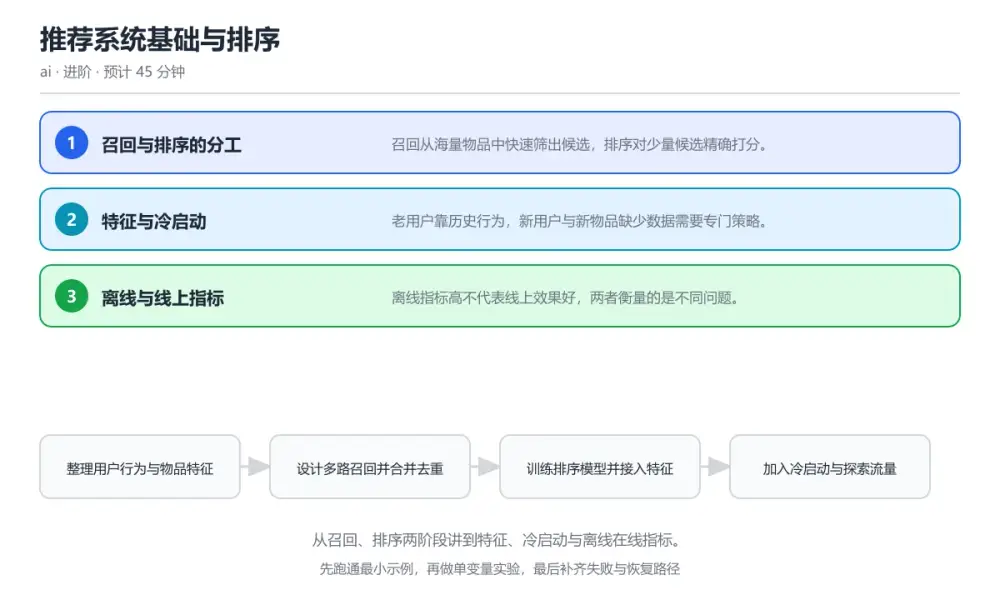
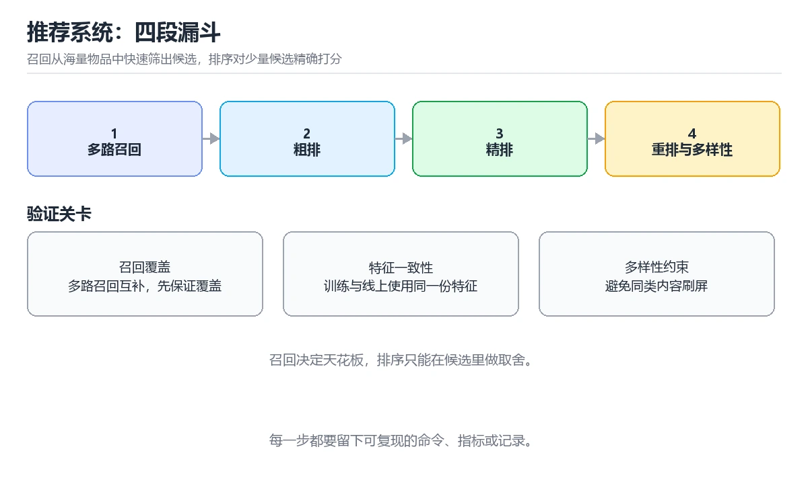

# 推荐系统基础与排序

> 内容更新时间：2026-10-06 · 学习阶段：进阶 · 预计用时：40 分钟

分类：ai。关键词：推荐系统、召回、排序、冷启动、评价指标。从召回、排序两阶段讲到特征、冷启动与离线在线指标。



## 本节知识框架

**课程定位**：所属分类 `ai`（AI 与智能体），课程主题 `推荐系统基础与排序`，学习阶段 进阶，建议用时 40 分钟。

本课主线：从召回、排序两阶段讲到特征、冷启动与离线在线指标。

**学完本课应当能够**
- 说清 `召回` 与 `排序` 的含义与区别，并各举一个正例和一个反例。
- 用本课示例验证 `冷启动` 的行为，记录输入、输出与失败条件。
- 遇到「新物品长期没有曝光」这类问题时，能说出触发条件与修复顺序。

### 从概念到验证的学习链条

1. `召回`：先掌握 从全量物品中快速筛出候选集合的阶段，再用它解释 `排序` 为什么会出现。
2. `排序`：先掌握 对候选集合精确打分并排序的阶段，再用它解释 `冷启动` 为什么会出现。
3. `冷启动`：先掌握 新用户或新物品缺少历史数据时的处理策略，再用它解释 `探索流量` 为什么会出现。
4. `探索流量`：先掌握 为获取新反馈而分配的一部分流量，再用它解释 `选择偏差` 为什么会出现。
5. `选择偏差`：先掌握 日志只记录了旧策略曝光过的物品所带来的偏差，再用它解释 本课示例的观察结果 为什么会出现。

**先修与衔接**：本课是「AI 与智能体」分类的第 31 课。当前没有登记显式先修或后续课程；课程主线是从召回、排序两阶段讲到特征、冷启动与离线在线指标。学完后按 `ai` 分类顺序继续。

### 完成判据

- **定义关**：不看正文也能说明 `召回` 是 从全量物品中快速筛出候选集合的阶段，并指出一个反例。
- **机制关**：能按“输入 → 转换 → 输出 → 验证”复述 `推荐系统基础与排序`，而不是只背结论。
- **示例关**：能运行或推演 `推荐系统基础与排序` 的 `text` 示例，并说明一个真实出现的标识符或字面量。
- **证据关**：能指出 `推荐系统基础与排序` 示例里的 调用了 `recommend()`，并说明它支持或反驳了本课的哪一条结论。
- **排错关**：能复现 新物品长期没有曝光，记录现象并按 保留固定比例探索位置，用内容特征给新物品初始打分并观察反馈 修复。
- **迁移关**：能把 `推荐系统`、`召回`、`排序`、`冷启动` 放进一个与 `推荐系统基础与排序` 不同的项目场景，并保持输入与验证条件可追踪。
- **复盘关**：学完 `推荐系统基础与排序` 后，用一句话写下仍然不确定的结论，并列出下一次验证需要的输入、环境和成功判据。

### 复习清单

- [ ] 能不看正文复述本课核心术语，并指出一个边界或反例。
- [ ] 能运行或推演本课示例，记录输入、输出与失败现象。
- [ ] 能完成一次自测，并把错题对照错误表定位原因。

**本课配图**



## 核心概念定义

| 术语 | 操作性定义 | 常见边界与风险 |
| --- | --- | --- |
| 召回 | 从全量物品中快速筛出候选集合的阶段。 | 只在「从全量物品中快速筛出候选集合的阶段」这一前提下成立，换输入或换环境要重新验证。 |
| 排序 | 对候选集合精确打分并排序的阶段。 | 易错：只按历史点击率排序，没有探索流量；正确做法是保留固定比例探索位置，用内容特征给新物品初始打分并观察反馈。 |
| 冷启动 | 新用户或新物品缺少历史数据时的处理策略。 | 只在「新用户或新物品缺少历史数据时的处理策略」这一前提下成立，换输入或换环境要重新验证。 |
| 探索流量 | 为获取新反馈而分配的一部分流量。 | 易错：只按历史点击率排序，没有探索流量；正确做法是保留固定比例探索位置，用内容特征给新物品初始打分并观察反馈。 |
| 选择偏差 | 日志只记录了旧策略曝光过的物品所带来的偏差。 | 只在「日志只记录了旧策略曝光过的物品所带来的偏差」这一前提下成立，换输入或换环境要重新验证。 |

## 原理与运行机制

### 机制总览

**教材衔接：核心知识**

### 1. 召回与排序的分工

召回从海量物品中快速筛出候选，排序对少量候选精确打分。

多路召回并行执行，包括协同过滤、向量相似与热门策略，合并去重后交给排序模型，排序模型使用更丰富的特征做精排。

在推荐系统基础与排序里可以这样验证：在本课示例里对比只有热门召回与多路召回时的候选覆盖率。

边界：召回阶段漏掉的物品排序阶段无法补救，召回质量决定效果上限。

工程视角：监控每路召回的贡献占比与覆盖率，长期贡献过低的策略应下线或重训。

### 2. 特征与冷启动

老用户靠历史行为，新用户与新物品缺少数据需要专门策略。

用户侧特征包括历史交互与画像，物品侧包括内容标签与统计量，新物品依靠内容特征与探索流量获取初始反馈。

在推荐系统基础与排序里可以这样验证：在本课示例里给新物品分配探索流量，观察其获得曝光后的点击率变化。

边界：完全依赖历史行为会让新物品永远没有机会，形成强者恒强的循环。

工程视角：保留固定比例的探索流量并记录探索成本，用内容特征补齐新物品的初始打分。

### 3. 离线与线上指标

离线指标高不代表线上效果好，两者衡量的是不同问题。

离线常用排序质量与命中率，线上关注点击率、转化率与留存；离线数据来自既有策略产生的日志，存在选择偏差。

在推荐系统基础与排序里可以这样验证：在本课示例里对比离线命中率提升与线上点击率变化，观察二者背离的情况。

边界：只用离线指标决策会不断强化已有策略的偏差，新策略很难被验证。

工程视角：上线前用小流量在线实验验证，离线指标作为筛选门槛而不是最终结论。

### 机制拆解：每一步的输入、动作与输出

#### 1. `召回`
- 输入：`推荐系统`；本步把 从全量物品中快速筛出候选集合的阶段 当作判断规则。
- 动作：围绕 `召回` 保留中间状态，并记录它与 `排序` 的对应关系。
- 输出：`排序`，它可以被下一段代码、测试或记录继续使用。
- `召回` 的失败条件：只在「从全量物品中快速筛出候选集合的阶段」这一前提下成立，换输入或换环境要重新验证。

#### 2. `排序`
- 输入：`召回`；本步把 对候选集合精确打分并排序的阶段 当作判断规则。
- 动作：围绕 `排序` 保留中间状态，并记录它与 `冷启动` 的对应关系。
- 输出：`冷启动`，它可以被下一段代码、测试或记录继续使用。
- `排序` 的失败条件：当新物品长期没有曝光时，会出现只按历史点击率排序，没有探索流量。

#### 3. `冷启动`
- 输入：`排序`；本步把 新用户或新物品缺少历史数据时的处理策略 当作判断规则。
- 动作：围绕 `冷启动` 保留中间状态，并记录它与 `探索流量` 的对应关系。
- 输出：`探索流量`，它可以被下一段代码、测试或记录继续使用。
- `冷启动` 的失败条件：只在「新用户或新物品缺少历史数据时的处理策略」这一前提下成立，换输入或换环境要重新验证。

#### 4. `探索流量`
- 输入：`冷启动`；本步把 为获取新反馈而分配的一部分流量 当作判断规则。
- 动作：围绕 `探索流量` 保留中间状态，并记录它与 `选择偏差` 的对应关系。
- 输出：`选择偏差`，它可以被下一段代码、测试或记录继续使用。
- `探索流量` 的失败条件：当新物品长期没有曝光时，会出现只按历史点击率排序，没有探索流量。

#### 5. `选择偏差`
- 输入：`探索流量`；本步把 日志只记录了旧策略曝光过的物品所带来的偏差 当作判断规则。
- 动作：围绕 `选择偏差` 保留中间状态，并记录它与 `recommend` 的对应关系。
- 输出：`recommend`，它可以被下一段代码、测试或记录继续使用。
- `选择偏差` 的失败条件：只在「日志只记录了旧策略曝光过的物品所带来的偏差」这一前提下成立，换输入或换环境要重新验证。

### 示例中的可观察事实

1. 调用了 `recommend()`；它对应的课程主题是 `推荐系统基础与排序`。
2. 调用了 `set()`；它对应的课程主题是 `推荐系统基础与排序`。
3. 调用了 `recall_by_user_vector()`；它对应的课程主题是 `推荐系统基础与排序`。
4. 调用了 `recall_by_category_affinity()`；它对应的课程主题是 `推荐系统基础与排序`。
5. 调用了 `recall_trending()`；它对应的课程主题是 `推荐系统基础与排序`。
6. 调用了 `build_features()`；它对应的课程主题是 `推荐系统基础与排序`。
7. 调用了 `predict()`；它对应的课程主题是 `推荐系统基础与排序`。
8. 调用了 `sorted()`；它对应的课程主题是 `推荐系统基础与排序`。

### 复现实验记录

- 环境：`推荐系统基础与排序` 使用 `text` 示例，固定 `推荐系统`、`召回`、`排序`、`冷启动` 作为第一组条件。
- 首轮输入：先确认 调用了 `recommend()`，预测 `召回` 会怎样变化。
- 基线观察：记录命令、输入、输出和错误原文，不用截图代替可复制的文本。
- 单变量修改：只改变 `推荐系统`，观察 `选择偏差` 是否仍满足定义。
- 失败注入：复现 新物品长期没有曝光，确认现象是 只按历史点击率排序，没有探索流量。
- 记录结论：把“修改前、修改后、预期变化、实际变化”写成四列表，这样复盘 `推荐系统基础与排序` 时才能区分概念错误与实现错误。

## 典型应用场景

**教材衔接：深度拓展与实战**

### 机制拆解 1：召回与排序的分工

多路召回并行执行，包括协同过滤、向量相似与热门策略，合并去重后交给排序模型，排序模型使用更丰富的特征做精排。

落地时先确认前提：召回阶段漏掉的物品排序阶段无法补救，召回质量决定效果上限。再把结论写进检查表，让下一位同学可以按同样的输入复现。

工程做法：监控每路召回的贡献占比与覆盖率，长期贡献过低的策略应下线或重训。

### 机制拆解 2：特征与冷启动

用户侧特征包括历史交互与画像，物品侧包括内容标签与统计量，新物品依靠内容特征与探索流量获取初始反馈。

落地时先确认前提：完全依赖历史行为会让新物品永远没有机会，形成强者恒强的循环。再把结论写进检查表，让下一位同学可以按同样的输入复现。

工程做法：保留固定比例的探索流量并记录探索成本，用内容特征补齐新物品的初始打分。

### 机制拆解 3：离线与线上指标

离线常用排序质量与命中率，线上关注点击率、转化率与留存；离线数据来自既有策略产生的日志，存在选择偏差。

落地时先确认前提：只用离线指标决策会不断强化已有策略的偏差，新策略很难被验证。再把结论写进检查表，让下一位同学可以按同样的输入复现。

工程做法：上线前用小流量在线实验验证，离线指标作为筛选门槛而不是最终结论。

### 机制对照表

| 概念 | 解决什么问题 | 关键前提 | 失败信号 |
| --- | --- | --- | --- |
| 召回与排序的分工 | 召回从海量物品中快速筛出候选，排序对少量候选精确打分。 | 召回阶段漏掉的物品排序阶段无法补救，召回质量决定效果上限。 | 监控每路召回的贡献占比与覆盖率，长期贡献过低的策略应下线或重训。 |
| 特征与冷启动 | 老用户靠历史行为，新用户与新物品缺少数据需要专门策略。 | 完全依赖历史行为会让新物品永远没有机会，形成强者恒强的循环。 | 保留固定比例的探索流量并记录探索成本，用内容特征补齐新物品的初始打分。 |
| 离线与线上指标 | 离线指标高不代表线上效果好，两者衡量的是不同问题。 | 只用离线指标决策会不断强化已有策略的偏差，新策略很难被验证。 | 上线前用小流量在线实验验证，离线指标作为筛选门槛而不是最终结论。 |

### 自测问答

**问 1**：召回阶段漏掉相关物品会造成什么后果？

**答**：排序阶段无法补救，效果上限被压低。排序只在候选集合内工作，召回没找到的物品不会被展示，因此召回覆盖率决定整体效果上限。 正确选项「排序阶段无法补救，效果上限被压低」对应《推荐系统基础与排序》的要点「召回与排序的分工」：召回从海量物品中快速筛出候选，排序对少量候选精确打分。判断「召回与排序的分工」时先确认前提是否成立，再回到《推荐系统基础与排序》的示例核对一次；把别的语言或框架的默认做法直接搬到召回与排序的分工上，往往会在本课的边界条件里失效。

**问 2**：离线指标提升但线上下降，最可能的原因是？

**答**：离线数据来自旧策略，存在选择偏差。离线日志由既有策略产生，只覆盖它曝光过的物品，用这种数据评估新策略会系统性乐观。 正确选项「离线数据来自旧策略，存在选择偏差」对应《推荐系统基础与排序》的要点「特征与冷启动」：老用户靠历史行为，新用户与新物品缺少数据需要专门策略。判断「特征与冷启动」时先确认前提是否成立，再回到《推荐系统基础与排序》的示例核对一次；借鉴相邻主题的经验之前，先核对特征与冷启动的前提是否成立。

**问 3**：改善新物品冷启动可以采取哪些做法？（多选）

**答**：使用内容标签特征；保留固定探索流量；对新物品单独建立初始统计。内容特征、探索流量与独立统计共同为新物品创造获取反馈的机会；只推热门会让新物品永远没有机会。 正确选项「使用内容标签特征；保留固定探索流量；对新物品单独建立初始统计」对应《推荐系统基础与排序》的要点「离线与线上指标」：离线指标高不代表线上效果好，两者衡量的是不同问题。判断「离线与线上指标」时先确认前提是否成立，再回到《推荐系统基础与排序》的示例核对一次；记住离线与线上指标的结论之外还要记住适用条件，换一个输入往往就不成立了。

**问 4**：请按一次推荐请求的处理顺序排列。

**答**：多路召回生成候选。召回先扩大候选，去重后交给排序，排序结果再经多样性与规则调整，最后返回并记录反馈用于后续训练。 正确选项「多路召回生成候选；合并去重控制规模；拼接特征并打分排序；应用多样性与规则调整；返回结果并记录曝光反馈」对应《推荐系统基础与排序》的要点「召回与排序的分工」：召回从海量物品中快速筛出候选，排序对少量候选精确打分。判断「召回与排序的分工」时先确认前提是否成立，再回到《推荐系统基础与排序》的示例核对一次；干扰项常常是相邻主题里成立的结论，只有按召回与排序的分工的输入与约束判断才能排除。

**问 5**：阅读这段排序代码，问题是什么？

**答**：只用点击率排序且无多样性约束，会导致结果高度同质。单一目标加无约束返回会让同类内容占满列表，短期点击可能上升，但用户疲劳与长期留存会下降。 正确选项「只用点击率排序且无多样性约束，会导致结果高度同质」对应《推荐系统基础与排序》的要点「特征与冷启动」：老用户靠历史行为，新用户与新物品缺少数据需要专门策略。判断「特征与冷启动」时先确认前提是否成立，再回到《推荐系统基础与排序》的示例核对一次；把特征与冷启动的做法换到别的约束下未必成立，先确认边界再决定答案。


### 工程检查表

- [ ] 整理用户行为与物品特征
- [ ] 设计多路召回并合并去重
- [ ] 训练排序模型并接入特征
- [ ] 加入冷启动与探索流量
- [ ] 在线实验验证并回收反馈
- [ ] 【召回与排序的分工】监控每路召回的贡献占比与覆盖率，长期贡献过低的策略应下线或重训。
- [ ] 【特征与冷启动】保留固定比例的探索流量并记录探索成本，用内容特征补齐新物品的初始打分。
- [ ] 【离线与线上指标】上线前用小流量在线实验验证，离线指标作为筛选门槛而不是最终结论。


### 结论与下一步

- **新物品长期没有曝光**：典型现象是只按历史点击率排序，没有探索流量；正确做法是保留固定比例探索位置，用内容特征给新物品初始打分并观察反馈。
- **离线指标提升线上反而下降**：典型现象是只用既有策略日志做离线评估且直接全量上线；正确做法是改用小流量在线实验验证，离线指标只作为候选筛选门槛。
- **推荐结果高度同质**：典型现象是排序只优化点击率，没有多样性约束；正确做法是在排序后加入类目或作者维度的打散约束，并监控结果分布。

### 最小验证场景

- 准备：保留 `text` 示例的原始输入，先记录 `推荐系统基础与排序` 的基线输出和完整运行命令。
- 观察：先核对 调用了 `recommend()`，再改变一个与 `召回` 相关的条件。
- 判定：新结果与 `推荐系统基础与排序` 的基线不同不等于错误；只有当差异破坏了 `召回` 的定义或错误表中的约束，才判定为失败。

### 选择与边界

- 使用 `召回` 时，先满足它的定义：从全量物品中快速筛出候选集合的阶段；只在「从全量物品中快速筛出候选集合的阶段」这一前提下成立，换输入或换环境要重新验证。
- 使用 `排序` 时，先满足它的定义：对候选集合精确打分并排序的阶段；易错：只按历史点击率排序，没有探索流量；正确做法是保留固定比例探索位置，用内容特征给新物品初始打分并观察反馈。
- 使用 `冷启动` 时，先满足它的定义：新用户或新物品缺少历史数据时的处理策略；只在「新用户或新物品缺少历史数据时的处理策略」这一前提下成立，换输入或换环境要重新验证。
- 使用 `探索流量` 时，先满足它的定义：为获取新反馈而分配的一部分流量；易错：只按历史点击率排序，没有探索流量；正确做法是保留固定比例探索位置，用内容特征给新物品初始打分并观察反馈。
- 使用 `选择偏差` 时，先满足它的定义：日志只记录了旧策略曝光过的物品所带来的偏差；只在「日志只记录了旧策略曝光过的物品所带来的偏差」这一前提下成立，换输入或换环境要重新验证。

## 代码/协议/SQL 示例

**教材衔接：关键流程**

```text
整理用户行为与物品特征 → 设计多路召回并合并去重 → 训练排序模型并接入特征 → 加入冷启动与探索流量 → 在线实验验证并回收反馈
```

1. 整理用户行为与物品特征
2. 设计多路召回并合并去重
3. 训练排序模型并接入特征
4. 加入冷启动与探索流量
5. 在线实验验证并回收反馈

```python
def recommend(user_id, top_k=20):
    """两阶段推荐：多路召回取候选，排序模型精排。"""
    candidates = set()
    candidates |= recall_by_user_vector(user_id, 200)   # 向量相似召回
    candidates |= recall_by_category_affinity(user_id, 150)  # 类目偏好召回
    candidates |= recall_trending(100)                  # 热门兜底，兼顾冷启动

    features = build_features(user_id, candidates)      # 拼接用户、物品与交叉特征
    scores = ranker.predict(features)                   # 排序模型打分

    ranked = sorted(candidates, key=lambda item: -scores[item])
    diversified = diversify(ranked, max_per_category=3)  # 控制同质化
    return diversified[:top_k]

# 新物品通过固定探索流量获得初始反馈
def exploration_slots(k=5):
    return recall_new_items(k)   # 每次请求保留少量位置给新物品
```

### 示例精读：先找证据，再改一个条件

1. 调用了 `recommend()`；它出现在 `推荐系统基础与排序` 的示例中，阅读时先确认它前后各发生了什么。
2. 调用了 `set()`；它出现在 `推荐系统基础与排序` 的示例中，阅读时先确认它前后各发生了什么。
3. 调用了 `recall_by_user_vector()`；它出现在 `推荐系统基础与排序` 的示例中，阅读时先确认它前后各发生了什么。
4. 调用了 `recall_by_category_affinity()`；它出现在 `推荐系统基础与排序` 的示例中，阅读时先确认它前后各发生了什么。
5. 调用了 `recall_trending()`；它出现在 `推荐系统基础与排序` 的示例中，阅读时先确认它前后各发生了什么。
6. 调用了 `build_features()`；它出现在 `推荐系统基础与排序` 的示例中，阅读时先确认它前后各发生了什么。
7. 调用了 `predict()`；它出现在 `推荐系统基础与排序` 的示例中，阅读时先确认它前后各发生了什么。
8. 调用了 `sorted()`；它出现在 `推荐系统基础与排序` 的示例中，阅读时先确认它前后各发生了什么。
- 在 `推荐系统基础与排序` 中与 `召回` 对照：示例必须能支持 从全量物品中快速筛出候选集合的阶段，否则说明这一段还缺少实现或验证步骤。
- 在 `推荐系统基础与排序` 中与 `排序` 对照：示例必须能支持 对候选集合精确打分并排序的阶段，否则说明这一段还缺少实现或验证步骤。
- 在 `推荐系统基础与排序` 中与 `冷启动` 对照：示例必须能支持 新用户或新物品缺少历史数据时的处理策略，否则说明这一段还缺少实现或验证步骤。
- 在 `推荐系统基础与排序` 中与 `探索流量` 对照：示例必须能支持 为获取新反馈而分配的一部分流量，否则说明这一段还缺少实现或验证步骤。

## 时间/空间复杂度或性能分析

**性能关注点（推荐系统基础与排序）**：算力与显存决定可行规模：记录训练或推理耗时、显存峰值与模型精度，换数据集要重新评估。

**本课特有开销（推荐系统基础与排序 · 推荐系统）**：比较次数与内存移动决定开销，注意稳定性与额外空间。

**测量方法**：以 `推荐系统基础与排序` 的 `推荐系统` 场景为对象，固定输入跑一遍记录基线，再把规模或并发度提高一个数量级复测；两次结果的差值与波动范围才是结论依据。

### 需要控制的变量与记录项

- `推荐系统基础与排序` 的 `推荐系统`：固定它的版本、输入范围和资源上限，分别记录速度、内存与失败率的变化。
- `推荐系统基础与排序` 的 `召回`：固定它的版本、输入范围和资源上限，分别记录速度、内存与失败率的变化。
- `推荐系统基础与排序` 的 `排序`：固定它的版本、输入范围和资源上限，分别记录速度、内存与失败率的变化。
- `推荐系统基础与排序` 的 `冷启动`：固定它的版本、输入范围和资源上限，分别记录速度、内存与失败率的变化。
- `推荐系统基础与排序` 的 `评价指标`：固定它的版本、输入范围和资源上限，分别记录速度、内存与失败率的变化。
- `推荐系统基础与排序` 中 `召回` 的边界：只在「从全量物品中快速筛出候选集合的阶段」这一前提下成立，换输入或换环境要重新验证。达到边界时不要外推，必须重新测量。
- `推荐系统基础与排序` 中 `排序` 的边界：易错：只按历史点击率排序，没有探索流量；正确做法是保留固定比例探索位置，用内容特征给新物品初始打分并观察反馈。达到边界时不要外推，必须重新测量。
- `推荐系统基础与排序` 中 `冷启动` 的边界：只在「新用户或新物品缺少历史数据时的处理策略」这一前提下成立，换输入或换环境要重新验证。达到边界时不要外推，必须重新测量。
- `推荐系统基础与排序` 中 `探索流量` 的边界：易错：只按历史点击率排序，没有探索流量；正确做法是保留固定比例探索位置，用内容特征给新物品初始打分并观察反馈。达到边界时不要外推，必须重新测量。
- `推荐系统基础与排序` 中 `选择偏差` 的边界：只在「日志只记录了旧策略曝光过的物品所带来的偏差」这一前提下成立，换输入或换环境要重新验证。达到边界时不要外推，必须重新测量。
- `推荐系统基础与排序` 的代码证据：先验证 调用了 `recommend()`，再记录该路径的输入规模与耗时；只看代码行数不能推出复杂度。

## 常见误区与易错点

| 容易写错的做法 | 实际现象 | 原因与正确做法 |
| --- | --- | --- |
| 新物品长期没有曝光 | 只按历史点击率排序，没有探索流量。 | 保留固定比例探索位置，用内容特征给新物品初始打分并观察反馈。 |
| 离线指标提升线上反而下降 | 只用既有策略日志做离线评估且直接全量上线。 | 改用小流量在线实验验证，离线指标只作为候选筛选门槛。 |
| 推荐结果高度同质 | 排序只优化点击率，没有多样性约束。 | 在排序后加入类目或作者维度的打散约束，并监控结果分布。 |

### 现场 1：新物品长期没有曝光

**症状**：只按历史点击率排序，没有探索流量。

**根因与修复**：保留固定比例探索位置，用内容特征给新物品初始打分并观察反馈。

**自检**：在本课示例里复现「新物品长期没有曝光」，改成保留固定比例探索位置，用内容特征给新物品初始打分并观察反馈后重跑；如果症状消失且失败路径按预期变化，说明定位正确。

### 现场 2：离线指标提升线上反而下降

**症状**：只用既有策略日志做离线评估且直接全量上线。

**根因与修复**：改用小流量在线实验验证，离线指标只作为候选筛选门槛。

**自检**：在本课示例里复现「离线指标提升线上反而下降」，改成改用小流量在线实验验证，离线指标只作为候选筛选门槛后重跑；如果症状消失且失败路径按预期变化，说明定位正确。

### 现场 3：推荐结果高度同质

**症状**：排序只优化点击率，没有多样性约束。

**根因与修复**：在排序后加入类目或作者维度的打散约束，并监控结果分布。

**自检**：在本课示例里复现「推荐结果高度同质」，改成在排序后加入类目或作者维度的打散约束，并监控结果分布后重跑；如果症状消失且失败路径按预期变化，说明定位正确。

## 与其他知识点的关系

**教材衔接：复习与迁移**


### 迁移练习

- **术语归属**：`召回`、`排序`、`冷启动` 的定义以本课「核心概念定义」为准，换到其他课程时先确认定义是否被改写。

### 容易混淆的相邻概念

- `召回` 与 `排序`：前者强调 从全量物品中快速筛出候选集合的阶段；后者强调 对候选集合精确打分并排序的阶段。判断时分别检查两条定义的适用范围，不要只看名称相似就互换。
- `排序` 与 `冷启动`：前者强调 对候选集合精确打分并排序的阶段；后者强调 新用户或新物品缺少历史数据时的处理策略。判断时分别检查两条定义的适用范围，不要只看名称相似就互换。
- `冷启动` 与 `探索流量`：前者强调 新用户或新物品缺少历史数据时的处理策略；后者强调 为获取新反馈而分配的一部分流量。判断时分别检查两条定义的适用范围，不要只看名称相似就互换。
- `探索流量` 与 `选择偏差`：前者强调 为获取新反馈而分配的一部分流量；后者强调 日志只记录了旧策略曝光过的物品所带来的偏差。判断时分别检查两条定义的适用范围，不要只看名称相似就互换。

## 自测题与参考答案

> 先独立作答，再对照参考答案；答案都能在本课正文、术语表或错误表里找到依据。

### 自测 1（概念复述）

不看正文，写出 `召回` 的操作性定义，并说明它与 `排序` 的区别。

**参考答案**：从全量物品中快速筛出候选集合的阶段。

`排序` 的定位是：对候选集合精确打分并排序的阶段；两者的差别要从适用对象与失败模式上说明。

### 自测 2（排错）

本课错误表记录了「新物品长期没有曝光」这类做法。请写出它会出现的现象、根因，以及修复顺序。

**参考答案**：现象是只按历史点击率排序，没有探索流量；正确做法是保留固定比例探索位置，用内容特征给新物品初始打分并观察反馈。修复时先复现现象并保留证据，再改动一处假设重跑，确认现象消失。

### 自测 3（动手验证）

运行本课的 `text` 示例，改动其中一个输入后重新运行，记录输出与错误信息。

**参考答案**：正常输入下 `text` 示例应当复现正文给出的结果；改动输入后，如果结果改变或报错，先核对它是否满足 `推荐系统基础与排序` 中`召回` 的适用范围，再检查错误表里是否有同类现象。

### 自测 4（代码阅读）

阅读本课开头的 `text` 示例，说明它体现了`召回` 的哪一条性质，并指出改动哪个输入会让这条性质不再成立。

**参考答案**：`召回` 的定义是 从全量物品中快速筛出候选集合的阶段，示例正是在实现这条定义。改动与 `召回` 有关的一个输入后，如果结果不再符合 `推荐系统基础与排序` 的正文描述，就说明该性质只在当前前提成立。

### 自测 5（迁移）

把 `推荐系统基础与排序` 的方法迁移到自己的项目：围绕 `召回` 写出一个与错误表同类的风险点，并说明触发条件和检验方式。

**参考答案**：例如「推荐结果高度同质」，它会导致排序只优化点击率，没有多样性约束；检验方式是按在排序后加入类目或作者维度的打散约束，并监控结果分布改一处再复现，确认现象消失且没有引入新的失败分支。

### 自测 6（对比）

用一个表格对比 `召回` 与 `排序`：各写一行适用场景、一行失败表现。

**参考答案**：`召回` 的定义是从全量物品中快速筛出候选集合的阶段；`排序` 的定义是对候选集合精确打分并排序的阶段。两者的失败表现分别对应本课错误表里与本术语相关的行。

### 自测 7（排错顺序）

面对「新物品长期没有曝光」引发的问题，请把“复现 只按历史点击率排序，没有探索流量 → 保留证据 → 保留固定比例探索位置，用内容特征给新物品初始打分并观察反馈 → 回归验证”四步写成可执行的检查清单。

**参考答案**：第一步按只按历史点击率排序，没有探索流量复现；第二步记录输入、版本与完整报错；第三步按保留固定比例探索位置，用内容特征给新物品初始打分并观察反馈只改一处；第四步重跑并确认失败路径也按预期变化。

### 自测 8（边界判断）

针对 `选择偏差`，分别写出“可以使用”的条件和“结论不再成立”的条件。

**参考答案**：只在「日志只记录了旧策略曝光过的物品所带来的偏差」这一前提下成立，换输入或换环境要重新验证。 同时要把 `选择偏差` 的定义 日志只记录了旧策略曝光过的物品所带来的偏差 与实际输入逐项对照。

### 自测 9（机制重建）

不看正文，按输入、转换、输出、验证四段重建 `召回` → `排序` → `冷启动` → `探索流量` 的作用链。

**参考答案**：起点是 `召回` 的定义 从全量物品中快速筛出候选集合的阶段；中间每一步都保留可观察状态；终点由 `选择偏差` 检查，失败时回到错误表定位第一个偏离定义的步骤。

### 自测 10（综合排错）

在 `推荐系统基础与排序` 中，现象是 排序只优化点击率，没有多样性约束。请围绕 推荐结果高度同质 写出最小复现、关键证据、修复动作和回归验证，并说明为什么不能只凭一次运行下结论。

**参考答案**：先复现 推荐结果高度同质，记录输入与完整错误；再按 在排序后加入类目或作者维度的打散约束，并监控结果分布 只改一处。回归时同时跑正常路径和边界路径，只有两次结果都可解释，才把修复视为完成。

### 自测 11（一分钟复述）

用每分钟约 200 字的速度复述 `推荐系统基础与排序`：先给主问题，再按顺序说出 `召回`、`排序`、`冷启动`、`探索流量`，最后给一个失败案例。

**自评标准**：主问题必须对应 从召回、排序两阶段讲到特征、冷启动与离线在线指标；每个术语都要能接上一句定义或边界；失败案例必须写成可观察现象，不能用“可能有风险”代替证据。

## 术语速查

| 术语 | 一句话说明 |
| --- | --- |
| `召回` | 从全量物品中快速筛出候选集合的阶段。 |
| `排序` | 对候选集合精确打分并排序的阶段。 |
| `冷启动` | 新用户或新物品缺少历史数据时的处理策略。 |
| `探索流量` | 为获取新反馈而分配的一部分流量。 |
| `选择偏差` | 日志只记录了旧策略曝光过的物品所带来的偏差。 |

**术语关系**：`召回`（从全量物品中快速筛出候选集合的阶段） → `排序`（对候选集合精确打分并排序的阶段） → `冷启动`（新用户或新物品缺少历史数据时的处理策略） → `探索流量`（为获取新反馈而分配的一部分流量）。

## 考点精讲

`推荐系统基础与排序` 的题库有 5 道题，下面逐题给出题干、正确项与判断依据：先自己作答，再核对正确项，最后回到正文对应小节复核。

### 考点 1：第 1 题

- **题目**：召回阶段漏掉相关物品会造成什么后果？
- **正确项**：排序阶段无法补救
- **判断依据**：这道题落在术语 `召回` 上：从全量物品中快速筛出候选集合的阶段。复习时把 `召回` 的定义、适用边界和一个反例一起说清楚，再回到「核心概念定义」核对原文。

### 考点 2：第 2 题

- **题目**：离线指标提升但线上下降，最可能的原因是？
- **正确项**：离线数据来自旧策略，存在选择偏差
- **判断依据**：这道题落在术语 `选择偏差` 上：日志只记录了旧策略曝光过的物品所带来的偏差。复习时把 `选择偏差` 的定义、适用边界和一个反例一起说清楚，再回到「核心概念定义」核对原文。

### 考点 3：第 3 题

- **题目**：改善新物品冷启动可以采取哪些做法？（多选）
- **正确项**：使用内容标签特征；保留固定探索流量；对新物品单独建立初始统计
- **判断依据**：这道题落在术语 `冷启动` 上：新用户或新物品缺少历史数据时的处理策略。复习时把 `冷启动` 的定义、适用边界和一个反例一起说清楚，再回到「核心概念定义」核对原文。

### 考点 4：第 4 题

- **题目**：请按一次推荐请求的处理顺序排列。
- **正确项**：多路召回生成候选 → 合并去重控制规模 → 拼接特征并打分排序 → 应用多样性与规则调整 → 返回结果并记录曝光反馈
- **判断依据**：这道题落在术语 `召回` 上：从全量物品中快速筛出候选集合的阶段。复习时把 `召回` 的定义、适用边界和一个反例一起说清楚，再回到「核心概念定义」核对原文。

### 考点 5：第 5 题

- **题目**：阅读这段排序代码，问题是什么？
- **正确项**：只用点击率排序且无多样性约束，会导致结果高度同质
- **判断依据**：这道题落在术语 `排序` 上：对候选集合精确打分并排序的阶段。复习时把 `排序` 的定义、适用边界和一个反例一起说清楚，再回到「核心概念定义」核对原文。

### 考点 6：`召回`

- **要点**：从全量物品中快速筛出候选集合的阶段。
- **召回 的边界**：只在「从全量物品中快速筛出候选集合的阶段」这一前提下成立，换输入或换环境要重新验证。

### 考点 7：`排序`

- **要点**：对候选集合精确打分并排序的阶段。
- **排序 的边界**：易错：只按历史点击率排序，没有探索流量；正确做法是保留固定比例探索位置，用内容特征给新物品初始打分并观察反馈。

### 考点 8：`冷启动`

- **要点**：新用户或新物品缺少历史数据时的处理策略。
- **冷启动 的边界**：只在「新用户或新物品缺少历史数据时的处理策略」这一前提下成立，换输入或换环境要重新验证。

### 考点 9：`探索流量`

- **要点**：为获取新反馈而分配的一部分流量。
- **探索流量 的边界**：易错：只按历史点击率排序，没有探索流量；正确做法是保留固定比例探索位置，用内容特征给新物品初始打分并观察反馈。

### 考点 10：`选择偏差`

- **要点**：日志只记录了旧策略曝光过的物品所带来的偏差。
- **选择偏差 的边界**：只在「日志只记录了旧策略曝光过的物品所带来的偏差」这一前提下成立，换输入或换环境要重新验证。

### 考点 11：排错——新物品长期没有曝光

- **现象**：只按历史点击率排序，没有探索流量。
- **处理**：保留固定比例探索位置，用内容特征给新物品初始打分并观察反馈。

### 考点 12：排错——离线指标提升线上反而下降

- **现象**：只用既有策略日志做离线评估且直接全量上线。
- **处理**：改用小流量在线实验验证，离线指标只作为候选筛选门槛。

### 考点 13：综合辨析——`召回` 与 `选择偏差`

- **辨析点**：`召回` 的定义是 从全量物品中快速筛出候选集合的阶段；`选择偏差` 的定义是 日志只记录了旧策略曝光过的物品所带来的偏差。
- **答题要求**：面对 `推荐系统基础与排序` 的题目，先判断描述的是 `召回` 还是 `选择偏差`，再归到对应定义，最后写出一个会让该定义失效的边界输入。

### 考点 14：排错评分点

- **现象分**：能写出 只按历史点击率排序，没有探索流量，而不是只写“程序有错”。
- **证据分**：保留触发 新物品长期没有曝光 的输入、版本和错误原文。
- **修复分**：按 保留固定比例探索位置，用内容特征给新物品初始打分并观察反馈 只改一处，并同时回归正常路径与边界路径。

## 内容元数据

- 内容版本：v2.0
- 最后更新：2026-10-06
- 学习阶段：进阶

| 字段 | 值 |
| --- | --- |
| 课程 ID | `ai_recommender` |
| 所属分类 | `ai` |
| 难度 | 进阶 |
| 预计用时 | 45 分钟 |
| 关键词 | 推荐系统、召回、排序、冷启动、评价指标 |
| 配图 | `images/lesson_ai_recommender.webp` |
| 参考资料 | 2 条 |
| 内容更新时间 | 2026-10-06 |

## 参考资料与复核

- 来源性质：官方文档、标准或权威教材；本课核对关键词：推荐系统、召回、排序、冷启动、评价指标。
- 最后复核：2026-10-04
- 下次复核：2027-04-17
- 复核范围：版本兼容、API 行为与工程实践

下面列出的资料用于核对本课结论，复习时可以对照阅读：
- [Google 开发者文档：推荐系统](https://developers.google.com/machine-learning/recommendation)
- [Microsoft 推荐系统实践指南](https://learn.microsoft.com/en-us/training/modules/intro-to-recommender-systems/)

| [本课术语索引：推荐系统基础与排序](#核心概念定义) | 按本课输入、术语边界和错误表现逐项核对 |
> 复核提示：《推荐系统基础与排序》的结论如与资料冲突，以资料中的规范文本为准，并在笔记里记录差异与日期。