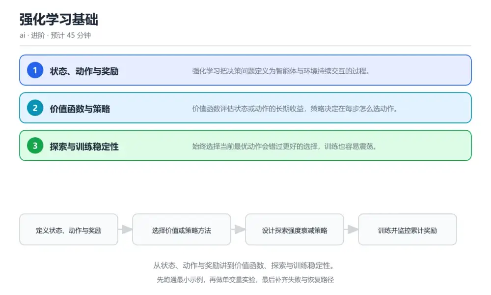
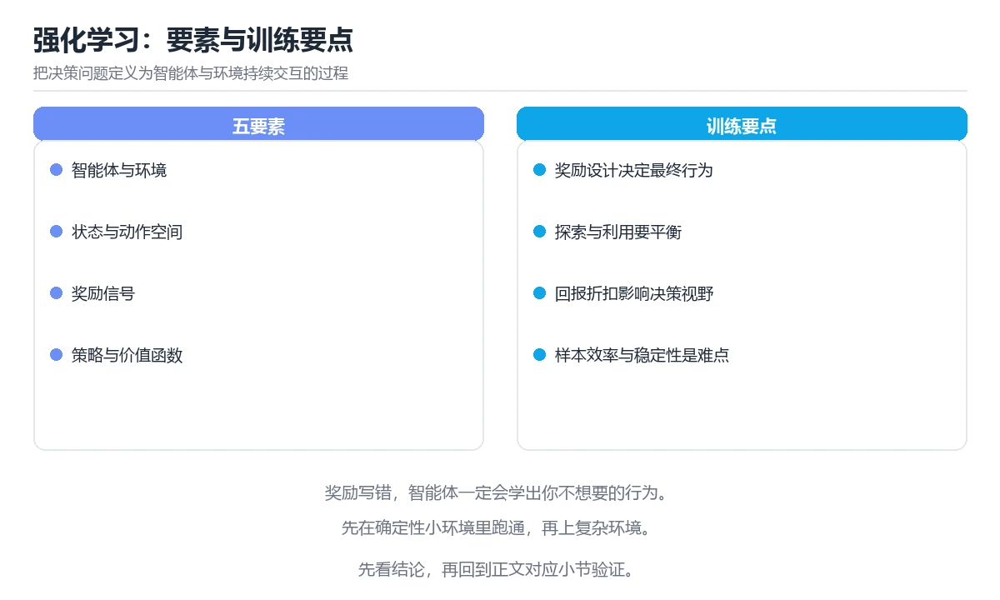

# 强化学习基础

> 内容更新时间：2026-10-06 · 学习阶段：进阶 · 预计用时：40 分钟

分类：ai。关键词：强化学习、奖励、价值函数、探索与利用、策略。从状态、动作与奖励讲到价值函数、探索与训练稳定性。

学习建议：先通读《强化学习基础》的核心知识与关键流程，再运行可运行练习并完成测验；遇到不确定的结论，回到「故障现场」按症状、根因、修复、验证四步核对。



## 本节知识框架

**课程定位**：所属分类为「AI 与智能体」，课程主题为「强化学习基础」，学习阶段为「进阶」，建议用时 40 分钟。

**本课要解决的主问题**：从状态、动作与奖励讲到价值函数、探索与训练稳定性。

| 学习层次 | 要回答的问题 | 完成判据 |
| --- | --- | --- |
| 概念层 | 「强化学习基础」有哪些必须区分的对象与术语？ | 能用自己的话定义核心术语，并各举一个正例和一个反例。 |
| 机制层 | 这些对象按什么顺序发生作用，输入如何变成输出？ | 能画出或写出机制步骤，并说明每一步的失败条件。 |
| 应用层 | 什么场景适合使用「强化学习基础」，什么场景不适合？ | 能给出一个真实场景、一个最小示例和一个边界案例。 |
| 性能层 | 时间、空间、吞吐或延迟受哪些量影响？ | 能说出复杂度或性能瓶颈的证据来源；没有证据时明确写“材料未提供”。 |
| 复习层 | 怎样确认自己不是只记住了结论？ | 能独立完成本课自测，并把错误定位到概念、机制、示例或边界。 |

### 阅读路线

1. 先读「核心概念定义」，建立「强化学习」等对象的精确定义。
2. 再读「原理与运行机制」，把定义串成可重复的过程。
3. 用「代码/协议/SQL 示例」验证过程，并只改一个条件观察结果变化。
4. 最后检查性能、易错点、知识关系与自测题，形成可复习的证据链。

**前置知识**：没有硬性先修课；仍建议先具备本分类的基础阅读与操作能力。

**学习位置**：本课位于《时间序列预测》之后；如果前一课的自测不能通过，应先回补再继续。

**后续衔接**：下一课《多智能体与编排》会继续使用本课术语，学完后建议立即完成一次自测。

**教材衔接：学习目标**

- 能把一个决策问题写成状态、动作与奖励的形式。
- 能解释价值函数与策略之间的关系。
- 能说明探索策略与奖励设计对训练结果的影响。

**教材衔接：前置知识**

- 了解基本的概率与期望概念。
- 会使用数组与简单神经网络做函数拟合。
- 能读懂训练循环与损失下降曲线。

**教材衔接：本课小结**

- 强化学习基础围绕强化学习、奖励、价值函数展开，先建立基线再讨论优化。
- 强化学习把决策问题定义为智能体与环境持续交互的过程。
- 处理 强化学习 的问题时按「症状 → 根因 → 修复 → 验证」的顺序推进，不跳过验证。

## 核心概念定义

> 在阅读《强化学习基础》时，术语第一次出现先给操作性定义，再给边界；正文说法与这里冲突时，以定义和可复现示例为准。

| 术语 | 操作性定义 | 本课中的边界 |
| --- | --- | --- |
| 智能体 | 在环境中做决策并学习的实体。 | 仅在「强化学习基础」明确给出的输入、版本与资源条件下成立。 |
| 累计奖励 | 折扣后从当前时刻起获得的奖励总和。 | 仅在「强化学习基础」明确给出的输入、版本与资源条件下成立。 |
| 价值函数 | 衡量状态或动作长期收益的函数。 | 仅在「强化学习基础」明确给出的输入、版本与资源条件下成立。 |
| 探索与利用 | 尝试新动作与使用已知最优动作之间的权衡。 | 仅在「强化学习基础」明确给出的输入、版本与资源条件下成立。 |
| 经验回放 | 复用历史交互样本以降低更新相关性的方法。 | 仅在「强化学习基础」明确给出的输入、版本与资源条件下成立。 |
| 奖励 | 奖励函数按业务目标拆成主奖励与约束惩罚，训练中检查轨迹行为是否符合预期 | 仅在「强化学习基础」明确给出的输入、版本与资源条件下成立。 |

### 定义如何使用

在「强化学习基础」中判断一个说法是否成立，先确认它使用的是哪个对象的定义，再检查输入规模、运行环境与失败路径。定义不是口号，而是后续推导、代码示例和自测题共享的约束。

## 原理与运行机制

### 机制总览

1. **建立输入**：把「智能体」按本课定义整理成可观察、可重复的输入条件。
2. **执行转换**：围绕「累计奖励」执行本课的核心步骤；每一步都记录中间状态，避免只看最终输出。
3. **产生输出**：得到「价值函数」后，用正文示例或协议/SQL 结果核对输出是否符合预期。
4. **改变一个条件**：只替换一个边界条件或环境参数，观察「强化学习基础」的结论是否仍然成立。

| 阶段 | 关注对象 | 失败时应检查 |
| --- | --- | --- |
| 输入 | 智能体 | 类型、范围、编码、版本或前置状态是否满足定义。 |
| 处理 | 累计奖励 | 顺序、可见性、锁、路由、事务或调度规则是否被破坏。 |
| 输出 | 价值函数 | 结果是否可复现，错误是否被正确传播而不是被吞掉。 |

本课的机制结论要用「强化学习基础」自己的示例验证。「强化学习基础」没有给出某个数量级、吞吐或内存数据时，本课把该判断标为“材料未提供”，不从相邻主题外推。

**教材衔接：核心知识**

### 1. 状态、动作与奖励

强化学习把决策问题定义为智能体与环境持续交互的过程。

智能体在状态 s 选择动作 a，环境返回奖励 r 与下一个状态 s'，目标是最大化长期累计奖励。

在强化学习基础里可以这样验证：在本课示例里把一个小车保持平衡的任务写成状态、动作与奖励三元组。

边界：奖励设计不当会诱导智能体钻空子，例如原地反复触发小奖励而不完成目标。

工程视角：奖励函数按业务目标拆成主奖励与约束惩罚，训练中检查轨迹行为是否符合预期。

### 2. 价值函数与策略

价值函数评估状态或动作的长期收益，策略决定在每步怎么选动作。

状态价值表示从该状态出发的期望回报，动作价值表示在状态下选择某动作的期望回报，策略可以基于价值函数间接导出，也可以直接参数化并优化。

在强化学习基础里可以这样验证：在本课示例里观察同一状态下不同动作的价值差异并据此选动作。

边界：只做一步贪心而不考虑长期回报会陷入局部最优，例如为了即时奖励放弃更高收益路径。

工程视角：价值估计加入折扣因子并记录不同折扣下的行为差异，把选择依据写进实验记录。

### 3. 探索与训练稳定性

始终选择当前最优动作会错过更好的选择，训练也容易震荡。

按概率选择随机动作或使用带噪声的策略保持探索，同时用目标网络、经验回放等手段降低更新相关性。

在强化学习基础里可以这样验证：在本课示例里对比纯贪心与带探索策略的累计奖励曲线。

边界：探索过少会锁死在次优策略，探索过多则长期表现不稳定。

工程视角：探索强度随训练进程衰减并记录奖励方差，出现持续震荡时检查学习率与目标更新频率。

## 典型应用场景

| 场景 | 典型输入或前提 | 期望产物 |
| --- | --- | --- |
| 学习验证 | 使用本课最小示例和 强化学习、奖励 | 能复现正文结论，并解释每一步。 |
| 工程落地 | 把「强化学习基础」放入真实模块或服务边界 | 输出可观测、失败可定位、参数可配置。 |
| 故障排查 | 只改一个版本、规模、输入或依赖条件 | 能区分概念错误、实现错误和环境差异。 |

判断「强化学习基础」的场景是否成立，标准是能否写出输入、处理、输出和失败路径；材料中没有出现的数据在本课标注为“材料未提供”，不用推测替代证据。

**教材衔接：深度拓展与实战**

这一节把强化学习基础的机制拆开验证：每一步都给出输入、判断标准和失败信号，便于在真实项目里复用。

### 机制拆解 1：状态、动作与奖励

智能体在状态 s 选择动作 a，环境返回奖励 r 与下一个状态 s'，目标是最大化长期累计奖励。

落地时先确认前提：奖励设计不当会诱导智能体钻空子，例如原地反复触发小奖励而不完成目标。；再把结论写进检查表，让下一位同学可以按同样的输入复现。

工程做法：奖励函数按业务目标拆成主奖励与约束惩罚，训练中检查轨迹行为是否符合预期。

### 机制拆解 2：价值函数与策略

状态价值表示从该状态出发的期望回报，动作价值表示在状态下选择某动作的期望回报，策略可以基于价值函数间接导出，也可以直接参数化并优化。

落地时先确认前提：只做一步贪心而不考虑长期回报会陷入局部最优，例如为了即时奖励放弃更高收益路径。；再把结论写进检查表，让下一位同学可以按同样的输入复现。

工程做法：价值估计加入折扣因子并记录不同折扣下的行为差异，把选择依据写进实验记录。

### 机制拆解 3：探索与训练稳定性

按概率选择随机动作或使用带噪声的策略保持探索，同时用目标网络、经验回放等手段降低更新相关性。

落地时先确认前提：探索过少会锁死在次优策略，探索过多则长期表现不稳定。；再把结论写进检查表，让下一位同学可以按同样的输入复现。

工程做法：探索强度随训练进程衰减并记录奖励方差，出现持续震荡时检查学习率与目标更新频率。

### 机制对照表

| 概念 | 解决什么问题 | 关键前提 | 失败信号 |
| --- | --- | --- | --- |
| 状态、动作与奖励 | 强化学习把决策问题定义为智能体与环境持续交互的过程。 | 奖励设计不当会诱导智能体钻空子，例如原地反复触发小奖励而不完成目标。 | 奖励函数按业务目标拆成主奖励与约束惩罚，训练中检查轨迹行为是否符合预期。 |
| 价值函数与策略 | 价值函数评估状态或动作的长期收益，策略决定在每步怎么选动作。 | 只做一步贪心而不考虑长期回报会陷入局部最优，例如为了即时奖励放弃更高收益 | 价值估计加入折扣因子并记录不同折扣下的行为差异，把选择依据写进实验记录。 |
| 探索与训练稳定性 | 始终选择当前最优动作会错过更好的选择，训练也容易震荡。 | 探索过少会锁死在次优策略，探索过多则长期表现不稳定。 | 探索强度随训练进程衰减并记录奖励方差，出现持续震荡时检查学习率与目标更新 |

### 自测问答

**问 1**：强化学习与监督学习最本质的差别是？

**答**：没有直接给出正确答案，只能通过奖励反馈学习。监督学习有标签指明正确输出，强化学习只有奖励信号，需要自己权衡长期收益并处理探索问题。 正确选项「没有直接给出正确答案，只能通过奖励反馈学习」对应《强化学习基础》的要点「状态、动作与奖励」：强化学习把决策问题定义为智能体与环境持续交互的过程。判断「状态、动作与奖励」时先确认前提是否成立，再回到《强化学习基础》的示例核对一次；把别的语言或框架的默认做法直接搬到状态、动作与奖励上，往往会在本课的边界条件里失效。

**问 2**：奖励曲线很高但任务没有完成，最可能的原因是？

**答**：奖励设计存在漏洞被智能体利用。奖励只是目标的代理，如果它可以被更简单的方式反复获取，智能体会优化这个捷径而不是完成真实任务。 正确选项「奖励设计存在漏洞被智能体利用」对应《强化学习基础》的要点「价值函数与策略」：价值函数评估状态或动作的长期收益，策略决定在每步怎么选动作。判断「价值函数与策略」时先确认前提是否成立，再回到《强化学习基础》的示例核对一次；借鉴相邻主题的经验之前，先核对价值函数与策略的前提是否成立。

**问 3**：提升训练稳定性可以采取哪些做法？（多选）

**答**：使用目标网络稳定更新目标；使用经验回放降低样本相关性；适当降低学习率。目标网络、经验回放与合理学习率都能减少震荡；探索降为零会锁死策略并失去改进机会。 正确选项「使用目标网络稳定更新目标；使用经验回放降低样本相关性；适当降低学习率」对应《强化学习基础》的要点「探索与训练稳定性」：始终选择当前最优动作会错过更好的选择，训练也容易震荡。判断「探索与训练稳定性」时先确认前提是否成立，再回到《强化学习基础》的示例核对一次；记住探索与训练稳定性的结论之外还要记住适用条件，换一个输入往往就不成立了。

**问 4**：请按一次训练交互的顺序排列。

**答**：观察当前状态。观察、动作、反馈、更新、调整构成一次完整交互，循环往复直到策略收敛。 正确选项「观察当前状态；按策略选择动作；环境返回奖励与新状态；计算目标并更新价值；调整探索强度继续下一轮」对应《强化学习基础》的要点「状态、动作与奖励」：强化学习把决策问题定义为智能体与环境持续交互的过程。判断「状态、动作与奖励」时先确认前提是否成立，再回到《强化学习基础》的示例核对一次；干扰项常常是相邻主题里成立的结论，只有按状态、动作与奖励的输入与约束判断才能排除。

**问 5**：阅读这段更新代码，问题是什么？

**答**：探索强度直接归零，策略失去改进机会。探索强度一开始就为零，智能体会始终沿初始价值估计行动，无法发现更优路径，容易锁死在次优策略。 正确选项「探索强度直接归零，策略失去改进机会」对应《强化学习基础》的要点「价值函数与策略」：价值函数评估状态或动作的长期收益，策略决定在每步怎么选动作。判断「价值函数与策略」时先确认前提是否成立，再回到《强化学习基础》的示例核对一次；把价值函数与策略的做法换到别的约束下未必成立，先确认边界再决定答案。

### 排错速查

- 看到「奖励函数存在漏洞，智能体反复触发小奖励」时，先按「重新设计奖励：明确主目标奖励与约束惩罚，训练中检查轨迹行为而非只看奖励曲线」处理，再用强化学习基础的最小示例确认结论是否恢复。
- 看到「学习率过大且没有任何稳定性手段」时，先按「降低学习率并引入目标网络或经验回放，记录奖励方差定位震荡原因」处理，再用强化学习基础的最小示例确认结论是否恢复。
- 看到「探索强度降到接近零后再也无法恢复」时，先按「为探索强度设置下限并在指标退化时临时提高，保留恢复空间」处理，再用强化学习基础的最小示例确认结论是否恢复。

### 工程检查表

- [ ] 定义状态、动作与奖励
- [ ] 选择价值或策略方法
- [ ] 设计探索强度衰减策略
- [ ] 训练并监控累计奖励
- [ ] 验证行为符合业务约束
- [ ] 【状态、动作与奖励】奖励函数按业务目标拆成主奖励与约束惩罚，训练中检查轨迹行为是否符合预期。
- [ ] 【价值函数与策略】价值估计加入折扣因子并记录不同折扣下的行为差异，把选择依据写进实验记录。
- [ ] 【探索与训练稳定性】探索强度随训练进程衰减并记录奖励方差，出现持续震荡时检查学习率与目标更新频率。

### 迁移练习

把强化学习基础的方法用到一个真实场景：写下强化学习、奖励、价值函数在你的场景里分别对应什么，再记录一次失败尝试和它的恢复步骤。

### 延伸阅读与下一步

- 复习强化学习、奖励、价值函数、探索与利用、策略时，优先回看「状态、动作与奖励」与「探索与训练稳定性」两节。
- 把从「定义状态、动作与奖励」到「验证行为符合业务约束」的流程画成一张图，放进自己的笔记。
- 一周后重做本课测验，只把答错的题留到下一轮复习。

### 结论与下一步

学完强化学习基础，应该能独立完成三件事：先用最小示例确认强化学习的行为，再用一个边界输入验证结论，最后把失败路径写成可重复的检查。下一步把本课术语加入复习清单，并在两周内用一次真实任务检验记忆是否牢固。

## 代码/协议/SQL 示例

以下代码、协议或 SQL 片段来自《强化学习基础》原文，保留原有语言标记与上下文；先预测《强化学习基础》示例的输出，再按正文步骤运行或推演，示例依赖外部环境时同时记录版本与输入。

**教材衔接：关键流程**

```text
定义状态、动作与奖励 → 选择价值或策略方法 → 设计探索强度衰减策略 → 训练并监控累计奖励 → 验证行为符合业务约束
```

1. 定义状态、动作与奖励
2. 选择价值或策略方法
3. 设计探索强度衰减策略
4. 训练并监控累计奖励
5. 验证行为符合业务约束

## 时间/空间复杂度或性能分析

**复杂度证据**：「强化学习基础」的现有材料没有给出渐近时间或空间复杂度的明确结论，本课只做定性检查，不补写未经验证的 $O$ 记号。

| 维度 | 本课关注点 | 判断依据 |
| --- | --- | --- |
| 时间/延迟 | 「强化学习基础」的主要步骤是否会随输入规模、并发度或网络往返增长。 | 以正文复杂度、基准数据或可重复测量为准。 |
| 空间/内存 | 中间状态、缓存、副本、连接或索引是否随规模增长。 | 记录峰值内存与数据副本，不只看最终结果。 |
| 吞吐/资源 | 版本、调度、锁、IO、序列化或协议开销是否成为瓶颈。 | 固定环境做对照实验，改变一个变量。 |

评估「强化学习基础」时要区分“正确性成立”和“性能达标”两件事；材料没有给出基准时，本课只保留量级来源与测量方法，不写不可验证的绝对数字。

## 常见误区与易错点

> 复核《强化学习基础》的易错点时，优先保留原文的错误表、故障现场与排错路径；每条修正都要能用本课示例复验。

| 易错点 | 常见表现 | 正确做法 |
| --- | --- | --- |
| 只背结论 | 能复述「强化学习基础」的定义，却说不清输入、输出与边界。 | 回到机制步骤，用最小示例逐一验证。 |
| 混淆相邻概念 | 把本课对象与相邻主题的对象当成同一类。 | 先比较定义、资源归属、生命周期和失败模式。 |
| 忽略版本与环境 | 在开发机通过后直接外推到生产环境。 | 固定版本、输入和资源条件，再记录可复现结果。 |

**教材衔接：常见错误与排查**

> 说明：本表由《强化学习基础》的核心知识整理（2026-10-06），人工复核进度见 docs/content_review_batches.md。

| 易错点 | 容易踩的做法 | 正确结论 |
| --- | --- | --- |
| 奖励持续上升但行为不符合目标 | 奖励函数存在漏洞，智能体反复触发小奖励 | 重新设计奖励：明确主目标奖励与约束惩罚，训练中检查轨迹行为而非只看奖励曲线 |
| 训练长期不收敛 | 学习率过大且没有任何稳定性手段 | 降低学习率并引入目标网络或经验回放，记录奖励方差定位震荡原因 |
| 性能突然崩塌 | 探索强度降到接近零后再也无法恢复 | 为探索强度设置下限并在指标退化时临时提高，保留恢复空间 |

**教材衔接：故障现场**

### 现场 1：奖励持续上升但行为不符合目标

**症状**：在《强化学习基础》的复现场景中，奖励函数存在漏洞，智能体反复触发小奖励。

**根因**：触发点是把“奖励持续上升但行为不符合目标”当成安全做法。它没有满足《强化学习基础》要求的前提，因此先表现为“奖励函数存在漏洞，智能体反复触发小奖励”；排查时先完整复现这一段，再核对输入、配置与依赖。

**修复**：针对《强化学习基础》的问题，重新设计奖励：明确主目标奖励与约束惩罚，训练中检查轨迹行为而非只看奖励曲线。

**验证**：在《强化学习基础》中按“重新设计奖励：明确主目标奖励与约束惩罚，训练中检查轨迹行为而非只看奖励曲线”调整后，从“奖励持续上升但行为不符合目标”的触发条件重放同一条路径，确认“奖励函数存在漏洞，智能体反复触发小奖励”不再出现，并补一个相邻边界用例检查没有引入新问题。

### 现场 2：训练长期不收敛

**症状**：在《强化学习基础》的复现场景中，学习率过大且没有任何稳定性手段。

**根因**：“学习率过大且没有任何稳定性手段”只是表层结果。向上追溯会落到“训练长期不收敛”这一步，因为它省略了《强化学习基础》的约束，使实现行为和预期模型发生了偏离。

**修复**：针对《强化学习基础》的问题，降低学习率并引入目标网络或经验回放，记录奖励方差定位震荡原因。

**验证**：保留《强化学习基础》里触发“学习率过大且没有任何稳定性手段”的输入、版本和日志，按“降低学习率并引入目标网络或经验回放，记录奖励方差定位震荡原因”完成修改后原样重放；只有失败现象消失且相邻场景仍可解释，才保留改动。

### 现场 3：性能突然崩塌

**症状**：在《强化学习基础》的复现场景中，探索强度降到接近零后再也无法恢复。

**根因**：“探索强度降到接近零后再也无法恢复”只是表层结果。向上追溯会落到“性能突然崩塌”这一步，因为它省略了《强化学习基础》的约束，使实现行为和预期模型发生了偏离。

**修复**：针对《强化学习基础》的问题，为探索强度设置下限并在指标退化时临时提高，保留恢复空间。

**验证**：先在《强化学习基础》中记录“性能突然崩塌”留下的失败证据，再执行“为探索强度设置下限并在指标退化时临时提高，保留恢复空间”并重放；确认错误路径变为明确结果，且修复没有掩盖同类故障。

## 与其他知识点的关系

| 关系 | 课程 | 为什么 |
| --- | --- | --- |
| 前置顺序 | 《时间序列预测》 | 同分类中安排在本课之前，建议先完成其自测。 |
| 后续顺序 | 《多智能体与编排》 | 同分类中安排在本课之后，会继续使用本课术语。 |

把「强化学习基础」放回知识体系时，不只要记住“前面学过什么”，还要说明两个主题在输入、机制、资源边界和失败模式上的差异。这样才能把单课知识迁移到项目、排障和后续课程。

**教材衔接：复习与迁移**

### 概念复述

不看正文，把强化学习基础讲给一个没学过的同事：先讲它解决什么问题，再讲一个最小例子，最后说明一个不适用场景。

### 测验回顾

回到《强化学习基础》测验，只重做答错或犹豫的题；对每道题写一句「我为什么改选这个答案」，写不出理由就回到对应小节。

### 迁移练习

把《强化学习基础》的方法用到一个你自己的真实场景：说明输入、约束与验证方式，并列出仍然不确定、需要下一次实验回答的问题。

## 自测题与参考答案

> 先独立完成《强化学习基础》的自测，再核对答案与解析。答案必须能在本课正文或示例中找到依据，不能只凭语感。

### 自测 1

强化学习与监督学习最本质的差别是？

A. 不能使用神经网络，不过这需要额外的前提条件
B. 没有直接给出正确答案，只能通过奖励反馈学习
C. 不需要数据
D. 模型规模更小

**参考答案**：没有直接给出正确答案，只能通过奖励反馈学习

**解析**：监督学习有标签指明正确输出，强化学习只有奖励信号，需要自己权衡长期收益并处理探索问题。 正确选项「没有直接给出正确答案，只能通过奖励反馈学习」对应《强化学习基础》的要点「状态、动作与奖励」：强化学习把决策问题定义为智能体与环境持续交互的过程。判断「状态、动作与奖励」时先确认前提是否成立，再回到《强化学习基础》的示例核对一次；把别的语言或框架的默认做法直接搬到状态、动作与奖励上，往往会在本课的边界条件里失效。

### 自测 2

提升训练稳定性可以采取哪些做法？（多选）

A. 使用目标网络稳定更新目标
B. 使用经验回放降低样本相关性
C. 适当降低学习率
D. 把探索强度立即降为零

**参考答案**：使用目标网络稳定更新目标；使用经验回放降低样本相关性；适当降低学习率

**解析**：目标网络、经验回放与合理学习率都能减少震荡；探索降为零会锁死策略并失去改进机会。 正确选项「使用目标网络稳定更新目标；使用经验回放降低样本相关性；适当降低学习率」对应《强化学习基础》的要点「探索与训练稳定性」：始终选择当前最优动作会错过更好的选择，训练也容易震荡。判断「探索与训练稳定性」时先确认前提是否成立，再回到《强化学习基础》的示例核对一次；记住探索与训练稳定性的结论之外还要记住适用条件，换一个输入往往就不成立了。

### 自测 3

请按一次训练交互的顺序排列。

A. 观察当前状态
B. 按策略选择动作
C. 环境返回奖励与新状态
D. 计算目标并更新价值
E. 调整探索强度继续下一轮

**参考答案**：观察当前状态 → 按策略选择动作 → 环境返回奖励与新状态 → 计算目标并更新价值 → 调整探索强度继续下一轮

**解析**：观察、动作、反馈、更新、调整构成一次完整交互，循环往复直到策略收敛。 正确选项「观察当前状态；按策略选择动作；环境返回奖励与新状态；计算目标并更新价值；调整探索强度继续下一轮」对应《强化学习基础》的要点「状态、动作与奖励」：强化学习把决策问题定义为智能体与环境持续交互的过程。判断「状态、动作与奖励」时先确认前提是否成立，再回到《强化学习基础》的示例核对一次；干扰项常常是相邻主题里成立的结论，只有按状态、动作与奖励的输入与约束判断才能排除。

**教材衔接：动手练习**

1. 把一个小游戏或模拟任务写成状态、动作与奖励三元组。
2. 对比探索强度固定与衰减两种设置下的累计奖励曲线。
3. 修改奖励函数让智能体钻空子，再修正奖励并说明改动原因。

**验收标准**：留下 n_actions 的输入、命令、输出和结论，让别人能按记录复现。

**教材衔接：可运行练习**

### 任务 1：先跑通，再解释

```python
import random

class Agent:
    def __init__(self, n_states, n_actions, alpha=0.1, gamma=0.95):
        self.q = [[0.0] * n_actions for _ in range(n_states)]
        self.alpha, self.gamma = alpha, gamma
        self.epsilon = 1.0      # 初始高探索

    def act(self, state):
        if random.random() < self.epsilon:
            return random.randrange(len(self.q[state]))   # 探索
        return max(range(len(self.q[state])), key=lambda a: self.q[state][a])  # 利用

    def update(self, s, a, r, s_next):
        # 时序差分更新：用下一状态的最大动作价值估计长期回报
        best_next = max(self.q[s_next])
        target = r + self.gamma * best_next
        self.q[s][a] += self.alpha * (target - self.q[s][a])

        # 探索强度随训练衰减，后期更依赖已学到的价值
        self.epsilon = max(0.05, self.epsilon * 0.999)

# 训练循环：与环境的交互顺序固定，便于复现实验
for episode in range(2000):
    s, done = env.reset(), False
    while not done:
        a = agent.act(s)
        s_next, r, done = env.step(a)
        agent.update(s, a, r, s_next)
        s = s_next

```

智能体按概率在探索与利用之间切换，更新时用即时奖励加上折扣后的下一状态最优价值作为目标，向该目标小幅靠近；探索强度随训练衰减，后期表现趋于稳定。训练循环的结构固定，方便对比不同超参数。

### 任务 2：只改一个条件

复制上面的示例，只改一个输入或参数再跑一次；先写下预测，再和真实输出对照，并说明差异来自强化学习基础的哪条机制。

### 任务 3：迁移到自己的数据

把《强化学习基础》里的示例换成你自己的一小段数据或场景，保持结构不变；如果换不动，说明还有哪条前提没有理解，回到核心知识对应小节。

**教材衔接：本课复习清单**

离开本课前，逐项确认：

- [ ] 能把一个任务写成状态、动作与奖励。
- [ ] 能解释价值函数与策略的关系。
- [ ] 能说出两种提升训练稳定性的手段。
- [ ] 用 强化学习 构造一个正常输入和一个边界输入，分别记录输出与判断依据。
- [ ] 把本课最容易混淆的两个概念写成一句话对照。

| 复盘项 | 记录 |
| --- | --- |
| 已经能独立解释的考点 |  |
| 仍然说不清的概念 |  |
| 下一步验证动作 |  |

**教材衔接：复习与自测**

### 核心知识

遮住正文回答：强化学习基础解决什么问题、依赖哪些前提、失败时先看哪个信号？三问都能答清楚，再进入下一节。

### 动手练习

把《强化学习基础》里「只改一个条件」的练习再做一遍，这次先写预测再运行；预测和结果不一致的地方，就是需要回读的章节。

### 最小可运行示例

```python
import random

class Agent:
    def __init__(self, n_states, n_actions, alpha=0.1, gamma=0.95):
        self.q = [[0.0] * n_actions for _ in range(n_states)]
        self.alpha, self.gamma = alpha, gamma
        self.epsilon = 1.0      # 初始高探索

    def act(self, state):
        if random.random() < self.epsilon:
            return random.randrange(len(self.q[state]))   # 探索
        return max(range(len(self.q[state])), key=lambda a: self.q[state][a])  # 利用

    def update(self, s, a, r, s_next):
        # 时序差分更新：用下一状态的最大动作价值估计长期回报
        best_next = max(self.q[s_next])
        target = r + self.gamma * best_next
        self.q[s][a] += self.alpha * (target - self.q[s][a])

        # 探索强度随训练衰减，后期更依赖已学到的价值
        self.epsilon = max(0.05, self.epsilon * 0.999)

# 训练循环：与环境的交互顺序固定，便于复现实验
for episode in range(2000):
    s, done = env.reset(), False
    while not done:
        a = agent.act(s)
        s_next, r, done = env.step(a)
        agent.update(s, a, r, s_next)
        s = s_next

```

### 预期输出

```text
episode 200: avg reward -86.4 (epsilon 0.82)，episode 800: avg reward 12.7 (epsilon 0.45)，episode 2000: avg reward 196.2 (epsilon 0.13)
```

### 验证步骤

1. 确认输入数据与运行环境和示例一致。
2. 运行示例，记录输出与耗时等可观测指标。
3. 换一个边界输入重跑，确认结论仍然成立。
4. 把两次结果写成一句话结论，注明前提与局限。

---

## 术语速查

先遮住右列，尝试用自己的话解释，再回到正文核对。

| 术语 | 一句话说明 |
| --- | --- |
| `智能体` | 在环境中做决策并学习的实体。 |
| `累计奖励` | 折扣后从当前时刻起获得的奖励总和。 |
| `价值函数` | 衡量状态或动作长期收益的函数。 |
| `探索与利用` | 尝试新动作与使用已知最优动作之间的权衡。 |
| `经验回放` | 复用历史交互样本以降低更新相关性的方法。 |
| `奖励` | 奖励函数按业务目标拆成主奖励与约束惩罚，训练中检查轨迹行为是否符合预期 |

## 考点精讲

### 考点 1：强化学习与监督学习最本质的差别是？

题型：概念判断。题干：强化学习与监督学习最本质的差别是？

判断要点：没有直接给出正确答案，只能通过奖励反馈学习。监督学习有标签指明正确输出，强化学习只有奖励信号，需要自己权衡长期收益并处理探索问题。 正确选项「没有直接给出正确答案，只能通过奖励反馈学习」对应《强化学习基础》的要点「状态、动作与奖励」：强化学习把决策问题定义为智能体与环境持续交互的过程。判断「状态、动作与奖励」时先确认前提是否成立，再回到《强化学习基础》的示例核对一次；把别的语言或框架的默认做法直接搬到状态、动作与奖励上，往往会在本课的边界条件里失效。

### 考点 2：奖励曲线很高但任务没有完成，最可能的原因

题型：概念判断。题干：奖励曲线很高但任务没有完成，最可能的原因是？

判断要点：奖励设计存在漏洞被智能体利用。奖励只是目标的代理，如果它可以被更简单的方式反复获取，智能体会优化这个捷径而不是完成真实任务。 正确选项「奖励设计存在漏洞被智能体利用」对应《强化学习基础》的要点「价值函数与策略」：价值函数评估状态或动作的长期收益，策略决定在每步怎么选动作。判断「价值函数与策略」时先确认前提是否成立，再回到《强化学习基础》的示例核对一次；借鉴相邻主题的经验之前，先核对价值函数与策略的前提是否成立。

### 考点 3：提升训练稳定性可以采取哪些做法？（多选）

题型：多选辨析。题干：提升训练稳定性可以采取哪些做法？（多选）

判断要点：使用目标网络稳定更新目标；使用经验回放降低样本相关性；适当降低学习率。目标网络、经验回放与合理学习率都能减少震荡；探索降为零会锁死策略并失去改进机会。 正确选项「使用目标网络稳定更新目标；使用经验回放降低样本相关性；适当降低学习率」对应《强化学习基础》的要点「探索与训练稳定性」：始终选择当前最优动作会错过更好的选择，训练也容易震荡。判断「探索与训练稳定性」时先确认前提是否成立，再回到《强化学习基础》的示例核对一次；记住探索与训练稳定性的结论之外还要记住适用条件，换一个输入往往就不成立了。

### 考点 4：请按一次训练交互的顺序排列。

题型：顺序排列。题干：请按一次训练交互的顺序排列。

判断要点：观察当前状态。观察、动作、反馈、更新、调整构成一次完整交互，循环往复直到策略收敛。 正确选项「观察当前状态；按策略选择动作；环境返回奖励与新状态；计算目标并更新价值；调整探索强度继续下一轮」对应《强化学习基础》的要点「状态、动作与奖励」：强化学习把决策问题定义为智能体与环境持续交互的过程。判断「状态、动作与奖励」时先确认前提是否成立，再回到《强化学习基础》的示例核对一次；干扰项常常是相邻主题里成立的结论，只有按状态、动作与奖励的输入与约束判断才能排除。

### 考点 5：阅读这段更新代码，问题是什么？

题型：排错。题干：阅读这段更新代码，问题是什么？

判断要点：探索强度直接归零，策略失去改进机会。探索强度一开始就为零，智能体会始终沿初始价值估计行动，无法发现更优路径，容易锁死在次优策略。 正确选项「探索强度直接归零，策略失去改进机会」对应《强化学习基础》的要点「价值函数与策略」：价值函数评估状态或动作的长期收益，策略决定在每步怎么选动作。判断「价值函数与策略」时先确认前提是否成立，再回到《强化学习基础》的示例核对一次；把价值函数与策略的做法换到别的约束下未必成立，先确认边界再决定答案。

## English Overview

Reinforcement Learning Fundamentals

Reinforcement learning frames a task as an agent interacting with an environment: observe a state, take an action, receive a reward and a new state, and maximise the discounted return. Value functions estimate long-term payoff, policies choose actions, and exploration keeps better options reachable. Reward design and stability tricks decide whether training actually converges.



## 内容元数据

- 内容版本：v2.0
- 最后更新：2026-10-06
- 学习阶段：进阶

| 字段 | 值 |
| --- | --- |
| 课程 ID | `ai_reinforcement_learning` |
| 所属分类 | `ai` |
| 难度 | 进阶 |
| 预计用时 | 45 分钟 |
| 关键词 | 强化学习、奖励、价值函数、探索与利用、策略 |
| 配图 | `images/lesson_ai_reinforcement_learning.webp` |
| 参考资料 | 2 条 |
| 内容更新时间 | 2026-10-06 |

## 参考资料与复核

- 最后复核：2026-10-04
- 下次复核：2027-04-17
- 复核范围：版本兼容、API 行为与工程实践

下面列出的资料用于核对本课结论，复习时可以对照阅读：
- [OpenAI Spinning Up：强化学习入门](https://spinningup.openai.com/en/latest/spinningup/rl_intro.html)
- [DeepMind 强化学习课程材料](https://www.deepmind.com/learning-resources)

> 复核提示：《强化学习基础》的结论如与资料冲突，以资料中的规范文本为准，并在笔记里记录差异与日期。
