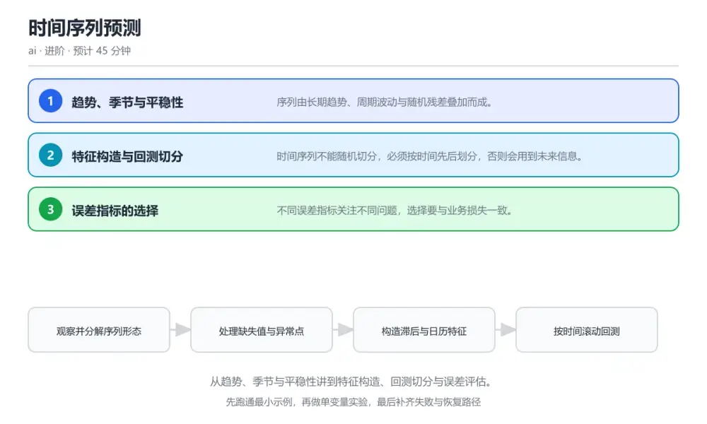
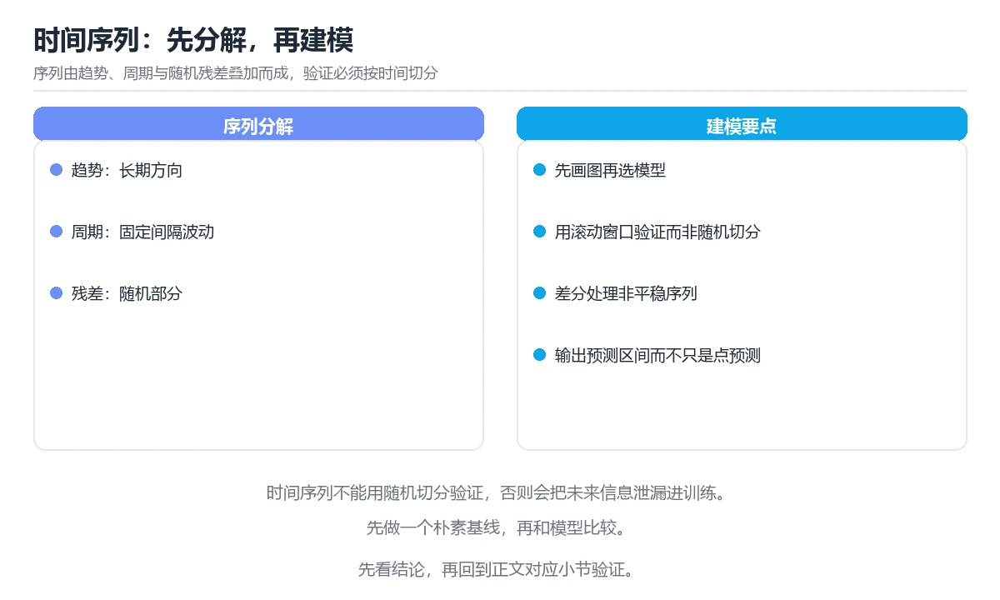

# 时间序列预测

> 内容更新时间：2026-10-06 · 学习阶段：进阶 · 预计用时：30 分钟

分类：ai。关键词：时间序列、季节性、平稳性、回测、误差指标。从趋势、季节与平稳性讲到特征构造、回测切分与误差评估。

学习建议：先通读《时间序列预测》的核心知识与关键流程，再运行可运行练习并完成测验；遇到不确定的结论，回到「故障现场」按症状、根因、修复、验证四步核对。



## 学习目标

- 能把时间序列拆解为趋势、季节与残差三部分。
- 能按时间顺序正确切分训练与验证集。
- 能选择合适误差指标并解释其适用条件。

## 前置知识

- 完成机器学习核心概念一课。
- 会使用表格数据处理工具计算滚动统计量。
- 了解过拟合与验证集的基本概念。

## 核心知识

### 1. 趋势、季节与平稳性

序列由长期趋势、周期波动与随机残差叠加而成。

通过差分或分解得到平稳序列，平稳性意味着统计特性不随时间变化，是许多经典模型的假设前提。

在时间序列预测里可以这样验证：在本课示例里对含季节性的序列做一阶差分，观察均值与方差的稳定性变化。

边界：对非平稳序列直接建模会得到看似拟合但外推失效的结果。

工程视角：建模前先画分解图并做平稳性检验，把处理方式记录在特征说明里。

### 2. 特征构造与回测切分

时间序列不能随机切分，必须按时间先后划分，否则会用到未来信息。

滞后特征只使用当前时刻之前的值，日历特征提供周期性信息，滚动窗口逐步向前推进完成回测。

在时间序列预测里可以这样验证：在本课示例里用滚动窗口做三次回测，观察每次训练集与验证集的时间边界。

边界：把未来数据泄露进特征会让离线指标虚高，上线后效果骤降。

工程视角：特征生成函数统一约束可用时间范围，回测流程固定并纳入自动检查。

### 3. 误差指标的选择

不同误差指标关注不同问题，选择要与业务损失一致。

绝对误差反映平均偏差大小，百分比误差便于跨量级比较，但在真实值接近零时会放大；分位数损失适合关注极端情况的场景。

在时间序列预测里可以这样验证：在本课示例里用两种指标评估同一预测，观察结论是否一致。

边界：用百分比误差评估含零值的序列会得到无穷大或极端值，误导模型选择。

工程视角：指标与业务口径一起评审，把选定的指标与阈值写进模型验收标准。

## 关键流程

```text
观察并分解序列形态 → 处理缺失值与异常点 → 构造滞后与日历特征 → 按时间滚动回测 → 选定误差指标并滚动更新模型
```

1. 观察并分解序列形态
2. 处理缺失值与异常点
3. 构造滞后与日历特征
4. 按时间滚动回测
5. 选定误差指标并滚动更新模型

## 动手练习

1. 对一段含周周期的序列做分解，标出趋势与季节成分。
2. 分别用随机切分与时间切分评估同一模型，对比误差差异。
3. 对含零值的序列分别用绝对误差与百分比误差评估，解释差异。

**验收标准**：记录 时间序列 的输入、实际输出与差异解释，缺一项都不算完成。

## 常见错误与排查

> 说明：本表由《时间序列预测》的核心知识整理（2026-10-06），人工复核进度见 docs/content_review_batches.md。

| 易错点 | 容易踩的做法 | 正确结论 |
| --- | --- | --- |
| 离线指标虚高 | 随机切分或使用包含当期值的滚动统计作为特征 | 严格按时间切分并先移位再计算滚动统计，保证特征只使用历史信息 |
| 百分比误差失控 | 对真实值可能为零的序列使用百分比误差 | 改用绝对误差或对称百分比误差，并在验收标准里写明分母处理方式 |
| 模型无法适应变化 | 训练一次后长期不更新，忽略分布变化 | 按固定周期滚动重训并用回测监控误差趋势，超过阈值触发重训 |

## 可运行练习

### 任务 1：先跑通，再解释

```python
import pandas as pd

# 特征构造：只使用当前时刻之前的信息，避免未来数据泄露
def make_features(series: pd.Series) -> pd.DataFrame:
    df = pd.DataFrame({"y": series})
    df["lag_1"] = series.shift(1)          # 昨天真实值
    df["lag_7"] = series.shift(7)          # 上周同期
    df["roll_mean_7"] = series.shift(1).rolling(7).mean()   # 先移位再滚动
    df["roll_std_7"] = series.shift(1).rolling(7).std()
    df["dow"] = series.index.dayofweek      # 星期几，捕捉周周期
    df["is_weekend"] = (df["dow"] >= 5).astype(int)
    return df.dropna()

# 滚动回测：每次只用过去数据训练，再预测未来一段
def backtest(series, horizon=7, folds=3):
    scores = []
    for fold in range(folds):
        split = len(series) - (fold + 1) * horizon
        train, valid = series[:split], series[split:split + horizon]
        model = fit(make_features(train))
        pred = model.predict(make_features(valid.join(train.tail(horizon))))
        mae = (pred - valid).abs().mean()
        scores.append(mae)
        print(f"fold {fold}: train_end={train.index[-1].date()} mae={mae:.2f}")
    return scores

```

特征全部基于移位后的历史值，滚动统计先移位再计算以避免用到当期数据；回测按时间顺序切分，每折的训练集都严格早于验证集，得到的误差才有参考价值。

### 任务 2：只改一个条件

复制上面的示例，只改一个输入或参数再跑一次；先写下预测，再和真实输出对照，并说明差异来自时间序列预测的哪条机制。

### 任务 3：迁移到自己的数据

把《时间序列预测》里的示例换成你自己的一小段数据或场景，保持结构不变；如果换不动，说明还有哪条前提没有理解，回到核心知识对应小节。

## 故障现场

### 现场 1：离线指标虚高

**症状**：在《时间序列预测》的复现场景中，随机切分或使用包含当期值的滚动统计作为特征。

**根因**：触发点是把“离线指标虚高”当成安全做法。它没有满足《时间序列预测》要求的前提，因此先表现为“随机切分或使用包含当期值的滚动统计作为特征”；排查时先完整复现这一段，再核对输入、配置与依赖。

**修复**：针对《时间序列预测》的问题，严格按时间切分并先移位再计算滚动统计，保证特征只使用历史信息。

**验证**：在《时间序列预测》中按“严格按时间切分并先移位再计算滚动统计，保证特征只使用历史信息”调整后，从“离线指标虚高”的触发条件重放同一条路径，确认“随机切分或使用包含当期值的滚动统计作为特征”不再出现，并补一个相邻边界用例检查没有引入新问题。

### 现场 2：百分比误差失控

**症状**：在《时间序列预测》的复现场景中，对真实值可能为零的序列使用百分比误差。

**根因**：触发点是把“百分比误差失控”当成安全做法。它没有满足《时间序列预测》要求的前提，因此先表现为“对真实值可能为零的序列使用百分比误差”；排查时先完整复现这一段，再核对输入、配置与依赖。

**修复**：针对《时间序列预测》的问题，改用绝对误差或对称百分比误差，并在验收标准里写明分母处理方式。

**验证**：在《时间序列预测》中按“改用绝对误差或对称百分比误差，并在验收标准里写明分母处理方式”调整后，从“百分比误差失控”的触发条件重放同一条路径，确认“对真实值可能为零的序列使用百分比误差”不再出现，并补一个相邻边界用例检查没有引入新问题。

### 现场 3：模型无法适应变化

**症状**：在《时间序列预测》的复现场景中，训练一次后长期不更新，忽略分布变化。

**根因**：当出现“模型无法适应变化”时，执行路径已经绕过了《时间序列预测》的关键约束，最终以“训练一次后长期不更新，忽略分布变化”暴露出来；修复前必须先确认约束在哪里失效。

**修复**：针对《时间序列预测》的问题，按固定周期滚动重训并用回测监控误差趋势，超过阈值触发重训。

**验证**：先在《时间序列预测》中记录“模型无法适应变化”留下的失败证据，再执行“按固定周期滚动重训并用回测监控误差趋势，超过阈值触发重训”并重放；确认错误路径变为明确结果，且修复没有掩盖同类故障。

## 本课复习清单

离开本课前，逐项确认：

- [ ] 能说出时间序列的三个组成部分。
- [ ] 能解释先移位再滚动的原因。
- [ ] 能说明随机切分为什么不可用于时间序列。
- [ ] 至少运行一次 make_features 的示例，记录输入、输出和 时间序列 的边界情况。
- [ ] 把本课最容易混淆的两个概念写成一句话对照。

| 复盘项 | 记录 |
| --- | --- |
| 已经能独立解释的考点 |  |
| 仍然说不清的概念 |  |
| 下一步验证动作 |  |

## 复习与自测

### 核心知识

遮住正文回答：时间序列预测解决什么问题、依赖哪些前提、失败时先看哪个信号？三问都能答清楚，再进入下一节。

### 动手练习

把《时间序列预测》里「只改一个条件」的练习再做一遍，这次先写预测再运行；预测和结果不一致的地方，就是需要回读的章节。

### 最小可运行示例

```python
import pandas as pd

# 特征构造：只使用当前时刻之前的信息，避免未来数据泄露
def make_features(series: pd.Series) -> pd.DataFrame:
    df = pd.DataFrame({"y": series})
    df["lag_1"] = series.shift(1)          # 昨天真实值
    df["lag_7"] = series.shift(7)          # 上周同期
    df["roll_mean_7"] = series.shift(1).rolling(7).mean()   # 先移位再滚动
    df["roll_std_7"] = series.shift(1).rolling(7).std()
    df["dow"] = series.index.dayofweek      # 星期几，捕捉周周期
    df["is_weekend"] = (df["dow"] >= 5).astype(int)
    return df.dropna()

# 滚动回测：每次只用过去数据训练，再预测未来一段
def backtest(series, horizon=7, folds=3):
    scores = []
    for fold in range(folds):
        split = len(series) - (fold + 1) * horizon
        train, valid = series[:split], series[split:split + horizon]
        model = fit(make_features(train))
        pred = model.predict(make_features(valid.join(train.tail(horizon))))
        mae = (pred - valid).abs().mean()
        scores.append(mae)
        print(f"fold {fold}: train_end={train.index[-1].date()} mae={mae:.2f}")
    return scores

```

### 预期输出

```text
fold 0: train_end=2026-09-17 mae=12.41，fold 1: train_end=2026-09-10 mae=11.87，fold 2: train_end=2026-09-03 mae=13.02
```

### 验证步骤

1. 确认输入数据与运行环境和示例一致。
2. 运行示例，记录输出与耗时等可观测指标。
3. 换一个边界输入重跑，确认结论仍然成立。
4. 把两次结果写成一句话结论，注明前提与局限。

## 术语速查

先遮住右列，尝试用自己的话解释，再回到正文核对。

| 术语 | 一句话说明 |
| --- | --- |
| `平稳性` | 序列的统计特性不随时间变化。 |
| `滞后特征` | 使用过去时刻的值作为输入特征。 |
| `回测` | 按时间顺序滚动切分训练与验证集评估模型。 |
| `数据泄露` | 特征中包含了预测时点之后的信息。 |
| `平均绝对误差` | 预测值与真实值差值的绝对平均。 |

## 考点精讲

### 考点 1：时间序列建模时最常见的错误是？

题型：概念判断。题干：时间序列建模时最常见的错误是？

判断要点：随机切分导致未来信息泄露到训练集。时间序列有先后依赖，随机切分会让模型在训练时看到未来数据，离线指标虚高而线上失效。 正确选项「随机切分导致未来信息泄露到训练集」对应《时间序列预测》的要点「趋势、季节与平稳性」：序列由长期趋势、周期波动与随机残差叠加而成。判断「趋势、季节与平稳性」时先确认前提是否成立，再回到《时间序列预测》的示例核对一次；把别的语言或框架的默认做法直接搬到趋势、季节与平稳性上，往往会在本课的边界条件里失效。

### 考点 2：构造滚动均值特征时正确顺序是？

题型：概念判断。题干：构造滚动均值特征时正确顺序是？

判断要点：先移位再滚动计算。先移位保证计算时不包含当期值，否则当期真实值会通过特征泄漏进模型，造成评估偏高。 正确选项「先移位再滚动计算」对应《时间序列预测》的要点「特征构造与回测切分」：时间序列不能随机切分，必须按时间先后划分，否则会用到未来信息。判断「特征构造与回测切分」时先确认前提是否成立，再回到《时间序列预测》的示例核对一次；借鉴相邻主题的经验之前，先核对特征构造与回测切分的前提是否成立。

### 考点 3：选择误差指标时需要考虑哪些因素？（多选）

题型：多选辨析。题干：选择误差指标时需要考虑哪些因素？（多选）

判断要点：业务损失对偏差的敏感方式；序列是否存在接近零的真实值；是否关注极端情况。指标要与业务损失一致并适配数据特征；缩写长短与评估有效性无关。 正确选项「业务损失对偏差的敏感方式；序列是否存在接近零的真实值；是否关注极端情况」对应《时间序列预测》的要点「误差指标的选择」：不同误差指标关注不同问题，选择要与业务损失一致。判断「误差指标的选择」时先确认前提是否成立，再回到《时间序列预测》的示例核对一次；记住误差指标的选择的结论之外还要记住适用条件，换一个输入往往就不成立了。

### 考点 4：请按一次时间序列建模的顺序排列。

题型：顺序排列。题干：请按一次时间序列建模的顺序排列。

判断要点：分解并检查平稳性。先理解序列形态，再清洗与构造特征，通过回测验证效果，最后固化指标与重训周期完成闭环。 正确选项「分解并检查平稳性；处理缺失与异常值；构造滞后与日历特征；按时间滚动回测；选定指标并定期重训」对应《时间序列预测》的要点「趋势、季节与平稳性」：序列由长期趋势、周期波动与随机残差叠加而成。判断「趋势、季节与平稳性」时先确认前提是否成立，再回到《时间序列预测》的示例核对一次；干扰项常常是相邻主题里成立的结论，只有按趋势、季节与平稳性的输入与约束判断才能排除。

### 考点 5：阅读这段特征代码，会造成什么问题？

题型：排错。题干：阅读这段特征代码，会造成什么问题？

判断要点：滚动均值包含当期真实值，特征泄露导致指标虚高。滚动窗口包含当前时刻的真实值，模型可以直接从特征中读出答案，离线误差会异常小而上线后表现崩塌。 正确选项「滚动均值包含当期真实值，特征泄露导致指标虚高」对应《时间序列预测》的要点「特征构造与回测切分」：时间序列不能随机切分，必须按时间先后划分，否则会用到未来信息。判断「特征构造与回测切分」时先确认前提是否成立，再回到《时间序列预测》的示例核对一次；把特征构造与回测切分的做法换到别的约束下未必成立，先确认边界再决定答案。

## English Overview

Time Series Forecasting

A time series mixes trend, seasonality and noise, and many models assume the residuals are stationary. Features must only use values available before the prediction moment, so rolling statistics are shifted first, and validation splits move forward in time. Error metrics are chosen to match the business loss, since percentage errors explode near zero.



## 本课小结

- 时间序列预测围绕时间序列、季节性、平稳性展开，先建立基线再讨论优化。
- 序列由长期趋势、周期波动与随机残差叠加而成。
- 排查 季节性 时保留原始错误信息，不要先改代码。

## 内容元数据

- 内容版本：v2.0
- 最后更新：2026-10-06
- 学习阶段：进阶

| 字段 | 值 |
| --- | --- |
| 课程 ID | `ai_time_series` |
| 所属分类 | `ai` |
| 难度 | 进阶 |
| 预计用时 | 45 分钟 |
| 关键词 | 时间序列、季节性、平稳性、回测、误差指标 |
| 配图 | `images/lesson_ai_time_series.webp` |
| 参考资料 | 2 条 |
| 内容更新时间 | 2026-10-06 |

## 参考资料与复核

- 最后复核：2026-10-04
- 下次复核：2027-04-17
- 复核范围：版本兼容、API 行为与工程实践

下面列出的资料用于核对本课结论，复习时可以对照阅读：
- [Nixtla 时间序列实践指南](https://nixtlaverse.nixtla.io/statsforecast/docs/getting-started/getting_started_complete.html)
- [Facebook Prophet 官方文档](https://facebook.github.io/prophet/docs/quick_start.html)

> 复核提示：《时间序列预测》的结论如与资料冲突，以资料中的规范文本为准，并在笔记里记录差异与日期。

## 复习与迁移

### 概念复述

不看正文，把时间序列预测讲给一个没学过的同事：先讲它解决什么问题，再讲一个最小例子，最后说明一个不适用场景。

### 测验回顾

回到《时间序列预测》测验，只重做答错或犹豫的题；对每道题写一句「我为什么改选这个答案」，写不出理由就回到对应小节。

### 迁移练习

把《时间序列预测》的方法用到一个你自己的真实场景：说明输入、约束与验证方式，并列出仍然不确定、需要下一次实验回答的问题。

## 深度拓展与实战

这一节把时间序列预测的机制拆开验证：每一步都给出输入、判断标准和失败信号，便于在真实项目里复用。

### 机制拆解 1：趋势、季节与平稳性

通过差分或分解得到平稳序列，平稳性意味着统计特性不随时间变化，是许多经典模型的假设前提。

落地时先确认前提：对非平稳序列直接建模会得到看似拟合但外推失效的结果。；再把结论写进检查表，让下一位同学可以按同样的输入复现。

工程做法：建模前先画分解图并做平稳性检验，把处理方式记录在特征说明里。

### 机制拆解 2：特征构造与回测切分

滞后特征只使用当前时刻之前的值，日历特征提供周期性信息，滚动窗口逐步向前推进完成回测。

落地时先确认前提：把未来数据泄露进特征会让离线指标虚高，上线后效果骤降。；再把结论写进检查表，让下一位同学可以按同样的输入复现。

工程做法：特征生成函数统一约束可用时间范围，回测流程固定并纳入自动检查。

### 机制拆解 3：误差指标的选择

绝对误差反映平均偏差大小，百分比误差便于跨量级比较，但在真实值接近零时会放大；分位数损失适合关注极端情况的场景。

落地时先确认前提：用百分比误差评估含零值的序列会得到无穷大或极端值，误导模型选择。；再把结论写进检查表，让下一位同学可以按同样的输入复现。

工程做法：指标与业务口径一起评审，把选定的指标与阈值写进模型验收标准。

### 机制对照表

| 概念 | 解决什么问题 | 关键前提 | 失败信号 |
| --- | --- | --- | --- |
| 趋势、季节与平稳性 | 序列由长期趋势、周期波动与随机残差叠加而成。 | 对非平稳序列直接建模会得到看似拟合但外推失效的结果。 | 建模前先画分解图并做平稳性检验，把处理方式记录在特征说明里。 |
| 特征构造与回测切分 | 时间序列不能随机切分，必须按时间先后划分，否则会用到未来信息。 | 把未来数据泄露进特征会让离线指标虚高，上线后效果骤降。 | 特征生成函数统一约束可用时间范围，回测流程固定并纳入自动检查。 |
| 误差指标的选择 | 不同误差指标关注不同问题，选择要与业务损失一致。 | 用百分比误差评估含零值的序列会得到无穷大或极端值，误导模型选择。 | 指标与业务口径一起评审，把选定的指标与阈值写进模型验收标准。 |

### 自测问答

**问 1**：时间序列建模时最常见的错误是？

**答**：随机切分导致未来信息泄露到训练集。时间序列有先后依赖，随机切分会让模型在训练时看到未来数据，离线指标虚高而线上失效。 正确选项「随机切分导致未来信息泄露到训练集」对应《时间序列预测》的要点「趋势、季节与平稳性」：序列由长期趋势、周期波动与随机残差叠加而成。判断「趋势、季节与平稳性」时先确认前提是否成立，再回到《时间序列预测》的示例核对一次；把别的语言或框架的默认做法直接搬到趋势、季节与平稳性上，往往会在本课的边界条件里失效。

**问 2**：构造滚动均值特征时正确顺序是？

**答**：先移位再滚动计算。先移位保证计算时不包含当期值，否则当期真实值会通过特征泄漏进模型，造成评估偏高。 正确选项「先移位再滚动计算」对应《时间序列预测》的要点「特征构造与回测切分」：时间序列不能随机切分，必须按时间先后划分，否则会用到未来信息。判断「特征构造与回测切分」时先确认前提是否成立，再回到《时间序列预测》的示例核对一次；借鉴相邻主题的经验之前，先核对特征构造与回测切分的前提是否成立。

**问 3**：选择误差指标时需要考虑哪些因素？（多选）

**答**：业务损失对偏差的敏感方式；序列是否存在接近零的真实值；是否关注极端情况。指标要与业务损失一致并适配数据特征；缩写长短与评估有效性无关。 正确选项「业务损失对偏差的敏感方式；序列是否存在接近零的真实值；是否关注极端情况」对应《时间序列预测》的要点「误差指标的选择」：不同误差指标关注不同问题，选择要与业务损失一致。判断「误差指标的选择」时先确认前提是否成立，再回到《时间序列预测》的示例核对一次；记住误差指标的选择的结论之外还要记住适用条件，换一个输入往往就不成立了。

**问 4**：请按一次时间序列建模的顺序排列。

**答**：分解并检查平稳性。先理解序列形态，再清洗与构造特征，通过回测验证效果，最后固化指标与重训周期完成闭环。 正确选项「分解并检查平稳性；处理缺失与异常值；构造滞后与日历特征；按时间滚动回测；选定指标并定期重训」对应《时间序列预测》的要点「趋势、季节与平稳性」：序列由长期趋势、周期波动与随机残差叠加而成。判断「趋势、季节与平稳性」时先确认前提是否成立，再回到《时间序列预测》的示例核对一次；干扰项常常是相邻主题里成立的结论，只有按趋势、季节与平稳性的输入与约束判断才能排除。

**问 5**：阅读这段特征代码，会造成什么问题？

**答**：滚动均值包含当期真实值，特征泄露导致指标虚高。滚动窗口包含当前时刻的真实值，模型可以直接从特征中读出答案，离线误差会异常小而上线后表现崩塌。 正确选项「滚动均值包含当期真实值，特征泄露导致指标虚高」对应《时间序列预测》的要点「特征构造与回测切分」：时间序列不能随机切分，必须按时间先后划分，否则会用到未来信息。判断「特征构造与回测切分」时先确认前提是否成立，再回到《时间序列预测》的示例核对一次；把特征构造与回测切分的做法换到别的约束下未必成立，先确认边界再决定答案。

### 排错速查

- 看到「随机切分或使用包含当期值的滚动统计作为特征」时，先按「严格按时间切分并先移位再计算滚动统计，保证特征只使用历史信息」处理，再用时间序列预测的最小示例确认结论是否恢复。
- 看到「对真实值可能为零的序列使用百分比误差」时，先按「改用绝对误差或对称百分比误差，并在验收标准里写明分母处理方式」处理，再用时间序列预测的最小示例确认结论是否恢复。
- 看到「训练一次后长期不更新，忽略分布变化」时，先按「按固定周期滚动重训并用回测监控误差趋势，超过阈值触发重训」处理，再用时间序列预测的最小示例确认结论是否恢复。

### 工程检查表

- [ ] 观察并分解序列形态
- [ ] 处理缺失值与异常点
- [ ] 构造滞后与日历特征
- [ ] 按时间滚动回测
- [ ] 选定误差指标并滚动更新模型
- [ ] 【趋势、季节与平稳性】建模前先画分解图并做平稳性检验，把处理方式记录在特征说明里。
- [ ] 【特征构造与回测切分】特征生成函数统一约束可用时间范围，回测流程固定并纳入自动检查。
- [ ] 【误差指标的选择】指标与业务口径一起评审，把选定的指标与阈值写进模型验收标准。

### 迁移练习

把时间序列预测的方法用到一个真实场景：写下时间序列、季节性、平稳性在你的场景里分别对应什么，再记录一次失败尝试和它的恢复步骤。

### 延伸阅读与下一步

- 复习时间序列、季节性、平稳性、回测、误差指标时，优先回看「趋势、季节与平稳性」与「误差指标的选择」两节。
- 把从「观察并分解序列形态」到「选定误差指标并滚动更新模型」的流程画成一张图，放进自己的笔记。
- 一周后重做本课测验，只把答错的题留到下一轮复习。

### 结论与下一步

学完时间序列预测，应该能独立完成三件事：先用最小示例确认时间序列的行为，再用一个边界输入验证结论，最后把失败路径写成可重复的检查。下一步把本课术语加入复习清单，并在两周内用一次真实任务检验记忆是否牢固。
