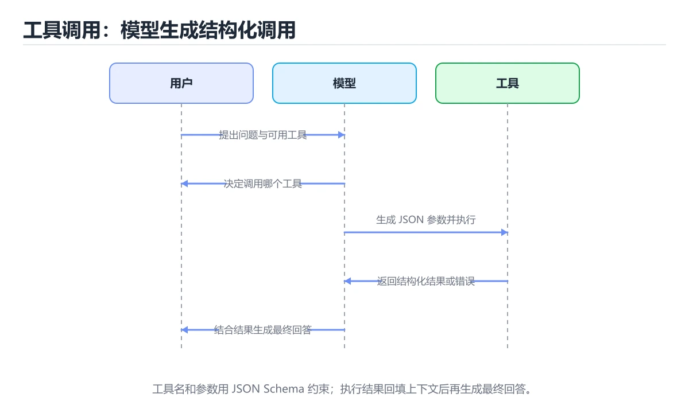
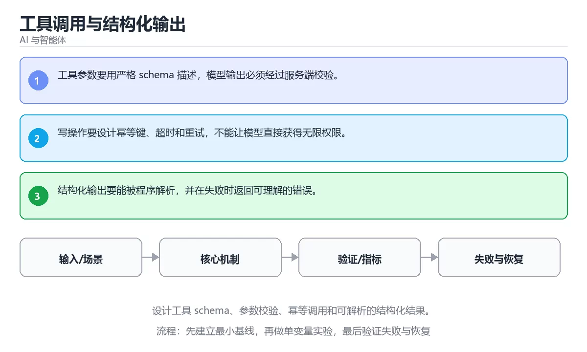

# 工具调用与结构化输出





> 内容更新时间：2026-10-06 · 学习阶段：进阶 · 预计用时：40 分钟

## 本节知识框架

**课程定位**：所属分类 `ai`（AI 与智能体），课程主题 `工具调用与结构化输出`，学习阶段 进阶，建议用时 45 分钟。

本课主线：设计工具 schema、参数校验、幂等调用和可解析的结构化结果。

**学完本课应当能够**
- 说清 `Function Calling` 与 `JSON Schema` 的含义与区别，并各举一个正例和一个反例。
- 用本课示例验证 `校验` 的行为，记录输入、输出与失败条件。
- 遇到「用自然语言描述参数」这类问题时，能说出触发条件与修复顺序。

### 从概念到验证的学习链条

1. `Function Calling`：先掌握 模型输出结构化函数名与参数，由宿主程序执行并把结果返回模型，再用它解释 `JSON Schema` 为什么会出现。
2. `JSON Schema`：先掌握 按“工具调用与结构化输出”中 Function Calling、JSON Schema、幂等 的实践顺序，把四个步骤排成从准备到复盘的合理顺序，再用它解释 `校验` 为什么会出现。
3. `校验`：先掌握 检查输入或输出是否符合类型、范围、权限和业务约束，不通过就拒绝，再用它解释 `幂等键` 为什么会出现。
4. `幂等键`：先掌握 写操作的唯一标识，服务端据此识别重复请求，避免重试变成重复下单，再用它解释 `结构化输出` 为什么会出现。
5. `结构化输出`：先掌握 约束模型按 JSON、枚举或模式返回可直接解析的数据，再用它解释 本课示例的观察结果 为什么会出现。

**先修与衔接**：本课是「AI 与智能体」分类的第 21 课。先修内容：《上下文工程》。《上下文工程》里的 `上下文工程`、`摘要` 是本课的前提。相关或后续课程：《Computer Use 与桌面自动化》。

### 完成判据

- **定义关**：不看正文也能说明 `Function Calling` 是 模型输出结构化函数名与参数，由宿主程序执行并把结果返回模型，并指出一个反例。
- **机制关**：能按“输入 → 转换 → 输出 → 验证”复述 `工具调用与结构化输出`，而不是只背结论。
- **示例关**：能运行或推演 `工具调用与结构化输出` 的 `text` 示例，并说明一个真实出现的标识符或字面量。
- **证据关**：能指出 `工具调用与结构化输出` 示例里的 调用了 `score()`，并说明它支持或反驳了本课的哪一条结论。
- **排错关**：能复现 用自然语言描述参数，记录现象并按 用 JSON Schema 约束参数并在调用前校验 修复。
- **迁移关**：能把 `Function Calling`、`JSON Schema`、`幂等`、`校验` 放进一个与 `工具调用与结构化输出` 不同的项目场景，并保持输入与验证条件可追踪。
- **复盘关**：学完 `工具调用与结构化输出` 后，用一句话写下仍然不确定的结论，并列出下一次验证需要的输入、环境和成功判据。

### 复习清单

- [ ] 能不看正文复述本课核心术语，并指出一个边界或反例。
- [ ] 能运行或推演本课示例，记录输入、输出与失败现象。
- [ ] 能完成一次自测，并把错题对照错误表定位原因。

## 核心概念定义

| 术语 | 操作性定义 | 常见边界与风险 |
| --- | --- | --- |
| Function Calling | 模型输出结构化函数名与参数，由宿主程序执行并把结果返回模型。 | 结果依赖数据分布、模型版本与算力预算，换数据集或换硬件都要重新评估。 |
| JSON Schema | 按“工具调用与结构化输出”中 Function Calling、JSON Schema、幂等 的实践顺序，把四个步骤排成从准备到复盘的合理顺序。 | 易错：模型输出无法解析，调用直接失败；正确做法是用 JSON Schema 约束参数并在调用前校验。 |
| 校验 | 检查输入或输出是否符合类型、范围、权限和业务约束，不通过就拒绝。 | 易错：模型输出无法解析，调用直接失败；正确做法是用 JSON Schema 约束参数并在调用前校验。 |
| 幂等键 | 写操作的唯一标识，服务端据此识别重复请求，避免重试变成重复下单。 | 网络延迟、超时与版本协商会改变行为，只在真实链路或多版本客户端上验证才算数。 |
| 结构化输出 | 约束模型按 JSON、枚举或模式返回可直接解析的数据 | 结果依赖数据分布、模型版本与算力预算，换数据集或换硬件都要重新评估。 |

## 原理与运行机制

### 机制总览

**教材衔接：核心知识**

### 1. 工具参数要用严格 schema 描述，模型输出必须经过服务端校验。

- 关键做法：先用 answer 建立 Function Calling 的基线，再逐步加入边界与失败条件。
- 验证标准：JSON Schema 的异常路径有明确错误信息与恢复动作。

### 2. 写操作要设计幂等键、超时和重试，不能让模型直接获得无限权限。

把这条结论放回「工具调用与结构化输出」的完整流程里展开：

- 正文依据：能用自己的话解释：工具参数要用严格 schema 描述，模型输出必须经过服务端校验。
- 落地检查：把「2. 写操作要设计幂等键、超时和重试，不能让模型直接获得无限权限。」改写成一条可执行的核对项，逐条验证输入、超时与失败路径。

### 3. 结构化输出要能被程序解析，并在失败时返回可理解的错误。

把这条结论放回「工具调用与结构化输出」的完整流程里展开：

- 正文依据：能用自己的话解释：写操作要设计幂等键、超时和重试，不能让模型直接获得无限权限。
- 落地检查：把「3. 结构化输出要能被程序解析，并在失败时返回可理解的错误。」改写成一条可执行的核对项，逐条验证输入、超时与失败路径。

**教材衔接：关键流程**

```text
输入 → 校验 → 核心处理 → 验证 → 记录指标 → 失败恢复
```

**教材衔接：实践路径**

**教材衔接：深入补充：工具调用与结构化输出 的取舍与边界**

### 一、把概念放回真实约束

| 维度 | 要回答的问题 | 常见做法 | 失败信号 |
| --- | --- | --- | --- |
| 数据 | Function Calling 的训练或检索数据从哪来、质量如何 | 清洗、去重、标注与版本化 | 评测集泄漏或分布漂移 |
| 模型 | JSON Schema 的能力边界与成本是多少 | 基线对比、离线评测、灰度发布 | 指标好看但线上任务失败 |
| 评测 | 如何证明改动真的有效 | 固定评测集、人工抽检、A/B | 只比较单例输出 |
| 安全 | 失败时会不会泄露或越权 | 权限校验、内容过滤、审计 | 提示注入或数据外泄 |


### 五、AI 工程补充

在工具调用与结构化输出里，模型输出只是系统的一部分：输入要先经过权限与数据质量检查，检索或工具调用要有超时和降级，输出要经过引用核验或规则校验，最后记录 token、延迟、失败类型和人工反馈。评测时至少准备固定题、边界题和对抗题，并把 Function Calling 与 JSON Schema 的指标分开记录；否则一次提示词改动看似提升体验，实际可能只是评测样本泄漏或随机波动。

**教材衔接：零基础精讲：把工具调用与结构化输出真正讲透**

### 先建立一个直觉

把「工具调用与结构化输出」看成一条可评测的流水线：输入经过 Function Calling 处理，产出候选结果，再由 JSON Schema 决定哪些结果可以真正执行；每一环都要有可测的输入、输出与失败处理。

本课的摘要可以当作一张地图：设计工具 schema、参数校验、幂等调用和可解析的结构化结果。

### 逐步拆解

1. 澄清输入与目标。先写清「工具调用与结构化输出」要解决的问题、合法输入范围和成功标准，再进入后续步骤。
2. 描述处理过程。把「Function Calling、JSON Schema、幂等、校验」映射到具体步骤，每步都要求能单独验证。
3. 定义输出。明确 Function Calling 与 JSON Schema 各自的产物，以及失败时留下什么证据。
4. 先预测Function Calling会怎样失败，再实际触发一次；差异部分就是本课最需要补的前提。
5. 把 answer 的规模缩小到一眼能算清的程度，手动推导结果后再用程序验证，差异处就是理解漏洞。

### 把正文串成一条执行链

- **1. 工具参数要用严格 schema 描述，模型输出必须经过服务端校验。**：在「工具调用与结构化输出」里，「1. 工具参数要用严格 schema 描述，模型输出必须经过服务端校验。」这一步要先写清输入与预期，再记录实际结果和差异；结果不符时回到对应小节核对前提。
- **2. 写操作要设计幂等键、超时和重试，不能让模型直接获得无限权限。**：在「工具调用与结构化输出」里，「2. 写操作要设计幂等键、超时和重试，不能让模型直接获得无限权限。」这一步要先写清输入与预期，再记录实际结果和差异；结果不符时回到对应小节核对前提。
- **3. 结构化输出要能被程序解析，并在失败时返回可理解的错误。**：在「工具调用与结构化输出」里，「3. 结构化输出要能被程序解析，并在失败时返回可理解的错误。」这一步要先写清输入与预期，再记录实际结果和差异；结果不符时回到对应小节核对前提。
- **考点 1：按“工具调用与结构化输出”中 Function Calling、JSON Schema、幂等 的实践顺序，把四个步骤排成从准备到复盘的合理顺序。**：先独立作答，再回到本课对应小节核对判断依据；答错时记录是哪一个前提被忽略。
- **考点 2：核心知识 的代码阅读题**：先独立作答，再回到本课正文核对 answer 的执行路径；答错时记录是哪一个前提被忽略。
- **考点 3：关于「结构化输出要能被程序解析，并在失败时返回可理解的错误。」，下列说法正确的是？**：先独立作答，再回到本课对应小节核对判断依据；答错时记录是哪一个前提被忽略。

### 从测验反推易错点

- 参考判断：工具参数要用严格 schema 描述，模型输出必须经过服务端校验。
- 自问：如果去掉题干里的一个限定词，结论还成立吗？

- 参考判断：写操作要设计幂等键、超时和重试，不能让模型直接获得无限权限。

- 参考判断：结构化输出要能被程序解析，并在失败时返回可理解的错误。

**检查点 4：本课的核心学习目标是什么？**

- 参考判断：设计工具 schema、参数校验、幂等调用和可解析的结构化结果。

**检查点 5：以下哪些术语与工具调用与结构化输出直接相关？（多选）**

- 参考判断：Function Calling、JSON Schema

### 工程排错顺序

| 先查什么 | 要得到的证据 | 判断标准 |
| --- | --- | --- |
| 模型输入是否经过长度、格式与敏感信息检查？ | 日志、输入样例、测试或指标 | 能复现并解释，才算定位 |
| 工具调用是否最小权限、可超时、可取消？ | 日志、输入样例、测试或指标 | 能复现并解释，才算定位 |
| 输出是否有引用、置信度或人工复核兜底？ | 日志、输入样例、测试或指标 | 能复现并解释，才算定位 |
| 成本、延迟与失败率是否有指标？ | 日志、输入样例、测试或指标 | 能复现并解释，才算定位 |

### 变式训练

1. 先用一个单文件示例验证 answer，确认正确性后再引入框架或分布式组件。
2. 把 answer 的数据量提高一个数量级，观察延迟与内存的变化拐点。
3. 把 JSON Schema 换成失败输入，记录错误信息与恢复动作。
5. 故意跳过 JSON Schema 的检查再运行，比较与正常流程的差异，并说明这个检查挡住的到底是哪一类失败。
6. 限制 CPU 与内存上限后重跑 answer，观察哪一项参数需要重新设定。


### 迁移案例库

下面用不同约束重复同一套方法，每轮只改变 Function Calling 的一个取值并记录结论。

#### 迁移案例 1：围绕「Function Calling」做一次小实验

**验收**：迁移过程要留下 answer 的可运行记录，并说明JSON Schema在新场景下是否仍然成立。


#### 迁移案例 3：围绕「幂等」做一次小实验

**步骤**：
1. 复述当前方案对「幂等」的假设，写成一句可证伪的话。

#### 迁移案例 4：围绕「校验」做一次小实验

**步骤**：
1. 复述当前方案对「校验」的假设，写成一句可证伪的话。

#### 迁移案例 5：围绕「Function Calling」做一次小实验

**步骤**：

#### 迁移案例 6：围绕「JSON Schema」做一次小实验

**步骤**：

#### 迁移案例 7：围绕「幂等」做一次小实验

**步骤**：

#### 迁移案例 8：围绕「校验」做一次小实验

**步骤**：

#### 迁移案例 9：围绕「Function Calling」做一次小实验

**步骤**：

#### 迁移案例 10：围绕「JSON Schema」做一次小实验

**步骤**：

#### 迁移案例 11：围绕「幂等」做一次小实验

**步骤**：

#### 迁移案例 12：围绕「校验」做一次小实验

**步骤**：

#### 迁移案例 13：围绕「Function Calling」做一次小实验

**步骤**：

#### 迁移案例 14：围绕「JSON Schema」做一次小实验

**步骤**：

#### 迁移案例 15：围绕「幂等」做一次小实验

**步骤**：

#### 迁移案例 16：围绕「校验」做一次小实验

**步骤**：

<!-- p0-depth-v2:end -->

**教材衔接：验证步骤**

### 机制拆解：每一步的输入、动作与输出

#### 1. `Function Calling`
- 输入：`Function Calling`；本步把 模型输出结构化函数名与参数，由宿主程序执行并把结果返回模型 当作判断规则。
- 动作：围绕 `Function Calling` 保留中间状态，并记录它与 `JSON Schema` 的对应关系。
- 输出：`JSON Schema`，它可以被下一段代码、测试或记录继续使用。
- `Function Calling` 的失败条件：结果依赖数据分布、模型版本与算力预算，换数据集或换硬件都要重新评估。

#### 2. `JSON Schema`
- 输入：`Function Calling`；本步把 按“工具调用与结构化输出”中 Function Calling、JSON Schema、幂等 的实践顺序，把四个步骤排成从准备到复盘的合理顺序 当作判断规则。
- 动作：围绕 `JSON Schema` 保留中间状态，并记录它与 `校验` 的对应关系。
- 输出：`校验`，它可以被下一段代码、测试或记录继续使用。
- `JSON Schema` 的失败条件：当用自然语言描述参数时，会出现模型输出无法解析，调用直接失败。

#### 3. `校验`
- 输入：`JSON Schema`；本步把 检查输入或输出是否符合类型、范围、权限和业务约束，不通过就拒绝 当作判断规则。
- 动作：围绕 `校验` 保留中间状态，并记录它与 `幂等键` 的对应关系。
- 输出：`幂等键`，它可以被下一段代码、测试或记录继续使用。
- `校验` 的失败条件：当用自然语言描述参数时，会出现模型输出无法解析，调用直接失败。

#### 4. `幂等键`
- 输入：`校验`；本步把 写操作的唯一标识，服务端据此识别重复请求，避免重试变成重复下单 当作判断规则。
- 动作：围绕 `幂等键` 保留中间状态，并记录它与 `结构化输出` 的对应关系。
- 输出：`结构化输出`，它可以被下一段代码、测试或记录继续使用。
- `幂等键` 的失败条件：网络延迟、超时与版本协商会改变行为，只在真实链路或多版本客户端上验证才算数。

#### 5. `结构化输出`
- 输入：`幂等键`；本步把 约束模型按 JSON、枚举或模式返回可直接解析的数据 当作判断规则。
- 动作：围绕 `结构化输出` 保留中间状态，并记录它与 `score` 的对应关系。
- 输出：`score`，它可以被下一段代码、测试或记录继续使用。
- `结构化输出` 的失败条件：结果依赖数据分布、模型版本与算力预算，换数据集或换硬件都要重新评估。

### 示例中的可观察事实

1. 调用了 `score()`；它对应的课程主题是 `工具调用与结构化输出`。
2. 调用了 `strip()`；它对应的课程主题是 `工具调用与结构化输出`。
3. 调用了 `print()`；它对应的课程主题是 `工具调用与结构化输出`。
4. 出现字面量 `agent`；它对应的课程主题是 `工具调用与结构化输出`。

### 复现实验记录

- 环境：`工具调用与结构化输出` 使用 `text` 示例，固定 `Function Calling`、`JSON Schema`、`幂等`、`校验` 作为第一组条件。
- 首轮输入：先确认 调用了 `score()`，预测 `Function Calling` 会怎样变化。
- 基线观察：记录命令、输入、输出和错误原文，不用截图代替可复制的文本。
- 单变量修改：只改变 `Function Calling`，观察 `结构化输出` 是否仍满足定义。
- 失败注入：复现 用自然语言描述参数，确认现象是 模型输出无法解析，调用直接失败。
- 记录结论：把“修改前、修改后、预期变化、实际变化”写成四列表，这样复盘 `工具调用与结构化输出` 时才能区分概念错误与实现错误。

## 典型应用场景

- **用自然语言描述参数**：典型现象是模型输出无法解析，调用直接失败；正确做法是用 JSON Schema 约束参数并在调用前校验。
- **把工具报错原样抛给用户**：典型现象是对话无法继续，用户体验差；正确做法是把错误转成模型可读结果，让它改写参数或换工具重试。
- **不设调用上限**：典型现象是模型反复调用工具直到超时；正确做法是设最大步数与超时，超限时降级为直接回答并说明原因。

### 最小验证场景

- 准备：保留 `text` 示例的原始输入，先记录 `工具调用与结构化输出` 的基线输出和完整运行命令。
- 观察：先核对 调用了 `score()`，再改变一个与 `Function Calling` 相关的条件。
- 判定：新结果与 `工具调用与结构化输出` 的基线不同不等于错误；只有当差异破坏了 `Function Calling` 的定义或错误表中的约束，才判定为失败。

### 选择与边界

- 使用 `Function Calling` 时，先满足它的定义：模型输出结构化函数名与参数，由宿主程序执行并把结果返回模型；结果依赖数据分布、模型版本与算力预算，换数据集或换硬件都要重新评估。
- 使用 `JSON Schema` 时，先满足它的定义：按“工具调用与结构化输出”中 Function Calling、JSON Schema、幂等 的实践顺序，把四个步骤排成从准备到复盘的合理顺序；易错：模型输出无法解析，调用直接失败；正确做法是用 JSON Schema 约束参数并在调用前校验。
- 使用 `校验` 时，先满足它的定义：检查输入或输出是否符合类型、范围、权限和业务约束，不通过就拒绝；易错：模型输出无法解析，调用直接失败；正确做法是用 JSON Schema 约束参数并在调用前校验。
- 使用 `幂等键` 时，先满足它的定义：写操作的唯一标识，服务端据此识别重复请求，避免重试变成重复下单；网络延迟、超时与版本协商会改变行为，只在真实链路或多版本客户端上验证才算数。
- 使用 `结构化输出` 时，先满足它的定义：约束模型按 JSON、枚举或模式返回可直接解析的数据；结果依赖数据分布、模型版本与算力预算，换数据集或换硬件都要重新评估。

## 代码/协议/SQL 示例

**教材衔接：最小可运行示例**

先用 answer 跑通最小示例，然后只改一个与 Function Calling 相关的取值：

```python
def score(answer: str) -> int:
    return 1 if answer.strip() else 0

print(score("agent"))
```

**教材衔接：预期输出**

```text
1
```

### 示例精读：先找证据，再改一个条件

1. 调用了 `score()`；它出现在 `工具调用与结构化输出` 的示例中，阅读时先确认它前后各发生了什么。
2. 调用了 `strip()`；它出现在 `工具调用与结构化输出` 的示例中，阅读时先确认它前后各发生了什么。
3. 调用了 `print()`；它出现在 `工具调用与结构化输出` 的示例中，阅读时先确认它前后各发生了什么。
4. 出现字面量 `agent`；它出现在 `工具调用与结构化输出` 的示例中，阅读时先确认它前后各发生了什么。
- 在 `工具调用与结构化输出` 中与 `Function Calling` 对照：示例必须能支持 模型输出结构化函数名与参数，由宿主程序执行并把结果返回模型，否则说明这一段还缺少实现或验证步骤。
- 在 `工具调用与结构化输出` 中与 `JSON Schema` 对照：示例必须能支持 按“工具调用与结构化输出”中 Function Calling、JSON Schema、幂等 的实践顺序，把四个步骤排成从准备到复盘的合理顺序，否则说明这一段还缺少实现或验证步骤。
- 在 `工具调用与结构化输出` 中与 `校验` 对照：示例必须能支持 检查输入或输出是否符合类型、范围、权限和业务约束，不通过就拒绝，否则说明这一段还缺少实现或验证步骤。
- 在 `工具调用与结构化输出` 中与 `幂等键` 对照：示例必须能支持 写操作的唯一标识，服务端据此识别重复请求，避免重试变成重复下单，否则说明这一段还缺少实现或验证步骤。

## 时间/空间复杂度或性能分析

**性能关注点（工具调用与结构化输出）**：算力与显存决定可行规模：记录训练或推理耗时、显存峰值与模型精度，换数据集要重新评估。

**测量方法**：以 `工具调用与结构化输出` 的 `Function Calling` 场景为对象，固定输入跑一遍记录基线，再把规模或并发度提高一个数量级复测；两次结果的差值与波动范围才是结论依据。

### 需要控制的变量与记录项

- `工具调用与结构化输出` 的 `Function Calling`：固定它的版本、输入范围和资源上限，分别记录速度、内存与失败率的变化。
- `工具调用与结构化输出` 的 `JSON Schema`：固定它的版本、输入范围和资源上限，分别记录速度、内存与失败率的变化。
- `工具调用与结构化输出` 的 `幂等`：固定它的版本、输入范围和资源上限，分别记录速度、内存与失败率的变化。
- `工具调用与结构化输出` 的 `校验`：固定它的版本、输入范围和资源上限，分别记录速度、内存与失败率的变化。
- `工具调用与结构化输出` 中 `Function Calling` 的边界：结果依赖数据分布、模型版本与算力预算，换数据集或换硬件都要重新评估。达到边界时不要外推，必须重新测量。
- `工具调用与结构化输出` 中 `JSON Schema` 的边界：易错：模型输出无法解析，调用直接失败；正确做法是用 JSON Schema 约束参数并在调用前校验。达到边界时不要外推，必须重新测量。
- `工具调用与结构化输出` 中 `校验` 的边界：易错：模型输出无法解析，调用直接失败；正确做法是用 JSON Schema 约束参数并在调用前校验。达到边界时不要外推，必须重新测量。
- `工具调用与结构化输出` 中 `幂等键` 的边界：网络延迟、超时与版本协商会改变行为，只在真实链路或多版本客户端上验证才算数。达到边界时不要外推，必须重新测量。
- `工具调用与结构化输出` 中 `结构化输出` 的边界：结果依赖数据分布、模型版本与算力预算，换数据集或换硬件都要重新评估。达到边界时不要外推，必须重新测量。
- `工具调用与结构化输出` 的代码证据：先验证 调用了 `score()`，再记录该路径的输入规模与耗时；只看代码行数不能推出复杂度。

## 常见误区与易错点

| 容易写错的做法 | 实际现象 | 原因与正确做法 |
| --- | --- | --- |
| 用自然语言描述参数 | 模型输出无法解析，调用直接失败。 | 用 JSON Schema 约束参数并在调用前校验。 |
| 把工具报错原样抛给用户 | 对话无法继续，用户体验差。 | 把错误转成模型可读结果，让它改写参数或换工具重试。 |
| 不设调用上限 | 模型反复调用工具直到超时。 | 设最大步数与超时，超限时降级为直接回答并说明原因。 |

### 现场 1：用自然语言描述参数

**症状**：模型输出无法解析，调用直接失败。

**根因与修复**：用 JSON Schema 约束参数并在调用前校验。

**自检**：在本课示例里复现「用自然语言描述参数」，改成用 JSON Schema 约束参数并在调用前校验后重跑；如果症状消失且失败路径按预期变化，说明定位正确。

### 现场 2：把工具报错原样抛给用户

**症状**：对话无法继续，用户体验差。

**根因与修复**：把错误转成模型可读结果，让它改写参数或换工具重试。

**自检**：在本课示例里复现「把工具报错原样抛给用户」，改成把错误转成模型可读结果，让它改写参数或换工具重试后重跑；如果症状消失且失败路径按预期变化，说明定位正确。

### 现场 3：不设调用上限

**症状**：模型反复调用工具直到超时。

**根因与修复**：设最大步数与超时，超限时降级为直接回答并说明原因。

**自检**：在本课示例里复现「不设调用上限」，改成设最大步数与超时，超限时降级为直接回答并说明原因后重跑；如果症状消失且失败路径按预期变化，说明定位正确。

## 与其他知识点的关系

**教材衔接：复习与迁移**

### 概念复述

- 用一句话说明「工具调用与结构化输出」解决什么问题：设计工具 schema、参数校验、幂等调用和可解析的结构化结果。
- 写出Function Calling、JSON Schema、幂等之间的关系，并各举一个例子。
- 说出本课最容易混淆的两个概念，以及区分它们的判据。

### 正文逐节复核

- **深入补充：工具调用与结构化输出 的取舍与边界**：学习工具调用与结构化输出时，最容易只记住结论而忽略前提。
- **零基础精讲：把工具调用与结构化输出真正讲透**：本课的摘要可以当作一张地图：设计工具 schema、参数校验、幂等调用和可解析的结构化结果。


### 迁移练习

把「工具调用与结构化输出」的结论迁移到相邻主题，每次迁移都写清预测与证据：

- **先修**：`上下文工程`。本课默认这些内容已经掌握。
- **相关或后续**：`Computer Use 与桌面自动化`。本课术语会在这些课程里继续使用。
- **术语归属**：`Function Calling`、`JSON Schema`、`校验` 的定义以本课「核心概念定义」为准，换到其他课程时先确认定义是否被改写。

### 先修与后续术语接口

- `上下文工程`：两者通过本分类的学习顺序衔接，阅读时重点比较各自的输入与失败条件。
- `Computer Use 与桌面自动化`：两者通过本分类的学习顺序衔接，阅读时重点比较各自的输入与失败条件。

### 容易混淆的相邻概念

- `Function Calling` 与 `JSON Schema`：前者强调 模型输出结构化函数名与参数，由宿主程序执行并把结果返回模型；后者强调 按“工具调用与结构化输出”中 Function Calling、JSON Schema、幂等 的实践顺序，把四个步骤排成从准备到复盘的合理顺序。判断时分别检查两条定义的适用范围，不要只看名称相似就互换。
- `JSON Schema` 与 `校验`：前者强调 按“工具调用与结构化输出”中 Function Calling、JSON Schema、幂等 的实践顺序，把四个步骤排成从准备到复盘的合理顺序；后者强调 检查输入或输出是否符合类型、范围、权限和业务约束，不通过就拒绝。判断时分别检查两条定义的适用范围，不要只看名称相似就互换。
- `校验` 与 `幂等键`：前者强调 检查输入或输出是否符合类型、范围、权限和业务约束，不通过就拒绝；后者强调 写操作的唯一标识，服务端据此识别重复请求，避免重试变成重复下单。判断时分别检查两条定义的适用范围，不要只看名称相似就互换。
- `幂等键` 与 `结构化输出`：前者强调 写操作的唯一标识，服务端据此识别重复请求，避免重试变成重复下单；后者强调 约束模型按 JSON、枚举或模式返回可直接解析的数据。判断时分别检查两条定义的适用范围，不要只看名称相似就互换。

## 自测题与参考答案

> 先独立作答，再对照参考答案；答案都能在本课正文、术语表或错误表里找到依据。

### 自测 1（概念复述）

不看正文，写出 `Function Calling` 的操作性定义，并说明它与 `JSON Schema` 的区别。

**参考答案**：模型输出结构化函数名与参数，由宿主程序执行并把结果返回模型。

`JSON Schema` 的定位是：按“工具调用与结构化输出”中 Function Calling、JSON Schema、幂等 的实践顺序，把四个步骤排成从准备到复盘的合理顺序；两者的差别要从适用对象与失败模式上说明。

### 自测 2（排错）

本课错误表记录了「用自然语言描述参数」这类做法。请写出它会出现的现象、根因，以及修复顺序。

**参考答案**：现象是模型输出无法解析，调用直接失败；正确做法是用 JSON Schema 约束参数并在调用前校验。修复时先复现现象并保留证据，再改动一处假设重跑，确认现象消失。

### 自测 3（动手验证）

运行本课的 `text` 示例，改动其中一个输入后重新运行，记录输出与错误信息。

**参考答案**：正常输入下 `text` 示例应当复现正文给出的结果；改动输入后，如果结果改变或报错，先核对它是否满足 `工具调用与结构化输出` 中`Function Calling` 的适用范围，再检查错误表里是否有同类现象。

### 自测 4（代码阅读）

阅读本课开头的 `text` 示例，说明它体现了`Function Calling` 的哪一条性质，并指出改动哪个输入会让这条性质不再成立。

**参考答案**：`Function Calling` 的定义是 模型输出结构化函数名与参数，由宿主程序执行并把结果返回模型，示例正是在实现这条定义。改动与 `Function Calling` 有关的一个输入后，如果结果不再符合 `工具调用与结构化输出` 的正文描述，就说明该性质只在当前前提成立。

### 自测 5（迁移）

把 `工具调用与结构化输出` 的方法迁移到自己的项目：围绕 `Function Calling` 写出一个与错误表同类的风险点，并说明触发条件和检验方式。

**参考答案**：例如「不设调用上限」，它会导致模型反复调用工具直到超时；检验方式是按设最大步数与超时，超限时降级为直接回答并说明原因改一处再复现，确认现象消失且没有引入新的失败分支。

### 自测 6（对比）

用一个表格对比 `Function Calling` 与 `JSON Schema`：各写一行适用场景、一行失败表现。

**参考答案**：`Function Calling` 的定义是模型输出结构化函数名与参数，由宿主程序执行并把结果返回模型；`JSON Schema` 的定义是按“工具调用与结构化输出”中 Function Calling、JSON Schema、幂等 的实践顺序，把四个步骤排成从准备到复盘的合理顺序。两者的失败表现分别对应本课错误表里与本术语相关的行。

### 自测 7（排错顺序）

面对「用自然语言描述参数」引发的问题，请把“复现 模型输出无法解析，调用直接失败 → 保留证据 → 用 JSON Schema 约束参数并在调用前校验 → 回归验证”四步写成可执行的检查清单。

**参考答案**：第一步按模型输出无法解析，调用直接失败复现；第二步记录输入、版本与完整报错；第三步按用 JSON Schema 约束参数并在调用前校验只改一处；第四步重跑并确认失败路径也按预期变化。

### 自测 8（边界判断）

针对 `结构化输出`，分别写出“可以使用”的条件和“结论不再成立”的条件。

**参考答案**：结果依赖数据分布、模型版本与算力预算，换数据集或换硬件都要重新评估。 同时要把 `结构化输出` 的定义 约束模型按 JSON、枚举或模式返回可直接解析的数据 与实际输入逐项对照。

### 自测 9（机制重建）

不看正文，按输入、转换、输出、验证四段重建 `Function Calling` → `JSON Schema` → `校验` → `幂等键` 的作用链。

**参考答案**：起点是 `Function Calling` 的定义 模型输出结构化函数名与参数，由宿主程序执行并把结果返回模型；中间每一步都保留可观察状态；终点由 `结构化输出` 检查，失败时回到错误表定位第一个偏离定义的步骤。

### 自测 10（综合排错）

在 `工具调用与结构化输出` 中，现象是 模型反复调用工具直到超时。请围绕 不设调用上限 写出最小复现、关键证据、修复动作和回归验证，并说明为什么不能只凭一次运行下结论。

**参考答案**：先复现 不设调用上限，记录输入与完整错误；再按 设最大步数与超时，超限时降级为直接回答并说明原因 只改一处。回归时同时跑正常路径和边界路径，只有两次结果都可解释，才把修复视为完成。

### 自测 11（一分钟复述）

用每分钟约 200 字的速度复述 `工具调用与结构化输出`：先给主问题，再按顺序说出 `Function Calling`、`JSON Schema`、`校验`、`幂等键`，最后给一个失败案例。

**自评标准**：主问题必须对应 设计工具 schema、参数校验、幂等调用和可解析的结构化结果；每个术语都要能接上一句定义或边界；失败案例必须写成可观察现象，不能用“可能有风险”代替证据。

## 术语速查

| 术语 | 一句话说明 |
| --- | --- |
| `Function Calling` | 模型输出结构化函数名与参数，由宿主程序执行并把结果返回模型。 |
| `JSON Schema` | 按“工具调用与结构化输出”中 Function Calling、JSON Schema、幂等 的实践顺序，把四个步骤排成从准备到复盘的合理顺序。 |
| `校验` | 检查输入或输出是否符合类型、范围、权限和业务约束，不通过就拒绝。 |
| `幂等键` | 写操作的唯一标识，服务端据此识别重复请求，避免重试变成重复下单。 |
| `结构化输出` | 约束模型按 JSON、枚举或模式返回可直接解析的数据。 |

**术语关系**：`Function Calling`（模型输出结构化函数名与参数） → `JSON Schema`（按“工具调用与结构化输出”中 Function Calling、JSON Schema、幂等 的实践顺序） → `校验`（检查输入或输出是否符合类型、范围、权限和业务约束） → `幂等键`（写操作的唯一标识）。

## 考点精讲

`工具调用与结构化输出` 的题库有 5 道题，下面逐题给出题干、正确项与判断依据：先自己作答，再核对正确项，最后回到正文对应小节复核。

### 考点 1：第 1 题

- **题目**：按“工具调用与结构化输出”中 Function Calling、JSON Schema、幂等 的实践顺序，把四个步骤排成从准备到复盘的合理顺序。
- **正确项**：先明确 Function Calling 的输入、输出与约束 → 写出最小示例并核对 JSON Schema 的基线结果 → 只改一个变量，记录边界与失败路径的变化 → 固定版本与证据，把“工具调用与结构化输出”的结论写成可复现记录
- **判断依据**：这道题落在术语 `Function Calling` 上：模型输出结构化函数名与参数，由宿主程序执行并把结果返回模型。复习时把 `Function Calling` 的定义、适用边界和一个反例一起说清楚，再回到「核心概念定义」核对原文。

### 考点 2：第 2 题

- **题目**：这段 `python` 代码对应 `工具调用与结构化输出` 的 `Function Calling`。课程要解决的是设计工具 schema、参数校验、幂等调用和可解析的结构化结果。关于代码内容，哪一项说法准确？
- **正确项**：调用了 `score()`
- **判断依据**：这道题落在术语 `Function Calling` 上：模型输出结构化函数名与参数，由宿主程序执行并把结果返回模型。复习时把 `Function Calling` 的定义、适用边界和一个反例一起说清楚，再回到「核心概念定义」核对原文。

### 考点 3：第 3 题

- **题目**：在 `工具调用与结构化输出` 里，与 `Function Calling` 有关的说法中，哪一项最符合设计工具 schema、参数校验、幂等调用和可解析的结构化结果。？
- **正确项**：结构化输出要能被程序解析，并在失败时返回可理解的错误。
- **判断依据**：这道题落在术语 `Function Calling` 上：模型输出结构化函数名与参数，由宿主程序执行并把结果返回模型。复习时把 `Function Calling` 的定义、适用边界和一个反例一起说清楚，再回到「核心概念定义」核对原文。

### 考点 4：第 4 题

- **题目**：`工具调用与结构化输出` 的主线是：设计工具 schema、参数校验、幂等调用和可解析的结构化结果。下面哪一项与这条主线一致？
- **正确项**：设计工具 schema、参数校验、幂等调用和可解析的结构化结果。
- **判断依据**：这道题落在术语 `校验` 上：检查输入或输出是否符合类型、范围、权限和业务约束，不通过就拒绝。复习时把 `校验` 的定义、适用边界和一个反例一起说清楚，再回到「核心概念定义」核对原文。

### 考点 5：第 5 题

- **题目**：课程 `设计工具 schema、参数校验、幂等调用和可解析的结构化结果。`。在 `工具调用与结构化输出` 里，`Function Calling`、`JSON Schema` 与下面哪些选项属于同一层概念？（多选）
- **正确项**：Function Calling；JSON Schema
- **判断依据**：这道题落在术语 `Function Calling` 上：模型输出结构化函数名与参数，由宿主程序执行并把结果返回模型。复习时把 `Function Calling` 的定义、适用边界和一个反例一起说清楚，再回到「核心概念定义」核对原文。

### 考点 6：`Function Calling`

- **要点**：模型输出结构化函数名与参数，由宿主程序执行并把结果返回模型。
- **Function Calling 的边界**：结果依赖数据分布、模型版本与算力预算，换数据集或换硬件都要重新评估。

### 考点 7：`JSON Schema`

- **要点**：按“工具调用与结构化输出”中 Function Calling、JSON Schema、幂等 的实践顺序，把四个步骤排成从准备到复盘的合理顺序。
- **JSON Schema 的边界**：易错：模型输出无法解析，调用直接失败；正确做法是用 JSON Schema 约束参数并在调用前校验。

### 考点 8：`校验`

- **要点**：检查输入或输出是否符合类型、范围、权限和业务约束，不通过就拒绝。
- **校验 的边界**：易错：模型输出无法解析，调用直接失败；正确做法是用 JSON Schema 约束参数并在调用前校验。

### 考点 9：`幂等键`

- **要点**：写操作的唯一标识，服务端据此识别重复请求，避免重试变成重复下单。
- **幂等键 的边界**：网络延迟、超时与版本协商会改变行为，只在真实链路或多版本客户端上验证才算数。

### 考点 10：`结构化输出`

- **要点**：约束模型按 JSON、枚举或模式返回可直接解析的数据
- **结构化输出 的边界**：结果依赖数据分布、模型版本与算力预算，换数据集或换硬件都要重新评估。

### 考点 11：排错——用自然语言描述参数

- **现象**：模型输出无法解析，调用直接失败。
- **处理**：用 JSON Schema 约束参数并在调用前校验。

### 考点 12：排错——把工具报错原样抛给用户

- **现象**：对话无法继续，用户体验差。
- **处理**：把错误转成模型可读结果，让它改写参数或换工具重试。

### 考点 13：综合辨析——`Function Calling` 与 `结构化输出`

- **辨析点**：`Function Calling` 的定义是 模型输出结构化函数名与参数，由宿主程序执行并把结果返回模型；`结构化输出` 的定义是 约束模型按 JSON、枚举或模式返回可直接解析的数据。
- **答题要求**：面对 `工具调用与结构化输出` 的题目，先判断描述的是 `Function Calling` 还是 `结构化输出`，再归到对应定义，最后写出一个会让该定义失效的边界输入。

### 考点 14：排错评分点

- **现象分**：能写出 模型输出无法解析，调用直接失败，而不是只写“程序有错”。
- **证据分**：保留触发 用自然语言描述参数 的输入、版本和错误原文。
- **修复分**：按 用 JSON Schema 约束参数并在调用前校验 只改一处，并同时回归正常路径与边界路径。

## 内容元数据

- 内容版本：v2.0
- 最后更新：2026-10-06
- 学习阶段：进阶
- 适用环境：主流大模型 API、开源模型与向量数据库；本课聚焦 Function Calling。
- 内容来源：内置结构化课程与工程实践整理
- 相关主题：Function Calling、JSON Schema、幂等、校验
- 质量版本：P0 测验标准 + P1 覆盖扩展 + P2 体验补全

## 参考资料与复核

- 最后复核：2026-10-04
- 下次复核：2027-04-17
- 复核范围：版本兼容、API 行为、安全建议与工程实践
- 来源性质：官方文档、标准或权威教材；本课核对关键词：Function Calling、JSON Schema、幂等、校验。

| 参考资料 | 本课用途 |
| --- | --- |
| [Model Context Protocol](https://modelcontextprotocol.io/) | Agent 工具与上下文协议 |
| [Anthropic 文档](https://docs.anthropic.com/) | Claude API 与 Agent 安全 |
| [Hugging Face 文档](https://huggingface.co/docs) | 模型、数据集与推理 |

| [本课术语索引：工具调用与结构化输出](#核心概念定义) | 按本课输入、术语边界和错误表现逐项核对 |
> 「工具调用与结构化输出」的链接用于离线阅读后的延伸核对；App 不会自动联网。