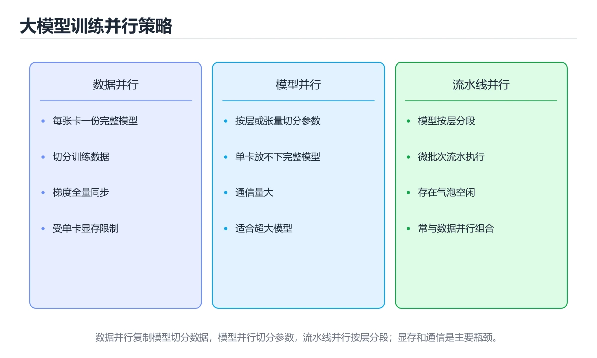
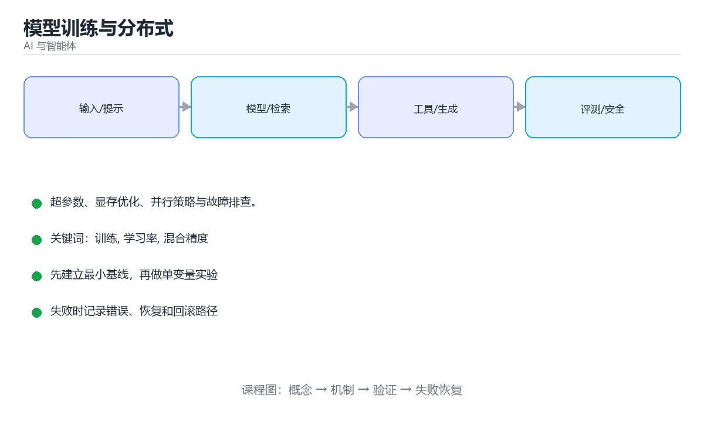

# 模型训练与分布式





> 内容更新时间：2026-10-06 · 学习阶段：高级 · 预计用时：25 分钟

## 学习目标

- 能用自己的话解释模型训练与分布式解决了什么问题，而不是只背术语。
- 能说清 「训练」、「学习率」、「混合精度」、「LoRA」 之间的关系，并分别举出一个例子。
- 能把 训练 放回「模型训练与分布式」的知识体系，说明它和 学习率 的边界。
- 能完成本课练习，并用验收标准检查自己的结果。

> 一句话摘要：超参数、显存优化、并行策略与故障排查。

## 前置知识

- 先完成上一课《Agent 记忆系统》；如果已经掌握，可以直接用本课练习自测。
- 开始前先复习：训练、学习率、混合精度。
- 看不懂就直接缩小例子：只保留 训练 相关的两行输入，跑通后再加回其余部分。

## 训练全流程

数据准备与清洗 → 划分训练/验证集 → 定义模型与损失 → 训练循环（前向、反向、更新）→ 评估与调参 → 保存与导出。工业界真正耗时的是**数据与评测**，而不是调参。

## 关键超参数

| 超参数 | 作用 | 经验 |
| --- | --- | --- |
| 学习率 | 每步更新幅度 | 最重要；过大发散、过小收敛慢 |
| 批大小 | 每次更新的样本数 | 越大越稳但显存占用高，可用梯度累积模拟 |
| 优化器 | 更新策略 | AdamW 通用，SGD+Momentum 泛化常更好 |
| 权重衰减 | 正则化强度 | 抑制过拟合 |
| 学习率调度 | 动态调整 | 预热 + 余弦退火常用 |

## 显存与效率优化

1. 混合精度（FP16/BF16）：显存减半、速度提升，需配合损失缩放。
2. 梯度检查点：用计算换显存，适合深层模型。
3. 梯度累积：小显存模拟大批量。
4. 参数高效微调（LoRA/QLoRA）：只训练少量参数，单卡可微调大模型。
5. 量化与蒸馏：把大模型能力压缩到小模型，降低推理成本。

## 分布式训练

| 并行方式 | 切分对象 | 适用 |
| --- | --- | --- |
| 数据并行 DDP | 切分数据，各卡持有完整模型 | 最常用，模型能放进单卡 |
| 张量并行 | 切分单层矩阵运算 | 单层过大 |
| 流水线并行 | 按层切分到不同设备 | 超深模型 |
| 混合并行 | 上述组合 | 千亿参数级训练 |

数据并行的关键是**梯度同步**（AllReduce）；ZeRO/FSDP 通过分片优化器状态、梯度与参数进一步省显存。

## 常见故障与对策

| 现象 | 原因 | 对策 |
| --- | --- | --- |
| Loss 变 NaN | 学习率过大、数值溢出 | 降学习率、混合精度加损失缩放 |
| 不收敛 | 数据未归一化、标签错误 | 先在小样本上过拟合验证管线 |
| 显存溢出 | 批过大、未释放中间变量 | 减小批、梯度检查点、及时释放 |
| 训练慢 | 数据加载瓶颈 | 增加 DataLoader 并发、预取、缓存 |
| 过拟合 | 数据少、模型大 | 数据增强、正则化、早停 |

## 实践建议

1. 先在极小数据集上跑通全流程（能过拟合），再放大规模。
2. 固定随机种子并记录配置，保证实验可复现。
3. 用实验跟踪工具记录超参数、指标与产物。
4. 训练与推理环境保持一致（依赖版本、精度、分词器）。
5. 保存检查点并支持断点续训，长任务必须能恢复。

## 本课小结

训练的核心是**数据质量 + 学习率 + 显存管理**；分布式只是把单卡流程扩展到多卡，先把单卡流程跑通再谈并行。

## 训练流程速查

| 阶段 | 关键动作 | 产出 |
| --- | --- | --- |
| 数据准备 | 清洗、去重、划分、模板化 | 训练与验证集 |
| 基线评测 | 未训练模型在同一评测集上的表现 | 基线指标 |
| 试跑 | 小步数验证流程与显存 | 损失曲线与样例输出 |
| 正式训练 | 监控损失、学习率、梯度范数 | 检查点 |
| 评测 | 验证集与任务指标 | 是否达标 |
| 上线 | 灰度与回滚方案 | 线上版本 |

## 超参数速查

| 超参数 | 常用范围 | 说明 |
| --- | --- | --- |
| 学习率 | 1e-5 到 2e-4（全参更小） | 过大导致发散或遗忘 |
| 批大小 | 按显存最大化 | 配合梯度累积 |
| warmup | 总步数的 1% 到 5% | 避免初期破坏预训练权重 |
| 调度器 | 余弦或线性衰减 | 后期稳定收敛 |
| 权重衰减 | 0.01 到 0.1 | 抑制过拟合 |
| 训练轮数 | 1 到 3 轮（指令微调） | 过多易过拟合 |
| LoRA rank | 8 到 64 | 越大容量越高、显存越多 |
| LoRA alpha | 通常为 rank 的 1 到 2 倍 | 控制缩放 |
| 梯度裁剪 | 1.0 | 防止梯度爆炸 |

```python
from dataclasses import dataclass

@dataclass
class MemoryPlan:
    """显存估算与优化组合，判断是否需要量化或分片。"""

    params_b: float
    bytes_per_param_train: float = 16      # 权重 + 梯度 + 优化器状态约 16 字节
    seq_len: int = 4096
    batch_size: int = 4
    activation_per_sample_gb: float = 0.6

    @property
    def weights_gb(self) -> float:
        return self.params_b * 1e9 * self.bytes_per_param_train / (1024 ** 3)

    @property
    def activations_gb(self) -> float:
        return self.activation_per_sample_gb * self.batch_size * (self.seq_len / 4096)

    def total_gb(self) -> float:
        return round(self.weights_gb + self.activations_gb, 2)

    def suggestions(self, vram_gb: float) -> list:
        tips = []
        if self.total_gb() > vram_gb:
            tips.append("启用梯度检查点（用时间换显存）")
            tips.append("用梯度累积降低 micro-batch")
            tips.append("改用 LoRA 或 QLoRA 减少可训练参数")
            if self.seq_len > 2048:
                tips.append("缩短序列长度或使用分块注意力")
            if self.params_b >= 13:
                tips.append("考虑 ZeRO / 张量并行做分片")
        return tips or ["当前配置显存充足"]

def effective_batch_size(micro_batch: int, grad_accum: int, world_size: int = 1) -> int:
    """有效批大小：用于对齐实验与论文配置。"""
    return micro_batch * grad_accum * world_size

plan = MemoryPlan(params_b=7, batch_size=4)
print(plan.total_gb(), plan.suggestions(vram_gb=24))
print(effective_batch_size(micro_batch=2, grad_accum=8, world_size=4))
```

## 训练稳定性速查

| 现象 | 可能原因 | 处理 |
| --- | --- | --- |
| 损失变 NaN | 学习率过大、精度问题 | 降低学习率、用 BF16、加梯度裁剪 |
| 损失不下降 | 学习率过小、数据或模板错误 | 检查模板与标签，提高学习率 |
| 验证集变差 | 过拟合 | 早停、加数据、加正则 |
| 输出重复 | 采样参数或数据问题 | 检查数据质量与惩罚项 |
| 灾难性遗忘 | 训练过久或学习率过大 | 减少步数、混入通用数据 |
| 吞吐异常低 | 数据加载或通信瓶颈 | 增加加载并行、检查网络带宽 |

## 常见错误与排查

| 容易踩的做法 | 实际现象 | 原因与正确做法 |
| --- | --- | --- |
| 不做基线评测 | 无法判断训练是否有效 | 先测未训练模型 |
| 不做小规模试跑 | 正式训练中途报错 | 先跑几十步验证流程 |
| 训练与推理模板不一致 | 效果明显下降 | 严格复用同一模板 |
| 学习率直接取最大值 | 损失爆炸或遗忘 | 从小学习率开始并观察曲线 |
| 只看训练损失 | 过拟合无感知 | 同时看验证集与任务指标 |
| 不用梯度检查点 | 显存不足 | 用时间换显存 |
| 不保存中间检查点 | 中断后重头再来 | 定期保存并保留最优 |
| 不记录超参与数据版本 | 结果无法复现 | 配置与数据版本一起记录 |
| 单一随机种子 | 结论不稳 | 多 seed 验证稳定性 |
| 训练完直接全量上线 | 风险高 | 灰度 + 回滚方案 |

## 复习与自测

- [ ] 训练前有基线评测与试跑。
- [ ] 训练与推理使用同一模板。
- [ ] 超参数、数据版本与随机种子可复现。
- [ ] 显存不足时按「检查点、累积、LoRA、分片」顺序优化。
- [ ] 上线有灰度与回滚方案。

## 动手练习

> 本课练习重点：围绕「训练、学习率、混合精度」完成复述、实验和交付，每个结果都要能被别人检查。

先定义 学习率 的评测指标，再做单变量实验。

### 练习 1：建立心智模型（10 分钟）

合上教程，用 3～5 句话回答：

1. 模型训练与分布式解决了什么问题？
2. 如果没有它，会出现什么具体后果？
3. 它和「学习率」是什么关系？

验收标准：用自己的话解释 训练，并给出一个它不成立的反例。

### 练习 2：做一次可控实验（20 分钟）

从正文中选一个最小示例，完成以下操作：

1. 先预测修改一个参数、输入或步骤后的结果。
2. 再实际执行或逐步推演，记录真实结果。
3. 如果结果与预测不同，写出差异原因。

**验收标准**：用 activation_per_sample_gb 复现原例后，把学习率改成边界值，五步记录缺一不可，其中「原因」一栏要写明「模型训练与分布式」里哪条规则被触发。

### 练习 3：交付一个小结果（30 分钟）

为 activation_per_sample_gb 准备 5 条固定样例，覆盖正常、边界与失败三类。

任务要求：

- 结果必须能被别人检查，不能只写“我已经理解了”。
- 至少覆盖「训练」和「学习率」两个关键词。
- 写出 1 个仍然不确定的问题，以及下一步如何验证。

> 提示：时间有限时优先做练习 1 和练习 2；练习 3 可以拆成两次完成。

## 可运行练习

### 任务 1：先跑通，再解释

```python
from dataclasses import dataclass

@dataclass
class MemoryPlan:
    """显存估算与优化组合，判断是否需要量化或分片。"""

    params_b: float
    bytes_per_param_train: float = 16      # 权重 + 梯度 + 优化器状态约 16 字节
    seq_len: int = 4096
    batch_size: int = 4
    activation_per_sample_gb: float = 0.6

    @property
    def weights_gb(self) -> float:
        return self.params_b * 1e9 * self.bytes_per_param_train / (1024 ** 3)

    @property
    def activations_gb(self) -> float:
        return self.activation_per_sample_gb * self.batch_size * (self.seq_len / 4096)

    def total_gb(self) -> float:
        return round(self.weights_gb + self.activations_gb, 2)

    def suggestions(self, vram_gb: float) -> list:
        tips = []
        if self.total_gb() > vram_gb:
            tips.append("启用梯度检查点（用时间换显存）")
            tips.append("用梯度累积降低 micro-batch")
            tips.append("改用 LoRA 或 QLoRA 减少可训练参数")
            if self.seq_len > 2048:
                tips.append("缩短序列长度或使用分块注意力")
            if self.params_b >= 13:
                tips.append("考虑 ZeRO / 张量并行做分片")
        return tips or ["当前配置显存充足"]

def effective_batch_size(micro_batch: int, grad_accum: int, world_size: int = 1) -> int:
    """有效批大小：用于对齐实验与论文配置。"""
    return micro_batch * grad_accum * world_size

plan = MemoryPlan(params_b=7, batch_size=4)
print(plan.total_gb(), plan.suggestions(vram_gb=24))
print(effective_batch_size(micro_batch=2, grad_accum=8, world_size=4))
```

### 任务 2：只改一个条件

把「模型训练与分布式」的最小示例复制一份，只改一个条件再跑一次：

- 改动点：只把 训练 的输入换成空值、极值或错误输入，其余保持不变。
- 预测：先写下「模型训练与分布式」在改动后的输出或错误信息，再运行。
- 记录：对照改动前后的结果，指出差异出在哪一步。
- 验收：换回原条件能复现原结果，改动只影响训练。

### 任务 3：迁移到自己的数据

用同一套思路处理一组你自己的 训练 数据，保持输出格式与任务 1 一致。

## 故障现场

### 现场 1：不做基线评测

**症状**：在《模型训练与分布式》的复现场景中，无法判断训练是否有效。

**根因**：当出现“不做基线评测”时，执行路径已经绕过了《模型训练与分布式》的关键约束，最终以“无法判断训练是否有效”暴露出来；修复前必须先确认约束在哪里失效。

**修复**：针对《模型训练与分布式》的问题，先测未训练模型。

**验证**：保留《模型训练与分布式》里触发“无法判断训练是否有效”的输入、版本和日志，按“先测未训练模型”完成修改后原样重放；只有失败现象消失且相邻场景仍可解释，才保留改动。

### 现场 2：不做小规模试跑

**症状**：在《模型训练与分布式》的复现场景中，正式训练中途报错。

**根因**：“正式训练中途报错”只是表层结果。向上追溯会落到“不做小规模试跑”这一步，因为它省略了《模型训练与分布式》的约束，使实现行为和预期模型发生了偏离。

**修复**：针对《模型训练与分布式》的问题，先跑几十步验证流程。

**验证**：先在《模型训练与分布式》中记录“不做小规模试跑”留下的失败证据，再执行“先跑几十步验证流程”并重放；确认错误路径变为明确结果，且修复没有掩盖同类故障。

### 现场 3：训练与推理模板不一致

**症状**：在《模型训练与分布式》的复现场景中，效果明显下降。

**根因**：触发点是把“训练与推理模板不一致”当成安全做法。它没有满足《模型训练与分布式》要求的前提，因此先表现为“效果明显下降”；排查时先完整复现这一段，再核对输入、配置与依赖。

**修复**：针对《模型训练与分布式》的问题，严格复用同一模板。

**验证**：保留《模型训练与分布式》里触发“效果明显下降”的输入、版本和日志，按“严格复用同一模板”完成修改后原样重放；只有失败现象消失且相邻场景仍可解释，才保留改动。

## 深入补充：模型训练与分布式 的取舍与边界

### 一、把概念放回真实约束

学习模型训练与分布式时，最容易只记住结论而忽略前提。先写出三个约束：数据规模、时间预算、可接受的失败方式；再判断 训练 与 学习率 在这些约束下是否仍然成立。只要约束改变，原来的最优解就可能变成错误解。

| 维度 | 要回答的问题 | 常见做法 | 失败信号 |
| --- | --- | --- | --- |
| 数据 | 训练 的训练或检索数据从哪来、质量如何 | 清洗、去重、标注与版本化 | 评测集泄漏或分布漂移 |
| 模型 | 学习率 的能力边界与成本是多少 | 基线对比、离线评测、灰度发布 | 指标好看但线上任务失败 |
| 评测 | 如何证明改动真的有效 | 固定评测集、人工抽检、A/B | 只比较单例输出 |
| 安全 | 失败时会不会泄露或越权 | 权限校验、内容过滤、审计 | 提示注入或数据外泄 |

### 二、三个容易混淆的边界

1. 澄清输入与目标。先写清「模型训练与分布式」要解决的问题、合法输入范围和成功标准，再进入后续步骤。
2. **把“平均值”当成“全部”**：训练 的指标好看，不代表尾部请求、冷启动或失败重试也好看。
3. **把“当前版本”当成“永久行为”**：学习率 依赖的默认值、API 或性能特征都可能随版本变化，需要固定版本并保留回归用例。

### 三、一个生产场景

假设团队要在真实系统里使用模型训练与分布式：第一周先做小流量验证，记录 训练 的基线与异常；第二周扩大输入规模，观察 学习率 是否成为瓶颈；第三周再做故障演练，主动注入超时、重复请求和依赖不可用，确认系统能降级、能重试、能恢复。每一步都要留下指标、日志和结论，而不是只留下“感觉更快了”。

### 四、自测清单

- 能否用一句话说出模型训练与分布式解决的核心问题与不适用场景？
- 能否画出 训练 的数据流或状态变化，并标出失败路径？
- 能否给出一个反例，证明 训练 的结论在边界条件下不成立？
- 能否写出一条可复现的验证命令，让别人独立得到相同结论？

### 五、AI 工程补充

在模型训练与分布式里，模型输出只是系统的一部分：输入要先经过权限与数据质量检查，检索或工具调用要有超时和降级，输出要经过引用核验或规则校验，最后记录 token、延迟、失败类型和人工反馈。评测时至少准备固定题、边界题和对抗题，并把 训练 与 学习率 的指标分开记录；否则一次提示词改动看似提升体验，实际可能只是评测样本泄漏或随机波动。

## 本课复习清单

离开本课前，逐项确认：

- [ ] 不看解析，能说出「训练中最重要的超参数是？」的判断依据。
- [ ] 不看解析，能说出「显存不足时想模拟更大批量，可以使用？」的判断依据。
- [ ] 不看解析，能说出「开始训练前最应该做的一件事是？」的判断依据。
- [ ] 不看解析，能说出「学习率预热（warmup）的作用是？」的判断依据。
- [ ] 不看解析，能说出「梯度累积与梯度检查点的区别是？」的判断依据。
- [ ] 用 训练 构造一个正常输入和一个边界输入，分别记录输出与判断依据。
- [ ] 把本课最容易混淆的两个概念写成一句话对照。

| 复盘项 | 记录 |
| --- | --- |
| 已经能独立解释的考点 |  |
| 仍然说不清的概念 |  |
| 下一步验证动作 |  |

## 术语速查

| 术语 | 一句话说明 |
| --- | --- |
| `训练` | 用数据计算损失并更新模型参数，使模型逐步拟合任务。 |
| `学习率` | 训练时每次按梯度更新参数的步长，过大会震荡，过小会收敛缓慢。 |
| `混合精度` | 混合精度（FP16/BF16）：显存减半、速度提升，需配合损失缩放。 |
| `LoRA` | 参数高效微调（LoRA/QLoRA）：只训练少量参数，单卡可微调大模型。 |
| `分布式` | 计算、存储或服务分布在多个节点上，通过网络协作完成同一任务。 |

## 考点精讲

### 考点 1：代码阅读·显存估算

- **题目**：阅读这段显存估算代码，下面哪项判断是正确的？
- **正确判断**：训练显存主要来自参数、梯度、优化器状态与激活值，估算后才能决定分片或量化策略
- **判断依据**：正确判断是训练显存主要来自参数、梯度、优化器状态与激活值，估算后才能决定分片或量化策略。模型训练与分布式并行要先算账：以每参数若干字节估算混合精度下的权重、梯度与优化器状态，激活值随序列长度与批量大小增长，往往才是长上下文训练的主要开销。据此选择数据并行、张量并行、流水并行或分片优化器，再配合梯度检查点与混合精度；换更大的显卡并不能替代这些取舍。

### 考点 2：顺序排列·训练

- **题目**：按“模型训练与分布式”中 训练、学习率、混合精度 的实践顺序，把四个步骤排成从准备到复盘的合理顺序。
- **判断依据**：在「模型训练与分布式」里，在本课的练习里，顺序应当是：先明确 训练 的输入、输出与约束 → 写出最小示例并核对 学习率 的基线结果 → 只改一个变量，记录边界与失败路径的变化 → 固定版本与证据，把本课的结论写成可复现记录。这个顺序把 训练 的输入、输出和约束放在最前面，在模型训练与分布式里避免概念没对齐就开始调参。第二步用 学习率 建立可核对的基线，在模型训练与分布式里第三步才允许改变一个变量并观察失败路径。

### 考点 3：概念判断·训练

- **题目**：开始训练前最应该做的一件事是？
- **判断依据**：在「模型训练与分布式」里，先用极小数据集跑通全流程并确认能过拟合。小样本过拟合能验证数据管线与损失函数是否正确。「模型训练与分布式」要求先交代训练、学习率、混合精度的前提再下结论，所以“先用极小数据集跑通全流程并确认能过拟合”只在题干“开始训练前最应该做的一件事是”给定的条件下成立。

### 考点 4：概念判断·训练

- **题目**：学习率预热（warmup）的作用是？
- **判断依据**：在「模型训练与分布式」里，结论应落在「训练初期使用较小学习率逐步升高，避免大更新破坏预训练权重」。结论应落在训练初期使用较小学习率逐步升高。大模型微调常配合线性 warmup 与余弦衰减的学习率调度。在「模型训练与分布式」里，这道题要求区分概念与边界，「训练初期使用较小学习率逐步升高，避免大更新破坏预训练权重」只有在题干给出的前提下才成立，而「加快数据加载，但这会引入新的复杂度，需要额外的验证与维护」、「减少显存占用」缺少同一组条件。

### 考点 5：概念判断·训练

- **题目**：梯度累积与梯度检查点的区别是？
- **判断依据**：在「模型训练与分布式」里，累积等效大批量，检查点用重算换显存。显存紧张时二者常同时使用：累积放大有效批量，检查点降低峰值占用。“梯度累积与梯度检查点的区别是”与「模型训练与分布式」的术语表相呼应，只有符合训练、学习率、混合精度约束的“累积用多个小批量等效大批量（不省显存但改”才是正文支持的结论。

### 考点 6：多选辨析·训练

- **题目**：以下哪些术语与「模型训练与分布式」直接相关？（多选）
- **判断依据**：学习率是否完整覆盖题干的输入、输出和失败路径，并排除训练、选主这类相邻概念。学习率」是否完整覆盖题干的输入、输出和失败路径，并排除「训练」、「选主」这类相邻概念。回到「模型训练与分布式」的正文示例，用“以下哪些术语与模型训练与分布式直接相”走一遍训练、学习率、混合精度的完整流程，能复现的结论才可以保留。

## English Overview

**Title:** Model Training & Scaling

**Summary:** Hyperparameters, memory, parallelism and debugging.

**Category:** AI & Agents
**Level:** 高级
**Key terms:** 训练, 学习率, 混合精度, LoRA, 分布式

## 内容元数据

- 内容版本：v2.0
- 最后更新：2026-10-06
- 学习阶段：高级
- 适用环境：主流大模型 API、开源模型与向量数据库；本课聚焦 训练。
- 内容来源：内置结构化课程与工程实践整理
- 相关主题：训练、学习率、混合精度、LoRA、分布式
- 质量版本：P0 测验标准 + P1 覆盖扩展 + P2 体验补全

## 参考资料与复核

- 最后复核：2026-10-04
- 下次复核：2027-04-17
- 复核范围：版本兼容、API 行为、安全建议与工程实践
- 来源性质：官方文档、标准或权威教材；正文为离线教学重组

| 参考资料 | 本课用途 |
| --- | --- |
| [Hugging Face 文档](https://huggingface.co/docs) | 模型、数据集与推理 |
| [TensorFlow 文档](https://www.tensorflow.org/api_docs) | 模型构建与部署 |
| [LangChain 文档](https://python.langchain.com/docs/) | Agent、RAG 与工作流编排 |

> 「模型训练与分布式」的链接用于离线阅读后的延伸核对；App 不会自动联网。
