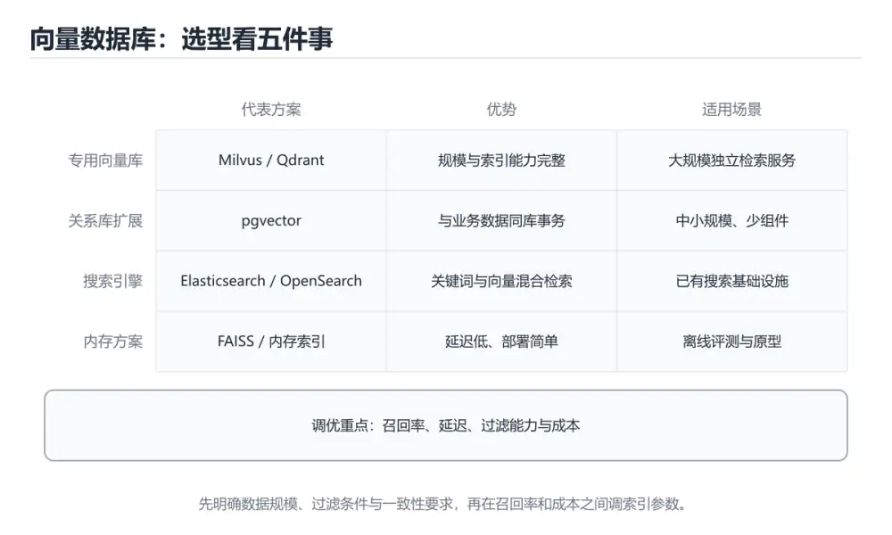
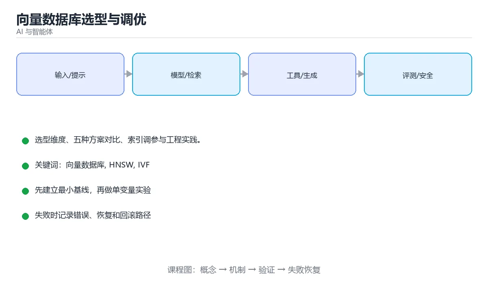

# 向量数据库选型与调优

> 内容更新时间：2026-10-06 · 学习阶段：进阶 · 预计用时：25 分钟





## 学习目标

- 能用自己的话解释向量数据库选型与调优解决了什么问题，而不是只背术语。
- 能说清 「向量数据库」、「HNSW」、「IVF」、「pgvector」 之间的关系，并分别举出一个例子。
- 能把本课知识放回「AI 与智能体」的知识体系，说明它和相邻主题的边界。
- 能完成本课练习，并用验收标准检查自己的结果。

> 一句话摘要：选型维度、五种方案对比、索引调参与工程实践。

## 前置知识

- 先完成上一课《实战：文档问答助手（RAG + Agent）》；如果已经掌握，可以直接用本课练习自测。
- 本课阶段：进阶。建议先掌握同一分类的基础课程，并能独立运行正文中的最小示例。
- 开始前先复习：向量数据库、HNSW、IVF。
- 如果某一步看不懂，先记录具体卡点，完成练习后再回头读一遍。

## 选型维度

| 维度 | 关键问题 |
| --- | --- |
| 规模 | 向量条数是千级、百万级还是十亿级 |
| 索引类型 | 需要多快、可接受多少召回损失（HNSW/IVF/PQ） |
| 过滤能力 | 是否要"先按标签过滤再检索"（预过滤 vs 后过滤） |
| 一致性 | 写入后多久能被检索到（近实时 vs 批量） |
| 运维成本 | 自建还是托管，是否需要与现有数据库复用 |
| 生态 | 是否需要混合检索（向量 + 关键词）与重排 |

## 常见方案对比

| 方案 | 特点 | 适用 |
| --- | --- | --- |
| FAISS | 库而非服务，速度极快，需自己管理持久化与并发 | 离线实验、单机检索 |
| Chroma | 轻量易用，Python 友好 | 原型与小规模应用 |
| pgvector | 长在 PostgreSQL 上，事务与 SQL 过滤天然可用 | 已有 PG、规模中等 |
| Milvus / Qdrant | 专业向量库，支持分片与多种索引 | 大规模生产 |
| 托管服务 | 免运维、按量计费 | 团队无运维能力 |

**关键取舍**：如果业务已经在用 PostgreSQL 且向量在百万级以内，pgvector 往往是最省事的选择；十亿级或需要复杂索引调优时才引入专用向量库。

## 索引与检索调优

| 索引 | 原理 | 参数影响 |
| --- | --- | --- |
| 平铺（Flat） | 精确暴力搜索 | 召回 100%，速度随规模线性下降 |
| IVF | 聚类分桶，只搜部分桶 | nprobe 越大召回越高、越慢 |
| HNSW | 分层可导航小世界图 | efSearch 越大召回越高、延迟越高 |
| PQ / 量化 | 压缩向量降内存 | 压缩率越高内存越省、精度损失越大 |

调优方法：固定一批查询与标准答案，画**召回率-延迟曲线**，选满足延迟预算下的最高召回配置；不要只看厂商 benchmark。

## 工程实践

1. 过滤与检索的顺序：先过滤会缩小候选但可能破坏索引效率，后过滤可能召回不足；支持"预过滤"的库优先。
2. 元数据与向量分表管理：向量库存向量，业务数据仍在关系库，用 ID 关联，避免把向量库当主数据库。
3. 批量写入优于逐条写入；写入后要等索引刷新（近实时）才能检索到新数据。
4. 监控召回率（用评测集抽样）、P95 延迟、内存占用与索引重建耗时。
5. 变更嵌入模型时必须**全量重建索引**，新旧向量不可混用。

## 本课小结

向量数据库选型的核心是**规模、过滤需求与运维成本**的权衡；调优则靠召回率-延迟曲线量化决策，而不是凭感觉调参数。

## 选型对照

| 方案 | 数据规模 | 特点 | 适用 |
| --- | --- | --- | --- |
| pgvector | 百万级以内 | 复用现有 PostgreSQL，事务与过滤强 | 已有 PG、规模不大 |
| Elasticsearch kNN | 千万级 | 与全文检索同栈，混合检索方便 | 已有 ES 的搜索场景 |
| Milvus | 亿级 | 索引丰富、可水平扩展 | 大规模专用场景 |
| Qdrant | 千万到亿级 | 过滤能力强、部署简单 | 需要复杂元数据过滤 |
| Weaviate | 千万级 | 内置混合检索与模块 | 快速搭建 |
| FAISS | 单机 | 纯库、无服务，性能高 | 离线与嵌入式 |
| Redis Vector | 百万级 | 低延迟、与缓存同栈 | 实时性优先 |

选型顺序建议：**先用现有数据库的方案（如 pgvector）跑通，规模或功能不够时再迁移专用向量库。**

## 索引类型速查

| 索引 | 原理 | 召回率 | 内存 | 适用 |
| --- | --- | --- | --- | --- |
| 平铺（Flat） | 暴力精确搜索 | 100% | 高 | 小数据、评测基线 |
| HNSW | 分层小世界图 | 高 | 高 | 低延迟高召回 |
| IVF-Flat | 先聚类再搜桶 | 中高 | 中 | 大数据、内存有限 |
| IVF-PQ | 聚类 + 乘积量化 | 中 | 低 | 超大规模、可接受精度损失 |
| DiskANN | 磁盘图索引 | 中高 | 低 | 数据量超过内存 |

关键参数：

| 参数 | 含义 | 调大后的影响 |
| --- | --- | --- |
| `M`（HNSW） | 每层连接数 | 召回升高、内存与构建时间增加 |
| `efConstruction` | 构建时的候选宽度 | 索引质量更高、构建更慢 |
| `efSearch` | 查询时的候选宽度 | 召回升高、延迟增加 |
| `nlist`（IVF） | 聚类桶数量 | 桶更细、训练更久 |
| `nprobe` | 查询扫描的桶数 | 召回升高、延迟增加 |

```python
import math
from dataclasses import dataclass

def ivf_nlist(num_vectors: int) -> int:
    """IVF 的 nlist 经验值：约为向量数的平方根量级。"""
    return max(1, int(4 * math.sqrt(num_vectors)))

def hnsw_m(dims: int) -> int:
    """HNSW 的 M 经验值：维度越高需要越大（通常 16 到 64）。"""
    if dims <= 256:
        return 16
    if dims <= 1024:
        return 32
    return 48

@dataclass
class RecallReport:
    """用暴力搜索作基线，评估近似索引的召回率。"""

    exact: list
    approx: list

    def recall(self) -> float:
        if not self.exact:
            return 0.0
        return round(len(set(self.exact) & set(self.approx)) / len(self.exact), 4)

    def verdict(self, target: float = 0.95) -> str:
        value = self.recall()
        if value >= target:
            return "达标"
        return f"未达标：提高 efSearch 或 nprobe（当前 {value}）"

def memory_gb(num_vectors: int, dims: int, bytes_per_value: int = 4, overhead: float = 1.3) -> float:
    """向量数据内存估算（含索引开销）。"""
    raw = num_vectors * dims * bytes_per_value / (1024 ** 3)
    return round(raw * overhead, 2)

print(ivf_nlist(1_000_000), hnsw_m(768))
print(RecallReport(exact=[1, 2, 3, 4, 5], approx=[1, 2, 3, 9, 10]).recall())
print(memory_gb(1_000_000, 768))
```

## 调优与运维速查

| 目标 | 手段 | 代价 |
| --- | --- | --- |
| 提高召回 | 提高 `efSearch` 或 `nprobe` | 延迟上升 |
| 降低延迟 | 降维、量化、减少返回条数 | 召回下降 |
| 降低内存 | PQ 量化、磁盘索引 | 精度与延迟取舍 |
| 提高过滤效率 | 常用过滤字段建标量索引 | 写入与存储增加 |
| 提高吞吐 | 分片 + 副本 | 运维复杂度 |
| 降低成本 | 冷热分层、压缩旧向量 | 实现复杂 |

必做的三件事：**用暴力搜索做召回基线、用真实查询分布压测、监控召回率与延迟趋势**。

## 常见错误与排查

| 容易踩的做法 | 实际现象 | 原因与正确做法 |
| --- | --- | --- |
| 换嵌入模型不重建索引 | 检索结果混乱 | 模型更换必须全量重建 |
| 只用相似度不做过滤 | 越权或结果不相关 | 元数据过滤 + 相似度 |
| 先检索后过滤 | 候选不足、精度差 | 支持过滤的索引或先过滤再检索 |
| 不做召回基线 | 不知道近似索引损失多少 | 用 Flat 索引测召回 |
| 只调延迟不测召回 | 结果悄悄变差 | 两者同时监控 |
| 分片数与数据量不匹配 | 小分片过多或单分片过大 | 按数据量与并发规划 |
| 无维度与内存评估 | 上线后 OOM | 提前估算内存与索引开销 |
| 不做增量更新策略 | 数据陈旧 | 支持 upsert 与删除 |
| 忽略删除后的空间回收 | 存储持续增长 | 定期 compaction 或重建 |
| 只压测空载 | 生产表现不符 | 用真实数据量与查询分布压测 |

## 复习与自测

- [ ] 选型从现有数据库方案起步，按规模再升级。
- [ ] 能说出 Flat、HNSW、IVF、PQ 的取舍。
- [ ] 用暴力搜索做召回基线并持续监控召回率。
- [ ] 过滤条件下推，避免「先检索后过滤」导致候选不足。
- [ ] 换嵌入模型时全量重建索引。

## 动手练习

> 本课练习重点：围绕「向量数据库、HNSW、IVF」完成复述、实验和交付，每个结果都要能被别人检查。

先写评测样例，再改一个提示、模型或数据变量，最后比较质量、成本与安全。

### 练习 1：建立心智模型（10 分钟）

合上教程，用 3～5 句话回答：

1. 向量数据库选型与调优解决了什么问题？
2. 如果没有它，会出现什么具体后果？
3. 它和「HNSW」是什么关系？

**验收标准**：至少出现一个本课关键词，并写出一个反例、边界条件或失效场景。

### 练习 2：做一次可控实验（20 分钟）

从正文中选一个最小示例，完成以下操作：

1. 先预测修改一个参数、输入或步骤后的结果。
2. 再实际执行或逐步推演，记录真实结果。
3. 如果结果与预测不同，写出差异原因。

**验收标准**：留下「原例 → 改动 → 预测 → 结果 → 原因」五步记录。

### 练习 3：交付一个小结果（30 分钟）

构造 5 条小型离线样例，写清输入、期望输出、评分标准和失败案例。

任务要求：

- 结果必须能被别人检查，不能只写“我已经理解了”。
- 至少覆盖「向量数据库」和「HNSW」两个关键词。
- 写出 1 个仍然不确定的问题，以及下一步如何验证。

> 提示：时间有限时优先做练习 1 和练习 2；练习 3 可以拆成两次完成。

## 可运行练习

### 任务 1：先跑通，再解释

```python
import math
from dataclasses import dataclass

def ivf_nlist(num_vectors: int) -> int:
    """IVF 的 nlist 经验值：约为向量数的平方根量级。"""
    return max(1, int(4 * math.sqrt(num_vectors)))

def hnsw_m(dims: int) -> int:
    """HNSW 的 M 经验值：维度越高需要越大（通常 16 到 64）。"""
    if dims <= 256:
        return 16
    if dims <= 1024:
        return 32
    return 48

@dataclass
class RecallReport:
    """用暴力搜索作基线，评估近似索引的召回率。"""

    exact: list
    approx: list

    def recall(self) -> float:
        if not self.exact:
            return 0.0
        return round(len(set(self.exact) & set(self.approx)) / len(self.exact), 4)

    def verdict(self, target: float = 0.95) -> str:
        value = self.recall()
        if value >= target:
            return "达标"
        return f"未达标：提高 efSearch 或 nprobe（当前 {value}）"

def memory_gb(num_vectors: int, dims: int, bytes_per_value: int = 4, overhead: float = 1.3) -> float:
    """向量数据内存估算（含索引开销）。"""
    raw = num_vectors * dims * bytes_per_value / (1024 ** 3)
    return round(raw * overhead, 2)

print(ivf_nlist(1_000_000), hnsw_m(768))
print(RecallReport(exact=[1, 2, 3, 4, 5], approx=[1, 2, 3, 9, 10]).recall())
print(memory_gb(1_000_000, 768))
```

### 任务 2：只改一个条件

把「向量数据库选型与调优」的最小示例复制一份，只改一个条件再跑一次：

- 改动点：只把向量数据库的输入换成空值、极值或错误输入，其余保持不变。
- 预测：先写下「向量数据库选型与调优」在改动后的输出或错误信息，再运行。
- 记录：对照改动前后的结果，指出差异出在哪一步。
- 验收：换回原条件能复现原结果，改动只影响向量数据库。

### 任务 3：迁移到自己的数据

用同一套思路处理一组你自己的数据或场景，保持输出格式与任务 1 一致。

## 故障现场

### 现场 1：本课的 向量数据库 常规用例通过，但边界用例失败

**症状**：在本课的练习或生产场景里出现“本课的 向量数据库 常规用例通过，但边界用例失败”。

**复现**：准备一组最小输入，只保留触发“本课的 向量数据库 常规用例通过，但边界用例失败”的必要条件，连续运行两次确认结果稳定。

**定位**：围绕“向量数据库 的前置条件与取值边界没有写进代码，默认值掩盖了空值和极值”检查调用链、输入数据和环境配置，先验证假设再改代码。

**预防**：把“本课的 向量数据库 常规用例通过，但边界用例失败”写成一条自动化用例，并在本课的验收清单里保留对应检查项。

### 现场 2：本课的 HNSW 结果在两次运行之间不一致

**症状**：在本课的练习或生产场景里出现“本课的 HNSW 结果在两次运行之间不一致”。

**复现**：准备一组最小输入，只保留触发“本课的 HNSW 结果在两次运行之间不一致”的必要条件，连续运行两次确认结果稳定。

**定位**：围绕“HNSW 依赖了当前版本、执行顺序或共享状态，单次运行无法暴露差异”检查调用链、输入数据和环境配置，先验证假设再改代码。

**预防**：把“本课的 HNSW 结果在两次运行之间不一致”写成一条自动化用例，并在本课的验收清单里保留对应检查项。

### 现场 3：离线评测分数很高，线上仍然频繁给出错误答案

**定位**：围绕“评测集与真实输入分布不一致，向量数据库 的提示词或检索结果没有覆盖失败场景”检查调用链、输入数据和环境配置，先验证假设再改代码。

## 深入补充：向量数据库选型与调优 的取舍与边界

### 一、把概念放回真实约束

学习向量数据库选型与调优时，最容易只记住结论而忽略前提。先写出三个约束：数据规模、时间预算、可接受的失败方式；再判断 向量数据库 与 HNSW 在这些约束下是否仍然成立。只要约束改变，原来的最优解就可能变成错误解。

| 维度 | 要回答的问题 | 常见做法 | 失败信号 |
| --- | --- | --- | --- |
| 数据 | 向量数据库 的训练或检索数据从哪来、质量如何 | 清洗、去重、标注与版本化 | 评测集泄漏或分布漂移 |
| 模型 | HNSW 的能力边界与成本是多少 | 基线对比、离线评测、灰度发布 | 指标好看但线上任务失败 |
| 评测 | 如何证明改动真的有效 | 固定评测集、人工抽检、A/B | 只比较单例输出 |
| 安全 | 失败时会不会泄露或越权 | 权限校验、内容过滤、审计 | 提示注入或数据外泄 |

### 二、三个容易混淆的边界

1. 澄清输入与目标。先写清「向量数据库选型与调优」要解决的问题、合法输入范围和成功标准，再进入后续步骤。
2. **把“平均值”当成“全部”**：向量数据库 的指标好看，不代表尾部请求、冷启动或失败重试也好看。
3. **把“当前版本”当成“永久行为”**：HNSW 依赖的默认值、API 或性能特征都可能随版本变化，需要固定版本并保留回归用例。

### 三、一个生产场景

假设团队要在真实系统里使用向量数据库选型与调优：第一周先做小流量验证，记录 向量数据库 的基线与异常；第二周扩大输入规模，观察 HNSW 是否成为瓶颈；第三周再做故障演练，主动注入超时、重复请求和依赖不可用，确认系统能降级、能重试、能恢复。每一步都要留下指标、日志和结论，而不是只留下“感觉更快了”。

### 四、自测清单

- 能否用一句话说出向量数据库选型与调优解决的核心问题与不适用场景？
- 能否画出 向量数据库 的数据流或状态变化，并标出失败路径？
- 能否给出一个反例，证明某个看似合理的结论在边界条件下不成立？
- 能否写出一条可复现的验证命令，让别人独立得到相同结论？

### 五、AI 工程补充

在向量数据库选型与调优里，模型输出只是系统的一部分：输入要先经过权限与数据质量检查，检索或工具调用要有超时和降级，输出要经过引用核验或规则校验，最后记录 token、延迟、失败类型和人工反馈。评测时至少准备固定题、边界题和对抗题，并把 向量数据库 与 HNSW 的指标分开记录；否则一次提示词改动看似提升体验，实际可能只是评测样本泄漏或随机波动。

## 本课复习清单

离开本课前，逐项确认：

- [ ] 不看解析，能说出「已有 PostgreSQL 且向量在百万级以内，最省事的方案是？」的判断依据。
- [ ] 不看解析，能说出「HNSW 的 efSearch 参数调大后？」的判断依据。
- [ ] 不看解析，能说出「更换嵌入模型后必须做什么？」的判断依据。
- [ ] 不看解析，能说出「向量检索中召回率与延迟如何权衡？」的判断依据。
- [ ] 不看解析，能说出「元数据过滤在向量检索中的常见坑是？」的判断依据。
- [ ] 不看解析，能说出的判断依据。
- [ ] 至少运行一次本课示例，记录输入、输出和一个边界情况。
- [ ] 把本课最容易混淆的两个概念写成一句话对照。

| 复盘项 | 记录 |
| --- | --- |
| 已经能独立解释的考点 |  |
| 仍然说不清的概念 |  |
| 下一步验证动作 |  |

## 术语速查

| 术语 | 本课语境 |
| --- | --- |
| `efConstruction` | \| `efConstruction` \| 构建时的候选宽度 \| 索引质量更高、构建更慢 \| |
| `efSearch` | \| `efSearch` \| 查询时的候选宽度 \| 召回升高、延迟增加 \| |
| `nlist` | \| `nlist`（IVF） \| 聚类桶数量 \| 桶更细、训练更久 \| |
| `nprobe` | \| `nprobe` \| 查询扫描的桶数 \| 召回升高、延迟增加 \| |

## 考点精讲

### 考点 1：概念判断·向量数据库

- **题目**：已有 PostgreSQL 且向量在百万级以内，最省事的方案是？
- **判断依据**：复用现有数据库的事务与 SQL 过滤能力，运维成本最低。在「向量数据库选型与调优」里，其他选项：已有 PostgreSQL 时 pgvector 可复用现有事务与过滤能力，最省事。回到「向量数据库选型与调优」的正文示例，用“已有 PostgreSQL 且向量在”走一遍向量数据库、HNSW、IVF的完整流程，能复现的结论才可以保留。

### 考点 2：多选辨析·向量数据库

- **题目**：围绕“向量数据库选型与调优”中的 向量数据库、HNSW、IVF，下列哪两项是本课强调的实践判断？
- **判断依据**：本课把向量数据库选型与调优拆成概念、示例与故障现场三部分，因此判断 向量数据库 时必须同时交代输入、输出和失败路径，这使“学习 向量数据库 时要同时说明输入、输出和失败路径，不能只看正常流程”成立。在向量数据库选型与调优里，判断 HNSW 时要固定版本与边界输入，所以“验证 HNSW 时要固定版本并覆盖边界输入，结论才可复现”才可复现。

### 考点 3：概念判断·向量数据库

- **题目**：「向量数据库选型与调优」的核心结论是什么？
- **判断依据**：题干的正确项是向量数据库选型与调优：选型维度、五种方案对比、索引调参与工程实践。在「向量数据库选型与调优」里，把向量数据库、HNSW、IVF放进最小示例验证，换成空值或极值后结论仍要成立。这道题的关键在「向量数据库选型与调优」的向量数据库、HNSW、IVF：先确认题干“向量数据库选型与调优的核心结论是什么”问的是哪一步，再排除偷换前提的选项。

### 考点 4：概念判断·向量数据库

- **题目**：向量检索中召回率与延迟如何权衡？
- **判断依据**：在「向量数据库选型与调优」里，结论应落在「增大 efSearch / nprobe 等参数提高召回，但会明显增加延迟」。结论应落在增大 efSearch / nprobe 等参数提高召回。应先在评测集上测召回，再在可接受的延迟预算内选择参数。这道题的关键在「向量数据库选型与调优」的向量数据库、HNSW、IVF：先确认题干“向量检索中召回率与延迟如何权衡”问的是哪一步，再排除偷换前提的选项。

### 考点 5：概念判断·向量数据库

- **题目**：元数据过滤在向量检索中的常见坑是？
- **判断依据**：在「向量数据库选型与调优」里，先过滤再检索与先检索再过滤的结果数量差异很大。不同引擎的过滤实现不同，需要在真实数据分布下验证召回是否稳定。「向量数据库选型与调优」要求先交代向量数据库、HNSW、IVF的前提再下结论，所以“先过滤再检索与先检索再过滤的结果数量差异”只在题干“元数据过滤在向量检索中的常见坑是”给定的条件下成立。

### 考点 6：填空·向量数据库

- **题目**：补全代码：「向量数据库选型与调优」示例中，下面这行代码缺少哪个关键字或函数名？请填入 ____。 `return f"未达标：提高 ____ 或 nprobe（当前 {value}）"`
- **判断依据**：在「向量数据库选型与调优」里判断这道题，要把向量数据库、HNSW、IVF的条件、过程与失败路径逐项对齐，换成“补全代码”这个场景，只有满足前提的结论才成立。“向量数据库选型与调优示例中”与「向量数据库选型与调优」的术语表相呼应，只有符合向量数据库、HNSW、IVF约束的“efSearch”才是正文支持的结论。

## English Overview

**Title:** Vector Database Selection

**Summary:** Selection criteria, index tuning and practices.

**Category:** AI & Agents
**Level:** 进阶
**Key terms:** 向量数据库, HNSW, IVF, pgvector, 召回率

## 内容元数据

- 内容版本：v2.0
- 最后更新：2026-10-06
- 学习阶段：进阶
- 适用环境：主流大模型 API、开源模型与向量数据库
- 内容来源：内置结构化课程与工程实践整理
- 相关主题：向量数据库、HNSW、IVF、pgvector、召回率
- 质量版本：P0 测验标准 + P1 覆盖扩展 + P2 体验补全

## 参考资料与复核

- 最后复核：2026-10-04
- 下次复核：2027-04-04
- 复核范围：版本兼容、API 行为、安全建议与工程实践
- 来源性质：官方文档、标准或权威教材；正文为离线教学重组

| 参考资料 | 本课用途 |
| --- | --- |
| [LlamaIndex 文档](https://docs.llamaindex.ai/) | 索引、检索与数据框架 |
| [Anthropic 文档](https://docs.anthropic.com/) | Claude API 与 Agent 安全 |
| [PyTorch 文档](https://pytorch.org/docs/stable/index.html) | 张量、训练与推理 |

> 「向量数据库选型与调优」的链接用于离线阅读后的延伸核对；App 不会自动联网。
