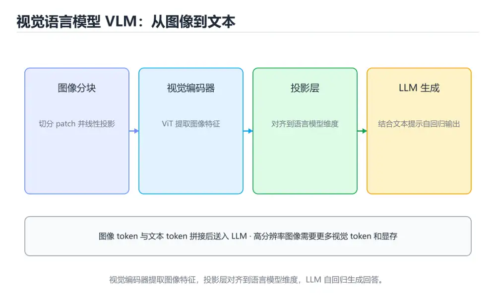
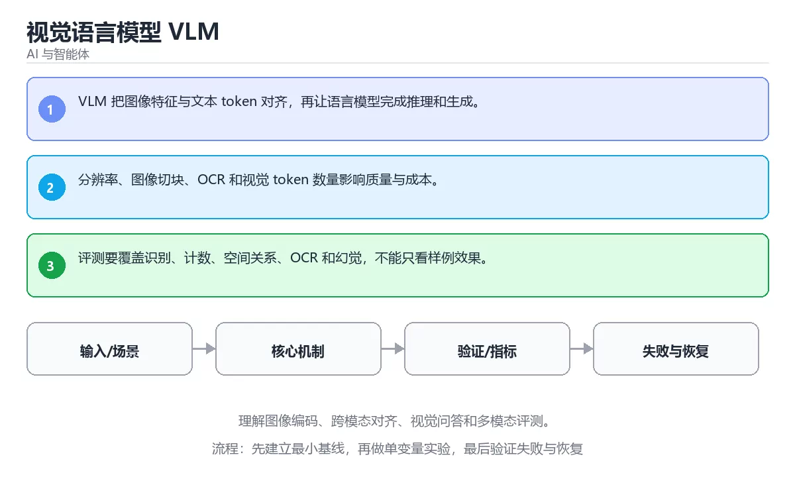

# 视觉语言模型 VLM

> 内容更新时间：2026-10-06 · 学习阶段：进阶 · 预计用时：30 分钟





## 学习目标

- 能用自己的话解释：VLM 把图像特征与文本 token 对齐，再让语言模型完成推理和生成。
- 能用自己的话解释：分辨率、图像切块、OCR 和视觉 token 数量影响质量与成本。
- 能用自己的话解释：评测要覆盖识别、计数、空间关系、OCR 和幻觉，不能只看样例效果。
- 能把本课知识放回「AI 与智能体」，并完成练习与测验。

## 前置知识

- 能运行 answer 所在的示例环境，并读懂报错信息。
- 本课关键词：VLM、视觉编码、跨模态、多模态评测。
- 遇到不熟悉的术语先记录问题，完成练习后再回读。

## 核心知识

### 1. VLM 把图像特征与文本 token 对齐，再让语言模型完成推理和生成。

- 关键做法：先用 answer 建立 VLM 的基线，再逐步加入边界与失败条件。
- 验证标准：视觉编码 的异常路径有明确错误信息与恢复动作。

### 2. 分辨率、图像切块、OCR 和视觉 token 数量影响质量与成本。

把这条结论放回「视觉语言模型 VLM」的完整流程里展开：

- 正文依据：能用自己的话解释：VLM 把图像特征与文本 token 对齐，再让语言模型完成推理和生成。
- 落地检查：把「2. 分辨率、图像切块、OCR 和视觉 token 数量影响质量与成本。」改写成一条可执行的核对项，逐条验证输入、超时与失败路径。

### 3. 评测要覆盖识别、计数、空间关系、OCR 和幻觉，不能只看样例效果。

把这条结论放回「视觉语言模型 VLM」的完整流程里展开：

- 正文依据：本课关键词：VLM、视觉编码、跨模态、多模态评测。
- 落地检查：把「3. 评测要覆盖识别、计数、空间关系、OCR 和幻觉，不能只看样例效果。」改写成一条可执行的核对项，逐条验证输入、超时与失败路径。

## 关键流程

```text
输入 → 校验 → 核心处理 → 验证 → 记录指标 → 失败恢复
```

## 实践路径

1. 用一句话复述本课要解决的问题。
2. 跑通正文中的最小示例并记录基线。
3. 只改变一个输入或参数，预测并验证结果。
4. 补一个失败路径，记录错误、恢复和指标。
5. 把结论写成可复现的笔记或测试。

## 常见错误与排查

> 说明：本表由《视觉语言模型 VLM》的核心知识整理（2026-10-07），人工复核进度见 docs/content_review_batches.md。

| 易错点 | 容易踩的做法 | 正确结论 |
| --- | --- | --- |
| 把整张图当成完整信息源 | 小字与细节被误读 | 对关键区域裁剪放大后二次提问，并交叉核对 |
| 忽略分辨率与长宽比 | 缩放后细节丢失，坐标偏移 | 控制输入分辨率与分块方式，保留原始比例 |
| 用 VLM 做精确计数与读表 | 密集场景下数字不可靠 | 精确任务交给 OCR 或结构化工具，再用视觉结果校验 |

## 动手练习

1. 合上教程，用 3～5 句话解释视觉语言模型 VLM。
2. 从正文选一个例子，改变一个条件并预测结果。
3. 设计一个失败场景，写出止损与恢复步骤。

**验收标准**：留下输入、命令、输出、差异和下一步问题。

## 本课小结

- 本课围绕 VLM、视觉编码、跨模态、多模态评测 展开，复习时重点核对它们的输入、输出和失败路径。
- 做完本课测验后，把答错且解释不清的 视觉编码 相关题目记成验证任务。


## 可运行练习

### 任务 1：先跑通，再解释

```python
def score(answer: str) -> int:
    return 1 if answer.strip() else 0

print(score("agent"))
```

### 任务 2：只改一个条件

把「视觉语言模型 VLM」的最小示例复制一份，只改一个条件再跑一次：

- 改动点：把 视觉编码 换成边界值，其他输入保持原样。
- 预测：先写下「视觉语言模型 VLM」在改动后的输出或错误信息，再运行。
- 记录：对照改动前后的结果，指出差异出在哪一步。
- 验收：换回原条件能复现原结果，改动只影响VLM。

### 任务 3：迁移到自己的数据

换一个 视觉编码 场景重做一次，确认结论不是只对示例数据成立。

## 故障现场

### 现场 1：把整张图当成完整信息源

**症状**：在《视觉语言模型 VLM》的复现场景中，小字与细节被误读。

**根因**：当出现“把整张图当成完整信息源”时，执行路径已经绕过了《视觉语言模型 VLM》的关键约束，最终以“小字与细节被误读”暴露出来；修复前必须先确认约束在哪里失效。

**修复**：针对《视觉语言模型 VLM》的问题，对关键区域裁剪放大后二次提问，并交叉核对。

**验证**：在《视觉语言模型 VLM》中按“对关键区域裁剪放大后二次提问，并交叉核对”调整后，从“把整张图当成完整信息源”的触发条件重放同一条路径，确认“小字与细节被误读”不再出现，并补一个相邻边界用例检查没有引入新问题。

### 现场 2：忽略分辨率与长宽比

**症状**：在《视觉语言模型 VLM》的复现场景中，缩放后细节丢失，坐标偏移。

**根因**：触发点是把“忽略分辨率与长宽比”当成安全做法。它没有满足《视觉语言模型 VLM》要求的前提，因此先表现为“缩放后细节丢失，坐标偏移”；排查时先完整复现这一段，再核对输入、配置与依赖。

**修复**：针对《视觉语言模型 VLM》的问题，控制输入分辨率与分块方式，保留原始比例。

**验证**：先在《视觉语言模型 VLM》中记录“忽略分辨率与长宽比”留下的失败证据，再执行“控制输入分辨率与分块方式，保留原始比例”并重放；确认错误路径变为明确结果，且修复没有掩盖同类故障。

### 现场 3：用 VLM 做精确计数与读表

**症状**：在《视觉语言模型 VLM》的复现场景中，密集场景下数字不可靠。

**根因**：“密集场景下数字不可靠”只是表层结果。向上追溯会落到“用 VLM 做精确计数与读表”这一步，因为它省略了《视觉语言模型 VLM》的约束，使实现行为和预期模型发生了偏离。

**修复**：针对《视觉语言模型 VLM》的问题，精确任务交给 OCR 或结构化工具，再用视觉结果校验。

**验证**：在《视觉语言模型 VLM》中按“精确任务交给 OCR 或结构化工具，再用视觉结果校验”调整后，从“用 VLM 做精确计数与读表”的触发条件重放同一条路径，确认“密集场景下数字不可靠”不再出现，并补一个相邻边界用例检查没有引入新问题。

## 深入补充：视觉语言模型 VLM 的取舍与边界

### 一、把概念放回真实约束

学习视觉语言模型 VLM时，最容易只记住结论而忽略前提。先写出三个约束：数据规模、时间预算、可接受的失败方式；再判断 VLM 与 视觉编码 在这些约束下是否仍然成立。只要约束改变，原来的最优解就可能变成错误解。

| 维度 | 要回答的问题 | 常见做法 | 失败信号 |
| --- | --- | --- | --- |
| 数据 | VLM 的训练或检索数据从哪来、质量如何 | 清洗、去重、标注与版本化 | 评测集泄漏或分布漂移 |
| 模型 | 视觉编码 的能力边界与成本是多少 | 基线对比、离线评测、灰度发布 | 指标好看但线上任务失败 |
| 评测 | 如何证明改动真的有效 | 固定评测集、人工抽检、A/B | 只比较单例输出 |
| 安全 | 失败时会不会泄露或越权 | 权限校验、内容过滤、审计 | 提示注入或数据外泄 |

### 二、三个容易混淆的边界

1. 澄清输入与目标。先写清「视觉语言模型 VLM」要解决的问题、合法输入范围和成功标准，再进入后续步骤。
2. **把“平均值”当成“全部”**：VLM 的指标好看，不代表尾部请求、冷启动或失败重试也好看。
3. **把“当前版本”当成“永久行为”**：视觉编码 依赖的默认值、API 或性能特征都可能随版本变化，需要固定版本并保留回归用例。

### 三、一个生产场景

假设团队要在真实系统里使用视觉语言模型 VLM：第一周先做小流量验证，记录 VLM 的基线与异常；第二周扩大输入规模，观察 视觉编码 是否成为瓶颈；第三周再做故障演练，主动注入超时、重复请求和依赖不可用，确认系统能降级、能重试、能恢复。每一步都要留下指标、日志和结论，而不是只留下“感觉更快了”。

### 四、自测清单

- 能否用一句话说出视觉语言模型 VLM解决的核心问题与不适用场景？
- 能否画出 VLM 的数据流或状态变化，并标出失败路径？
- 能否给出一个反例，证明 VLM 的结论在边界条件下不成立？
- 能否写出一条可复现的验证命令，让别人独立得到相同结论？

### 五、AI 工程补充

在视觉语言模型 VLM里，模型输出只是系统的一部分：输入要先经过权限与数据质量检查，检索或工具调用要有超时和降级，输出要经过引用核验或规则校验，最后记录 token、延迟、失败类型和人工反馈。评测时至少准备固定题、边界题和对抗题，并把 VLM 与 视觉编码 的指标分开记录；否则一次提示词改动看似提升体验，实际可能只是评测样本泄漏或随机波动。

## 本课复习清单


离开本课前，逐项确认：

- [ ] 不看解析，能说出「下面这段 Python 代码摘自「视觉语言模型 VLM」的正文示例。关于这段代码，下面哪一项说法与实际内容相符？」的判断依据。
- [ ] 不看解析，能说出「关于「分辨率、图像切块、OCR 和视觉 token 数量影响质量与成本。」，下列说法正确的是？」的判断依据。
- [ ] 不看解析，能说出「关于「评测要覆盖识别、计数、空间关系、OCR 和幻觉，不能只看样例效果。」，下列说法正确的是？」的判断依据。
- [ ] 至少运行一次《视觉语言模型 VLM》的示例，记录输入、输出和一个边界情况。
- [ ] 把本课最容易混淆的两个概念写成一句话对照。

| 复盘项 | 记录 |
| --- | --- |
| 已经能独立解释的考点 |  |
| 仍然说不清的概念 |  |
| 下一步验证动作 |  |

## 复习与自测

逐节自检：能说清 VLM 的输入、输出与失败路径才算通过，否则回到原文。

### 核心知识

自检：这一节与相邻主题的边界在哪里？

### 动手练习

自检：如果去掉这一节里的一个前提，结论会怎样变化？

### 验证步骤

制造一次错误输入，记录错误信息与修复方式。
### 追问 1：关于「VLM 把图像特征与文本 token 对齐，再让语言模型完成推理和生成。」，下列说法正确的是？

- 先写下判断，再对照：VLM 把图像特征与文本 token 对齐，再让语言模型完成推理和生成。
- 检查点：如果 VLM 的输入换成边界值，这个结论还需要补充哪个前提？

### 追问 2：关于「分辨率、图像切块、OCR 和视觉 token 数量影响质量与成本。」，下列说法正确的是？

- 先写下判断，再对照：分辨率、图像切块、OCR 和视觉 token 数量影响质量与成本。

### 追问 3：关于「评测要覆盖识别、计数、空间关系、OCR 和幻觉，不能只看样例效果。」，下列说法正确的是？

- 先写下判断，再对照：评测要覆盖识别、计数、空间关系、OCR 和幻觉，不能只看样例效果。

### 追问 4：本课的核心学习目标是什么？

- 先写下判断，再对照：理解图像编码、跨模态对齐、视觉问答和多模态评测。

## 术语速查

| 术语 | 一句话说明 |
| --- | --- |
| `VLM` | VLM 把图像特征与文本 token 对齐，再让语言模型完成推理和生成。 |
| `视觉编码` | 把图像或视频转换成模型可处理的向量表示，保留任务需要的视觉信息。 |
| `跨模态` | 按“视觉语言模型 VLM”中 VLM、视觉编码、跨模态 的实践顺序，把四个步骤排成从准备到复盘的合理顺序。 |
| `多模态评测` | 同时检查文本、图像、音频等输入下的理解、生成和跨模态一致性。 |

## 零基础精讲：把视觉语言模型 VLM真正讲透

### 先建立一个直觉

把「视觉语言模型 VLM」看成一条可评测的流水线：输入经过 VLM 处理，产出候选结果，再由 视觉编码 决定哪些结果可以真正执行；每一环都要有可测的输入、输出与失败处理。

本课的摘要可以当作一张地图：理解图像编码、跨模态对齐、视觉问答和多模态评测。

### 逐步拆解

1. 澄清输入与目标。先写清「视觉语言模型 VLM」要解决的问题、合法输入范围和成功标准，再进入后续步骤。
2. 描述处理过程。把「VLM、视觉编码、跨模态、多模态评测」映射到具体步骤，每步都要求能单独验证。
3. 定义输出。VLM 的输出不仅包括正常结果，还包括错误码、日志和资源释放状态。
4. 构造一次VLM越界，记录系统是拒绝、降级还是静默出错；三者对应的修复策略完全不同。
5. 把 answer 的规模缩小到一眼能算清的程度，手动推导结果后再用程序验证，差异处就是理解漏洞。

### 把正文串成一条执行链

- **1. VLM 把图像特征与文本 token 对齐，再让语言模型完成推理和生成。**：在「视觉语言模型 VLM」里，「1. VLM 把图像特征与文本 token 对齐，再让语言模型完成推理和生成。」这一步要先写清输入与预期，再记录实际结果和差异；结果不符时回到对应小节核对前提。
- **2. 分辨率、图像切块、OCR 和视觉 token 数量影响质量与成本。**：在「视觉语言模型 VLM」里，「2. 分辨率、图像切块、OCR 和视觉 token 数量影响质量与成本。」这一步要先写清输入与预期，再记录实际结果和差异；结果不符时回到对应小节核对前提。
- **3. 评测要覆盖识别、计数、空间关系、OCR 和幻觉，不能只看样例效果。**：在「视觉语言模型 VLM」里，「3. 评测要覆盖识别、计数、空间关系、OCR 和幻觉，不能只看样例效果。」这一步要先写清输入与预期，再记录实际结果和差异；结果不符时回到对应小节核对前提。
- **考点 1：核心知识 的代码阅读题**：先独立作答，再回到本课正文核对 answer 的执行路径；答错时记录是哪一个前提被忽略。
- **考点 2：关于「分辨率、图像切块、OCR 和视觉 token 数量影响质量与成本。」，下列说法正确的是？**：先独立作答，再回到本课对应小节核对判断依据；答错时记录是哪一个前提被忽略。
- **考点 3：关于「评测要覆盖识别、计数、空间关系、OCR 和幻觉，不能只看样例效果。」，下列说法正确的是？**：先独立作答，再回到本课对应小节核对判断依据；答错时记录是哪一个前提被忽略。

### 从测验反推易错点

**检查点 1：关于「VLM 把图像特征与文本 token 对齐，再让语言模型完成推理和生成。」，下列说法正确的是？**

- 参考判断：VLM 把图像特征与文本 token 对齐，再让语言模型完成推理和生成。
- 自问：如果去掉题干里的一个限定词，结论还成立吗？

**检查点 2：关于「分辨率、图像切块、OCR 和视觉 token 数量影响质量与成本。」，下列说法正确的是？**

- 参考判断：分辨率、图像切块、OCR 和视觉 token 数量影响质量与成本。

**检查点 3：关于「评测要覆盖识别、计数、空间关系、OCR 和幻觉，不能只看样例效果。」，下列说法正确的是？**

- 参考判断：评测要覆盖识别、计数、空间关系、OCR 和幻觉，不能只看样例效果。

**检查点 4：本课的核心学习目标是什么？**

- 参考判断：理解图像编码、跨模态对齐、视觉问答和多模态评测。

**检查点 5：以下哪些术语与视觉语言模型 VLM直接相关？（多选）**

- 参考判断：VLM、视觉编码

### 工程排错顺序

| 先查什么 | 要得到的证据 | 判断标准 |
| --- | --- | --- |
| 模型输入是否经过长度、格式与敏感信息检查？ | 日志、输入样例、测试或指标 | 能复现并解释，才算定位 |
| 工具调用是否最小权限、可超时、可取消？ | 日志、输入样例、测试或指标 | 能复现并解释，才算定位 |
| 输出是否有引用、置信度或人工复核兜底？ | 日志、输入样例、测试或指标 | 能复现并解释，才算定位 |
| 成本、延迟与失败率是否有指标？ | 日志、输入样例、测试或指标 | 能复现并解释，才算定位 |

### 变式训练

1. 把 VLM 的实现压缩到一个进程内，去掉所有外部依赖后再谈扩展。
2. 把 VLM 的输入规模扩大十倍，记录时间、内存和失败路径，找出第一个瓶颈。
3. 把 视觉编码 换成失败输入，记录错误信息与恢复动作。
5. 把「视觉语言模型 VLM」里最容易被省略的一步去掉，用测试或指标证明它不可省略，而不是凭感觉判断。
6. 限制 CPU 与内存上限后重跑 answer，观察哪一项参数需要重新设定。

### 本课自测

- [ ] 能用一句话解释「VLM」在本课中的角色与边界。
- [ ] 能举出一个正常例子和一个失败例子。
- [ ] 能说出最小验证步骤，以及需要记录的证据。
- [ ] 能用一句话解释「视觉编码」在本课中的角色与边界。
- [ ] 能用一句话解释「跨模态」在本课中的角色与边界。
- [ ] 能用一句话解释「多模态评测」在本课中的角色与边界。

### 迁移案例库

下面用不同约束重复同一套方法，每轮只改变 VLM 的一个取值并记录结论。

#### 迁移案例 1：围绕「VLM」做一次小实验

**目标**：在不改变课程主体的前提下，验证视觉语言模型 VLM中的一个关键判断。

**步骤**：
1. 复述当前方案对「VLM」的假设，写成一句可证伪的话。
2. 设计一个正常输入和一个边界输入，分别预测输出。
3. 运行或逐步演算，记录实际输出、耗时和失败信息。
4. 只调整一个参数，比较前后差异并解释原因。
5. 补充一条测试或复习卡，确保下次能更快复现。

**验收**：把「视觉语言模型 VLM」的判断依据写成可复现步骤，换一台机器或换一个输入仍能得到同一结论。

#### 迁移案例 2：围绕「视觉编码」做一次小实验

**步骤**：
1. 复述当前方案对「视觉编码」的假设，写成一句可证伪的话。

#### 迁移案例 3：围绕「跨模态」做一次小实验

**步骤**：
1. 复述当前方案对「跨模态」的假设，写成一句可证伪的话。

#### 迁移案例 4：围绕「多模态评测」做一次小实验

**步骤**：
1. 复述当前方案对「多模态评测」的假设，写成一句可证伪的话。

#### 迁移案例 5：围绕「VLM」做一次小实验

**步骤**：

#### 迁移案例 6：围绕「视觉编码」做一次小实验

**步骤**：

#### 迁移案例 7：围绕「跨模态」做一次小实验

**步骤**：

#### 迁移案例 8：围绕「多模态评测」做一次小实验

**步骤**：

#### 迁移案例 9：围绕「VLM」做一次小实验

**步骤**：

#### 迁移案例 10：围绕「视觉编码」做一次小实验

**步骤**：

#### 迁移案例 11：围绕「跨模态」做一次小实验

**步骤**：

#### 迁移案例 12：围绕「多模态评测」做一次小实验

**步骤**：

#### 迁移案例 13：围绕「VLM」做一次小实验

**步骤**：

#### 迁移案例 14：围绕「视觉编码」做一次小实验

**步骤**：

#### 迁移案例 15：围绕「跨模态」做一次小实验

**步骤**：

#### 迁移案例 16：围绕「多模态评测」做一次小实验

**步骤**：

<!-- p0-depth-v2:end -->

## 考点精讲

### 考点 1：代码补全·VLM

- **题目**：下面这段 Python 代码摘自「视觉语言模型 VLM」的正文示例。关于这段代码，下面哪一项说法与实际内容相符？
- **判断依据**：题干的正确项是这段代码包含条件分支，不同输入会走不同的执行路径，在「视觉语言模型 VLM」里分支条件由VLM决定，替换条件后结论可能变化。这段代码出自「视觉语言模型 VLM」的正文示例，围绕VLM、视觉编码、跨模态展开；把输入或边界换成空值、极值或失败情况后，结论要以「视觉语言模型 VLM」的实际运行结果为准。回到「视觉语言模型 VLM」的正文示例，用“下面这段 Python 代码摘自视觉”走一遍VLM、视觉编码、跨模态的完整流程，能复现的结论才可以保留。

### 考点 2：概念判断·VLM

- **题目**：关于「分辨率、图像切块、OCR 和视觉 token 数量影响质量与成本。」，下列说法正确的是？
- **判断依据**：在「视觉语言模型 VLM」里，分辨率、图像切块、OCR 和视觉 token 数量影响质量与成本。这道题的关键在「视觉语言模型 VLM」的VLM、视觉编码、跨模态：先确认题干“关于分辨率、图像切块、OCR 和视觉”问的是哪一步，再排除偷换前提的选项。把“分辨率、图像切块”代回「视觉语言模型 VLM」里“分辨率、图像切块、OCR 和视觉 token 数量影响质量与”的例子核对，条件一旦改变，结论就要用VLM、视觉编码、跨模态重新推导。

### 考点 3：概念判断·VLM

- **题目**：关于「评测要覆盖识别、计数、空间关系、OCR 和幻觉，不能只看样例效果。」，下列说法正确的是？
- **判断依据**：在「视觉语言模型 VLM」里，评测要覆盖识别、计数、空间关系、OCR 和幻觉，不能只看样例效果。在「视觉语言模型 VLM」里判断这道题，要把VLM、视觉编码、跨模态的条件、过程与失败路径逐项对齐，换成“关于评测要覆盖识别、计数、空间关系、”这个场景，只有满足前提的结论才成立。“评测要覆盖识别”与「视觉语言模型 VLM」的术语表相呼应，只有符合VLM、视觉编码、跨模态约束的“评测要覆盖识别、计数、空间关系”才是正文支持的结论。

### 考点 4：顺序排列·VLM

- **题目**：按“视觉语言模型 VLM”中 VLM、视觉编码、跨模态 的实践顺序，把四个步骤排成从准备到复盘的合理顺序。
- **判断依据**：在「视觉语言模型 VLM」里，在本课的练习里，顺序应当是：先明确 VLM 的输入、输出与约束 → 写出最小示例并核对 视觉编码 的基线结果 → 只改一个变量，记录边界与失败路径的变化 → 固定版本与证据，把本课的结论写成可复现记录。这个顺序把 VLM 的输入、输出和约束放在最前面，在视觉语言模型 VLM里避免概念没对齐就开始调参。第二步用 视觉编码 建立可核对的基线，在视觉语言模型 VLM里第三步才允许改变一个变量并观察失败路径。

### 考点 5：多选辨析·VLM

- **题目**：以下哪些术语与「视觉语言模型 VLM」直接相关？（多选）
- **判断依据**：在「视觉语言模型 VLM」里，视觉编码。这道题的关键在「视觉语言模型 VLM」的VLM、视觉编码、跨模态：先确认题干“以下哪些术语与视觉语言模型 VLM直”问的是哪一步，再排除偷换前提的选项。把“VLM”代回正文里“以下哪些术语与视觉语言模型”的例子核对，条件一旦改变，结论就要用VLM、视觉编码、跨模态重新推导。

## English Overview

**Title:** Vision-Language Models

**Summary:** Learn image encoding, cross-modal alignment, VQA and multimodal evaluation.

**Category:** AI & Agents
**Level:** 高级
**Key terms:** VLM, 视觉编码, 跨模态, 多模态评测

## 内容元数据

- 内容版本：v2.0
- 最后更新：2026-10-06
- 学习阶段：进阶
- 适用环境：主流大模型 API、开源模型与向量数据库；本课聚焦 VLM。
- 内容来源：内置结构化课程与工程实践整理
- 相关主题：VLM、视觉编码、跨模态、多模态评测
- 质量版本：P0 测验标准 + P1 覆盖扩展 + P2 体验补全

## 最小可运行示例

先用 answer 跑通最小示例，然后只改一个与 VLM 相关的取值：

```python
def score(answer: str) -> int:
    return 1 if answer.strip() else 0

print(score("agent"))
```

## 预期输出

```text
1
```

## 验证步骤

1. 记录运行环境、命令和真实输出。
2. 修改一个输入，先写预测再运行。
4. 把结论写回本课笔记或测试用例。

## 参考资料与复核

- 最后复核：2026-10-04
- 下次复核：2027-04-17
- 复核范围：版本兼容、API 行为、安全建议与工程实践
- 来源性质：官方文档、标准或权威教材；正文为离线教学重组

| 参考资料 | 本课用途 |
| --- | --- |
| [Google AI 文档](https://ai.google.dev/gemini-api/docs) | Gemini API 与多模态 |
| [Model Context Protocol](https://modelcontextprotocol.io/) | Agent 工具与上下文协议 |
| [OpenAI 开发者文档](https://platform.openai.com/docs/) | 模型 API、工具与评估 |

> 「视觉语言模型 VLM」的链接用于离线阅读后的延伸核对；App 不会自动联网。

## 复习与迁移

复习目标：把「视觉语言模型 VLM」的判断标准放回可复现的例子里。先自己作答，再对照依据；如果结论正确但理由不完整，回到正文补足前提。

### 概念复述

- 用一句话说明「视觉语言模型 VLM」解决什么问题：理解图像编码、跨模态对齐、视觉问答和多模态评测。
- 写出VLM、视觉编码、跨模态之间的关系，并各举一个例子。
- 说出本课最容易混淆的两个概念，以及区分它们的判据。

### 正文逐节复核

- **深入补充：视觉语言模型 VLM 的取舍与边界**：学习视觉语言模型 VLM时，最容易只记住结论而忽略前提。
- **零基础精讲：把视觉语言模型 VLM真正讲透**：本课的摘要可以当作一张地图：理解图像编码、跨模态对齐、视觉问答和多模态评测。

### 测验回顾

1. 下面这段 Python 代码摘自「视觉语言模型 VLM」的正文示例。关于这段代码，下面哪一项说法与实际内容相符？
   - 依据：题干的正确项是这段代码包含条件分支，不同输入会走不同的执行路径，在「视觉语言模型 VLM」里分支条件由VLM决定，替换条件后结论可能变化。这段代码出自「视觉语言模型 VLM」的正文示例，围绕VLM、视觉编码、跨模态展开；把输入或边界换成空值、极值或失败情况后，结论要以「视觉语言模型 VLM」的实际运行结果为准。回到「视觉语言模型 VLM」的正文示例，用“下面这段 Python 代码摘自视觉”走一遍VLM、视觉编码、跨模态的完整流程，能复现的结论才可以保留。
2. 关于「分辨率、图像切块、OCR 和视觉 token 数量影响质量与成本。」，下列说法正确的是？
   - 依据：在「视觉语言模型 VLM」里，分辨率、图像切块、OCR 和视觉 token 数量影响质量与成本。这道题的关键在「视觉语言模型 VLM」的VLM、视觉编码、跨模态：先确认题干“关于分辨率、图像切块、OCR 和视觉”问的是哪一步，再排除偷换前提的选项。把“分辨率、图像切块”代回「视觉语言模型 VLM」里“分辨率、图像切块、OCR 和视觉 token 数量影响质量与”的例子核对，条件一旦改变，结论就要用VLM、视觉编码、跨模态重新推导。
3. 关于「评测要覆盖识别、计数、空间关系、OCR 和幻觉，不能只看样例效果。」，下列说法正确的是？
   - 依据：在「视觉语言模型 VLM」里，评测要覆盖识别、计数、空间关系、OCR 和幻觉，不能只看样例效果。在「视觉语言模型 VLM」里判断这道题，要把VLM、视觉编码、跨模态的条件、过程与失败路径逐项对齐，换成“关于评测要覆盖识别、计数、空间关系、”这个场景，只有满足前提的结论才成立。“评测要覆盖识别”与「视觉语言模型 VLM」的术语表相呼应，只有符合VLM、视觉编码、跨模态约束的“评测要覆盖识别、计数、空间关系”才是正文支持的结论。
4. 按“视觉语言模型 VLM”中 VLM、视觉编码、跨模态 的实践顺序，把四个步骤排成从准备到复盘的合理顺序。
   - 依据：在「视觉语言模型 VLM」里，在本课的练习里，顺序应当是：先明确 VLM 的输入、输出与约束 → 写出最小示例并核对 视觉编码 的基线结果 → 只改一个变量，记录边界与失败路径的变化 → 固定版本与证据，把本课的结论写成可复现记录。这个顺序把 VLM 的输入、输出和约束放在最前面，在视觉语言模型 VLM里避免概念没对齐就开始调参。第二步用 视觉编码 建立可核对的基线，在视觉语言模型 VLM里第三步才允许改变一个变量并观察失败路径。
5. 以下哪些术语与「视觉语言模型 VLM」直接相关？（多选）
   - 依据：在「视觉语言模型 VLM」里，视觉编码。这道题的关键在「视觉语言模型 VLM」的VLM、视觉编码、跨模态：先确认题干“以下哪些术语与视觉语言模型 VLM直”问的是哪一步，再排除偷换前提的选项。把“VLM”代回正文里“以下哪些术语与视觉语言模型”的例子核对，条件一旦改变，结论就要用VLM、视觉编码、跨模态重新推导。

### 迁移练习

把「视觉语言模型 VLM」的结论迁移到相邻主题，每次迁移都写清预测与证据：

1. 换输入：用VLM处理一组你自己的数据，对比教材示例的结果差异。
2. 换失败条件：制造一个视觉编码相关的错误，说明如何从错误信息定位根因。
3. 换规模：把数据量或并发度提高一个数量级，说明「视觉语言模型 VLM」的结论是否仍成立。
