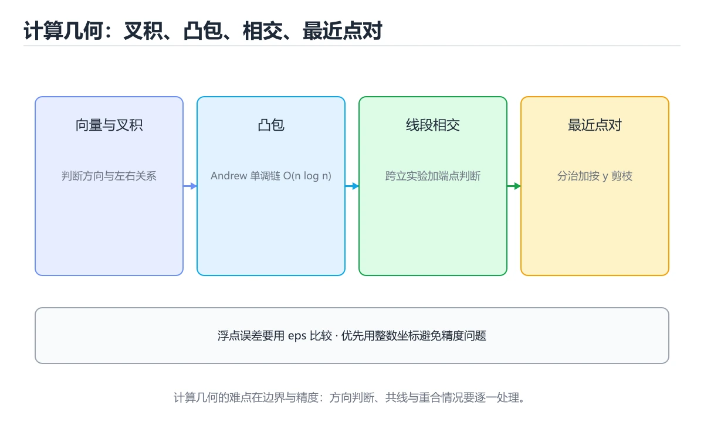
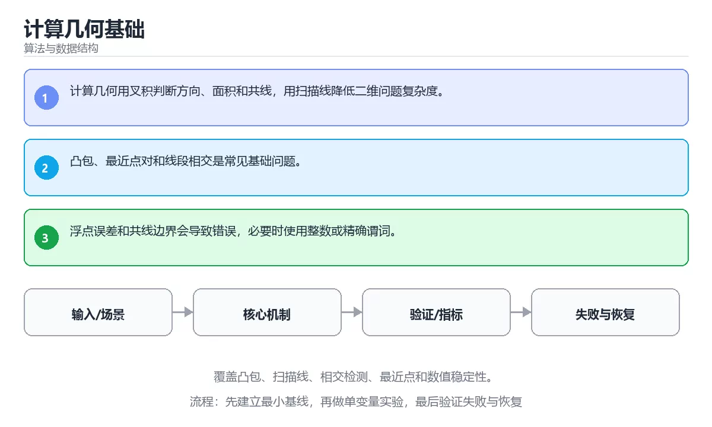

# 计算几何基础

> 内容更新时间：2026-10-06 · 学习阶段：高级 · 预计用时：40 分钟





## 本节知识框架

**课程定位**：所属分类为「算法与数据结构」，课程主题为「计算几何基础」，学习阶段为「高级」，建议用时 40 分钟。

**本课要解决的主问题**：覆盖凸包、扫描线、相交检测、最近点和数值稳定性。

| 学习层次 | 要回答的问题 | 完成判据 |
| --- | --- | --- |
| 概念层 | 「计算几何基础」有哪些必须区分的对象与术语？ | 能用自己的话定义核心术语，并各举一个正例和一个反例。 |
| 机制层 | 这些对象按什么顺序发生作用，输入如何变成输出？ | 能画出或写出机制步骤，并说明每一步的失败条件。 |
| 应用层 | 什么场景适合使用「计算几何基础」，什么场景不适合？ | 能给出一个真实场景、一个最小示例和一个边界案例。 |
| 性能层 | 时间、空间、吞吐或延迟受哪些量影响？ | 能说出复杂度或性能瓶颈的证据来源；没有证据时明确写“材料未提供”。 |
| 复习层 | 怎样确认自己不是只记住了结论？ | 能独立完成本课自测，并把错误定位到概念、机制、示例或边界。 |

### 阅读路线

1. 先读「核心概念定义」，建立「凸包」等对象的精确定义。
2. 再读「原理与运行机制」，把定义串成可重复的过程。
3. 用「代码/协议/SQL 示例」验证过程，并只改一个条件观察结果变化。
4. 最后检查性能、易错点、知识关系与自测题，形成可复习的证据链。

**前置知识**：《NP 完全性与近似算法》

**学习位置**：本课位于《NP 完全性与近似算法》之后；如果前一课的自测不能通过，应先回补再继续。

**后续衔接**：下一课《持久化数据结构与并行算法》会继续使用本课术语，学完后建议立即完成一次自测。

**教材衔接：学习目标**

- 能用自己的话解释：计算几何用叉积判断方向、面积和共线，用扫描线降低二维问题复杂度。
- 能用自己的话解释：凸包、最近点对和线段相交是常见基础问题。
- 能用自己的话解释：浮点误差和共线边界会导致错误，必要时使用整数或精确谓词。
- 能把本课知识放回「算法与数据结构」，并完成练习与测验。

**教材衔接：前置知识**

- 具备本分类的前置知识，能跑通「计算几何基础」的示例并解释输出。
- 本课关键词：凸包、扫描线、几何、数值稳定。
- 遇到不熟悉的术语先记录问题，完成练习后再回读。

**教材衔接：本课小结**

- 本课围绕 凸包、扫描线、几何、数值稳定 展开，复习时重点核对它们的输入、输出和失败路径。
- 做完本课测验后，把答错且解释不清的 扫描线 相关题目记成验证任务。

## 核心概念定义

> 阅读约定：本课先给「计算几何基础」相关术语的操作性定义与适用边界；正文里的口语化说法与定义冲突时，以定义和可复现示例为准。

| 术语 | 操作性定义 | 本课中的边界 |
| --- | --- | --- |
| 凸包 | 凸包是很多几何任务的前置步骤：最远点对、最小外接矩形、碰撞检测。 | 仅在「计算几何基础」明确给出的输入、版本与资源条件下成立。 |
| 扫描线 | 沿一个坐标轴按事件顺序推进，只维护当前截面状态来求解几何或区间问题。 | 仅在「计算几何基础」明确给出的输入、版本与资源条件下成立。 |
| 几何 | 按“计算几何基础”中 凸包、扫描线、几何 的实践顺序，把四个步骤排成从准备到复盘的合理顺序。 | 仅在「计算几何基础」明确给出的输入、版本与资源条件下成立。 |
| 数值稳定 | 算法在浮点误差、极端输入或多次迭代下仍保持合理结果，避免误差被放大。 | 仅在「计算几何基础」明确给出的输入、版本与资源条件下成立。 |
| 旋转卡壳 | 旋转卡壳利用凸包的单调性，把最远点对从 O(n²) 降到 O(n) | 仅在「计算几何基础」明确给出的输入、版本与资源条件下成立。 |

### 定义如何使用

在「计算几何基础」中判断一个说法是否成立，先确认它使用的是哪个对象的定义，再检查输入规模、运行环境与失败路径。定义不是口号，而是后续推导、代码示例和自测题共享的约束。

## 原理与运行机制

### 机制总览

1. **建立输入**：把「凸包」按本课定义整理成可观察、可重复的输入条件。
2. **执行转换**：围绕「扫描线」执行本课的核心步骤；每一步都记录中间状态，避免只看最终输出。
3. **产生输出**：得到「几何」后，用正文示例或协议/SQL 结果核对输出是否符合预期。
4. **改变一个条件**：只替换一个边界条件或环境参数，观察「计算几何基础」的结论是否仍然成立。

| 阶段 | 关注对象 | 失败时应检查 |
| --- | --- | --- |
| 输入 | 凸包 | 类型、范围、编码、版本或前置状态是否满足定义。 |
| 处理 | 扫描线 | 顺序、可见性、锁、路由、事务或调度规则是否被破坏。 |
| 输出 | 几何 | 结果是否可复现，错误是否被正确传播而不是被吞掉。 |

本课的机制结论要用「计算几何基础」自己的示例验证。「计算几何基础」没有给出某个数量级、吞吐或内存数据时，本课把该判断标为“材料未提供”，不从相邻主题外推。

**教材衔接：核心知识**

### 1. 计算几何用叉积判断方向、面积和共线，用扫描线降低二维问题复杂度。

- 关键做法：先用 linear_search 建立 凸包 的基线，再逐步加入边界与失败条件。
- 验证标准：凸包 的结果可复现、错误可解释、失败能恢复。

### 2. 凸包、最近点对和线段相交是常见基础问题。

把这条结论放回「计算几何基础」的完整流程里展开：

- 正文依据：能用自己的话解释：计算几何用叉积判断方向、面积和共线，用扫描线降低二维问题复杂度。
- 落地检查：把「2. 凸包、最近点对和线段相交是常见基础问题。」改写成一条可执行的核对项，逐条验证输入、超时与失败路径。

### 3. 浮点误差和共线边界会导致错误，必要时使用整数或精确谓词。

把这条结论放回「计算几何基础」的完整流程里展开：

- 正文依据：能用自己的话解释：凸包、最近点对和线段相交是常见基础问题。
- 落地检查：把「3. 浮点误差和共线边界会导致错误，必要时使用整数或精确谓词。」改写成一条可执行的核对项，逐条验证输入、超时与失败路径。

**教材衔接：关键流程**

```text
输入 → 校验 → 核心处理 → 验证 → 记录指标 → 失败恢复
```

**教材衔接：实践路径**

1. 用一句话复述本课要解决的问题。
2. 跑通正文中的最小示例并记录基线。
3. 只改变一个输入或参数，预测并验证结果。
4. 补一个失败路径，记录错误、恢复和指标。
5. 把结论写成可复现的笔记或测试。

**教材衔接：深入理解：计算几何基础**

### 从叉积开始的符号判断

计算几何的第一步通常不是公式，而是把「方向」变成符号。二维向量 a、b 的叉积
a×b = ax·by − ay·bx：结果为正表示 b 在 a 的逆时针方向，为负表示顺时针，为零表示共线。
用它可以判断线段相交、点是否在凸多边形内，也能构造凸包。写代码时应尽量用整数坐标和
整数叉积，避免浮点误差让符号翻转。

### 凸包与旋转卡壳

Andrew 单调链算法先按 x、y 排序，再分别扫描上下凸壳，每一步用叉积判断「是否要弹栈」，
时间复杂度 O(n log n)。凸包是很多几何任务的前置步骤：最远点对、最小外接矩形、碰撞检测
都可以在凸包上继续做。旋转卡壳利用凸包的单调性，把最远点对从 O(n²) 降到 O(n)。

### 精度与退化情况

计算几何的难点大多不在算法，而在退化：三点共线、线段端点重合、两条线段部分重叠、
多边形自交。处理办法是统一使用整数运算、把「小于」写成带容差的比较，并为共线、重合
单独写分支与测试用例。先写随机对拍和边界用例，再谈优化。

「计算几何基础」的「凸包与旋转卡壳」一节补全如下：

- 定位：这一节说明凸包与旋转卡壳在「计算几何基础」知识体系里的位置。
- 要点：用它可以判断线段相交、点是否在凸多边形内，也能构造凸包。写代码时应尽量用整数坐标和
- 自检：能否用一个最小例子解释凸包与旋转卡壳？

<!-- p0-depth-v2:start -->

**教材衔接：零基础精讲：把计算几何基础真正讲透**

### 先建立一个直觉

把算法看成一张可复核的路线图：输入规模决定走哪条路，每一步都要说明为什么不会漏解、为什么最终会停下来，以及代价如何增长。落到本课，「计算几何基础」关心的是 凸包 与 扫描线 的配合，也就是说这条直觉要在 核心知识 里被具体验证。

本课的摘要可以当作一张地图：覆盖凸包、扫描线、相交检测、最近点和数值稳定性。

### 逐步拆解

1. 澄清输入与目标。先写清「计算几何基础」要解决的问题、合法输入范围和成功标准，再进入后续步骤。
2. 描述处理过程。把「凸包、扫描线、几何、数值稳定」映射到具体步骤，每步都要求能单独验证。
3. 定义输出。明确 凸包 与 扫描线 各自的产物，以及失败时留下什么证据。
4. 让「计算几何基础」的失败路径尽早暴露：把凸包推到边界值，记录错误信息、重试或降级动作，以及人工兜底条件。
5. 用同一个凸包输入跑两遍：一遍按正文步骤，一遍故意跳过一步，比较输出并解释为什么必须按顺序执行。

### 把正文串成一条执行链

- **精度与退化情况**：计算几何的难点大多不在算法，而在退化：三点共线、线段端点重合、两条线段部分重叠、

### 从测验反推易错点

**检查点 1：关于「计算几何用叉积判断方向、面积和共线，用扫描线降低二维问题复杂度。」，下列说法正确的是？**

- 参考判断：计算几何用叉积判断方向、面积和共线，用扫描线降低二维问题复杂度。
- 自问：如果去掉题干里的一个限定词，结论还成立吗？

**检查点 2：关于「凸包、最近点对和线段相交是常见基础问题。」，下列说法正确的是？**

- 参考判断：凸包、最近点对和线段相交是常见基础问题。

**检查点 3：关于「浮点误差和共线边界会导致错误，必要时使用整数或精确谓词。」，下列说法正确的是？**

- 参考判断：浮点误差和共线边界会导致错误，必要时使用整数或精确谓词。

**检查点 4：本课的核心学习目标是什么？**

- 参考判断：覆盖凸包、扫描线、相交检测、最近点和数值稳定性。

**检查点 5：以下哪些术语与计算几何基础直接相关？（多选）**

- 参考判断：凸包、扫描线

### 工程排错顺序

| 先查什么 | 要得到的证据 | 判断标准 |
| --- | --- | --- |
| 问题规模与最坏情况是什么？ | 日志、输入样例、测试或指标 | 能复现并解释，才算定位 |
| 循环是否一定收缩并到达终止条件？ | 日志、输入样例、测试或指标 | 能复现并解释，才算定位 |
| 边界、重复元素和空输入是否覆盖？ | 日志、输入样例、测试或指标 | 能复现并解释，才算定位 |
| 时间与空间复杂度是否经过实测？ | 日志、输入样例、测试或指标 | 能复现并解释，才算定位 |

### 变式训练

1. 把 凸包 放进一个只有单机、没有额外依赖的小项目，先保证正确再扩展。
2. 把 linear_search 的数据量提高一个数量级，观察延迟与内存的变化拐点。
3. 把 扫描线 换成失败输入，记录错误信息与恢复动作。
5. 把 linear_search 的执行顺序调换一次，记录哪个中间结果先错；顺序敏感的地方就是本课的关键约束。
6. 在低带宽或低算力条件下重跑 扫描线，记录降级路径是否仍然可用。

### 本课自测

- [ ] 能用一句话解释「凸包」在本课中的角色与边界。
- [ ] 能举出一个正常例子和一个失败例子。
- [ ] 能说出最小验证步骤，以及需要记录的证据。
- [ ] 能用一句话解释「扫描线」在本课中的角色与边界。
- [ ] 能用一句话解释「几何」在本课中的角色与边界。
- [ ] 能用一句话解释「数值稳定」在本课中的角色与边界。

### 迁移案例库

换一个 扫描线 约束重做一次，确认结论在新条件下是否仍然成立。

#### 迁移案例 1：围绕「凸包」做一次小实验

**目标**：在不改变课程主体的前提下，验证计算几何基础中的一个关键判断。

**步骤**：
1. 复述当前方案对「凸包」的假设，写成一句可证伪的话。
2. 设计一个正常输入和一个边界输入，分别预测输出。
3. 运行或逐步演算，记录实际输出、耗时和失败信息。
4. 只调整一个参数，比较前后差异并解释原因。
5. 补充一条测试或复习卡，确保下次能更快复现。

**验收**：至少给出一个反例，说明凸包在什么情况下会失效；只写成功案例不算通过。

#### 迁移案例 2：围绕「扫描线」做一次小实验

**步骤**：
1. 复述当前方案对「扫描线」的假设，写成一句可证伪的话。

#### 迁移案例 3：围绕「几何」做一次小实验

**步骤**：
1. 复述当前方案对「几何」的假设，写成一句可证伪的话。

#### 迁移案例 4：围绕「数值稳定」做一次小实验

**步骤**：
1. 复述当前方案对「数值稳定」的假设，写成一句可证伪的话。

#### 迁移案例 5：围绕「凸包」做一次小实验

**步骤**：

#### 迁移案例 6：围绕「扫描线」做一次小实验

**步骤**：

#### 迁移案例 7：围绕「几何」做一次小实验

**步骤**：

#### 迁移案例 8：围绕「数值稳定」做一次小实验

**步骤**：

#### 迁移案例 9：围绕「凸包」做一次小实验

**步骤**：

#### 迁移案例 10：围绕「扫描线」做一次小实验

**步骤**：

#### 迁移案例 11：围绕「几何」做一次小实验

**步骤**：

#### 迁移案例 12：围绕「数值稳定」做一次小实验

**步骤**：

#### 迁移案例 13：围绕「凸包」做一次小实验

**步骤**：

#### 迁移案例 14：围绕「扫描线」做一次小实验

**步骤**：

#### 迁移案例 15：围绕「几何」做一次小实验

**步骤**：

#### 迁移案例 16：围绕「数值稳定」做一次小实验

**步骤**：

<!-- p0-depth-v2:end -->

**教材衔接：验证步骤**

1. 记录运行环境、命令和真实输出。
2. 修改一个输入，先写预测再运行。
4. 把结论写回本课笔记或测试用例。

## 典型应用场景

| 场景 | 典型输入或前提 | 期望产物 |
| --- | --- | --- |
| 学习验证 | 使用本课最小示例和 凸包、扫描线 | 能复现正文结论，并解释每一步。 |
| 工程落地 | 把「计算几何基础」放入真实模块或服务边界 | 输出可观测、失败可定位、参数可配置。 |
| 故障排查 | 只改一个版本、规模、输入或依赖条件 | 能区分概念错误、实现错误和环境差异。 |

判断「计算几何基础」的场景是否成立，标准是能否写出输入、处理、输出和失败路径；材料中没有出现的数据在本课标注为“材料未提供”，不用推测替代证据。

**课程内置实验入口**：`interactive`，用于动手验证《计算几何基础》的机制；实验结论不替代概念定义与复杂度分析。

**教材衔接：深度拓展与实战**

这一节把 凸包 的定义、linear_search 的代码与常见失败串成一条复习路线。

### 机制拆解

- **1. 计算几何用叉积判断方向、面积和共线，用扫描线降低二维问题复杂度。**：在「计算几何基础」里，「1. 计算几何用叉积判断方向、面积和共线，用扫描线降低二维问题复杂度。」这一步要先写清输入与预期，再记录实际结果和差异；结果不符时回到对应小节核对前提。
- **2. 凸包、最近点对和线段相交是常见基础问题。**：在「计算几何基础」里，「2. 凸包、最近点对和线段相交是常见基础问题。」这一步要先写清输入与预期，再记录实际结果和差异；结果不符时回到对应小节核对前提。
- **3. 浮点误差和共线边界会导致错误，必要时使用整数或精确谓词。**：在「计算几何基础」里，「3. 浮点误差和共线边界会导致错误，必要时使用整数或精确谓词。」这一步要先写清输入与预期，再记录实际结果和差异；结果不符时回到对应小节核对前提。
- **从叉积开始的符号判断**：计算几何的第一步通常不是公式，而是把「方向」变成符号
- **凸包与旋转卡壳**：Andrew 单调链算法先按 x、y 排序，再分别扫描上下凸壳，每一步用叉积判断「是否要弹栈」，

### 边界条件与常见反例

「计算几何基础」的边界不只包括最大最小值，还要覆盖空、重复和失败：

| 条件 | 常见反例 | 处理方式 |
| --- | --- | --- |
| 空输入 | 凸包 没有任何取值 | 先判空，给出明确错误而不是继续执行 |
| 边界值 | 扫描线 取最小或最大 | 用最小值、最大值和越界值各跑一次 |
| 重复执行 | 同一输入被执行两次 | 保证结果可重复，必要时加锁或去重 |
| 失败路径 | 凸包 相关步骤报错 | 保留原始错误，确认回滚或重试行为 |

### 工程检查表

- [ ] 能否用自己的话说明计算几何基础解决什么问题，以及它不负责什么？
- [ ] 能否说明 凸包 的正常输出，以及失败时留下的错误信息？
- [ ] 能否解释本课关键词在真实项目中的边界与取舍？
- [ ] 换一个输入后，linear_search 的判断依据是否仍然成立？

### 迁移练习

1. 保持正文示例不变，写出它的输入、处理步骤和预期输出。
2. 把 扫描线 换成边界值，说明依据后再实际运行。
3. 结合凸包、扫描线、几何、数值稳定，写出一个真实项目中的使用场景。
4. 写下一个反例，说明它在什么条件下会使朴素做法失效。

## 代码/协议/SQL 示例

### 最小可验证示例

下面保留《计算几何基础》原文中的最小示例。先预测《计算几何基础》示例的输出，再按正文步骤运行或推演；示例依赖外部环境时，同时记录版本与输入。

```text
输入 → 校验 → 核心处理 → 验证 → 记录指标 → 失败恢复
```

**教材衔接：最小可运行示例**

下面示例用于验证 凸包 的最小输入、处理和输出。先原样运行，再只修改一个值：

```python
def linear_search(items, target):
    for index, item in enumerate(items):
        if item == target:
            return index
    return -1

print(linear_search([3, 5, 8], 8))
```

**教材衔接：预期输出**

```text
2
```

## 时间/空间复杂度或性能分析

**复杂度证据**：本课正文出现 `O(n log n)`、`O(n²)`、`O(n)` 等量级表达式；使用前要同时确认输入规模、最好/平均/最坏情况以及常数项来源。

| 维度 | 本课关注点 | 判断依据 |
| --- | --- | --- |
| 时间/延迟 | 「计算几何基础」的主要步骤是否会随输入规模、并发度或网络往返增长。 | 以正文复杂度、基准数据或可重复测量为准。 |
| 空间/内存 | 中间状态、缓存、副本、连接或索引是否随规模增长。 | 记录峰值内存与数据副本，不只看最终结果。 |
| 吞吐/资源 | 版本、调度、锁、IO、序列化或协议开销是否成为瓶颈。 | 固定环境做对照实验，改变一个变量。 |

评估「计算几何基础」时要区分“正确性成立”和“性能达标”两件事；材料没有给出基准时，本课只保留量级来源与测量方法，不写不可验证的绝对数字。

## 常见误区与易错点

> 复核《计算几何基础》的易错点时，优先保留原文的错误表、故障现场与排错路径；每条修正都要能用本课示例复验。

| 易错点 | 常见表现 | 正确做法 |
| --- | --- | --- |
| 只背结论 | 能复述「计算几何基础」的定义，却说不清输入、输出与边界。 | 回到机制步骤，用最小示例逐一验证。 |
| 混淆相邻概念 | 把本课对象与相邻主题的对象当成同一类。 | 先比较定义、资源归属、生命周期和失败模式。 |
| 忽略版本与环境 | 在开发机通过后直接外推到生产环境。 | 固定版本、输入和资源条件，再记录可复现结果。 |

**教材衔接：常见错误与排查**

> 说明：本表由《计算几何基础》的核心知识整理（2026-10-07），人工复核进度见 docs/content_review_batches.md。

| 易错点 | 容易踩的做法 | 正确结论 |
| --- | --- | --- |
| 用浮点直接判断共线与相交 | 精度误差让结果翻转 | 用整数叉积判断方向，需要容差时写清阈值与退化处理 |
| 忽略退化输入 | 重合点、共线或零长度向量导致死循环 | 先单独处理退化情况，再进入主流程 |
| 扫描线不排序事件 | 结果依赖输入顺序，无法复现 | 按坐标排序事件，并定义同坐标事件的先后规则 |

**教材衔接：故障现场**

### 现场 1：用浮点直接判断共线与相交

**症状**：在《计算几何基础》的复现场景中，精度误差让结果翻转。

**根因**：当出现“用浮点直接判断共线与相交”时，执行路径已经绕过了《计算几何基础》的关键约束，最终以“精度误差让结果翻转”暴露出来；修复前必须先确认约束在哪里失效。

**修复**：针对《计算几何基础》的问题，用整数叉积判断方向，需要容差时写清阈值与退化处理。

**验证**：在《计算几何基础》中按“用整数叉积判断方向，需要容差时写清阈值与退化处理”调整后，从“用浮点直接判断共线与相交”的触发条件重放同一条路径，确认“精度误差让结果翻转”不再出现，并补一个相邻边界用例检查没有引入新问题。

### 现场 2：忽略退化输入

**症状**：在《计算几何基础》的复现场景中，重合点、共线或零长度向量导致死循环。

**根因**：当出现“忽略退化输入”时，执行路径已经绕过了《计算几何基础》的关键约束，最终以“重合点、共线或零长度向量导致死循环”暴露出来；修复前必须先确认约束在哪里失效。

**修复**：针对《计算几何基础》的问题，先单独处理退化情况，再进入主流程。

**验证**：保留《计算几何基础》里触发“重合点、共线或零长度向量导致死循环”的输入、版本和日志，按“先单独处理退化情况，再进入主流程”完成修改后原样重放；只有失败现象消失且相邻场景仍可解释，才保留改动。

### 现场 3：扫描线不排序事件

**症状**：在《计算几何基础》的复现场景中，结果依赖输入顺序，无法复现。

**根因**：“结果依赖输入顺序，无法复现”只是表层结果。向上追溯会落到“扫描线不排序事件”这一步，因为它省略了《计算几何基础》的约束，使实现行为和预期模型发生了偏离。

**修复**：针对《计算几何基础》的问题，按坐标排序事件，并定义同坐标事件的先后规则。

**验证**：在《计算几何基础》中按“按坐标排序事件，并定义同坐标事件的先后规则”调整后，从“扫描线不排序事件”的触发条件重放同一条路径，确认“结果依赖输入顺序，无法复现”不再出现，并补一个相邻边界用例检查没有引入新问题。

## 与其他知识点的关系

| 关系 | 课程 | 为什么 |
| --- | --- | --- |
| 先修 | 《NP 完全性与近似算法》 | 本课会直接使用它的概念或操作前提。 |
| 关联 | 《持久化数据结构与并行算法》 | 用于横向比较或把本课结论迁移到相邻主题。 |
| 前置顺序 | 《NP 完全性与近似算法》 | 同分类中安排在本课之前，建议先完成其自测。 |
| 后续顺序 | 《持久化数据结构与并行算法》 | 同分类中安排在本课之后，会继续使用本课术语。 |

把「计算几何基础」放回知识体系时，不只要记住“前面学过什么”，还要说明两个主题在输入、机制、资源边界和失败模式上的差异。这样才能把单课知识迁移到项目、排障和后续课程。

**教材衔接：复习与迁移**

复习目标：把「计算几何基础」的判断标准放回可复现的例子里。先自己作答，再对照依据；如果结论正确但理由不完整，回到正文补足前提。

### 概念复述

- 用一句话说明「计算几何基础」解决什么问题：覆盖凸包、扫描线、相交检测、最近点和数值稳定性。
- 写出凸包、扫描线、几何之间的关系，并各举一个例子。
- 说出本课最容易混淆的两个概念，以及区分它们的判据。

### 正文逐节复核

- **深入理解：计算几何基础**：计算几何的第一步通常不是公式，而是把「方向」变成符号。
- **逐节复习与自检**：计算几何的第一步通常不是公式，而是把「方向」变成符号。
- **零基础精讲：把计算几何基础真正讲透**：本课的摘要可以当作一张地图：覆盖凸包、扫描线、相交检测、最近点和数值稳定性。

### 测验回顾

1. 关于「计算几何用叉积判断方向、面积和共线，用扫描线降低二维问题复杂度。」，下列说法正确的是？
   - 依据：在「计算几何基础」里，计算几何用叉积判断方向、面积和共线，用扫描线降低二维问题复杂度。在「计算几何基础」里，放回题干限定的对象、输入和边界，拓扑排序只适用于无环有向图，结果可能有多个合法顺序。回到「计算几何基础」的正文示例，用“关于计算几何用叉积判断方向、面积和共”走一遍凸包、扫描线、几何的完整流程，能复现的结论才可以保留。
2. 下面这段 Python 代码摘自「计算几何基础」的正文示例。关于这段代码，下面哪一项说法与实际内容相符？
   - 依据：在「计算几何基础」里，题干的正确项是这段代码会产生可观察的输出，运行后能看到结果，在「计算几何基础」里要结合凸包核对输出是否符合预期。把输入或边界换成空值、极值或失败情况后，结论要以「计算几何基础」的实际运行结果为准。「计算几何基础」要求先交代凸包、扫描线、几何的前提再下结论，所以“这段代码会产生可观察的输出”只在题干“下面这段 Python 代码摘自计算几何基础的正文示例关于这”给定的条件下成立。
3. 按“计算几何基础”中 凸包、扫描线、几何 的实践顺序，把四个步骤排成从准备到复盘的合理顺序。
   - 依据：在「计算几何基础」里，在本课的练习里，顺序应当是：先明确 凸包 的输入、输出与约束 → 写出最小示例并核对 扫描线 的基线结果 → 只改一个变量，记录边界与失败路径的变化 → 固定版本与证据，把本课的结论写成可复现记录。这个顺序把 凸包 的输入、输出和约束放在最前面，在计算几何基础里避免概念没对齐就开始调参。第二步用 扫描线 建立可核对的基线，在计算几何基础里第三步才允许改变一个变量并观察失败路径。
4. 「计算几何基础」的核心学习目标是什么？
   - 依据：在「计算几何基础」里，这道题要求区分概念与边界，覆盖凸包、扫描线、相交检测、最近点和数值稳定性。在「计算几何基础」里判断这道题，要把凸包、扫描线、几何的条件、过程与失败路径逐项对齐，换成“计算几何基础的核心学习目标是什么”这个场景，只有满足前提的结论才成立。“覆盖凸包、扫描线、相交检测”是否可用，取决于凸包、扫描线、几何在题干条件下的表现，不能直接套用相邻结论。
5. 以下哪些术语与「计算几何基础」直接相关？（多选）
   - 依据：把“凸包”代回「计算几何基础」里“以下哪些术语与计算几何基础直接相关”的例子核对，条件一旦改变，结论就要用凸包、扫描线、几何重新推导。「计算几何基础」要求先交代凸包、扫描线、几何的前提再下结论，所以“凸包”只在题干“以下哪些术语与直接相关（多选）”给定的条件下成立。

### 迁移练习

把「计算几何基础」的结论迁移到相邻主题，每次迁移都写清预测与证据：

1. 换输入：用凸包处理一组你自己的数据，对比教材示例的结果差异。
2. 换失败条件：制造一个扫描线相关的错误，说明如何从错误信息定位根因。
3. 换规模：把数据量或并发度提高一个数量级，说明「计算几何基础」的结论是否仍成立。

## 自测题与参考答案

> 先独立作答《计算几何基础》的自测题，再对照答案与解析；每处判断都要能在本课正文或示例中找到依据。

### 自测 1

关于「计算几何用叉积判断方向、面积和共线，用扫描线降低二维问题复杂度。」，下列说法正确的是？

A. 计算几何用叉积判断方向、面积和共线，用扫描线降低二维问题复杂度。
B. 无权图最短路用 BFS，非负权图用 Dijkstra，含负权边用 Bellman-Ford。
C. 最小生成树选择连接所有顶点且总权重最小的无环边集。
D. 拓扑排序只适用于无环有向图，结果可能有多个合法顺序。

**参考答案**：计算几何用叉积判断方向、面积和共线，用扫描线降低二维问题复杂度。

**解析**：在「计算几何基础」里，计算几何用叉积判断方向、面积和共线，用扫描线降低二维问题复杂度。在「计算几何基础」里，放回题干限定的对象、输入和边界，拓扑排序只适用于无环有向图，结果可能有多个合法顺序。回到「计算几何基础」的正文示例，用“关于计算几何用叉积判断方向、面积和共”走一遍凸包、扫描线、几何的完整流程，能复现的结论才可以保留。

### 自测 2

下面这段 Python 代码摘自「计算几何基础」的正文示例。关于这段代码，下面哪一项说法与实际内容相符？

```python
def linear_search(items, target):
    for index, item in enumerate(items):
        if item == target:
            return index
    return -1

print(linear_search([3, 5, 8], 8))
```

A. 这段代码只做静态声明，没有循环、分支或可观察输出。
B. 这段代码会产生可观察的输出，运行后能看到结果。
C. 这段代码包含异常处理分支，失败时会走专门的补救路径。
D. 这段代码会读取外部输入，结果依赖传入的数据。

**参考答案**：这段代码会产生可观察的输出，运行后能看到结果。

**解析**：在「计算几何基础」里，题干的正确项是这段代码会产生可观察的输出，运行后能看到结果，在「计算几何基础」里要结合凸包核对输出是否符合预期。把输入或边界换成空值、极值或失败情况后，结论要以「计算几何基础」的实际运行结果为准。「计算几何基础」要求先交代凸包、扫描线、几何的前提再下结论，所以“这段代码会产生可观察的输出”只在题干“下面这段 Python 代码摘自计算几何基础的正文示例关于这”给定的条件下成立。

### 自测 3

按“计算几何基础”中 凸包、扫描线、几何 的实践顺序，把四个步骤排成从准备到复盘的合理顺序。

A. 只改一个变量，记录边界与失败路径的变化
B. 固定版本与证据，把“计算几何基础”的结论写成可复现记录
C. 先明确 凸包 的输入、输出与约束
D. 写出最小示例并核对 扫描线 的基线结果

**参考答案**：先明确 凸包 的输入、输出与约束 → 写出最小示例并核对 扫描线 的基线结果 → 只改一个变量，记录边界与失败路径的变化 → 固定版本与证据，把“计算几何基础”的结论写成可复现记录

**解析**：在「计算几何基础」里，在本课的练习里，顺序应当是：先明确 凸包 的输入、输出与约束 → 写出最小示例并核对 扫描线 的基线结果 → 只改一个变量，记录边界与失败路径的变化 → 固定版本与证据，把本课的结论写成可复现记录。这个顺序把 凸包 的输入、输出和约束放在最前面，在计算几何基础里避免概念没对齐就开始调参。第二步用 扫描线 建立可核对的基线，在计算几何基础里第三步才允许改变一个变量并观察失败路径。

**教材衔接：动手练习**

1. 合上教程，用 3～5 句话解释计算几何基础。
2. 从正文选一个例子，改变一个条件并预测结果。
3. 设计一个失败场景，写出止损与恢复步骤。

**验收标准**：留下输入、命令、输出、差异和下一步问题。

**教材衔接：可运行练习**

### 任务 1：先跑通，再解释

```python
def linear_search(items, target):
    for index, item in enumerate(items):
        if item == target:
            return index
    return -1

print(linear_search([3, 5, 8], 8))
```

### 任务 2：只改一个条件

把「计算几何基础」的最小示例复制一份，只改一个条件再跑一次：

- 改动点：只调整 linear_search 的一个参数，其余条件一律不动。
- 预测：先写下「计算几何基础」在改动后的输出或错误信息，再运行。
- 记录：对照改动前后的结果，指出差异出在哪一步。
- 验收：换回原条件能复现原结果，改动只影响凸包。

### 任务 3：迁移到自己的数据

用同一套思路处理一组你自己的 凸包 数据，保持输出格式与任务 1 一致。

**教材衔接：本课复习清单**

离开本课前，逐项确认：

- [ ] 不看解析，能说出「关于「计算几何用叉积判断方向、面积和共线，用扫描线降低二维问题复杂度。」，下列说法正确的是？」的判断依据。
- [ ] 不看解析，能说出「下面这段 Python 代码摘自「计算几何基础」的正文示例。关于这段代码，下面哪一项说法与实际内容相符？」的判断依据。
- [ ] 不看解析，能说出「「计算几何基础」的核心学习目标是什么？」的判断依据。
- [ ] 至少运行一次《计算几何基础》的示例，记录输入、输出和一个边界情况。
- [ ] 把本课最容易混淆的两个概念写成一句话对照。

| 复盘项 | 记录 |
| --- | --- |
| 已经能独立解释的考点 |  |
| 仍然说不清的概念 |  |
| 下一步验证动作 |  |

**教材衔接：复习与自测**

对照 核心知识 复述本课结论，答不上来的部分回到 linear_search 的示例重跑一次。

### 核心知识

自检：这一节与相邻主题的边界在哪里？

### 动手练习

自检：如果去掉这一节里的一个前提，结论会怎样变化？

### 深入理解：计算几何基础

计算几何的第一步通常不是公式，而是把「方向」变成符号。a×b = ax·by − ay·bx：结果为正表示 b 在 a 的逆时针方向，为负表示顺时针，为零表示共线。

### 验证步骤

制造一次错误输入，记录错误信息与修复方式。

---

## 术语速查

| 术语 | 一句话说明 |
| --- | --- |
| `凸包` | 凸包是很多几何任务的前置步骤：最远点对、最小外接矩形、碰撞检测。 |
| `扫描线` | 沿一个坐标轴按事件顺序推进，只维护当前截面状态来求解几何或区间问题。 |
| `几何` | 按“计算几何基础”中 凸包、扫描线、几何 的实践顺序，把四个步骤排成从准备到复盘的合理顺序。 |
| `数值稳定` | 算法在浮点误差、极端输入或多次迭代下仍保持合理结果，避免误差被放大。 |
| `旋转卡壳` | 旋转卡壳利用凸包的单调性，把最远点对从 O(n²) 降到 O(n) |

## 考点精讲

### 考点 1：概念判断·凸包

- **题目**：关于「计算几何用叉积判断方向、面积和共线，用扫描线降低二维问题复杂度。」，下列说法正确的是？
- **判断依据**：在「计算几何基础」里，计算几何用叉积判断方向、面积和共线，用扫描线降低二维问题复杂度。在「计算几何基础」里，放回题干限定的对象、输入和边界，拓扑排序只适用于无环有向图，结果可能有多个合法顺序。回到「计算几何基础」的正文示例，用“关于计算几何用叉积判断方向、面积和共”走一遍凸包、扫描线、几何的完整流程，能复现的结论才可以保留。

### 考点 2：代码补全·凸包

- **题目**：下面这段 Python 代码摘自「计算几何基础」的正文示例。关于这段代码，下面哪一项说法与实际内容相符？
- **判断依据**：在「计算几何基础」里，题干的正确项是这段代码会产生可观察的输出，运行后能看到结果，在「计算几何基础」里要结合凸包核对输出是否符合预期。把输入或边界换成空值、极值或失败情况后，结论要以「计算几何基础」的实际运行结果为准。「计算几何基础」要求先交代凸包、扫描线、几何的前提再下结论，所以“这段代码会产生可观察的输出”只在题干“下面这段 Python 代码摘自计算几何基础的正文示例关于这”给定的条件下成立。

### 考点 3：顺序排列·凸包

- **题目**：按“计算几何基础”中 凸包、扫描线、几何 的实践顺序，把四个步骤排成从准备到复盘的合理顺序。
- **判断依据**：在「计算几何基础」里，在本课的练习里，顺序应当是：先明确 凸包 的输入、输出与约束 → 写出最小示例并核对 扫描线 的基线结果 → 只改一个变量，记录边界与失败路径的变化 → 固定版本与证据，把本课的结论写成可复现记录。这个顺序把 凸包 的输入、输出和约束放在最前面，在计算几何基础里避免概念没对齐就开始调参。第二步用 扫描线 建立可核对的基线，在计算几何基础里第三步才允许改变一个变量并观察失败路径。

### 考点 4：概念判断·凸包

- **题目**：「计算几何基础」的核心学习目标是什么？
- **判断依据**：在「计算几何基础」里，这道题要求区分概念与边界，覆盖凸包、扫描线、相交检测、最近点和数值稳定性。在「计算几何基础」里判断这道题，要把凸包、扫描线、几何的条件、过程与失败路径逐项对齐，换成“计算几何基础的核心学习目标是什么”这个场景，只有满足前提的结论才成立。“覆盖凸包、扫描线、相交检测”是否可用，取决于凸包、扫描线、几何在题干条件下的表现，不能直接套用相邻结论。

### 考点 5：多选辨析·凸包

- **题目**：以下哪些术语与「计算几何基础」直接相关？（多选）
- **判断依据**：把“凸包”代回「计算几何基础」里“以下哪些术语与计算几何基础直接相关”的例子核对，条件一旦改变，结论就要用凸包、扫描线、几何重新推导。「计算几何基础」要求先交代凸包、扫描线、几何的前提再下结论，所以“凸包”只在题干“以下哪些术语与直接相关（多选）”给定的条件下成立。

## English Overview

**Title:** Computational Geometry

**Summary:** Cover convex hulls, sweep line, intersections, nearest points and numerical stability.

**Category:** Algorithms
**Level:** 高级
**Key terms:** 凸包, 扫描线, 几何, 数值稳定

## 内容元数据

- 内容版本：v2.0
- 最后更新：2026-10-06
- 学习阶段：高级
- 适用环境：任意主流语言（伪代码与复杂度为主）；本课聚焦 凸包。
- 内容来源：内置结构化课程与工程实践整理
- 相关主题：凸包、扫描线、几何、数值稳定
- 质量版本：P0 测验标准 + P1 覆盖扩展 + P2 体验补全

## 参考资料与复核

- 最后复核：2026-10-04
- 下次复核：2027-05-24
- 复核范围：版本兼容、API 行为、安全建议与工程实践
- 来源性质：官方文档、标准或权威教材；正文为离线教学重组

| 参考资料 | 本课用途 |
| --- | --- |
| [LeetCode 学习](https://leetcode.com/explore/) | 算法题训练与模式 |
| [MIT 6.006](https://ocw.mit.edu/courses/6-006-introduction-to-algorithms-spring-2020/) | 算法设计与分析 |
| [Princeton Algorithms](https://algs4.cs.princeton.edu/home/) | 经典算法与数据结构教材 |

> 「计算几何基础」的链接用于离线阅读后的延伸核对；App 不会自动联网。
