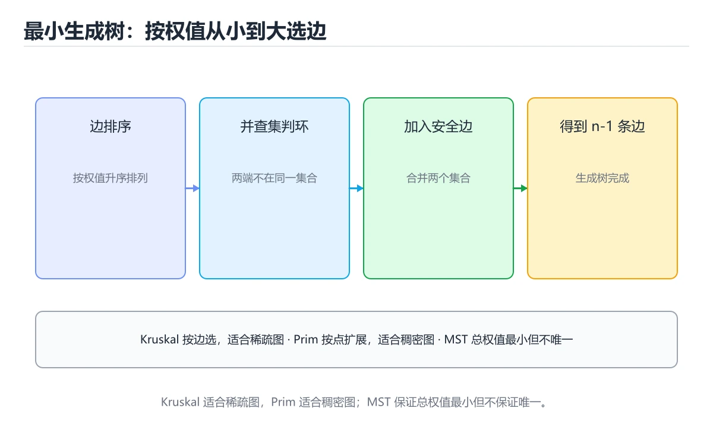

# 最小生成树与图剪枝

> 内容更新时间：2026-10-06 · 学习阶段：进阶 · 预计用时：35 分钟




## 学习目标

- 能用自己的话解释：最小生成树选择连接所有顶点且总权重最小的无环边集。
- 能用自己的话解释：Kruskal 按边排序并用并查集判环，Prim 从已选点扩展最小边。
- 能用自己的话解释：割性质和安全边理论解释为什么贪心选择不会破坏最优性。
- 能把本课知识放回「算法与数据结构」，并完成练习与测验。

## 前置知识

- 能运行 linear_search 所在的示例环境，并读懂报错信息。
- 本课关键词：MST、Kruskal、Prim、并查集。
- 遇到不熟悉的术语先记录问题，完成练习后再回读。

## 核心知识

### 1. 最小生成树选择连接所有顶点且总权重最小的无环边集。

- 关键做法：先用 linear_search 建立 MST 的基线，再逐步加入边界与失败条件。
- 验证标准：linear_search 的输出能被他人复现，边界输入有对应用例。

### 2. Kruskal 按边排序并用并查集判环，Prim 从已选点扩展最小边。

把这条结论放回「最小生成树与图剪枝」的完整流程里展开：

- 正文依据：能用自己的话解释：Kruskal 按边排序并用并查集判环，Prim 从已选点扩展最小边。
- 落地检查：把「2. Kruskal 按边排序并用并查集判环，Prim 从已选点扩展最小边。」改写成一条可执行的核对项，逐条验证输入、超时与失败路径。

### 3. 割性质和安全边理论解释为什么贪心选择不会破坏最优性。

把这条结论放回「最小生成树与图剪枝」的完整流程里展开：

- 正文依据：本课关键词：MST、Kruskal、Prim、并查集。
- 落地检查：把「3. 割性质和安全边理论解释为什么贪心选择不会破坏最优性。」改写成一条可执行的核对项，逐条验证输入、超时与失败路径。

## 关键流程

```text
输入 → 校验 → 核心处理 → 验证 → 记录指标 → 失败恢复
```

## 实践路径

1. 用一句话复述本课要解决的问题。
2. 跑通正文中的最小示例并记录基线。
3. 只改变一个输入或参数，预测并验证结果。
4. 补一个失败路径，记录错误、恢复和指标。
5. 把结论写成可复现的笔记或测试。

## 常见错误与排查

> 说明：本表由《最小生成树与图剪枝》的核心知识整理（2026-10-07），人工复核进度见 docs/content_review_batches.md。

| 易错点 | 容易踩的做法 | 正确结论 |
| --- | --- | --- |
| 默认图一定连通 | 不连通时结果不完整却当成最小生成树 | 对每个连通分量分别求解，得到最小生成森林 |
| Kruskal 不用并查集 | 判环退化成遍历，复杂度失控 | 用带路径压缩的并查集维护连通性 |
| 认为最小生成树唯一 | 边权相同时与预期结果不一致 | 只比较权重和，需要特定解时明确并列取舍规则 |

## 动手练习

1. 合上教程，用 3～5 句话解释最小生成树与图剪枝。
2. 从正文选一个例子，改变一个条件并预测结果。
3. 设计一个失败场景，写出止损与恢复步骤。

**验收标准**：留下输入、命令、输出、差异和下一步问题。

## 本课小结

- 本课围绕 MST、Kruskal、Prim、并查集 展开，复习时重点核对它们的输入、输出和失败路径。
- 把还不确定的 linear_search 行为写成一条可执行验证，再进入下一课。


## 可运行练习

### 任务 1：先跑通，再解释

```python
def linear_search(items, target):
    for index, item in enumerate(items):
        if item == target:
            return index
    return -1

print(linear_search([3, 5, 8], 8))
```

### 任务 2：只改一个条件

把「最小生成树与图剪枝」的最小示例复制一份，只改一个条件再跑一次：

- 改动点：把 Kruskal 换成边界值，其他输入保持原样。
- 预测：先写下「最小生成树与图剪枝」在改动后的输出或错误信息，再运行。
- 记录：对照改动前后的结果，指出差异出在哪一步。
- 验收：换回原条件能复现原结果，改动只影响MST。

### 任务 3：迁移到自己的数据

把 linear_search 换成你自己的输入，先保持步骤不变，再比较输出差异。

## 故障现场

### 现场 1：默认图一定连通

**症状**：在《最小生成树与图剪枝》的复现场景中，不连通时结果不完整却当成最小生成树。

**根因**：“不连通时结果不完整却当成最小生成树”只是表层结果。向上追溯会落到“默认图一定连通”这一步，因为它省略了《最小生成树与图剪枝》的约束，使实现行为和预期模型发生了偏离。

**修复**：针对《最小生成树与图剪枝》的问题，对每个连通分量分别求解，得到最小生成森林。

**验证**：在《最小生成树与图剪枝》中按“对每个连通分量分别求解，得到最小生成森林”调整后，从“默认图一定连通”的触发条件重放同一条路径，确认“不连通时结果不完整却当成最小生成树”不再出现，并补一个相邻边界用例检查没有引入新问题。

### 现场 2：Kruskal 不用并查集

**症状**：在《最小生成树与图剪枝》的复现场景中，判环退化成遍历，复杂度失控。

**根因**：当出现“Kruskal 不用并查集”时，执行路径已经绕过了《最小生成树与图剪枝》的关键约束，最终以“判环退化成遍历，复杂度失控”暴露出来；修复前必须先确认约束在哪里失效。

**修复**：针对《最小生成树与图剪枝》的问题，用带路径压缩的并查集维护连通性。

**验证**：在《最小生成树与图剪枝》中按“用带路径压缩的并查集维护连通性”调整后，从“Kruskal 不用并查集”的触发条件重放同一条路径，确认“判环退化成遍历，复杂度失控”不再出现，并补一个相邻边界用例检查没有引入新问题。

### 现场 3：认为最小生成树唯一

**症状**：在《最小生成树与图剪枝》的复现场景中，边权相同时与预期结果不一致。

**根因**：“边权相同时与预期结果不一致”只是表层结果。向上追溯会落到“认为最小生成树唯一”这一步，因为它省略了《最小生成树与图剪枝》的约束，使实现行为和预期模型发生了偏离。

**修复**：针对《最小生成树与图剪枝》的问题，只比较权重和，需要特定解时明确并列取舍规则。

**验证**：先在《最小生成树与图剪枝》中记录“认为最小生成树唯一”留下的失败证据，再执行“只比较权重和，需要特定解时明确并列取舍规则”并重放；确认错误路径变为明确结果，且修复没有掩盖同类故障。

## 本课复习清单


离开本课前，逐项确认：

- [ ] 不看解析，能说出「关于「最小生成树选择连接所有顶点且总权重最小的无环边集。」，下列说法正确的是？」的判断依据。
- [ ] 不看解析，能说出「下面这段 Python 代码摘自「最小生成树与图剪枝」的正文示例。关于这段代码，下面哪一项说法与实际内容相符？」的判断依据。
- [ ] 不看解析，能说出「关于「割性质和安全边理论解释为什么贪心选择不会破坏最优性。」，下列说法正确的是？」的判断依据。
- [ ] 至少运行一次《最小生成树与图剪枝》的示例，记录输入、输出和一个边界情况。
- [ ] 把本课最容易混淆的两个概念写成一句话对照。

| 复盘项 | 记录 |
| --- | --- |
| 已经能独立解释的考点 |  |
| 仍然说不清的概念 |  |
| 下一步验证动作 |  |

## 复习与自测

逐节自检：能说清 MST 的输入、输出与失败路径才算通过，否则回到原文。

### 核心知识

自检：这一节与相邻主题的边界在哪里？

### 动手练习

自检：如果去掉这一节里的一个前提，结论会怎样变化？

### 验证步骤

制造一次错误输入，记录错误信息与修复方式。
### 追问 1：关于「最小生成树选择连接所有顶点且总权重最小的无环边集。」，下列说法正确的是？

- 先写下判断，再对照：最小生成树选择连接所有顶点且总权重最小的无环边集。
- 检查点：如果 MST 的输入换成边界值，这个结论还需要补充哪个前提？

### 追问 2：关于「Kruskal 按边排序并用并查集判环，Prim 从已选点扩展最小边。」，下列说法正确的是？

- 先写下判断，再对照：Kruskal 按边排序并用并查集判环，Prim 从已选点扩展最小边。

### 追问 3：关于「割性质和安全边理论解释为什么贪心选择不会破坏最优性。」，下列说法正确的是？

- 先写下判断，再对照：割性质和安全边理论解释为什么贪心选择不会破坏最优性。

### 追问 4：本课的核心学习目标是什么？

- 先写下判断，再对照：掌握 Kruskal、Prim、并查集和割边性质。

### 追问 5：以下哪些术语与最小生成树与图剪枝直接相关？（多选）

- 先写下判断，再对照：MST、Kruskal

## 术语速查

| 术语 | 一句话说明 |
| --- | --- |
| `MST` | 最小生成树，在连通无向图中选择总权重最小的 n-1 条边。 |
| `Kruskal` | 按边权从小到大加边并用并查集避免成环的最小生成树算法。 |
| `Prim` | Summary: Learn Kruskal, Prim, union-find and cut properties.。 |
| `并查集` | 维护不相交集合合并与查询的数据结构，用于连通性和环检测。 |

## 深度拓展与实战

这一节把 MST 的定义、linear_search 的代码与常见失败串成一条复习路线。

### 机制拆解

- **1. 最小生成树选择连接所有顶点且总权重最小的无环边集。**：在「最小生成树与图剪枝」里，「1. 最小生成树选择连接所有顶点且总权重最小的无环边集。」这一步要先写清输入与预期，再记录实际结果和差异；结果不符时回到对应小节核对前提。
- **2. Kruskal 按边排序并用并查集判环，Prim 从已选点扩展最小边。**：在「最小生成树与图剪枝」里，「2. Kruskal 按边排序并用并查集判环，Prim 从已选点扩展最小边。」这一步要先写清输入与预期，再记录实际结果和差异；结果不符时回到对应小节核对前提。
- **3. 割性质和安全边理论解释为什么贪心选择不会破坏最优性。**：在「最小生成树与图剪枝」里，「3. 割性质和安全边理论解释为什么贪心选择不会破坏最优性。」这一步要先写清输入与预期，再记录实际结果和差异；结果不符时回到对应小节核对前提。
- **考点 1：关于「最小生成树选择连接所有顶点且总权重最小的无环边集。」，下列说法正确的是？**：先独立作答，再回到本课对应小节核对判断依据；答错时记录是哪一个前提被忽略。
- **考点 2：核心知识 的代码阅读题**：先独立作答，再回到本课正文核对 linear_search 的执行路径；答错时记录是哪一个前提被忽略。

### 边界条件与常见反例

「最小生成树与图剪枝」的边界不只包括最大最小值，还要覆盖空、重复和失败：

| 条件 | 常见反例 | 处理方式 |
| --- | --- | --- |
| 空输入 | MST 没有任何取值 | 先判空，给出明确错误而不是继续执行 |
| 边界值 | Kruskal 取最小或最大 | 用最小值、最大值和越界值各跑一次 |
| 重复执行 | 同一输入被执行两次 | 保证结果可重复，必要时加锁或去重 |
| 失败路径 | MST 相关步骤报错 | 保留原始错误，确认回滚或重试行为 |

### 工程检查表

- [ ] 能否用自己的话说明最小生成树与图剪枝解决什么问题，以及它不负责什么？
- [ ] 能否用「最小生成树与图剪枝」的最小示例复现一次失败并解释原因？
- [ ] 能否解释本课关键词在真实项目中的边界与取舍？
- [ ] 能否把 MST 的方法迁移到相近问题，并说明需要改哪一步？

### 迁移练习

1. 保持正文示例不变，写出它的输入、处理步骤和预期输出。
2. 固定其他输入，只调整 linear_search 的一个参数，先写预测再验证。
3. 结合MST、Kruskal、Prim、并查集，写出一个真实项目中的使用场景。
4. 写下一个反例，说明它在什么条件下会使朴素做法失效。

## 考点精讲

### 考点 1：概念判断·MST

- **题目**：关于「最小生成树选择连接所有顶点且总权重最小的无环边集。」，下列说法正确的是？
- **判断依据**：在「最小生成树与图剪枝」里，最小生成树选择连接所有顶点且总权重最小的无环边集。这道题的关键在「最小生成树与图剪枝」的MST、Kruskal、Prim：先确认题干“关于最小生成树选择连接所有顶点且总权”问的是哪一步，再排除偷换前提的选项。把“最小生成树选择连接所有顶点且总权重最小的”代回「最小生成树与图剪枝」里“最小生成树选择连接所有顶点且总权重最小的无环边集”的例子核对，条件一旦改变，结论就要用MST、Kruskal、Prim重新推导。

### 考点 2：代码补全·MST

- **题目**：下面这段 Python 代码摘自「最小生成树与图剪枝」的正文示例。关于这段代码，下面哪一项说法与实际内容相符？
- **判断依据**：题干的正确项是这段代码包含循环结构，同一段逻辑会被重复执行，在「最小生成树与图剪枝」里循环次数与MST的输入规模直接相关。这段代码出自「最小生成树与图剪枝」的正文示例，围绕MST、Kruskal、Prim展开；把输入或边界换成空值、极值或失败情况后，结论要以「最小生成树与图剪枝」的实际运行结果为准。在「最小生成树与图剪枝」里判断这道题，要把MST、Kruskal、Prim的条件、过程与失败路径逐项对齐，换成“下面这段 Python 代码摘自最小”这个场景，只有满足前提的结论才成立。

### 考点 3：概念判断·MST

- **题目**：关于「割性质和安全边理论解释为什么贪心选择不会破坏最优性。」，下列说法正确的是？
- **判断依据**：在「最小生成树与图剪枝」里，割性质和安全边理论解释为什么贪心选择不会破坏最优性。在「最小生成树与图剪枝」里，如果只凭关键词作答，很容易把选择算法要同时看负权、稠密度、目标数量和可接受近似。回到「最小生成树与图剪枝」的正文示例，用“关于割性质和安全边理论解释为什么贪心”走一遍MST、Kruskal、Prim的完整流程，能复现的结论才可以保留。

### 考点 4：概念判断·MST

- **题目**：「最小生成树与图剪枝」的核心学习目标是什么？
- **判断依据**：在「最小生成树与图剪枝」里，结论应落在「掌握 Kruskal、Prim、并查集和割边性质」。在「最小生成树与图剪枝」里，结论应落在掌握 Kruskal、Prim、并查集和割边性质。在「最小生成树与图剪枝」里，这道题要求区分概念与边界，掌握 Kruskal、Prim、并查集和割边性质。

### 考点 5：多选辨析·MST

- **题目**：以下哪些术语与「最小生成树与图剪枝」直接相关？（多选）
- **判断依据**：在「最小生成树与图剪枝」里，Kruskal。在「最小生成树与图剪枝」里判断这道题，要把MST、Kruskal、Prim的条件、过程与失败路径逐项对齐，换成“以下哪些术语与最小生成树与图剪枝直接”这个场景，只有满足前提的结论才成立。回到MST、Kruskal、Prim本身再看一遍：只有“MST”与题干“以下哪些术语与直接相关（多选）”的前提一致，结论才成立。

### 考点 6：顺序排列·MST

- **题目**：按照「最小生成树与图剪枝」从概念到实践的讲解顺序排列下列主题。
- **判断依据**：结合MST、Kruskal来看，正确的执行顺序是「核心知识 → 关键流程 → 实践路径 → 常见误区」。本课围绕掌握 Kruskal、Prim、并查集和割边性质。这道题的关键在「最小生成树与图剪枝」的MST、Kruskal、Prim：先确认题干“按照最小生成树与图剪枝从概念到实践的”问的是哪一步，再排除偷换前提的选项。

## English Overview

**Title:** Minimum Spanning Trees and Graph Pruning

**Summary:** Learn Kruskal, Prim, union-find and cut properties.

**Category:** Algorithms
**Level:** 高级
**Key terms:** MST, Kruskal, Prim, 并查集

## 内容元数据

- 内容版本：v2.0
- 最后更新：2026-10-06
- 学习阶段：进阶
- 适用环境：任意主流语言（伪代码与复杂度为主）；本课聚焦 MST。
- 内容来源：内置结构化课程与工程实践整理
- 相关主题：MST、Kruskal、Prim、并查集
- 质量版本：P0 测验标准 + P1 覆盖扩展 + P2 体验补全

## 最小可运行示例

先用下面的示例确认 MST 的基线，再只改一个与 Kruskal 相关的值：

```python
def linear_search(items, target):
    for index, item in enumerate(items):
        if item == target:
            return index
    return -1

print(linear_search([3, 5, 8], 8))
```

## 预期输出

```text
2
```

## 验证步骤

1. 记录运行环境、命令和真实输出。
2. 修改一个输入，先写预测再运行。
4. 把结论写回本课笔记或测试用例。

## 参考资料与复核

- 最后复核：2026-10-04
- 下次复核：2027-05-17
- 复核范围：版本兼容、API 行为、安全建议与工程实践
- 来源性质：官方文档、标准或权威教材；正文为离线教学重组

| 参考资料 | 本课用途 |
| --- | --- |
| [CP-Algorithms](https://cp-algorithms.com/) | 算法实现与复杂度 |
| [GeeksforGeeks 算法](https://www.geeksforgeeks.org/fundamentals-of-algorithms/) | 算法专题与实现 |
| [MIT 6.006](https://ocw.mit.edu/courses/6-006-introduction-to-algorithms-spring-2020/) | 算法设计与分析 |

> 「最小生成树与图剪枝」的链接用于离线阅读后的延伸核对；App 不会自动联网。

## 复习与迁移

复习目标：把「最小生成树与图剪枝」的判断标准放回可复现的例子里。先自己作答，再对照依据；如果结论正确但理由不完整，回到正文补足前提。

### 概念复述

- 用一句话说明「最小生成树与图剪枝」解决什么问题：掌握 Kruskal、Prim、并查集和割边性质。
- 写出MST、Kruskal、Prim之间的关系，并各举一个例子。
- 说出本课最容易混淆的两个概念，以及区分它们的判据。

### 测验回顾

1. 关于「最小生成树选择连接所有顶点且总权重最小的无环边集。」，下列说法正确的是？
   - 依据：在「最小生成树与图剪枝」里，最小生成树选择连接所有顶点且总权重最小的无环边集。这道题的关键在「最小生成树与图剪枝」的MST、Kruskal、Prim：先确认题干“关于最小生成树选择连接所有顶点且总权”问的是哪一步，再排除偷换前提的选项。把“最小生成树选择连接所有顶点且总权重最小的”代回「最小生成树与图剪枝」里“最小生成树选择连接所有顶点且总权重最小的无环边集”的例子核对，条件一旦改变，结论就要用MST、Kruskal、Prim重新推导。
2. 下面这段 Python 代码摘自「最小生成树与图剪枝」的正文示例。关于这段代码，下面哪一项说法与实际内容相符？
   - 依据：题干的正确项是这段代码包含循环结构，同一段逻辑会被重复执行，在「最小生成树与图剪枝」里循环次数与MST的输入规模直接相关。这段代码出自「最小生成树与图剪枝」的正文示例，围绕MST、Kruskal、Prim展开；把输入或边界换成空值、极值或失败情况后，结论要以「最小生成树与图剪枝」的实际运行结果为准。在「最小生成树与图剪枝」里判断这道题，要把MST、Kruskal、Prim的条件、过程与失败路径逐项对齐，换成“下面这段 Python 代码摘自最小”这个场景，只有满足前提的结论才成立。
3. 关于「割性质和安全边理论解释为什么贪心选择不会破坏最优性。」，下列说法正确的是？
   - 依据：在「最小生成树与图剪枝」里，割性质和安全边理论解释为什么贪心选择不会破坏最优性。在「最小生成树与图剪枝」里，如果只凭关键词作答，很容易把选择算法要同时看负权、稠密度、目标数量和可接受近似。回到「最小生成树与图剪枝」的正文示例，用“关于割性质和安全边理论解释为什么贪心”走一遍MST、Kruskal、Prim的完整流程，能复现的结论才可以保留。
4. 「最小生成树与图剪枝」的核心学习目标是什么？
   - 依据：在「最小生成树与图剪枝」里，结论应落在「掌握 Kruskal、Prim、并查集和割边性质」。在「最小生成树与图剪枝」里，结论应落在掌握 Kruskal、Prim、并查集和割边性质。在「最小生成树与图剪枝」里，这道题要求区分概念与边界，掌握 Kruskal、Prim、并查集和割边性质。
5. 以下哪些术语与「最小生成树与图剪枝」直接相关？（多选）
   - 依据：在「最小生成树与图剪枝」里，Kruskal。在「最小生成树与图剪枝」里判断这道题，要把MST、Kruskal、Prim的条件、过程与失败路径逐项对齐，换成“以下哪些术语与最小生成树与图剪枝直接”这个场景，只有满足前提的结论才成立。回到MST、Kruskal、Prim本身再看一遍：只有“MST”与题干“以下哪些术语与直接相关（多选）”的前提一致，结论才成立。
6. 按照「最小生成树与图剪枝」从概念到实践的讲解顺序排列下列主题。
   - 依据：结合MST、Kruskal来看，正确的执行顺序是「核心知识 → 关键流程 → 实践路径 → 常见误区」。本课围绕掌握 Kruskal、Prim、并查集和割边性质。这道题的关键在「最小生成树与图剪枝」的MST、Kruskal、Prim：先确认题干“按照最小生成树与图剪枝从概念到实践的”问的是哪一步，再排除偷换前提的选项。

### 迁移练习

把「最小生成树与图剪枝」的结论迁移到相邻主题，每次迁移都写清预测与证据：

1. 换输入：用MST处理一组你自己的数据，对比教材示例的结果差异。
2. 换失败条件：制造一个Kruskal相关的错误，说明如何从错误信息定位根因。
3. 换规模：把数据量或并发度提高一个数量级，说明「最小生成树与图剪枝」的结论是否仍成立。

## 工程化精练：决策、失败与验证

这一章把「最小生成树与图剪枝」从“看懂”推进到“能判断、能验证、能排错”。所有判断都围绕MST、Kruskal与Prim展开，并与前文的示例、测验和失败现场互相对照。

### 一、MST 的判断算法

| 步骤 | 要回答的问题 | 判断依据 | 记录什么 |
| --- | --- | --- | --- |
| 1. 定目标 | 「最小生成树与图剪枝」这一步要解决什么问题？ | 把MST的目标写成一句可验证的结论 | 输入、约束、成功标准 |
| 2. 找边界 | Kruskal在什么条件下失效？ | 先列空值、极值、重复和失败路径 | 反例与触发条件 |
| 3. 跑基线 | 原始示例的真实输出是什么？ | 命令、版本和环境必须可复现 | 命令、输出、耗时 |
| 4. 只改一处 | 把Prim换成另一种取值会怎样？ | 预测写在运行之前 | 预测与实际的差异 |
| 5. 回写结论 | 结论能否被他人复现？ | 把判断写成清单或测试 | 结论、证据、遗留问题 |

这张表的用法不是从上到下浏览，而是每次只填一行：先用「最小生成树与图剪枝」前文的示例验证第 3 行，再故意破坏一个条件验证第 2 行。当你能在不看解析的情况下说出MST的判断依据，才算真正掌握本课。

- 先从MST入手：把它写成“输入是什么、输出是什么、哪一步最容易出错”。如果这三句话中有一句说不清，说明对「最小生成树与图剪枝」的理解还停留在术语层面，需要回到正文的最小示例重新观察一次。

- 再把Kruskal当成对照实验的变量：固定其他条件，只改变它的取值，记录输出是否变化。结论“变”或“不变”都要写出理由，并说明这个理由能否被他人独立复现。

- 针对Prim做一次失败演练：故意给出空值、极值或错误类型，观察「最小生成树与图剪枝」的报错位置和处理方式。错误信息只是入口，真正要定位的是哪一层假设被破坏。

- 把「最小生成树与图剪枝」的结论压缩成一条可执行清单：先检查输入，再检查版本与环境，然后跑最小用例，最后才扩大规模。顺序颠倒会让排错范围成倍增加。

- 如果结论依赖时间或规模，就把数据量提高一个数量级再跑一次。在「最小生成树与图剪枝」里，小样本成立不代表大样本成立，复杂度、资源占用和失败率都要重新记录。

- 如果结论依赖并发或共享状态，就固定输入并连续运行多次。结果不一致时，优先怀疑「最小生成树与图剪枝」中MST相关步骤的隐藏状态，而不是先改代码。

- 把「最小生成树与图剪枝」的判断写成测试：一个正常用例、一个边界用例、一个失败用例。测试通过只是起点，还要确认失败用例确实以预期方式失败。

- 把本课与相邻主题连起来：MST解决的是“怎么做”，Kruskal回答“什么时候不适用”。两者都答得出来，迁移才算完成。

> 第 2 轮复核「最小生成树与图剪枝」：把上面的结论逐条改写为可验证的问题，并记录仍不确定的部分。

- 先从MST入手：把它写成“输入是什么、输出是什么、哪一步最容易出错”。如果这三句话中有一句说不清，说明对「最小生成树与图剪枝」的理解还停留在术语层面，需要回到正文的最小示例重新观察一次。

- 再把Kruskal当成对照实验的变量：固定其他条件，只改变它的取值，记录输出是否变化。结论“变”或“不变”都要写出理由，并说明这个理由能否被他人独立复现。

- 针对Prim做一次失败演练：故意给出空值、极值或错误类型，观察「最小生成树与图剪枝」的报错位置和处理方式。错误信息只是入口，真正要定位的是哪一层假设被破坏。

- 把「最小生成树与图剪枝」的结论压缩成一条可执行清单：先检查输入，再检查版本与环境，然后跑最小用例，最后才扩大规模。顺序颠倒会让排错范围成倍增加。

- 如果结论依赖时间或规模，就把数据量提高一个数量级再跑一次。在「最小生成树与图剪枝」里，小样本成立不代表大样本成立，复杂度、资源占用和失败率都要重新记录。

- 如果结论依赖并发或共享状态，就固定输入并连续运行多次。结果不一致时，优先怀疑「最小生成树与图剪枝」中MST相关步骤的隐藏状态，而不是先改代码。

### 二、最小生成树与图剪枝 的机制拆解与自测

把本课考点还原成可回答的问题，再逐题写出依据：

**问题 1**：关于「最小生成树选择连接所有顶点且总权重最小的无环边集。」，下列说法正确的是？

- 关联术语：MST
- 判断依据：最小生成树选择连接所有顶点且总权重最小的无环边集。
- 追问：如果把MST的条件换成边界值，这个结论是否仍然成立？

**问题 2**：下面这段 Python 代码摘自「最小生成树与图剪枝」的正文示例。关于这段代码，下面哪一项说法与实际内容相符？

- 关联术语：Kruskal
- 判断依据：回到「最小生成树与图剪枝」正文对应小节，先用最小示例验证再下结论。
- 追问：如果把Kruskal的条件换成边界值，这个结论是否仍然成立？

**问题 3**：关于「割性质和安全边理论解释为什么贪心选择不会破坏最优性。」，下列说法正确的是？

- 关联术语：Prim
- 判断依据：割性质和安全边理论解释为什么贪心选择不会破坏最优性。
- 追问：如果把Prim的条件换成边界值，这个结论是否仍然成立？

**问题 4**：「最小生成树与图剪枝」的核心学习目标是什么？

- 关联术语：并查集
- 判断依据：掌握 Kruskal、Prim、并查集和割边性质。
- 追问：如果把并查集的条件换成边界值，这个结论是否仍然成立？

**问题 5**：以下哪些术语与「最小生成树与图剪枝」直接相关？（多选）

- 关联术语：MST
- 判断依据：回到「最小生成树与图剪枝」正文对应小节，先用最小示例验证再下结论。
- 追问：如果把MST的条件换成边界值，这个结论是否仍然成立？

**问题 6**：按照「最小生成树与图剪枝」从概念到实践的讲解顺序排列下列主题。

- 关联术语：Kruskal
- 判断依据：回到「最小生成树与图剪枝」正文对应小节，先用最小示例验证再下结论。
- 追问：如果把Kruskal的条件换成边界值，这个结论是否仍然成立？

### 三、失败模式与修复顺序

| 失败信号 | 常见根因 | 先做什么 | 修复后如何确认 |
| --- | --- | --- | --- |
| 「最小生成树与图剪枝」中 MST 相关步骤报错 | 输入、版本或前置条件与示例不一致 | 保留第一条错误信息，回到最小输入 | 用最小生成树选择连接所有顶点且总权重最小的无环边集。复跑，确认输出可复现 |
| 「最小生成树与图剪枝」中 Kruskal 相关步骤报错 | 输入、版本或前置条件与示例不一致 | 保留第一条错误信息，回到最小输入 | 用割性质和安全边理论解释为什么贪心选择不会破坏最优性。复跑，确认输出可复现 |
| 「最小生成树与图剪枝」中 Prim 相关步骤报错 | 输入、版本或前置条件与示例不一致 | 保留第一条错误信息，回到最小输入 | 用掌握 Kruskal、Prim、并查集和割边性质。复跑，确认输出可复现 |
- 检查点：固定版本与输入重跑《最小生成树与图剪枝》，记录两次差异并定位不稳定条件。
| 单次结果正确但规模一大就失效 | 只测了正常路径，没有覆盖边界 | 把数据量或并发度提高一个数量级 | 记录边界值、耗时与失败率 |

排错顺序固定为：先复现，再缩小输入，然后只改一个条件，最后把结论写成回归用例。对「最小生成树与图剪枝」来说，任何不能复现的“修好了”都不算完成。

### 四、离开本课前的验证清单

| 检查项 | 通过标准 | 证据 |
| --- | --- | --- |
| 能复述 | 用三句话说明「最小生成树与图剪枝」解决什么问题、边界在哪 | 不看解析写出的结论 |
| 能运行 | 最小示例在本机跑通 | 命令、输出与版本 |
| 能改条件 | 只改一个输入并解释差异 | 预测与实际的对照 |
| 能排错 | 至少制造并修复一个失败 | 错误信息与修复步骤 |
| 能迁移 | 把MST、Kruskal、Prim、并查集用到新场景 | 一个自选练习的结论 |

完成标准：能不看解析说清「最小生成树与图剪枝」全部自测题的依据，并且至少有一条MST相关的结论经过真实运行验证。如果某一步只停留在“感觉懂了”，就把它写成下一轮针对「最小生成树与图剪枝」的最小验证任务。

### 五、把结论写成可检查的证据

学习「最小生成树与图剪枝」时，最容易出现的情况是“听过、看懂了，但换一个输入就说不清”。下面把MST与Kruskal放进一条可检查的证据链：每一句结论都要能回答“从哪里来、在什么条件下成立、失败时怎么发现”。

| 证据类型 | 本课要求 | 不合格的表现 |
| --- | --- | --- |
| 概念证据 | 用一句话说明MST的定义与适用场景 | 只背术语，说不出它解决什么问题 |
| 运行证据 | 能复现「最小生成树与图剪枝」的最小示例 | 输出与记录对不上，或换机器就不一致 |
| 对照证据 | 只改一个条件，说明差异来自哪里 | 一次改多个变量，无法归因 |
| 失败证据 | 故意制造错误并记录恢复步骤 | 只测正常路径，失败时靠猜 |
| 迁移证据 | 把Kruskal用到自选场景 | 换一个例子就完全套不上 |

举例：最小生成树选择连接所有顶点且总权重最小的无环边集。。把这个结论代回「最小生成树与图剪枝」的正文，找出它对应的输入、处理步骤与输出；再换掉其中一个条件，观察结论是否仍然成立。能完成这一步，才说明这条知识已经从“记忆”变成“可用的判断”。

最后留一个自检问题：如果只能保留三条笔记，你会写下哪三句？把答案限定为「最小生成树与图剪枝」中的可验证结论，并给每条结论配一个反例。这三句加上对应反例，就是本课最值得带入后续课程的复习材料。
