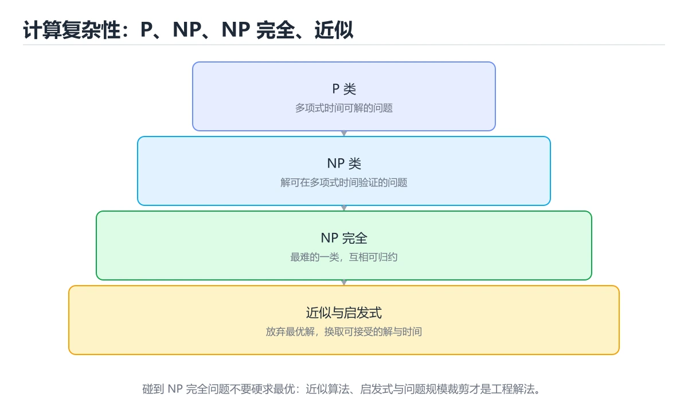
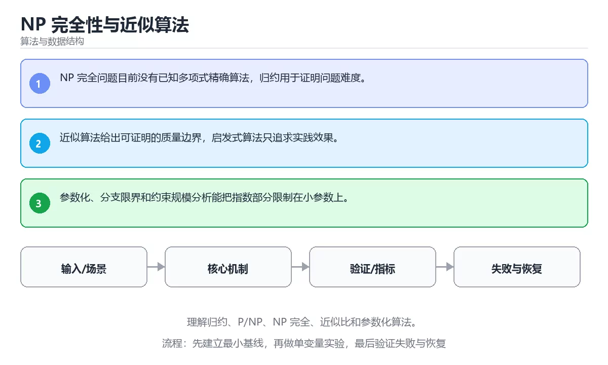

# NP 完全性与近似算法





> 内容更新时间：2026-10-03 · 学习阶段：高级 · 预计用时：26 分钟

## 学习目标

- 能用自己的话解释：NP 完全问题目前没有已知多项式精确算法，归约用于证明问题难度。
- 能用自己的话解释：近似算法给出可证明的质量边界，启发式算法只追求实践效果。
- 能用自己的话解释：参数化、分支限界和约束规模分析能把指数部分限制在小参数上。
- 能把本课知识放回「算法与数据结构」，并完成练习与测验。

## 前置知识

- 已完成「算法与数据结构」的基础课程，能运行正文中的最小示例。
- 本课关键词：NP、归约、近似算法、参数化。
- 遇到不熟悉的术语先记录问题，完成练习后再回读。

## 核心知识

### 1. NP 完全问题目前没有已知多项式精确算法，归约用于证明问题难度。

- 它解决的问题：把「NP 完全问题目前没有已知多项式精确算法，归约用于证明问题难度。」放回真实场景，说明不做它会带来什么后果。
- 关键做法：先用最小示例建立基线，再逐步加入边界、失败和性能条件。
- 验证标准：结果可复现、错误可解释、边界有测试、失败能恢复。

### 2. 近似算法给出可证明的质量边界，启发式算法只追求实践效果。

- 它解决的问题：把「近似算法给出可证明的质量边界，启发式算法只追求实践效果。」放回真实场景，说明不做它会带来什么后果。
- 关键做法：先用最小示例建立基线，再逐步加入边界、失败和性能条件。
- 验证标准：结果可复现、错误可解释、边界有测试、失败能恢复。

### 3. 参数化、分支限界和约束规模分析能把指数部分限制在小参数上。

- 它解决的问题：把「参数化、分支限界和约束规模分析能把指数部分限制在小参数上。」放回真实场景，说明不做它会带来什么后果。
- 关键做法：先用最小示例建立基线，再逐步加入边界、失败和性能条件。
- 验证标准：结果可复现、错误可解释、边界有测试、失败能恢复。

## 关键流程

```text
输入 → 校验 → 核心处理 → 验证 → 记录指标 → 失败恢复
```

## 实践路径

1. 用一句话复述本课要解决的问题。
2. 跑通正文中的最小示例并记录基线。
3. 只改变一个输入或参数，预测并验证结果。
4. 补一个失败路径，记录错误、恢复和指标。
5. 把结论写成可复现的笔记或测试。

## 常见误区

| 误区 | 后果 | 修正 |
| --- | --- | --- |
| 只记术语不做实验 | 遇到真实问题无法判断 | 用最小输入跑通并记录结果 |
| 只测正常路径 | 边界和故障上线才暴露 | 补空值、极值和依赖失败 |
| 没有基线就优化 | 无法证明改进有效 | 先测量再修改 |
| 忽略成本与安全 | 性能和风险失控 | 同时记录资源、权限与失败代价 |

## 动手练习

1. 合上教程，用 3～5 句话解释「NP 完全性与近似算法」。
2. 从正文选一个例子，改变一个条件并预测结果。
3. 设计一个失败场景，写出止损与恢复步骤。

**验收标准**：留下输入、命令、输出、差异和下一步问题。

## 本课小结

- 本课属于「算法与数据结构」，核心关键词是 NP、归约、近似算法、参数化。
- 先保证正确与可复现，再讨论性能和扩展。
- 完成练习和测验后，把仍然不确定的问题写成下一轮验证清单。

> 本课由 P1 内容扩展生成，重点补充原有课程缺失的主题与工程边界。


## 考点精讲：把测验题还原成判断过程

本课有 5 个判断点。先自己作答，再看「判断依据」；如果结论正确但理由不完整，回到正文对应章节补足概念。

### 考点 1：关于「NP 完全问题目前没有已知多项式精确…」，下列说法正确的是？

- **正确判断**：NP 完全问题目前没有已知多项式精确算法，归约用于证明问题难度。
- **判断依据**：正确答案是「NP 完全问题目前没有已知多项式精确算法，归约用于证明问题难度。」，本课在「本课小结」中说明：本课属于「算法与数据结构」，核心关键词是 NP、归约、近似算法、参数化。，本课在「核心知识」中说明：它解决的问题：把NP 完全问题目前没有已知多项式精确算法，归约用于证明问题难度。，本课在「核心知识」中说明：它解决的问题：把近似算法给出可证明的质量边界，启发式算法只追求实践效果。
- **迁移检查**：如果给某个错误选项去掉一个限定词，它会不会变成正确？说明理由。

### 考点 2：关于「近似算法给出可证明的质量边界 启发式…」，下列说法正确的是？

- **正确判断**：近似算法给出可证明的质量边界，启发式算法只追求实践效果。
- **判断依据**：正确答案是「近似算法给出可证明的质量边界，启发式算法只追求实践效果。」，本课在「本课小结」中说明：本课属于「算法与数据结构」，核心关键词是 NP、归约、近似算法、参数化。，本课在「核心知识」中说明：它解决的问题：把近似算法给出可证明的质量边界，启发式算法只追求实践效果。，本课在「核心知识」中说明：它解决的问题：把参数化、分支限界和约束规模分析能把指数部分限制在小参数上。
- **迁移检查**：把题干里的一个条件换成边界值，原来的结论还成立吗？写出判断过程。

### 考点 3：关于「参数化、分支限界和约束规模分析能把指…」，下列说法正确的是？

- **正确判断**：参数化、分支限界和约束规模分析能把指数部分限制在小参数上。
- **判断依据**：正确答案是「参数化、分支限界和约束规模分析能把指数部分限制在小参数上。」，本课在「核心知识」中说明：它解决的问题：把NP 完全问题目前没有已知多项式精确算法，归约用于证明问题难度。，本课在核心知识中说明：它解决的问题：把近似算法给出可证明的质量边界，启发式算法只追求实践效果。，本课在核心知识中说明：它解决的问题：把参数化、分支限界和约束规模分析能把指数部分限制在小参数上。
- **迁移检查**：如果给某个错误选项去掉一个限定词，它会不会变成正确？说明理由。

### 考点 4：「NP 完全性与近似算法」的核心学习目标是什么？

- **正确判断**：理解归约、P/NP、NP 完全、近似比和参数化算法。
- **判断依据**：正确答案是「理解归约、P/NP、NP 完全、近似比和参数化算法。」，本课在「核心知识」中说明：它解决的问题：把近似算法给出可证明的质量边界，启发式算法只追求实践效果。，本课在核心知识中说明：它解决的问题：把NP 完全问题目前没有已知多项式精确算法，归约用于证明问题难度。本课还在核心知识中说明：它解决的问题：把参数化、分支限界和约束规模分析能把指数部分限制在小参数上。
- **迁移检查**：遮住选项，只根据定义复述一次答案，再回来看哪个选项与复述一致。

### 考点 5：以下哪些术语与「NP 完全性与近似算法」直接相关？（多选）

- **正确判断**：NP、归约
- **判断依据**：正确答案是「NP、归约」，本课在「核心知识」中说明：它解决的问题：把近似算法给出可证明的质量边界，启发式算法只追求实践效果。本课还在核心知识中说明：它解决的问题：把NP 完全问题目前没有已知多项式精确算法，归约用于证明问题难度。本课还在「核心知识」中说明：它解决的问题：把参数化、分支限界和约束规模分析能把指数部分限制在小参数上。
- **迁移检查**：每个正确项各自成立的条件是什么？有没有互相依赖。

## 本课复习清单

离开本课前，逐项确认：

- [ ] 不看解析，能说出「关于「NP 完全问题目前没有已知多项式精确…」，下列说法正确的是？」的判断依据。
- [ ] 不看解析，能说出「关于「近似算法给出可证明的质量边界 启发式…」，下列说法正确的是？」的判断依据。
- [ ] 不看解析，能说出「关于「参数化、分支限界和约束规模分析能把指…」，下列说法正确的是？」的判断依据。
- [ ] 不看解析，能说出「「NP 完全性与近似算法」的核心学习目标是什么？」的判断依据。
- [ ] 不看解析，能说出「以下哪些术语与「NP 完全性与近似算法」直接相关？（多选）」的判断依据。
- [ ] 至少运行一次本课示例，记录输入、输出和一个边界情况。
- [ ] 把本课最容易混淆的两个概念写成一句话对照。

| 复盘项 | 记录 |
| --- | --- |
| 已经能独立解释的考点 |  |
| 仍然说不清的概念 |  |
| 下一步验证动作 |  |

## 逐节复习与自检

下面按正文顺序回顾每一节，并给出一个自检问题；说不清的地方回到原章节补课。

### 核心知识

」放回真实场景，说明不做它会带来什么后果。关键做法：先用最小示例建立基线，再逐步加入边界、失败和性能条件。

自检：这一节与相邻主题的边界在哪里？

### 动手练习

合上教程，用 3～5 句话解释「NP 完全性与近似算法」。从正文选一个例子，改变一个条件并预测结果。

自检：如果去掉这一节里的一个前提，结论会怎样变化？

### 验证步骤

制造一次错误输入，记录错误信息与修复方式。

自检：如果去掉这一节里的一个前提，结论会怎样变化？

## 易错点回顾

下面把本课最容易判断错的地方集中成一张清单，复习时先自己回答，再对照解析补全理由。

- **关于「NP 完全问题目前没有已知多项式精确…」，下列说法正确的是？**：正确答案是「NP 完全问题目前没有已知多项式精确算法，归约用于证明问题难度。
- **关于「近似算法给出可证明的质量边界 启发式…」，下列说法正确的是？**：正确答案是「近似算法给出可证明的质量边界，启发式算法只追求实践效果。
- **关于「参数化、分支限界和约束规模分析能把指…」，下列说法正确的是？**：正确答案是「参数化、分支限界和约束规模分析能把指数部分限制在小参数上。
- **「NP 完全性与近似算法」的核心学习目标是什么？**：正确答案是「理解归约、P/NP、NP 完全、近似比和参数化算法。
- **以下哪些术语与「NP 完全性与近似算法」直接相关？（多选）**：正确答案是「NP、归约」，本课在「核心知识」中说明：它解决的问题：把近似算法给出可证明的质量边界，启发式算法只追求实践效果。

## 深度追问与自测

下面把本课考点换一个角度再问一遍。先合上上一节，写出自己的判断，再对照答案与检查点补全理由。

### 追问 1：关于「NP 完全问题目前没有已知多项式精确…」，下列说法正确的是？

- 先写下判断，再对照：NP 完全问题目前没有已知多项式精确算法，归约用于证明问题难度。
- 检查点：如果输入换成边界值，这个结论还需要补充哪个前提？

### 追问 2：关于「近似算法给出可证明的质量边界 启发式…」，下列说法正确的是？

- 先写下判断，再对照：近似算法给出可证明的质量边界，启发式算法只追求实践效果。
- 检查点：如果输入换成边界值，这个结论还需要补充哪个前提？

### 追问 3：关于「参数化、分支限界和约束规模分析能把指…」，下列说法正确的是？

- 先写下判断，再对照：参数化、分支限界和约束规模分析能把指数部分限制在小参数上。
- 检查点：如果输入换成边界值，这个结论还需要补充哪个前提？

### 追问 4：「NP 完全性与近似算法」的核心学习目标是什么？

- 先写下判断，再对照：理解归约、P/NP、NP 完全、近似比和参数化算法。
- 检查点：如果输入换成边界值，这个结论还需要补充哪个前提？

### 追问 5：以下哪些术语与「NP 完全性与近似算法」直接相关？（多选）

- 先写下判断，再对照：NP、归约
- 检查点：如果输入换成边界值，这个结论还需要补充哪个前提？

## 术语速查

把本课反复出现的术语集中放在一起。复习时先遮住右列，尝试用自己的话解释，再回到正文核对。

| 术语 | 本课语境 |
| --- | --- |
| `NP` | 本课围绕该主题展开，结合正文与代码示例理解它的适用边界。 |
| `归约` | 本课围绕该主题展开，结合正文与代码示例理解它的适用边界。 |
| `近似算法` | 本课围绕该主题展开，结合正文与代码示例理解它的适用边界。 |
| `参数化` | 本课围绕该主题展开，结合正文与代码示例理解它的适用边界。 |

## 面试问答与自测

下面把本课考点换成面试追问。先口述自己的答案，
再对照参考回答检查是否遗漏了前提、边界或失败路径。

### 追问 1：关于「NP 完全问题目前没有已知多项式精确…」，下列说法正确的是？

**参考回答**：正确答案是「NP 完全问题目前没有已知多项式精确算法，归约用于证明问题难度。」，本课在「核心知识」中说明：它解决的问题：把NP 完全问题目前没有已知多项式精确算法，归约用于证明问题难度。，本课在「深度追问与自测」中说明：先写下判断，再对照：NP 完全问题目前没有已知多项式精确算法，归约用于证明问题难度。，本课在「本课小结」中说明：本课属于「算法与数据结构」，核心关键词是 NP、归约、近似算法、参数化。

### 追问 2：关于「近似算法给出可证明的质量边界 启发式…」，下列说法正确的是？

**参考回答**：正确答案是「近似算法给出可证明的质量边界，启发式算法只追求实践效果。」，本课在「核心知识」中说明：它解决的问题：把近似算法给出可证明的质量边界，启发式算法只追求实践效果。，本课在「深度追问与自测」中说明：先写下判断，再对照：近似算法给出可证明的质量边界，启发式算法只追求实践效果。，本课在「本课小结」中说明：本课属于「算法与数据结构」，核心关键词是 NP、归约、近似算法、参数化。

### 追问 3：关于「参数化、分支限界和约束规模分析能把指…」，下列说法正确的是？

**参考回答**：正确答案是「参数化、分支限界和约束规模分析能把指数部分限制在小参数上。」，本课在「深度追问与自测」中说明：先写下判断，再对照：参数化、分支限界和约束规模分析能把指数部分限制在小参数上。，本课在「核心知识」中说明：它解决的问题：把参数化、分支限界和约束规模分析能把指数部分限制在小参数上。，本课在「核心知识」中说明：它解决的问题：把NP 完全问题目前没有已知多项式精确算法，归约用于证明问题难度。本课还在「本课小结」中说明：本课属于「算法与数据结构」，核心关键词是 NP、归约、近似算法、参数化。

### 追问 4：「NP 完全性与近似算法」的核心学习目标是什么？

**参考回答**：正确答案是「理解归约、P/NP、NP 完全、近似比和参数化算法。」，本课在「本课小结」中说明：本课属于「算法与数据结构」，核心关键词是 NP、归约、近似算法、参数化。，本课在「深度追问与自测」中说明：先写下判断，再对照：理解归约、P/NP、NP 完全、近似比和参数化算法。，本课在「核心知识」中说明：它解决的问题：把近似算法给出可证明的质量边界，启发式算法只追求实践效果。本课还在「深度追问与自测」中说明：先写下判断，再对照：近似算法给出可证明的质量边界，启发式算法只追求实践效果。

### 追问 5：以下哪些术语与「NP 完全性与近似算法」直接相关？（多选）

**参考回答**：正确答案是「NP、归约」，本课在「深度追问与自测」中说明：先写下判断，再对照：理解归约、P/NP、NP 完全、近似比和参数化算法。本课还在核心知识中说明：它解决的问题：把NP 完全问题目前没有已知多项式精确算法，归约用于证明问题难度。本课还在「核心知识」中说明：它解决的问题：把近似算法给出可证明的质量边界，启发式算法只追求实践效果。本课还在「深度追问与自测」中说明：先写下判断，再对照：近似算法给出可证明的质量边界，启发式算法只追求实践效果。

<!-- p0-depth-v2:start -->
## 零基础精讲：把「NP 完全性与近似算法」真正讲透

### 先建立一个直觉

把算法看成一张可复核的路线图：输入规模决定走哪条路，每一步都要说明为什么不会漏解、为什么最终会停下来，以及代价如何增长。

本课的摘要可以当作一张地图：理解归约、P/NP、NP 完全、近似比和参数化算法。

阅读时不要只记结论，先问三个问题：它解决什么问题？依赖哪些前提？在什么条件下会失效？

### 逐步拆解

1. 识别输入。先写清数据类型、取值范围、空值策略，以及输入来自用户、文件还是另一个服务。
2. 描述处理过程。把「NP、归约、近似算法、参数化」映射到具体步骤，每步都要求能单独验证。
3. 定义输出。输出不仅包括正常结果，还包括错误码、日志、指标和资源释放状态。
4. 找出一条失败路径。让错误尽早暴露，并说明重试、降级、回滚或人工处理的边界。
5. 用一个小例子贯穿全过程。先手算或预测结果，再运行代码或实验，最后解释差异。

### 把正文串成一条执行链

- **1. NP 完全问题目前没有已知多项式精确算法，归约用于证明问题难度。**：1. NP 完全问题目前没有已知多项式精确算法，归约用于证明问题难度
- **2. 近似算法给出可证明的质量边界，启发式算法只追求实践效果。**：2. 近似算法给出可证明的质量边界，启发式算法只追求实践效果
- **3. 参数化、分支限界和约束规模分析能把指数部分限制在小参数上。**：3. 参数化、分支限界和约束规模分析能把指数部分限制在小参数上
- **考点 1：关于「NP 完全问题目前没有已知多项式精确…」，下列说法正确的是？**：考点 1：关于「NP 完全问题目前没有已知多项式精确…」，下列说法正确的是
- **考点 2：关于「近似算法给出可证明的质量边界 启发式…」，下列说法正确的是？**：考点 2：关于「近似算法给出可证明的质量边界 启发式…」，下列说法正确的是
- **考点 3：关于「参数化、分支限界和约束规模分析能把指…」，下列说法正确的是？**：考点 3：关于「参数化、分支限界和约束规模分析能把指…」，下列说法正确的是

### 从测验反推易错点

**检查点 1：关于「NP 完全问题目前没有已知多项式精确…」，下列说法正确的是？**

- 参考判断：NP 完全问题目前没有已知多项式精确算法，归约用于证明问题难度。
- 解析：正确答案是「NP 完全问题目前没有已知多项式精确算法，归约用于证明问题难度。」，本课在「核心知识」中说明：它解决的问题：把NP 完全问题目前没有已知多项式精确算法，归约用于证明问题难度。，本课在「深度追问与自测」中说明：先写下判断，再对照：NP 完全问题目前没有已知多项式精确算法，归约用于证明问题难度。，本课在「本课小结」中说明：本课属于「算法与数据结构」，核心关键词是 NP、归约、近似算法、参数化。
- 自问：如果去掉题干里的一个限定词，结论还成立吗？

**检查点 2：关于「近似算法给出可证明的质量边界 启发式…」，下列说法正确的是？**

- 参考判断：近似算法给出可证明的质量边界，启发式算法只追求实践效果。
- 解析：正确答案是「近似算法给出可证明的质量边界，启发式算法只追求实践效果。」，本课在「核心知识」中说明：它解决的问题：把近似算法给出可证明的质量边界，启发式算法只追求实践效果。，本课在「深度追问与自测」中说明：先写下判断，再对照：近似算法给出可证明的质量边界，启发式算法只追求实践效果。，本课在「本课小结」中说明：本课属于「算法与数据结构」，核心关键词是 NP、归约、近似算法、参数化。
- 自问：如果去掉题干里的一个限定词，结论还成立吗？

**检查点 3：关于「参数化、分支限界和约束规模分析能把指…」，下列说法正确的是？**

- 参考判断：参数化、分支限界和约束规模分析能把指数部分限制在小参数上。
- 解析：正确答案是「参数化、分支限界和约束规模分析能把指数部分限制在小参数上。」，本课在「深度追问与自测」中说明：先写下判断，再对照：参数化、分支限界和约束规模分析能把指数部分限制在小参数上。，本课在「核心知识」中说明：它解决的问题：把参数化、分支限界和约束规模分析能把指数部分限制在小参数上。，本课在「核心知识」中说明：它解决的问题：把NP 完全问题目前没有已知多项式精确算法，归约用于证明问题难度。本课还在「本课小结」中说明：本课属于「算法与数据结构」，核心关键词是 NP、归约、近似算法、参数化。
- 自问：如果去掉题干里的一个限定词，结论还成立吗？

**检查点 4：「NP 完全性与近似算法」的核心学习目标是什么？**

- 参考判断：理解归约、P/NP、NP 完全、近似比和参数化算法。
- 解析：正确答案是「理解归约、P/NP、NP 完全、近似比和参数化算法。」，本课在「本课小结」中说明：本课属于「算法与数据结构」，核心关键词是 NP、归约、近似算法、参数化。，本课在「深度追问与自测」中说明：先写下判断，再对照：理解归约、P/NP、NP 完全、近似比和参数化算法。，本课在「核心知识」中说明：它解决的问题：把近似算法给出可证明的质量边界，启发式算法只追求实践效果。本课还在「深度追问与自测」中说明：先写下判断，再对照：近似算法给出可证明的质量边界，启发式算法只追求实践效果。
- 自问：如果去掉题干里的一个限定词，结论还成立吗？

**检查点 5：以下哪些术语与「NP 完全性与近似算法」直接相关？（多选）**

- 参考判断：NP、归约
- 解析：正确答案是「NP、归约」，本课在「深度追问与自测」中说明：先写下判断，再对照：理解归约、P/NP、NP 完全、近似比和参数化算法。本课还在核心知识中说明：它解决的问题：把NP 完全问题目前没有已知多项式精确算法，归约用于证明问题难度。本课还在「核心知识」中说明：它解决的问题：把近似算法给出可证明的质量边界，启发式算法只追求实践效果。本课还在「深度追问与自测」中说明：先写下判断，再对照：近似算法给出可证明的质量边界，启发式算法只追求实践效果。
- 自问：如果去掉题干里的一个限定词，结论还成立吗？

### 工程排错顺序

| 先查什么 | 要得到的证据 | 判断标准 |
| --- | --- | --- |
| 问题规模与最坏情况是什么？ | 日志、输入样例、测试或指标 | 能复现并解释，才算定位 |
| 循环是否一定收缩并到达终止条件？ | 日志、输入样例、测试或指标 | 能复现并解释，才算定位 |
| 边界、重复元素和空输入是否覆盖？ | 日志、输入样例、测试或指标 | 能复现并解释，才算定位 |
| 时间与空间复杂度是否经过实测？ | 日志、输入样例、测试或指标 | 能复现并解释，才算定位 |

排查顺序应遵循「先复现、再缩小范围、再验证假设、最后修改」。不要同时改多个变量，否则即使问题消失，也无法知道真正原因。

### 变式训练

1. 把它放进一个只有单机、没有额外依赖的小项目，先保证正确，再考虑扩展。
2. 把输入规模扩大十倍，记录时间、内存和失败路径，找出第一个真正瓶颈。
3. 制造一次依赖超时或错误输入，要求系统给出可解释错误并且不留下半完成状态。
4. 让另一个同学只读接口说明和测试用例，复现你的结论；无法复现的部分继续补文档或测试。
5. 删掉一个看似必要的步骤，观察哪个测试或指标先失败，用证据说明它为什么必要。
6. 把方案切换到低资源设备，重新评估默认参数、超时和降级策略。

每道变式都写下：预测、实际结果、差异、下一步。没有留下证据的练习，很难迁移到真实项目。

### 本课自测

- [ ] 能用一句话解释「NP」在本课中的角色与边界。
- [ ] 能举出一个正常例子和一个失败例子。
- [ ] 能说出最小验证步骤，以及需要记录的证据。
- [ ] 能用一句话解释「归约」在本课中的角色与边界。
- [ ] 能举出一个正常例子和一个失败例子。
- [ ] 能说出最小验证步骤，以及需要记录的证据。
- [ ] 能用一句话解释「近似算法」在本课中的角色与边界。
- [ ] 能举出一个正常例子和一个失败例子。
- [ ] 能说出最小验证步骤，以及需要记录的证据。
- [ ] 能用一句话解释「参数化」在本课中的角色与边界。
- [ ] 能举出一个正常例子和一个失败例子。
- [ ] 能说出最小验证步骤，以及需要记录的证据。
- [ ] 能用一句话解释「NP」在本课中的角色与边界。
- [ ] 能举出一个正常例子和一个失败例子。
- [ ] 能说出最小验证步骤，以及需要记录的证据。

### 迁移案例库

下面用不同约束重复同一套方法。每完成一轮，都把结论写进笔记，并只改变一个变量。

#### 迁移案例 1：围绕「NP」做一次小实验

**目标**：在不改变课程主体的前提下，验证「NP 完全性与近似算法」中的一个关键判断。

**步骤**：
1. 复述当前方案对「NP」的假设，写成一句可证伪的话。
2. 设计一个正常输入和一个边界输入，分别预测输出。
3. 运行或逐步演算，记录实际输出、耗时和失败信息。
4. 只调整一个参数，比较前后差异并解释原因。
5. 补充一条测试或复习卡，确保下次能更快复现。

**验收**：结论有证据、差异可解释、失败可恢复；如果做不到，说明还需要缩小问题范围。

#### 迁移案例 2：围绕「归约」做一次小实验

**目标**：在不改变课程主体的前提下，验证「NP 完全性与近似算法」中的一个关键判断。

**步骤**：
1. 复述当前方案对「归约」的假设，写成一句可证伪的话。
2. 设计一个正常输入和一个边界输入，分别预测输出。
3. 运行或逐步演算，记录实际输出、耗时和失败信息。
4. 只调整一个参数，比较前后差异并解释原因。
5. 补充一条测试或复习卡，确保下次能更快复现。

**验收**：结论有证据、差异可解释、失败可恢复；如果做不到，说明还需要缩小问题范围。

#### 迁移案例 3：围绕「近似算法」做一次小实验

**目标**：在不改变课程主体的前提下，验证「NP 完全性与近似算法」中的一个关键判断。

**步骤**：
1. 复述当前方案对「近似算法」的假设，写成一句可证伪的话。
2. 设计一个正常输入和一个边界输入，分别预测输出。
3. 运行或逐步演算，记录实际输出、耗时和失败信息。
4. 只调整一个参数，比较前后差异并解释原因。
5. 补充一条测试或复习卡，确保下次能更快复现。

**验收**：结论有证据、差异可解释、失败可恢复；如果做不到，说明还需要缩小问题范围。

#### 迁移案例 4：围绕「参数化」做一次小实验

**目标**：在不改变课程主体的前提下，验证「NP 完全性与近似算法」中的一个关键判断。

**步骤**：
1. 复述当前方案对「参数化」的假设，写成一句可证伪的话。
2. 设计一个正常输入和一个边界输入，分别预测输出。
3. 运行或逐步演算，记录实际输出、耗时和失败信息。
4. 只调整一个参数，比较前后差异并解释原因。
5. 补充一条测试或复习卡，确保下次能更快复现。

**验收**：结论有证据、差异可解释、失败可恢复；如果做不到，说明还需要缩小问题范围。

#### 迁移案例 5：围绕「NP」做一次小实验

**目标**：在不改变课程主体的前提下，验证「NP 完全性与近似算法」中的一个关键判断。

**步骤**：
1. 复述当前方案对「NP」的假设，写成一句可证伪的话。
2. 设计一个正常输入和一个边界输入，分别预测输出。
3. 运行或逐步演算，记录实际输出、耗时和失败信息。
4. 只调整一个参数，比较前后差异并解释原因。
5. 补充一条测试或复习卡，确保下次能更快复现。

**验收**：结论有证据、差异可解释、失败可恢复；如果做不到，说明还需要缩小问题范围。

#### 迁移案例 6：围绕「归约」做一次小实验

**目标**：在不改变课程主体的前提下，验证「NP 完全性与近似算法」中的一个关键判断。

**步骤**：
1. 复述当前方案对「归约」的假设，写成一句可证伪的话。
2. 设计一个正常输入和一个边界输入，分别预测输出。
3. 运行或逐步演算，记录实际输出、耗时和失败信息。
4. 只调整一个参数，比较前后差异并解释原因。
5. 补充一条测试或复习卡，确保下次能更快复现。

**验收**：结论有证据、差异可解释、失败可恢复；如果做不到，说明还需要缩小问题范围。

#### 迁移案例 7：围绕「近似算法」做一次小实验

**目标**：在不改变课程主体的前提下，验证「NP 完全性与近似算法」中的一个关键判断。

**步骤**：
1. 复述当前方案对「近似算法」的假设，写成一句可证伪的话。
2. 设计一个正常输入和一个边界输入，分别预测输出。
3. 运行或逐步演算，记录实际输出、耗时和失败信息。
4. 只调整一个参数，比较前后差异并解释原因。
5. 补充一条测试或复习卡，确保下次能更快复现。

**验收**：结论有证据、差异可解释、失败可恢复；如果做不到，说明还需要缩小问题范围。

#### 迁移案例 8：围绕「参数化」做一次小实验

**目标**：在不改变课程主体的前提下，验证「NP 完全性与近似算法」中的一个关键判断。

**步骤**：
1. 复述当前方案对「参数化」的假设，写成一句可证伪的话。
2. 设计一个正常输入和一个边界输入，分别预测输出。
3. 运行或逐步演算，记录实际输出、耗时和失败信息。
4. 只调整一个参数，比较前后差异并解释原因。
5. 补充一条测试或复习卡，确保下次能更快复现。

**验收**：结论有证据、差异可解释、失败可恢复；如果做不到，说明还需要缩小问题范围。

#### 迁移案例 9：围绕「NP」做一次小实验

**目标**：在不改变课程主体的前提下，验证「NP 完全性与近似算法」中的一个关键判断。

**步骤**：
1. 复述当前方案对「NP」的假设，写成一句可证伪的话。
2. 设计一个正常输入和一个边界输入，分别预测输出。
3. 运行或逐步演算，记录实际输出、耗时和失败信息。
4. 只调整一个参数，比较前后差异并解释原因。
5. 补充一条测试或复习卡，确保下次能更快复现。

**验收**：结论有证据、差异可解释、失败可恢复；如果做不到，说明还需要缩小问题范围。

#### 迁移案例 10：围绕「归约」做一次小实验

**目标**：在不改变课程主体的前提下，验证「NP 完全性与近似算法」中的一个关键判断。

**步骤**：
1. 复述当前方案对「归约」的假设，写成一句可证伪的话。
2. 设计一个正常输入和一个边界输入，分别预测输出。
3. 运行或逐步演算，记录实际输出、耗时和失败信息。
4. 只调整一个参数，比较前后差异并解释原因。
5. 补充一条测试或复习卡，确保下次能更快复现。

**验收**：结论有证据、差异可解释、失败可恢复；如果做不到，说明还需要缩小问题范围。

#### 迁移案例 11：围绕「近似算法」做一次小实验

**目标**：在不改变课程主体的前提下，验证「NP 完全性与近似算法」中的一个关键判断。

**步骤**：
1. 复述当前方案对「近似算法」的假设，写成一句可证伪的话。
2. 设计一个正常输入和一个边界输入，分别预测输出。
3. 运行或逐步演算，记录实际输出、耗时和失败信息。
4. 只调整一个参数，比较前后差异并解释原因。
5. 补充一条测试或复习卡，确保下次能更快复现。

**验收**：结论有证据、差异可解释、失败可恢复；如果做不到，说明还需要缩小问题范围。

#### 迁移案例 12：围绕「参数化」做一次小实验

**目标**：在不改变课程主体的前提下，验证「NP 完全性与近似算法」中的一个关键判断。

**步骤**：
1. 复述当前方案对「参数化」的假设，写成一句可证伪的话。
2. 设计一个正常输入和一个边界输入，分别预测输出。
3. 运行或逐步演算，记录实际输出、耗时和失败信息。
4. 只调整一个参数，比较前后差异并解释原因。
5. 补充一条测试或复习卡，确保下次能更快复现。

**验收**：结论有证据、差异可解释、失败可恢复；如果做不到，说明还需要缩小问题范围。

#### 迁移案例 13：围绕「NP」做一次小实验

**目标**：在不改变课程主体的前提下，验证「NP 完全性与近似算法」中的一个关键判断。

**步骤**：
1. 复述当前方案对「NP」的假设，写成一句可证伪的话。
2. 设计一个正常输入和一个边界输入，分别预测输出。
3. 运行或逐步演算，记录实际输出、耗时和失败信息。
4. 只调整一个参数，比较前后差异并解释原因。
5. 补充一条测试或复习卡，确保下次能更快复现。

**验收**：结论有证据、差异可解释、失败可恢复；如果做不到，说明还需要缩小问题范围。

#### 迁移案例 14：围绕「归约」做一次小实验

**目标**：在不改变课程主体的前提下，验证「NP 完全性与近似算法」中的一个关键判断。

**步骤**：
1. 复述当前方案对「归约」的假设，写成一句可证伪的话。
2. 设计一个正常输入和一个边界输入，分别预测输出。
3. 运行或逐步演算，记录实际输出、耗时和失败信息。
4. 只调整一个参数，比较前后差异并解释原因。
5. 补充一条测试或复习卡，确保下次能更快复现。

**验收**：结论有证据、差异可解释、失败可恢复；如果做不到，说明还需要缩小问题范围。

#### 迁移案例 15：围绕「近似算法」做一次小实验

**目标**：在不改变课程主体的前提下，验证「NP 完全性与近似算法」中的一个关键判断。

**步骤**：
1. 复述当前方案对「近似算法」的假设，写成一句可证伪的话。
2. 设计一个正常输入和一个边界输入，分别预测输出。
3. 运行或逐步演算，记录实际输出、耗时和失败信息。
4. 只调整一个参数，比较前后差异并解释原因。
5. 补充一条测试或复习卡，确保下次能更快复现。

**验收**：结论有证据、差异可解释、失败可恢复；如果做不到，说明还需要缩小问题范围。

#### 迁移案例 16：围绕「参数化」做一次小实验

**目标**：在不改变课程主体的前提下，验证「NP 完全性与近似算法」中的一个关键判断。

**步骤**：
1. 复述当前方案对「参数化」的假设，写成一句可证伪的话。
2. 设计一个正常输入和一个边界输入，分别预测输出。
3. 运行或逐步演算，记录实际输出、耗时和失败信息。
4. 只调整一个参数，比较前后差异并解释原因。
5. 补充一条测试或复习卡，确保下次能更快复现。

**验收**：结论有证据、差异可解释、失败可恢复；如果做不到，说明还需要缩小问题范围。

<!-- p0-depth-v2:end -->

## English Overview

**Title:** NP-Completeness and Approximation

**Summary:** Learn reductions, P/NP, NP-completeness, approximation ratios and parameterized algorithms.

**Category:** Algorithms  
**Level:** 高级  
**Key terms:** NP, 归约, 近似算法, 参数化

> The full tutorial is written in Chinese. This bilingual overview helps English readers identify the topic, scope and key terms before studying the detailed examples.

## 内容元数据

- 内容版本：v2.0
- 最后更新：2026-10-03
- 学习阶段：高级
- 适用环境：任意主流语言（伪代码与复杂度为主）
- 内容来源：内置结构化课程与工程实践整理
- 相关主题：NP、归约、近似算法、参数化
- 质量版本：P0 测验标准 + P1 覆盖扩展 + P2 体验补全


## 最小可运行示例

下面示例用于验证「NP 完全性与近似算法」的最小输入、处理和输出。先原样运行，再只修改一个值：

```python
def linear_search(items, target):
    for index, item in enumerate(items):
        if item == target:
            return index
    return -1

print(linear_search([3, 5, 8], 8))
```

## 预期输出

```text
2
```

## 验证步骤

1. 记录运行环境、命令和真实输出。
2. 修改一个输入，先写预测再运行。
3. 制造一次错误输入，记录错误信息与修复方式。
4. 把结论写回本课笔记或测试用例。


## 参考资料与复核

- 最后复核：2026-10-04
- 下次复核：2027-04-04
- 复核范围：版本兼容、API 行为、安全建议与工程实践
- 来源性质：官方文档与标准；本课正文为离线教学重组，不复制原文

| 参考资料 | 本课用途 |
| --- | --- |
| [CP-Algorithms](https://cp-algorithms.com/) | 算法实现与复杂度 |
| [MIT OpenCourseWare 6.006](https://ocw.mit.edu/courses/6-006-introduction-to-algorithms-spring-2020/) | 算法设计与分析 |

> 本课主题：理解归约、P/NP、NP 完全、近似比和参数化算法。

> App 完全离线展示文字链接，不会自动联网；需要延伸阅读时可复制链接到浏览器。
