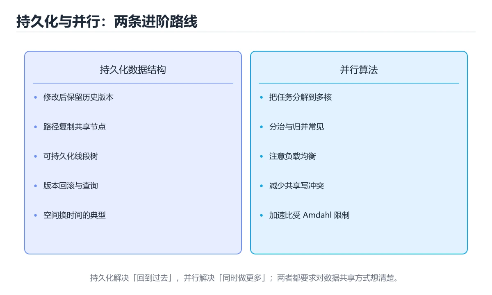
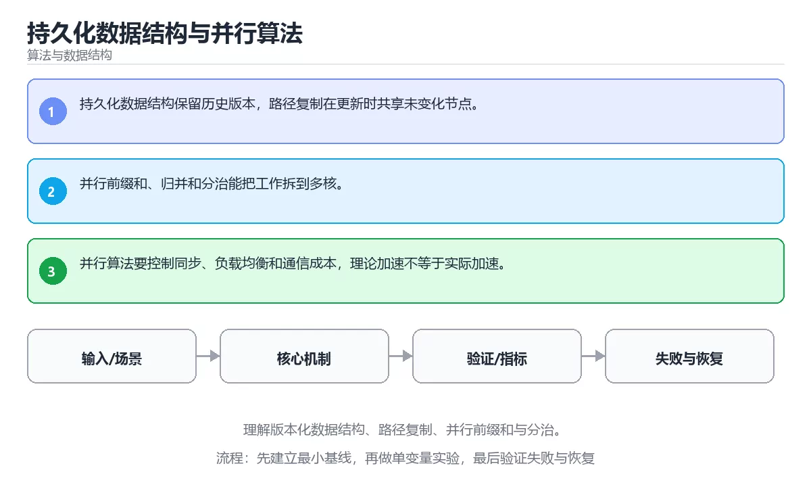

# 持久化数据结构与并行算法





> 内容更新时间：2026-10-06 · 学习阶段：高级 · 预计用时：30 分钟

## 本节知识框架

**课程定位**：所属分类 `algorithms`（算法与数据结构），课程主题 `持久化数据结构与并行算法`，学习阶段 高级，建议用时 40 分钟。

本课主线：理解版本化数据结构、路径复制、并行前缀和与分治。

**学完本课应当能够**
- 说清 `持久化` 与 `版本` 的含义与区别，并各举一个正例和一个反例。
- 用本课示例验证 `并行算法` 的行为，记录输入、输出与失败条件。
- 遇到「持久化结构直接深拷贝」这类问题时，能说出触发条件与修复顺序。

### 从概念到验证的学习链条

1. `持久化`：先掌握 把内存中的状态写入磁盘或数据库，使进程重启后仍可恢复，再用它解释 `版本` 为什么会出现。
2. `版本`：先掌握 一次可标识的代码或数据快照，用于复现、回滚并判断兼容性，再用它解释 `并行算法` 为什么会出现。
3. `并行算法`：先掌握 按“持久化数据结构与并行算法”中 持久化、版本、并行算法 的实践顺序，把四个步骤排成从准备到复盘的合理顺序，再用它解释 `前缀和` 为什么会出现。
4. `前缀和`：先掌握 预先累加数组前缀，使任意区间和可以用两次减法求出，再用它解释 本课示例的观察结果 为什么会出现。

**先修与衔接**：本课是「算法与数据结构」分类的第 35 课。先修内容：《计算几何基础》。《计算几何基础》里的 `凸包`、`扫描线` 是本课的前提。相关或后续课程：《算法入门》。

### 完成判据

- **定义关**：不看正文也能说明 `持久化` 是 把内存中的状态写入磁盘或数据库，使进程重启后仍可恢复，并指出一个反例。
- **机制关**：能按“输入 → 转换 → 输出 → 验证”复述 `持久化数据结构与并行算法`，而不是只背结论。
- **示例关**：能运行或推演 `持久化数据结构与并行算法` 的 `text` 示例，并说明一个真实出现的标识符或字面量。
- **证据关**：能指出 `持久化数据结构与并行算法` 示例里的 调用了 `linear_search()`，并说明它支持或反驳了本课的哪一条结论。
- **排错关**：能复现 持久化结构直接深拷贝，记录现象并按 用路径复制共享未修改的节点 修复。
- **迁移关**：能把 `持久化`、`版本`、`并行算法`、`前缀和` 放进一个与 `持久化数据结构与并行算法` 不同的项目场景，并保持输入与验证条件可追踪。
- **复盘关**：学完 `持久化数据结构与并行算法` 后，用一句话写下仍然不确定的结论，并列出下一次验证需要的输入、环境和成功判据。

### 复习清单

- [ ] 能不看正文复述本课核心术语，并指出一个边界或反例。
- [ ] 能运行或推演本课示例，记录输入、输出与失败现象。
- [ ] 能完成一次自测，并把错题对照错误表定位原因。

## 核心概念定义

| 术语 | 操作性定义 | 常见边界与风险 |
| --- | --- | --- |
| 持久化 | 把内存中的状态写入磁盘或数据库，使进程重启后仍可恢复。 | 易错：每次修改都复制整棵树，时间与空间爆炸；正确做法是用路径复制共享未修改的节点。 |
| 版本 | 一次可标识的代码或数据快照，用于复现、回滚并判断兼容性。 | 不同版本与依赖组合的行为可能不同，升级或换环境前要按官方变更说明重新验证。 |
| 并行算法 | 按“持久化数据结构与并行算法”中 持久化、版本、并行算法 的实践顺序，把四个步骤排成从准备到复盘的合理顺序。 | 易错：加速比远低于预期；正确做法是先做粒度分析，再决定并行层次与任务大小。 |
| 前缀和 | 预先累加数组前缀，使任意区间和可以用两次减法求出。 | 只在「预先累加数组前缀，使任意区间和可以用两次减法求出」这一前提下成立，换输入或换环境要重新验证。 |
| 问题规模与最坏情况是什么？ | 日志、输入样例、测试或指标 | 只在「日志、输入样例、测试或指标」这一前提下成立，换输入或换环境要重新验证。 |
| 循环是否一定收缩并到达终止条件？ | 日志、输入样例、测试或指标 | 只在「日志、输入样例、测试或指标」这一前提下成立，换输入或换环境要重新验证。 |
| 边界、重复元素和空输入是否覆盖？ | 日志、输入样例、测试或指标 | 只在「日志、输入样例、测试或指标」这一前提下成立，换输入或换环境要重新验证。 |
| 时间与空间复杂度是否经过实测？ | 日志、输入样例、测试或指标 | 只在「日志、输入样例、测试或指标」这一前提下成立，换输入或换环境要重新验证。 |

## 原理与运行机制

### 机制总览

| 阶段 | 关注对象 | 失败时应检查 |
| --- | --- | --- |
| 输入 | 持久化 | 类型、范围、编码、版本或前置状态是否满足定义。 |
| 处理 | 版本 | 顺序、可见性、锁、路由、事务或调度规则是否被破坏。 |
| 输出 | 并行算法 | 结果是否可复现，错误是否被正确传播而不是被吞掉。 |

**教材衔接：核心知识**

### 1. 持久化数据结构保留历史版本，路径复制在更新时共享未变化节点。

- 关键做法：基线只保留 版本 必需的部分，其余条件一次加一个。
- 验证标准：linear_search 的输出能被他人复现，边界输入有对应用例。

### 2. 并行前缀和、归并和分治能把工作拆到多核。

把这条结论放回「持久化数据结构与并行算法」的完整流程里展开：

- 正文依据：能用自己的话解释：持久化数据结构保留历史版本，路径复制在更新时共享未变化节点。
- 落地检查：把「2. 并行前缀和、归并和分治能把工作拆到多核。」改写成一条可执行的核对项，逐条验证输入、超时与失败路径。

### 3. 并行算法要控制同步、负载均衡和通信成本，理论加速不等于实际加速。

把这条结论放回「持久化数据结构与并行算法」的完整流程里展开：

- 正文依据：能用自己的话解释：并行前缀和、归并和分治能把工作拆到多核。
- 落地检查：把「3. 并行算法要控制同步、负载均衡和通信成本，理论加速不等于实际加速。」改写成一条可执行的核对项，逐条验证输入、超时与失败路径。

**教材衔接：关键流程**

**教材衔接：实践路径**

**教材衔接：验证步骤**

### 机制拆解：每一步的输入、动作与输出

#### 1. `持久化`
- 输入：`持久化`；本步把 把内存中的状态写入磁盘或数据库，使进程重启后仍可恢复 当作判断规则。
- 动作：围绕 `持久化` 保留中间状态，并记录它与 `版本` 的对应关系。
- 输出：`版本`，它可以被下一段代码、测试或记录继续使用。
- `持久化` 的失败条件：当持久化结构直接深拷贝时，会出现每次修改都复制整棵树，时间与空间爆炸。

#### 2. `版本`
- 输入：`持久化`；本步把 一次可标识的代码或数据快照，用于复现、回滚并判断兼容性 当作判断规则。
- 动作：围绕 `版本` 保留中间状态，并记录它与 `并行算法` 的对应关系。
- 输出：`并行算法`，它可以被下一段代码、测试或记录继续使用。
- `版本` 的失败条件：不同版本与依赖组合的行为可能不同，升级或换环境前要按官方变更说明重新验证。

#### 3. `并行算法`
- 输入：`版本`；本步把 按“持久化数据结构与并行算法”中 持久化、版本、并行算法 的实践顺序，把四个步骤排成从准备到复盘的合理顺序 当作判断规则。
- 动作：围绕 `并行算法` 保留中间状态，并记录它与 `前缀和` 的对应关系。
- 输出：`前缀和`，它可以被下一段代码、测试或记录继续使用。
- `并行算法` 的失败条件：当并行算法忽略同步开销时，会出现加速比远低于预期。

#### 4. `前缀和`
- 输入：`并行算法`；本步把 预先累加数组前缀，使任意区间和可以用两次减法求出 当作判断规则。
- 动作：围绕 `前缀和` 保留中间状态，并记录它与 `linear_search` 的对应关系。
- 输出：`linear_search`，它可以被下一段代码、测试或记录继续使用。
- `前缀和` 的失败条件：只在「预先累加数组前缀，使任意区间和可以用两次减法求出」这一前提下成立，换输入或换环境要重新验证。

### 示例中的可观察事实

1. 调用了 `linear_search()`；它对应的课程主题是 `持久化数据结构与并行算法`。
2. 调用了 `enumerate()`；它对应的课程主题是 `持久化数据结构与并行算法`。
3. 调用了 `print()`；它对应的课程主题是 `持久化数据结构与并行算法`。

### 复现实验记录

- 环境：`持久化数据结构与并行算法` 使用 `text` 示例，固定 `持久化`、`版本`、`并行算法`、`前缀和` 作为第一组条件。
- 首轮输入：先确认 调用了 `linear_search()`，预测 `持久化` 会怎样变化。
- 基线观察：记录命令、输入、输出和错误原文，不用截图代替可复制的文本。
- 单变量修改：只改变 `持久化`，观察 `前缀和` 是否仍满足定义。
- 失败注入：复现 持久化结构直接深拷贝，确认现象是 每次修改都复制整棵树，时间与空间爆炸。
- 记录结论：把“修改前、修改后、预期变化、实际变化”写成四列表，这样复盘 `持久化数据结构与并行算法` 时才能区分概念错误与实现错误。

## 典型应用场景

| 场景 | 典型输入或前提 | 期望产物 |
| --- | --- | --- |
| 学习验证 | 使用本课最小示例和 持久化、版本 | 能复现正文结论，并解释每一步。 |
| 工程落地 | 把「持久化数据结构与并行算法」放入真实模块或服务边界 | 输出可观测、失败可定位、参数可配置。 |
| 故障排查 | 只改一个版本、规模、输入或依赖条件 | 能区分概念错误、实现错误和环境差异。 |

- **持久化结构直接深拷贝**：典型现象是每次修改都复制整棵树，时间与空间爆炸；正确做法是用路径复制共享未修改的节点。
- **并行算法忽略同步开销**：典型现象是加速比远低于预期；正确做法是先做粒度分析，再决定并行层次与任务大小。
- **假设并行结果确定**：典型现象是浮点归约顺序不同导致结果不可复现；正确做法是固定归约顺序或改用确定性算法。

### 最小验证场景

- 准备：保留 `text` 示例的原始输入，先记录 `持久化数据结构与并行算法` 的基线输出和完整运行命令。
- 观察：先核对 调用了 `linear_search()`，再改变一个与 `持久化` 相关的条件。
- 判定：新结果与 `持久化数据结构与并行算法` 的基线不同不等于错误；只有当差异破坏了 `持久化` 的定义或错误表中的约束，才判定为失败。

### 选择与边界

- 使用 `持久化` 时，先满足它的定义：把内存中的状态写入磁盘或数据库，使进程重启后仍可恢复；易错：每次修改都复制整棵树，时间与空间爆炸；正确做法是用路径复制共享未修改的节点。
- 使用 `版本` 时，先满足它的定义：一次可标识的代码或数据快照，用于复现、回滚并判断兼容性；不同版本与依赖组合的行为可能不同，升级或换环境前要按官方变更说明重新验证。
- 使用 `并行算法` 时，先满足它的定义：按“持久化数据结构与并行算法”中 持久化、版本、并行算法 的实践顺序，把四个步骤排成从准备到复盘的合理顺序；易错：加速比远低于预期；正确做法是先做粒度分析，再决定并行层次与任务大小。
- 使用 `前缀和` 时，先满足它的定义：预先累加数组前缀，使任意区间和可以用两次减法求出；只在「预先累加数组前缀，使任意区间和可以用两次减法求出」这一前提下成立，换输入或换环境要重新验证。

## 代码/协议/SQL 示例

### 最小可验证示例

下面保留《持久化数据结构与并行算法》原文中的最小示例。先预测《持久化数据结构与并行算法》示例的输出，再按正文步骤运行或推演；示例依赖外部环境时，同时记录版本与输入。

**教材衔接：最小可运行示例**

下面示例用于验证 持久化 的最小输入、处理和输出。先原样运行，再只修改一个值：

```python
def linear_search(items, target):
    for index, item in enumerate(items):
        if item == target:
            return index
    return -1

print(linear_search([3, 5, 8], 8))
```

**教材衔接：预期输出**

```text
2
```

### 示例精读：先找证据，再改一个条件

1. 调用了 `linear_search()`；它出现在 `持久化数据结构与并行算法` 的示例中，阅读时先确认它前后各发生了什么。
2. 调用了 `enumerate()`；它出现在 `持久化数据结构与并行算法` 的示例中，阅读时先确认它前后各发生了什么。
3. 调用了 `print()`；它出现在 `持久化数据结构与并行算法` 的示例中，阅读时先确认它前后各发生了什么。
- 在 `持久化数据结构与并行算法` 中与 `持久化` 对照：示例必须能支持 把内存中的状态写入磁盘或数据库，使进程重启后仍可恢复，否则说明这一段还缺少实现或验证步骤。
- 在 `持久化数据结构与并行算法` 中与 `版本` 对照：示例必须能支持 一次可标识的代码或数据快照，用于复现、回滚并判断兼容性，否则说明这一段还缺少实现或验证步骤。
- 在 `持久化数据结构与并行算法` 中与 `并行算法` 对照：示例必须能支持 按“持久化数据结构与并行算法”中 持久化、版本、并行算法 的实践顺序，把四个步骤排成从准备到复盘的合理顺序，否则说明这一段还缺少实现或验证步骤。
- 在 `持久化数据结构与并行算法` 中与 `前缀和` 对照：示例必须能支持 预先累加数组前缀，使任意区间和可以用两次减法求出，否则说明这一段还缺少实现或验证步骤。

## 时间/空间复杂度或性能分析

**性能关注点（持久化数据结构与并行算法）**：复杂度决定规模上限：同时记录时间与空间增长曲线，并区分最好、平均与最坏情况。

**测量方法**：以 `持久化数据结构与并行算法` 的 `持久化` 场景为对象，固定输入跑一遍记录基线，再把规模或并发度提高一个数量级复测；两次结果的差值与波动范围才是结论依据。

### 需要控制的变量与记录项

- `持久化数据结构与并行算法` 的 `持久化`：固定它的版本、输入范围和资源上限，分别记录速度、内存与失败率的变化。
- `持久化数据结构与并行算法` 的 `版本`：固定它的版本、输入范围和资源上限，分别记录速度、内存与失败率的变化。
- `持久化数据结构与并行算法` 的 `并行算法`：固定它的版本、输入范围和资源上限，分别记录速度、内存与失败率的变化。
- `持久化数据结构与并行算法` 的 `前缀和`：固定它的版本、输入范围和资源上限，分别记录速度、内存与失败率的变化。
- `持久化数据结构与并行算法` 中 `持久化` 的边界：易错：每次修改都复制整棵树，时间与空间爆炸；正确做法是用路径复制共享未修改的节点。达到边界时不要外推，必须重新测量。
- `持久化数据结构与并行算法` 中 `版本` 的边界：不同版本与依赖组合的行为可能不同，升级或换环境前要按官方变更说明重新验证。达到边界时不要外推，必须重新测量。
- `持久化数据结构与并行算法` 中 `并行算法` 的边界：易错：加速比远低于预期；正确做法是先做粒度分析，再决定并行层次与任务大小。达到边界时不要外推，必须重新测量。
- `持久化数据结构与并行算法` 中 `前缀和` 的边界：只在「预先累加数组前缀，使任意区间和可以用两次减法求出」这一前提下成立，换输入或换环境要重新验证。达到边界时不要外推，必须重新测量。
- `持久化数据结构与并行算法` 的代码证据：先验证 调用了 `linear_search()`，再记录该路径的输入规模与耗时；只看代码行数不能推出复杂度。

## 常见误区与易错点

| 容易写错的做法 | 实际现象 | 原因与正确做法 |
| --- | --- | --- |
| 持久化结构直接深拷贝 | 每次修改都复制整棵树，时间与空间爆炸。 | 用路径复制共享未修改的节点。 |
| 并行算法忽略同步开销 | 加速比远低于预期。 | 先做粒度分析，再决定并行层次与任务大小。 |
| 假设并行结果确定 | 浮点归约顺序不同导致结果不可复现。 | 固定归约顺序或改用确定性算法。 |

### 现场 1：持久化结构直接深拷贝

**症状**：每次修改都复制整棵树，时间与空间爆炸。

**根因与修复**：用路径复制共享未修改的节点。

**自检**：在本课示例里复现「持久化结构直接深拷贝」，改成用路径复制共享未修改的节点后重跑；如果症状消失且失败路径按预期变化，说明定位正确。

### 现场 2：并行算法忽略同步开销

**症状**：加速比远低于预期。

**根因与修复**：先做粒度分析，再决定并行层次与任务大小。

**自检**：在本课示例里复现「并行算法忽略同步开销」，改成先做粒度分析，再决定并行层次与任务大小后重跑；如果症状消失且失败路径按预期变化，说明定位正确。

### 现场 3：假设并行结果确定

**症状**：浮点归约顺序不同导致结果不可复现。

**根因与修复**：固定归约顺序或改用确定性算法。

**自检**：在本课示例里复现「假设并行结果确定」，改成固定归约顺序或改用确定性算法后重跑；如果症状消失且失败路径按预期变化，说明定位正确。

## 与其他知识点的关系

| 关系 | 课程 | 为什么 |
| --- | --- | --- |
| 先修 | 《计算几何基础》 | 本课会直接使用它的概念或操作前提。 |
| 关联 | 《算法入门》 | 用于横向比较或把本课结论迁移到相邻主题。 |
| 前置顺序 | 《计算几何基础》 | 同分类中安排在本课之前，建议先完成其自测。 |

**教材衔接：复习与迁移**

### 概念复述

- 用一句话说明「持久化数据结构与并行算法」解决什么问题：理解版本化数据结构、路径复制、并行前缀和与分治。
- 写出持久化、版本、并行算法之间的关系，并各举一个例子。
- 说出本课最容易混淆的两个概念，以及区分它们的判据。

### 正文逐节复核

- **零基础精讲：把持久化数据结构与并行算法真正讲透**：本课的摘要可以当作一张地图：理解版本化数据结构、路径复制、并行前缀和与分治。


### 迁移练习

把「持久化数据结构与并行算法」的结论迁移到相邻主题，每次迁移都写清预测与证据：

- **先修**：`计算几何基础`。本课默认这些内容已经掌握。
- **相关或后续**：`算法入门`。本课术语会在这些课程里继续使用。
- **术语归属**：`持久化`、`版本`、`并行算法` 的定义以本课「核心概念定义」为准，换到其他课程时先确认定义是否被改写。
- 同一分类的《前缀和与差分》也涉及 `前缀和`；两课衔接时先确认这个术语的定义是否一致。

### 先修与后续术语接口

- `算法入门`：两者通过本分类的学习顺序衔接，阅读时重点比较各自的输入与失败条件。
- `计算几何基础`：两者通过本分类的学习顺序衔接，阅读时重点比较各自的输入与失败条件。

### 容易混淆的相邻概念

- `持久化` 与 `版本`：前者强调 把内存中的状态写入磁盘或数据库，使进程重启后仍可恢复；后者强调 一次可标识的代码或数据快照，用于复现、回滚并判断兼容性。判断时分别检查两条定义的适用范围，不要只看名称相似就互换。
- `版本` 与 `并行算法`：前者强调 一次可标识的代码或数据快照，用于复现、回滚并判断兼容性；后者强调 按“持久化数据结构与并行算法”中 持久化、版本、并行算法 的实践顺序，把四个步骤排成从准备到复盘的合理顺序。判断时分别检查两条定义的适用范围，不要只看名称相似就互换。
- `并行算法` 与 `前缀和`：前者强调 按“持久化数据结构与并行算法”中 持久化、版本、并行算法 的实践顺序，把四个步骤排成从准备到复盘的合理顺序；后者强调 预先累加数组前缀，使任意区间和可以用两次减法求出。判断时分别检查两条定义的适用范围，不要只看名称相似就互换。

## 自测题与参考答案

> 先独立作答，再对照参考答案；答案都能在本课正文、术语表或错误表里找到依据。

### 自测 1（概念复述）

不看正文，写出 `持久化` 的操作性定义，并说明它与 `版本` 的区别。

**参考答案**：把内存中的状态写入磁盘或数据库，使进程重启后仍可恢复。

`版本` 的定位是：一次可标识的代码或数据快照，用于复现、回滚并判断兼容性；两者的差别要从适用对象与失败模式上说明。

### 自测 2（排错）

本课错误表记录了「持久化结构直接深拷贝」这类做法。请写出它会出现的现象、根因，以及修复顺序。

**参考答案**：现象是每次修改都复制整棵树，时间与空间爆炸；正确做法是用路径复制共享未修改的节点。修复时先复现现象并保留证据，再改动一处假设重跑，确认现象消失。

### 自测 3（动手验证）

运行本课的 `text` 示例，改动其中一个输入后重新运行，记录输出与错误信息。

**参考答案**：正常输入下 `text` 示例应当复现正文给出的结果；改动输入后，如果结果改变或报错，先核对它是否满足 `持久化数据结构与并行算法` 中`持久化` 的适用范围，再检查错误表里是否有同类现象。

### 自测 4（代码阅读）

阅读本课开头的 `text` 示例，说明它体现了`持久化` 的哪一条性质，并指出改动哪个输入会让这条性质不再成立。

**参考答案**：`持久化` 的定义是 把内存中的状态写入磁盘或数据库，使进程重启后仍可恢复，示例正是在实现这条定义。改动与 `持久化` 有关的一个输入后，如果结果不再符合 `持久化数据结构与并行算法` 的正文描述，就说明该性质只在当前前提成立。

### 自测 5（迁移）

把 `持久化数据结构与并行算法` 的方法迁移到自己的项目：围绕 `持久化` 写出一个与错误表同类的风险点，并说明触发条件和检验方式。

**参考答案**：例如「假设并行结果确定」，它会导致浮点归约顺序不同导致结果不可复现；检验方式是按固定归约顺序或改用确定性算法改一处再复现，确认现象消失且没有引入新的失败分支。

### 自测 6（对比）

用一个表格对比 `持久化` 与 `版本`：各写一行适用场景、一行失败表现。

**参考答案**：`持久化` 的定义是把内存中的状态写入磁盘或数据库，使进程重启后仍可恢复；`版本` 的定义是一次可标识的代码或数据快照，用于复现、回滚并判断兼容性。两者的失败表现分别对应本课错误表里与本术语相关的行。

### 自测 7（排错顺序）

面对「持久化结构直接深拷贝」引发的问题，请把“复现 每次修改都复制整棵树，时间与空间爆炸 → 保留证据 → 用路径复制共享未修改的节点 → 回归验证”四步写成可执行的检查清单。

**参考答案**：第一步按每次修改都复制整棵树，时间与空间爆炸复现；第二步记录输入、版本与完整报错；第三步按用路径复制共享未修改的节点只改一处；第四步重跑并确认失败路径也按预期变化。

### 自测 8（边界判断）

针对 `前缀和`，分别写出“可以使用”的条件和“结论不再成立”的条件。

**参考答案**：只在「预先累加数组前缀，使任意区间和可以用两次减法求出」这一前提下成立，换输入或换环境要重新验证。 同时要把 `前缀和` 的定义 预先累加数组前缀，使任意区间和可以用两次减法求出 与实际输入逐项对照。

### 自测 9（机制重建）

不看正文，按输入、转换、输出、验证四段重建 `持久化` → `版本` → `并行算法` → `前缀和` 的作用链。

**参考答案**：起点是 `持久化` 的定义 把内存中的状态写入磁盘或数据库，使进程重启后仍可恢复；中间每一步都保留可观察状态；终点由 `前缀和` 检查，失败时回到错误表定位第一个偏离定义的步骤。

### 自测 10（综合排错）

在 `持久化数据结构与并行算法` 中，现象是 浮点归约顺序不同导致结果不可复现。请围绕 假设并行结果确定 写出最小复现、关键证据、修复动作和回归验证，并说明为什么不能只凭一次运行下结论。

**参考答案**：先复现 假设并行结果确定，记录输入与完整错误；再按 固定归约顺序或改用确定性算法 只改一处。回归时同时跑正常路径和边界路径，只有两次结果都可解释，才把修复视为完成。

### 自测 11（一分钟复述）

用每分钟约 200 字的速度复述 `持久化数据结构与并行算法`：先给主问题，再按顺序说出 `持久化`、`版本`、`并行算法`、`前缀和`，最后给一个失败案例。

**自评标准**：主问题必须对应 理解版本化数据结构、路径复制、并行前缀和与分治；每个术语都要能接上一句定义或边界；失败案例必须写成可观察现象，不能用“可能有风险”代替证据。

## 术语速查

| 术语 | 一句话说明 |
| --- | --- |
| `持久化` | 把内存中的状态写入磁盘或数据库，使进程重启后仍可恢复。 |
| `版本` | 一次可标识的代码或数据快照，用于复现、回滚并判断兼容性。 |
| `并行算法` | 按“持久化数据结构与并行算法”中 持久化、版本、并行算法 的实践顺序，把四个步骤排成从准备到复盘的合理顺序。 |
| `前缀和` | 预先累加数组前缀，使任意区间和可以用两次减法求出。 |

**术语关系**：`持久化`（把内存中的状态写入磁盘或数据库） → `版本`（一次可标识的代码或数据快照） → `并行算法`（按“持久化数据结构与并行算法”中 持久化、版本、并行算法 的实践顺序） → `前缀和`（预先累加数组前缀）。

## 考点精讲

`持久化数据结构与并行算法` 的题库有 5 道题，下面逐题给出题干、正确项与判断依据：先自己作答，再核对正确项，最后回到正文对应小节复核。

### 考点 1：第 1 题

- **题目**：代码语言为 `python`，选自 `持久化数据结构与并行算法` 的 `持久化` 部分。课程问题为理解版本化数据结构、路径复制、并行前缀和与分治。哪一项描述与代码一致？
- **正确项**：调用了 `linear_search()`
- **判断依据**：这道题落在术语 `持久化` 上：把内存中的状态写入磁盘或数据库，使进程重启后仍可恢复。复习时把 `持久化` 的定义、适用边界和一个反例一起说清楚，再回到「核心概念定义」核对原文。

### 考点 2：第 2 题

- **题目**：在 `持久化数据结构与并行算法` 里，与 `持久化` 有关的说法中，哪一项最符合理解版本化数据结构、路径复制、并行前缀和与分治。？
- **正确项**：并行前缀和、归并和分治能把工作拆到多核。
- **判断依据**：这道题落在术语 `持久化` 上：把内存中的状态写入磁盘或数据库，使进程重启后仍可恢复。复习时把 `持久化` 的定义、适用边界和一个反例一起说清楚，再回到「核心概念定义」核对原文。

### 考点 3：第 3 题

- **题目**：在 `持久化数据结构与并行算法` 里，与 `持久化` 有关的说法中，哪一项最符合理解版本化数据结构、路径复制、并行前缀和与分治。？（持久化数据结构与并行算法·算法与数据结构 第 3 题）
- **正确项**：并行算法要控制同步，负载均衡和通信成本
- **判断依据**：这道题落在术语 `持久化` 上：把内存中的状态写入磁盘或数据库，使进程重启后仍可恢复。复习时把 `持久化` 的定义、适用边界和一个反例一起说清楚，再回到「核心概念定义」核对原文。

### 考点 4：第 4 题

- **题目**：按“持久化数据结构与并行算法”中 持久化、版本、并行算法 的实践顺序，把四个步骤排成从准备到复盘的合理顺序。
- **正确项**：先明确 持久化 的输入、输出与约束 → 写出最小示例并核对 版本 的基线结果 → 只改一个变量，记录边界与失败路径的变化 → 固定版本与证据，把“持久化数据结构与并行算法”的结论写成可复现记录
- **判断依据**：这道题落在术语 `持久化` 上：把内存中的状态写入磁盘或数据库，使进程重启后仍可恢复。复习时把 `持久化` 的定义、适用边界和一个反例一起说清楚，再回到「核心概念定义」核对原文。

### 考点 5：第 5 题

- **题目**：课程 `理解版本化数据结构、路径复制、并行前缀和与分治。`。在 `持久化数据结构与并行算法` 里，`持久化`、`版本` 与下面哪些选项属于同一层概念？（多选）
- **正确项**：持久化；版本
- **判断依据**：这道题落在术语 `持久化` 上：把内存中的状态写入磁盘或数据库，使进程重启后仍可恢复。复习时把 `持久化` 的定义、适用边界和一个反例一起说清楚，再回到「核心概念定义」核对原文。

### 考点 6：`持久化`

- **要点**：把内存中的状态写入磁盘或数据库，使进程重启后仍可恢复。
- **持久化 的边界**：易错：每次修改都复制整棵树，时间与空间爆炸；正确做法是用路径复制共享未修改的节点。

### 考点 7：`版本`

- **要点**：一次可标识的代码或数据快照，用于复现、回滚并判断兼容性。
- **版本 的边界**：不同版本与依赖组合的行为可能不同，升级或换环境前要按官方变更说明重新验证。

### 考点 8：`并行算法`

- **要点**：按“持久化数据结构与并行算法”中 持久化、版本、并行算法 的实践顺序，把四个步骤排成从准备到复盘的合理顺序。
- **并行算法 的边界**：易错：加速比远低于预期；正确做法是先做粒度分析，再决定并行层次与任务大小。

### 考点 9：`前缀和`

- **要点**：预先累加数组前缀，使任意区间和可以用两次减法求出。
- **前缀和 的边界**：只在「预先累加数组前缀，使任意区间和可以用两次减法求出」这一前提下成立，换输入或换环境要重新验证。

### 考点 10：排错——持久化结构直接深拷贝

- **现象**：每次修改都复制整棵树，时间与空间爆炸。
- **处理**：用路径复制共享未修改的节点。

### 考点 11：排错——并行算法忽略同步开销

- **现象**：加速比远低于预期。
- **处理**：先做粒度分析，再决定并行层次与任务大小。

### 考点 12：综合辨析——`持久化` 与 `前缀和`

- **辨析点**：`持久化` 的定义是 把内存中的状态写入磁盘或数据库，使进程重启后仍可恢复；`前缀和` 的定义是 预先累加数组前缀，使任意区间和可以用两次减法求出。
- **答题要求**：面对 `持久化数据结构与并行算法` 的题目，先判断描述的是 `持久化` 还是 `前缀和`，再归到对应定义，最后写出一个会让该定义失效的边界输入。

### 考点 13：排错评分点

- **现象分**：能写出 每次修改都复制整棵树，时间与空间爆炸，而不是只写“程序有错”。
- **证据分**：保留触发 持久化结构直接深拷贝 的输入、版本和错误原文。
- **修复分**：按 用路径复制共享未修改的节点 只改一处，并同时回归正常路径与边界路径。

## 内容元数据

- 内容版本：v2.0
- 最后更新：2026-10-06
- 学习阶段：高级
- 适用环境：任意主流语言（伪代码与复杂度为主）；本课聚焦 持久化。
- 内容来源：内置结构化课程与工程实践整理
- 相关主题：持久化、版本、并行算法、前缀和
- 质量版本：P0 测验标准 + P1 覆盖扩展 + P2 体验补全

## 参考资料与复核

- 最后复核：2026-10-04
- 下次复核：2027-05-24
- 复核范围：版本兼容、API 行为、安全建议与工程实践
- 来源性质：官方文档、标准或权威教材；本课核对关键词：持久化、版本、并行算法、前缀和。

| 参考资料 | 本课用途 |
| --- | --- |
| [OI Wiki](https://oi-wiki.org/) | 竞赛算法与数据结构 |
| [OpenDSA](https://opendsa-server.cs.vt.edu/) | 数据结构互动教材 |
| [MIT 6.006](https://ocw.mit.edu/courses/6-006-introduction-to-algorithms-spring-2020/) | 算法设计与分析 |

| [本课术语索引：持久化数据结构与并行算法](#核心概念定义) | 按本课输入、术语边界和错误表现逐项核对 |
> 「持久化数据结构与并行算法」的链接用于离线阅读后的延伸核对；App 不会自动联网。