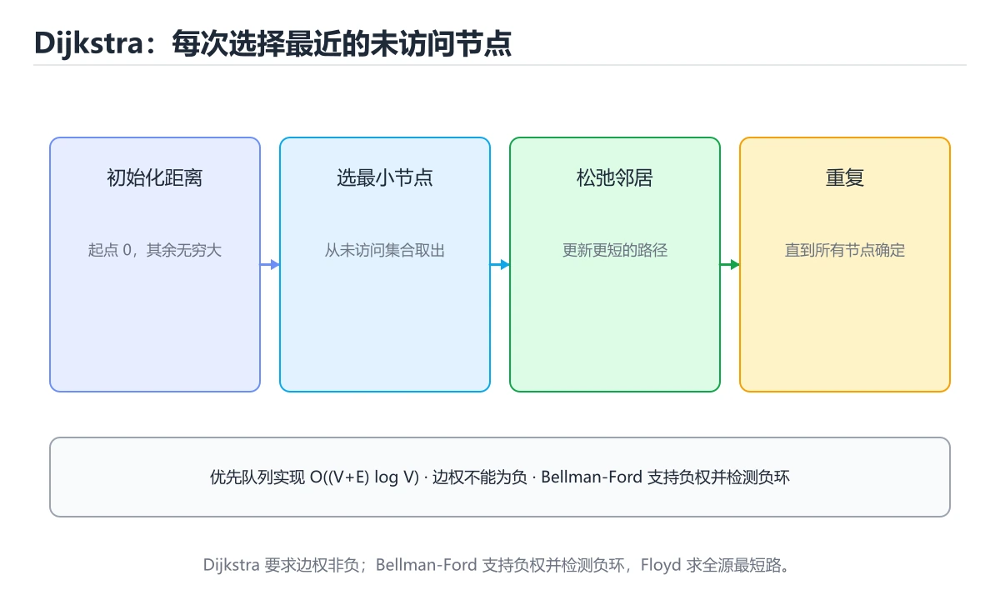
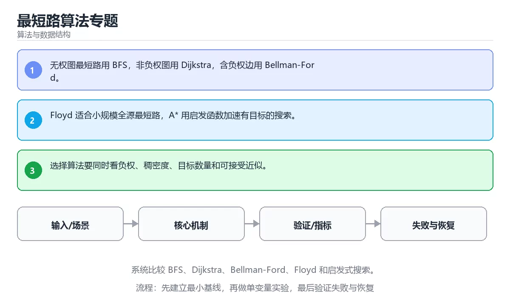

# 最短路算法专题





> 内容更新时间：2026-10-06 · 学习阶段：进阶 · 预计用时：35 分钟

## 学习目标

- 能用自己的话解释：无权图最短路用 BFS，非负权图用 Dijkstra，含负权边用 Bellman-Ford。
- 能用自己的话解释：Floyd 适合小规模全源最短路，A* 用启发函数加速有目标的搜索。
- 能用自己的话解释：选择算法要同时看负权、稠密度、目标数量和可接受近似。
- 能把本课知识放回「算法与数据结构」，并完成练习与测验。

## 前置知识

- 已完成「算法与数据结构」的基础课程，能运行正文中的最小示例。
- 本课关键词：Dijkstra、Bellman-Ford、最短路、A*。
- 遇到不熟悉的术语先记录问题，完成练习后再回读。

## 核心知识

### 1. 无权图最短路用 BFS，非负权图用 Dijkstra，含负权边用 Bellman-Ford。

- 关键做法：先用最小示例建立基线，再逐步加入边界、失败和性能条件。
- 验证标准：结果可复现、错误可解释、边界有测试、失败能恢复。

### 2. Floyd 适合小规模全源最短路，A* 用启发函数加速有目标的搜索。

把这条结论放回「最短路算法专题」的完整流程里展开：

- 正文依据：能用自己的话解释：无权图最短路用 BFS，非负权图用 Dijkstra，含负权边用 Bellman-Ford。
- 落地检查：把「2. Floyd 适合小规模全源最短路，A* 用启发函数加速有目标的搜索。」改写成一条可执行的核对项，逐条验证输入、超时与失败路径。

### 3. 选择算法要同时看负权、稠密度、目标数量和可接受近似。

把这条结论放回「最短路算法专题」的完整流程里展开：

- 正文依据：能用自己的话解释：Floyd 适合小规模全源最短路，A 用启发函数加速有目标的搜索。
- 落地检查：把「3. 选择算法要同时看负权、稠密度、目标数量和可接受近似。」改写成一条可执行的核对项，逐条验证输入、超时与失败路径。

## 关键流程

```text
输入 → 校验 → 核心处理 → 验证 → 记录指标 → 失败恢复
```

## 实践路径

1. 用一句话复述本课要解决的问题。
2. 跑通正文中的最小示例并记录基线。
3. 只改变一个输入或参数，预测并验证结果。
4. 补一个失败路径，记录错误、恢复和指标。
5. 把结论写成可复现的笔记或测试。

## 常见错误与排查

| 误区 | 后果 | 修正 |
| --- | --- | --- |
| 只记术语不做实验 | 遇到真实问题无法判断 | 用最小输入跑通并记录结果 |
| 只测正常路径 | 边界和故障上线才暴露 | 补空值、极值和依赖失败 |
| 没有基线就优化 | 无法证明改进有效 | 先测量再修改 |
| 忽略成本与安全 | 性能和风险失控 | 同时记录资源、权限与失败代价 |
- **关于，下列说法正确的是？**：正确答案是「Floyd 适合小规模全源最短路，A* 用启发函数加速有目标的搜索。
- **关于，下列说法正确的是？**：正确答案是「选择算法要同时看负权、稠密度、目标数量和可接受近似。

## 动手练习

1. 合上教程，用 3～5 句话解释最短路算法专题。
2. 从正文选一个例子，改变一个条件并预测结果。
3. 设计一个失败场景，写出止损与恢复步骤。

**验收标准**：留下输入、命令、输出、差异和下一步问题。

## 本课小结

- 本课属于「算法与数据结构」，核心关键词是 Dijkstra、Bellman-Ford、最短路、A*。
- 先保证正确与可复现，再讨论性能和扩展。
- 完成练习和测验后，把仍然不确定的问题写成下一轮验证清单。

> 本课由 P1 内容扩展生成，重点补充原有课程缺失的主题与工程边界。

## 可运行练习

### 任务 1：先跑通，再解释

```python
def linear_search(items, target):
    for index, item in enumerate(items):
        if item == target:
            return index
    return -1

print(linear_search([3, 5, 8], 8))
```

### 任务 2：只改一个条件

把「最短路算法专题」的最小示例复制一份，只改一个条件再跑一次：

- 改动点：只把Dijkstra的输入换成空值、极值或错误输入，其余保持不变。
- 预测：先写下「最短路算法专题」在改动后的输出或错误信息，再运行。
- 记录：对照改动前后的结果，指出差异出在哪一步。
- 验收：换回原条件能复现原结果，改动只影响Dijkstra。

### 任务 3：迁移到自己的数据

用同一套思路处理一组你自己的数据或场景，保持输出格式与任务 1 一致。

## 故障现场

### 现场 1：本课的 Dijkstra 常规用例通过，但边界用例失败

**症状**：在本课的练习或生产场景里出现“本课的 Dijkstra 常规用例通过，但边界用例失败”。

**复现**：准备一组最小输入，只保留触发“本课的 Dijkstra 常规用例通过，但边界用例失败”的必要条件，连续运行两次确认结果稳定。

**定位**：围绕“Dijkstra 的前置条件与取值边界没有写进代码，默认值掩盖了空值和极值”检查调用链、输入数据和环境配置，先验证假设再改代码。

**预防**：把“本课的 Dijkstra 常规用例通过，但边界用例失败”写成一条自动化用例，并在本课的验收清单里保留对应检查项。

### 现场 2：本课的 Bellman-Ford 结果在两次运行之间不一致

**症状**：在本课的练习或生产场景里出现“本课的 Bellman-Ford 结果在两次运行之间不一致”。

**复现**：准备一组最小输入，只保留触发“本课的 Bellman-Ford 结果在两次运行之间不一致”的必要条件，连续运行两次确认结果稳定。

**定位**：围绕“Bellman-Ford 依赖了当前版本、执行顺序或共享状态，单次运行无法暴露差异”检查调用链、输入数据和环境配置，先验证假设再改代码。

**预防**：把“本课的 Bellman-Ford 结果在两次运行之间不一致”写成一条自动化用例，并在本课的验收清单里保留对应检查项。

### 现场 3：小数据规模结果正确，扩大输入后超时或内存溢出

**定位**：围绕“Dijkstra 的时间或空间复杂度在边界条件下失控，Bellman-Ford 的常数开销也被低估”检查调用链、输入数据和环境配置，先验证假设再改代码。

## 本课复习清单

离开本课前，逐项确认：

- [ ] 不看解析，能说出「关于，下列说法正确的是？」的判断依据。
- [ ] 不看解析，能说出「本课的核心学习目标是什么？」的判断依据。
- [ ] 至少运行一次本课示例，记录输入、输出和一个边界情况。
- [ ] 把本课最容易混淆的两个概念写成一句话对照。

| 复盘项 | 记录 |
| --- | --- |
| 已经能独立解释的考点 |  |
| 仍然说不清的概念 |  |
| 下一步验证动作 |  |

## 复习与自测

下面按正文顺序回顾每一节，并给出一个自检问题；说不清的地方回到原章节补课。

### 核心知识

自检：这一节与相邻主题的边界在哪里？

### 动手练习

自检：如果去掉这一节里的一个前提，结论会怎样变化？

### 验证步骤

制造一次错误输入，记录错误信息与修复方式。

## 术语速查

| 术语 | 一句话说明 |
| --- | --- |
| `Dijkstra` | 围绕“Dijkstra 的时间或空间复杂度在边界条件下失控，Bellman-Ford 的常数开销也被低估”检查调用链、输入数据和环境配置，先验证假设再改代码。 |
| `Bellman-Ford` | 围绕“Dijkstra 的时间或空间复杂度在边界条件下失控，Bellman-Ford 的常数开销也被低估”检查调用链、输入数据和环境配置，先验证假设再改代码。 |
| `最短路` | 本课属于「算法与数据结构」，核心关键词是 Dijkstra、Bellman-Ford、最短路、A。 |
| `A*` | 它在「最短路算法专题」里是理解「A*」的关键术语，用来解释定义、适用条件与失败路径；它与Dijkstra、Bellman-Ford共同决定这一节的判断边界。复习时回到正文示例核对输入、输出和验证方式。 |

## 深度拓展与实战

这一节把正文里的定义、代码和失败模式串成一条可操作的复习路线。

### 机制拆解

- **1. 无权图最短路用 BFS，非负权图用 Dijkstra，含负权边用 Bellman-Ford。**：在「最短路算法专题」里，「1. 无权图最短路用 BFS，非负权图用 Dijkstra，含负权边用 Bellman-Ford。」这一步要先写清输入与预期，再记录实际结果和差异；结果不符时回到对应小节核对前提。
- **2. Floyd 适合小规模全源最短路，A* 用启发函数加速有目标的搜索。**：在「最短路算法专题」里，「2. Floyd 适合小规模全源最短路，A* 用启发函数加速有目标的搜索。」这一步要先写清输入与预期，再记录实际结果和差异；结果不符时回到对应小节核对前提。
- **3. 选择算法要同时看负权、稠密度、目标数量和可接受近似。**：在「最短路算法专题」里，「3. 选择算法要同时看负权、稠密度、目标数量和可接受近似。」这一步要先写清输入与预期，再记录实际结果和差异；结果不符时回到对应小节核对前提。
- **考点 1：关于，下列说法正确的是？**：针对「最短路算法专题」，先自问「关于，下列说法正确的是」；作答后回到对应考点核对判断依据。
- **考点 2：关于，下列说法正确的是？**：针对「最短路算法专题」，先自问「关于，下列说法正确的是」；作答后回到对应考点核对判断依据。

### 边界条件与常见反例

「最短路算法专题」的边界不只包括最大最小值，还要覆盖空、重复和失败：

| 条件 | 常见反例 | 处理方式 |
| --- | --- | --- |
| 空输入 | Dijkstra 没有任何取值 | 先判空，给出明确错误而不是继续执行 |
| 边界值 | Bellman-Ford 取最小或最大 | 用最小值、最大值和越界值各跑一次 |
| 重复执行 | 同一输入被执行两次 | 保证结果可重复，必要时加锁或去重 |
| 失败路径 | Dijkstra 相关步骤报错 | 保留原始错误，确认回滚或重试行为 |

### 工程检查表

- [ ] 能否用自己的话说明最短路算法专题解决什么问题，以及它不负责什么？
- [ ] 能否指出最小可运行示例的输入、输出和一条失败路径？
- [ ] 能否解释本课关键词在真实项目中的边界与取舍？
- [ ] 能否把本课方法迁移到另一个相近问题，并说明需要改什么？

### 迁移练习

1. 保持正文示例不变，写出它的输入、处理步骤和预期输出。
2. 只改变一个条件，预测结果并说明依据；再运行或手算验证。
3. 结合Dijkstra、Bellman-Ford、最短路、A*，写出一个真实项目中的使用场景。
4. 写下一个反例，说明它在什么条件下会使朴素做法失效。

## 考点精讲

### 考点 1：概念判断·Dijkstra

- **题目**：关于「无权图最短路用 BFS，非负权图用 Dijkstra」，下列说法正确的是？
- **判断依据**：在「最短路算法专题」里，无权图最短路用 BFS，非负权图用 Dijkstra。「最短路算法专题」要求先交代Dijkstra、Bellman-Ford、最短路的前提再下结论，所以“无权图最短路用 BFS”只在题干“无权图最短路用 BFS”给定的条件下成立。把“无权图最短路用 BFS”代回「最短路算法专题」里“无权图最短路用 BFS”的例子核对，条件一旦改变，结论就要用Dijkstra、Bellman-Ford、最短路重新推导。

### 考点 2：代码补全·Dijkstra

- **题目**：这段 Python 代码是「最短路算法专题」的示例片段，下面哪一项描述与它一致？
- **判断依据**：题干的正确项是这段代码会产生可观察的输出，运行后能看到结果，在「最短路算法专题」里要结合Dijkstra核对输出是否符合预期。这段代码出自「最短路算法专题」的正文示例，围绕Dijkstra、Bellman-Ford、最短路展开；把输入或边界换成空值、极值或失败情况后，结论要以「最短路算法专题」的实际运行结果为准。“Python”与「最短路算法专题」的术语表相呼应，只有符合Dijkstra、Bellman-Ford、最短路约束的“这段代码会产生可观察的输出”才是正文支持的结论。

### 考点 3：概念判断·Dijkstra

- **题目**：关于「选择算法要同时看负权、稠密度、目标数量和可接受近似。」，下列说法正确的是？
- **判断依据**：在「最短路算法专题」里，选择算法要同时看负权、稠密度、目标数量和可接受近似。在「最短路算法专题」里，如果只凭关键词作答，很容易把关键路径计算最长依赖链，决定项目最短完成时间。在「最短路算法专题」里判断这道题，要把Dijkstra、Bellman-Ford、最短路的条件、过程与失败路径逐项对齐，换成“关于选择算法要同时看负权、稠密度、目”这个场景，只有满足前提的结论才成立。

### 考点 4：概念判断·Dijkstra

- **题目**：「最短路算法专题」的核心学习目标是什么？
- **判断依据**：在「最短路算法专题」里，这道题要求区分概念与边界，系统比较 BFS，Dijkstra，Bellman-Ford只有在题干给出的前提下才成立，而掌握 Kruskal、Prim、并查集和割边性质。在「最短路算法专题」里判断这道题，要把Dijkstra、Bellman-Ford、最短路的条件、过程与失败路径逐项对齐，换成“最短路算法专题的核心学习目标是什么”这个场景，只有满足前提的结论才成立。

### 考点 5：多选辨析·Dijkstra

- **题目**：以下哪些术语与「最短路算法专题」直接相关？（多选）
- **判断依据**：在「最短路算法专题」里，Bellman-Ford。在「最短路算法专题」里判断这道题，要把Dijkstra、Bellman-Ford、最短路的条件、过程与失败路径逐项对齐，换成“以下哪些术语与最短路算法专题直接相关”这个场景，只有满足前提的结论才成立。在「最短路算法专题」里，判断这道题时，要把Dijkstra、Bellman-Ford、最短路的条件、过程与失败路径逐项对齐，换成“以下哪些术语与直接相关（多选）”这个场景，只有满足前提的结论才成立。

### 考点 6：顺序排列·Dijkstra

- **题目**：按照「最短路算法专题」从概念到实践的讲解顺序排列下列主题。
- **判断依据**：结合Dijkstra、Bellman-Ford来看，正确的执行顺序是「核心知识 → 关键流程 → 实践路径 → 常见误区」。本课围绕系统比较 BFS、Dijkstra、Bellman-Ford、Floyd 和启发式搜索。「最短路算法专题」要求先交代Dijkstra、Bellman-Ford、最短路的前提再下结论，所以“核心知识”只在题干“按照最短路算法专题从概念到实践的讲解顺序排列下列主题”给定的条件下成立。

## English Overview

**Title:** Shortest Path Algorithms

**Summary:** Compare BFS, Dijkstra, Bellman-Ford, Floyd and heuristic search.

**Category:** Algorithms
**Level:** 高级
**Key terms:** Dijkstra, Bellman-Ford, 最短路, A*

## 内容元数据

- 内容版本：v2.0
- 最后更新：2026-10-06
- 学习阶段：进阶
- 适用环境：任意主流语言（伪代码与复杂度为主）
- 内容来源：内置结构化课程与工程实践整理
- 相关主题：Dijkstra、Bellman-Ford、最短路、A*
- 质量版本：P0 测验标准 + P1 覆盖扩展 + P2 体验补全

## 最小可运行示例

下面示例用于验证本课的最小输入、处理和输出。先原样运行，再只修改一个值：

```python
def linear_search(items, target):
    for index, item in enumerate(items):
        if item == target:
            return index
    return -1

print(linear_search([3, 5, 8], 8))
```

## 预期输出

```text
2
```

## 验证步骤

1. 记录运行环境、命令和真实输出。
2. 修改一个输入，先写预测再运行。
4. 把结论写回本课笔记或测试用例。

## 参考资料与复核

- 最后复核：2026-10-04
- 下次复核：2027-04-04
- 复核范围：版本兼容、API 行为、安全建议与工程实践
- 来源性质：官方文档、标准或权威教材；正文为离线教学重组

| 参考资料 | 本课用途 |
| --- | --- |
| [LeetCode 学习](https://leetcode.com/explore/) | 算法题训练与模式 |
| [MIT 6.006](https://ocw.mit.edu/courses/6-006-introduction-to-algorithms-spring-2020/) | 算法设计与分析 |
| [RFC 算法与协议](https://www.rfc-editor.org/) | 协议中的算法约束 |

> 「最短路算法专题」的链接用于离线阅读后的延伸核对；App 不会自动联网。

## 复习与迁移

复习目标：把「最短路算法专题」的判断标准放回可复现的例子里。先自己作答，再对照依据；如果结论正确但理由不完整，回到正文补足前提。

### 概念复述

- 用一句话说明「最短路算法专题」解决什么问题：系统比较 BFS、Dijkstra、Bellman-Ford、Floyd 和启发式搜索。
- 写出Dijkstra、Bellman-Ford、最短路之间的关系，并各举一个例子。
- 说出本课最容易混淆的两个概念，以及区分它们的判据。

### 测验回顾

1. 关于「无权图最短路用 BFS，非负权图用 Dijkstra」，下列说法正确的是？
   - 依据：在「最短路算法专题」里，无权图最短路用 BFS，非负权图用 Dijkstra。「最短路算法专题」要求先交代Dijkstra、Bellman-Ford、最短路的前提再下结论，所以“无权图最短路用 BFS”只在题干“无权图最短路用 BFS”给定的条件下成立。把“无权图最短路用 BFS”代回「最短路算法专题」里“无权图最短路用 BFS”的例子核对，条件一旦改变，结论就要用Dijkstra、Bellman-Ford、最短路重新推导。
2. 这段 Python 代码是「最短路算法专题」的示例片段，下面哪一项描述与它一致？
   - 依据：题干的正确项是这段代码会产生可观察的输出，运行后能看到结果，在「最短路算法专题」里要结合Dijkstra核对输出是否符合预期。这段代码出自「最短路算法专题」的正文示例，围绕Dijkstra、Bellman-Ford、最短路展开；把输入或边界换成空值、极值或失败情况后，结论要以「最短路算法专题」的实际运行结果为准。“Python”与「最短路算法专题」的术语表相呼应，只有符合Dijkstra、Bellman-Ford、最短路约束的“这段代码会产生可观察的输出”才是正文支持的结论。
3. 关于「选择算法要同时看负权、稠密度、目标数量和可接受近似。」，下列说法正确的是？
   - 依据：在「最短路算法专题」里，选择算法要同时看负权、稠密度、目标数量和可接受近似。在「最短路算法专题」里，如果只凭关键词作答，很容易把关键路径计算最长依赖链，决定项目最短完成时间。在「最短路算法专题」里判断这道题，要把Dijkstra、Bellman-Ford、最短路的条件、过程与失败路径逐项对齐，换成“关于选择算法要同时看负权、稠密度、目”这个场景，只有满足前提的结论才成立。
4. 「最短路算法专题」的核心学习目标是什么？
   - 依据：在「最短路算法专题」里，这道题要求区分概念与边界，系统比较 BFS，Dijkstra，Bellman-Ford只有在题干给出的前提下才成立，而掌握 Kruskal、Prim、并查集和割边性质。在「最短路算法专题」里判断这道题，要把Dijkstra、Bellman-Ford、最短路的条件、过程与失败路径逐项对齐，换成“最短路算法专题的核心学习目标是什么”这个场景，只有满足前提的结论才成立。
5. 以下哪些术语与「最短路算法专题」直接相关？（多选）
   - 依据：在「最短路算法专题」里，Bellman-Ford。在「最短路算法专题」里判断这道题，要把Dijkstra、Bellman-Ford、最短路的条件、过程与失败路径逐项对齐，换成“以下哪些术语与最短路算法专题直接相关”这个场景，只有满足前提的结论才成立。在「最短路算法专题」里，判断这道题时，要把Dijkstra、Bellman-Ford、最短路的条件、过程与失败路径逐项对齐，换成“以下哪些术语与直接相关（多选）”这个场景，只有满足前提的结论才成立。
6. 按照「最短路算法专题」从概念到实践的讲解顺序排列下列主题。
   - 依据：结合Dijkstra、Bellman-Ford来看，正确的执行顺序是「核心知识 → 关键流程 → 实践路径 → 常见误区」。本课围绕系统比较 BFS、Dijkstra、Bellman-Ford、Floyd 和启发式搜索。「最短路算法专题」要求先交代Dijkstra、Bellman-Ford、最短路的前提再下结论，所以“核心知识”只在题干“按照最短路算法专题从概念到实践的讲解顺序排列下列主题”给定的条件下成立。

### 迁移练习

把「最短路算法专题」的结论迁移到相邻主题，每次迁移都写清预测与证据：

1. 换输入：用Dijkstra处理一组你自己的数据，对比教材示例的结果差异。
2. 换失败条件：制造一个Bellman-Ford相关的错误，说明如何从错误信息定位根因。
3. 换规模：把数据量或并发度提高一个数量级，说明「最短路算法专题」的结论是否仍成立。

## 工程化精练：决策、失败与验证

这一章把「最短路算法专题」从“看懂”推进到“能判断、能验证、能排错”。所有判断都围绕Dijkstra、Bellman-Ford与最短路展开，并与前文的示例、测验和失败现场互相对照。

### 一、Dijkstra 的判断算法

| 步骤 | 要回答的问题 | 判断依据 | 记录什么 |
| --- | --- | --- | --- |
| 1. 定目标 | 「最短路算法专题」这一步要解决什么问题？ | 把Dijkstra的目标写成一句可验证的结论 | 输入、约束、成功标准 |
| 2. 找边界 | Bellman-Ford在什么条件下失效？ | 先列空值、极值、重复和失败路径 | 反例与触发条件 |
| 3. 跑基线 | 原始示例的真实输出是什么？ | 命令、版本和环境必须可复现 | 命令、输出、耗时 |
| 4. 只改一处 | 把最短路换成另一种取值会怎样？ | 预测写在运行之前 | 预测与实际的差异 |
| 5. 回写结论 | 结论能否被他人复现？ | 把判断写成清单或测试 | 结论、证据、遗留问题 |

这张表的用法不是从上到下浏览，而是每次只填一行：先用「最短路算法专题」前文的示例验证第 3 行，再故意破坏一个条件验证第 2 行。当你能在不看解析的情况下说出Dijkstra的判断依据，才算真正掌握本课。

- 先从Dijkstra入手：把它写成“输入是什么、输出是什么、哪一步最容易出错”。如果这三句话中有一句说不清，说明对「最短路算法专题」的理解还停留在术语层面，需要回到正文的最小示例重新观察一次。

- 再把Bellman-Ford当成对照实验的变量：固定其他条件，只改变它的取值，记录输出是否变化。结论“变”或“不变”都要写出理由，并说明这个理由能否被他人独立复现。

- 针对最短路做一次失败演练：故意给出空值、极值或错误类型，观察「最短路算法专题」的报错位置和处理方式。错误信息只是入口，真正要定位的是哪一层假设被破坏。

- 把「最短路算法专题」的结论压缩成一条可执行清单：先检查输入，再检查版本与环境，然后跑最小用例，最后才扩大规模。顺序颠倒会让排错范围成倍增加。

- 如果结论依赖时间或规模，就把数据量提高一个数量级再跑一次。在「最短路算法专题」里，小样本成立不代表大样本成立，复杂度、资源占用和失败率都要重新记录。

- 如果结论依赖并发或共享状态，就固定输入并连续运行多次。结果不一致时，优先怀疑「最短路算法专题」中Dijkstra相关步骤的隐藏状态，而不是先改代码。

- 把「最短路算法专题」的判断写成测试：一个正常用例、一个边界用例、一个失败用例。测试通过只是起点，还要确认失败用例确实以预期方式失败。

- 把本课与相邻主题连起来：Dijkstra解决的是“怎么做”，Bellman-Ford回答“什么时候不适用”。两者都答得出来，迁移才算完成。

> 第 2 轮复核「最短路算法专题」：把上面的结论逐条改写为可验证的问题，并记录仍不确定的部分。

- 先从Dijkstra入手：把它写成“输入是什么、输出是什么、哪一步最容易出错”。如果这三句话中有一句说不清，说明对「最短路算法专题」的理解还停留在术语层面，需要回到正文的最小示例重新观察一次。

- 再把Bellman-Ford当成对照实验的变量：固定其他条件，只改变它的取值，记录输出是否变化。结论“变”或“不变”都要写出理由，并说明这个理由能否被他人独立复现。

- 针对最短路做一次失败演练：故意给出空值、极值或错误类型，观察「最短路算法专题」的报错位置和处理方式。错误信息只是入口，真正要定位的是哪一层假设被破坏。

- 把「最短路算法专题」的结论压缩成一条可执行清单：先检查输入，再检查版本与环境，然后跑最小用例，最后才扩大规模。顺序颠倒会让排错范围成倍增加。

### 二、最短路算法专题 的机制拆解与自测

把本课考点还原成可回答的问题，再逐题写出依据：

**问题 1**：关于「无权图最短路用 BFS，非负权图用 Dijkstra」，下列说法正确的是？

- 关联术语：Dijkstra
- 判断依据：无权图最短路用 BFS，非负权图用 Dijkstra
- 追问：如果把Dijkstra的条件换成边界值，这个结论是否仍然成立？

**问题 2**：这段 Python 代码是「最短路算法专题」的示例片段，下面哪一项描述与它一致？

- 关联术语：Bellman-Ford
- 判断依据：回到「最短路算法专题」正文对应小节，先用最小示例验证再下结论。
- 追问：如果把Bellman-Ford的条件换成边界值，这个结论是否仍然成立？

**问题 3**：关于「选择算法要同时看负权、稠密度、目标数量和可接受近似。」，下列说法正确的是？

- 关联术语：最短路
- 判断依据：选择算法要同时看负权、稠密度、目标数量和可接受近似。
- 追问：如果把最短路的条件换成边界值，这个结论是否仍然成立？

**问题 4**：「最短路算法专题」的核心学习目标是什么？

- 关联术语：A*
- 判断依据：系统比较 BFS，Dijkstra，Bellman-Ford
- 追问：如果把A*的条件换成边界值，这个结论是否仍然成立？

**问题 5**：以下哪些术语与「最短路算法专题」直接相关？（多选）

- 关联术语：Dijkstra
- 判断依据：Dijkstra
- 追问：如果把Dijkstra的条件换成边界值，这个结论是否仍然成立？

**问题 6**：按照「最短路算法专题」从概念到实践的讲解顺序排列下列主题。

- 关联术语：Bellman-Ford
- 判断依据：回到「最短路算法专题」正文对应小节，先用最小示例验证再下结论。
- 追问：如果把Bellman-Ford的条件换成边界值，这个结论是否仍然成立？

### 三、失败模式与修复顺序

| 失败信号 | 常见根因 | 先做什么 | 修复后如何确认 |
| --- | --- | --- | --- |
| 「最短路算法专题」中 Dijkstra 相关步骤报错 | 输入、版本或前置条件与示例不一致 | 保留第一条错误信息，回到最小输入 | 用无权图最短路用 BFS，非负权图用 Dijkstra复跑，确认输出可复现 |
| 「最短路算法专题」中 Bellman-Ford 相关步骤报错 | 输入、版本或前置条件与示例不一致 | 保留第一条错误信息，回到最小输入 | 用选择算法要同时看负权、稠密度、目标数量和可接受近似。复跑，确认输出可复现 |
| 「最短路算法专题」中 最短路 相关步骤报错 | 输入、版本或前置条件与示例不一致 | 保留第一条错误信息，回到最小输入 | 用系统比较 BFS，Dijkstra，Bellman-Ford复跑，确认输出可复现 |
| 结果在两次运行之间不一致 | 隐藏状态、并发或环境差异 | 固定版本与输入，记录随机因素 | 连续运行三次得到同一结论 |
| 单次结果正确但规模一大就失效 | 只测了正常路径，没有覆盖边界 | 把数据量或并发度提高一个数量级 | 记录边界值、耗时与失败率 |

排错顺序固定为：先复现，再缩小输入，然后只改一个条件，最后把结论写成回归用例。对「最短路算法专题」来说，任何不能复现的“修好了”都不算完成。

### 四、离开本课前的验证清单

| 检查项 | 通过标准 | 证据 |
| --- | --- | --- |
| 能复述 | 用三句话说明「最短路算法专题」解决什么问题、边界在哪 | 不看解析写出的结论 |
| 能运行 | 最小示例在本机跑通 | 命令、输出与版本 |
| 能改条件 | 只改一个输入并解释差异 | 预测与实际的对照 |
| 能排错 | 至少制造并修复一个失败 | 错误信息与修复步骤 |
| 能迁移 | 把Dijkstra、Bellman-Ford、最短路、A*用到新场景 | 一个自选练习的结论 |

完成标准：能不看解析说清「最短路算法专题」全部自测题的依据，并且至少有一条Dijkstra相关的结论经过真实运行验证。如果某一步只停留在“感觉懂了”，就把它写成下一轮针对「最短路算法专题」的最小验证任务。

### 五、把结论写成可检查的证据

学习「最短路算法专题」时，最容易出现的情况是“听过、看懂了，但换一个输入就说不清”。下面把Dijkstra与Bellman-Ford放进一条可检查的证据链：每一句结论都要能回答“从哪里来、在什么条件下成立、失败时怎么发现”。

| 证据类型 | 本课要求 | 不合格的表现 |
| --- | --- | --- |
| 概念证据 | 用一句话说明Dijkstra的定义与适用场景 | 只背术语，说不出它解决什么问题 |
| 运行证据 | 能复现「最短路算法专题」的最小示例 | 输出与记录对不上，或换机器就不一致 |
| 对照证据 | 只改一个条件，说明差异来自哪里 | 一次改多个变量，无法归因 |
| 失败证据 | 故意制造错误并记录恢复步骤 | 只测正常路径，失败时靠猜 |
| 迁移证据 | 把Bellman-Ford用到自选场景 | 换一个例子就完全套不上 |

举例：无权图最短路用 BFS，非负权图用 Dijkstra。把这个结论代回「最短路算法专题」的正文，找出它对应的输入、处理步骤与输出；再换掉其中一个条件，观察结论是否仍然成立。能完成这一步，才说明这条知识已经从“记忆”变成“可用的判断”。

最后留一个自检问题：如果只能保留三条笔记，你会写下哪三句？把答案限定为「最短路算法专题」中的可验证结论，并给每条结论配一个反例。这三句加上对应反例，就是本课最值得带入后续课程的复习材料。
