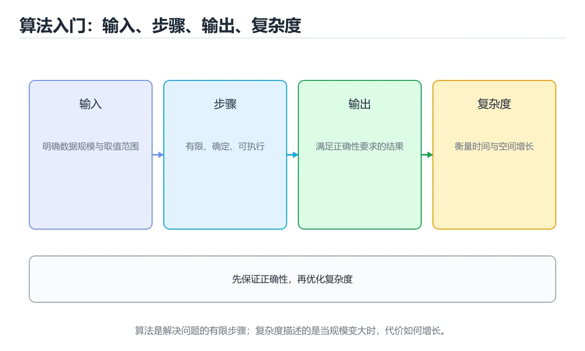
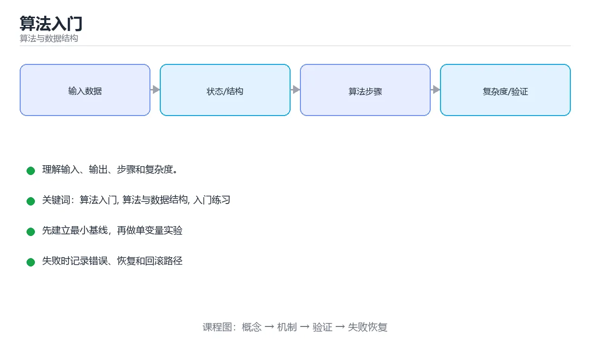

# 算法入门





> 内容更新时间：2026-10-03 · 学习阶段：入门 · 预计用时：15 分钟

## 学习目标

- 先认识「算法入门」需要的工具、输入和输出。
- 按步骤运行最小示例，并记录结果与错误。
- 用一个边界输入验证自己是否真正掌握。

## 前置知识

- 会进行基本的文件或命令行操作。
- 不需要预先掌握「算法与数据结构」的高级知识。

## 一句话入门

理解输入、输出、步骤和复杂度。

## 最小示例

```python
def find_max(values):
    best = values[0]
    for value in values[1:]:
        if value > best:
            best = value
    return best

print(find_max([3, -1, 7, 2]))
```

## 预期输出

```text
7
```

## 常见错误

- 输入或环境与示例不一致，导致结果不符合预期。
- 复制命令时遗漏空格、引号或必要参数。

## 动手练习

1. 原样运行最小示例，保存命令和输出。
2. 把数字 2 改成 10，预测并验证新结果。
3. 制造一个错误输入，写出错误信息和修复方法。

## 本课小结

- 入门阶段先保证能运行、能观察、能解释，再追求复杂功能。
- 每次只改一个变量，记录预测与实际结果。
- 遇到错误先看第一条错误信息，再回到最小示例。


## 算法究竟是什么

算法不是某一段代码，而是“把合法输入转换成期望输出的一组有限、明确、可执行的步骤”。判断一个算法是否成立，至少要同时回答四个问题：输入集合是什么、输出必须满足什么性质、每一步是否没有歧义、执行是否一定在有限步内结束。比如“求一组整数中的最大值”，输入可以是空列表、单元素列表或包含负数的列表；输出必须同时给出最大值和它的位置，才能覆盖重复元素的场景。

同一个问题可以有多个算法。求最大值既可以逐个比较，也可以先排序再取末尾元素。两者都能得到正确答案，但排序做了大量不必要的工作，复杂度从 O(n) 变成 O(n log n)。这说明“正确”和“高效”是两个独立维度：先证明答案正确，再讨论资源消耗，最后才谈代码是否优雅。工程中还要考虑输入规模、内存上限、数据是否已经排序、是否允许修改原数据，这些约束会直接改变算法选择。

验证算法不能只跑一个正常样例。至少要覆盖空输入、单元素、重复值、极值、已经有序和完全逆序等情况；对每个样例先写出预期结果，再运行代码对照。随机测试可以发现手写边界遗漏，但随机不能替代边界测试，因为极端输入出现的概率往往很低。

## 从问题到程序

可靠的解题顺序是：先用自己的话复述输入、输出和约束；再写出 3 个左右的具体样例，其中一个必须是边界样例；然后用伪代码描述步骤，而不是一开始就纠结语法；接着把伪代码翻译成最小可运行版本；最后分析时间与空间复杂度，并补充失败路径。

复杂度描述的是输入规模增大时资源如何增长，不是某台机器上的绝对秒数。O(1) 表示操作次数不随规模变化，O(log n) 表示每一步能排除固定比例的数据，O(n) 表示至少要看一遍输入，O(n²) 表示常见的双重循环。递归算法还可能要计算递归深度带来的栈空间。写复杂度时要说清 n 指什么，例如节点数、边数还是查询次数。

练习时可以采用“三行记录法”：第一行写预测，第二行写实际输出，第三行写差异和原因。只要实际结果与预测不一致，就不要急着改代码，先确认是输入理解错了、步骤设计错了，还是实现细节错了。这种习惯能让你从“碰巧跑通”过渡到“知道为什么正确”。

## 代码实验：把示例跑成证据

这一节不引入新语法，而是把「算法入门」的最小示例变成可以复现、可以对照的实验。每次只改变一个条件，先写预测，再运行，最后解释差异。

### 实验一：建立基线

```python
def find_max(values):
    best = values[0]
    for value in values[1:]:
        if value > best:
            best = value
    return best

print(find_max([3, -1, 7, 2]))
```

先原样运行上面的代码，记录命令、完整输出和退出状态。然后把输出与正文的预期输出逐字对照，不要用“看起来差不多”代替核对；空格、大小写、换行和错误流向都可能暴露环境差异。

### 实验二：只改一个输入

从代码中选一个会影响结果的字面量、参数或输入，把它替换成边界值：数值可尝试 0、1、最大值和最小值，字符串可尝试空串和超长文本，集合可尝试空集合、单元素和重复元素。先写出预测，再运行并记录实际结果。

### 实验三：制造一个可控错误

把复合语句末尾的冒号删掉，或者把字符串直接参与数值运算。先记录解释器报出的第一行错误和行号，再修复并重跑基线。

| 实验 | 改动 | 预测 | 实际 | 结论 |
| --- | --- | --- | --- | --- |
| 基线 | 保持原样 |  |  |  |
| 边界 |  |  |  |  |
| 失败 |  |  |  |  |

### 实验四：用三句话复述

1. 输入是什么，哪些输入属于合法范围，哪些属于边界或非法范围？
2. 程序按什么顺序处理输入，在哪一步产生了状态变化或副作用？
3. 输出如何验证，失败时第一条可观察证据是什么？

## 考点精讲：把测验题还原成判断过程

本课有 4 个判断点。先自己作答，再看「判断依据」；如果结论正确但理由不完整，回到正文对应章节补足概念。

### 考点 1：描述一个算法时，必须明确的基本要素是？

- **正确判断**：输入、输出、清晰的步骤以及终止条件
- **判断依据**：正确答案是「输入、输出、清晰的步骤以及终止条件」，本课在「算法究竟是什么」中说明：判断一个算法是否成立，至少要同时回答四个问题：输入集合是什么、输出必须满足什么性质、每一步是否没有歧义、执行是否一定在有限步内结束。算法是对计算过程的精确描述，必须说明接受什么输入、产生什么输出、按什么步骤执行、在什么条件下结束。本课还在「算法究竟是什么」中说明：算法不是某一段代码，而是“把合法输入转换成期望输出的一组有限、明确、可执行的步骤”。
- **迁移检查**：把题干里的一个条件换成边界值，原来的结论还成立吗？写出判断过程。

### 考点 2：一个算法的时间复杂度为 O(n) 通常意味着什么？

- **正确判断**：执行步数随输入规模近似线性增长
- **判断依据**：正确答案是「执行步数随输入规模近似线性增长」，本课在「从问题到程序」中说明：复杂度描述的是输入规模增大时资源如何增长，不是某台机器上的绝对秒数。O(n) 表示当输入规模 n 增大时，运行时间或步数的增长量级与 n 成正比。本课还在「算法究竟是什么」中说明：工程中还要考虑输入规模、内存上限、数据是否已经排序、是否允许修改原数据，这些约束会直接改变算法选择。本课还在「算法究竟是什么」中说明：判断一个算法是否成立，至少要同时回答四个问题：输入集合是什么、输出必须满足什么性质、每一步是否没有歧义、执行是否一定在有限步内结束。
- **迁移检查**：如果给某个错误选项去掉一个限定词，它会不会变成正确？说明理由。

### 考点 3：把「理解问题、设计步骤、实现、验证边界」排序，正确的顺序是？

- **正确判断**：先理解问题与输入输出，再设计步骤并实现
- **判断依据**：正确答案是「先理解问题与输入输出，再设计步骤并实现」，本课在「从问题到程序」中说明：可靠的解题顺序是：先用自己的话复述输入、输出和约束。可靠的流程是先明确问题与输入输出，再设计可验证的步骤并实现，最后用正常值、边界值与极端值验证。本课还在「从问题到程序」中说明：只要实际结果与预测不一致，就不要急着改代码，先确认是输入理解错了、步骤设计错了，还是实现细节错了。本课还在「算法究竟是什么」中说明：对每个样例先写出预期结果，再运行代码对照。
- **迁移检查**：把题干里的一个条件换成边界值，原来的结论还成立吗？写出判断过程。

### 考点 4：把解决一个新算法问题的可靠步骤调整为正确顺序。

- **正确判断**：1. 明确输入、输出与约束 → 2. 写出步骤或伪代码 → 3. 运行并验证边界情况 → 4. 分析复杂度并继续改进
- **判断依据**：正确答案是「明确输入、输出与约束 → 写出步骤或伪代码 → 运行并验证边界情况 → 分析复杂度并继续改进」，本课在「从问题到程序」中说明：然后用伪代码描述步骤，而不是一开始就纠结语法。解决算法问题时先要把输入、输出、数据规模和限制条件说清楚，否则很容易写出方向错误或复杂度不可接受的方案。本课还在「算法究竟是什么」中说明：算法不是某一段代码，而是“把合法输入转换成期望输出的一组有限、明确、可执行的步骤”。
- **迁移检查**：把每一步的输入与输出写出来，确认上下文确实衔接。

### 补充考点 1：阅读「算法入门」的代码片段，下面哪项判断是正确的？

- **正确判断**：输入、输出、清晰的步骤以及终止条件
- **判断依据**：正确答案是「输入、输出、清晰的步骤以及终止条件」。这段代码来自「算法入门」的示例，判断时先看输入与输出，再检查条件、循环和边界。正确答案是「输入、输出、清晰的步骤以及终止条件」，本课在「深度追问与自测」中说明：先写下判断，再对照：输入、输出、清晰的步骤以及终止条件。算法是对计算过程的精确描述，必须说明接受什么输入、产生什么输出…在「算法入门」中，如果只改一个条件，输出通常会随之改变，因此不能脱离代码前提作答。

## 本课复习清单

离开本课前，逐项确认：

- [ ] 不看解析，能说出「描述一个算法时，必须明确的基本要素是？」的判断依据。
- [ ] 不看解析，能说出「一个算法的时间复杂度为 O(n) 通常意味着什么？」的判断依据。
- [ ] 不看解析，能说出「把「理解问题、设计步骤、实现、验证边界」排序，正确的顺序是？」的判断依据。
- [ ] 不看解析，能说出「把解决一个新算法问题的可靠步骤调整为正确顺序。」的判断依据。
- [ ] 至少运行一次本课示例，记录输入、输出和一个边界情况。
- [ ] 把本课最容易混淆的两个概念写成一句话对照。

| 复盘项 | 记录 |
| --- | --- |
| 已经能独立解释的考点 |  |
| 仍然说不清的概念 |  |
| 下一步验证动作 |  |

## 逐节复习与自检

下面按正文顺序回顾每一节，并给出一个自检问题；说不清的地方回到原章节补课。

### 最小示例

```python
def find_max(values):
    best = values[0]
    for value in values[1:]:
        if value > best:
            best = value
    return best

print(find_max([3, -1, 7, 2]))
```

自检：这一节与相邻主题的边界在哪里？

### 预期输出

```text
7
```

自检：这一节与相邻主题的边界在哪里？

### 常见错误

输入或环境与示例不一致，导致结果不符合预期。

自检：把这一节讲给没学过的人，最需要强调哪一点？

### 动手练习

把数字 2 改成 10，预测并验证新结果。制造一个错误输入，写出错误信息和修复方法。

自检：如果去掉这一节里的一个前提，结论会怎样变化？

### 算法究竟是什么

算法不是某一段代码，而是“把合法输入转换成期望输出的一组有限、明确、可执行的步骤”。判断一个算法是否成立，至少要同时回答四个问题：输入集合是什么、输出必须满足什么性质、每一步是否没有歧义、执行是否一定在有限步内结束。

自检：这一节与相邻主题的边界在哪里？

### 从问题到程序

可靠的解题顺序是：先用自己的话复述输入、输出和约束；再写出 3 个左右的具体样例，其中一个必须是边界样例；然后用伪代码描述步骤，而不是一开始就纠结语法；接着把伪代码翻译成最小可运行版本；最后分析时间与空间复杂度，并补充失败路径。复杂度描述的是输入规模增大时资源如何增长，不是某台机器上的绝对秒数。

自检：这一节最常见的失败方式是什么？第一条可观察证据是什么？

## 深度追问与自测

下面把本课考点换一个角度再问一遍。先合上上一节，写出自己的判断，再对照答案与检查点补全理由。

### 追问 1：描述一个算法时，必须明确的基本要素是？

- 先写下判断，再对照：输入、输出、清晰的步骤以及终止条件
- 检查点：如果输入换成边界值，这个结论还需要补充哪个前提？

### 追问 2：一个算法的时间复杂度为 O(n) 通常意味着什么？

- 先写下判断，再对照：执行步数随输入规模近似线性增长
- 检查点：如果输入换成边界值，这个结论还需要补充哪个前提？

### 追问 3：把「理解问题、设计步骤、实现、验证边界」排序，正确的顺序是？

- 先写下判断，再对照：先理解问题与输入输出，再设计步骤并实现
- 检查点：如果输入换成边界值，这个结论还需要补充哪个前提？

## 术语速查

把本课反复出现的术语集中放在一起。复习时先遮住右列，尝试用自己的话解释，再回到正文核对。

| 术语 | 本课语境 |
| --- | --- |
| `算法入门` | 本课围绕该主题展开，结合正文与代码示例理解它的适用边界。 |
| `算法与数据结构` | 本课围绕该主题展开，结合正文与代码示例理解它的适用边界。 |
| `入门练习` | 本课围绕该主题展开，结合正文与代码示例理解它的适用边界。 |

## 面试问答与自测

下面把本课考点换成面试追问。先口述自己的答案，
再对照参考回答检查是否遗漏了前提、边界或失败路径。

### 追问 1：描述一个算法时，必须明确的基本要素是？

**参考回答**：正确答案是「输入、输出、清晰的步骤以及终止条件」，本课在「深度追问与自测」中说明：先写下判断，再对照：输入、输出、清晰的步骤以及终止条件。算法是对计算过程的精确描述，必须说明接受什么输入、产生什么输出、按什么步骤执行、在什么条件下结束。本课还在「算法究竟是什么」中说明：判断一个算法是否成立，至少要同时回答四个问题：输入集合是什么、输出必须满足什么性质、每一步是否没有歧义、执行是否一定在有限步内结束。

### 追问 2：一个算法的时间复杂度为 O(n) 通常意味着什么？

**参考回答**：正确答案是「执行步数随输入规模近似线性增长」，本课在「深度追问与自测」中说明：先写下判断，再对照：执行步数随输入规模近似线性增长。O(n) 表示当输入规模 n 增大时，运行时间或步数的增长量级与 n 成正比。本课还在「从问题到程序」中说明：复杂度描述的是输入规模增大时资源如何增长，不是某台机器上的绝对秒数。本课还在「算法究竟是什么」中说明：工程中还要考虑输入规模、内存上限、数据是否已经排序、是否允许修改原数据，这些约束会直接改变算法选择。

### 追问 3：把「理解问题、设计步骤、实现、验证边界」排序，正确的顺序是？

**参考回答**：正确答案是「先理解问题与输入输出，再设计步骤并实现」，本课在「深度追问与自测」中说明：先写下判断，再对照：先理解问题与输入输出，再设计步骤并实现。可靠的流程是先明确问题与输入输出，再设计可验证的步骤并实现，最后用正常值、边界值与极端值验证。本课还在「从问题到程序」中说明：可靠的解题顺序是：先用自己的话复述输入、输出和约束。本课还在「算法究竟是什么」中说明：算法不是某一段代码，而是“把合法输入转换成期望输出的一组有限、明确、可执行的步骤”。

### 追问 4：把解决一个新算法问题的可靠步骤调整为正确顺序。

**参考回答**：正确答案是「明确输入、输出与约束 → 写出步骤或伪代码 → 运行并验证边界情况 → 分析复杂度并继续改进」，本课在「从问题到程序」中说明：然后用伪代码描述步骤，而不是一开始就纠结语法。解决算法问题时先要把输入、输出、数据规模和限制条件说清楚，否则很容易写出方向错误或复杂度不可接受的方案。本课还在「算法究竟是什么」中说明：算法不是某一段代码，而是“把合法输入转换成期望输出的一组有限、明确、可执行的步骤”。

## 深度拓展与实战

这一节把正文里的定义、代码和失败模式串成一条可操作的复习路线。

### 机制拆解

- **实验一：建立基线**：先原样运行上面的代码，记录命令、完整输出和退出状态
- **实验二：只改一个输入**：从代码中选一个会影响结果的字面量、参数或输入，把它替换成边界值：数值可尝试 0、1、最大值和最小值，字符串可尝试空串和超长文本，集合可尝试空集合、单元素和重复元素
- **实验三：制造一个可控错误**：实验三：制造一个可控错误
- **实验四：用三句话复述**：1. 输入是什么，哪些输入属于合法范围，哪些属于边界或非法范围
- **考点 1：描述一个算法时，必须明确的基本要素是？**：考点 1：描述一个算法时，必须明确的基本要素是

### 边界条件与常见反例

- **描述一个算法时，必须明确的基本要素是？**：正确答案是「输入、输出、清晰的步骤以及终止条件」，本课在「深度追问与自测」中说明：先写下判断，再对照：输入、输出、清晰的步骤以及终止条件。算法是对计算过程的精确描述，必须说明接受什么输入、产生什么输出、按什么步骤执行、在什么条件下结束。本课还在「算法究竟是什么」中说明：判断一个算法是否成立，至少要同时回答四个问题：输入集合是什么、输出必须满足什么性质、每一步是否没有歧义、执行是否一定在有限步内结束。
- **一个算法的时间复杂度为 O(n) 通常意味着什么？**：正确答案是「执行步数随输入规模近似线性增长」，本课在「深度追问与自测」中说明：先写下判断，再对照：执行步数随输入规模近似线性增长。O(n) 表示当输入规模 n 增大时，运行时间或步数的增长量级与 n 成正比。本课还在「从问题到程序」中说明：复杂度描述的是输入规模增大时资源如何增长，不是某台机器上的绝对秒数。本课还在「算法究竟是什么」中说明：工程中还要考虑输入规模、内存上限、数据是否已经排序、是否允许修改原数据，这些约束会直接改变算法选择。
- **把「理解问题、设计步骤、实现、验证边界」排序，正确的顺序是？**：正确答案是「先理解问题与输入输出，再设计步骤并实现」，本课在「深度追问与自测」中说明：先写下判断，再对照：先理解问题与输入输出，再设计步骤并实现。可靠的流程是先明确问题与输入输出，再设计可验证的步骤并实现，最后用正常值、边界值与极端值验证。本课还在「从问题到程序」中说明：可靠的解题顺序是：先用自己的话复述输入、输出和约束。本课还在「算法究竟是什么」中说明：算法不是某一段代码，而是“把合法输入转换成期望输出的一组有限、明确、可执行的步骤”。
- **把解决一个新算法问题的可靠步骤调整为正确顺序。**：正确答案是「明确输入、输出与约束 → 写出步骤或伪代码 → 运行并验证边界情况 → 分析复杂度并继续改进」，本课在「从问题到程序」中说明：然后用伪代码描述步骤，而不是一开始就纠结语法。解决算法问题时先要把输入、输出、数据规模和限制条件说清楚，否则很容易写出方向错误或复杂度不可接受的方案。本课还在「算法究竟是什么」中说明：算法不是某一段代码，而是“把合法输入转换成期望输出的一组有限、明确、可执行的步骤”。

### 工程检查表

- [ ] 能否用自己的话说明算法入门解决什么问题，以及它不负责什么？
- [ ] 能否指出最小可运行示例的输入、输出和一条失败路径？
- [ ] 能否解释本课关键词在真实项目中的边界与取舍？
- [ ] 能否把本课方法迁移到另一个相近问题，并说明需要改什么？

### 迁移练习

1. 保持正文示例不变，写出它的输入、处理步骤和预期输出。
2. 只改变一个条件，预测结果并说明依据；再运行或手算验证。
3. 结合算法入门、算法与数据结构、入门练习，写出一个真实项目中的使用场景。
4. 写下一个反例，说明它在什么条件下会使朴素做法失效。


## English Overview

**Title:** Algorithm Basics

**Summary:** Understand inputs, steps and complexity.

**Category:** Algorithms  
**Level:** 入门  
**Key terms:** 算法入门, 算法与数据结构, 入门练习

> The full tutorial is written in Chinese. This bilingual overview helps English readers identify the topic, scope and key terms before studying the detailed examples.

## 内容元数据

- 内容版本：v2.0
- 最后更新：2026-10-03
- 学习阶段：入门
- 适用环境：任意主流语言（伪代码与复杂度为主）
- 内容来源：内置结构化课程与工程实践整理
- 相关主题：算法入门、算法与数据结构、入门练习
- 质量版本：P0 测验标准 + P1 覆盖扩展 + P2 体验补全


## 参考资料与复核

- 最后复核：2026-10-04
- 下次复核：2027-04-04
- 复核范围：版本兼容、API 行为、安全建议与工程实践
- 来源性质：官方文档与标准；本课正文为离线教学重组，不复制原文

| 参考资料 | 本课用途 |
| --- | --- |
| [CP-Algorithms](https://cp-algorithms.com/) | 算法实现与复杂度 |
| [MIT OpenCourseWare 6.006](https://ocw.mit.edu/courses/6-006-introduction-to-algorithms-spring-2020/) | 算法设计与分析 |

> 本课主题：理解输入、输出、步骤和复杂度。

> App 完全离线展示文字链接，不会自动联网；需要延伸阅读时可复制链接到浏览器。
