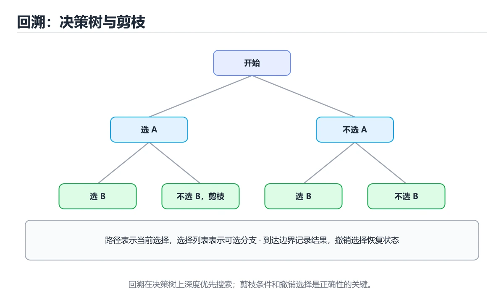
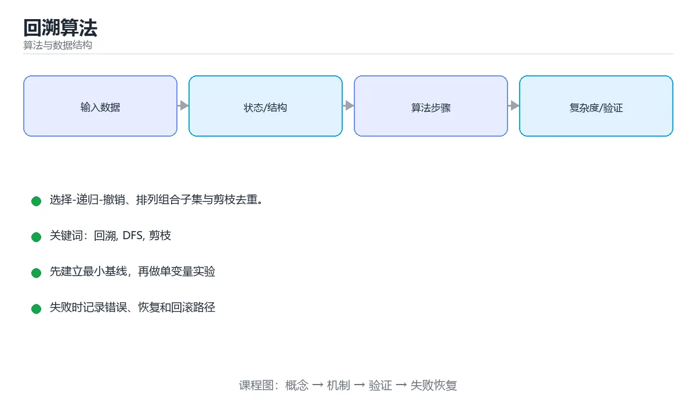

# 回溯算法





> 内容更新时间：2026-10-06 · 学习阶段：进阶 · 预计用时：30 分钟

## 学习目标

- 能用自己的话解释回溯算法解决了什么问题，而不是只背术语。
- 能说清 「回溯」、「DFS」、「剪枝」、「全排列」 之间的关系，并分别举出一个例子。
- 能把本课知识放回「算法与数据结构」的知识体系，说明它和相邻主题的边界。
- 能完成本课练习，并用验收标准检查自己的结果。

> 一句话摘要：选择-递归-撤销、排列组合子集与剪枝去重。

## 前置知识

- 先完成上一课《双指针与滑动窗口》；如果已经掌握，可以直接用本课练习自测。
- 本课阶段：进阶。建议先掌握同一分类的基础课程，并能独立运行正文中的最小示例。
- 开始前先复习：回溯、DFS、剪枝。
- 如果某一步看不懂，先记录具体卡点，完成练习后再回头读一遍。

## 核心模型

回溯 = 深度优先搜索 + 状态撤销。它穷举所有候选解，但在发现当前路径不可能产生合法解时立即剪枝。

```text
def backtrack(路径, 选择列表):
    if 满足结束条件:
        记录结果
        return
    for 选择 in 选择列表:
        做选择          # 修改状态
        backtrack(...)
        撤销选择        # 恢复状态（回溯）
```

三个关键动作：**选择、递归、撤销**。忘记撤销是回溯题最常见的 bug。

## 全排列

```python
def permute(nums):
    result, path, used = [], [], [False] * len(nums)
    def backtrack():
        if len(path) == len(nums):
            result.append(path[:])       # 拷贝！否则后续修改会影响结果
            return
        for i, value in enumerate(nums):
            if used[i]:
                continue
            used[i] = True
            path.append(value)
            backtrack()
            path.pop()                    # 撤销选择
            used[i] = False
    backtrack()
    return result
```

## 子集与组合

```python
def subsets(nums):
    result = []
    def backtrack(start, path):
        result.append(path[:])            # 每个节点都是合法解
        for i in range(start, len(nums)): # start 保证不重复、不回看
            path.append(nums[i])
            backtrack(i + 1, path)
            path.pop()
    backtrack(0, [])
    return result

def combination_sum(candidates, target):
    result = []
    def backtrack(start, remaining, path):
        if remaining == 0:
            result.append(path[:]); return
        if remaining < 0:
            return                        # 剪枝：已超目标
        for i in range(start, len(candidates)):
            path.append(candidates[i])
            backtrack(i, remaining - candidates[i], path)   # 可重复选：传 i
            path.pop()
    backtrack(0, target, [])
    return result
```

## 去重技巧

「含重复元素的组合」需要在同一层跳过重复值：

```python
nums.sort()                               # 先排序，让相同元素相邻
for i in range(start, len(nums)):
    if i > start and nums[i] == nums[i - 1]:
        continue                          # 同层跳过重复分支
```

注意区分「同层去重」（i > start）与「同路径去重」（used 数组），二者含义不同。

## 经典题型地图

| 类型 | 例子 |
| --- | --- |
| 排列 | 全排列、N 皇后 |
| 组合 | 组合总和、电话号码字母组合 |
| 子集 | 幂集、分割回文串 |
| 棋盘 | 数独、N 皇后 |
| 图搜索 | 单词接龙、岛屿数量（DFS 染色） |

## 复杂度与剪枝

回溯的复杂度通常是指数级（`O(n!)` 或 `O(2ⁿ)`），因此剪枝决定能否通过：

1. 提前判断剩余是否已超过目标。
2. 排序后用 `start` 限制后续选择范围。
3. 用访问标记避免重复访问。
4. 记忆化（把状态映射到结果）可把部分问题降为动态规划。

## 剪枝带来的实际差距

以「组合总和」为例，在同一个数据集上对比三种实现（数据量为 20 个候选、目标值为中等规模）：

| 实现 | 搜索节点量级 | 相对耗时 | 关键改动 |
| --- | --- | --- | --- |
| 朴素回溯（无剪枝） | 指数级，可达百万级节点 | 基准 1× | 每次递归枚举全部候选 |
| 排序 + 超限剪枝 | 显著下降，通常降一个数量级 | 0.1× 左右 | 剩余值小于 0 立即返回；候选排序后可提前 break |
| 再加同层去重 | 进一步下降（重复元素多时效果明显） | 再降 30%~70% | 排序后跳过同层相同值 |

三条最能提升性能的剪枝：

1. **可行性剪枝**：剩余目标为负或超出上限时立刻返回。
2. **排序 + 提前终止**：候选排序后，一旦当前值已超限，后续更大的值都不必再试（break 而非 continue）。
3. **同层去重**：同一层跳过重复值，避免生成重复解。

度量方法：在递归入口自增计数器，统计搜索节点数——比只看运行时间更稳定，也能直观看出剪枝的效果。回溯题的复杂度通常是指数级，**剪枝决定能否通过，而不是常数优化**。

## 本课小结

回溯的解题套路是固定的：**定义路径与选择列表、写终止条件、循环中做选择与撤销**。画一棵决策树，往往比盯着代码更快找到剪枝点。

## 回溯模板

```text
def backtrack(state, choices, result):
    if 到达终止条件(state):
        result.append(state[:])      # 必须拷贝，否则后续修改会影响已收集结果
        return
    for choice in choices:
        if not 合法(choice):         # 剪枝
            continue
        做选择(choice)
        backtrack(state, 下一步选择, result)
        撤销选择(choice)             # 关键：恢复现场
```

```python
def subsets(nums):
    """子集：每个元素选或不选，共 2 的 n 次方个结果。"""
    result, path = [], []

    def dfs(start):
        result.append(path[:])
        for i in range(start, len(nums)):
            path.append(nums[i])
            dfs(i + 1)
            path.pop()

    dfs(0)
    return result

def permutations(nums):
    """全排列：用 used 数组避免重复使用同一位置。"""
    result, path = [], []
    used = [False] * len(nums)

    def dfs():
        if len(path) == len(nums):
            result.append(path[:])
            return
        for i, value in enumerate(nums):
            if used[i]:
                continue
            used[i] = True
            path.append(value)
            dfs()
            path.pop()
            used[i] = False

    dfs()
    return result

def combination_sum(nums, target):
    """可重复选取的组合之和：排序后剪枝，同层去重。"""
    nums.sort()
    result, path = [], []

    def dfs(start, remain):
        if remain == 0:
            result.append(path[:])
            return
        for i in range(start, len(nums)):
            if nums[i] > remain:                 # 剪枝：后面的更大
                break
            if i > start and nums[i] == nums[i - 1]:
                continue                         # 同层去重
            path.append(nums[i])
            dfs(i, remain - nums[i])
            path.pop()

    dfs(0, target)
    return result
```

## 剪枝手段速查

| 手段 | 说明 |
| --- | --- |
| 排序后提前终止 | 当前值超出限制即 `break` |
| 同层去重 | `i > start and nums[i] == nums[i-1]` 跳过 |
| 可行性上界 | 剩余元素全用上也不够，直接剪掉 |
| 下界剪枝 | 已经凑够目标，立即收集并返回 |
| 使用标记数组 | 避免同一位置被重复选 |
| 记忆化 | 相同子问题只算一次（此时更接近 DP） |

## 常见错误与排查

| 容易写错的做法 | 实际现象 | 原因与正确做法 |
| --- | --- | --- |
| 收集结果时直接 `result.append(path)` | 所有结果都变成最后一次的内容 | 必须 `path[:]` 拷贝 |
| 忘记撤销选择 | 状态污染，结果错乱 | 递归返回后立刻恢复现场 |
| 去重条件漏掉 `i > start` | 合法解被误删 | 加同层限制 |
| 不做剪枝 | 大数据超时 | 排序加越界 `break` |
| 排列问题不用 `used` | 元素被重复使用 | 用标记数组或交换法 |
| 递归终止条件写错 | 死循环或漏解 | 明确「解的长度」或「剩余目标」 |
| 状态对象被多分支共享 | 分支互相影响 | 每分支独立拷贝或成对做与撤销 |
| 用回溯解本可 DP 的问题 | 指数级超时 | 先判断是否可用 DP |
| 忽略重复元素 | 产生重复解 | 先去重或同层跳过 |
| 递归深度过大 | 栈溢出 | 限制深度或改迭代 |

## 复习与自测

- [ ] 能默写「选择、递归、撤销」的回溯模板。
- [ ] 收集结果时一定做深拷贝。
- [ ] 会用 `i > start` 去重避免重复解。
- [ ] 排序后用 `break` 做剪枝。
- [ ] 能判断问题该用回溯还是 DP。

## 动手练习

> 本课练习重点：围绕「回溯、DFS、剪枝」完成复述、实验和交付，每个结果都要能被别人检查。

先手算 8 个元素的状态变化，再实现并统计操作次数与复杂度。

### 练习 1：建立心智模型（10 分钟）

合上教程，用 3～5 句话回答：

1. 回溯算法解决了什么问题？
2. 如果没有它，会出现什么具体后果？
3. 它和「DFS」是什么关系？

**验收标准**：至少出现一个本课关键词，并写出一个反例、边界条件或失效场景。

### 练习 2：做一次可控实验（20 分钟）

从正文中选一个最小示例，完成以下操作：

1. 先预测修改一个参数、输入或步骤后的结果。
2. 再实际执行或逐步推演，记录真实结果。
3. 如果结果与预测不同，写出差异原因。

**验收标准**：留下「原例 → 改动 → 预测 → 结果 → 原因」五步记录。

### 练习 3：交付一个小结果（30 分钟）

给定 8～12 个手工构造的数据，写出每一步状态，并统计比较或交换次数。

任务要求：

- 结果必须能被别人检查，不能只写“我已经理解了”。
- 至少覆盖「回溯」和「DFS」两个关键词。
- 写出 1 个仍然不确定的问题，以及下一步如何验证。

> 提示：时间有限时优先做练习 1 和练习 2；练习 3 可以拆成两次完成。

## 可运行练习

### 任务 1：先跑通，再解释

```python
def permute(nums):
    result, path, used = [], [], [False] * len(nums)
    def backtrack():
        if len(path) == len(nums):
            result.append(path[:])       # 拷贝！否则后续修改会影响结果
            return
        for i, value in enumerate(nums):
            if used[i]:
                continue
            used[i] = True
            path.append(value)
            backtrack()
            path.pop()                    # 撤销选择
            used[i] = False
    backtrack()
    return result
```

### 任务 2：只改一个条件

把「回溯算法」的最小示例复制一份，只改一个条件再跑一次：

- 改动点：只把回溯的输入换成空值、极值或错误输入，其余保持不变。
- 预测：先写下「回溯算法」在改动后的输出或错误信息，再运行。
- 记录：对照改动前后的结果，指出差异出在哪一步。
- 验收：换回原条件能复现原结果，改动只影响回溯。

### 任务 3：迁移到自己的数据

用同一套思路处理一组你自己的数据或场景，保持输出格式与任务 1 一致。

## 故障现场

### 现场 1：本课的 回溯 常规用例通过，但边界用例失败

**症状**：在本课的练习或生产场景里出现“本课的 回溯 常规用例通过，但边界用例失败”。

**复现**：准备一组最小输入，只保留触发“本课的 回溯 常规用例通过，但边界用例失败”的必要条件，连续运行两次确认结果稳定。

**定位**：围绕“回溯 的前置条件与取值边界没有写进代码，默认值掩盖了空值和极值”检查调用链、输入数据和环境配置，先验证假设再改代码。

**预防**：把“本课的 回溯 常规用例通过，但边界用例失败”写成一条自动化用例，并在本课的验收清单里保留对应检查项。

### 现场 2：本课的 DFS 结果在两次运行之间不一致

**症状**：在本课的练习或生产场景里出现“本课的 DFS 结果在两次运行之间不一致”。

**复现**：准备一组最小输入，只保留触发“本课的 DFS 结果在两次运行之间不一致”的必要条件，连续运行两次确认结果稳定。

**定位**：围绕“DFS 依赖了当前版本、执行顺序或共享状态，单次运行无法暴露差异”检查调用链、输入数据和环境配置，先验证假设再改代码。

**预防**：把“本课的 DFS 结果在两次运行之间不一致”写成一条自动化用例，并在本课的验收清单里保留对应检查项。

### 现场 3：小数据规模结果正确，扩大输入后超时或内存溢出

**定位**：围绕“回溯 的时间或空间复杂度在边界条件下失控，DFS 的常数开销也被低估”检查调用链、输入数据和环境配置，先验证假设再改代码。

## 本课复习清单

离开本课前，逐项确认：

- [ ] 不看解析，能说出「回溯算法的三个核心动作是？」的判断依据。
- [ ] 不看解析，能说出「忘记撤销选择会导致？」的判断依据。
- [ ] 不看解析，能说出「收集结果时写 path[:] 拷贝的原因是？」的判断依据。
- [ ] 不看解析，能说出「回溯中「剪枝」的作用是？」的判断依据。
- [ ] 不看解析，能说出「N 皇后中如何把冲突检测降到 O(1)？」的判断依据。
- [ ] 至少运行一次本课示例，记录输入、输出和一个边界情况。
- [ ] 把本课最容易混淆的两个概念写成一句话对照。

| 复盘项 | 记录 |
| --- | --- |
| 已经能独立解释的考点 |  |
| 仍然说不清的概念 |  |
| 下一步验证动作 |  |

## 术语速查

| 术语 | 本课语境 |
| --- | --- |
| `O(n!)` | 回溯的复杂度通常是指数级（`O(n!)` 或 `O(2ⁿ)`），因此剪枝决定能否通过： |
| `O(2ⁿ)` | 回溯的复杂度通常是指数级（`O(n!)` 或 `O(2ⁿ)`），因此剪枝决定能否通过： |
| `start` | 排序后用 `start` 限制后续选择范围。 |
| `break` | \| 排序后提前终止 \| 当前值超出限制即 `break` \| |
| `i > start and nums[i] == nums[i-1]` | \| 同层去重 \| `i > start and nums[i] == nums[i-1]` 跳过 \| |
| `result.append(path)` | \| 收集结果时直接 `result.append(path)` \| 所有结果都变成最后一次的内容 \| 必须 `path[:]` 拷贝 \| |

## 考点精讲

### 考点 1：代码补全·回溯

- **题目**：阅读「回溯算法」正文里的这段 Python 代码，下面哪一项判断是正确的？
- **判断依据**：在「回溯算法」里，题干的正确项是这段代码包含条件分支，不同输入会走不同的执行路径，在「回溯算法」里分支条件由回溯决定，替换条件后结论可能变化。把输入或边界换成空值、极值或失败情况后，结论要以「回溯算法」的实际运行结果为准。回到「回溯算法」的正文示例，用“阅读回溯算法正文里的这段 Pytho”走一遍回溯、DFS、剪枝的完整流程，能复现的结论才可以保留。回到正文示例，用“阅读正文里的这段”走一遍回溯、DFS、剪枝的完整流程，能复现的结论才可以保留。

### 考点 2：多选辨析·回溯

- **题目**：围绕“回溯算法”中的 回溯、DFS、剪枝，下列哪两项是本课强调的实践判断？
- **判断依据**：本课把回溯算法拆成概念、示例与故障现场三部分，因此判断 回溯 时必须同时交代输入、输出和失败路径，这使“学习 回溯 时要同时说明输入、输出和失败路径，不能只看正常流程”成立。在回溯算法里，判断 DFS 时要固定版本与边界输入，所以“验证 DFS 时要固定版本并覆盖边界输入，结论才可复现”才可复现。

### 考点 3：概念判断·回溯

- **题目**：收集结果时写 path[:] 拷贝的原因是？
- **判断依据**：在「回溯算法」里，作答时，先用回溯建立输入与输出的基线，再把path 后续会被修改代入边界条件核对，结论才能复现。在「回溯算法」里，如果只凭关键词作答，很容易把「省内存」、「类型要求」与「path 后续会被修改」混在一起；“收集结果时写”与「回溯算法」的术语表相呼应，只有符合回溯、DFS、剪枝约束的“path 后续会被修改”才是正文支持的结论。

### 考点 4：概念判断·剪枝

- **题目**：回溯中「剪枝」的作用是？
- **判断依据**：在「回溯算法」里，结论应落在「提前判断某分支不可能产生合法解」。排序后跳过重复元素、超出预算立即返回都是常见剪枝手段。在「回溯算法」里，这道题要求区分概念与边界，「提前判断某分支不可能产生合法解」只有在题干给出的前提下才成立，而「加快单次递归调用」、「保证找到最优解」缺少同一组条件。

### 考点 5：概念判断·回溯

- **题目**：N 皇后中如何把冲突检测降到 O(1)？
- **判断依据**：在「回溯算法」里，用三个标记数组（列、主对角线、副对角线）或位掩码记录占用情况。同一主对角线上 row-col 相同、副对角线上 row+col 相同，可用数组下标直接标记。“皇后中如何把冲突检测降到”与「回溯算法」的术语表相呼应，只有符合回溯、DFS、剪枝约束的“用三个标记数组（列、主对角线”才是正文支持的结论。

### 考点 6：填空·回溯

- **题目**：补全代码：「回溯算法」示例中，下面这行代码缺少哪个关键字或函数名？请填入 ____。 `def ____(路径, 选择列表):`
- **判断依据**：在「回溯算法」里判断这道题，要把回溯、DFS、剪枝的条件、过程与失败路径逐项对齐，换成“补全代码”这个场景，只有满足前提的结论才成立。“回溯算法示例中”与「回溯算法」的术语表相呼应，只有符合回溯、DFS、剪枝约束的“backtrack”才是正文支持的结论。“backtrack”与术语表相呼应，只有符合回溯、DFS、剪枝约束的“backtrack”才是正文支持的结论。

## English Overview

**Title:** Backtracking

**Summary:** Choose-recurse-undo and pruning.

**Category:** Algorithms
**Level:** 进阶
**Key terms:** 回溯, DFS, 剪枝, 全排列, 组合

## 内容元数据

- 内容版本：v2.0
- 最后更新：2026-10-06
- 学习阶段：进阶
- 适用环境：任意主流语言（伪代码与复杂度为主）
- 内容来源：内置结构化课程与工程实践整理
- 相关主题：回溯、DFS、剪枝、全排列、组合
- 质量版本：P0 测验标准 + P1 覆盖扩展 + P2 体验补全

## 参考资料与复核

- 最后复核：2026-10-04
- 下次复核：2027-04-04
- 复核范围：版本兼容、API 行为、安全建议与工程实践
- 来源性质：官方文档、标准或权威教材；正文为离线教学重组

| 参考资料 | 本课用途 |
| --- | --- |
| [CP-Algorithms](https://cp-algorithms.com/) | 算法实现与复杂度 |
| [MIT 6.006](https://ocw.mit.edu/courses/6-006-introduction-to-algorithms-spring-2020/) | 算法设计与分析 |
| [RFC 算法与协议](https://www.rfc-editor.org/) | 协议中的算法约束 |

> 「回溯算法」的链接用于离线阅读后的延伸核对；App 不会自动联网。
